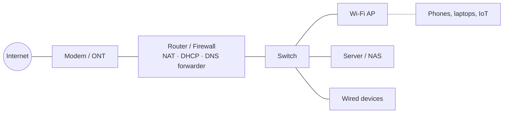
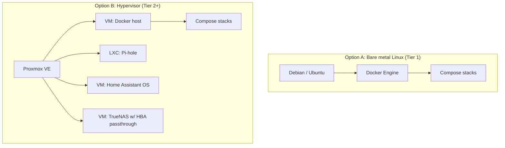
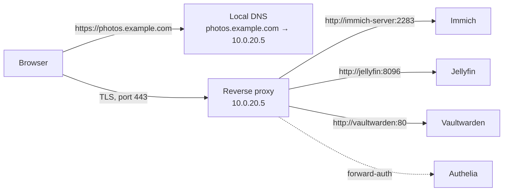
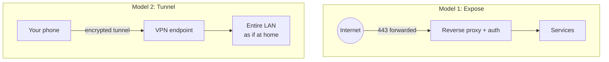

# The Self-Hosting & Home Lab Guide

> A comprehensive, opinionated, in-depth guide to services worth self-hosting — and everything around them.

*Generated 2026-09-07 from the chapter sources in `guide/`. 10 chapters, ~41,274 words. Web version: see `docs/` or the repository README. Source: https://github.com/gorg667/self-host-guide*


## Table of contents


**Part I — Foundations**

- [00. Introduction: What Self-Hosting Is and Why It Matters](#introduction-what-self-hosting-is-and-why-it-matters)
- [01. Planning Your Home Lab](#planning-your-home-lab)
- [02. Hardware: Choosing What to Run It On](#hardware-choosing-what-to-run-it-on)
- [03. Networking Fundamentals for the Home Lab](#networking-fundamentals-for-the-home-lab)
- [04. Operating Systems and Hypervisors](#operating-systems-and-hypervisors)
- [05. Containers: Docker, Compose, Podman, and Kubernetes](#containers-docker-compose-podman-and-kubernetes)
- [06. Storage: Filesystems, Redundancy, and Sharing](#storage-filesystems-redundancy-and-sharing)

**Part II — Core infrastructure**

- [07. Reverse Proxies and TLS Certificates](#reverse-proxies-and-tls-certificates)
- [08. Remote Access and VPNs](#remote-access-and-vpns)
- [09. DNS and Network-Wide Ad Blocking](#dns-and-network-wide-ad-blocking)

---

# Introduction: What Self-Hosting Is and Why It Matters

Self-hosting means running the software services you rely on — file storage, photo libraries, media streaming, password managers, home automation, chat, notes, even AI assistants — on hardware you own and control, rather than renting them from a cloud provider. A *home lab* is the environment where you do it: anything from a single Raspberry Pi under the TV to a rack of second-hand enterprise servers in the garage.

This guide is a comprehensive, opinionated, and deliberately deep treatment of both halves of that sentence: the **services** worth self-hosting (with honest reviews and comparisons), and the **everything else** — hardware, networking, storage, containers, reverse proxies, remote access, identity, backups, monitoring, security, automation, power, and the operational discipline that separates a hobby that brings joy from one that becomes a second job.

## Why people self-host

The reasons people give tend to fall into a handful of clusters. You will probably recognise yourself in more than one.

### Privacy and data ownership

When your photos live on someone else's servers, they are subject to that company's terms of service, its scanning policies, its data-retention practices, its acquisitions, and its bankruptcies. When they live on a disk you own, behind encryption you control, none of that applies. This is the most commonly cited reason and it is a good one, but be honest about what you are buying: privacy from *third parties*, not security in any absolute sense. A misconfigured self-hosted service exposed to the internet is a far bigger privacy risk than a competently run cloud service. [Chapter 13](13-security.md) exists for exactly this reason.

### Cost

The economics are genuinely favourable for storage-heavy workloads. 2 TB of cloud storage costs on the order of USD 100–120 per year from mainstream providers; a 4 TB NAS-grade hard drive costs about the same *once*, and a modest mini PC to serve it costs USD 150–400 used. Over a five-year horizon, self-hosting media, photos, and files is cheaper for almost everyone, even after electricity and replacement drives.

The economics are *not* favourable for compute-light, expertise-heavy services. Running your own email server saves you perhaps USD 50 per year and costs you a dozen hours of setup plus recurring deliverability headaches. [Chapter 20](20-communication.md) discusses this candidly. Be realistic: your time has value, and the point of a home lab should be that you *enjoy* spending it.

### Learning

A home lab is the best IT education money can buy. Concepts that are abstract in a textbook — subnets and VLANs, TLS certificates, reverse proxies, ZFS, containers, backup strategy, identity providers — become concrete when you have to make them work at 11 pm because the family cannot watch a film. Many professional systems administrators, DevOps engineers, and SREs credit a home lab for their career, and for good reason: the skills transfer directly.

### Independence from vendor decisions

Services get discontinued (Google has a well-documented graveyard), features get moved behind paywalls, prices get raised, APIs get closed, and terms of service get changed unilaterally. A self-hosted stack built on open-source software cannot be taken away from you. Even when a project is abandoned, you keep the last working version and your data in an open format.

### Capability

Some things are simply not available as a service, or are available only in a hobbled form. Local AI inference on your own GPU with no per-token cost and no content filters. A media server with lossless audio and full-quality 4K HDR remuxes. Home automation that works when the internet is down. Network-wide ad blocking for every device including smart TVs. Object storage with no egress fees. These are things the cloud either cannot or will not sell you.

### Fun

Do not underestimate this one. Tinkering is intrinsically rewarding for a certain kind of person. If you are reading a guide this long, you are probably that kind of person.

## Who this guide is for

This guide is written for three audiences at once, and the structure is designed so that each can find their path.

**The beginner** who has heard about Plex or Home Assistant, has a spare laptop or is thinking about buying a mini PC, and wants to understand what they are getting into before they start. If that is you, read Part I (Foundations) in order. It will take a few hours and it will save you weeks.

**The intermediate self-hoster** who already runs a few Docker containers on a Synology or an Ubuntu box, has hit the limits of port-forwarding-and-hope, and wants to do things properly: a reverse proxy with real certificates, a VPN, a backup strategy that has actually been tested, monitoring that alerts before the family does. Part II (Core Infrastructure) is written for you.

**The experienced administrator** who knows all of that and wants a well-researched, current comparison of what to run for a given need — which photo manager, which notes app, which identity provider — with the trade-offs laid out honestly. Part III (Application Services) is a set of category reviews written for you, and Part IV (Operations) covers the discipline of keeping it all running.

## What this guide is not

It is not a step-by-step tutorial for any single piece of software. Upstream documentation does that better and stays current; we link to it. What we add is *judgement*: which tool to pick, why, what it will cost you in time and resources, and what will go wrong.

It is not neutral. Where there is a clear best choice for most people, the guide says so. Where the choice genuinely depends on your situation, the guide says that too and tells you which questions to ask yourself. Opinions are flagged as opinions.

It is not a substitute for reading the documentation of the software you deploy. Nothing is.

## The philosophy of a sustainable home lab

Twenty years of collective community experience — visible in every "I gave up on self-hosting" post and every "here is my lab five years later" retrospective — distils into a few principles. They are opinions, but they are widely held ones.

### Start small and grow deliberately

The single most common failure mode is over-building. Someone reads about Proxmox clusters and Ceph and 10 GbE and buys three servers before running a single service. Six months later the rack is drawing 400 W, half the services are broken because an update was never finished, and the whole thing gets sold at a loss.

Start with one machine. Run three or four services that you will actually use daily. Learn to back them up and restore them. *Then* expand. Every chapter in this guide has a "starter" option for a reason.

### Boring is good

For infrastructure, prefer mature, widely deployed, well-documented software with a large community. Debian over the newest distribution. Docker Compose over a bleeding-edge orchestrator. PostgreSQL over whatever database was announced last quarter. WireGuard over a novel VPN protocol. The excitement in a home lab should come from *what you do* with the platform, not from fighting the platform itself.

This is also why this guide is somewhat conservative in its recommendations. There is always a shinier alternative. Shiny tends to be less documented, less tested, and more likely to be abandoned.

### Everything fails; plan for it

Drives die. Power goes out. Updates break things. You will fat-finger `rm -rf` on the wrong directory eventually. A home lab that has not planned for these events is a time bomb, and the fuse is usually shorter than people expect.

The corollary is the single most important sentence in this guide: **a backup you have not restored from is not a backup.** [Chapter 11](11-backups.md) is long for a reason.

### Complexity is a cost

Every service you run is a thing that needs updating, monitoring, backing up, and eventually migrating. Every network segment is a set of firewall rules to maintain. Every layer of abstraction is a place a bug can hide. Add complexity only when the benefit clearly exceeds the ongoing cost — and periodically ask whether that is still true. Decommissioning a service you no longer use is one of the most valuable things you can do.

### Write it down

Your future self, six months from now, will not remember why port 8096 is forwarded or which container owns that Postgres database. Document your setup as you build it. Keep your configuration in Git. [Chapter 28](28-maintenance-operations.md) covers documentation and runbooks; [Chapter 27](27-automation-iac.md) covers keeping configuration as code so that the documentation *is* the deployment.

### Security is a process, not a product

No single tool makes you secure. A reasonable posture for a home lab is: don't expose things to the internet unless you must; when you must, put them behind a reverse proxy with TLS and preferably authentication; keep software updated; segment your network so that a compromised IoT device cannot reach your NAS; and have backups that a ransomware event cannot reach. [Chapter 13](13-security.md) expands on each of these.

## How the guide is structured

The guide is organised into four parts and thirty-five chapters. Each chapter is self-contained enough to be read alone, with cross-references where concepts depend on each other.

**Part I — Foundations** (Chapters 0–6) covers the decisions you make before running a single service: what you want to achieve, what hardware to buy, how to lay out your network, which operating system or hypervisor to run, how containers work and why they matter, and how to store data safely.

**Part II — Core infrastructure** (Chapters 7–13) covers the services that every other service depends on: reverse proxies and TLS certificates, remote access and VPNs, DNS and ad-blocking, identity and single sign-on, backups, monitoring and alerting, and security.

**Part III — Application services** (Chapters 14–26) is the review section. Each chapter takes a category — media, photos, files, notes, home automation, communication, passwords, development tools, AI, gaming, and more — and compares the leading self-hostable options with recommendations.

**Part IV — Operations and reference** (Chapters 27–34) covers keeping it running: infrastructure as code, maintenance discipline, power and cost, legal and ethical considerations, complete reference architectures at three scales, troubleshooting, community resources, and appendices.

### Conventions used throughout

- Commands are shown for Debian/Ubuntu-family Linux unless stated. Almost everything translates directly to other distributions.
- `docker-compose.yml` snippets are *minimal working examples*. They deliberately omit reverse-proxy labels, external networks, and secrets handling, all of which are covered in the infrastructure chapters and would triple the length of every snippet. Treat them as starting points, not production configurations.
- Resource requirements (RAM, CPU, storage) are rough figures for a small household (one to five users) and are noted as such. Your mileage will vary.
- Prices are approximate USD figures as of 2026 and are given to convey order of magnitude, not to be quoted.
- "As of 2026" marks claims about software versions or project status that will age. Check upstream before relying on them.
- Callouts are used for tips, warnings, and notes:

> **Tip**
>
> Practical advice that will save you time.


> **Warning**
>
> Something that will cost you time, data, or money if ignored.


> **Danger**
>
> Something that can cause data loss or a security incident.


> **Note**
>
> Context, nuance, or a tangent worth knowing.


## Responsibilities you are taking on

Self-hosting is an exchange: you give up someone else's operational competence in return for control. It is worth being explicit about what you are signing up for, because the people who burn out are usually the ones who did not.

**You are the sysadmin.** When a disk fails at 2 am, nobody else will replace it. When an update breaks the photo app your partner uses, nobody else will roll it back. If you are hosting services for other people — family, friends — you have implicitly promised them a level of availability, and you should think about what that promise is and whether you can keep it. [Chapter 30](30-legal-ethical.md) talks about hosting for others.

**You are the security team.** Every exposed port is your responsibility. Every CVE in software you run is yours to patch. The good news is that the baseline of "don't expose things, use a VPN, keep updated" gets you most of the way. The bad news is that there is no one to blame if you skip it.

**You are the backup administrator.** Cloud services have redundancy you never see. Your single NAS with a single copy of your family photos has none. Until you have an off-site copy and have tested restoring from it, you have not finished setting up.

**You are the documentation team.** See above.

None of this is meant to discourage. Tens of thousands of people run home labs successfully and enjoy them enormously. It is meant to set expectations so that you make choices — about scale, about which services to expose, about how much to promise others — that you can sustain.

## A note on the state of self-hosting in 2026

The landscape has matured remarkably. A few observations that inform the recommendations in this guide:

- **Docker Compose is the lingua franca.** Nearly every self-hostable project ships a `docker-compose.yml`. Kubernetes has a place in home labs for people who want to learn it, but it is not necessary and usually not advisable for running a household's services. [Chapter 5](#containers-docker-compose-podman-and-kubernetes) discusses when it makes sense.
- **Mini PCs have displaced both Raspberry Pis and enterprise servers** for most people. An Intel N100/N150 or a used business desktop draws 6–15 W idle, costs USD 120–300, and comfortably runs twenty containers. [Chapter 2](#hardware-choosing-what-to-run-it-on) is largely about this shift.
- **Mesh VPNs solved remote access.** Tailscale (and its self-hosted coordinator Headscale), NetBird, and similar tools made "access my home lab from anywhere without port forwarding" a fifteen-minute task even behind CGNAT. Most people no longer need to expose anything to the internet. [Chapter 8](#remote-access-and-vpns) covers them.
- **Local AI became a legitimate self-hosting category.** Running capable language models, image generation, speech-to-text, and text-to-speech on consumer GPUs is now practical and is one of the strongest reasons to add a GPU to a home lab. [Chapter 23](23-ai-llm.md) is new territory for many.
- **Immich made self-hosted photos viable for normal people.** For years the honest advice was "keep using Google Photos." That is no longer true. [Chapter 16](16-photos.md) explains why.
- **Licensing is a live issue.** Several popular projects have moved from open source to source-available or "fair" licences, and a few have been acquired or have added paywalled tiers. This guide notes the licence of each service reviewed and [Chapter 30](30-legal-ethical.md) explains what the distinctions mean for you.
- **The community is enormous and generous.** r/selfhosted, r/homelab, the awesome-selfhosted list, and countless blogs and Discord servers mean that whatever problem you hit, someone has hit it before. [Chapter 33](33-resources-community.md) points to the best of them.

## How to use this guide

If you are new: read Chapters 0 through 6, then set up one machine with Docker and three services from Part III that excite you. Then read Part II and retrofit the infrastructure properly. Then read Chapter 11 and set up backups before you add anything else. That sequence — services first for motivation, infrastructure second for sustainability, backups before growth — is the path that produces home labs still running five years later.

If you are intermediate: skim Part I to check for gaps, read Part II carefully, and browse Part III for services you had not considered.

If you are experienced: Part III and Part IV are for you. Chapter 31 (Reference Architectures) may be a useful sanity check against your own design.

Whatever your level, the appendix has a glossary, a port reference, and checklists that are useful to keep open in a tab.

Welcome. Let's build something that you own.

---

# Planning Your Home Lab

The most expensive mistakes in self-hosting are made before any hardware is bought. This chapter is about the decisions that come first: what you actually want, how big to build, what it will cost in money and electricity and time, and where it will physically live. Read it even if you already own hardware — the questions still apply.

## Start with the services, not the hardware

The correct order is: decide what you want to *do*, derive the requirements, then choose hardware. The common order is the reverse, and it produces either a machine that cannot transcode 4K when the family wants to watch a film, or a 48-core dual-socket server that idles at 250 W running a Pi-hole.

Write down — actually write down — the services you intend to run in the first six months. Be honest and be specific. "Media server" is not specific; "Jellyfin, serving two simultaneous 1080p streams, occasionally one 4K HEVC stream to a TV that cannot direct-play it" is specific, and it tells you that you need a CPU with a hardware video encoder (see [Chapter 15](15-media.md)).

Then, for each service, note four things:

1. **Compute**: is it idle most of the time (almost everything), or does it need sustained CPU or a GPU (transcoding, AI inference, game servers, photo ML)?
2. **Memory**: most containers need 50–500 MB; a few (Nextcloud with its database, Immich with machine learning, GitLab, Home Assistant with many integrations, any LLM) need gigabytes.
3. **Storage**: capacity, growth rate, and whether it is *precious* (irreplaceable photos and documents) or *replaceable* (media you could re-acquire). This distinction drives your entire backup design.
4. **Availability**: what happens if it is down for a day? If the answer is "nothing," it can go on the same box as everything else. If the answer is "the house has no DNS and nobody can browse the web," it needs redundancy or at least a fallback.

A typical first list looks like this:

| Service | Compute | RAM | Storage | If down for a day |
|---|---|---|---|---|
| Pi-hole / AdGuard | negligible | 100 MB | negligible | Whole household loses DNS — needs a fallback |
| Jellyfin | bursty; transcoding needs iGPU | 500 MB–2 GB | Media library: 2–20 TB, replaceable | Annoying |
| Immich | ML bursts on upload | 2–4 GB | Photos: 200 GB–2 TB, **precious** | Phone keeps photos locally, fine |
| Vaultwarden | negligible | 50 MB | tiny, **precious** | Clients cache the vault, fine |
| Home Assistant | light | 1–2 GB | small, precious (config) | Lights still work via switches, automations stop |
| Nextcloud / Syncthing | light | 1 GB | Documents: 50–500 GB, **precious** | Annoying |
| Uptime Kuma | negligible | 100 MB | tiny | Nothing |

Sum the RAM (this one comes to ~8 GB with headroom), note the single "needs hardware transcode" requirement, note the split between precious and replaceable storage, and you have a hardware spec: a mini PC with an Intel iGPU, 16 GB RAM, a small SSD for the OS and containers, and a separate storage solution. That is a far more useful conclusion than "I should probably get a server."

## The three tiers

Throughout this guide, recommendations are grouped into three tiers. They are not rigid and most labs sit between two of them, but naming them makes it easier to talk about trade-offs. [Chapter 31](31-reference-architectures.md) gives a complete blueprint for each.

### Tier 1 — Starter

**One machine, ~10–25 W, USD 150–500 all in.** A mini PC (Intel N100/N150 or a used business desktop like a Lenovo ThinkCentre Tiny or Dell OptiPlex Micro), 16 GB RAM, an NVMe SSD for the system, and one or two USB or internal drives for data. Runs Debian or Ubuntu with Docker Compose, or a turnkey OS like CasaOS/Cosmos/Umbrel for people who want a GUI.

Good for: 5–20 containers, a household of 1–4, media streaming, photos, files, password manager, DNS, home automation.

Limitations: no storage redundancy (so backups are *not optional*), one point of failure, limited to what an iGPU can transcode.

This is where almost everyone should start, and where a large fraction of happy self-hosters stay forever.

### Tier 2 — Intermediate

**Two to three machines, ~40–100 W, USD 600–2,000.** Typically a compute node (a more capable mini PC or small-form-factor desktop running Proxmox) plus a dedicated NAS (TrueNAS, Unraid, or a commercial Synology/QNAP/UGREEN unit) with 4–8 drives in a redundant array, plus perhaps a Raspberry Pi or second mini PC for critical low-power services (DNS, VPN endpoint, monitoring) that should stay up when the main box is being rebuilt. A managed switch with VLANs and a proper router/firewall (OPNsense or similar).

Good for: 20–60 services, a household of several people plus extended family, network segmentation, proper backup targets, some VMs alongside containers.

Limitations: still a single site; more things to update; power bill becomes noticeable.

### Tier 3 — Advanced

**A rack or a shelf full of it, 100–400 W+, USD 2,000–10,000+.** Multiple hypervisor nodes (often clustered Proxmox with shared or replicated storage), 10 GbE or faster between nodes, a dedicated storage server with dozens of terabytes, a UPS that can carry the load through a real outage, a discrete GPU or two for AI workloads and transcoding, possibly a Kubernetes cluster because you want to learn it, and often a small VPS in the cloud as an ingress point and off-site backup target.

Good for: learning enterprise patterns, high availability, heavy AI/ML, serving dozens of users, running a small business.

Limitations: it is a part-time job. Electricity alone at 300 W is roughly USD 300–800 per year depending on where you live. Noise and heat become real problems. Complexity compounds.

> **Tier 3 is a destination, not a starting point**
>
> Almost nobody who starts at Tier 3 is still running it two years later. Almost everybody who starts at Tier 1 and grows to Tier 3 because their needs demanded it is still running it. Grow because you must, not because you can.


## Budget: the full picture

Hardware is the visible cost and usually not the largest one over a five-year horizon. Budget for all of it.

### Capital costs

- **Compute.** USD 100–300 for a used business mini PC with 16 GB RAM; USD 150–250 for a new N100/N150 box; USD 400–900 for a capable Ryzen or Core mini PC with 32–64 GB; USD 300–1,500 for a self-built SFF or tower.
- **Storage.** As of 2026, roughly USD 15–25 per TB for NAS-grade hard drives (cheaper per TB at larger capacities, 16–24 TB drives being the sweet spot), USD 50–80 per TB for consumer NVMe SSDs. Plan for the number of drives your redundancy scheme needs, not the number you would like to have (see [Chapter 6](#storage-filesystems-redundancy-and-sharing)).
- **NAS enclosure or case.** USD 0 (use the mini PC's bays) to USD 300–800 (4–8 bay commercial NAS or a DIY case with hot-swap bays).
- **Networking.** USD 0 if you use the ISP router, USD 100–250 for a decent managed switch and a small firewall box. More for Wi-Fi access points, 10 GbE, or PoE.
- **UPS.** USD 100–250 for a 600–1,000 VA line-interactive unit adequate for a Tier 1–2 lab. Essential once you have a ZFS pool or anything else that dislikes unclean shutdowns. See [Chapter 29](29-power-cost-environment.md).
- **Miscellaneous.** Cables, a USB-to-serial adapter, a spare SSD, a label maker. Budget USD 50–100 and you will spend it.

### Recurring costs

- **Electricity.** The dominant recurring cost. Compute the annual cost as `watts × 8.76 × price_per_kWh`. A 15 W mini PC at USD 0.15/kWh is USD 20/year. A 150 W tower is USD 197/year. At European prices (USD 0.30–0.40/kWh) double those figures. [Chapter 29](29-power-cost-environment.md) covers measurement and reduction.
- **Off-site backup storage.** USD 5–7 per TB per month for Backblaze B2 or similar; a Hetzner Storage Box is cheaper at volume (roughly USD 4/month for 1 TB, USD 13/month for 5 TB as of 2026). A second machine at a friend's house costs electricity there and a favour.
- **Domain name.** USD 10–15/year. You want one; it makes TLS certificates trivial (see [Chapter 7](#reverse-proxies-and-tls-certificates)).
- **VPS** (optional). USD 4–6/month for a small instance that acts as a public ingress point if you are behind CGNAT, or as a Headscale/Netbird coordinator, or as an Uptime Kuma instance watching your home from outside.
- **Drive replacements.** Assume a 2–5% annual failure rate per drive. With six drives, expect to replace one roughly every three to five years. Budget the cost of one drive per year and you will usually be under.
- **Your time.** Genuinely the largest cost. A Tier 1 lab needs perhaps two hours a month once stable. Tier 2 needs four to eight. Tier 3 can easily consume every weekend if you let it.

### A five-year cost example

Tier 1, a mini PC (USD 250) with two 8 TB drives (USD 320) and a small UPS (USD 120), drawing 20 W average at USD 0.20/kWh, with 1 TB of off-site backup and a domain:

| Item | Cost |
|---|---|
| Hardware (one-time) | USD 690 |
| Electricity (5 years) | USD 175 |
| Off-site backup (5 years, ~USD 6/mo) | USD 360 |
| Domain (5 years) | USD 65 |
| One drive replacement | USD 160 |
| **Total** | **USD 1,450** |

For comparison, 2 TB of mainstream cloud storage plus a streaming service plus a password manager subscription for the same household over five years is in the region of USD 1,500–2,500, and you would own nothing at the end of it. Self-hosting is not a way to save large amounts of money, but at Tier 1 it roughly breaks even while giving you vastly more capability and control. At Tier 3 it is a hobby with hobby-sized costs, and that is fine as long as you know it.

## Power, heat, noise, and space

These four are related and usually underestimated.

**Power** determines the electricity bill and the size of UPS you need. Modern mini PCs idle at 6–15 W. A used enterprise 1U or 2U server idles at 80–200 W *before* you add drives, and its fans are designed for a data centre. The single most impactful hardware decision for your running costs is choosing low-idle-power components. [Chapter 2](#hardware-choosing-what-to-run-it-on) and [Chapter 29](29-power-cost-environment.md) go into detail.

**Heat** follows power: every watt becomes heat. 20 W is nothing. 300 W in a closet with no airflow will cook drives (which want to stay under about 40 °C for longevity) and eventually the room. If you are going beyond Tier 1, think about where the hot air goes.

**Noise** is the factor that gets hardware evicted from living spaces. A mini PC is silent or nearly so. A 4-bay NAS with hard drives produces a low hum and occasional clicking that most people tolerate in an office but not a bedroom. An enterprise server sounds like a hair dryer at idle and a jet engine under load; it needs a garage, basement, or a dedicated room. Check reviews for measured dB figures and be sceptical of anything described as "quiet" without a number.

**Space**: a mini PC fits behind a monitor. A NAS is the size of a toaster. A rack is a piece of furniture that needs floor space, clearance for airflow, and ideally a solid floor (a populated 24U rack can weigh 100–200 kg). Racks are wonderful for organisation and cable management and genuinely unnecessary for Tiers 1 and 2. If you want one anyway, a 12U wall-mount or a short open-frame rack is much more livable than a full-height enclosed cabinet.

> **Where to put it**
>
> The ideal location has: a wired Ethernet run back to your router (or is next to it), a power outlet that is not shared with a space heater or a vacuum cleaner, ambient temperature under about 27 °C year-round, no direct sunlight, low humidity, and is somewhere you will not trip over it. A closet with a door that can be left ajar, a utility room, or a basement shelf are common. Avoid attics (temperature swings) and the floor of anywhere that could flood.


## Internet connection realities

Your home lab's usefulness from outside the house depends on your internet connection in ways that are worth understanding before you plan remote access.

**Upload bandwidth** is the ceiling for anything you serve remotely: streaming a 4K film from home to a hotel needs 20–40 Mbps sustained upload. Many cable and DSL connections offer 10–40 Mbps up. Fibre often gives you symmetric 100 Mbps to 1 Gbps and changes what is practical. Check your actual measured upload, not the advertised figure.

**Public IPv4 address**: increasingly, ISPs put residential customers behind *carrier-grade NAT* (CGNAT), meaning you share a public IPv4 address with other customers and cannot forward ports at all. Cellular/5G home internet is almost always CGNAT. Some ISPs will give you a real public IP on request or for a small fee. If you are behind CGNAT, you can still do everything in this guide — but you will use a mesh VPN or a tunnel rather than port forwarding (see [Chapter 8](#remote-access-and-vpns)). Find out which you have before designing your remote access. The test: compare the WAN IP your router reports with the IP a site like `ifconfig.me` shows. If they differ, you are behind CGNAT (or a double NAT of your own making).

**IPv6**: many ISPs now provide native IPv6, which gives every device a globally routable address and sidesteps CGNAT entirely for IPv6-capable clients. It is worth enabling and understanding ([Chapter 3](#networking-fundamentals-for-the-home-lab)), though you cannot rely on every remote network you connect from having IPv6.

**Dynamic IP**: most residential connections have a public IP that changes occasionally. This is a minor problem solved with dynamic DNS ([Chapter 9](#dns-and-network-wide-ad-blocking)).

**ISP terms of service**: some ISPs prohibit "running servers" on residential connections. In practice this is almost never enforced against personal home labs with modest traffic, but it is worth reading your ToS ([Chapter 30](30-legal-ethical.md)). Business connections cost more and typically permit servers and include a static IP.

**Data caps**: if your ISP has one, off-site backups and remote streaming count against it. Initial backup seeding of several terabytes can blow through a monthly cap in a day.

## Decide your risk posture early

Two questions determine much of your design:

### What happens if this all disappears?

Divide your data into categories and decide the recovery requirement for each:

- **Irreplaceable** (family photos, personal documents, the password vault, years of notes): must survive a fire, theft, or ransomware. This *requires* an off-site copy, tested regularly. There is no shortcut.
- **Painful to lose** (service configuration, databases, Home Assistant history, Git repositories): should be backed up nightly, off-site if practical. Losing a week of it is annoying, not catastrophic.
- **Replaceable** (a media library that could be re-ripped or re-downloaded, Linux ISOs, Docker images): back up if convenient and cheap; otherwise accept the loss. Do not spend USD 500 protecting data you could recreate for USD 50 in time.

Then design storage and backups ([Chapter 6](#storage-filesystems-redundancy-and-sharing) and [Chapter 11](11-backups.md)) around these categories rather than treating all data the same. Most people over-protect their media library and under-protect their photos.

### What happens if this is compromised?

Think about what an attacker who got onto your network — via an exposed service, a phishing email on a family laptop, or a cheap IoT device with a backdoor — could reach. If the answer is "everything, because it's all on one flat network with default passwords," then network segmentation and a proper authentication layer should be early priorities rather than afterthoughts. [Chapter 3](#networking-fundamentals-for-the-home-lab) covers VLANs; [Chapter 13](13-security.md) covers the rest.

A useful mental framing: **exposure is a cost you pay for convenience.** Every service exposed to the internet is a continuous liability. A mesh VPN gives you nearly the same convenience with a fraction of the exposure. Choose exposure deliberately, for services that genuinely need it (a public website, a service used by people who cannot install a VPN client), and put the rest behind the VPN.

## Choose your abstraction level

There is a spectrum from "turnkey appliance" to "bare Linux and a text editor," and where you sit on it determines both how much you learn and how much you can break.

| Approach | Examples | Learning | Control | Effort |
|---|---|---|---|---|
| Commercial NAS with app store | Synology DSM, QNAP QTS, UGREEN UGOS | Low | Low | Lowest |
| Turnkey self-hosting OS | Umbrel, CasaOS, Cosmos, YunoHost, TrueNAS Apps, Unraid Community Apps | Low–Medium | Medium | Low |
| Linux + Docker Compose (+ a GUI like Portainer/Dockge) | Debian, Ubuntu | Medium–High | High | Medium |
| Hypervisor + VMs/containers | Proxmox VE, XCP-ng | High | Very high | Medium–High |
| Declarative / IaC | NixOS, Ansible-managed hosts, k3s with GitOps | Very high | Very high | High up front, low later |

This guide's centre of gravity is **Linux + Docker Compose**, optionally on Proxmox, because it is the level at which the enormous majority of self-hosting documentation, community help, and project support is written. Turnkey systems are fine for getting started and for people who want an appliance; they are less fine when something breaks and the abstraction gets in the way. [Chapter 4](#operating-systems-and-hypervisors) compares the options in depth.

> **It is fine to not want to learn**
>
> Some people want a photo backup box that works, not a hobby. For them, a Synology or UGREEN NAS with Immich installed via Docker is a legitimate and good answer, and this guide's infrastructure chapters are largely optional. Be honest about which person you are.


## Time commitment and the sustainability check

Before buying anything, run the following thought experiment. Imagine it is eighteen months from now. You have moved house, or changed jobs, or had a child, or simply lost interest. Your lab is still running because the family depends on it. Something breaks.

- Can you fix it in an evening with the documentation you wrote?
- Can you restore from backup if you cannot fix it?
- Could you hand it to a technically competent friend with your notes and have them keep it running?
- If you were to shut it all down, could you get the data out in a standard format and move it elsewhere in a weekend?

If the honest answer to any of these is no, the design is too complex or the documentation is too thin for your circumstances. Simplify. The best home lab is the one that is still running — quietly, boringly, reliably — in five years.

## A planning checklist

Before proceeding to hardware:

- [ ] Listed the specific services for the first six months, with rough RAM/CPU/storage/availability notes.
- [ ] Classified data as irreplaceable / painful / replaceable and know the approximate volume of each.
- [ ] Chosen a tier and know roughly what it costs in hardware, electricity, and time.
- [ ] Know whether you have a public IPv4 address, CGNAT, and/or native IPv6.
- [ ] Measured your upload bandwidth.
- [ ] Picked a physical location with power, wired Ethernet, cooling, and tolerance for the noise level of your chosen hardware.
- [ ] Decided how much you want to expose to the internet (ideally: as little as possible) and how you will do remote access instead.
- [ ] Decided your abstraction level: appliance, turnkey OS, Docker on Linux, or hypervisor.
- [ ] Registered a domain name (or decided you will).
- [ ] Have a plan — even a rough one — for off-site backup of irreplaceable data from day one.

With this done, [Chapter 2](#hardware-choosing-what-to-run-it-on) will feel like shopping with a list rather than browsing with a credit card.

---

# Hardware: Choosing What to Run It On

Hardware is where planning meets a credit card. This chapter covers every category of machine people run home labs on — mini PCs, used business desktops, used enterprise servers, single-board computers, commercial NAS units, and DIY builds — with honest trade-offs, followed by the components that matter most: storage drives, memory, network interfaces, switches, UPS units, racks, and GPUs.

The headline recommendation, stated once here and justified below: **for most people in 2026, the right first machine is a low-power x86 mini PC with an Intel iGPU, 16–32 GB of RAM, and an NVMe SSD, paired with a separate storage solution sized to your data.** Everything else in this chapter is about when and why to deviate from that.

## Guiding principles

**Idle power is the number that matters.** Your lab will spend 95% of its life idle. A machine that idles at 8 W costs USD 10–25 a year to run; one that idles at 120 W costs USD 150–400. Over five years the difference pays for the machine several times over. Always look for measured idle power figures in reviews, and be suspicious of any spec sheet that lists only TDP (which is a thermal design figure, not a consumption figure).

**Used business hardware is the value sweet spot.** Corporations lease desktops for three years and dump them by the pallet. A three-year-old Lenovo ThinkCentre M-series Tiny, Dell OptiPlex Micro, or HP EliteDesk/ProDesk Mini with an 8th-gen or newer Intel Core i5, 16 GB of RAM, and a 256 GB NVMe sells for USD 100–200. These machines are quiet, sip power (8–15 W idle), have Intel Quick Sync for transcoding, and are extraordinarily reliable. The community calls them "TinyMiniMicro" after a well-known review series.

**Buy ECC when it is cheap, don't agonise when it isn't.** Covered in detail below; the short version is that ECC memory is a nice-to-have for a home ZFS NAS, not a requirement, and the internet has spent far too much energy arguing otherwise.

**Buy drives for the workload, not the brand.** CMR vs SMR matters far more than Seagate vs Western Digital. Details below.

**Do not buy enterprise rack servers as a first machine.** They are cheap on eBay for a reason: they are loud, hot, power-hungry, and their hardware RAID controllers and proprietary parts make them awkward. They are wonderful for learning enterprise patterns and for people with a basement and a tolerance for a USD 40/month electricity bump. They are a terrible choice for a first lab.

## Category 1: Mini PCs

The mini PC category has exploded since roughly 2022, driven by Intel's N-series (N100, N150, N305, N355) and AMD's Ryzen mobile chips finding their way into palm-sized boxes from dozens of mostly Chinese brands (Beelink, GMKtec, Minisforum, Aoostar, Trigkey, and many others) plus the established players (Intel NUC — now made by ASUS — Lenovo, Dell, HP).

### Intel N100 / N150 / N305 / N355 boxes

The Intel N100 (and its refresh, the N150) is a four-core, four-thread part with no hyperthreading, a 6 W TDP, and a surprisingly capable iGPU with Quick Sync that handles multiple simultaneous 4K HEVC/AV1 transcodes. Boxes built around it sell for USD 130–220 with 16 GB of RAM and a 500 GB SSD. They idle at 6–10 W.

The N305 and N355 are the eight-core siblings with roughly double the multi-threaded performance for USD 80–150 more. Worth it if you plan to run more than about 20 containers or anything CPU-bound.

**Good for:** Tier 1 labs, dedicated DNS/VPN/monitoring node, Home Assistant, media serving with hardware transcoding, small NAS duty (some models have 2–4 SATA bays or two NVMe slots).

**Watch out for:**

- Most N100 boards officially support only 16 GB of single-channel DDR4/DDR5 in one SODIMM slot. 32 GB SODIMMs generally *work* but are not guaranteed. The single-channel memory is a real bottleneck for memory-bandwidth-heavy work (AI inference, heavy databases).
- Cheap brands ship with cheap SSDs and cheap RAM. Budget to replace both, or buy barebones.
- Some units have poor thermal design and will throttle under sustained load. Look for reviews that test sustained performance.
- Firmware quality varies enormously; some have BIOS bugs affecting power states (which hurts idle power) or PCIe ASPM. The Intel-branded and major-OEM units are more predictable.
- 2.5 GbE is now standard; some boxes have two or four ports and are marketed as firewall appliances. They make excellent OPNsense boxes.

### Ryzen and Core mini PCs (the performance tier)

Minisforum, Beelink, GMKtec and others sell boxes around AMD Ryzen 7/9 mobile parts (7840HS, 8845HS, AI 9 HX 370, and successors) or Intel Core Ultra chips. These have 8–16 cores, support 64–96 GB of dual-channel RAM, have two or three NVMe slots, and often include USB4/Thunderbolt and 2.5 GbE ×2. They idle at 10–20 W and cost USD 400–900 barebones.

**Good for:** Proxmox hosts running many VMs, Tier 2 compute nodes, anything memory-hungry. Ryzen's iGPU (RDNA 3 in the 7840/8845 generation) transcodes competently via VAAPI, though Intel Quick Sync remains the more reliable choice for Jellyfin/Plex.

**Watch out for:** Ryzen mobile boxes have historically had more fiddly Linux support for iGPU passthrough and power management than Intel; this has improved a lot but check the community forums for your specific model. AMD's ECC story on these platforms is non-existent.

### Intel NUC and OEM ultra-small-form-factor

The Intel NUC line (now ASUS NUC) and the OEM "1-litre" machines (Lenovo ThinkCentre Tiny, Dell OptiPlex Micro, HP EliteDesk Mini) are the reliable, boring, well-documented option. New units cost more than the Chinese boxes for the same spec; used units cost less. They have proper firmware, vPro/AMT remote management on some models (a poor man's IPMI), and are supported by every Linux distribution without drama.

**Watch out for:** used units often come with the minimum RAM and a small SSD; budget for upgrades. Many OEM Tiny/Micro units have a single 2.5" SATA bay plus one NVMe slot; storage expansion means USB or a NAS.

### Mini PC as NAS?

A growing sub-category (Aoostar, Beelink ME mini, Ugreen NASync DXP, TerraMaster F-series, Minisforum N5) puts an N100/N305/Ryzen board in a case with 2–6 drive bays. These blur the line between mini PC and NAS and are excellent Tier 1–2 all-in-one machines when running TrueNAS, Unraid, or plain Debian.

## Category 2: Used business desktops (small form factor and towers)

One step up from the 1-litre Tiny units are the SFF (small form factor) and MT (mini tower) versions of the same corporate lines: Dell OptiPlex SFF/Tower, Lenovo ThinkCentre M-series SFF, HP EliteDesk/ProDesk SFF, and — very popular in the homelab community — the Lenovo ThinkStation P-series and Dell Precision workstations, and HP Z-series.

**Why they are excellent:** an SFF gives you a real PCIe slot or two (for a 10 GbE NIC, an HBA, or a small GPU), 2–3 internal 3.5"/2.5" drive bays, four RAM slots (64–128 GB), and still idles at 15–30 W. Used 8th–12th gen Core i5/i7 SFFs cost USD 120–300. Entry workstations (ThinkStation P340/P350/P360, Dell Precision 3640/3650/3660) add Xeon-E or Core options with ECC support on some configurations.

**Watch out for:** proprietary PSUs with limited wattage and odd connectors (adding a GPU may be impossible), limited drive bays (SFF usually maxes out at two 3.5" drives), and low-profile PCIe slots only. Check the exact model's spec sheet.

## Category 3: Used enterprise servers

Dell PowerEdge (R720, R730, R740, T-series towers), HPE ProLiant (DL360/DL380 Gen9/Gen10, ML towers), Lenovo/IBM System x, and Supermicro chassis are available used from USD 200 to USD 1,500 depending on generation. They offer dual sockets with 20–56 cores, 128–768 GB of registered ECC RAM, 8–24 hot-swap drive bays, redundant power supplies, and real out-of-band management (iDRAC, iLO, IPMI).

**Why people buy them:** the specs per dollar are absurd, they are built for 24/7 operation, hot-swap everything is genuinely convenient, IPMI is wonderful, and running one teaches you how real data centres work.

**Why people regret them:**

- **Power.** A dual-socket R730 with a few drives idles at 100–150 W. That is USD 130–500 a year. Older generations (R710, DL380 G7) are worse and should be avoided entirely.
- **Noise.** 1U servers are unbearable in living space — 40–60 dB at idle, screaming under load. 2U is better, towers (T-series, ML-series) are quite tolerable. Fan-speed hacks exist for some models via IPMI.
- **Heat.** Every watt is heat in the room.
- **Hardware RAID.** Enterprise controllers (PERC, Smart Array) in RAID mode hide disks from the OS, which is exactly what you do not want for ZFS. Most can be flashed to "IT mode" (pass-through) or replaced with an LSI 9211/9300-series HBA for USD 20–40; budget the time to research your model.
- **Proprietary parts.** Drive caddies, PSUs, and fans are vendor-specific. Some vendors (HPE notably) lock firmware updates behind support contracts.
- **Old CPUs are slow per-core.** A 2014-era Xeon E5-2680v3 has 12 cores but each is slower than a modern N100 core. Single-threaded tasks feel sluggish.

**If you want one anyway:** a tower (Dell T340/T350/T440, HPE ML350 Gen10) or a 2U (R730xd, DL380 Gen10) with a single CPU populated, an IT-mode HBA, and the fans on a quiet profile is livable in a basement or garage. Gen10/14th-gen (Skylake-SP) or newer is the sensible floor for power efficiency and remaining useful life.

## Category 4: Single-board computers

The Raspberry Pi launched a thousand home labs, and it remains a fine choice for specific roles — but it is no longer the default it once was.

### Raspberry Pi 5

The Pi 5 (4 or 8 GB, and 16 GB as of 2025) is a real computer: quad-core Cortex-A76, a PCIe 2.0 lane (used via HAT for NVMe), Gigabit Ethernet, USB 3. It idles at about 3 W and costs USD 60–120 plus case, power supply, and storage. The official M.2 HAT+ or third-party NVMe HATs make it robust; **do not run a Pi from a microSD card for anything you care about** — they wear out and corrupt.

**Good for:** Pi-hole/AdGuard, a WireGuard or Tailscale exit node, Home Assistant (very well supported), Uptime Kuma, a secondary DNS, Zigbee/Z-Wave coordinator host, a small Kubernetes learning cluster.

**Not good for:** media transcoding (no hardware encoder), anything x86-only (some Docker images have no ARM builds, though this is now rare), anything needing more than 8–16 GB RAM, NAS duty with multiple drives.

The cost argument for the Pi has largely evaporated: a Pi 5 8 GB with case, PSU, and an NVMe HAT and SSD costs USD 130–160, and an N100 mini PC with 16 GB and a 500 GB SSD costs about the same while being several times faster and having a transcoder. The Pi's advantages are now its 3 W idle, its GPIO, its size, and its exceptional documentation and community.

### Other SBCs

Orange Pi, Radxa Rock, ODROID, Banana Pi, and the Rockchip RK3588 boards (Orange Pi 5, Rock 5B) offer more cores, more RAM (up to 32 GB), and sometimes NVMe and 2.5 GbE at competitive prices. Software support is the weak point: kernels lag, images are vendor-specific, and hardware acceleration is often half-working. For a lab, they are for people who enjoy that kind of fight. The ODROID-H series is an exception — it is an x86 (Intel N-series) board in SBC form and is popular as a low-power NAS board.

## Category 5: Commercial NAS appliances

Synology, QNAP, and newer entrants (UGREEN, TerraMaster, Asustor) sell finished boxes with 2–12 bays, a polished OS, mobile apps, and an app store.

**Synology** has long been the default recommendation for "I want a NAS that just works." DSM is excellent, Synology Photos and Drive are genuinely good, Hyper Backup and Snapshot Replication are solid. Downsides: the hardware is weak and expensive for what it is (many current models still ship with years-old Celeron or Ryzen embedded parts and 2–4 GB of RAM), and as of 2025 Synology moved to requiring Synology-branded drives on Plus-series models for full functionality — a decision that alienated much of the enthusiast community and is worth checking the current state of before buying.

**QNAP** offers stronger hardware for the money (2.5 GbE standard, more RAM, HDMI out on some), a less polished OS, and a worse security track record — several ransomware campaigns have specifically targeted internet-exposed QNAP units. Never expose a QNAP (or any NAS) directly to the internet.

**UGREEN NASync** arrived in 2024 with strong hardware (Intel N-series or Core i5, 8–16 GB, 2.5/10 GbE, NVMe slots) at aggressive prices and an OS that is improving rapidly. Notably, UGREEN officially permits installing third-party OSes (TrueNAS, Unraid, Proxmox), making them attractive as DIY NAS hardware with a warranty.

**TerraMaster and Asustor** are similar propositions: decent hardware, less mature software, both tolerant of third-party OS installs.

**Should you buy one?** If you want an appliance and are willing to pay a premium for the software, Synology remains good (drive-lock caveat noted). If you want the hardware and will run TrueNAS or Unraid, UGREEN is the current value pick. If you want to learn and have the time, a DIY NAS (below) is cheaper and more capable.

## Category 6: DIY builds

Building your own gives you complete control over power, noise, expansion, and drive count. The two common patterns:

### The low-power NAS build

A Micro-ATX or ITX board with an efficient CPU (Intel Core i3-12100/13100/14100 or i5 non-K, or the Intel N-series on an ITX board), 16–64 GB RAM, a case with 6–12 drive bays (Fractal Design Node 304/804, Jonsbo N2/N3/N4/N5, Sagittarius, the venerable Fractal Define R5/7 with extra drive cages), a Gold or Platinum PSU sized *small* (a 450–550 W unit runs more efficiently at low load than an 850 W unit), and an LSI HBA if you need more SATA ports than the board provides. Such a build idles at 20–35 W with drives spun down and costs USD 500–900 before drives.

Intel 12th–14th gen with an iGPU is the community favourite here because Quick Sync is excellent, the C-state power management is good (C8–C10 idle achievable with care), and the platform is well-understood. See [Chapter 29](29-power-cost-environment.md) for tuning.

### The compute/virtualisation build

A Ryzen 7/9 or Core i7/i9 on a board with plenty of PCIe lanes, 64–128 GB RAM, several NVMe drives, a 2.5 or 10 GbE NIC, and space for a GPU. This is a Proxmox host or a workstation-class machine for AI work. Idle power is 40–80 W depending on discipline. If you want ECC, AMD Ryzen on a board that supports it (many ASRock and some ASUS boards do — check the QVL) with unbuffered ECC UDIMMs is the affordable path; Intel restricts ECC to Xeon-E/W and a few Core parts on W680 boards.

> **The 'one big box' vs 'compute + NAS' decision**
>
> Combining compute and storage in one machine (a DIY NAS running Proxmox or TrueNAS with apps) is simpler and cheaper. Separating them means you can reboot or rebuild the compute node without taking storage offline, and keeps your data on a machine that changes rarely. Tier 1: one box. Tier 2: usually two. Tier 3: definitely two or more.


## Storage drives

This section matters more than any other in the chapter. Drives are where your data lives, they are the component most likely to fail, and the market is full of traps.

### Hard drives: CMR vs SMR

This is the single most important thing to know when buying hard drives.

**CMR (Conventional Magnetic Recording)** writes tracks side by side. Performance is consistent for reads and writes. **SMR (Shingled Magnetic Recording)** overlaps tracks like roof shingles to increase density. Reads are fine; *sustained writes* are catastrophically slow once the drive's small CMR cache area fills, because rewriting one track means rewriting all the tracks that overlap it.

SMR drives in a RAID or ZFS array are a disaster: a rebuild/resilver, which is a sustained multi-terabyte write, can take days instead of hours, and the drive may time out and get kicked from the array during the process — leading to a second "failure" and potential data loss. Western Digital was caught quietly shipping SMR drives in its WD Red NAS line in 2020 and was sued over it; the industry now generally discloses.

**Rule: for any array, buy only CMR drives.** Currently CMR lines include WD Red Plus and Red Pro, Seagate IronWolf and IronWolf Pro, Toshiba N300, and essentially all enterprise drives (WD Ultrastar/Gold, Seagate Exos, Toshiba MG-series). SMR lines to avoid for arrays: WD Red (non-Plus), WD Blue at many capacities, Seagate Barracuda at many capacities, most "archive" drives. Manufacturers publish CMR/SMR lists; check the specific model number, not the product line.

### Which hard drive tier?

| Tier | Examples | Warranty | Workload rating | Notes |
|---|---|---|---|---|
| Desktop | WD Blue, Seagate Barracuda | 2 yr | ~55 TB/yr | Often SMR. Avoid for arrays. |
| NAS | WD Red Plus, Seagate IronWolf, Toshiba N300 | 3 yr | 180 TB/yr | CMR. Fine for home NAS. Rotational vibration sensors. |
| NAS Pro | WD Red Pro, IronWolf Pro | 5 yr | 300–550 TB/yr | 7200 rpm, louder, slightly more power. |
| Enterprise | WD Ultrastar / Gold, Seagate Exos, Toshiba MG | 5 yr | 550 TB/yr | Often *cheaper per TB* than NAS Pro. Louder. Best value at 16–24 TB. |

Enterprise drives are frequently the best buy for a home NAS: they are CMR, have five-year warranties, and because they are sold in volume to data centres they are often cheaper per terabyte than the consumer NAS lines. The downsides are noise (idle seek chatter is audible) and slightly higher power (7–9 W active, 5–6 W idle). Check reputable price trackers (diskprices.com is the community standard) and buy from a seller with a real return policy.

**Shucking** — buying external USB drives (WD Elements/My Book, Seagate Expansion) and removing the internal drive — used to be the cheapest route to CMR enterprise-class drives. It still sometimes is, but the discount has narrowed, warranties become murky, and some shucked WD drives need a 3.3 V pin mod (tape over pin 3) to spin up in some backplanes. It is a hobby within a hobby.

**Refurbished and recertified drives** from reputable sellers (ServerPartDeals and similar) offer manufacturer-recertified enterprise drives at 30–50% discounts with 2–5 year seller warranties. Community experience is largely positive; the key is buying from a seller who honours the warranty. Reasonable for replaceable data with parity protection; think twice for a single-copy archive of family photos.

### How many drives, what capacity?

Buy fewer, larger drives. Six 8 TB drives cost more, draw more power, and have more failure points than three 16 TB drives with the same usable capacity under RAIDZ1/RAID5. Larger drives do take longer to rebuild (a 20 TB drive resilvers in roughly 24–36 hours), which is the argument for two-drive redundancy (RAIDZ2/RAID6) at large capacities. [Chapter 6](#storage-filesystems-redundancy-and-sharing) covers the arithmetic.

Buy from at least two different batches or vendors when buying a set. Drives from the same batch have correlated failure characteristics.

### SSDs

**Boot/OS and container storage**: any decent NVMe SSD (Samsung 980/990 Pro, WD SN770/SN850X, Crucial P3 Plus/T500, Kingston KC3000, SK Hynix P41/P44) is fine. 500 GB–1 TB is plenty. Docker images and container volumes on NVMe make everything feel snappy.

**Databases and VM storage**: endurance matters. Look at the TBW (terabytes written) rating; consumer drives are 300–1,200 TBW, enterprise drives are 3,000–20,000+. Used enterprise SATA/U.2/M.2 SSDs (Intel D3-S4510/S4610, Samsung PM883/PM893/PM9A3, Micron 5300/7450) are excellent value on eBay and have power-loss protection, which consumer drives lack.

**ZFS special vdevs, SLOG, L2ARC**: only enterprise drives with power-loss protection are appropriate for SLOG; a consumer drive here can *lose* the data it was meant to protect. Most home labs do not need any of these; see [Chapter 6](#storage-filesystems-redundancy-and-sharing).

**All-flash NAS**: with 4 TB NVMe drives at USD 200–300 and 8 TB at USD 500–800, all-flash storage for everything but bulk media is now practical. Silence, low power, and speed are the payoff; cost per TB is 4–6× spinning rust.

> **QLC and DRAM-less SSDs**
>
> Cheap SSDs use QLC NAND and omit the DRAM cache. They are fine for a boot drive and for read-heavy media, and terrible for sustained writes and for anything database-like; write speed can fall below that of a hard drive once the SLC cache fills. For anything but the most cost-constrained cold storage, prefer TLC with DRAM.


### SMART and drive health

Every drive reports Self-Monitoring, Analysis and Reporting Technology data. The attributes that predict failure most reliably are **Reallocated Sectors Count (5)**, **Current Pending Sector Count (197)**, **Offline Uncorrectable (198)**, and **UDMA CRC Error Count (199, usually a cable problem)**. Any non-zero and rising value on 5, 197, or 198 means the drive is dying; replace it. Run `smartctl -a /dev/sdX` (from `smartmontools`) and set up automated monitoring with Scrutiny ([Chapter 12](12-monitoring.md)). Schedule a long self-test monthly.

## Memory

**How much?** 16 GB runs a Tier 1 lab comfortably. 32 GB runs a Tier 2 Docker host with room. 64 GB+ is for Proxmox hosts running several VMs, ZFS with large ARC, or AI workloads. RAM is cheap; over-provision.

**ZFS and RAM.** The old "1 GB per TB" rule is a myth for home use (it originated with deduplication, which you should not enable). ZFS uses free RAM as a read cache (ARC) and gives it back when needed. 8 GB is a workable minimum; 16 GB is comfortable; more just makes the cache bigger.

### ECC: the eternal argument

Error-Correcting Code memory detects and corrects single-bit errors caused by cosmic rays, electrical noise, and marginal hardware. Without it, a flipped bit in RAM can silently corrupt data before it is written to disk — and ZFS's checksums cannot help, because ZFS will faithfully checksum the corrupted data.

The community argument: "ZFS without ECC is dangerous" (a stance popularised on the FreeNAS forums circa 2013) versus "ECC is nice but the risk is overstated for home use" (the more measured modern view, which is also essentially Matt Ahrens' — ZFS co-creator — position: ZFS without ECC is no *worse* than any other filesystem without ECC, and the "scrub of death" scenario is a myth).

Practical guidance:

- ECC is genuinely better. If it costs you little to get it, get it.
- ECC is available cheaply on: used workstations and servers (registered DIMMs are very cheap used), AMD Ryzen on supporting motherboards with unbuffered ECC UDIMMs (verify with `dmidecode` and `edac-util` that it actually works — some boards accept ECC DIMMs without enabling ECC), and Intel Xeon-E / W680 platforms.
- ECC is essentially unavailable on: mini PCs, N-series boards, laptops, most consumer Intel desktop boards.
- If your only option is a mini PC without ECC, run ZFS or Btrfs anyway. Checksumming filesystems still protect against the far more common failure modes — bit rot on disk, bad cables, failing drives — which happen orders of magnitude more often than RAM-induced corruption.
- Do not let the absence of ECC stop you from starting. Do not let its presence make you complacent about backups.

## Network interfaces and switches

**1 GbE** is the baseline and remains adequate for most Tier 1 labs: it moves 110 MB/s, faster than most spinning drives sustain and enough for several simultaneous 4K streams.

**2.5 GbE** has become standard on mini PCs and mid-range motherboards and is the sensible current sweet spot. Unmanaged 2.5 GbE switches cost USD 50–100 for 5–8 ports; managed ones with VLAN support USD 100–250. Realtek 2.5 GbE chipsets (RTL8125) are ubiquitous and fine on Linux with a modern kernel; Intel i225/i226 had teething issues in early revisions but are stable now.

**10 GbE** is for moving large files between a NAS and a workstation, for storage networks between hypervisor nodes, and for all-flash arrays. Used Intel X520/X710 or Mellanox ConnectX-3/4 SFP+ cards cost USD 20–60; direct-attach copper (DAC) cables connect two machines without a switch. Switches with a few SFP+ ports (MikroTik CRS305/CRS309/CRS310, TP-Link TL-SX3008F, Zyxel, QNAP) cost USD 130–300. Note that 10GBase-T (RJ45) draws 2–5 W per port and runs hot; SFP+ with DAC or fibre is cooler and cheaper for short runs.

**Managed switches**: you want one as soon as you want VLANs ([Chapter 3](#networking-fundamentals-for-the-home-lab)). Popular choices: MikroTik (excellent hardware, RouterOS/SwOS have a learning curve), TP-Link Omada and Ubiquiti UniFi (controller-based, polished, popular), Netgear (fine, boring), Zyxel, and used enterprise (Cisco, Brocade/Ruckus ICX, Aruba — cheap, loud fans, CLI-driven, fantastic for learning). PoE ports are worth having if you plan Wi-Fi access points or cameras.

## Uninterruptible power supplies

A UPS gives you two things: continuity through brief outages and flicker (very common), and time to shut down cleanly during longer ones. The second matters enormously for storage: ZFS and Btrfs are robust against power loss by design, but drives with write caches, hardware RAID without a battery, and any database mid-transaction are not.

**Sizing**: measure your lab's draw (a plug-in power meter is USD 15–25), add 30% headroom, and buy a UPS whose *watt* rating (not VA — VA is roughly watts × 1.6 for these units) exceeds it. A Tier 1 lab at 30 W wants a 600–850 VA unit, which will run it for an hour or more. A Tier 2 lab at 100 W wants 1,000–1,500 VA for 15–30 minutes.

**Type**: line-interactive (APC Back-UPS Pro, CyberPower CP-series, Eaton 5E/5S) is right for home labs. Pure sine wave output is preferable for active-PFC power supplies (which is every modern PSU). Standby/offline units are cheaper and adequate for a mini PC. Online/double-conversion is overkill and inefficient for a home.

**Communication**: the UPS must talk to your servers so they shut down before the battery dies. USB is standard; the **NUT** (Network UPS Tools) daemon runs on one machine as master and notifies others over the network. [Chapter 29](29-power-cost-environment.md) has a NUT walkthrough. Some UPS units have a network management card slot; the cards are useful but cost more than the UPS.

**Batteries** last 3–5 years and are user-replaceable (USD 30–80). Lithium-ion UPS units (Eaton, CyberPower) are appearing with longer battery life and lower weight at a price premium.

Brands: APC (Schneider) and Eaton are the safe defaults; CyberPower is the value pick and its Linux support (via NUT or `pwrstat`) is good. Avoid no-name units.

## Racks and mounting

You do not need a rack until you have three or more rack-mount devices. Before that, a shelf, a wire rack from a hardware store, or an IKEA Lack table (the "Lack rack" — its inner width almost exactly fits 19" equipment — is a decades-old community joke that actually works) is fine.

When you do: a **wall-mount 6–12U** for a switch, patch panel, and a couple of shallow devices; an **open-frame 4-post 12–25U** for a mix of servers and shelves; an **enclosed cabinet** only if you need dust protection or noise dampening (and note that enclosed cabinets restrict airflow). Rack depth matters — many home-lab-friendly cases and used servers are 60–75 cm deep; short-depth racks will not fit them. Check before buying either.

Rack shelves let you mount mini PCs, NAS units, and anything else non-rack-format. Rack-mount PDUs are convenient; a smart PDU with per-outlet switching is a luxury that pays for itself the first time you need to power-cycle a hung machine remotely.

## GPUs

For most self-hosters, the integrated GPU in an Intel CPU is the only GPU needed: Quick Sync handles transcoding for Jellyfin/Plex/Emby, and Frigate can use OpenVINO on the iGPU for object detection. Discrete GPUs enter the picture for three reasons:

**Transcoding at scale.** An Intel Arc A310/A380 (USD 90–130, single-slot, low-profile options exist, ~5–20 W) adds AV1 encode and a second Quick Sync engine to any machine, including AMD-based ones. This is the best transcoding upgrade available.

**Local AI.** Large language models, image generation, speech models, and photo ML (Immich's smart search, Frigate's detection) benefit enormously from a GPU. Here VRAM is the constraint that matters: LLM size in parameters × bytes per parameter at your quantisation ≈ VRAM needed. A 7–8 B parameter model at 4-bit fits in 6 GB; a 14 B model needs 10–12 GB; 32 B needs 20–24 GB; 70 B needs 40+ GB or two cards. NVIDIA has the most mature software stack (CUDA is what everything targets first); the used RTX 3090 (24 GB, USD 600–800) and RTX 3060 12 GB (USD 200–250) are perennial value picks, and the RTX 4060 Ti 16 GB and 5060 Ti 16 GB are efficient mid-range choices. AMD's ROCm works for many workloads (Ollama, llama.cpp, Stable Diffusion) and the RX 7900 XTX at 24 GB is cheaper than NVIDIA equivalents; Intel Arc works via IPEX/SYCL for llama.cpp and Ollama with less polish. Apple Silicon Macs with unified memory (a Mac Mini/Studio with 64–192 GB) are an unconventional but effective LLM server. [Chapter 23](23-ai-llm.md) covers all of this in depth.

**Passing through to a VM or game-streaming.** A GPU passed to a Windows VM for a Sunshine/Moonlight streaming setup ([Chapter 24](24-gaming.md)), or to a Linux desktop VM. Requires IOMMU support (nearly universal now) and some Proxmox configuration.

**Power and PCIe.** A discrete GPU adds 10–30 W at idle and hundreds under load, and needs a real PCIe slot and often a PSU upgrade. Older NVIDIA cards (pre-Turing) idle poorly under Linux without `nvidia-persistenced` and tuning. Decide whether a GPU belongs in the always-on server or in a separate machine that sleeps when not in use.

## Sample builds

Three concrete configurations, with approximate 2026 prices, as anchors.

### Starter: silent all-in-one, ~USD 350 + drives

- Used Lenovo ThinkCentre M920q / Dell OptiPlex 7080 Micro, Core i5-8500T or better, 16 GB → USD 130–180
- Upgrade: 32 GB DDR4 SODIMM kit → USD 50; 1 TB NVMe → USD 60
- Storage: two 8 TB CMR drives in a two-bay USB 3 enclosure (Terramaster D2-310 or similar) as a mirrored Btrfs/ZFS pool → USD 320 + USD 80
- UPS: CyberPower CP600/CP850 → USD 80–110
- Idle: ~15 W. Runs Debian + Docker with 20–30 containers, Jellyfin with Quick Sync, Immich, Nextcloud, Vaultwarden, AdGuard.

### Intermediate: separate compute and storage, ~USD 1,200 + drives

- Compute: Minisforum/Beelink Ryzen 7 8845HS or Intel Core Ultra mini PC, 64 GB, 2× 1 TB NVMe → USD 550–700; runs Proxmox.
- NAS: Jonsbo N3 (8-bay) with Intel i3-12100, 32 GB, a 500 GB NVMe boot drive, an efficient 450 W PSU → USD 450–550; runs TrueNAS SCALE with 4–6 × 16–20 TB enterprise drives in RAIDZ2.
- Network: MikroTik CRS310-8G+2S+ (2.5 GbE ×8, SFP+ ×2) → USD 200; a small N100 dual-NIC box for OPNsense → USD 150.
- UPS: 1,000–1,500 VA → USD 150–220.
- Idle: 60–90 W total.

### Advanced: clustered, ~USD 3,000–6,000

- 3× compute nodes (mini PCs or SFF workstations with 64–128 GB, dual 2.5 or 10 GbE) in a Proxmox cluster with Ceph or ZFS replication.
- Storage server: 12–24 bay chassis (Supermicro 846, Fractal Define 7 XL, or a rack-mount Rosewill/Sliger) with Xeon-E or Ryzen ECC, 64–128 GB, HBA, 10 GbE, 8–16 drives.
- GPU node: a workstation or SFF with an RTX 3090/4090 or a pair of 16–24 GB cards for AI.
- Network: 10 GbE SFP+ switch as core, 2.5 GbE PoE access switch, OPNsense on dedicated hardware or as a VM with NIC passthrough.
- UPS: 2–3 kVA online or line-interactive, possibly with extended battery.
- Rack: 18–25U four-post, PDU, patch panel.
- Idle: 200–400 W. Electricity becomes a line item you notice.

## Buying checklist

- [ ] Idle power figure known from a measured review, not inferred from TDP.
- [ ] Transcoding requirement confirmed against CPU/iGPU capability (Intel Quick Sync for Jellyfin/Plex is the safe choice).
- [ ] RAM capacity ceiling and slot count checked; ECC decision made consciously.
- [ ] Every hard drive confirmed CMR by model number.
- [ ] Drive count and capacity derived from the redundancy scheme in [Chapter 6](#storage-filesystems-redundancy-and-sharing), not the reverse.
- [ ] SSD endurance adequate for the workload (databases/VMs want TLC with DRAM, ideally enterprise with PLP).
- [ ] Network ports match the switch you have or plan to buy.
- [ ] UPS sized to measured draw plus headroom, with USB or network communication to the host.
- [ ] Physical location can handle the noise and heat of what you are buying.
- [ ] Budget includes the boring things: cables, a spare drive, a power meter.

---

# Networking Fundamentals for the Home Lab

Networking is the subject that most often separates a home lab that works from one that is *understood*. You can run services for years on a flat network with an ISP router and never learn a thing about subnets, and many people do. But the moment you want to isolate IoT devices, run your own DNS, reach services by name with valid certificates, or connect from outside without exposing everything, you need the fundamentals. This chapter provides them, then covers the router and firewall platforms worth running.

## The mental model

A home network has, at minimum, these pieces:



The **modem** (or ONT for fibre) converts the ISP's physical medium to Ethernet. The **router** sits between the ISP's network and yours: it gets one public IP address from the ISP, hands out private addresses to your devices, translates between them (NAT), and by default blocks all inbound connections (firewall). It usually also runs DHCP (assigning addresses) and a DNS forwarder. The **switch** connects wired devices at layer 2. **Access points** do the same for Wi-Fi.

In an ISP-supplied "gateway," all of these are one box. The first upgrade most home labs make is to separate them: a dedicated router/firewall, a managed switch, and one or more access points. This is not required, but it is where control begins.

## IP addressing

### Private ranges

Your internal network uses one of the private IPv4 ranges defined in RFC 1918:

| Range | CIDR | Addresses | Typical use |
|---|---|---|---|
| 10.0.0.0 – 10.255.255.255 | 10.0.0.0/8 | 16.7 million | Large or many-subnet labs; `10.0.VLAN.0/24` schemes |
| 172.16.0.0 – 172.31.255.255 | 172.16.0.0/12 | 1 million | Less common at home; **Docker's default range** |
| 192.168.0.0 – 192.168.255.255 | 192.168.0.0/16 | 65,536 | The consumer default: `192.168.0.0/24` or `192.168.1.0/24` |

Two pieces of practical advice: first, **avoid `192.168.0.0/24` and `192.168.1.0/24`** for your lab if you can. These are the defaults on nearly every consumer router, which means when you VPN home from a hotel or a friend's house, the remote network will often be the same subnet as yours and routing will break. `10.x.y.0/24` or `192.168.[20-250].0/24` avoids most collisions. Second, **be aware of Docker's `172.17–172.31.x.x` usage** — if your LAN or a VPN uses 172.16.0.0/12, you will eventually hit a conflict. You can change Docker's default address pool in `/etc/docker/daemon.json`.

### Subnets and CIDR

A `/24` network (255.255.255.0) has 256 addresses: `.0` is the network address, `.255` is broadcast, and `.1` through `.254` are usable. That is plenty for a home. Use `/24` everywhere unless you have a specific reason not to. When you segment into VLANs (below), each VLAN gets its own `/24`.

A tidy convention: use the third octet as the VLAN ID. VLAN 10 is `10.0.10.0/24`, VLAN 20 is `10.0.20.0/24`. The router's interface on each is `.1`. Servers get static addresses in `.2–.49`; DHCP hands out `.100–.249`. When you see `10.0.20.115` in a log you instantly know it is a DHCP client on the IoT VLAN. This is arbitrary but worth adopting early.

### Static vs DHCP reservations

Servers need stable addresses. Two ways: configure a static IP on the server itself, or configure a **DHCP reservation** on the router that always hands the same IP to that MAC address. Reservations are better for almost everything — one place to look, easy to change, no risk of two machines claiming the same address. The exceptions are the router itself, the DHCP server if it is separate, and your DNS server (which must be reachable before DHCP has done its job — a chicken-and-egg problem if the DNS server is a DHCP client and the DHCP server needs DNS).

## DHCP and DNS on the LAN

**DHCP** hands each device an IP, a subnet mask, a gateway (the router), and DNS server addresses. The DNS server setting is your lever for network-wide ad-blocking ([Chapter 9](#dns-and-network-wide-ad-blocking)): point DHCP at your Pi-hole or AdGuard Home and every device on the network uses it automatically.

**Local DNS** lets you refer to machines by name. Two layers:

1. **Hostname resolution** for LAN devices: `nas.lan`, `proxmox.lan`. The DHCP server usually registers leases into DNS automatically (dnsmasq, which underlies Pi-hole and most routers, does this). Pick a local domain suffix: `.lan`, `.home.arpa` (the RFC 8375 official choice), or `.internal` (which ICANN reserved in 2024). Avoid `.local` — it is used by mDNS/Bonjour and causes conflicts.

2. **Service names with real TLS**: `jellyfin.example.com` resolving to your reverse proxy's LAN IP, with a valid Let's Encrypt certificate, even though the service is never exposed to the internet. This uses **split-horizon DNS**: your internal DNS server answers `jellyfin.example.com` → `10.0.10.5`, while the public internet either has no record or a different one. You own a real domain, so the certificate is real. [Chapter 7](#reverse-proxies-and-tls-certificates) covers the certificate side; [Chapter 9](#dns-and-network-wide-ad-blocking) covers the DNS side.

> **Buy a real domain**
>
> A USD 10/year domain from a registrar with a good API (Cloudflare, Porkbun, Namecheap, deSEC for a free option) is the single most useful purchase for a home lab after the hardware. It unlocks valid TLS certificates for internal services via DNS-01 challenges, makes remote access easier, and makes everything feel finished. You never have to point any public DNS record at your home IP.


## NAT, port forwarding, and why you should mostly avoid the latter

**NAT (Network Address Translation)** is the mechanism that lets every device on your LAN share one public IP. Outbound connections are rewritten to appear to come from the public IP; return traffic is mapped back. Inbound connections that nobody asked for have nowhere to go, and are dropped. This accidental firewall is the main reason home networks are not constantly compromised.

**Port forwarding** punches a deliberate hole: "inbound TCP 443 on the public IP → 10.0.10.5:443." This is how you expose a service to the internet. Every forwarded port is a service that must be secured, kept updated, and monitored forever. It is a real cost.

The modern advice, which this guide repeats in several chapters: **most people should forward zero ports.** Use a mesh VPN (Tailscale, NetBird, ZeroTier, or a self-hosted WireGuard) for your own access ([Chapter 8](#remote-access-and-vpns)). If you must expose something publicly — a website, a service for people who will not install a VPN — expose exactly one port (443) to a hardened reverse proxy with authentication in front of it, and nothing else. Never forward SSH, RDP, a NAS web UI, a database, or a management interface.

**UPnP** lets devices ask the router to open ports for them automatically. It is convenient for game consoles and a security liability for everything else — a compromised device can open whatever it likes. Disable it on any network with servers.

### Double NAT

If your ISP's gateway does NAT and you put your own router behind it doing NAT again, you have double NAT. It works for outbound traffic and breaks port forwarding, UPnP, and some VPN protocols. Fix it by putting the ISP gateway in **bridge mode** (passes the public IP through to your router) if possible; otherwise, set the ISP gateway's DMZ to your router's WAN IP so all inbound traffic reaches it.

### CGNAT

**Carrier-grade NAT** is when the ISP itself NATs you: your router's WAN address is in `100.64.0.0/10` (or sometimes an RFC 1918 range), and the public address you appear from is shared with other customers. You cannot forward ports because you do not own the public IP. Cellular home internet is nearly always CGNAT; many fibre and cable ISPs are moving there as IPv4 addresses run out.

Detection: compare your router's WAN IP with the address `curl ifconfig.me` reports from a machine behind it. If they differ (and the router's is in `100.64.0.0/10` or `10.x`), you are behind CGNAT.

It is not the end of the world. Options, in rough order of preference:

1. **Mesh VPN** (Tailscale/Headscale, NetBird, ZeroTier) — works through CGNAT via NAT traversal and relay servers. Solves personal remote access completely.
2. **Cloudflare Tunnel** or similar — an outbound connection from your lab to Cloudflare's edge, which then proxies public HTTP(S) traffic to you. No inbound ports needed. Free tier is generous. Trade-off: Cloudflare terminates TLS and sees your traffic; their ToS restricts non-HTML content (video streaming through the tunnel technically violates it).
3. **A cheap VPS as a relay** — rent a USD 4/month VPS with a public IP, connect your lab to it via WireGuard, and forward ports from the VPS to your lab through the tunnel. Pangolin, the fastest-growing self-hosted option for this pattern, packages it nicely ([Chapter 8](#remote-access-and-vpns)). Full control, small cost, some latency.
4. **IPv6** — if your ISP provides it, your services have globally routable addresses regardless of IPv4 CGNAT. Clients need IPv6 too, which is not universal.
5. **Ask the ISP** for a public IPv4. Some provide one free or for USD 2–5/month.

## IPv6

IPv6 is the current version of the Internet Protocol. Its 128-bit addresses eliminate scarcity — your ISP will typically delegate a `/56` or `/64` prefix to your home, giving every device its own globally routable address. There is no NAT in the usual sense; the firewall is what protects you, not address hiding.

Practical points for the home lab:

- **Enable it on your router** if your ISP supports it. The router requests a prefix via DHCPv6 prefix delegation and advertises it to the LAN via Router Advertisements (RA/SLAAC). Devices self-assign addresses.
- **Your firewall rules must cover IPv6.** A default-deny inbound rule on IPv6 is as important as NAT is on IPv4. Every decent router does this by default; verify.
- **Prefixes may change** when your connection resets, which is annoying for static addressing. Use ULA (`fd00::/8`, the IPv6 equivalent of RFC 1918) for internal addressing alongside the global prefix, or use the DNS name rather than the address everywhere.
- **Docker** does not enable IPv6 in containers by default; enabling it is a few lines in `daemon.json` but adds complexity. Most services work fine with IPv4-only inside Docker even when the host has IPv6.
- **Testing**: `test-ipv6.com` from a client tells you whether IPv6 works end to end.

Many capable self-hosters run IPv4-only internally and enable IPv6 only on the WAN side for outbound. That is a defensible simplification. The reverse — leaning on IPv6 to escape CGNAT for inbound access — is also viable but requires every client network you connect from to have IPv6.

## VLANs and network segmentation

A **VLAN** (Virtual LAN, IEEE 802.1Q) lets one physical switch carry several logically separate networks. Each Ethernet frame is tagged with a VLAN ID (1–4094); switch ports are configured to be members of specific VLANs; the router has a virtual interface on each VLAN and is the only path between them. Traffic between VLANs passes through the router's firewall rules, which is the point.

### Why segment

Three motivations, in order of how often they matter at home:

1. **Untrusted devices.** The USD 15 smart plug from a brand you have never heard of, the smart TV that phones home, the robot vacuum, the doorbell camera. These devices have terrible security, receive updates rarely or never, and should not be able to reach your NAS. Put them on an IoT VLAN that can reach the internet (or not, per device) and nothing internal except perhaps Home Assistant.
2. **Guests.** Visitors' phones get a guest VLAN with internet access only. Most Wi-Fi APs can map a separate SSID to a VLAN.
3. **Blast radius.** If a service you expose to the internet is compromised, an attacker on a DMZ VLAN can reach only what the firewall permits — not your hypervisor's management interface or your backup server.

### A common layout

| VLAN | Name | Subnet | Contains | Can reach |
|---|---|---|---|---|
| 1 (default) | Management | 10.0.1.0/24 | Router, switches, APs, hypervisor management, IPMI | Everything (but nothing can reach *it* except from Trusted) |
| 10 | Trusted / LAN | 10.0.10.0/24 | Your PCs, phones, laptops | Everything |
| 20 | Servers | 10.0.20.0/24 | NAS, Docker hosts, VMs providing internal services | Internet; each other; **not** Trusted or Management (initiated) |
| 30 | IoT | 10.0.30.0/24 | Smart home devices, TVs, printers | Internet (selectively); Home Assistant on Servers VLAN; nothing else |
| 40 | Guest | 10.0.40.0/24 | Visitors | Internet only |
| 50 | DMZ | 10.0.50.0/24 | Reverse proxy, anything internet-exposed | Internet; specific backend services on Servers VLAN only |
| 60 | Cameras | 10.0.60.0/24 | IP cameras | **No internet**; Frigate/NVR on Servers VLAN only |

That is more VLANs than most people need. A useful minimal version is three: Trusted, Servers+Management, IoT+Guest. Start there. Add DMZ when you expose something. Add Cameras when you buy cameras.

### The mDNS/discovery problem

Many consumer conveniences — Chromecast, AirPlay, Spotify Connect, printer discovery, HomeKit — rely on multicast DNS (mDNS/Bonjour) and SSDP, which do not cross VLAN boundaries. If your phone on Trusted needs to cast to a Chromecast on IoT, you need an **mDNS reflector/repeater** (Avahi in reflector mode, or the built-in option on OPNsense/pfSense/UniFi) to relay discovery packets between the two VLANs, plus firewall rules allowing the actual traffic. This is the single most common frustration with segmentation and it is solvable; plan for it.

### Hardware requirements

You need: a **managed switch** that supports 802.1Q tagging; a **router** that can create VLAN interfaces and firewall between them (OPNsense, pfSense, OpenWrt, UniFi gateways, MikroTik, Firewalla, and most prosumer routers can — ISP gateways typically cannot); and **access points** that can broadcast multiple SSIDs mapped to different VLANs (UniFi, Omada, Aruba Instant On, OpenWrt-flashed APs, most business-class APs).

**Trunk vs access ports**: a port carrying multiple tagged VLANs (to the router, another switch, or an AP) is a *trunk*. A port that puts untagged traffic onto one VLAN (for an end device like a NAS) is an *access* port. Configure the switch accordingly. The **native/untagged VLAN** on a trunk carries frames without tags; keep it consistent and consider making it something unused to avoid confusion.

**Router-on-a-stick**: with one physical connection from the router to the switch carrying all VLANs as tags, all inter-VLAN traffic traverses that one link twice (in and out). At 1 GbE this can bottleneck NAS traffic between VLANs; a 2.5/10 GbE link to the router, or keeping heavy traffic within one VLAN, avoids it.

### Docker networking and VLANs

Containers on a Docker host normally sit on a private bridge network inside the host and reach the outside through the host's IP. This is fine and is how most people run. If you want a specific container (say, Home Assistant, which wants to see mDNS and DHCP broadcasts on the IoT VLAN, or a DNS server that needs its own IP) to appear as a first-class device on a specific VLAN, use a **macvlan** or **ipvlan** Docker network bound to a VLAN sub-interface (`eth0.30`). The container gets its own MAC/IP on that VLAN. The catch: by default the Docker host cannot talk to its own macvlan containers; a small routing workaround exists. [Chapter 5](#containers-docker-compose-podman-and-kubernetes) covers the mechanics.

## Firewalls

Every router has a firewall; the question is how much control you have over it. The default consumer posture — allow all outbound, block all unsolicited inbound — is a fine starting point. Segmentation adds inter-VLAN rules. The principles:

- **Default deny between VLANs**, then allow specific flows. Rules are processed top-down, first match wins, on most platforms.
- **Allow established/related** so return traffic for permitted connections works.
- **Think in terms of who initiates.** "IoT can't reach Servers" but "Servers can reach IoT" means Home Assistant can poll a device but the device cannot connect to Home Assistant unprompted. Sometimes you want the reverse; be explicit.
- **Log denied traffic** at first; you will discover things you did not know were talking. Then quieten it.
- **Aliases/groups** for IPs and ports keep rule sets readable. "Allow IoT → HomeAssistant:8123" not "Allow 10.0.30.0/24 → 10.0.20.14:8123."
- **Egress filtering** — blocking outbound traffic — is where you can prevent IoT devices from phoning home, force all DNS through your resolver (block outbound port 53 and 853 except from your DNS server — this also defeats devices with hardcoded `8.8.8.8`), and block outbound SMTP from anything but your mail server. It is more work and more breakage; do it deliberately.

Host-based firewalls (`ufw`, `firewalld`, `nftables` directly) on each server add a layer but interact badly with Docker, which manipulates iptables/nftables itself and will happily publish container ports around your ufw rules. See [Chapter 5](#containers-docker-compose-podman-and-kubernetes) and [Chapter 13](13-security.md) for the Docker-and-firewall problem.

## Router and firewall platforms

The ISP gateway works. Everything below is what you replace it with when you want VLANs, real firewall control, VPN termination, and DNS/DHCP you can shape.

### OPNsense

A FreeBSD-based firewall distribution forked from pfSense in 2015, with a modern web UI, a friendly release cadence (two major releases a year, frequent point releases), and a plugin system. Runs on any x86 machine with two or more NICs — an N100 mini PC with 2–4 Intel/Realtek 2.5 GbE ports (USD 150–250) is the community standard, and idles at 8–12 W. Features: stateful firewall, VLANs, DHCP (Kea or ISC), Unbound DNS with blocklists, WireGuard and OpenVPN and IPsec, HAProxy and Nginx and Caddy plugins for reverse proxying, CrowdSec and Suricata/Zenarmor for IDS/IPS, dynamic DNS, traffic shaping, and multi-WAN failover.

**Pick it if:** you want the most capable, best-documented, most popular open-source firewall with an active community and no licensing games. This is the guide's default recommendation.

**Watch out for:** FreeBSD has fewer drivers than Linux — Intel and most Realtek NICs work well; exotic Wi-Fi does not (run APs separately). The UI is dense. IDS/IPS on a small box eats CPU.

### pfSense CE / Plus

The older sibling. pfSense CE (Community Edition) is open source and functionally similar to OPNsense; pfSense Plus is Netgate's commercial version, free for home use on your own hardware with registration, with a more polished feature set. Netgate's community relations have been strained over the years (the 2021 WireGuard controversy, moves that pushed users towards Plus), which is why much of the community migrated to OPNsense. It remains a mature, capable platform, and Netgate's own appliances (the 1100, 2100, 4200) are decent hardware.

**Pick it if:** you already know it, or you are buying a Netgate appliance.

### OpenWrt

A Linux distribution for routers and embedded devices. Runs on hundreds of consumer routers and access points, plus x86 and ARM boards. Its strength is breadth of hardware support including Wi-Fi radios, which the BSD-based firewalls lack. Small footprint, package manager (`opkg`/`apk`), LuCI web UI, everything the others have (VLANs, firewall via `fw4`/nftables, WireGuard, DHCP/DNS via dnsmasq, Adblock, SQM traffic shaping — OpenWrt's `cake` SQM is the best bufferbloat fix available). Configuration is file-based and scriptable.

**Pick it if:** you want one box to be router, firewall, and Wi-Fi AP; you want to reflash an existing router; or you want a very low-power ARM router (GL.iNet ships OpenWrt-based routers commercially — the Flint 2 / Flint 3 are popular). Also the best choice for turning a cheap consumer AP into a VLAN-aware AP.

**Watch out for:** consumer router hardware is slow; a 2015 router will not route gigabit with SQM. The upgrade process across major versions can require reconfiguration. Documentation is a wiki of varying quality.

### Ubiquiti UniFi

A hardware-plus-software ecosystem: gateways (UCG-Ultra, UDM-Pro/SE, UXG), switches, APs, cameras, all managed from one controller UI. The appeal is the integrated experience — VLANs, SSIDs, firewall rules, and device adoption all in one polished dashboard, with an app. The gateways run Linux and are capable; the APs are excellent value for Wi-Fi.

**Pick it if:** you want a coherent ecosystem, prosumer polish, and good Wi-Fi, and are willing to accept Ubiquiti's product decisions (features come and go; the firewall UI is less powerful than OPNsense's; some features push you towards their cloud account, though local-only operation is possible).

**Watch out for:** the gateway is the weakest part of the ecosystem for people who want deep control. A common pattern is **UniFi APs and switches with an OPNsense router** — you get the Wi-Fi and switching polish with a serious firewall. The UniFi Network Application (controller) can be self-hosted in Docker for the APs and switches alone.

### TP-Link Omada

UniFi's direct competitor: controller-based, gateways + switches + APs, cheaper, less polished, adequate. The self-hosted controller runs in Docker. The same "APs and switches from Omada, router from OPNsense" hybrid works.

### MikroTik RouterOS

MikroTik makes remarkably capable, remarkably cheap hardware (the hEX, RB5009, CCR series, the CRS switch line) running RouterOS, which exposes essentially every feature of a carrier-grade router through a WinBox/web UI and a CLI. The learning curve is real — RouterOS thinks in terms that assume you know networking — but for the money nothing else comes close, and the community has extensive documentation. RouterOS v7 added WireGuard, container support, and a modern routing stack.

**Pick it if:** you want to learn real networking, you want 10 GbE switching cheaply (the CRS3xx series), or you have specific needs (BGP, MPLS, advanced QoS) that prosumer gear does not meet.

**Watch out for:** the default firewall on a fresh RouterOS install is *not* secure; you must configure it. Firmware updates have occasionally introduced bugs; the stable channel is stable, the testing channel is not.

### Others

- **VyOS**: a Linux-based router OS with a Junos-like CLI, popular with network engineers; rolling releases free, LTS builds behind a subscription/contribution as of recent years.
- **Firewalla**: a consumer-friendly appliance with a mobile-app-first design; good for people who want segmentation and ad-blocking without a web UI.
- **IPFire**, **Sophos XG Home**, **Untangle/Arista NG Firewall**: viable niche options with smaller communities.
- **A Linux box with nftables**: entirely possible; Debian with `nftables`, `kea`/`dnsmasq`, and `systemd-networkd` makes a fine router for someone comfortable with config files. No web UI is the feature and the bug.

### Comparison

| | OPNsense | pfSense | OpenWrt | UniFi | MikroTik |
|---|---|---|---|---|---|
| Base | FreeBSD | FreeBSD | Linux | Linux | Linux (RouterOS) |
| Licence | BSD (open) | CE: Apache; Plus: proprietary | GPL (open) | Proprietary | Proprietary |
| Hardware | Your x86 | Your x86 or Netgate | Routers/APs/x86/ARM | Ubiquiti only | MikroTik only |
| Web UI | Very good | Good | Good (LuCI) | Excellent | Functional |
| VLAN/firewall depth | Deep | Deep | Deep | Moderate | Very deep |
| Wi-Fi on the router | No | No | Yes | Yes (gateways with radios) | Some models |
| Learning curve | Medium | Medium | Medium | Low | High |
| Idle power (typical) | 8–15 W (N100) | 8–15 W | 3–10 W | 5–15 W | 3–20 W |

## Wi-Fi

Wi-Fi is how most devices connect, and it is a separate skill. Brief guidance:

- **Separate the AP from the router.** Dedicated APs (UniFi U6/U7 series, TP-Link Omada EAP series, Aruba Instant On, Ruckus Unleashed used, or OpenWrt on a good consumer AP) are better radios in better positions than anything built into a router in a cupboard.
- **Multiple SSIDs mapped to VLANs** (Trusted, IoT, Guest) is the standard segmentation approach. Most 2.4 GHz-only IoT devices will be happier on a 2.4 GHz-only IoT SSID.
- **Wi-Fi 6 (802.11ax)** is the current sweet spot; Wi-Fi 6E adds the 6 GHz band; Wi-Fi 7 is available and improving. Client support lags; the AP matters less than placement and channel planning.
- **Wire everything that can be wired.** Every device on Ethernet is a device not competing for airtime.
- **PoE** (802.3af/at) powers APs and cameras over the Ethernet cable; a PoE switch or injector removes the need for a power outlet at the AP's location.
- Mesh systems (Eero, Deco, Orbi, Google/Nest Wifi) are fine for people who do not want VLANs and are limiting for people who do.

## Cabling and physical layer

- **Cat 6 or Cat 6A**. Cat 6 does 10 GbE to 55 m; Cat 6A to 100 m. Cat 5e does 2.5 GbE fine and 1 GbE always. Do not bother with Cat 7/8 for home.
- **Solid-core cable for in-wall runs, stranded for patch cables.** Terminate solid core in keystone jacks/patch panels, not RJ45 plugs.
- **Fibre** (single-mode LC with 10G-LR optics, or multi-mode OM3/OM4 with SR optics) for 10 GbE runs longer than a DAC, or for electrical isolation between buildings. Optics are cheap on the used market (FS.com for new).
- **Label everything.** Both ends of every cable.
- **A patch panel** is not required but makes a rack sane.
- Test long runs with a cable tester; a USD 20 tester catches miswires, and `ethtool` on Linux shows negotiated speed and errors (`ethtool -S eth0` — rising `rx_crc_errors` means a bad cable).

## Useful diagnostics

Every self-hoster eventually needs these:

```bash
ip addr                  # interfaces and addresses
ip route                 # routing table; 'default via' is your gateway
ip -6 route              # same for IPv6
ping -c4 10.0.10.1       # reachability
ping -c4 1.1.1.1         # internet reachability without DNS
ping -c4 one.one.one.one # DNS + internet
dig @10.0.20.5 jellyfin.example.com   # query a specific DNS server
resolvectl status        # systemd-resolved's view of DNS config
ss -tulpn                # what is listening on this host
traceroute 1.1.1.1 / mtr 1.1.1.1      # path and per-hop loss
tcpdump -i eth0 port 53  # watch DNS traffic live
nmap -sn 10.0.30.0/24    # who is on the IoT VLAN
ethtool eth0             # link speed, duplex
iperf3 -s / iperf3 -c host   # measure actual throughput between two machines
```

## Networking checklist

- [ ] Chosen a LAN subnet that is not `192.168.0.0/24` or `192.168.1.0/24`.
- [ ] Servers have DHCP reservations (or documented static IPs); DNS and DHCP servers have static IPs.
- [ ] Know whether you have a public IPv4, CGNAT, and/or IPv6; remote access strategy chosen accordingly.
- [ ] UPnP disabled.
- [ ] Zero ports forwarded until a specific, justified need exists; when it does, exactly one (443) to a reverse proxy.
- [ ] A managed switch and a VLAN-capable router/firewall, if segmentation is desired.
- [ ] At minimum: IoT/untrusted devices on a separate VLAN from servers and personal devices.
- [ ] Default-deny inter-VLAN policy with specific allows; IPv6 inbound default-deny verified.
- [ ] DNS for the LAN under your control (see [Chapter 9](#dns-and-network-wide-ad-blocking)).
- [ ] A real domain registered; local DNS suffix chosen (`home.arpa`, `internal`, or `lan`; not `.local`).
- [ ] Everything labelled; a diagram or table of VLANs, subnets, and IPs saved with your documentation.

---

# Operating Systems and Hypervisors

The operating system is the layer between your hardware and your services, and the choice shapes everything above it: how you install software, how you isolate workloads, how you back up, how you recover. This chapter compares the realistic options — bare Linux distributions, the Proxmox hypervisor, NAS-oriented systems like TrueNAS and Unraid, turnkey self-hosting distributions, and the declarative outlier NixOS — and explains the fundamental question underneath: virtual machines, containers, or both.

## The fundamental choice: what runs where

There are three ways to run a service on a machine:

**Directly on the host OS** — install the package, run the daemon. Simple, efficient, and how servers were run for decades. The downside is entanglement: every service shares the same library versions, the same filesystem, the same failure domain. Upgrading one thing can break another. Reinstalling the OS means reinstalling everything.

**In a container** — a process (or a few) running on the host's kernel but with its own isolated filesystem, network namespace, and resource limits. Containers share the kernel, so they start in milliseconds and cost almost no overhead. Docker/Podman *application containers* package one service with its exact dependencies; LXC *system containers* look like a lightweight VM with a full init system. [Chapter 5](#containers-docker-compose-podman-and-kubernetes) is entirely about application containers.

**In a virtual machine** — a complete emulated computer with its own kernel, booted from its own disk image. Strong isolation, any OS (Windows, BSD, another Linux), hardware passthrough of GPUs and disks, live migration between hosts. The cost is overhead: a VM reserves RAM up front, boots in seconds not milliseconds, and adds a virtualisation layer between the service and the hardware.

The 2026 home-lab consensus is a **layered approach**: a hypervisor (usually Proxmox) on the bare metal, a small number of VMs or LXC containers as "Docker hosts," and Docker Compose stacks inside those. Alternatively — and equally valid for Tier 1 — skip the hypervisor entirely: plain Debian on bare metal, Docker on top. The hypervisor earns its place when you want to run more than one OS, snapshot the whole machine, or separate concerns (a storage VM, a home-automation VM, a "things I am experimenting with" VM that can be destroyed without ceremony).



## Bare Linux distributions

### Debian

The reference server distribution. Stable releases every two years, five years of security support (with LTS/ELTS beyond), conservative package versions, no surprises. It is what Proxmox, TrueNAS SCALE, Raspberry Pi OS, Ubuntu, and half the Docker images in the world are built on. A minimal Debian install uses about 100 MB of RAM and 1 GB of disk.

**Pick it if:** you want the most boring, most documented, most predictable base. This is the guide's recommendation for a Docker host, whether bare metal or as a VM.

**Watch out for:** package versions are old by design. You will install Docker from Docker's own repository, not Debian's. The installer asks more questions than Ubuntu's. Non-free firmware for some Wi-Fi and GPU hardware was historically a separate step (since Debian 12 it is included in the installer).

### Ubuntu Server

Debian's derivative with a six-month release cadence and LTS releases every two years (24.04 "Noble", 26.04 "Resolute" as of this writing) that get five years of standard support. More current kernels and packages than Debian stable, a slicker installer with cloud-init baked in, and the largest body of "how do I..." tutorials on the internet.

**Pick it if:** you want newer hardware support (the HWE kernel track), or you are following tutorials that assume Ubuntu, or you want `cloud-init` for automated VM provisioning.

**Watch out for:** Canonical's **snap** packaging is forced on some packages (including, notably, the `docker` snap if you `apt install docker.io` on some releases — always use Docker's official apt repo instead). Snaps auto-update on their own schedule, mount loop devices that clutter `df`, and have caused enough friction that many self-hosters strip snapd entirely. Ubuntu Pro nagging in `apt` output and `motd` is a minor irritant, disable-able. Ubuntu is otherwise excellent.

### Fedora Server / CoreOS / Rocky / Alma

**Fedora Server** is bleeding-edge with a thirteen-month support window; fine for a lab you enjoy re-installing, poor for one you want to forget about. **Fedora CoreOS** is an immutable, auto-updating container host provisioned via Ignition files — a genuinely good fit for "a Docker/Podman host that maintains itself," with a steeper learning curve. **Rocky Linux** and **AlmaLinux** are the RHEL rebuilds: ten-year support, enterprise conventions (SELinux enforcing, firewalld, `dnf`), Podman as the default container runtime. Pick them if you work with RHEL professionally and want your lab to match.

### Arch, Alpine, and others

**Arch** is rolling-release and requires attention; a fine desktop, a poor unattended server. **Alpine** is a 5 MB musl-based distribution that powers most container images and makes a superb minimal host for a single-purpose box (a Pi-hole, a WireGuard endpoint) — its `apk` package manager and OpenRC init are simple, and it idles at 40 MB of RAM. **openSUSE MicroOS/Leap Micro** is an immutable container host with transactional updates; niche but well-regarded.

### Which Linux?

For a Docker host: **Debian stable**. For a Docker host where you want the newest kernel or plan to use cloud-init heavily: **Ubuntu Server LTS**. Everything else is a specific-purpose or personal-preference choice. The differences matter far less than the community loves to argue; you will spend your time in Docker, not in the distribution.

## Proxmox Virtual Environment

Proxmox VE is a Debian-based hypervisor platform combining KVM/QEMU virtual machines, LXC system containers, ZFS and Ceph storage, software-defined networking, a built-in backup system, clustering, and a comprehensive web UI. It is free and open source (AGPL); Proxmox GmbH sells optional enterprise repository access and support subscriptions. It has become the default hypervisor of the home-lab community, and for good reason.

### Why it dominates

- **VMs and LXC in one UI.** Spin up a full Windows VM, a Home Assistant OS VM, and a dozen tiny Debian LXCs for individual services, all managed identically.
- **ZFS native.** Install the OS onto a ZFS mirror; create ZFS pools for VM storage; snapshot and replicate them. Proxmox exposes ZFS features in the UI.
- **Snapshots and backups.** Snapshot a VM before an upgrade; roll back in seconds if it goes wrong. Scheduled backups to local storage, NFS/SMB, or **Proxmox Backup Server** (PBS — a separate, free product that does deduplicated, incremental, encrypted, verified backups of VMs and containers; see [Chapter 11](11-backups.md)).
- **Hardware passthrough.** Pass a GPU to a VM for transcoding or AI; pass an HBA to a TrueNAS VM so it owns the disks directly; pass a USB Zigbee stick to Home Assistant.
- **Clustering.** Two or more nodes form a cluster with shared management, live migration (with shared or replicated storage), and high availability. A third "vote" (a Raspberry Pi running the tiny `qdevice`) lets a two-node cluster maintain quorum.
- **Community.** Enormous. The Proxmox forum, r/Proxmox, and the unofficial community scripts (originally by tteck, now community-maintained at `community-scripts.github.io/ProxmoxVE`) that one-line-install dozens of services into LXCs.

### Realities and gotchas

- **Hardware requirements** are modest: any 64-bit CPU with VT-x/AMD-V (all of them since ~2010), 8 GB RAM minimum in practice, an SSD. ZFS root wants two SSDs for a mirror; it will run on one.
- **Consumer SSDs and ZFS write amplification.** Proxmox's cluster services and logs write constantly; on a ZFS root this can burn through a cheap consumer SSD's endurance in a couple of years. Mitigations: use an enterprise SSD with PLP for the boot pool (used Intel/Samsung SATA enterprise drives are USD 30–60), or accept ext4 root on a single drive with regular config backups, or reduce the logging. Community threads on "Proxmox SSD wearout" are extensive.
- **The enterprise repo nag.** Without a subscription the UI shows a dialog at login and `apt` needs the no-subscription repository configured. Both are trivially handled (the community scripts do it) and the software is not crippled.
- **Networking model.** Proxmox creates a Linux bridge (`vmbr0`) on your NIC; VMs attach to it. VLAN-aware bridges let you tag per-VM. It is flexible and it is a place beginners get lost — the UI is fine, but understanding what a bridge is helps.
- **LXC vs VM for Docker.** Running Docker *inside an LXC* works (with `nesting=1` and `keyctl=1` features enabled) and is lighter than a VM, but Proxmox officially recommends a VM for Docker, and edge cases (some storage drivers, AppArmor profiles, kernel-module-dependent containers like Tailscale in kernel mode or anything needing `/dev/net/tun`) are smoother in a VM. Common practice: **a Debian VM with 4–8 GB RAM as the primary Docker host; LXCs for individual light services** that benefit from being separately snapshot-able (Pi-hole, a reverse proxy, Vaultwarden).
- **Storage layout.** `local` (directory, for ISOs/templates/backups) and `local-zfs` or `local-lvm` (block storage for VM disks) by default. Add NFS/SMB shares from a NAS for bulk data; add PBS for backups. Do not fill a ZFS pool past ~80%.
- **Memory ballooning and overcommit** work for VMs; ZFS's ARC will use half the host RAM by default and can be limited (`/etc/modprobe.d/zfs.conf`, `options zfs zfs_arc_max=...`).

### A quick installation walkthrough

1. Download the ISO, write it to USB (`dd` or Ventoy/Rufus/balenaEtcher), boot it. Choose the graphical installer.
2. **Target disk**: choose ZFS (RAID1 if two SSDs, RAID0/single otherwise) or ext4/LVM. Advanced options: for ZFS on consumer SSDs consider `ashift=12` (default), compression `lz4` (default), and leave a little unpartitioned space.
3. Set country/timezone/keyboard, root password and email (for alerts), a hostname FQDN (`pve.home.arpa`), and a **static IP** with gateway and DNS.
4. Reboot; browse to `https://<ip>:8006`; log in as `root` with realm `Linux PAM`.
5. **Post-install**: run the community post-install script (disables the enterprise repo, adds the no-subscription repo, removes the nag, updates) or do the same by hand. `apt update && apt full-upgrade`. Reboot.
6. **Storage**: if you have additional disks, Datacenter → Storage or node → Disks → ZFS to create a pool.
7. **Templates**: node → local → CT Templates → download `debian-12-standard` (or 13). Upload OS ISOs to local for VMs.
8. **First VM**: Create VM → Debian ISO → System: `q35`, `OVMF (UEFI)`, add EFI disk, enable QEMU Agent → Disks: `VirtIO SCSI single`, discard on, SSD emulation on → CPU: type `host`, 2–4 cores → Memory: 4096–8192 → Network: `vmbr0`, VirtIO. Install Debian, install `qemu-guest-agent`, install Docker.
9. **First LXC**: Create CT → Debian template → unprivileged, 512 MB RAM, 4 GB disk, DHCP or static → start → `apt update && apt install -y ...`.
10. **Backups**: Datacenter → Backup → Add: schedule nightly, mode snapshot, retention (e.g., keep-daily 7, keep-weekly 4), storage local or PBS. Test a restore.

### Proxmox Backup Server

A companion product that deserves its own mention. PBS runs on its own machine (or a VM elsewhere — *not* on the host it backs up) and receives incremental, chunk-deduplicated, optionally client-side-encrypted backups from Proxmox VE hosts. Verification jobs check chunk integrity; sync jobs replicate to a second PBS (off-site); prune and garbage-collect jobs manage retention. Restoring a single file from inside a VM disk image via the web UI is a killer feature. It also has a `proxmox-backup-client` for backing up arbitrary directories from any Linux host. If you run Proxmox, run PBS — a used mini PC with a few terabytes of disk is enough.

## TrueNAS

TrueNAS is iXsystems' storage-focused platform built around ZFS. Historically two flavours: **TrueNAS CORE** (FreeBSD-based, the FreeNAS lineage, now in maintenance-only mode as of 2024–2025) and **TrueNAS SCALE** (Debian-based, the actively developed line, renamed simply **TrueNAS Community Edition** in the 25.x releases). This guide means the Linux-based version when it says TrueNAS.

### What it does well

- **ZFS storage management** through a polished web UI: pools, vdevs, datasets, snapshots with schedules, replication to another TrueNAS or any SSH host, scrubs, SMART tests, alerts. If you want ZFS without learning every `zpool`/`zfs` command, this is the best UI for it.
- **Sharing**: SMB (with Active Directory or standalone users, shadow copies from ZFS snapshots), NFS, iSCSI, S3-compatible (via MinIO app — though its bundled status has shifted), WebDAV historically. Fine-grained ACLs.
- **Apps**: since the 24.10 "Electric Eel" release, TrueNAS apps are plain **Docker Compose** under the hood (replacing the previous Kubernetes/Helm-based system that was widely disliked for its complexity and resource overhead). The app catalogue installs common services with a form-based UI, and you can also paste custom Compose YAML. This made TrueNAS a viable all-in-one for Tier 1–2.
- **VMs** via KVM, for the occasional Windows or Home Assistant OS VM alongside storage. Less full-featured than Proxmox but present. (The 25.x releases moved VM management to an Incus-based backend, adding LXC containers as well.)

### Where it is weaker

- It is a storage appliance first. If you want a general-purpose hypervisor with fine control, Proxmox is better. The common Tier 2 pattern is **TrueNAS as a VM on Proxmox with an HBA passed through**, or TrueNAS on its own hardware with Proxmox on another box mounting its NFS/iSCSI.
- The apps system, while now Compose-based, still abstracts things in ways that occasionally frustrate people who know Docker well (path conventions, the "ix-applications"/`ix-apps` dataset, user/group ID mapping). Many run a single "Dockge" or "Portainer" app and manage stacks from there instead.
- iXsystems' direction is enterprise-first; free-tier features have occasionally been reshuffled. The community is large and helpful but the forums can be dogmatic (ECC, RAIDZ1, USB drives).
- Do not put the boot drive on a USB stick, do not use hardware RAID, do not use SMR drives, and give it 16 GB of RAM if you can. These are the perennial TrueNAS forum greetings for a reason.

**Pick it if:** storage is the centre of your lab, you want ZFS with a UI, and you want SMB/NFS shares done properly. It is the best free NAS OS.

## Unraid

Unraid is a paid (one-time licence, USD 49–249 by drive count as of 2026; a subscription tier was introduced in 2024 for the lower tiers, with the lifetime "Unleashed"/"Lifetime" option remaining) Slackware-based NAS OS with a unique storage model and a superb app ecosystem.

### The storage model

Unraid's **array** is not RAID: each data drive holds a complete, independent filesystem (XFS or Btrfs, and ZFS as of 6.12), and one or two **parity drives** protect against one or two drive failures. Files are written whole to a single drive, chosen by allocation policy; a **user share** presents the union of all drives as one folder tree. Consequences:

- **Mix any drive sizes**; parity just has to be at least as large as the largest data drive. Add one drive at a time. This is the killer feature for people who accumulate drives gradually.
- **Drives spin down independently**; reading a file spins up only the drive holding it. Idle power is very low for a multi-drive box.
- **Losing more drives than you have parity loses only the data on those drives**, not the whole array — each surviving drive is still a readable filesystem.
- **Write performance is limited** to single-drive speed (with parity calculation overhead) unless you use a **cache pool** (SSDs, usually a Btrfs or ZFS mirror) that receives writes and a nightly "mover" migrates them to the array. Reads are single-drive speed.
- No bit-rot protection at the array level with XFS (Btrfs or ZFS per-disk gives checksumming but not self-healing without redundancy at that layer).

### Apps and VMs

Unraid's **Community Applications** plugin is the friendliest Docker experience available anywhere: a searchable catalogue of thousands of templates, each a form with the ports, paths, and variables filled in, with sensible defaults for the `appdata` and media paths. It hides Compose behind a UI (a Compose plugin exists for people who prefer YAML). The KVM-based VM manager is good, with straightforward GPU/USB passthrough and a well-trodden path for a gaming VM.

### Verdict

**Pick it if:** you want the easiest possible all-in-one NAS-plus-Docker-plus-VM box, you have (or will accumulate) mismatched drives, you value low idle power from spun-down disks, and you are fine paying for software. Unraid has a devoted community and a wealth of video tutorials (SpaceInvader One is the canonical channel).

**Watch out for:** the parity-array model is slower than RAID/ZFS for large sequential writes and has no self-healing; take backups seriously. The OS runs from a USB stick (licensed to its GUID) and loads into RAM — the stick's reliability matters, and replacing it requires a licence transfer. Reliance on a single small company.

## Other hypervisors and NAS systems

**XCP-ng** (with the Xen Orchestra management UI) is the open-source Xen-based alternative to Proxmox with a strong enterprise pedigree (it is the fork of Citrix XenServer). Excellent for learning Xen, solid clustering and backup story via XO, less community traction for home labs than Proxmox and no LXC-style containers. Vates (its maintainer) has been friendly to the community.

**Harvester** (SUSE/Rancher) is a Kubernetes-native hyperconverged platform — VMs on KubeVirt, storage on Longhorn. Interesting if you are all-in on Kubernetes; heavy (16 GB RAM minimum per node, realistically 32) and overkill for a home.

**VMware ESXi** was a home-lab staple for years via the free licence. Broadcom's acquisition (2023) ended the free tier, then partially reinstated a free ESXi 8 for personal use in 2025; the ecosystem's trust is damaged and the community has largely moved to Proxmox. Not recommended for new labs.

**Microsoft Hyper-V** (on Windows Server or Windows 10/11 Pro) is fine if you are a Windows shop; almost nobody in the self-hosting community runs it as the base layer.

**OpenMediaVault (OMV)** is a Debian-based NAS distribution with a web UI for shares, users, and disks, plugins for MergerFS/SnapRAID and Docker (via the `openmediavault-compose` plugin). Lighter and less opinionated than TrueNAS; supports any filesystem. Popular on Raspberry Pi and low-end hardware as a "Debian with a NAS UI." Solid choice for a MergerFS+SnapRAID media box ([Chapter 6](#storage-filesystems-redundancy-and-sharing)).

**Synology DSM / QNAP QTS / UGREEN UGOS** — the commercial NAS operating systems, discussed in [Chapter 2](#hardware-choosing-what-to-run-it-on). They run Docker (Synology's "Container Manager" is Docker with a UI; you can also SSH in and use Compose). Excellent appliance experience; limited as hypervisors.

**HexOS** — a commercial (Eshtek, 2024–) consumer-friendly frontend built on TrueNAS, aimed at people who find TrueNAS intimidating. Early days.

**Rockstor**, **ZimaOS**, **CasaOS**, **Cosmos Cloud**, **Umbrel**, **YunoHost**, **Runtipi**, **Tipi**, **DietPi** — turnkey or semi-turnkey systems that put a friendly app-store layer over Docker on a Linux base. Covered in the next section.

## Turnkey self-hosting distributions

These are for people who want the appliance experience on their own hardware without a commercial NAS.

| System | Base | Model | Strengths | Limits |
|---|---|---|---|---|
| **CasaOS** | Any Debian/Ubuntu (installs on top) | Docker with an app store | Beautiful UI, one-click apps, file manager | Thin abstraction; when it breaks you are in Docker anyway. Owned by IceWhale (ZimaBoard maker) |
| **ZimaOS** | Own image | CasaOS as a full OS with storage management | Polished, ZimaCube hardware integration | Younger, less flexible |
| **Cosmos Cloud** | Any Linux (Docker) | Reverse proxy + auth + app store + container manager in one | Built-in SSO, TLS, and security features; genuinely thoughtful | Single developer; opinionated |
| **Umbrel** | Own image or on top of Debian | App store, originally Bitcoin-node-focused | Slick, easy | Limited control, curated catalogue |
| **YunoHost** | Debian (installs on top) | Apps installed natively, not Docker; built-in SSO, mail, DNS | Mature, privacy-focused, great for email and federated services | Its own packaging format; fewer apps than Docker catalogues |
| **Runtipi** | Any Linux (Docker) | App store over Compose | Simple, transparent, easy to eject from | Smaller catalogue |
| **DietPi** | Debian (own image, mainly for SBCs) | Menu-driven installer for many services | Very light, great on Pis | Not a container platform |
| **Cloudron** | Ubuntu | Commercial platform (free tier limited to two apps) | Best-in-class managed self-hosting: updates, backups, SSO, email all handled | Subscription for more than a couple of apps |

The honest assessment: these are excellent on-ramps and legitimate long-term homes for people who want an appliance. Their weakness is the moment something breaks or you want to do something outside the catalogue — then you are dropped into the underlying Docker with less understanding than if you had started there. Cosmos and Cloudron are the most complete as platforms; CasaOS is the most popular; YunoHost is the most philosophically distinct (no Docker, native packages, first-class email and federation).

## NixOS: the declarative outlier

NixOS is a Linux distribution where the entire system — packages, services, users, firewall, mounts, everything — is described in a set of declarative configuration files (the Nix language) and built atomically. `nixos-rebuild switch` makes the machine match the config; if it does not work, boot the previous generation from the GRUB menu. The config lives in Git; rebuilding an identical machine on new hardware is `git clone` and one command.

For a home lab this is compelling: no configuration drift, no "what did I change six months ago," trivially reproducible hosts, and native declarative support for hundreds of services (`services.jellyfin.enable = true;`) as well as declarative Docker/Podman containers (`virtualisation.oci-containers`). Many experienced self-hosters have converged on NixOS as their host OS with a mix of native services and containers.

The cost is a steep learning curve: the Nix language is unusual, error messages are opaque, documentation is fragmented across the manual, the wiki, and blog posts, and doing anything the "Nix way" takes longer the first time. Flakes (the modern project structure) are still technically experimental after years. It is the best choice for someone who enjoys that kind of rigour and the worst for someone who wants to follow a random tutorial. [Chapter 27](27-automation-iac.md) covers it as an infrastructure-as-code approach.

## LXC versus VM versus Docker: a decision guide

| Concern | Docker container | LXC container (Proxmox) | VM |
|---|---|---|---|
| Startup | milliseconds | ~1 s | 10–60 s |
| RAM overhead | ~0 | ~20–50 MB | 200 MB–1 GB+ (guest kernel, reserved RAM) |
| Isolation | process-level (shared kernel) | OS-level (shared kernel, own init) | full (own kernel) |
| Runs a different kernel/OS | no | no (Linux only, host kernel) | yes (Windows, BSD, any Linux) |
| Hardware passthrough | device files (`/dev/dri`), not PCIe | device files, bind mounts | PCIe (GPU, HBA, NIC), USB |
| Snapshot/rollback | image layers; volumes are your problem | Proxmox snapshots (ZFS/LVM-thin) | Proxmox snapshots incl. RAM state |
| Live migration | no (stateless redeploy instead) | restart-migration | yes, with shared/replicated storage |
| Update model | pull new image, recreate | apt inside, like a server | apt inside, like a server |
| Best for | 90% of self-hosted apps | single light services on Proxmox; Docker host when RAM is tight | Docker host; anything needing a GPU/HBA; non-Linux; untrusted workloads |

Rules of thumb:

- **Application services**: Docker, always, unless the project explicitly recommends otherwise (Home Assistant strongly prefers its own OS image in a VM for the full add-on experience).
- **Docker hosts on Proxmox**: a VM. An LXC works and saves RAM; a VM avoids the edge cases.
- **Storage**: never virtualise the storage layer unless you pass the disk controller through wholesale. A TrueNAS VM with an HBA passed through is fine; a TrueNAS VM on virtual disks is a recipe for confusion and data loss.
- **Firewalls** (OPNsense as a VM): works well with dedicated NICs passed through or VirtIO bridges, and is popular; the risk is that your whole network goes down when you reboot the hypervisor. A dedicated box is more robust; a VM is acceptable if you understand the dependency.
- **Home Assistant**: HAOS in a VM (Proxmox community script) for the full experience with add-ons; Docker for people who manage their own MQTT/Zigbee2MQTT anyway and want Compose everywhere.

## Comparison matrix

| | Debian + Docker | Proxmox VE | TrueNAS | Unraid | OMV | NixOS | CasaOS/Cosmos |
|---|---|---|---|---|---|---|---|
| Licence | Free | Free (AGPL) + optional sub | Free | Paid (USD 49–249 / sub) | Free | Free | Free (Cosmos has paid tier) |
| Primary role | Container host | Hypervisor | NAS + apps | NAS + apps + VMs | NAS | Declarative host | App-store host |
| Storage tech | Any (you manage) | ZFS, LVM, Ceph, dir | ZFS | Parity array + cache pools; ZFS | Any + MergerFS/SnapRAID | Any | Any (basic) |
| VMs | via libvirt/KVM manually | Yes (excellent) | Yes (basic) | Yes (good) | Via plugin | Yes (libvirt) | No |
| Containers | Docker/Podman | LXC; Docker in a VM/LXC | Docker (Compose-based apps) | Docker (best UI) | Docker via plugin | Docker/Podman/native | Docker |
| Web UI | None (add Portainer/Dockge) | Yes | Yes | Yes | Yes | None | Yes |
| Learning curve | Medium | Medium | Medium | Low | Low–Medium | High | Low |
| Min RAM (practical) | 2 GB | 8 GB | 16 GB | 4 GB | 2 GB | 2 GB | 2 GB |
| Best tier | 1 | 2–3 | 2 | 1–2 | 1 | 2–3 (for enthusiasts) | 1 |

## Recommendations

**Tier 1, one machine:** Debian (or Ubuntu LTS) with Docker Compose. Add Dockge or Portainer if you want a UI. If you want ZFS or Btrfs for your data drives, both are available natively. This is the simplest thing that works and it teaches you the most transferable skills.

**Tier 1, "I want an appliance":** Unraid if you have mixed drives and want VMs too; TrueNAS if you want ZFS and a first-class NAS; CasaOS or Cosmos on Debian if you mainly want an app store.

**Tier 2, compute + storage:** Proxmox on the compute box (Debian VM as Docker host, LXCs for light services, PBS for backups). TrueNAS on the storage box, or TrueNAS as a Proxmox VM with an HBA passed through if you consolidate.

**Tier 3:** Proxmox cluster (three nodes or two plus a qdevice) with ZFS replication or Ceph; PBS on separate hardware; TrueNAS or a bare-Debian ZFS box for bulk storage; NixOS or Ansible-managed Debian for the VMs if you want reproducibility ([Chapter 27](27-automation-iac.md)).

Whatever you choose: install it, then immediately set up backups of its configuration, and *write down* how you installed it. The OS is the one layer you cannot restore from a backup of itself.

---

# Containers: Docker, Compose, Podman, and Kubernetes

Containers are how self-hosted software is distributed and run in 2026. Nearly every project reviewed in Part III ships a container image and a `docker-compose.yml`; the community's shared vocabulary — volumes, bind mounts, networks, `PUID`/`PGID`, `restart: unless-stopped` — is Docker's vocabulary. This chapter explains what containers actually are, how to run them well, the patterns that keep a stack of forty services manageable, the update problem, the Docker-and-firewall trap, and when (rarely) Kubernetes is the right call.

## What a container is

A container is an ordinary Linux process (or process tree) that the kernel has been told to lie to. **Namespaces** give it a private view of the filesystem, network interfaces, process IDs, hostname, and users. **cgroups** limit how much CPU and memory it can use. An **image** — a stack of read-only filesystem layers built from a `Dockerfile` — provides the private filesystem: the application, its libraries, and nothing else. Start a container and you get a process that believes it is alone on a minimal machine, but is actually sharing your kernel with everything else and started in a few milliseconds.

This has three consequences that matter to self-hosters:

1. **Dependency isolation.** Service A needs Python 3.9 and service B needs 3.12; each brings its own. Nothing you install for one service can break another.
2. **Reproducibility.** The image is the same bytes on your machine as on the developer's. "Works on my machine" mostly stops being a thing.
3. **Disposability.** The container's own filesystem is ephemeral by design. Anything you want to keep — configuration, databases, uploaded files — must live in a **volume** or **bind mount** outside the container. Once you internalise this, upgrading becomes "pull new image, recreate container, data untouched," and disaster recovery becomes "restore the volumes, run `docker compose up`."

Containers are not virtual machines. They share the host kernel, so a kernel exploit from inside a container is a host compromise; a container running as root that is given the Docker socket or `--privileged` *is* root on the host. Treat them as a packaging and isolation convenience, not a security boundary — then harden accordingly ([Chapter 13](13-security.md)).

## Docker Engine

Docker is the runtime that popularised containers and remains the default. Install it from Docker's own repository, not your distribution's (which lags badly and, on Ubuntu, may hand you a snap):

```bash
# Debian/Ubuntu — official convenience script (read it first if you are cautious)
curl -fsSL https://get.docker.com | sh
sudo usermod -aG docker $USER   # optional: run docker without sudo (this is root-equivalent; see Security)
# Verify
docker version && docker compose version
```

`docker compose` (with a space — the v2 plugin written in Go) replaced the old Python `docker-compose` (with a hyphen) in 2022. If a tutorial says `docker-compose`, mentally substitute.

### The daemon configuration

`/etc/docker/daemon.json` is where you set host-wide options. A sensible starting point:

```json
{
  "log-driver": "json-file",
  "log-opts": { "max-size": "10m", "max-file": "3" },
  "default-address-pools": [
    { "base": "172.20.0.0/14", "size": 24 }
  ],
  "live-restore": true
}
```

- **Log rotation.** Without `log-opts`, container logs grow without bound and eventually fill your disk. This is the single most common "why is my root filesystem full" cause on Docker hosts.
- **Address pools.** Docker's default `172.17.0.0/16` and subsequent `/16`s for each Compose network can collide with your LAN, a VPN, or a corporate network you connect from. Choosing an explicit pool of `/24`s avoids both the collision and the waste of a `/16` per project.
- **`live-restore`** keeps containers running while the daemon restarts (e.g., during a Docker upgrade).
- **Storage driver**: `overlay2` is the default and correct. On ZFS you can use the `zfs` driver, but `overlay2` on a ZFS dataset works fine and is simpler.
- **Data root**: `"data-root": "/mnt/fast/docker"` moves `/var/lib/docker` (images, layers, named volumes) to another disk. Do this at install time, before pulling images.

## Docker Compose

Compose describes a *stack* — one or more containers plus their networks and volumes — in a YAML file, and manages them as a unit. It is the correct tool for essentially every self-hosted deployment on a single host, and it is what every project's README gives you.

### Anatomy of a Compose file

```yaml
# /opt/stacks/vaultwarden/compose.yaml
services:
  vaultwarden:
    image: vaultwarden/server:1.33.2        # pin a version; see Updates
    container_name: vaultwarden
    restart: unless-stopped
    environment:
      DOMAIN: https://vault.example.com
      SIGNUPS_ALLOWED: "false"
      ADMIN_TOKEN: ${VW_ADMIN_TOKEN}         # from .env, never committed
    volumes:
      - ./data:/data                        # bind mount: config + SQLite DB live here
    ports:
      - "127.0.0.1:8080:80"                 # bind to localhost only; reverse proxy fronts it
    networks:
      - proxy
    healthcheck:
      test: ["CMD", "curl", "-fsS", "http://localhost/alive"]
      interval: 30s
      timeout: 5s
      retries: 3
    security_opt:
      - no-new-privileges:true
    deploy:
      resources:
        limits:
          memory: 256M

networks:
  proxy:
    external: true                          # created once: docker network create proxy
```

Line by line, the decisions that matter:

- **`image` tag.** `latest` is convenient and dangerous: you have no idea what version you are running and `docker compose pull` may bring a breaking change at 3 am. Pin to at least a major version (`postgres:16`) and ideally a specific version, then update deliberately. See the Updates section.
- **`restart: unless-stopped`** brings the container back after a crash or a host reboot, but respects a manual `docker stop`. `always` ignores the manual stop. `on-failure` is for one-shot jobs.
- **`environment` and `.env`.** Compose reads `${VAR}` from a `.env` file next to the Compose file. Secrets go there, and `.env` goes in `.gitignore`. For anything more serious, Docker secrets or an external secrets manager ([Chapter 21](21-passwords-secrets.md)).
- **Bind mounts vs named volumes.** `./data:/data` is a bind mount: the data is in a directory you can see, back up with any tool, and move to another host by copying. `vaultwarden_data:/data` (declared under a top-level `volumes:`) is a named volume: Docker manages it under `/var/lib/docker/volumes`, it survives `docker compose down`, and it is slightly faster on some filesystems. **For self-hosting, bind mounts win** for almost everything because backups and migrations are simpler. The exception is database data on macOS/Windows Docker Desktop (irrelevant for a Linux server) and cases where a project's docs insist.
- **Ports.** `"8080:80"` publishes on *all* host interfaces — including the internet-facing one if the host is exposed — and, critically, **bypasses `ufw`/`firewalld`** because Docker inserts its own iptables rules ahead of them. `"127.0.0.1:8080:80"` binds to localhost only, so only a reverse proxy on the same host can reach it. Better still: put the container and the reverse proxy on the same Docker network and publish *no* ports at all — the proxy reaches the container by service name on the internal network. See the Firewall section below.
- **Networks.** A dedicated `proxy` network that the reverse proxy and every web-facing service join, plus per-stack default networks for internal traffic (a service and its database). Containers on the same network resolve each other by service name; containers on different networks cannot talk at all.
- **Healthcheck.** Lets Docker (and Uptime Kuma, and Compose's `depends_on: condition: service_healthy`) know whether the service is actually working, not merely running.
- **`no-new-privileges`** and **memory limits** are cheap hardening. More in [Chapter 13](13-security.md).

### Users and permissions: PUID/PGID

Many images — the whole **LinuxServer.io** (`lscr.io/linuxserver/*`) catalogue and many others — accept `PUID` and `PGID` environment variables and drop privileges to that user after starting. Set them to a dedicated host user (e.g., `id dockeruser` → `1000:1000`) that owns the bind-mounted directories, and files the container writes will be owned by that user on the host. Images that do not support this either run as root (and write root-owned files into your bind mounts — annoying) or accept a Compose-level `user: "1000:1000"` directive (which works only if the image does not need root at startup). Permission errors on bind mounts are the most common first-day Docker problem; they are almost always a mismatch between the container's UID and the directory's owner.

### Layout on disk

A convention that scales:

```
/opt/stacks/                     # or ~/docker, /srv/docker — anywhere, but one place
├── traefik/
│   ├── compose.yaml
│   ├── .env
│   └── config/
├── media/
│   ├── compose.yaml             # jellyfin + sonarr + radarr + prowlarr + qbittorrent
│   ├── .env
│   └── config/{jellyfin,sonarr,radarr,...}/
├── immich/
│   ├── compose.yaml
│   ├── .env
│   └── postgres/
└── vaultwarden/
    ├── compose.yaml
    └── data/
/mnt/data/                       # bulk storage on the big disks (NAS mount or local pool)
├── media/{movies,tv,music}/
├── photos/
└── documents/
```

One directory per stack; the stack's *configuration and small state* in bind mounts next to its Compose file; *bulk data* on the big storage, mounted into containers at consistent paths. Back up `/opt/stacks` nightly (it is small and precious); back up `/mnt/data` per the data classification in [Chapter 1](#planning-your-home-lab). Keep `/opt/stacks` in Git (with `.env` and `data/` gitignored) and you have infrastructure as code for free.

Group services into stacks by lifecycle, not by category alone: things that are always upgraded together and share a network belong in one Compose file (the *arr media stack); things that are independent get their own (Vaultwarden should not restart because you edited the media stack).

### Essential commands

```bash
docker compose up -d              # create/start (in the directory with compose.yaml)
docker compose down               # stop and remove containers + default network; volumes untouched
docker compose pull && docker compose up -d   # update to whatever the tags now point at
docker compose logs -f --tail=100 servicename
docker compose ps
docker compose exec servicename sh # shell inside
docker compose restart servicename
docker stats                      # live CPU/RAM per container
docker system df                  # disk usage
docker system prune -a --volumes  # DANGER: removes all unused images, networks, AND volumes not attached to a container
docker image prune -a             # safer: only unused images
```

`docker compose down -v` deletes named volumes. `docker system prune --volumes` deletes named volumes not currently in use. Both have destroyed people's data. Bind mounts are immune to both, which is another argument for them.

## Managing many stacks: GUIs and tools

Compose files and SSH are enough. Many people want a web UI; these are the good ones.

**Dockge** — a lightweight, Compose-centric UI by the Uptime Kuma author. Shows each stack as its YAML, lets you edit and deploy, converts `docker run` commands to Compose, streams logs. It does not abstract anything away: the files on disk are the source of truth, and you can switch between Dockge and the CLI freely. The best fit for people who want a UI *and* want to understand Compose.

**Portainer** — the long-standing full-featured container management UI: stacks, containers, images, volumes, networks, users and RBAC, multiple environments (remote Docker hosts, Swarm, Kubernetes). Business Edition is paid; Community Edition is free and sufficient. Its "stacks" store Compose content in its own database unless you point it at Git, which is a lock-in irritation. Heavier than Dockge but more capable, especially for managing several hosts.

**Komodo** — a newer Rust-based platform for managing Compose stacks across many servers with Git-backed configuration, builds, and alerting. Popular with people who outgrew Portainer and want GitOps-ish workflows without Kubernetes. See [Chapter 22](22-dev-git-automation.md).

**Yacht**, **Arcane**, **Dockhand**, **Lazydocker** (a terminal UI — excellent) — alternatives worth a look.

**Dozzle** — not a manager but a live log viewer for all containers on a host (or several). Indispensable for troubleshooting; covered in [Chapter 12](12-monitoring.md).

## Updates: the hardest operational problem

Every container is a bundle of software with its own CVEs and its own breaking changes. Keeping forty of them current without breaking anything is the ongoing cost of self-hosting.

### The approaches

**Pin nothing, `latest` everywhere, auto-update with Watchtower.** Watchtower polls registries and recreates containers when a new image appears. Maximum currency, zero effort, and periodically something breaks at 4 am because a major version changed its database schema or config format. Immich, Nextcloud, Paperless, and most database images have all bitten people this way. **Watchtower itself is no longer actively maintained** (the original project was archived in 2025; a community fork, `nickfedor/watchtower`, continues). This approach is defensible only for stateless, low-risk services.

**Pin major versions, notify, update manually.** `image: postgres:16`, `image: ghcr.io/immich-app/immich-server:v1` (where the project offers a major tag). Run **Diun** (Docker Image Update Notifier) or Watchtower in monitor-only mode to get a notification (ntfy, Gotify, email, Discord…) when a new image is available. Read the release notes. Update when convenient. This is the guide's recommendation for anything with a database.

**Pin exact versions, manage with Renovate.** `image: vaultwarden/server:1.33.2`. Keep the Compose files in a Git repository (Gitea/Forgejo/GitHub). Run **Renovate** (self-hosted or via its GitHub app) against the repo; it opens a pull request for each image bump with the changelog linked. Merge the PR; a webhook or a cron `git pull && docker compose up -d` (or Komodo, or a small script) applies it. This is GitOps for Compose, gives you a complete audit trail, and is how many advanced self-hosters run. It is more setup than the other two; [Chapter 27](27-automation-iac.md) walks through it.

**Whatever you do:**

- Take a snapshot (Proxmox/ZFS/Btrfs) or a backup before updating anything with a database.
- Read the release notes for major version bumps. Projects with a history of breaking changes: Immich (pre-1.0 semantics until 2025's v2), Nextcloud (one major at a time, never skip), Paperless-ngx, Authelia/Authentik, Traefik (v2→v3), Home Assistant (monthly; check the "breaking changes" section).
- Update databases separately and deliberately. A PostgreSQL major upgrade needs `pg_upgrade` or a dump/restore; the `postgres:16` → `postgres:17` image swap will simply refuse to start. Pin the Postgres major and upgrade it once a year on purpose. (Tools like `pgautoupgrade/pgautoupgrade` automate this; still take a backup.)
- Rebuild-from-scratch is a legitimate update strategy for the whole host every year or two. If your Compose files and data are cleanly separated, it takes an afternoon and clears out accumulated cruft.

### Image provenance

Prefer images from the project itself (`ghcr.io/immich-app/...`, `jellyfin/jellyfin`), from LinuxServer.io (consistent conventions, weekly rebuilds, good documentation), or from official Docker Hub library images (`postgres`, `redis`, `nginx`). Be wary of random `someuser/coolapp` images with no linked Dockerfile. Docker Hub's anonymous pull rate limits (as of 2025, 10 pulls per IP per hour for unauthenticated users) can bite a host that pulls many images at once; log in with a free account (`docker login`) or mirror through a pull-through cache to raise the limit. Many projects have moved to GHCR (GitHub Container Registry) partly for this reason.

## Networking in depth

### The default bridge and Compose networks

Docker creates a bridge `docker0` (`172.17.0.0/16` by default) and each Compose project gets its own bridge network (`projectname_default`). Containers on a bridge get a private IP, reach the internet via NAT through the host, and can be reached from the host by published port only. Containers on the same user-defined network resolve each other by name via Docker's embedded DNS (`127.0.0.11`).

### The reverse-proxy network pattern

Create one shared network: `docker network create proxy`. The reverse proxy container joins it. Every web-facing service joins it too (`networks: [proxy, default]` — it stays on its own stack's default network for talking to its database, and on `proxy` for being reached). Publish **no ports** on services; publish only 80/443 on the proxy. The proxy reaches `http://jellyfin:8096` by name. Nothing else can reach anything, and the host firewall is irrelevant to inter-container traffic. This is the cleanest and most secure topology on a single host and is assumed throughout [Chapter 7](#reverse-proxies-and-tls-certificates).

### `network_mode: host`

The container shares the host's network stack directly: no NAT, no port publishing, it just listens on the host's interfaces. Required or strongly preferred for: Home Assistant (device discovery), Plex/Jellyfin DLNA and some discovery features, Pi-hole/AdGuard when you want them to see real client IPs without macvlan, Frigate in some configurations, anything using mDNS/SSDP. The cost is loss of network isolation and port conflicts with the host.

### `network_mode: "service:gluetun"` (the VPN sidecar)

A container can share *another container's* network namespace. The standard pattern for torrent clients: run **Gluetun** (a VPN client container supporting dozens of providers, with a built-in kill switch) and set `network_mode: "service:gluetun"` on qBittorrent. All of qBittorrent's traffic leaves through the VPN or not at all; ports for qBittorrent's web UI are published *on the Gluetun container*. Covered in [Chapter 15](15-media.md).

### macvlan and ipvlan

A macvlan network gives each container its own MAC and IP on your physical LAN (or a VLAN sub-interface), so it appears as a separate device to your router and switch. Use it when a service needs a dedicated IP — a second DNS server, Home Assistant on the IoT VLAN, anything a device must reach by a fixed address on port 53 or 80 without conflicting with the host.

```yaml
networks:
  iot_vlan:
    driver: macvlan
    driver_opts:
      parent: eth0.30          # VLAN 30 sub-interface (create with ip link / netplan / systemd-networkd first)
    ipam:
      config:
        - subnet: 10.0.30.0/24
          gateway: 10.0.30.1
          ip_range: 10.0.30.64/27   # Docker assigns from here; exclude from DHCP
services:
  homeassistant:
    networks:
      iot_vlan:
        ipv4_address: 10.0.30.70
```

The known gotcha: **the host cannot talk to its own macvlan containers** (a kernel limitation of macvlan). If you need that, create a macvlan sub-interface on the host with its own IP and a route (a five-line script), or use `ipvlan` in L2 mode instead, which does not have the restriction on some configurations. Also, Wi-Fi interfaces generally cannot be macvlan parents.

### The Docker-and-firewall problem

Docker manages its own `iptables`/`nftables` chains (`DOCKER`, `DOCKER-USER`) and inserts them *before* the `INPUT`/`FORWARD` rules that `ufw` and `firewalld` manage. Consequence: `ufw deny 8080` does nothing to a container publishing `8080:80`; the port is open to whatever can reach the host. Countless people have unwittingly exposed databases and admin panels this way on VPSes.

Solutions, from simplest to most thorough:

1. **Publish on `127.0.0.1` only** (or not at all — use the proxy network). No published port on `0.0.0.0`, no problem.
2. **Use the `DOCKER-USER` chain**, which Docker guarantees to evaluate first and never touches. Rules there (e.g., `iptables -I DOCKER-USER -i eth0 ! -s 10.0.0.0/8 -j DROP`) genuinely filter container traffic. The `ufw-docker` script automates this for `ufw` users.
3. **Set `"iptables": false`** in `daemon.json` and manage everything yourself. Advanced; breaks Docker's networking unless you know exactly what you are doing.
4. **Rely on the network firewall.** On a home LAN behind a router with no port forwards, Docker's host-level exposure only matters to other LAN devices. Still fix it — the IoT VLAN should not be able to reach your Postgres — but it is not the emergency it is on a VPS.

Podman (below) does not have this problem, since it does not manipulate host firewall rules the same way in rootless mode.

## Storage considerations

- **Bind mounts on NFS/SMB.** Works for media (Jellyfin reading files) and mostly works for config, but **SQLite databases on network filesystems corrupt**. Sonarr, Radarr, Jellyfin, Home Assistant, Vaultwarden, and dozens of other apps use SQLite. Keep their config/database bind mounts on local disk; mount only bulk media over the network.
- **Docker on ZFS or Btrfs.** Fine with `overlay2`. Consider a dedicated dataset/subvolume for `/var/lib/docker` with `recordsize=128k` (or default) and exclude it from snapshots (it is rebuildable). Do snapshot `/opt/stacks`.
- **Database performance.** Postgres and MariaDB want their data on local SSD, not spinning disk and never a network share.
- **`tmpfs` mounts** for transcoding scratch directories keep writes off your SSD: `tmpfs: [/transcode]` or `volumes: [type: tmpfs, target: /transcode, tmpfs: {size: 4g}]`.

## Hardware access

- **Intel/AMD GPU for transcoding or ML**: pass `/dev/dri` — `devices: ["/dev/dri:/dev/dri"]` — and add the container's user to the `render`/`video` group (`group_add: ["render"]` or the numeric GID). Jellyfin, Plex, Frigate, Immich ML, and Tdarr all use this.
- **NVIDIA GPU**: install the NVIDIA Container Toolkit on the host; then `deploy: resources: reservations: devices: [{driver: nvidia, count: 1, capabilities: [gpu]}]` (or the legacy `runtime: nvidia`). Ollama, Frigate (TensorRT), Jellyfin NVENC, Immich, and the whole AI chapter rely on it.
- **USB devices** (Zigbee/Z-Wave sticks, Coral TPU): `devices: ["/dev/ttyUSB0:/dev/ttyUSB0"]` or, more robustly, by-id paths under `/dev/serial/by-id/`, which survive reboots and re-plugging.
- **`privileged: true`** gives the container every device and capability. It is the lazy fix and a security hole. Almost nothing genuinely needs it; Home Assistant's container docs ask for it (for full device access) and people grant it — accept the trade-off consciously or run HAOS in a VM instead.

## Podman

Podman is Red Hat's daemonless, rootless-by-default container engine with a Docker-compatible CLI (`alias docker=podman` works for most things). Its differences from Docker are its selling points:

- **Rootless.** Containers run as your unprivileged user; a container breakout yields your user, not root. Docker has a rootless mode too but it is not the default and has rough edges.
- **No daemon.** Each container is a child of the user's process tree, managed by systemd. No single point of failure, no socket to protect.
- **Quadlets.** Since Podman 4.4, you describe containers as systemd unit files (`~/.config/containers/systemd/vaultwarden.container`) and systemd starts, restarts, and depends them like any service. Elegant for people who like systemd; the `podlet` tool converts Compose files to Quadlets.
- **Compose support** via `podman compose` (wrapping either `docker-compose` or `podman-compose`). Works for most stacks; edge cases exist, especially around networking and `depends_on` health conditions.
- **Pods** — groups of containers sharing a network namespace, Kubernetes-style; `podman generate kube` and `podman play kube` bridge to Kubernetes YAML.

**Pick Podman if:** you run Fedora/RHEL-family hosts where it is native, you want rootless as the default posture, or you like the systemd integration. **Stick with Docker if:** you want zero friction with every project's documentation, GUI tools (Dockge, Portainer, Watchtower/Diun), and community help. The Docker-compatible surface is good but not perfect, and the self-hosting ecosystem's centre of gravity is firmly Docker.

## Kubernetes: when, and which

Kubernetes (k8s) is the industry standard for orchestrating containers across many machines: declarative desired-state, self-healing, rolling updates, service discovery, secrets, storage abstraction. It is also enormously more complex than Compose, and for a household's services on one to three machines, that complexity buys very little that Proxmox HA plus Compose does not.

**Run Kubernetes at home if:** you want to learn it (a genuinely good career reason), you already run it at work and want a matching lab, or you have many nodes and want workloads to reschedule automatically when one dies. **Do not run it because** you think it is what "real" infrastructure looks like — Compose is real infrastructure too, and most of the internet's small services run on it.

Distributions suited to home use:

- **k3s** (SUSE/Rancher) — a single-binary, lightweight, fully conformant Kubernetes with SQLite or embedded etcd, Traefik and a local-path storage provisioner included. Runs on a Pi. The most popular home-lab k8s by far.
- **Talos Linux** (Sidero) — an immutable, API-only Linux distribution that *is* a Kubernetes node: no SSH, no shell, configured entirely through `talosctl` and machine configs. Security-focused and beloved by the GitOps crowd; steeper initial learning but very stable to operate.
- **MicroK8s** (Canonical) — snap-packaged, add-ons for common components, easy on Ubuntu.
- **kind** / **minikube** — single-node clusters for local development and learning; not for running services.
- **Kubeadm on Debian VMs** — the "learn it properly" route, closest to the certification exams.

The home-lab Kubernetes stack that has emerged as standard: **Talos or k3s** nodes on Proxmox VMs; **Flux** or **Argo CD** for GitOps (the cluster state lives in Git, the controller applies it); **Longhorn** or **democratic-csi** (against a TrueNAS box) or **Rook-Ceph** for persistent storage; **MetalLB** or **kube-vip** for LoadBalancer IPs on a LAN; **Traefik**, **ingress-nginx**, or **Cilium**'s Gateway API for ingress; **cert-manager** for TLS; **External Secrets** or **Sealed Secrets**; **Renovate** to bump chart and image versions via PRs. The "home-operations" community (a GitHub org and Discord) maintains a widely-copied template repository for exactly this. Budget several weekends to get there and expect to learn a great deal. [Chapter 27](27-automation-iac.md) touches on the GitOps side.

**Docker Swarm** — Docker's own orchestrator — deserves a mention as the middle path: Compose-file syntax, multi-node scheduling, overlay networks, secrets, rolling updates, a fraction of Kubernetes' complexity. It is in maintenance mode (Docker Inc. has not invested in it for years) but works, and some people happily run three-node Swarms. It is a reasonable choice if you want multi-node without the k8s learning curve, with the caveat that its future is uncertain and the ecosystem around it is thin.

## Best-practice checklist

- [ ] Docker installed from Docker's repository; `daemon.json` sets log rotation and a non-conflicting address pool.
- [ ] One directory per stack under a single root, in Git; `.env` and data directories gitignored.
- [ ] Bind mounts for config and data; bulk data on the big storage mounted at consistent paths.
- [ ] SQLite-backed apps have their config on local disk, not NFS/SMB.
- [ ] Image tags pinned to at least major version; a notifier (Diun) or Renovate in place; no blind `latest` on anything with a database.
- [ ] No ports published on `0.0.0.0` except the reverse proxy's 80/443 (and things that genuinely need host networking); web services reach the proxy via a shared Docker network.
- [ ] The Docker/`ufw` interaction understood and handled (`DOCKER-USER` rules or localhost binding).
- [ ] `PUID`/`PGID` or `user:` set to a dedicated non-root host user; `no-new-privileges: true`; memory limits on anything that might leak; `privileged: true` only where unavoidable and understood.
- [ ] Healthchecks defined; something watches them ([Chapter 12](12-monitoring.md)).
- [ ] Backups cover `/opt/stacks` (or equivalent) and every bind-mounted data directory; databases dumped, not just file-copied ([Chapter 11](11-backups.md)).
- [ ] A snapshot or backup is taken before every update of a stateful service.

---

# Storage: Filesystems, Redundancy, and Sharing

Storage is where your data lives, and data is the only part of a home lab that cannot be re-downloaded or rebuilt. Every other component — the hardware, the OS, the containers — is replaceable in an afternoon. This chapter covers the technologies that keep data intact: ZFS in depth (because it is the community's default and deserves the space), Btrfs, traditional mdadm/LVM, the MergerFS + SnapRAID pattern for media, Ceph for clusters, the network protocols for sharing storage (NFS, SMB, iSCSI), drive health monitoring, and capacity planning.

One principle to carry through the chapter: **redundancy is not backup.** RAID, mirrors, and parity protect against *drive failure*. They do nothing against accidental deletion, ransomware, a bug that corrupts files, a fire, or a fat-fingered `rm`. Every technology here should be paired with [Chapter 11](11-backups.md).

## Concepts first

**Bit rot** is the silent corruption of data at rest: a bit flips on a platter or in flash, the drive does not notice, and years later a photo has a grey band across it. Traditional filesystems (ext4, XFS, NTFS) cannot detect this. **Checksumming filesystems** (ZFS, Btrfs) store a hash of every block and verify it on read; with redundancy, they can *repair* it from a good copy. This is the main reason the community pushes ZFS and Btrfs for anything precious.

**Redundancy levels**: a **mirror** (RAID1) writes every block to two or more drives; capacity is one drive's worth, survives n−1 failures. **Single parity** (RAID5, RAIDZ1) stripes data across n drives with one drive's worth of parity; capacity n−1, survives one failure. **Double parity** (RAID6, RAIDZ2) survives two. **Triple parity** (RAIDZ3) survives three. **Striping** (RAID0) has no redundancy and is not for data you care about.

**Rebuild risk**: when a drive fails, the array rebuilds onto a replacement by reading *every other drive in full*. With 16–24 TB drives this takes one to two days, during which a second failure (statistically more likely because the surviving drives are the same age and under stress) is fatal for single-parity arrays. This is why the modern recommendation is **RAIDZ2/RAID6 for arrays of large drives**, and why mirrors remain popular: a mirror rebuild reads one drive, not all of them.

**URE (unrecoverable read error)** rates on consumer drives (~1 in 10^14 bits ≈ every 12.5 TB read) mean that a RAID5 rebuild across 40 TB of surviving drives has a meaningful chance of hitting an unreadable sector. Traditional RAID controllers kill the array; ZFS loses only the affected file and tells you which one. Another reason for ZFS and for double parity.

**Snapshots** are point-in-time, read-only views of a filesystem that cost almost nothing to create (they share blocks with the live data via copy-on-write). They are the fastest defence against "I deleted the wrong thing" and, when sent to another machine, a fast incremental backup mechanism. ZFS and Btrfs have them natively; LVM has them awkwardly; ext4/XFS do not.

## ZFS

ZFS (via OpenZFS on Linux and FreeBSD) is a combined volume manager and filesystem designed at Sun in the early 2000s for data integrity above all else. It is the storage layer under TrueNAS, is native in Proxmox, and is a first-class option on Debian/Ubuntu (via the `zfs-dkms` or Ubuntu's in-tree module). For anyone storing irreplaceable data on more than one drive, it is the default recommendation of this guide.

### Vocabulary

- **vdev** (virtual device): a group of drives with a redundancy type — a mirror of 2–3 drives, a RAIDZ1/2/3 group of 3–12 drives, or a single drive (no redundancy). Redundancy exists *within* a vdev.
- **pool** (zpool): one or more vdevs striped together. Data is spread across vdevs; **losing any vdev loses the pool**. So every vdev should be redundant.
- **dataset**: a filesystem within the pool, with its own properties (compression, record size, quotas, snapshots) and mount point. Create many: `tank/media`, `tank/photos`, `tank/docker`, `tank/backups`. Datasets are free; they let you snapshot, replicate, and tune each kind of data separately.
- **zvol**: a block device carved from the pool, for VM disks or iSCSI.
- **ARC**: the in-RAM read cache. ZFS uses up to half of system RAM by default and releases it under pressure. **L2ARC**: an optional SSD extension of ARC; rarely useful at home (you need more RAM first). **SLOG**: an optional separate device for the ZFS intent log, which accelerates *synchronous* writes only (NFS with `sync`, databases, VM disks); needs an enterprise SSD with power-loss protection; useless for normal file copies. **Special vdev**: an SSD vdev holding metadata and optionally small files; dramatically speeds directory listings on large spinning pools; *must be redundant* because losing it loses the pool.
- **scrub**: reads every block in the pool and verifies checksums, repairing from redundancy. Schedule monthly.
- **resilver**: rebuilding a replaced drive.

### Choosing a layout

| Layout | Drives | Usable | Survives | Read perf | Write perf | Rebuild stress | Expandability |
|---|---|---|---|---|---|---|---|
| 2-way mirror | 2 | 50% | 1 | 2× | 1× | Low (reads one drive) | Add another mirror vdev; replace both drives with larger |
| 3-way mirror | 3 | 33% | 2 | 3× | 1× | Low | Same |
| Striped mirrors (RAID10) | 4, 6, 8… | 50% | 1 per mirror | n× | n/2× | Low | Add mirror pairs |
| RAIDZ1 | 3–5 | (n−1)/n | 1 | Good | Good | High | Add another vdev; **RAIDZ expansion** (OpenZFS 2.3+, 2025) adds single drives |
| RAIDZ2 | 5–10 | (n−2)/n | 2 | Good | Good | High | Same |
| RAIDZ3 | 8–15 | (n−3)/n | 3 | Good | OK | High | Same |

Guidance:

- **Two drives**: a mirror. Simple, fast rebuild, easy to grow (replace one drive with a bigger one, resilver, replace the other, resilver, pool grows).
- **Four drives**: striped mirrors if you value performance and flexible growth; RAIDZ2 if you value capacity (both give 50% usable with four drives, but RAIDZ2 survives *any* two failures while striped mirrors survive two only if they are in different pairs). RAIDZ1 with four drives is acceptable for replaceable data and not for precious data.
- **Six to eight drives**: RAIDZ2. This is the home NAS sweet spot: 6×16 TB in RAIDZ2 = ~58 TB usable, survives two failures.
- **More than ten drives**: two RAIDZ2 vdevs, or RAIDZ3, or striped mirrors.
- **RAIDZ1 with drives over ~8 TB** is discouraged for precious data because of rebuild time and URE risk.
- **Mixed sizes**: a vdev uses the size of its smallest member. ZFS is not the tool for a pile of random drives — that is Unraid or MergerFS+SnapRAID territory.
- **Do not use dedup.** It needs enormous RAM (the "1 GB per TB" myth came from here), rarely saves much at home, and is hard to turn off. Compression, by contrast, is free — enable it everywhere.

### RAIDZ expansion

OpenZFS 2.3 (released January 2025; in TrueNAS 24.10+ and Proxmox 8.4/9+) added the long-awaited ability to add a single drive to an existing RAIDZ vdev. Caveats: existing data keeps its old parity ratio until rewritten (so usable space grows less than you would expect until you rewrite files — a `zfs send | zfs recv` to a new dataset or a rebalancing script does this), and the operation takes as long as a resilver. It removes the biggest historical objection to RAIDZ for home users who grow gradually.

### Creating a pool

```bash
# Identify drives by stable IDs, never by /dev/sdX (which can change between boots)
ls -l /dev/disk/by-id/ | grep -v part

# A 6-drive RAIDZ2 pool named 'tank'
zpool create -o ashift=12 \
  -O compression=lz4 -O atime=off -O xattr=sa -O acltype=posixacl \
  -O normalization=formD -O mountpoint=/mnt/tank \
  tank raidz2 \
  /dev/disk/by-id/ata-WDC_WD160EDGZ-11B2DA0_XXXXXXXX \
  /dev/disk/by-id/ata-WDC_WD160EDGZ-11B2DA0_YYYYYYYY \
  ... (6 total)

# Datasets for different data
zfs create tank/media      # large sequential files
zfs set recordsize=1M tank/media
zfs create tank/photos
zfs create tank/documents
zfs create tank/docker     # container config/data
zfs create -o recordsize=16k tank/db   # databases (match the DB page size; 8k–16k)
zfs create tank/backups

# Status
zpool status -v
zfs list -o name,used,avail,compressratio,mountpoint
```

Property notes:

- **`ashift=12`** (4 KiB sectors) is correct for every modern drive, including "512e" drives that lie about their sector size. `ashift=13` for some SSDs. Getting this wrong is permanent and hurts performance.
- **`compression=lz4`** (or `zstd` for slightly better ratios at more CPU) costs nothing on incompressible media and saves real space on everything else. Always on.
- **`atime=off`** avoids a write on every read. Always.
- **`xattr=sa`, `acltype=posixacl`** are needed for Docker, Samba ACLs, and general sanity on Linux.
- **`recordsize`**: default 128K is fine; 1M for media/backups; 16K for database datasets; 64K for VM zvols (`volblocksize`).
- **`sync=disabled`** on a dataset trades safety for speed; only on scratch data.
- **Encryption**: `-O encryption=aes-256-gcm -O keyformat=passphrase` (or a keyfile) at dataset creation. Native ZFS encryption encrypts data and most metadata; dataset names and sizes remain visible. Encrypted datasets can be replicated raw (`zfs send -w`) to an untrusted backup target that never sees the key — the ideal off-site pattern. The alternative is LUKS underneath ZFS, which encrypts everything but loses the raw-send trick.

### Snapshots and replication

```bash
zfs snapshot tank/photos@2026-09-07
zfs list -t snapshot
zfs rollback tank/photos@2026-09-07          # revert (destroys later snapshots unless -r)
ls /mnt/tank/photos/.zfs/snapshot/2026-09-07/  # browse a snapshot read-only
zfs destroy tank/photos@2026-09-07
```

Automate with **sanoid** (policy-based snapshot creation and pruning — "keep 48 hourly, 30 daily, 6 monthly") and **syncoid** (its companion for incremental replication to another pool or host over SSH). Alternatives: **zrepl** (a single Go daemon doing both, with a push/pull model and good for many datasets), **zfs-auto-snapshot** (older, simpler), **pyznap**, and TrueNAS's built-in periodic snapshot and replication tasks. A replicated snapshot chain on a second machine is a real backup of the *files*; it is still on the same site until you replicate off-site too.

### ZFS on what?

- **TrueNAS**: the UI for all of this. The right choice if you do not want to type `zpool`.
- **Proxmox**: ZFS root and data pools in the installer and UI; snapshots/replication of VMs between nodes built in.
- **Debian/Ubuntu**: `apt install zfsutils-linux` (Ubuntu) or `zfs-dkms` from contrib (Debian). Perfectly viable as a bare-metal NAS OS with Samba/NFS installed by hand; Cockpit with the 45Drives ZFS/Samba plugins gives it a web UI.
- **Memory**: 8 GB minimum, 16 GB comfortable, more if you want a bigger ARC. ECC preferred, not required ([Chapter 2](#hardware-choosing-what-to-run-it-on)).
- **Controllers**: an HBA in IT mode or motherboard SATA. **Never** hardware RAID (ZFS must see the raw drives). **USB** enclosures work for a mirror of two drives on a Tier 1 box, with the caveat that USB bridges occasionally drop and resilver; avoid USB for larger arrays.

### ZFS gotchas

- **Never fill past 80–85%.** Performance drops sharply and fragmentation becomes permanent.
- **`/dev/sdX` names change.** Always use `/dev/disk/by-id/`.
- **Pool import on a new machine**: `zpool import -f tank`. Your pool is portable — this is disaster recovery.
- **Feature flags**: a pool upgraded with newer features cannot be imported by an older OpenZFS. Do not `zpool upgrade` casually if you might move the pool to an older system.
- **Removing a vdev** from a pool is possible only for mirrors and single drives (device removal), not RAIDZ. Plan vdev layout before adding data.
- **`zfs destroy` is immediate and permanent.** Type dataset names carefully. `-n` does a dry run.

## Btrfs

Btrfs is the Linux-native copy-on-write filesystem with checksums, snapshots, transparent compression, and built-in multi-device support. It is the default on Fedora and openSUSE, powers Synology's newer models (on top of mdadm), and is the backing store for Unraid's cache pools.

**Where it shines:** single-disk and mirror (`raid1`, and the `raid1c3`/`raid1c4` variants for three and four copies) setups. Btrfs `raid1` is unusual — it means "two copies of every block on any two devices," which means you *can* mix drive sizes and it will use the space sensibly. Add and remove devices from a live filesystem; convert between profiles with `btrfs balance`; snapshot subvolumes instantly; send/receive incremental snapshots like ZFS. Lighter on RAM than ZFS, in the mainline kernel (no DKMS), and well suited to a Tier 1 box with two USB drives or a mini PC with two NVMe slots.

**Where it does not:** **Btrfs RAID5/6 is still not safe for production** (the "write hole" problem remains documented in the kernel's own status page as of 2026; improvements in recent kernels help but the upstream recommendation is still to avoid it for metadata). If you want parity, use ZFS or mdadm. Btrfs's tooling for diagnosing and repairing problems is less friendly than ZFS's; `btrfs check --repair` comes with a warning to ask on the mailing list first. Quotas (`qgroups`) have performance implications. Databases and VM images on Btrfs want `nodatacow` (`chattr +C`), which disables checksumming for those files — a trade-off ZFS does not force.

**Tooling:** **snapper** (openSUSE's snapshot manager, with timeline and pre/post-package-update snapshots) and **btrbk** (snapshot + send/receive backups, excellent for the "snapshot hourly, replicate nightly to a USB drive or another host" workflow). Synology's Snapshot Replication and Unraid's cache-pool snapshots are Btrfs underneath.

**Verdict:** Btrfs mirror is the right choice for a Tier 1 machine that wants checksumming without ZFS's RAM appetite or out-of-tree module; ZFS is the right choice for anything with parity or more than a handful of drives.

## mdadm, LVM, ext4, and XFS: the traditional stack

**mdadm** is Linux software RAID: assemble drives into a `/dev/md0` device with RAID 0/1/5/6/10, then put any filesystem on it. **LVM** adds a volume layer (resize, thin provisioning, snapshots of a sort). **ext4** and **XFS** are the mature, fast, non-checksumming filesystems that go on top. Synology, QNAP, and every Linux server from 2005–2015 used this stack, and it still works.

**Why you would:** you know it; you want maximum compatibility; you want the flexibility of adding a drive to an mdadm RAID5/6 with `--grow` (which ZFS only recently matched); you are on a low-memory device; or you want a boot drive setup (mdadm RAID1 for the OS on two SSDs is dead simple).

**Why you would not:** no bit-rot detection or repair. A silently corrupted block on one mirror member is a coin toss at read time. LVM snapshots are heavy and slow compared with CoW filesystems. Rebuilds hit URE problems on large drives. For a NAS holding precious data in 2026, this stack is a step down from ZFS or Btrfs, and the only remaining argument for it is familiarity.

**dm-integrity** (a device-mapper layer adding checksums under mdadm) and **`dm-crypt`/LUKS** for encryption can be layered in, at the cost of complexity. If you find yourself building that stack, you probably want ZFS.

## MergerFS + SnapRAID: the media-library pattern

For large libraries of *replaceable* files that change rarely — movies, TV, music, ISOs — a different approach optimises for flexibility and idle power rather than real-time redundancy.

**MergerFS** is a FUSE union filesystem: point it at any number of drives, each with its own ordinary filesystem (ext4/XFS/Btrfs), and it presents one merged directory tree. Files live whole on one drive; a policy decides where new files go (e.g., "the drive with the most free space" or "keep this directory's files together"). Drives can be any size, added or removed at any time. Losing a drive loses only what was on it; every other drive is still a plain readable filesystem. Only the drive holding the file being read spins up.

**SnapRAID** adds *scheduled* parity: run `snapraid sync` nightly and it computes parity across all drives onto one or more dedicated parity drives (one parity drive survives one failure, two survive two, up to six). It also checksums every file and can `scrub` to detect bit rot, and `fix` to restore a failed drive's contents or a corrupted file from parity. Because parity is a batch job, the array is *not* protected for changes since the last sync — irrelevant for a media library where files are added and then never modified, unacceptable for live documents or databases.

The combination gives you: mix any drives, add one at a time, spin down idle drives, survive 1–6 failures (after the last sync), detect bit rot, and never rebuild a whole array — at the cost of no real-time protection and slow-ish single-drive write speed. **OpenMediaVault** has plugins for both; **Unraid** is the commercial analogue with real-time parity; plain Debian with a `mergerfs` mount in `fstab` and a `snapraid` cron job is the DIY route. For a Tier 1–2 media server with a dozen mismatched drives, this is often the right answer — keep the precious data (photos, documents, configs) on a separate ZFS or Btrfs mirror.

```
# /etc/fstab example
/dev/disk/by-id/ata-DRIVE1-part1  /mnt/disk1  xfs   defaults  0 2
/dev/disk/by-id/ata-DRIVE2-part1  /mnt/disk2  xfs   defaults  0 2
/dev/disk/by-id/ata-PARITY-part1  /mnt/parity1 xfs  defaults  0 2
/mnt/disk*  /mnt/storage  fuse.mergerfs  cache.files=partial,dropcacheonclose=true,category.create=mfs,minfreespace=50G,fsname=mergerfs  0 0
```

## Ceph and distributed storage

**Ceph** is a distributed storage system providing block (RBD), object (S3-compatible RGW), and file (CephFS) storage across many nodes with configurable replication or erasure coding, self-healing, and no single point of failure. Proxmox integrates it: three or more nodes each contribute drives (OSDs), and VM disks on Ceph RBD can live-migrate and survive node failures. It is genuinely enterprise-grade and genuinely heavy: **three nodes minimum** (five for comfort), a dedicated 10 GbE (ideally 25 GbE) network for replication, enterprise SSDs (consumer SSDs will be destroyed by Ceph's write patterns and their lack of PLP causes latency spikes), and a real learning investment. Performance on three consumer-grade nodes over 1 GbE is poor. Run it if you want to learn Ceph or genuinely need HA storage for a Tier 3 cluster; do not run it as your NAS.

**GlusterFS** is in maintenance mode and not recommended for new deployments. **SeaweedFS**, **Garage**, and **MinIO** are object stores rather than general filesystems; see [Chapter 26](26-databases-backing-services.md). **Longhorn** and **Rook** are Kubernetes-native storage; see [Chapter 5](#containers-docker-compose-podman-and-kubernetes). **Proxmox ZFS replication** (scheduled `zfs send` of VM disks between nodes, with HA failover to the replica) is the pragmatic alternative to Ceph for two- and three-node home clusters — asynchronous (you lose changes since the last replication interval, which can be as short as a minute) but simple and fast.

## Sharing storage over the network

### NFS

Network File System is the Unix-native protocol: simple, fast, stateless, and the right choice for Linux-to-Linux sharing — a NAS exporting media to a Docker host, Proxmox storage backends, Kubernetes persistent volumes. NFSv4 (with `sec=sys` at home; Kerberos is available but nobody does it) has a single port (2049) and better locking than v3. Permissions are by UID/GID — the same numeric IDs must mean the same thing on both ends, or you use `all_squash`/`anonuid` to map everything to one user. `/etc/exports` on the server:

```
/mnt/tank/media  10.0.20.0/24(rw,sync,no_subtree_check,all_squash,anonuid=1000,anongid=1000)
```

Mount with `nfs4` in `fstab` or, better, as a **systemd automount** or with `x-systemd.automount,noauto` options so a NAS that is down does not hang the client's boot. Docker containers reading media over NFS is standard; **SQLite databases over NFS is corruption waiting to happen** — keep app configs on local disk.

### SMB / CIFS

Server Message Block is the Windows-native protocol (and macOS's preferred one since Apple abandoned AFP). Use it for anything a Windows or Mac client touches, and for Time Machine backups (Samba supports the `fruit` VFS module for this). **Samba** is the Linux implementation; TrueNAS, OMV, Synology, and Unraid all put a UI on it. SMB3 is encrypted-capable and multichannel-capable; performance on a modern Samba is near line rate. User-based authentication (Samba users mapped to Linux users, or Active Directory) rather than NFS's host-based trust. Guest/anonymous shares should be disabled on any network with untrusted devices. SMB from Linux clients works (`cifs-utils`) but NFS is usually a better choice between Linux machines.

### iSCSI

Block-level: the NAS exports a LUN (a zvol or a file), the client sees a raw disk and formats it itself. Used for VM disk storage (Proxmox and ESXi backends), Windows machines wanting a "local" drive on the NAS, and game libraries. The client owns the filesystem, so only one client can mount a LUN read-write at a time (unless a cluster filesystem is used). Faster than SMB for random I/O; less flexible. Over 10 GbE it is excellent; over 1 GbE it is fine for VMs and a poor fit for bulk data.

### Others

**WebDAV** (HTTP-based; Nextcloud speaks it, useful for mobile apps and across the internet); **SFTP** (SSH file transfer; universal, secure, slow-ish; fine for occasional use); **rsync daemon** (for bulk sync); **S3-compatible object storage** (Garage/MinIO/SeaweedFS — for applications that speak S3 rather than for people; [Chapter 26](26-databases-backing-services.md)); **9p/virtiofs** (for sharing host directories into VMs on Proxmox/KVM without a network protocol — virtiofs is fast and increasingly well supported).

### Which protocol

| Client | Protocol |
|---|---|
| Linux server / Docker host reading bulk data | NFS |
| Proxmox VM storage backend | NFS (simple) or iSCSI/ZFS-over-iSCSI (performance) |
| Windows PC, Mac, or phone browsing files | SMB |
| Time Machine | SMB with Samba `fruit` |
| Application needing a "local" disk | iSCSI |
| Application built for the cloud | S3 |
| Over the internet | Don't; use a VPN, or WebDAV/SFTP behind the reverse proxy, or Nextcloud/Seafile |

## Drive health and SMART

Every drive reports SMART attributes; every serious lab monitors them.

```bash
apt install smartmontools
smartctl -a /dev/sda                   # everything
smartctl -H /dev/sda                   # overall health
smartctl -t long /dev/sda              # start an extended self-test (hours)
smartctl -a /dev/nvme0                 # NVMe drives report differently (percentage_used, media_errors)
```

Attributes that predict failure (from Backblaze's and Google's published studies): **5 Reallocated Sector Count**, **187 Reported Uncorrectable**, **188 Command Timeout**, **197 Current Pending Sector**, **198 Offline Uncorrectable**. A non-zero and *rising* value on any of these means replace the drive; do not wait for it to fail. **199 UDMA CRC Errors** rising means a bad cable or port, not a bad drive. For NVMe, watch `percentage_used`, `media_and_data_integrity_errors`, and `critical_warning`. Temperature persistently over 45 °C for HDDs shortens life.

Configure `smartd` (part of smartmontools) to run short self-tests weekly and long tests monthly and email/notify on changes, or — much better — run **Scrutiny**, a web UI that collects SMART data from all your hosts, applies Backblaze's failure-rate thresholds, and shows trends and alerts ([Chapter 12](12-monitoring.md)). ZFS `zpool status` also reports read/write/checksum error counters per drive; any non-zero value deserves investigation, and a monthly scrub is what surfaces them.

**Burn-in new drives** before trusting them: a `badblocks -wsv /dev/sdX` (destructive, takes a day or two on a large drive) or at minimum a long SMART self-test. Infant mortality is real; better to discover it before the drive is in an array with data.

## Capacity planning

- **Start from your data classification** ([Chapter 1](#planning-your-home-lab)). Precious data (photos, documents, configs) is usually under 2 TB per household and grows slowly; put it on a mirror or RAIDZ2 with snapshots and off-site backup. Media is usually the bulk and grows fast; put it on RAIDZ2 or MergerFS+SnapRAID with more relaxed backup.
- **Account for the 80% rule** on ZFS: a "58 TB usable" RAIDZ2 pool is really ~46 TB of comfortable capacity.
- **Account for snapshots**: they consume space as data changes. A dataset with 30 daily snapshots of a busy directory can use 20–50% more than the live data. Media libraries snapshot cheaply (files rarely change); Docker config and databases less so.
- **Fewer, larger drives.** Per-terabyte cost is lowest around 16–24 TB in 2026; each drive is a failure point, a SATA port, and 5–8 W.
- **Plan growth for three years**, not ten. Drives get cheaper; buy what you need plus a year's growth, and plan how you will expand (add a vdev; RAIDZ expansion; replace drives with bigger ones in a mirror).
- **Leave a slot free** for a hot spare or for the replacement drive during a resilver.
- **Boot drive**: separate, small, mirrored if convenient. Never put the OS on the data pool.

## Recommendations by tier

**Tier 1 (one machine):** OS on the internal NVMe. Data on two large drives as a **ZFS or Btrfs mirror** (internal SATA bays if the machine has them; a two-bay USB 3 enclosure if not). Snapshots via sanoid or btrbk. Off-site backup of the precious datasets ([Chapter 11](11-backups.md)). If media dominates and drives are mismatched: MergerFS+SnapRAID for media, a small mirror for precious data.

**Tier 2 (dedicated NAS):** **TrueNAS** (or Debian + ZFS, or OMV) with **6–8 drives in RAIDZ2**, an NVMe boot mirror, 16–32 GB RAM. Datasets per data type; NFS to the Docker/Proxmox hosts; SMB to desktops. Sanoid/syncoid or TrueNAS replication to a second box or off-site. Scrutiny watching SMART. Monthly scrubs.

**Tier 3 (cluster):** **Proxmox ZFS replication** between nodes for VM disks (or Ceph if you have the nodes, the network, and the appetite); a **separate storage server** with RAIDZ2 pools and 10 GbE for bulk data and PBS; encrypted raw ZFS replication off-site. Special vdev on mirrored enterprise SSDs if directory listings on huge pools are slow.

## Storage checklist

- [ ] Data classified; precious data on a checksumming filesystem with redundancy.
- [ ] Every array drive is CMR ([Chapter 2](#hardware-choosing-what-to-run-it-on)); drives from mixed batches; burned in before use.
- [ ] Layout chosen: mirror for 2–4 drives, RAIDZ2 for 5–10; no RAIDZ1 on large drives for precious data; no Btrfs RAID5/6.
- [ ] ZFS: `ashift=12`, `compression=lz4`, `atime=off`, `xattr=sa`; drives referenced by `/dev/disk/by-id`; no dedup; pool kept under 80%.
- [ ] Datasets/subvolumes per data type with appropriate `recordsize`; databases and SQLite apps on local disk, not network shares.
- [ ] Automated snapshots (sanoid/zrepl/btrbk/TrueNAS tasks) with a retention policy; replication to a second machine if possible.
- [ ] Monthly scrub scheduled; SMART monitored by smartd or Scrutiny; alerts go somewhere you will see them.
- [ ] Sharing protocol matched to client (NFS for Linux, SMB for Windows/Mac); no guest SMB shares; network mounts use automount so a down NAS does not hang clients.
- [ ] UPS communicating with the storage host so it shuts down cleanly ([Chapter 29](29-power-cost-environment.md)).
- [ ] You have read [Chapter 11](11-backups.md) and understand that none of the above is a backup.

---

# Reverse Proxies and TLS Certificates

A reverse proxy is the front door to everything you self-host. It takes every incoming HTTPS request, looks at the hostname, and hands the request to the right backend service — so `jellyfin.example.com`, `photos.example.com`, and `vault.example.com` all arrive on one IP and one port, each with a valid certificate, and no service ever needs to be reached by `10.0.20.5:8096` again. This chapter explains how that works, how to get free trusted certificates for services that are never exposed to the internet, and compares the proxies worth running: Nginx Proxy Manager, Traefik, Caddy, Nginx, HAProxy, SWAG, Zoraxy, and Pangolin.

## Why you need one

Without a reverse proxy, every service is an IP and a port. `http://10.0.20.5:8096`. `http://10.0.20.5:2283`. `http://10.0.20.7:8080`. Browsers warn that the connection is insecure. Passwords travel in plaintext across the LAN. Nothing has a memorable name. If you expose anything to the internet you must forward one port per service, each one a separate attack surface.

With a reverse proxy:

- **One entry point.** Port 443 on one machine. Everything else is reachable only through it.
- **Real names.** `jellyfin.example.com`. Your family can remember it.
- **Real certificates.** Free, trusted, automatically renewed. No browser warnings, ever, even for services that never leave your LAN.
- **A place to put authentication.** Forward-auth to Authelia or Authentik ([Chapter 10](10-identity-sso.md)) protects services that have weak or no login of their own.
- **A place to put defences.** Rate limiting, IP allow-lists, CrowdSec or fail2ban integration, security headers, geo-blocking.
- **Backend simplicity.** Services speak plain HTTP on an internal network; the proxy handles TLS, HTTP/2, HTTP/3, compression.



## TLS certificates: the essentials

### What a certificate does

A TLS certificate binds a hostname to a public key and is signed by a Certificate Authority (CA) that browsers trust. When your browser connects to `photos.example.com`, the server presents its certificate; the browser checks the signature chain up to a trusted root, checks the name matches, and proceeds to encrypt. If any step fails: the red warning page.

### Let's Encrypt and ACME

**Let's Encrypt** is a non-profit CA that issues free certificates, valid for 90 days, via an automated protocol called **ACME**. Renewals are automatic; you never touch a certificate file by hand. It changed the web, and it is what every self-hoster uses. Alternatives that also speak ACME: **ZeroSSL**, **Google Trust Services**, **Buypass**. Certificate lifetimes across the industry are shortening (the CA/Browser Forum has scheduled a reduction to 47 days by 2029; Let's Encrypt began offering optional 6-day certificates in 2025), which makes automation not merely convenient but mandatory.

To issue a certificate, the CA needs proof that you control the domain. ACME has two common **challenge types**:

**HTTP-01**: the CA connects to `http://yourdomain/.well-known/acme-challenge/<token>` on port 80 and expects a specific response. Requires port 80 to be reachable from the internet, so your home must have a public IP with port 80 forwarded. Works only for the exact hostname; no wildcards.

**DNS-01**: your ACME client creates a TXT record `_acme-challenge.yourdomain` at your DNS provider via API, and the CA checks it. **Requires nothing to be exposed** — no open ports, no public IP, works behind CGNAT. Supports **wildcard certificates** (`*.example.com`), so one certificate covers every service. This is the method you want.

> **DNS-01 with a wildcard is the self-hoster's standard**
>
> Buy a domain at a registrar whose DNS has an API (Cloudflare, Porkbun, deSEC, Hetzner, DigitalOcean, Gandi, Namecheap, OVH, Route 53 — every ACME client supports dozens), point the domain's nameservers there, create a scoped API token, give it to your proxy. You get `*.example.com` renewed forever, with zero inbound exposure. Every proxy below supports it.


### Internal services with public certificates

The trick that confuses newcomers: **you can have a valid, publicly trusted certificate for a hostname that resolves only on your LAN.** DNS-01 validation proves you own `example.com`; it does not care what `jellyfin.example.com` resolves to or whether it is reachable. So:

1. Your public DNS (at Cloudflare/Porkbun/etc.) has no A record for `jellyfin.example.com` at all — or has one pointing at a private IP, which is harmless.
2. Your **internal DNS** (Pi-hole/AdGuard/Unbound/router — [Chapter 9](#dns-and-network-wide-ad-blocking)) has a record — or a wildcard — pointing `*.example.com` at your reverse proxy's LAN IP.
3. The proxy has a wildcard certificate from Let's Encrypt via DNS-01.
4. Browsers on the LAN resolve the name locally, connect to the proxy, see a certificate signed by a trusted CA for a matching name, and show the padlock.

This is **split-horizon DNS**, and it is the foundation of a clean home lab. When you later connect via VPN, your VPN client uses the internal DNS and everything works identically from anywhere.

One privacy note: Let's Encrypt publishes every certificate it issues to **Certificate Transparency** logs, which are publicly searchable (crt.sh). Individual hostnames like `vault.example.com` will appear there. A wildcard certificate leaks only `*.example.com`, revealing nothing about which services you run. Another argument for the wildcard.

### Internal CAs

The alternative to public certificates is running your own CA and installing its root on every device. **step-ca** (Smallstep) is a full ACME-capable private CA; **mkcert** is a dev tool for quick local certs; Caddy has an internal CA built in (`tls internal`). The downside is real: every phone, laptop, TV, and IoT device needs the root installed, and some (Android apps, smart TVs, Chromecast) make that hard or impossible. For a home lab, a real domain and DNS-01 is less work and works everywhere. Internal CAs make sense for mTLS between services, for SSH certificates, or in air-gapped environments.

### Cloudflare-specific notes

Cloudflare is the most popular DNS provider for self-hosters because its free tier includes an excellent DNS API. Two things to know:

- **Proxied (orange cloud) vs DNS-only (grey cloud).** If you point a public record at your home IP, "proxied" hides your IP behind Cloudflare's edge and gives you their WAF and DDoS protection — but Cloudflare terminates TLS, so they see your traffic in plaintext, and their ToS historically restricts non-HTML content (video streaming, large downloads) on the free tier through the proxy. "DNS-only" just returns your IP. For DNS-01 challenges, the proxy status is irrelevant.
- **Cloudflare Origin certificates** are free 15-year certificates trusted *only by Cloudflare's edge*, for the Cloudflare-to-your-server leg. They are not trusted by browsers; use them only behind the orange cloud.

## The candidates

### Nginx Proxy Manager (NPM)

A web UI on top of Nginx with Let's Encrypt built in. Add a "proxy host": type a domain, a backend IP and port, tick "Request a new SSL certificate," tick "Force SSL," save. Done. Access lists give basic auth or IP allow-listing per host. Custom Nginx snippets in an "Advanced" tab for anything the UI does not cover. Wildcard certificates via DNS-01 for dozens of providers.

**Pick it if:** you want the fastest path from zero to working HTTPS and you like clicking. It is the most-recommended beginner proxy and deservedly so.

**Watch out for:** configuration lives in a SQLite database and generated Nginx files, not in a file you can version. Backing up means backing up the `data/` and `letsencrypt/` directories. Development has been slow at times (v2.x was stable for years with sporadic releases; a v3 rewrite has been long in progress). Advanced setups — forward-auth to Authelia/Authentik, complex header manipulation, CrowdSec bouncers — require pasting Nginx snippets, at which point you are writing Nginx config through a text box. Many people start on NPM and migrate to Traefik or Caddy once they want their proxy config in Git.

```yaml
services:
  npm:
    image: jc21/nginx-proxy-manager:latest
    container_name: npm
    restart: unless-stopped
    ports:
      - "80:80"
      - "443:443"
      - "127.0.0.1:81:81"      # admin UI, LAN/localhost only
    volumes:
      - ./data:/data
      - ./letsencrypt:/etc/letsencrypt
    networks: [proxy]
networks:
  proxy:
    external: true
```

### Traefik

A cloud-native reverse proxy whose defining feature is **automatic configuration from labels**: Traefik watches the Docker socket and, when a container starts with labels like `traefik.http.routers.jellyfin.rule=Host(\`jellyfin.example.com\`)`, it creates the route, requests the certificate, and starts serving — no proxy restart, no central config to edit. Middlewares (headers, rate limits, redirects, forward-auth, IP allow-lists, CrowdSec) are composed per route. Static config (entrypoints, certificate resolvers, providers) in a `traefik.yml`; dynamic config from labels or a watched directory of YAML files (for non-Docker backends like your NAS or Proxmox UI). Excellent dashboard. Native Let's Encrypt with HTTP-01, DNS-01 (via `lego`, 100+ providers), and TLS-ALPN. HTTP/3. Also the default ingress in k3s.

**Pick it if:** you run many Docker services and want the proxy config to live *with each service* in its Compose file. Once it clicks, adding a service is three labels. This is the most popular proxy among intermediate-to-advanced self-hosters.

**Watch out for:** the learning curve is real — the label syntax is verbose, the router/service/middleware model takes a day to internalise, and the v2→v3 migration (2024) changed rule syntax. Debugging "why is this route not appearing" is a rite of passage (usually: the container is not on the proxy network, or `traefik.docker.network` is not set when the container is on several networks). Giving Traefik the Docker socket is root-equivalent access to the host; mitigate with a **socket proxy** (`tecnativa/docker-socket-proxy` or `wollomatic/socket-proxy`) that exposes only read-only container events.

```yaml
# traefik/compose.yaml
services:
  traefik:
    image: traefik:v3.3
    container_name: traefik
    restart: unless-stopped
    security_opt: [no-new-privileges:true]
    ports:
      - "80:80"
      - "443:443"
    environment:
      CF_DNS_API_TOKEN: ${CF_DNS_API_TOKEN}
    volumes:
      - /var/run/docker.sock:/var/run/docker.sock:ro   # or point to a socket proxy
      - ./traefik.yml:/etc/traefik/traefik.yml:ro
      - ./dynamic:/etc/traefik/dynamic:ro
      - ./acme:/acme
    networks: [proxy]
    labels:
      - traefik.enable=true
      - traefik.http.routers.dashboard.rule=Host(`traefik.example.com`)
      - traefik.http.routers.dashboard.service=api@internal
      - traefik.http.routers.dashboard.middlewares=authelia@file
networks:
  proxy:
    external: true
```

```yaml
# traefik/traefik.yml (static)
entryPoints:
  web:
    address: ":80"
    http:
      redirections:
        entryPoint: { to: websecure, scheme: https }
  websecure:
    address: ":443"
    http:
      tls:
        certResolver: letsencrypt
        domains:
          - main: example.com
            sans: ["*.example.com"]
providers:
  docker:
    exposedByDefault: false
    network: proxy
  file:
    directory: /etc/traefik/dynamic
    watch: true
certificatesResolvers:
  letsencrypt:
    acme:
      email: you@example.com
      storage: /acme/acme.json
      dnsChallenge:
        provider: cloudflare
        resolvers: ["1.1.1.1:53", "8.8.8.8:53"]
api:
  dashboard: true
```

```yaml
# A service, elsewhere
services:
  jellyfin:
    image: jellyfin/jellyfin
    networks: [proxy, default]
    labels:
      - traefik.enable=true
      - traefik.http.routers.jellyfin.rule=Host(`jellyfin.example.com`)
      - traefik.http.services.jellyfin.loadbalancer.server.port=8096
```

### Caddy

A Go web server whose headline is **automatic HTTPS by default**: write `jellyfin.example.com { reverse_proxy jellyfin:8096 }` in a `Caddyfile` and Caddy obtains and renews the certificate, redirects HTTP to HTTPS, and enables HTTP/2 and HTTP/3 — with no further configuration. The Caddyfile is the most readable proxy configuration format in existence. Caddy also serves static files, does forward-auth, basic auth, header manipulation, rate limiting (via plugin), and is the basis of several other projects. Wildcard certificates via DNS-01 require a build with the relevant DNS plugin (`caddy-dns/cloudflare` etc.) — either use `xcaddy` to build, use a community image (`ghcr.io/caddybuilds/caddy-cloudflare`, `serfriz/caddy-*`), or build a two-line Dockerfile.

**Pick it if:** you want the simplest possible *file-based* configuration, you are happy to edit one file and reload, and you value sane defaults. Caddy is what many experienced admins settle on after tiring of Traefik's verbosity or NPM's UI. Excellent for non-Docker backends and mixed environments.

**Watch out for:** DNS-01 needs a custom build (a minor annoyance). Fewer "copy this config" examples in project READMEs than Nginx or Traefik, though this is changing. No Docker-label auto-discovery out of the box (the `caddy-docker-proxy` project adds it). The commercial Caddy Enterprise/API-first features are not needed at home.

```
# Caddyfile
{
    email you@example.com
    acme_dns cloudflare {env.CF_API_TOKEN}
}

*.example.com {
    tls {
        dns cloudflare {env.CF_API_TOKEN}
    }

    @jellyfin host jellyfin.example.com
    handle @jellyfin {
        reverse_proxy jellyfin:8096
    }

    @photos host photos.example.com
    handle @photos {
        reverse_proxy immich-server:2283
    }

    @vault host vault.example.com
    handle @vault {
        reverse_proxy vaultwarden:80
    }

    # everything else on the wildcard: 404
    handle {
        respond 404
    }
}
```

### Nginx (hand-configured)

The battle-tested web server and proxy that underlies NPM and SWAG. Every project on earth documents an Nginx config for its reverse proxy needs. Infinitely flexible; blistering performance; the most Stack Overflow answers of anything in this chapter. Certificates via **certbot** (with DNS plugins) or **acme.sh** and a cron/systemd timer; Nginx has no built-in ACME, though a 2025 module added experimental support.

**Pick it if:** you already know Nginx, you need something specific it does that others do not, or you want to understand exactly what your proxy does with no abstraction. On OPNsense, the Nginx plugin is a reasonable choice for terminating TLS at the firewall.

**Watch out for:** you manage certificates and renewals yourself. Config is verbose and repetitive (one `server` block per host, with the same TLS and header boilerplate — `include` files help). Mistakes are silent until `nginx -t`. It is the most work of the options here for the same result.

### SWAG (Secure Web Application Gateway)

LinuxServer.io's opinionated Nginx bundle: Nginx + certbot (with DNS plugins for many providers) + fail2ban + a library of **pre-written proxy configs** for hundreds of self-hosted apps (drop `jellyfin.subdomain.conf.sample` → `jellyfin.subdomain.conf` and it works) + optional mods for Authelia/Authentik forward-auth, CrowdSec, GeoIP blocking, Cloudflare Real-IP, and a dashboard. It is "Nginx for people who want Nginx but not the boilerplate."

**Pick it if:** you like the LinuxServer ecosystem and want sensible defaults with an escape hatch to raw Nginx. The preset configs are a genuine time-saver and stay current.

**Watch out for:** it is still Nginx underneath; complex customisation means editing Nginx config. The container does a lot (fail2ban inside a container is a little odd). Less "discoverable" than Traefik for Docker-heavy setups.

### HAProxy

The high-performance TCP/HTTP load balancer. Extraordinarily capable at layer 4 and 7 — SNI-based routing without terminating TLS, health checks, sticky sessions, sophisticated ACLs — and the standard choice on OPNsense/pfSense for terminating TLS at the firewall (the OPNsense HAProxy plugin plus its ACME plugin is a complete solution). Overkill as a simple HTTP reverse proxy for a home lab, excellent when you need TCP proxying (databases, game servers, SSH, mail) alongside HTTP, or when the firewall is where you want TLS to end.

### Zoraxy

A newer Go-based proxy with a modern web UI, built-in Let's Encrypt (including DNS-01 for many providers), access control, GeoIP, rate limiting, a uptime monitor, TCP proxying, and a ZeroTier integration. Positioned as a fresher NPM alternative with more built in. Smaller community and younger; worth watching.

### Pangolin

A 2024–2025 arrival that solves a different problem: **a self-hosted tunnel with a reverse proxy, identity-aware access, and a web UI, designed to run on a VPS** so that home services behind CGNAT — or that you simply do not want to port-forward — get a public front door. Newt (a lightweight client) on your home machine establishes an outbound WireGuard tunnel to the Pangolin server; Pangolin (Traefik underneath) routes `photos.example.com` through the tunnel to Immich on your LAN; built-in auth (email/password, passkeys, PIN, OIDC via an SSO provider) can gate any resource before it reaches the backend. Think "self-hosted Cloudflare Tunnel + Access." Growing very fast, backed by a small company (Fossorial), open-core (with a paid tier for some enterprise features). Detailed in [Chapter 8](#remote-access-and-vpns); mentioned here because it *is* a reverse proxy, and for CGNAT users it may be the *only* one they need.

### Others worth knowing

**Envoy** (the service-mesh proxy; too heavy for home), **Apache httpd** (works, nobody starts a new home lab on it), **Cosmos Cloud** (a whole platform including a proxy; [Chapter 4](#operating-systems-and-hypervisors)), **Bunkerweb** (Nginx-based security-focused proxy with a WAF and UI), **Nginx UI** and **NginxProxyManager forks**, **Traefik-forward-auth / oauth2-proxy** (auth middlewares, not proxies; [Chapter 10](10-identity-sso.md)), **Cloudflare Tunnel** (`cloudflared`; the hosted alternative — [Chapter 8](#remote-access-and-vpns)).

## Comparison

| | NPM | Traefik | Caddy | Nginx | SWAG | HAProxy | Zoraxy | Pangolin |
|---|---|---|---|---|---|---|---|---|
| Configuration | Web UI | Docker labels + YAML | Caddyfile | nginx.conf | Nginx + presets | haproxy.cfg / OPNsense UI | Web UI | Web UI |
| Auto-HTTPS | Yes (UI) | Yes | Yes (best defaults) | Via certbot/acme.sh | Yes (certbot) | Via OPNsense ACME or external | Yes | Yes |
| DNS-01 wildcard | Yes | Yes (100+ providers) | Yes (custom build) | Yes (certbot plugins) | Yes | External | Yes | Yes |
| Docker auto-discovery | No | **Yes** | Via plugin | No | No | No | No | No |
| Forward-auth (Authelia etc.) | Via snippets | Native middleware | Native (`forward_auth`) | Manual `auth_request` | Preset mods | Possible, fiddly | Partial | Built-in auth |
| TCP/UDP proxying | Streams via snippets | Yes | Yes (layer4 plugin) | Yes (`stream`) | Via snippets | **Yes** (its strength) | Yes | Yes (via tunnel) |
| HTTP/3 | No (as of 2.x) | Yes | Yes | Yes (1.25+) | Yes | Yes (2.6+) | Partial | Yes (Traefik) |
| Config in Git | Awkward | Yes | Yes | Yes | Yes | Yes | Awkward | Awkward |
| Learning curve | Lowest | High | Low | Medium–High | Medium | High | Low | Low–Medium |
| Best for | Beginners; mixed backends | Many Docker services | Readable file config; mixed | Experts; special needs | LSIO fans wanting presets | TCP + firewall-hosted TLS | NPM alternative | CGNAT / VPS-fronted access |

## Recommendations

- **Just starting, want a UI:** Nginx Proxy Manager. You will learn the concepts and can migrate later.
- **Docker-centric, many services, comfortable with YAML:** Traefik. The labels-with-the-service model pays off at scale.
- **Want the config in one readable file, mixed Docker and non-Docker backends:** Caddy. The guide's personal favourite for its ratio of capability to configuration.
- **Behind CGNAT or want public access without port-forwarding, have a cheap VPS:** Pangolin, or Cloudflare Tunnel if you accept their terms.
- **TLS termination at the firewall:** HAProxy or Caddy plugin on OPNsense.

Whichever you pick: run *one* reverse proxy. Two proxies (NPM on the NAS and Traefik on the Docker host, say) is a common accident that leads to confusion about which one owns port 443 and which certificate is where. If you have multiple hosts, either run the proxy on one and point it at the others' services by IP:port over the LAN (the simplest), or run a proxy per host with distinct hostnames and a DNS record per host.

## Hardening the proxy

The proxy is the one thing that faces the network, so it deserves care.

**Security headers.** Add to every response: `Strict-Transport-Security: max-age=31536000; includeSubDomains` (HSTS — commit to HTTPS; be sure everything works over HTTPS first), `X-Content-Type-Options: nosniff`, `Referrer-Policy: strict-origin-when-cross-origin`, `X-Frame-Options: SAMEORIGIN` or a `Content-Security-Policy` (per-app; a global CSP breaks things). `securityheaders.com` scores a public host. Traefik: a `headers` middleware; Caddy: a `header` block; Nginx: `add_header`.

**TLS configuration.** TLS 1.2 and 1.3 only; modern cipher suites. Every proxy here does this by default now. Mozilla's SSL Configuration Generator provides copy-paste settings for Nginx/HAProxy; `ssllabs.com/ssltest` grades a public host.

**Default host.** Requests to your IP with no matching hostname (or a random hostname) should get a 404 or a connection reset, not your first configured service. Traefik: no default router; Caddy: a catch-all `handle { respond 404 }` or `abort`; Nginx: a `default_server` block that returns 444; NPM: the "Default Site" setting.

**Authentication in front of weak apps.** Anything without robust built-in auth (many dashboards, Sonarr/Radarr's optional auth, dev tools) gets forward-auth to your identity provider or at minimum basic auth plus an IP allow-list ([Chapter 10](10-identity-sso.md)).

**IP allow-lists** for admin interfaces: the Traefik dashboard, NPM's admin, Proxmox, the NAS UI — LAN and VPN ranges only, enforced at the proxy.

**Rate limiting** on login endpoints; **CrowdSec** (a collaborative IPS with bouncers for Traefik, Caddy, Nginx, and the firewall — [Chapter 13](13-security.md)) or **fail2ban** reading proxy logs.

**Real client IPs.** Behind Cloudflare or another upstream proxy, the connecting IP is theirs; configure trusted proxies so `X-Forwarded-For` is honoured only from those ranges, or your rate limits and bans hit Cloudflare instead of the attacker.

**Don't expose the proxy's own admin UI publicly.** NPM's port 81, Traefik's dashboard, Zoraxy's UI: LAN/VPN only.

**Expose as little as possible.** The best public attack surface is none. A proxy serving forty internal-only hostnames on a LAN behind a router with no port forwards is at very low risk. The moment 443 is forwarded, every one of those forty hostnames is guessable (via CT logs if not wildcarded, via brute-force otherwise) and reachable. Consider a *second* proxy instance — or separate entrypoints/ports — for public services, so that forwarding 443 to it exposes only the handful of hosts you intend.

## Common problems

- **Certificate not issuing.** For DNS-01: is the API token scoped to the right zone with edit permission? Does the proxy's DNS resolver see the TXT record (set explicit resolvers `1.1.1.1` to avoid your Pi-hole caching a negative answer)? Let's Encrypt has rate limits (50 certificates per registered domain per week; 5 duplicate certificates per week) — use the **staging** environment while testing.
- **"502 Bad Gateway."** The proxy cannot reach the backend. Same Docker network? Right container name and *internal* port (the port the app listens on inside the container, not the published one)? Is the backend actually up (`docker compose ps`, `docker compose logs`)? Traefik: is `traefik.docker.network` set when the container is on several networks?
- **WebSockets not working** (Home Assistant, Jellyfin, code-server, terminals). Traefik and Caddy handle them automatically; Nginx and NPM need `proxy_http_version 1.1; proxy_set_header Upgrade $http_upgrade; proxy_set_header Connection "upgrade";` (NPM has a "Websockets Support" toggle).
- **Uploads failing** (Immich, Nextcloud). Raise body-size limits: Nginx `client_max_body_size 0;` (unlimited) or a large value; Traefik's default has no limit; Caddy's `request_body max_size`. Also check the *app's* own limit.
- **Redirect loops.** The app thinks it is on HTTP and redirects to HTTPS, which the proxy sends to it as HTTP again. Set `X-Forwarded-Proto: https` (proxies do by default) and configure the app's "trusted proxies" or "base URL" setting — Nextcloud (`overwriteprotocol`), Authelia, Gitea, Vaultwarden (`DOMAIN`), Home Assistant (`trusted_proxies`) all have one.
- **Works on LAN, not via VPN** (or vice versa). DNS. The VPN client is not using your internal DNS, or your internal DNS lacks the record. `dig` from the client to confirm.
- **Browser caches the HSTS policy** after you experiment, then refuses to load an HTTP-only test service on the same domain. Set HSTS only when everything is settled; clear via `chrome://net-internals/#hsts`.

## Checklist

- [ ] A real domain with DNS at a provider that has an API; a scoped API token created.
- [ ] One reverse proxy chosen and running; only it publishes 80/443; services reach it via a shared Docker network or LAN IP:port.
- [ ] Wildcard certificate via DNS-01; auto-renewal confirmed (check the cert's expiry in the browser a week after issue; watch proxy logs at renewal time).
- [ ] Internal DNS resolves `*.example.com` (or individual names) to the proxy's LAN IP.
- [ ] HTTP → HTTPS redirect; HSTS once stable; security headers; TLS 1.2+ only.
- [ ] A default/catch-all host that returns 404 or drops.
- [ ] Forward-auth or basic-auth + IP allow-list on every service lacking its own strong authentication.
- [ ] Proxy admin UI/dashboard restricted to LAN/VPN.
- [ ] Zero ports forwarded from the internet unless a specific service must be public; if so, only 443, only to the proxy, with CrowdSec/fail2ban and rate limiting.
- [ ] Proxy configuration (Caddyfile / Traefik YAML + service labels / NPM data dir) included in backups and, where file-based, in Git.

---

# Remote Access and VPNs

You will want to reach your home lab from outside the house: your photos from a hotel, your password vault from work, your media on a train. There are two fundamentally different ways to do this. **Expose** the service to the internet — forward a port, put it behind the reverse proxy, let anyone connect and rely on authentication. Or **tunnel** into your network — a VPN that makes your phone or laptop a member of your LAN, after which everything works as if you were home and nothing is exposed at all. This chapter argues for the second, explains the technologies (WireGuard, Tailscale and Headscale, NetBird, ZeroTier, OpenVPN, IPsec), covers the tunnel-through-a-relay options (Cloudflare Tunnel, Pangolin, a VPS with WireGuard) for CGNAT and public services, and gives a decision framework.

## The two models



**Exposing** is right when the audience is people you cannot ask to install a VPN client: a public blog, a Jellyfin server for extended family, a Nextcloud share link for a colleague, a game server for friends. It costs you an attack surface that must be patched, monitored, and defended forever.

**Tunnelling** is right for *you and your household* — the people who own devices you can configure. It costs an app on each device and ten minutes of setup, and exposes nothing. Since 2020 or so, mesh VPNs (Tailscale first, then others) have made it so easy that the calculus has shifted decisively: **the default should be a mesh VPN, with public exposure reserved for the few services that genuinely need it.**

Most labs end up with both — a mesh VPN for personal access to everything, plus one or two services exposed via the reverse proxy for other people. That is a healthy pattern.

## WireGuard: the protocol underneath

WireGuard is a VPN protocol and kernel module (in Linux since 5.6, with userspace implementations everywhere else) designed around simplicity: about 4,000 lines of code versus OpenVPN's 100,000+, a single modern cipher suite (ChaCha20-Poly1305, Curve25519, BLAKE2s), UDP only, and a configuration model based purely on public keys. Each peer has a key pair; you tell each side the other's public key and which IP ranges to route through the tunnel. Handshakes take one round trip; roaming between networks is seamless; throughput is near line rate on modest hardware; a Raspberry Pi 4 pushes 300–500 Mbps. It is the foundation of every mesh VPN below, and the right protocol for anything new.

### Plain WireGuard (self-hosted, hub-and-spoke)

The classic setup: a WireGuard server on your router (OPNsense, OpenWrt, MikroTik, UniFi all have it built in) or on a Linux box, a UDP port forwarded to it (51820 by convention; any port works), and a config per client device. Clients connect to your public IP (via a dynamic DNS name), get an address in a tunnel subnet (`10.8.0.0/24`), and route your LAN (`10.0.0.0/16`) — or all traffic (`0.0.0.0/0`, for a privacy VPN when on hotel Wi-Fi) — through the tunnel.

**Requires:** a public IP (dynamic is fine with DDNS) and one forwarded UDP port. Does not work behind CGNAT without a relay.

**Strengths:** no third party at all, no coordination server, no accounts. Runs on hardware you already have. Trivially auditable. The forwarded UDP port is close to invisible — WireGuard does not respond to unauthenticated packets, so a port scan sees nothing.

**Weaknesses:** manual key and config management per device (tooling below helps). Hub-and-spoke: all traffic between two remote clients goes via the hub. No NAT traversal — the server needs a reachable port. Changing the server IP or key means touching every client.

**Tooling:** **wg-easy** (a Docker container with a web UI to create clients and show QR codes; the easiest self-hosted WireGuard), **WGDashboard**, **Firezone** (a more complete product with SSO, now pivoted toward a zero-trust model), the built-in UIs on OPNsense/OpenWrt/UniFi/MikroTik, and **PiVPN** (a script for Raspberry Pi that sets up WireGuard or OpenVPN).

```yaml
services:
  wg-easy:
    image: ghcr.io/wg-easy/wg-easy:15
    container_name: wg-easy
    restart: unless-stopped
    environment:
      INIT_ENABLED: "true"
      INIT_HOST: vpn.example.com          # your DDNS name
      INIT_PORT: "51820"
      INIT_DNS: 10.0.20.5                 # your Pi-hole/AdGuard
      INIT_IPV4_CIDR: 10.8.0.0/24
    volumes:
      - ./data:/etc/wireguard
      - /lib/modules:/lib/modules:ro
    ports:
      - "51820:51820/udp"                 # forward this on the router
      - "127.0.0.1:51821:51821/tcp"       # web UI, LAN/proxy only
    cap_add: [NET_ADMIN, SYS_MODULE]
    sysctls:
      net.ipv4.ip_forward: 1
      net.ipv4.conf.all.src_valid_mark: 1
```

## Mesh VPNs

A mesh VPN adds a **coordination (control) server** to WireGuard. Every device authenticates to the control server, which distributes public keys and endpoint information; devices then connect **directly to each other** (peer to peer) wherever NAT traversal permits, falling back to **relay servers** (DERP in Tailscale's terminology, TURN in NetBird's) when it does not. The control server never sees your traffic — only keys and metadata. Results: no port forwarding, works behind CGNAT and hotel Wi-Fi and cellular, every device can reach every other device, and adding a device is "install the app and log in."

### Tailscale

The product that defined the category. A Tailscale client on each device (Linux, Windows, macOS, iOS, Android, Synology, QNAP, pfSense/OPNsense, Unraid, Home Assistant, Docker, even Apple TV), a hosted control plane at Tailscale Inc., login via an existing identity provider (Google, Microsoft, GitHub, Apple, or any OIDC). Free tier: 100 devices and 3 users, which covers most households. Features that matter for self-hosters:

- **MagicDNS**: every device gets a name (`nas.tailnet-name.ts.net`) and Tailscale-provided DNS for them.
- **Subnet routers**: one device advertises your LAN (`10.0.0.0/16`) so that devices *without* Tailscale (your TV, printer, IoT) are reachable through it. Your phone can reach `10.0.20.5` from anywhere.
- **Exit nodes**: route all internet traffic through a device at home (or a VPS) — a privacy VPN for hotel Wi-Fi.
- **ACLs**: a JSON policy defining which users/devices/tags may reach which others. Give your partner's phone access to Immich and Jellyfin, not the Proxmox UI.
- **Tailscale SSH**: SSH between devices authenticated by Tailscale identity, no keys to manage.
- **Funnel**: expose a service on a device to the public internet through Tailscale's relays (with TLS) — a quick way to make one thing public without touching your router.
- **Tailscale Serve** and **HTTPS certificates** for `*.ts.net` names.
- **Split DNS**: tell Tailscale that `example.com` should resolve via your Pi-hole at `10.0.20.5` — so your split-horizon DNS ([Chapter 7](#reverse-proxies-and-tls-certificates)) works remotely and `photos.example.com` resolves to your internal proxy from anywhere.
- **Mullvad exit nodes** (paid add-on), **Taildrop** (file transfer between your devices), **Tailscale on Docker** (a sidecar container that puts a single service on the tailnet).

**Watch out for:** the control plane is a third-party SaaS. Tailscale cannot read your traffic (it never has the private keys and traffic goes peer-to-peer or through DERP encrypted end-to-end), but it knows your device list, IPs, and connection metadata, and if Tailscale's control plane is down, *new* connections cannot be established (existing ones keep working via cached keys). Pricing and free-tier limits could change (they have been stable and were made more generous in 2023). If a hard dependency on a company is unacceptable, see Headscale.

### Headscale

An open-source reimplementation of Tailscale's *control server*, run on your own machine. The official Tailscale clients connect to it instead of Tailscale Inc. You get most of the Tailscale experience — MagicDNS, subnet routers, exit nodes, ACLs, split DNS — with no third party, no device limits, no account required. It needs a **publicly reachable host** for the control server (a small VPS is ideal; it can be at home if you have a public IP and forward a port), because clients must reach it to coordinate. Relaying uses Tailscale's public DERP servers by default (you can run your own embedded DERP in Headscale).

**Watch out for:** it is a community project tracking a proprietary protocol; occasional client updates break things until Headscale catches up (rarer now — Tailscale has been cooperative). No web UI officially (community UIs exist: headscale-ui, headplane, headscale-admin). Login is via pre-auth keys or your own OIDC provider ([Chapter 10](10-identity-sso.md)). Missing a few Tailscale features (Funnel, some newer ACL features). Operating a control server is a small but real responsibility.

**Pick Headscale if:** you want Tailscale's polish with full sovereignty and are willing to run one more service on a VPS.

### NetBird

An open-source mesh VPN (management server, signal server, relay, and clients all open, AGPL/BSD) with a hosted option and a straightforward self-hosting path (a Docker Compose stack). WireGuard underneath, peer-to-peer with relay fallback, a full web UI, SSO via any OIDC provider (Zitadel bundled by default in the self-hosted quick start, or bring your own — Authentik, Keycloak, Pocket ID), ACLs with groups and posture checks, DNS management, subnet routing, exit nodes, and a clean client for every platform including Docker. It is the closest **fully open, self-hostable, UI-driven** equivalent to Tailscale, and has been growing steadily.

**Watch out for:** self-hosting involves several components (management, signal, relay/TURN, dashboard, an IdP) and needs a public host with a handful of ports open; the quick-start script handles it but you are running more moving parts than Headscale. Younger than Tailscale; occasional rough edges on iOS/macOS.

**Pick NetBird if:** you want a self-hosted mesh with a real web UI and SSO integration out of the box, or you want an open-source hosted option.

### ZeroTier

The elder statesman of mesh networking (2015). Different architecture: it builds a virtual **layer 2** Ethernet network rather than a layer 3 IP mesh, with its own protocol (not WireGuard), which makes it uniquely good at things like broadcast/multicast across the mesh (Chromecast discovery, some games, mDNS). Hosted controller with a free tier (10 devices as of the 2023 pricing change, down from 25/50), a self-hostable controller (via the open-source `ztncui` or ZeroNSD tooling), a very mature client on every platform including many routers (MikroTik has it built in). Licence is a BSL (Business Source Licence) — source-available with a non-compete clause, converting to Apache after four years.

**Watch out for:** the smaller free tier makes it less attractive than Tailscale for households; performance and NAT traversal are good but generally a step behind WireGuard-based options; the self-hosted controller is less turnkey than Headscale/NetBird.

**Pick ZeroTier if:** you need layer 2 (bridging two sites into one broadcast domain, or an application that requires it), or you have MikroTik gear and want it native.

### Others

**Netmaker** (WireGuard mesh with a UI, pivoted toward enterprise; the community edition is fine but has moved features to paid tiers), **Innernet** (a minimal WireGuard coordinator in Rust, CLI-only), **Nebula** (Slack's overlay network; certificate-based, no central controller at runtime, excellent for people who want to understand every part; used for the Defined Networking product), **Tinc** (an old and still-working mesh), **Husarnet**, **Twingate** and **Cloudflare WARP/Zero Trust** (hosted zero-trust access products with free tiers; corporate-flavoured), **Firezone** (WireGuard-based, open-source, now zero-trust-oriented with a hosted control plane and self-hosted gateways).

### Mesh VPN comparison

| | Tailscale | Headscale | NetBird | ZeroTier |
|---|---|---|---|---|
| Control plane | Hosted (Tailscale Inc.) | Self-hosted | Hosted or self-hosted | Hosted or self-hosted |
| Protocol | WireGuard | WireGuard (Tailscale clients) | WireGuard | Custom (L2) |
| Open source | Clients: yes (BSD); server: no | Yes (BSD) | Yes (AGPL/BSD) | BSL (source-available) |
| Free tier | 100 devices / 3 users | Unlimited | Hosted: 5 users/100 peers as of 2025; self-hosted unlimited | 10 devices |
| Web UI | Yes (excellent) | Community projects | Yes | Yes (hosted) |
| SSO/IdP | Google/MS/GitHub/Apple/OIDC | OIDC (your own) | OIDC (bundled Zitadel or your own) | Own accounts |
| Subnet router | Yes | Yes | Yes | Yes (managed routes) |
| Exit node | Yes | Yes | Yes | Yes (default route) |
| Split DNS | Yes | Yes | Yes | Via ZeroNSD |
| Public exposure | Funnel | No | No | No |
| Setup effort | Minutes | An hour (needs public host) | An hour (needs public host) | Minutes (hosted) |
| Best for | Most people | Tailscale without the company | Fully open with UI | Layer 2 needs |

## Tunnels and relays: for CGNAT and public services

When you *cannot* forward ports (CGNAT), or *will not* (no inbound exposure at home), but need a service reachable by the public or by people without a VPN client, the answer is an **outbound tunnel** from your lab to a publicly reachable relay that fronts the traffic.

### Cloudflare Tunnel

`cloudflared` runs at home, makes an outbound connection to Cloudflare's edge, and Cloudflare proxies `photos.example.com` to Immich through it. No open ports, free, includes Cloudflare's WAF, DDoS protection, and — via **Cloudflare Access** (Zero Trust, free for up to 50 users) — an identity-aware login page in front of any hostname, with SSO via Google/GitHub/OIDC and one-time email codes. Setup is a Docker container and a few clicks in the Zero Trust dashboard.

**The trade-offs, stated plainly:** Cloudflare terminates TLS at their edge and sees the plaintext of everything that passes through — for a password manager or private photos, that is a meaningful trust decision. Their terms of service (Section 2.8 historically; restructured in 2023 but the spirit remains) restrict serving non-HTML content like video streams and large files through the free CDN, and people have had accounts flagged for streaming Plex/Jellyfin through a tunnel. Upload size is limited to 100 MB per request on free/pro plans (which breaks Immich/Nextcloud uploads of large videos unless the client chunks them). WebSockets work. It is superb for a blog, a wiki, a dashboard, a small web app, or any HTML-centric service; it is the wrong tool for media and file sync.

### Pangolin

Introduced in [Chapter 7](#reverse-proxies-and-tls-certificates): an open-source, self-hosted tunnel + reverse proxy + auth layer that you run on a **cheap VPS**. Components: **Pangolin** (the management server and UI), **Gerbil** (a WireGuard server), **Traefik** (the proxy, with automatic certificates), and **Newt** (a tiny client on your home machine that dials out to Gerbil). Define "sites" (your home lab) and "resources" (`photos.example.com` → `10.0.20.5:2283`); optionally require authentication (Pangolin's own users, passkeys, PIN codes, one-time email links, or OIDC to your IdP) before the request is forwarded. Raw TCP/UDP resources are supported too (game servers, SSH). Effectively self-hosted Cloudflare Tunnel + Access, with **you** terminating TLS on **your** VPS, no content restrictions, and no 100 MB limit.

**Watch out for:** you pay for and maintain a VPS (USD 4–6/month); the VPS's bandwidth cap (typically 1–20 TB/month) and its network speed become your service's ceiling; latency adds one hop. Pangolin is young (late 2024) and moves fast; it has a paid tier for some features (the core is open). But it has been adopted very quickly by exactly the self-hosting audience, and its trajectory is strong.

### Roll your own: VPS + WireGuard + reverse proxy

The manual version of Pangolin, which many people ran for years: a VPS with WireGuard, a WireGuard tunnel from home, and on the VPS either (a) a reverse proxy (Caddy/Traefik/Nginx) whose backends are the tunnel IPs of your home services, or (b) plain port forwarding via `iptables`/`nftables` DNAT rules from the VPS's public IP through the tunnel to your home. Option (a) terminates TLS on the VPS and gives you a normal proxy; option (b) passes TCP straight through so TLS terminates at home and the VPS sees only ciphertext — better privacy, but no per-hostname routing unless you use SNI-based routing (HAProxy/Traefik TCP routers/Caddy layer4/`sniproxy`). **Rathole**, **frp**, **bore**, and **chisel** are lightweight tunnelling daemons that do this pattern with less configuration than raw WireGuard + iptables. Full control, minimal cost, and you learn a great deal.

### Others

**ngrok**, **localtunnel**, **Tailscale Funnel** (quick, hosted, fine for demos and one-offs), **Zrok** (open-source ngrok alternative on OpenZiti), **Boringproxy**, **SirTunnel**, **Tunnelmole**, **Holesail**.

## OpenVPN and IPsec

**OpenVPN** was the standard for fifteen years and is still everywhere: every router OS, every commercial VPN app, every corporate remote-access box. TLS-based, TCP or UDP, certificate or username/password authentication, extensive but arcane configuration. It is slower than WireGuard (userspace, larger overhead), slower to connect, and harder to configure, with no real compensating advantage for a home lab in 2026 — except that it works over TCP 443 and can therefore punch through hostile networks (some corporate or hotel firewalls block all UDP, which stops WireGuard). Keep a fallback OpenVPN-over-TCP-443 profile if you travel to such places; otherwise use WireGuard.

**IPsec/IKEv2** is the protocol built into every OS without an app (Windows, macOS, iOS, Android via strongSwan). Fast (kernel-mode) and robust, and OPNsense/pfSense/MikroTik/UniFi all serve it. Configuration is notoriously fiddly (certificates, EAP methods, NAT-T, phase 1/phase 2). Worth it only if "no client app" is a hard requirement; most people find WireGuard's app trivially acceptable.

## Choosing: a decision framework

1. **Do you only need access for yourself and your household?** → A mesh VPN. Tailscale if a hosted control plane is acceptable; Headscale or NetBird if not. Add a subnet router so non-VPN devices at home are reachable. Configure split DNS so your internal hostnames work. Done — nothing exposed.

2. **Do you have a public IP and want zero third parties, even for coordination?** → Plain WireGuard on your router or via wg-easy, one UDP port forwarded, DDNS. Add a mesh later if you want peer-to-peer between remote devices.

3. **Do you need to expose a few HTTP services to the public or to people who will not install anything?**
   - Public IP, comfortable managing exposure → forward 443 to your reverse proxy with forward-auth, CrowdSec, and everything in [Chapter 13](13-security.md).
   - CGNAT, or you refuse inbound exposure → Pangolin on a VPS (full control), or Cloudflare Tunnel + Access (zero cost, accept their terms and TLS termination).

4. **Do you need to expose non-HTTP services** (game servers, SSH, Minecraft, a mail server)? → Public IP: forward the specific port with the strongest auth the service supports. CGNAT: Pangolin raw TCP/UDP resources, a VPS with WireGuard + DNAT, or Playit.gg for game servers ([Chapter 24](24-gaming.md)).

5. **Layer 2 required, or MikroTik native?** → ZeroTier.

6. **Travelling through networks that block UDP?** → keep an OpenVPN-TCP-443 or a WireGuard-over-**udp2raw**/**wstunnel** profile as a fallback. Tailscale's DERP relays operate over HTTPS and often get through where raw WireGuard does not.

Most households: **Tailscale (or Headscale) for everything personal, plus one or two services behind the reverse proxy for guests.** If behind CGNAT: **Tailscale + Pangolin**.

## Deployment patterns

### The subnet router

Install Tailscale/NetBird on one always-on Linux machine at home (the Docker host, a Raspberry Pi, the router if supported), enable IP forwarding, and advertise your LAN:

```bash
# Tailscale
sudo tailscale up --advertise-routes=10.0.0.0/16 --advertise-exit-node --accept-dns=false
# then approve the routes in the admin console (or auto-approve via ACL)
```

Now every device on the tailnet reaches every LAN device. Combine with **split DNS** in the admin console (`example.com` → `10.0.20.5`) so `photos.example.com` resolves to your proxy from anywhere. The subnet router is a single point of failure; run two for redundancy (Tailscale supports HA subnet routers).

### The service sidecar

For a single service you want on the mesh without exposing the whole LAN — or to give someone access to *only* Jellyfin — run Tailscale as a sidecar container sharing the service's network namespace (`network_mode: service:tailscale`). The service appears as its own device on the tailnet with its own ACL entry. Pattern also works for NetBird.

### Always-on VPN on phones

iOS and Android Tailscale/WireGuard clients support "on-demand" or always-on modes: connect automatically whenever off home Wi-Fi. With a split DNS configuration and internal hostnames, your phone's Immich app, Home Assistant app, and Bitwarden client work identically at home and away and never touch a public endpoint. This is the end state most self-hosters are aiming for.

### The remote backup peer

A mesh VPN makes a second machine at a friend's or parent's house a first-class network member: a Raspberry Pi or old mini PC with a big drive, on your tailnet, receiving nightly Restic/Borg/ZFS-replication backups ([Chapter 11](11-backups.md)). Off-site backup with no cloud fees and no port forwarding at either end.

## Security notes

- **A VPN endpoint is exposed infrastructure too.** WireGuard is silent to unauthenticated packets and has had an excellent security record; still, keep the host patched. Mesh clients update themselves or via your package manager — let them.
- **Don't route everything through the mesh blindly.** Use ACLs. Your partner's phone does not need to reach the Proxmox console; a friend's Jellyfin access should reach Jellyfin only.
- **Exit nodes** route all a device's internet traffic through your home — the ISP at home sees it, and your home IP is what websites see. That is the point on hotel Wi-Fi, and something to remember otherwise.
- **Key rotation**: mesh VPNs rotate node keys automatically and expire devices (Tailscale defaults to 180 days) so a lost laptop cannot connect forever. Plain WireGuard keys never expire — remove peers for devices you no longer own.
- **Split DNS and DNS leaks**: with `--accept-dns` (Tailscale) your device uses the tailnet's DNS config; verify that off-network queries go where you expect (`resolvectl status`, `nslookup`).
- **Tunnels (Cloudflare/Pangolin) still expose the application.** The relay hides your IP and can add an auth wall; the app behind it remains a target once past that wall. Treat exposed services as exposed regardless of how the packets arrive.

## Checklist

- [ ] A mesh VPN (Tailscale/Headscale/NetBird) or plain WireGuard deployed; every household device enrolled.
- [ ] A subnet router advertising the LAN; split DNS pointing your domain at the internal resolver; internal hostnames tested from a phone on cellular.
- [ ] ACLs restricting each user/device to what they need.
- [ ] Phones set to always-on/on-demand VPN off home Wi-Fi.
- [ ] CGNAT status known; if CGNAT and public services are needed, Pangolin or Cloudflare Tunnel in place.
- [ ] Public exposure limited to the specific services that need it, each behind the reverse proxy with authentication and rate limiting; everything else reachable only via VPN.
- [ ] A fallback profile (OpenVPN TCP 443, or reliance on DERP/HTTPS relays) for hostile networks.
- [ ] Device expiry/key rotation enabled; stale peers removed; the VPN/tunnel host kept patched.
- [ ] Off-site backup peer (if any) reachable via the mesh, not via port forwarding.

---

# DNS and Network-Wide Ad Blocking

DNS is the service everything else depends on and the one most people never think about until it breaks. Running your own resolver gives you three things: **network-wide ad and tracker blocking** for every device including the ones that cannot run a blocker (smart TVs, consoles, IoT), **local names** for your services (the split-horizon DNS that makes the reverse-proxy-with-real-certificates pattern work), and **privacy** — your ISP no longer sees every domain your household visits. This chapter compares Pi-hole, AdGuard Home, Blocky, Technitium, and Unbound, explains recursive versus forwarding resolution and encrypted DNS, and covers the operational side: redundancy (because when DNS is down, *everything* is down), DHCP integration, and dynamic DNS for your public address.

## How DNS resolution works, briefly

When a device asks for `photos.example.com`, its configured **resolver** answers. Two kinds:

- A **forwarding resolver** (Pi-hole, AdGuard Home by default, your router) checks its cache and, if it does not know, asks an **upstream** resolver — Cloudflare `1.1.1.1`, Quad9 `9.9.9.9`, Google `8.8.8.8`, your ISP — and relays the answer. The upstream sees every query.
- A **recursive resolver** (Unbound, Knot Resolver, BIND, PowerDNS Recursor) does the work itself: asks a root server for `.com`, asks the `.com` servers for `example.com`, asks `example.com`'s nameservers for `photos`. No single upstream sees your full query history; each authoritative server sees only its slice. Slightly slower on a cold cache (tens of milliseconds), then equal.

**DNSSEC** cryptographically validates answers so a poisoned response is rejected; recursive resolvers do it natively, forwarders rely on the upstream. **Encrypted DNS** — DNS-over-TLS (DoT, port 853), DNS-over-HTTPS (DoH, port 443), DNS-over-QUIC (DoQ, port 853/UDP) — protects the query on the wire between you and the upstream. Plain DNS on port 53 is unencrypted; on your own LAN that is acceptable, across the internet it is not.

A common and good home architecture: **blocker (Pi-hole/AdGuard) → Unbound (recursive) on the same machine**. The blocker filters and serves local names; Unbound resolves the rest itself. No upstream sees your queries, DNSSEC is validated, and ad blocking is network-wide. Alternative: blocker → encrypted upstream (Quad9 over DoT) — simpler, still private from the ISP, one trusted third party.

## The blockers

### Pi-hole

The project that made network-wide ad blocking a household word (2015). A DNS forwarder (built on `dnsmasq`, forked as `FTL`) with blocklists, a web dashboard showing every query, per-client statistics, and — since **v6 (February 2025)** — a rewritten core that dropped the PHP/lighttpd dependency, added a REST API, native HTTPS for the admin UI, and folded most of what used to require config-file editing into the UI. Runs on anything: Raspberry Pi, Docker, an LXC, a VM. Uses ~50 MB RAM.

**Strengths:** the largest community and the most tutorials; the dashboard is excellent for understanding what your network is doing; group management lets you apply different blocklists to different clients (unblock everything for the work laptop, block hard on the kids' tablets); built-in DHCP server (handy — it means Pi-hole knows every client's hostname); local DNS records and CNAMEs in the UI; conditional forwarding to your router for reverse lookups; `pihole -up` and it stays out of your way.

**Weaknesses:** no encrypted upstream built in — you pair it with Unbound (recursive) or `cloudflared`/`dnscrypt-proxy`/`stubby` (DoH/DoT forwarder), which is one more container. No wildcard local records in the UI (v6 supports `dnsmasq` config lines for it — `address=/example.com/10.0.20.5`). No DNS rewrites by regex (blocking by regex, yes). Per-client DoH/DoT to *clients* is not supported (nor does it matter much on a LAN). The v6 migration surprised some users; if you see old tutorials referencing `/etc/lighttpd`, they predate it.

```yaml
services:
  pihole:
    image: pihole/pihole:latest
    container_name: pihole
    restart: unless-stopped
    ports:
      - "53:53/tcp"
      - "53:53/udp"
      - "127.0.0.1:8053:80/tcp"      # admin UI via reverse proxy
      # - "67:67/udp"                # only if using Pi-hole's DHCP (needs NET_ADMIN and host or macvlan networking)
    environment:
      TZ: Europe/London
      FTLCONF_webserver_api_password: ${PIHOLE_PASSWORD}
      FTLCONF_dns_upstreams: 127.0.0.1#5335   # Unbound sidecar below; or 9.9.9.9;149.112.112.112
      FTLCONF_dns_listeningMode: all
    volumes:
      - ./etc-pihole:/etc/pihole
    cap_add: [NET_ADMIN]
  unbound:
    image: mvance/unbound:latest       # or klutchell/unbound; both well-maintained
    container_name: unbound
    restart: unless-stopped
    network_mode: "service:pihole"     # share Pi-hole's namespace so 127.0.0.1#5335 works
    volumes:
      - ./unbound:/opt/unbound/etc/unbound
```

### AdGuard Home

AdGuard's open-source (GPLv3) DNS server, a single Go binary with a modern web UI. Functionally a superset of Pi-hole for most people: blocklists (AdGuard's own syntax plus hosts files), per-client settings, parental controls and safe search, query log, statistics — **plus** built-in **encrypted upstreams** (DoH, DoT, DoQ, DNSCrypt, all configurable in the UI, with parallel or load-balanced querying), built-in **encrypted listeners** (serve DoH/DoT/DoQ to your own clients — useful for phones off-network via a mesh VPN, or Android's Private DNS setting), **DNS rewrites** (including `*.example.com → 10.0.20.5` wildcards, in the UI), and a DHCP server. Uses ~40–80 MB RAM.

**Strengths:** encrypted upstreams and wildcard rewrites in the UI are exactly the two things Pi-hole makes you work for; a single binary with no dependencies; excellent on low-power hardware; the client identification (by IP, MAC, or ClientID for DoH/DoT clients) is more flexible. Actively developed by a company with a commercial product built on the same engine.

**Weaknesses:** the dashboard is less granular than Pi-hole's (no per-client "top blocked" breakdowns as rich, though it has improved); the community is smaller (still large); the blocklist syntax differences occasionally matter; upstream recursion still requires Unbound alongside if you want no third party at all. AdGuard as a company sells a VPN and ad-blocker — some prefer a purely community project.

```yaml
services:
  adguardhome:
    image: adguard/adguardhome:latest
    container_name: adguardhome
    restart: unless-stopped
    ports:
      - "53:53/tcp"
      - "53:53/udp"
      - "127.0.0.1:3000:3000/tcp"   # first-run setup wizard
      - "127.0.0.1:8080:80/tcp"     # admin UI after setup, via reverse proxy
      # - "853:853/tcp"             # DoT listener, if serving encrypted DNS to clients
    volumes:
      - ./work:/opt/adguardhome/work
      - ./conf:/opt/adguardhome/conf
```

### Blocky

A Go DNS proxy configured entirely by a **YAML file** — no web UI, no query database by default (optional Prometheus metrics and Grafana dashboards, or logging to a database/CSV). Blocklists, allowlists, per-client-group filtering, custom DNS (with wildcards), conditional forwarding, encrypted upstreams (DoH/DoT), caching with prefetching, and about 20 MB RAM. It starts in a second and its configuration lives in Git like everything else.

**Pick it if:** you want your DNS blocker to be infrastructure-as-code, you already run Prometheus/Grafana for observability, and you do not want a stateful UI. Popular with the Kubernetes and NixOS crowds and with people running two or three redundant instances from one config file.

**Watch out for:** no UI means no quick "why was this blocked" without querying logs/metrics; smaller community.

### Technitium DNS Server

A full **authoritative + recursive + forwarding** DNS server (C#/.NET, cross-platform) with a web UI, blocklists, DoH/DoT/DoQ on both sides, DNSSEC signing and validation, zone management (primary/secondary zones, dynamic updates, zone transfers), split-horizon via "APP" plugins, DHCP, query logging, clustering via zone transfer. It is what you run when you want *one* piece of software to be the blocker, the recursive resolver, and the authoritative server for `home.arpa` with proper zones — and you want a UI for all of it.

**Pick it if:** you want the most complete feature set in one package, or you want to learn real DNS (zones, records, SOA, transfers) with a UI that exposes them. It is quietly excellent and under-appreciated.

**Watch out for:** heavier (~150 MB RAM with .NET); the UI is dense; one primary developer.

### Unbound (and Knot Resolver, BIND, PowerDNS)

**Unbound** is the recursive resolver most people pair with Pi-hole or AdGuard. Small, fast, secure (NLnet Labs), DNSSEC-validating, with local-data directives for static records and, since 1.x, RPZ support for blocklists (so Unbound *alone* can do basic blocking without a frontend, if you do not need a dashboard). Its config is a text file; it has no UI. On OPNsense it is the default resolver with a UI, blocklists ("Unbound DNS Blocklist" feature), and host overrides — for many OPNsense users, **Unbound on the firewall is the whole DNS solution** and no Pi-hole is needed.

**Knot Resolver** (CZ.NIC) is the other modern recursive resolver, scriptable in Lua, excellent performance. **BIND 9** is the reference implementation of everything, still the right answer for people who need a full authoritative server and know it. **PowerDNS** (Recursor + Authoritative + dnsdist) is the ISP-grade modular choice; PowerDNS-Admin gives it a UI. **CoreDNS** is the Kubernetes cluster DNS and rarely used elsewhere at home. **dnsmasq** is the tiny DHCP+DNS forwarder inside most routers, OpenWrt, and Pi-hole.

### Comparison

| | Pi-hole | AdGuard Home | Blocky | Technitium | Unbound (alone) |
|---|---|---|---|---|---|
| Type | Forwarder + blocker | Forwarder + blocker | Forwarder + blocker | Full DNS server | Recursive resolver |
| Web UI | Yes (excellent stats) | Yes (modern) | No (YAML + metrics) | Yes (dense) | No (OPNsense wraps it) |
| Encrypted upstream built in | No (add Unbound/cloudflared) | **Yes** (DoH/DoT/DoQ) | Yes (DoH/DoT) | Yes | DoT yes; recursion is the point |
| Serve DoH/DoT to clients | No | **Yes** | No | Yes | DoT yes |
| Wildcard local records | Via dnsmasq config line | **Yes (UI)** | Yes (YAML) | Yes (zones) | Yes (`local-zone`) |
| Per-client rules | Groups (good) | Yes | Client groups | Yes | No |
| DHCP server | Yes | Yes | No | Yes | No |
| Authoritative zones | No | No | No | **Yes** | Limited (`local-data`) |
| RAM | ~50 MB | ~60 MB | ~20 MB | ~150 MB | ~30 MB |
| Config as code | Partial (teleporter export; v6 TOML) | YAML file (editable) | **Fully** | Partial (API) | Fully |
| Best for | Beginners; best dashboard | Most people; encrypted DNS + wildcards in UI | GitOps/Prometheus users | One-server-does-everything; learning DNS | Recursion behind a blocker; OPNsense users |

## Blocklists

The blocker is only as good as its lists. Guidance that has stabilised over the years:

- **Start with one curated list, not twenty.** **Hagezi's** lists (Multi Normal / Pro / Pro++ / Ultimate, in increasing aggressiveness) and **OISD** (Big / Small) are the modern community standards: well-maintained, deduplicated, low false-positive rates, with a "Pro" or "Big" tier that blocks most ads and trackers without breaking sites. Steven Black's unified hosts is the classic and still good. The old approach of stacking twenty lists with a million entries produced more breakage than blocking.
- **Add targeted lists** for specific goals: Hagezi's **TIF** (threat intelligence feeds — malware, phishing), a **native tracker** list for your device brands (Samsung/LG TVs, Xiaomi, Apple, Windows telemetry — Hagezi publishes these per vendor), a **DoH bypass** list (blocks known DoH servers so devices with hardcoded DoH — some TVs, browsers — fall back to your resolver).
- **Allowlist, don't disable.** When something breaks, find the blocked domain in the query log and allowlist it. Common ones: `s.youtube.com` (history), `spclient.wg.spotify.com`, `app-measurement.com` (some apps refuse to work), Microsoft/Xbox/PlayStation telemetry domains that games need, `clients4.google.com`.
- **Update lists weekly** (the default in every blocker).
- **Know what you cannot block**: YouTube ads (served from the same domains as video), Twitch ads, in-app ads that use the app's own API domain, and anything on a device that hardcodes `8.8.8.8` — for that last one, **redirect or block outbound port 53** at the firewall so every device is forced through your resolver ([Chapter 3](#networking-fundamentals-for-the-home-lab)). DoH-hardcoded devices need the DoH blocklist plus, ideally, firewall blocking of known DoH IPs.

## Local DNS and the reverse-proxy pattern

This is where DNS meets [Chapter 7](#reverse-proxies-and-tls-certificates). You want `*.example.com` to resolve to your reverse proxy's LAN IP for every device on the network and via VPN.

**AdGuard Home:** Filters → DNS rewrites → add `*.example.com` → `10.0.20.5`. Done. Individual overrides (`nas.example.com` → `10.0.20.10`) take precedence over the wildcard.

**Pi-hole v6:** Settings → Local DNS Records for individual hosts. For a wildcard, add to `/etc/dnsmasq.d/99-wildcard.conf` (or the v6 `misc.dnsmasq_lines` setting): `address=/example.com/10.0.20.5`. Note this also captures `example.com` itself; if your public site lives there, add an explicit record for it.

**Blocky:** `customDNS: mapping: example.com: 10.0.20.5` — matches the domain and all subdomains.

**Unbound:** `local-zone: "example.com." redirect` + `local-data: "example.com. A 10.0.20.5"` — the `redirect` type applies to all subdomains. Or, on OPNsense, Services → Unbound → Overrides → Host Override with a wildcard (`*` host).

**Technitium:** create a primary zone `example.com` with an `A` record for `*`.

For **device hostnames** (`nas.home.arpa`), the DHCP server's lease table is the source: Pi-hole/AdGuard/Technitium as DHCP server register leases automatically; if the router is DHCP, enable **conditional forwarding** (Pi-hole: Settings → DNS → Conditional forwarding; AdGuard: "private reverse DNS servers" + "use private reverse DNS resolvers") so the blocker asks the router to resolve `.lan` names and reverse lookups, and the query log shows hostnames instead of IPs.

## Redundancy: DNS must not have a single point of failure

When your only DNS server is on a Docker host that you reboot for updates, every device in the house loses the internet for the duration — and the household learns to hate your lab. Rules:

1. **Run two resolvers on two physical machines.** A Raspberry Pi or an N100 box as the second is ideal — something you never reboot on a whim. Hand out both via DHCP.
2. **Understand that DHCP "secondary DNS" is not failover.** Clients pick either server arbitrarily and may stick to one; if the two have different blocklists or local records, behaviour becomes inconsistent. **Keep both identical.** Tools: **Gravity Sync** (deprecated with Pi-hole v6) / **Nebula Sync** (Pi-hole v6 sync via the API), **Orbital Sync**; for AdGuard Home, **AdGuardHome-Sync**; for Blocky, the same YAML file on both hosts; for Technitium, secondary zones and cluster sync. Or run both as identical containers from the same Compose file on two hosts and deploy changes to both.
3. **Alternatively, a floating IP with keepalived**: two resolvers, one virtual IP (VRRP) that moves to whichever is alive. Clients see one address. Slightly more setup, cleanest client experience. This is what the OPNsense HA (CARP) crowd gets for free.
4. **Do not use a public resolver as the "secondary."** Clients will use it some of the time and your blocking becomes random.
5. **Keep the DNS host lean.** Don't put the resolver on the same machine as the media server that you rebuild monthly.

## Encrypted DNS for your own clients

On the LAN, plain port 53 to your resolver is fine. Off the LAN, your phone on cellular uses whatever DNS the carrier hands out — your blocking and local names disappear. Options:

- **Mesh VPN with split DNS** ([Chapter 8](#remote-access-and-vpns)) — the recommended approach: Tailscale/NetBird tell the device to use your resolver for everything (or for your domain), traffic is inside the tunnel, no exposure needed.
- **Serve DoT/DoH publicly** from AdGuard Home or Technitium behind your reverse proxy, and configure Android's "Private DNS" (DoT hostname) or iOS's DNS profile (via a `.mobileconfig`, or an app like DNSecure) to point at it. Works everywhere without a VPN; exposes your resolver to the internet (rate-limit it; it is not authenticated, so anyone can use it — AdGuard's ClientID feature `clientid.dns.example.com` gives per-device identification and can be combined with allow-listing known ClientIDs).
- **A hosted filtered resolver** (NextDNS, Control D, AdGuard DNS) as a fallback for devices you cannot VPN. Not self-hosting, but pragmatic.

## Dynamic DNS

If your public IP changes and you need a name for it (plain WireGuard, Headscale at home, an exposed reverse proxy, a game server), a **DDNS** client updates a DNS record whenever the IP changes. Every router OS has a DDNS client for the common providers; in Docker, **ddns-updater** (qdm12) supports dozens of providers with a status UI; **cloudflare-ddns** variants for Cloudflare specifically; **inadyn** and **ddclient** are the traditional CLI tools. Point a hostname (`home.example.com`) at your IP; everything else CNAMEs to it. Update interval of 5 minutes is plenty. With a mesh VPN and no exposed services, you do not need DDNS at all.

## Operational notes

- **Port 53 conflicts.** Ubuntu's `systemd-resolved` listens on `127.0.0.53:53`, which blocks Docker from publishing `0.0.0.0:53`. Fix: disable the stub listener (`DNSStubListener=no` in `/etc/systemd/resolved.conf`, then `ln -sf /run/systemd/resolve/resolv.conf /etc/resolv.conf`), or bind the container to the host's LAN IP only (`10.0.20.5:53:53`).
- **The DNS host must not depend on itself.** Set the Docker host's own `/etc/resolv.conf` to the router or a public resolver, not to the Pi-hole container it runs — otherwise, when Docker is down, the host cannot resolve `ghcr.io` to pull the image to bring Pi-hole back.
- **Real client IPs.** A blocker in Docker bridge mode sees every query from the Docker gateway IP, killing per-client stats. Fix with `network_mode: host` (simplest; the container binds port 53 on the host directly) or a macvlan network giving it its own LAN IP ([Chapter 5](#containers-docker-compose-podman-and-kubernetes)).
- **TTL and caching.** Blockers cache; Unbound caches (enable `prefetch: yes` and `serve-expired: yes` for snappier browsing). Local record changes may take a minute to propagate to clients that cached the old answer.
- **Logging and privacy.** The query log is a complete record of everyone's browsing. Set retention appropriately (Pi-hole: Settings → Privacy; AdGuard: Settings → General → query log retention), or anonymise, and think about who in the household can see the dashboard.
- **Test it:** from a client, `nslookup doubleclick.net` should return `0.0.0.0` (or NXDOMAIN); `nslookup photos.example.com` should return your proxy's LAN IP; `dig +dnssec example.com` via Unbound should show the `ad` flag; `dnsleaktest.com` should show only your resolver's upstream (or nothing but your ISP's IP if fully recursive).

## Recommendations

- **Default:** AdGuard Home (encrypted upstreams and wildcard rewrites in the UI) → Unbound recursive, or straight to Quad9/Cloudflare over DoT if you prefer fewer containers. Two instances on two machines, synced with AdGuardHome-Sync. Hagezi Pro + TIF lists.
- **If you love the dashboard or already know it:** Pi-hole v6 + Unbound. Two instances, Nebula Sync.
- **If you run OPNsense:** Unbound on the firewall with the built-in blocklists and host overrides may be all you need — it is one fewer thing to run, and the firewall is the one box that is always on.
- **If your config lives in Git:** Blocky.
- **If you want one server to rule them all (blocking + recursion + real zones):** Technitium.

## Checklist

- [ ] A self-hosted resolver handed out via DHCP to every VLAN; the router's DNS pointed at it too (or the router itself is the resolver).
- [ ] Upstream is recursive (Unbound) or encrypted (DoT/DoH); plain-53 to a public resolver is not the upstream.
- [ ] A curated blocklist (Hagezi/OISD) plus threat-intel; not twenty overlapping lists.
- [ ] `*.example.com` (or explicit records) → reverse proxy; device hostnames resolvable via DHCP integration or conditional forwarding.
- [ ] Two resolvers on two physical machines, kept identical by a sync tool or shared config; DHCP hands out both (or a keepalived VIP).
- [ ] The DNS host's own `resolv.conf` does not point at its own container.
- [ ] Outbound port 53/853 from other devices blocked or redirected at the firewall so hardcoded DNS cannot bypass you; DoH blocklist enabled.
- [ ] Remote devices get your DNS via mesh VPN split DNS (preferred) or a rate-limited DoT/DoH listener.
- [ ] Query log retention set consciously.
- [ ] DDNS configured if — and only if — you have a public IP that something needs to find.

---
