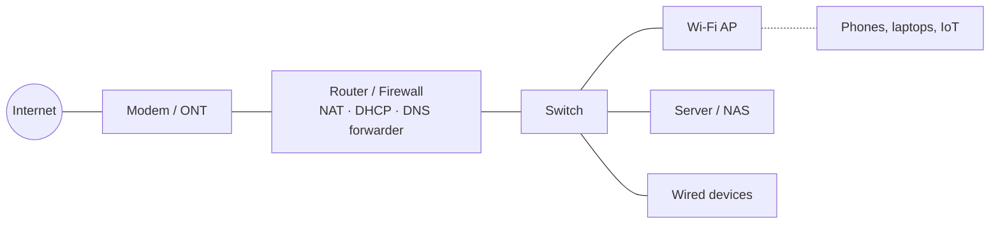
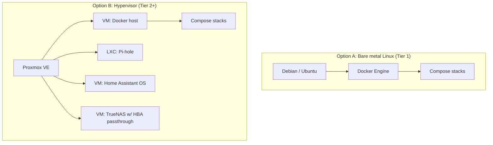
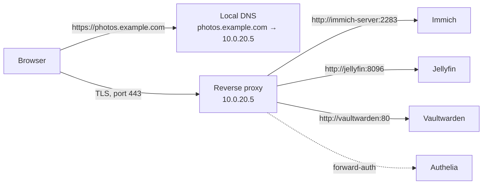
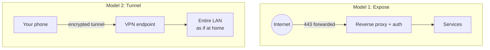
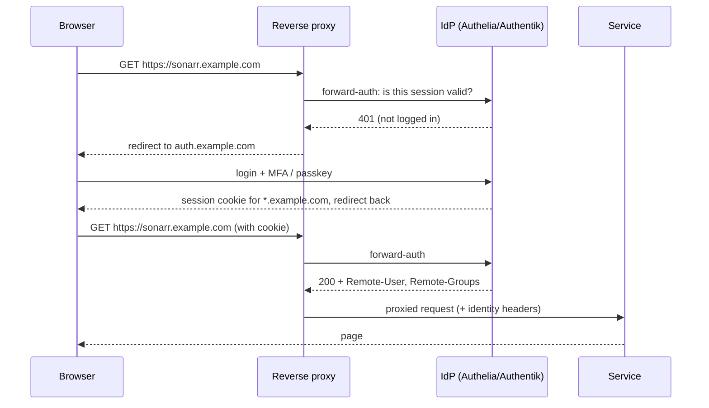
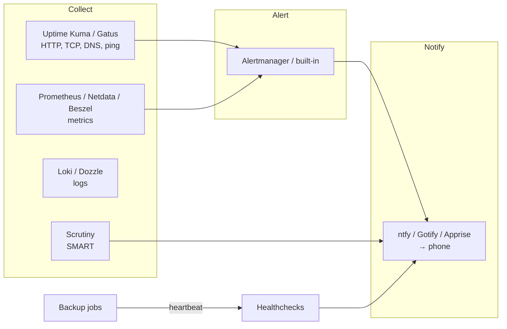

# The Self-Hosting & Home Lab Guide

> A comprehensive, opinionated, in-depth guide to services worth self-hosting — and everything around them.

*Generated 2026-09-07 from the chapter sources in `guide/`. 25 chapters, ~88,393 words. Web version: see `docs/` or the repository README. Source: https://github.com/gorg667/self-host-guide*


## Table of contents


**Part I — Foundations**

- [00. Introduction: What Self-Hosting Is and Why It Matters](#introduction-what-self-hosting-is-and-why-it-matters)
- [01. Planning Your Home Lab](#planning-your-home-lab)
- [02. Hardware: Choosing What to Run It On](#hardware-choosing-what-to-run-it-on)
- [03. Networking Fundamentals for the Home Lab](#networking-fundamentals-for-the-home-lab)
- [04. Operating Systems and Hypervisors](#operating-systems-and-hypervisors)
- [05. Containers: Docker, Compose, Podman, and Kubernetes](#containers-docker-compose-podman-and-kubernetes)
- [06. Storage: Filesystems, Redundancy, and Sharing](#storage-filesystems-redundancy-and-sharing)

**Part II — Core infrastructure**

- [07. Reverse Proxies and TLS Certificates](#reverse-proxies-and-tls-certificates)
- [08. Remote Access and VPNs](#remote-access-and-vpns)
- [09. DNS and Network-Wide Ad Blocking](#dns-and-network-wide-ad-blocking)
- [10. Identity and Single Sign-On](#identity-and-single-sign-on)
- [11. Backups: The Chapter That Matters Most](#backups-the-chapter-that-matters-most)
- [12. Monitoring, Logging, and Alerting](#monitoring-logging-and-alerting)
- [13. Security for the Home Lab](#security-for-the-home-lab)

**Part III — Application services**

- [14. Dashboards and Start Pages](#dashboards-and-start-pages)
- [15. Media: Streaming, Libraries, and Automation](#media-streaming-libraries-and-automation)
- [16. Photos: Replacing Google Photos and iCloud](#photos-replacing-google-photos-and-icloud)
- [17. Files, Sync, and Documents](#files-sync-and-documents)
- [18. Notes, Knowledge, and Personal Productivity](#notes-knowledge-and-personal-productivity)
- [19. Home Automation](#home-automation)
- [20. Communication: Chat, Video Calls, and Email](#communication-chat-video-calls-and-email)
- [21. Passwords, Secrets, and Two-Factor Codes](#passwords-secrets-and-two-factor-codes)
- [22. Developer Tools, Git Hosting, and Automation](#developer-tools-git-hosting-and-automation)
- [23. Local AI: LLMs, Image Generation, Speech, and Search](#local-ai-llms-image-generation-speech-and-search)
- [24. Gaming: Game Servers, Retro Libraries, and Streaming](#gaming-game-servers-retro-libraries-and-streaming)

---

# Introduction: What Self-Hosting Is and Why It Matters

Self-hosting means running the software services you rely on — file storage, photo libraries, media streaming, password managers, home automation, chat, notes, even AI assistants — on hardware you own and control, rather than renting them from a cloud provider. A *home lab* is the environment where you do it: anything from a single Raspberry Pi under the TV to a rack of second-hand enterprise servers in the garage.

This guide is a comprehensive, opinionated, and deliberately deep treatment of both halves of that sentence: the **services** worth self-hosting (with honest reviews and comparisons), and the **everything else** — hardware, networking, storage, containers, reverse proxies, remote access, identity, backups, monitoring, security, automation, power, and the operational discipline that separates a hobby that brings joy from one that becomes a second job.

## Why people self-host

The reasons people give tend to fall into a handful of clusters. You will probably recognise yourself in more than one.

### Privacy and data ownership

When your photos live on someone else's servers, they are subject to that company's terms of service, its scanning policies, its data-retention practices, its acquisitions, and its bankruptcies. When they live on a disk you own, behind encryption you control, none of that applies. This is the most commonly cited reason and it is a good one, but be honest about what you are buying: privacy from *third parties*, not security in any absolute sense. A misconfigured self-hosted service exposed to the internet is a far bigger privacy risk than a competently run cloud service. [Chapter 13](#security-for-the-home-lab) exists for exactly this reason.

### Cost

The economics are genuinely favourable for storage-heavy workloads. 2 TB of cloud storage costs on the order of USD 100–120 per year from mainstream providers; a 4 TB NAS-grade hard drive costs about the same *once*, and a modest mini PC to serve it costs USD 150–400 used. Over a five-year horizon, self-hosting media, photos, and files is cheaper for almost everyone, even after electricity and replacement drives.

The economics are *not* favourable for compute-light, expertise-heavy services. Running your own email server saves you perhaps USD 50 per year and costs you a dozen hours of setup plus recurring deliverability headaches. [Chapter 20](#communication-chat-video-calls-and-email) discusses this candidly. Be realistic: your time has value, and the point of a home lab should be that you *enjoy* spending it.

### Learning

A home lab is the best IT education money can buy. Concepts that are abstract in a textbook — subnets and VLANs, TLS certificates, reverse proxies, ZFS, containers, backup strategy, identity providers — become concrete when you have to make them work at 11 pm because the family cannot watch a film. Many professional systems administrators, DevOps engineers, and SREs credit a home lab for their career, and for good reason: the skills transfer directly.

### Independence from vendor decisions

Services get discontinued (Google has a well-documented graveyard), features get moved behind paywalls, prices get raised, APIs get closed, and terms of service get changed unilaterally. A self-hosted stack built on open-source software cannot be taken away from you. Even when a project is abandoned, you keep the last working version and your data in an open format.

### Capability

Some things are simply not available as a service, or are available only in a hobbled form. Local AI inference on your own GPU with no per-token cost and no content filters. A media server with lossless audio and full-quality 4K HDR remuxes. Home automation that works when the internet is down. Network-wide ad blocking for every device including smart TVs. Object storage with no egress fees. These are things the cloud either cannot or will not sell you.

### Fun

Do not underestimate this one. Tinkering is intrinsically rewarding for a certain kind of person. If you are reading a guide this long, you are probably that kind of person.

## Who this guide is for

This guide is written for three audiences at once, and the structure is designed so that each can find their path.

**The beginner** who has heard about Plex or Home Assistant, has a spare laptop or is thinking about buying a mini PC, and wants to understand what they are getting into before they start. If that is you, read Part I (Foundations) in order. It will take a few hours and it will save you weeks.

**The intermediate self-hoster** who already runs a few Docker containers on a Synology or an Ubuntu box, has hit the limits of port-forwarding-and-hope, and wants to do things properly: a reverse proxy with real certificates, a VPN, a backup strategy that has actually been tested, monitoring that alerts before the family does. Part II (Core Infrastructure) is written for you.

**The experienced administrator** who knows all of that and wants a well-researched, current comparison of what to run for a given need — which photo manager, which notes app, which identity provider — with the trade-offs laid out honestly. Part III (Application Services) is a set of category reviews written for you, and Part IV (Operations) covers the discipline of keeping it all running.

## What this guide is not

It is not a step-by-step tutorial for any single piece of software. Upstream documentation does that better and stays current; we link to it. What we add is *judgement*: which tool to pick, why, what it will cost you in time and resources, and what will go wrong.

It is not neutral. Where there is a clear best choice for most people, the guide says so. Where the choice genuinely depends on your situation, the guide says that too and tells you which questions to ask yourself. Opinions are flagged as opinions.

It is not a substitute for reading the documentation of the software you deploy. Nothing is.

## The philosophy of a sustainable home lab

Twenty years of collective community experience — visible in every "I gave up on self-hosting" post and every "here is my lab five years later" retrospective — distils into a few principles. They are opinions, but they are widely held ones.

### Start small and grow deliberately

The single most common failure mode is over-building. Someone reads about Proxmox clusters and Ceph and 10 GbE and buys three servers before running a single service. Six months later the rack is drawing 400 W, half the services are broken because an update was never finished, and the whole thing gets sold at a loss.

Start with one machine. Run three or four services that you will actually use daily. Learn to back them up and restore them. *Then* expand. Every chapter in this guide has a "starter" option for a reason.

### Boring is good

For infrastructure, prefer mature, widely deployed, well-documented software with a large community. Debian over the newest distribution. Docker Compose over a bleeding-edge orchestrator. PostgreSQL over whatever database was announced last quarter. WireGuard over a novel VPN protocol. The excitement in a home lab should come from *what you do* with the platform, not from fighting the platform itself.

This is also why this guide is somewhat conservative in its recommendations. There is always a shinier alternative. Shiny tends to be less documented, less tested, and more likely to be abandoned.

### Everything fails; plan for it

Drives die. Power goes out. Updates break things. You will fat-finger `rm -rf` on the wrong directory eventually. A home lab that has not planned for these events is a time bomb, and the fuse is usually shorter than people expect.

The corollary is the single most important sentence in this guide: **a backup you have not restored from is not a backup.** [Chapter 11](#backups-the-chapter-that-matters-most) is long for a reason.

### Complexity is a cost

Every service you run is a thing that needs updating, monitoring, backing up, and eventually migrating. Every network segment is a set of firewall rules to maintain. Every layer of abstraction is a place a bug can hide. Add complexity only when the benefit clearly exceeds the ongoing cost — and periodically ask whether that is still true. Decommissioning a service you no longer use is one of the most valuable things you can do.

### Write it down

Your future self, six months from now, will not remember why port 8096 is forwarded or which container owns that Postgres database. Document your setup as you build it. Keep your configuration in Git. [Chapter 28](28-maintenance-operations.md) covers documentation and runbooks; [Chapter 27](27-automation-iac.md) covers keeping configuration as code so that the documentation *is* the deployment.

### Security is a process, not a product

No single tool makes you secure. A reasonable posture for a home lab is: don't expose things to the internet unless you must; when you must, put them behind a reverse proxy with TLS and preferably authentication; keep software updated; segment your network so that a compromised IoT device cannot reach your NAS; and have backups that a ransomware event cannot reach. [Chapter 13](#security-for-the-home-lab) expands on each of these.

## How the guide is structured

The guide is organised into four parts and thirty-five chapters. Each chapter is self-contained enough to be read alone, with cross-references where concepts depend on each other.

**Part I — Foundations** (Chapters 0–6) covers the decisions you make before running a single service: what you want to achieve, what hardware to buy, how to lay out your network, which operating system or hypervisor to run, how containers work and why they matter, and how to store data safely.

**Part II — Core infrastructure** (Chapters 7–13) covers the services that every other service depends on: reverse proxies and TLS certificates, remote access and VPNs, DNS and ad-blocking, identity and single sign-on, backups, monitoring and alerting, and security.

**Part III — Application services** (Chapters 14–26) is the review section. Each chapter takes a category — media, photos, files, notes, home automation, communication, passwords, development tools, AI, gaming, and more — and compares the leading self-hostable options with recommendations.

**Part IV — Operations and reference** (Chapters 27–34) covers keeping it running: infrastructure as code, maintenance discipline, power and cost, legal and ethical considerations, complete reference architectures at three scales, troubleshooting, community resources, and appendices.

### Conventions used throughout

- Commands are shown for Debian/Ubuntu-family Linux unless stated. Almost everything translates directly to other distributions.
- `docker-compose.yml` snippets are *minimal working examples*. They deliberately omit reverse-proxy labels, external networks, and secrets handling, all of which are covered in the infrastructure chapters and would triple the length of every snippet. Treat them as starting points, not production configurations.
- Resource requirements (RAM, CPU, storage) are rough figures for a small household (one to five users) and are noted as such. Your mileage will vary.
- Prices are approximate USD figures as of 2026 and are given to convey order of magnitude, not to be quoted.
- "As of 2026" marks claims about software versions or project status that will age. Check upstream before relying on them.
- Callouts are used for tips, warnings, and notes:

> **Tip**
>
> Practical advice that will save you time.


> **Warning**
>
> Something that will cost you time, data, or money if ignored.


> **Danger**
>
> Something that can cause data loss or a security incident.


> **Note**
>
> Context, nuance, or a tangent worth knowing.


## Responsibilities you are taking on

Self-hosting is an exchange: you give up someone else's operational competence in return for control. It is worth being explicit about what you are signing up for, because the people who burn out are usually the ones who did not.

**You are the sysadmin.** When a disk fails at 2 am, nobody else will replace it. When an update breaks the photo app your partner uses, nobody else will roll it back. If you are hosting services for other people — family, friends — you have implicitly promised them a level of availability, and you should think about what that promise is and whether you can keep it. [Chapter 30](30-legal-ethical.md) talks about hosting for others.

**You are the security team.** Every exposed port is your responsibility. Every CVE in software you run is yours to patch. The good news is that the baseline of "don't expose things, use a VPN, keep updated" gets you most of the way. The bad news is that there is no one to blame if you skip it.

**You are the backup administrator.** Cloud services have redundancy you never see. Your single NAS with a single copy of your family photos has none. Until you have an off-site copy and have tested restoring from it, you have not finished setting up.

**You are the documentation team.** See above.

None of this is meant to discourage. Tens of thousands of people run home labs successfully and enjoy them enormously. It is meant to set expectations so that you make choices — about scale, about which services to expose, about how much to promise others — that you can sustain.

## A note on the state of self-hosting in 2026

The landscape has matured remarkably. A few observations that inform the recommendations in this guide:

- **Docker Compose is the lingua franca.** Nearly every self-hostable project ships a `docker-compose.yml`. Kubernetes has a place in home labs for people who want to learn it, but it is not necessary and usually not advisable for running a household's services. [Chapter 5](#containers-docker-compose-podman-and-kubernetes) discusses when it makes sense.
- **Mini PCs have displaced both Raspberry Pis and enterprise servers** for most people. An Intel N100/N150 or a used business desktop draws 6–15 W idle, costs USD 120–300, and comfortably runs twenty containers. [Chapter 2](#hardware-choosing-what-to-run-it-on) is largely about this shift.
- **Mesh VPNs solved remote access.** Tailscale (and its self-hosted coordinator Headscale), NetBird, and similar tools made "access my home lab from anywhere without port forwarding" a fifteen-minute task even behind CGNAT. Most people no longer need to expose anything to the internet. [Chapter 8](#remote-access-and-vpns) covers them.
- **Local AI became a legitimate self-hosting category.** Running capable language models, image generation, speech-to-text, and text-to-speech on consumer GPUs is now practical and is one of the strongest reasons to add a GPU to a home lab. [Chapter 23](#local-ai-llms-image-generation-speech-and-search) is new territory for many.
- **Immich made self-hosted photos viable for normal people.** For years the honest advice was "keep using Google Photos." That is no longer true. [Chapter 16](#photos-replacing-google-photos-and-icloud) explains why.
- **Licensing is a live issue.** Several popular projects have moved from open source to source-available or "fair" licences, and a few have been acquired or have added paywalled tiers. This guide notes the licence of each service reviewed and [Chapter 30](30-legal-ethical.md) explains what the distinctions mean for you.
- **The community is enormous and generous.** r/selfhosted, r/homelab, the awesome-selfhosted list, and countless blogs and Discord servers mean that whatever problem you hit, someone has hit it before. [Chapter 33](33-resources-community.md) points to the best of them.

## How to use this guide

If you are new: read Chapters 0 through 6, then set up one machine with Docker and three services from Part III that excite you. Then read Part II and retrofit the infrastructure properly. Then read Chapter 11 and set up backups before you add anything else. That sequence — services first for motivation, infrastructure second for sustainability, backups before growth — is the path that produces home labs still running five years later.

If you are intermediate: skim Part I to check for gaps, read Part II carefully, and browse Part III for services you had not considered.

If you are experienced: Part III and Part IV are for you. Chapter 31 (Reference Architectures) may be a useful sanity check against your own design.

Whatever your level, the appendix has a glossary, a port reference, and checklists that are useful to keep open in a tab.

Welcome. Let's build something that you own.

---

# Planning Your Home Lab

The most expensive mistakes in self-hosting are made before any hardware is bought. This chapter is about the decisions that come first: what you actually want, how big to build, what it will cost in money and electricity and time, and where it will physically live. Read it even if you already own hardware — the questions still apply.

## Start with the services, not the hardware

The correct order is: decide what you want to *do*, derive the requirements, then choose hardware. The common order is the reverse, and it produces either a machine that cannot transcode 4K when the family wants to watch a film, or a 48-core dual-socket server that idles at 250 W running a Pi-hole.

Write down — actually write down — the services you intend to run in the first six months. Be honest and be specific. "Media server" is not specific; "Jellyfin, serving two simultaneous 1080p streams, occasionally one 4K HEVC stream to a TV that cannot direct-play it" is specific, and it tells you that you need a CPU with a hardware video encoder (see [Chapter 15](#media-streaming-libraries-and-automation)).

Then, for each service, note four things:

1. **Compute**: is it idle most of the time (almost everything), or does it need sustained CPU or a GPU (transcoding, AI inference, game servers, photo ML)?
2. **Memory**: most containers need 50–500 MB; a few (Nextcloud with its database, Immich with machine learning, GitLab, Home Assistant with many integrations, any LLM) need gigabytes.
3. **Storage**: capacity, growth rate, and whether it is *precious* (irreplaceable photos and documents) or *replaceable* (media you could re-acquire). This distinction drives your entire backup design.
4. **Availability**: what happens if it is down for a day? If the answer is "nothing," it can go on the same box as everything else. If the answer is "the house has no DNS and nobody can browse the web," it needs redundancy or at least a fallback.

A typical first list looks like this:

| Service | Compute | RAM | Storage | If down for a day |
|---|---|---|---|---|
| Pi-hole / AdGuard | negligible | 100 MB | negligible | Whole household loses DNS — needs a fallback |
| Jellyfin | bursty; transcoding needs iGPU | 500 MB–2 GB | Media library: 2–20 TB, replaceable | Annoying |
| Immich | ML bursts on upload | 2–4 GB | Photos: 200 GB–2 TB, **precious** | Phone keeps photos locally, fine |
| Vaultwarden | negligible | 50 MB | tiny, **precious** | Clients cache the vault, fine |
| Home Assistant | light | 1–2 GB | small, precious (config) | Lights still work via switches, automations stop |
| Nextcloud / Syncthing | light | 1 GB | Documents: 50–500 GB, **precious** | Annoying |
| Uptime Kuma | negligible | 100 MB | tiny | Nothing |

Sum the RAM (this one comes to ~8 GB with headroom), note the single "needs hardware transcode" requirement, note the split between precious and replaceable storage, and you have a hardware spec: a mini PC with an Intel iGPU, 16 GB RAM, a small SSD for the OS and containers, and a separate storage solution. That is a far more useful conclusion than "I should probably get a server."

## The three tiers

Throughout this guide, recommendations are grouped into three tiers. They are not rigid and most labs sit between two of them, but naming them makes it easier to talk about trade-offs. [Chapter 31](31-reference-architectures.md) gives a complete blueprint for each.

### Tier 1 — Starter

**One machine, ~10–25 W, USD 150–500 all in.** A mini PC (Intel N100/N150 or a used business desktop like a Lenovo ThinkCentre Tiny or Dell OptiPlex Micro), 16 GB RAM, an NVMe SSD for the system, and one or two USB or internal drives for data. Runs Debian or Ubuntu with Docker Compose, or a turnkey OS like CasaOS/Cosmos/Umbrel for people who want a GUI.

Good for: 5–20 containers, a household of 1–4, media streaming, photos, files, password manager, DNS, home automation.

Limitations: no storage redundancy (so backups are *not optional*), one point of failure, limited to what an iGPU can transcode.

This is where almost everyone should start, and where a large fraction of happy self-hosters stay forever.

### Tier 2 — Intermediate

**Two to three machines, ~40–100 W, USD 600–2,000.** Typically a compute node (a more capable mini PC or small-form-factor desktop running Proxmox) plus a dedicated NAS (TrueNAS, Unraid, or a commercial Synology/QNAP/UGREEN unit) with 4–8 drives in a redundant array, plus perhaps a Raspberry Pi or second mini PC for critical low-power services (DNS, VPN endpoint, monitoring) that should stay up when the main box is being rebuilt. A managed switch with VLANs and a proper router/firewall (OPNsense or similar).

Good for: 20–60 services, a household of several people plus extended family, network segmentation, proper backup targets, some VMs alongside containers.

Limitations: still a single site; more things to update; power bill becomes noticeable.

### Tier 3 — Advanced

**A rack or a shelf full of it, 100–400 W+, USD 2,000–10,000+.** Multiple hypervisor nodes (often clustered Proxmox with shared or replicated storage), 10 GbE or faster between nodes, a dedicated storage server with dozens of terabytes, a UPS that can carry the load through a real outage, a discrete GPU or two for AI workloads and transcoding, possibly a Kubernetes cluster because you want to learn it, and often a small VPS in the cloud as an ingress point and off-site backup target.

Good for: learning enterprise patterns, high availability, heavy AI/ML, serving dozens of users, running a small business.

Limitations: it is a part-time job. Electricity alone at 300 W is roughly USD 300–800 per year depending on where you live. Noise and heat become real problems. Complexity compounds.

> **Tier 3 is a destination, not a starting point**
>
> Almost nobody who starts at Tier 3 is still running it two years later. Almost everybody who starts at Tier 1 and grows to Tier 3 because their needs demanded it is still running it. Grow because you must, not because you can.


## Budget: the full picture

Hardware is the visible cost and usually not the largest one over a five-year horizon. Budget for all of it.

### Capital costs

- **Compute.** USD 100–300 for a used business mini PC with 16 GB RAM; USD 150–250 for a new N100/N150 box; USD 400–900 for a capable Ryzen or Core mini PC with 32–64 GB; USD 300–1,500 for a self-built SFF or tower.
- **Storage.** As of 2026, roughly USD 15–25 per TB for NAS-grade hard drives (cheaper per TB at larger capacities, 16–24 TB drives being the sweet spot), USD 50–80 per TB for consumer NVMe SSDs. Plan for the number of drives your redundancy scheme needs, not the number you would like to have (see [Chapter 6](#storage-filesystems-redundancy-and-sharing)).
- **NAS enclosure or case.** USD 0 (use the mini PC's bays) to USD 300–800 (4–8 bay commercial NAS or a DIY case with hot-swap bays).
- **Networking.** USD 0 if you use the ISP router, USD 100–250 for a decent managed switch and a small firewall box. More for Wi-Fi access points, 10 GbE, or PoE.
- **UPS.** USD 100–250 for a 600–1,000 VA line-interactive unit adequate for a Tier 1–2 lab. Essential once you have a ZFS pool or anything else that dislikes unclean shutdowns. See [Chapter 29](29-power-cost-environment.md).
- **Miscellaneous.** Cables, a USB-to-serial adapter, a spare SSD, a label maker. Budget USD 50–100 and you will spend it.

### Recurring costs

- **Electricity.** The dominant recurring cost. Compute the annual cost as `watts × 8.76 × price_per_kWh`. A 15 W mini PC at USD 0.15/kWh is USD 20/year. A 150 W tower is USD 197/year. At European prices (USD 0.30–0.40/kWh) double those figures. [Chapter 29](29-power-cost-environment.md) covers measurement and reduction.
- **Off-site backup storage.** USD 5–7 per TB per month for Backblaze B2 or similar; a Hetzner Storage Box is cheaper at volume (roughly USD 4/month for 1 TB, USD 13/month for 5 TB as of 2026). A second machine at a friend's house costs electricity there and a favour.
- **Domain name.** USD 10–15/year. You want one; it makes TLS certificates trivial (see [Chapter 7](#reverse-proxies-and-tls-certificates)).
- **VPS** (optional). USD 4–6/month for a small instance that acts as a public ingress point if you are behind CGNAT, or as a Headscale/Netbird coordinator, or as an Uptime Kuma instance watching your home from outside.
- **Drive replacements.** Assume a 2–5% annual failure rate per drive. With six drives, expect to replace one roughly every three to five years. Budget the cost of one drive per year and you will usually be under.
- **Your time.** Genuinely the largest cost. A Tier 1 lab needs perhaps two hours a month once stable. Tier 2 needs four to eight. Tier 3 can easily consume every weekend if you let it.

### A five-year cost example

Tier 1, a mini PC (USD 250) with two 8 TB drives (USD 320) and a small UPS (USD 120), drawing 20 W average at USD 0.20/kWh, with 1 TB of off-site backup and a domain:

| Item | Cost |
|---|---|
| Hardware (one-time) | USD 690 |
| Electricity (5 years) | USD 175 |
| Off-site backup (5 years, ~USD 6/mo) | USD 360 |
| Domain (5 years) | USD 65 |
| One drive replacement | USD 160 |
| **Total** | **USD 1,450** |

For comparison, 2 TB of mainstream cloud storage plus a streaming service plus a password manager subscription for the same household over five years is in the region of USD 1,500–2,500, and you would own nothing at the end of it. Self-hosting is not a way to save large amounts of money, but at Tier 1 it roughly breaks even while giving you vastly more capability and control. At Tier 3 it is a hobby with hobby-sized costs, and that is fine as long as you know it.

## Power, heat, noise, and space

These four are related and usually underestimated.

**Power** determines the electricity bill and the size of UPS you need. Modern mini PCs idle at 6–15 W. A used enterprise 1U or 2U server idles at 80–200 W *before* you add drives, and its fans are designed for a data centre. The single most impactful hardware decision for your running costs is choosing low-idle-power components. [Chapter 2](#hardware-choosing-what-to-run-it-on) and [Chapter 29](29-power-cost-environment.md) go into detail.

**Heat** follows power: every watt becomes heat. 20 W is nothing. 300 W in a closet with no airflow will cook drives (which want to stay under about 40 °C for longevity) and eventually the room. If you are going beyond Tier 1, think about where the hot air goes.

**Noise** is the factor that gets hardware evicted from living spaces. A mini PC is silent or nearly so. A 4-bay NAS with hard drives produces a low hum and occasional clicking that most people tolerate in an office but not a bedroom. An enterprise server sounds like a hair dryer at idle and a jet engine under load; it needs a garage, basement, or a dedicated room. Check reviews for measured dB figures and be sceptical of anything described as "quiet" without a number.

**Space**: a mini PC fits behind a monitor. A NAS is the size of a toaster. A rack is a piece of furniture that needs floor space, clearance for airflow, and ideally a solid floor (a populated 24U rack can weigh 100–200 kg). Racks are wonderful for organisation and cable management and genuinely unnecessary for Tiers 1 and 2. If you want one anyway, a 12U wall-mount or a short open-frame rack is much more livable than a full-height enclosed cabinet.

> **Where to put it**
>
> The ideal location has: a wired Ethernet run back to your router (or is next to it), a power outlet that is not shared with a space heater or a vacuum cleaner, ambient temperature under about 27 °C year-round, no direct sunlight, low humidity, and is somewhere you will not trip over it. A closet with a door that can be left ajar, a utility room, or a basement shelf are common. Avoid attics (temperature swings) and the floor of anywhere that could flood.


## Internet connection realities

Your home lab's usefulness from outside the house depends on your internet connection in ways that are worth understanding before you plan remote access.

**Upload bandwidth** is the ceiling for anything you serve remotely: streaming a 4K film from home to a hotel needs 20–40 Mbps sustained upload. Many cable and DSL connections offer 10–40 Mbps up. Fibre often gives you symmetric 100 Mbps to 1 Gbps and changes what is practical. Check your actual measured upload, not the advertised figure.

**Public IPv4 address**: increasingly, ISPs put residential customers behind *carrier-grade NAT* (CGNAT), meaning you share a public IPv4 address with other customers and cannot forward ports at all. Cellular/5G home internet is almost always CGNAT. Some ISPs will give you a real public IP on request or for a small fee. If you are behind CGNAT, you can still do everything in this guide — but you will use a mesh VPN or a tunnel rather than port forwarding (see [Chapter 8](#remote-access-and-vpns)). Find out which you have before designing your remote access. The test: compare the WAN IP your router reports with the IP a site like `ifconfig.me` shows. If they differ, you are behind CGNAT (or a double NAT of your own making).

**IPv6**: many ISPs now provide native IPv6, which gives every device a globally routable address and sidesteps CGNAT entirely for IPv6-capable clients. It is worth enabling and understanding ([Chapter 3](#networking-fundamentals-for-the-home-lab)), though you cannot rely on every remote network you connect from having IPv6.

**Dynamic IP**: most residential connections have a public IP that changes occasionally. This is a minor problem solved with dynamic DNS ([Chapter 9](#dns-and-network-wide-ad-blocking)).

**ISP terms of service**: some ISPs prohibit "running servers" on residential connections. In practice this is almost never enforced against personal home labs with modest traffic, but it is worth reading your ToS ([Chapter 30](30-legal-ethical.md)). Business connections cost more and typically permit servers and include a static IP.

**Data caps**: if your ISP has one, off-site backups and remote streaming count against it. Initial backup seeding of several terabytes can blow through a monthly cap in a day.

## Decide your risk posture early

Two questions determine much of your design:

### What happens if this all disappears?

Divide your data into categories and decide the recovery requirement for each:

- **Irreplaceable** (family photos, personal documents, the password vault, years of notes): must survive a fire, theft, or ransomware. This *requires* an off-site copy, tested regularly. There is no shortcut.
- **Painful to lose** (service configuration, databases, Home Assistant history, Git repositories): should be backed up nightly, off-site if practical. Losing a week of it is annoying, not catastrophic.
- **Replaceable** (a media library that could be re-ripped or re-downloaded, Linux ISOs, Docker images): back up if convenient and cheap; otherwise accept the loss. Do not spend USD 500 protecting data you could recreate for USD 50 in time.

Then design storage and backups ([Chapter 6](#storage-filesystems-redundancy-and-sharing) and [Chapter 11](#backups-the-chapter-that-matters-most)) around these categories rather than treating all data the same. Most people over-protect their media library and under-protect their photos.

### What happens if this is compromised?

Think about what an attacker who got onto your network — via an exposed service, a phishing email on a family laptop, or a cheap IoT device with a backdoor — could reach. If the answer is "everything, because it's all on one flat network with default passwords," then network segmentation and a proper authentication layer should be early priorities rather than afterthoughts. [Chapter 3](#networking-fundamentals-for-the-home-lab) covers VLANs; [Chapter 13](#security-for-the-home-lab) covers the rest.

A useful mental framing: **exposure is a cost you pay for convenience.** Every service exposed to the internet is a continuous liability. A mesh VPN gives you nearly the same convenience with a fraction of the exposure. Choose exposure deliberately, for services that genuinely need it (a public website, a service used by people who cannot install a VPN client), and put the rest behind the VPN.

## Choose your abstraction level

There is a spectrum from "turnkey appliance" to "bare Linux and a text editor," and where you sit on it determines both how much you learn and how much you can break.

| Approach | Examples | Learning | Control | Effort |
|---|---|---|---|---|
| Commercial NAS with app store | Synology DSM, QNAP QTS, UGREEN UGOS | Low | Low | Lowest |
| Turnkey self-hosting OS | Umbrel, CasaOS, Cosmos, YunoHost, TrueNAS Apps, Unraid Community Apps | Low–Medium | Medium | Low |
| Linux + Docker Compose (+ a GUI like Portainer/Dockge) | Debian, Ubuntu | Medium–High | High | Medium |
| Hypervisor + VMs/containers | Proxmox VE, XCP-ng | High | Very high | Medium–High |
| Declarative / IaC | NixOS, Ansible-managed hosts, k3s with GitOps | Very high | Very high | High up front, low later |

This guide's centre of gravity is **Linux + Docker Compose**, optionally on Proxmox, because it is the level at which the enormous majority of self-hosting documentation, community help, and project support is written. Turnkey systems are fine for getting started and for people who want an appliance; they are less fine when something breaks and the abstraction gets in the way. [Chapter 4](#operating-systems-and-hypervisors) compares the options in depth.

> **It is fine to not want to learn**
>
> Some people want a photo backup box that works, not a hobby. For them, a Synology or UGREEN NAS with Immich installed via Docker is a legitimate and good answer, and this guide's infrastructure chapters are largely optional. Be honest about which person you are.


## Time commitment and the sustainability check

Before buying anything, run the following thought experiment. Imagine it is eighteen months from now. You have moved house, or changed jobs, or had a child, or simply lost interest. Your lab is still running because the family depends on it. Something breaks.

- Can you fix it in an evening with the documentation you wrote?
- Can you restore from backup if you cannot fix it?
- Could you hand it to a technically competent friend with your notes and have them keep it running?
- If you were to shut it all down, could you get the data out in a standard format and move it elsewhere in a weekend?

If the honest answer to any of these is no, the design is too complex or the documentation is too thin for your circumstances. Simplify. The best home lab is the one that is still running — quietly, boringly, reliably — in five years.

## A planning checklist

Before proceeding to hardware:

- [ ] Listed the specific services for the first six months, with rough RAM/CPU/storage/availability notes.
- [ ] Classified data as irreplaceable / painful / replaceable and know the approximate volume of each.
- [ ] Chosen a tier and know roughly what it costs in hardware, electricity, and time.
- [ ] Know whether you have a public IPv4 address, CGNAT, and/or native IPv6.
- [ ] Measured your upload bandwidth.
- [ ] Picked a physical location with power, wired Ethernet, cooling, and tolerance for the noise level of your chosen hardware.
- [ ] Decided how much you want to expose to the internet (ideally: as little as possible) and how you will do remote access instead.
- [ ] Decided your abstraction level: appliance, turnkey OS, Docker on Linux, or hypervisor.
- [ ] Registered a domain name (or decided you will).
- [ ] Have a plan — even a rough one — for off-site backup of irreplaceable data from day one.

With this done, [Chapter 2](#hardware-choosing-what-to-run-it-on) will feel like shopping with a list rather than browsing with a credit card.

---

# Hardware: Choosing What to Run It On

Hardware is where planning meets a credit card. This chapter covers every category of machine people run home labs on — mini PCs, used business desktops, used enterprise servers, single-board computers, commercial NAS units, and DIY builds — with honest trade-offs, followed by the components that matter most: storage drives, memory, network interfaces, switches, UPS units, racks, and GPUs.

The headline recommendation, stated once here and justified below: **for most people in 2026, the right first machine is a low-power x86 mini PC with an Intel iGPU, 16–32 GB of RAM, and an NVMe SSD, paired with a separate storage solution sized to your data.** Everything else in this chapter is about when and why to deviate from that.

## Guiding principles

**Idle power is the number that matters.** Your lab will spend 95% of its life idle. A machine that idles at 8 W costs USD 10–25 a year to run; one that idles at 120 W costs USD 150–400. Over five years the difference pays for the machine several times over. Always look for measured idle power figures in reviews, and be suspicious of any spec sheet that lists only TDP (which is a thermal design figure, not a consumption figure).

**Used business hardware is the value sweet spot.** Corporations lease desktops for three years and dump them by the pallet. A three-year-old Lenovo ThinkCentre M-series Tiny, Dell OptiPlex Micro, or HP EliteDesk/ProDesk Mini with an 8th-gen or newer Intel Core i5, 16 GB of RAM, and a 256 GB NVMe sells for USD 100–200. These machines are quiet, sip power (8–15 W idle), have Intel Quick Sync for transcoding, and are extraordinarily reliable. The community calls them "TinyMiniMicro" after a well-known review series.

**Buy ECC when it is cheap, don't agonise when it isn't.** Covered in detail below; the short version is that ECC memory is a nice-to-have for a home ZFS NAS, not a requirement, and the internet has spent far too much energy arguing otherwise.

**Buy drives for the workload, not the brand.** CMR vs SMR matters far more than Seagate vs Western Digital. Details below.

**Do not buy enterprise rack servers as a first machine.** They are cheap on eBay for a reason: they are loud, hot, power-hungry, and their hardware RAID controllers and proprietary parts make them awkward. They are wonderful for learning enterprise patterns and for people with a basement and a tolerance for a USD 40/month electricity bump. They are a terrible choice for a first lab.

## Category 1: Mini PCs

The mini PC category has exploded since roughly 2022, driven by Intel's N-series (N100, N150, N305, N355) and AMD's Ryzen mobile chips finding their way into palm-sized boxes from dozens of mostly Chinese brands (Beelink, GMKtec, Minisforum, Aoostar, Trigkey, and many others) plus the established players (Intel NUC — now made by ASUS — Lenovo, Dell, HP).

### Intel N100 / N150 / N305 / N355 boxes

The Intel N100 (and its refresh, the N150) is a four-core, four-thread part with no hyperthreading, a 6 W TDP, and a surprisingly capable iGPU with Quick Sync that handles multiple simultaneous 4K HEVC/AV1 transcodes. Boxes built around it sell for USD 130–220 with 16 GB of RAM and a 500 GB SSD. They idle at 6–10 W.

The N305 and N355 are the eight-core siblings with roughly double the multi-threaded performance for USD 80–150 more. Worth it if you plan to run more than about 20 containers or anything CPU-bound.

**Good for:** Tier 1 labs, dedicated DNS/VPN/monitoring node, Home Assistant, media serving with hardware transcoding, small NAS duty (some models have 2–4 SATA bays or two NVMe slots).

**Watch out for:**

- Most N100 boards officially support only 16 GB of single-channel DDR4/DDR5 in one SODIMM slot. 32 GB SODIMMs generally *work* but are not guaranteed. The single-channel memory is a real bottleneck for memory-bandwidth-heavy work (AI inference, heavy databases).
- Cheap brands ship with cheap SSDs and cheap RAM. Budget to replace both, or buy barebones.
- Some units have poor thermal design and will throttle under sustained load. Look for reviews that test sustained performance.
- Firmware quality varies enormously; some have BIOS bugs affecting power states (which hurts idle power) or PCIe ASPM. The Intel-branded and major-OEM units are more predictable.
- 2.5 GbE is now standard; some boxes have two or four ports and are marketed as firewall appliances. They make excellent OPNsense boxes.

### Ryzen and Core mini PCs (the performance tier)

Minisforum, Beelink, GMKtec and others sell boxes around AMD Ryzen 7/9 mobile parts (7840HS, 8845HS, AI 9 HX 370, and successors) or Intel Core Ultra chips. These have 8–16 cores, support 64–96 GB of dual-channel RAM, have two or three NVMe slots, and often include USB4/Thunderbolt and 2.5 GbE ×2. They idle at 10–20 W and cost USD 400–900 barebones.

**Good for:** Proxmox hosts running many VMs, Tier 2 compute nodes, anything memory-hungry. Ryzen's iGPU (RDNA 3 in the 7840/8845 generation) transcodes competently via VAAPI, though Intel Quick Sync remains the more reliable choice for Jellyfin/Plex.

**Watch out for:** Ryzen mobile boxes have historically had more fiddly Linux support for iGPU passthrough and power management than Intel; this has improved a lot but check the community forums for your specific model. AMD's ECC story on these platforms is non-existent.

### Intel NUC and OEM ultra-small-form-factor

The Intel NUC line (now ASUS NUC) and the OEM "1-litre" machines (Lenovo ThinkCentre Tiny, Dell OptiPlex Micro, HP EliteDesk Mini) are the reliable, boring, well-documented option. New units cost more than the Chinese boxes for the same spec; used units cost less. They have proper firmware, vPro/AMT remote management on some models (a poor man's IPMI), and are supported by every Linux distribution without drama.

**Watch out for:** used units often come with the minimum RAM and a small SSD; budget for upgrades. Many OEM Tiny/Micro units have a single 2.5" SATA bay plus one NVMe slot; storage expansion means USB or a NAS.

### Mini PC as NAS?

A growing sub-category (Aoostar, Beelink ME mini, Ugreen NASync DXP, TerraMaster F-series, Minisforum N5) puts an N100/N305/Ryzen board in a case with 2–6 drive bays. These blur the line between mini PC and NAS and are excellent Tier 1–2 all-in-one machines when running TrueNAS, Unraid, or plain Debian.

## Category 2: Used business desktops (small form factor and towers)

One step up from the 1-litre Tiny units are the SFF (small form factor) and MT (mini tower) versions of the same corporate lines: Dell OptiPlex SFF/Tower, Lenovo ThinkCentre M-series SFF, HP EliteDesk/ProDesk SFF, and — very popular in the homelab community — the Lenovo ThinkStation P-series and Dell Precision workstations, and HP Z-series.

**Why they are excellent:** an SFF gives you a real PCIe slot or two (for a 10 GbE NIC, an HBA, or a small GPU), 2–3 internal 3.5"/2.5" drive bays, four RAM slots (64–128 GB), and still idles at 15–30 W. Used 8th–12th gen Core i5/i7 SFFs cost USD 120–300. Entry workstations (ThinkStation P340/P350/P360, Dell Precision 3640/3650/3660) add Xeon-E or Core options with ECC support on some configurations.

**Watch out for:** proprietary PSUs with limited wattage and odd connectors (adding a GPU may be impossible), limited drive bays (SFF usually maxes out at two 3.5" drives), and low-profile PCIe slots only. Check the exact model's spec sheet.

## Category 3: Used enterprise servers

Dell PowerEdge (R720, R730, R740, T-series towers), HPE ProLiant (DL360/DL380 Gen9/Gen10, ML towers), Lenovo/IBM System x, and Supermicro chassis are available used from USD 200 to USD 1,500 depending on generation. They offer dual sockets with 20–56 cores, 128–768 GB of registered ECC RAM, 8–24 hot-swap drive bays, redundant power supplies, and real out-of-band management (iDRAC, iLO, IPMI).

**Why people buy them:** the specs per dollar are absurd, they are built for 24/7 operation, hot-swap everything is genuinely convenient, IPMI is wonderful, and running one teaches you how real data centres work.

**Why people regret them:**

- **Power.** A dual-socket R730 with a few drives idles at 100–150 W. That is USD 130–500 a year. Older generations (R710, DL380 G7) are worse and should be avoided entirely.
- **Noise.** 1U servers are unbearable in living space — 40–60 dB at idle, screaming under load. 2U is better, towers (T-series, ML-series) are quite tolerable. Fan-speed hacks exist for some models via IPMI.
- **Heat.** Every watt is heat in the room.
- **Hardware RAID.** Enterprise controllers (PERC, Smart Array) in RAID mode hide disks from the OS, which is exactly what you do not want for ZFS. Most can be flashed to "IT mode" (pass-through) or replaced with an LSI 9211/9300-series HBA for USD 20–40; budget the time to research your model.
- **Proprietary parts.** Drive caddies, PSUs, and fans are vendor-specific. Some vendors (HPE notably) lock firmware updates behind support contracts.
- **Old CPUs are slow per-core.** A 2014-era Xeon E5-2680v3 has 12 cores but each is slower than a modern N100 core. Single-threaded tasks feel sluggish.

**If you want one anyway:** a tower (Dell T340/T350/T440, HPE ML350 Gen10) or a 2U (R730xd, DL380 Gen10) with a single CPU populated, an IT-mode HBA, and the fans on a quiet profile is livable in a basement or garage. Gen10/14th-gen (Skylake-SP) or newer is the sensible floor for power efficiency and remaining useful life.

## Category 4: Single-board computers

The Raspberry Pi launched a thousand home labs, and it remains a fine choice for specific roles — but it is no longer the default it once was.

### Raspberry Pi 5

The Pi 5 (4 or 8 GB, and 16 GB as of 2025) is a real computer: quad-core Cortex-A76, a PCIe 2.0 lane (used via HAT for NVMe), Gigabit Ethernet, USB 3. It idles at about 3 W and costs USD 60–120 plus case, power supply, and storage. The official M.2 HAT+ or third-party NVMe HATs make it robust; **do not run a Pi from a microSD card for anything you care about** — they wear out and corrupt.

**Good for:** Pi-hole/AdGuard, a WireGuard or Tailscale exit node, Home Assistant (very well supported), Uptime Kuma, a secondary DNS, Zigbee/Z-Wave coordinator host, a small Kubernetes learning cluster.

**Not good for:** media transcoding (no hardware encoder), anything x86-only (some Docker images have no ARM builds, though this is now rare), anything needing more than 8–16 GB RAM, NAS duty with multiple drives.

The cost argument for the Pi has largely evaporated: a Pi 5 8 GB with case, PSU, and an NVMe HAT and SSD costs USD 130–160, and an N100 mini PC with 16 GB and a 500 GB SSD costs about the same while being several times faster and having a transcoder. The Pi's advantages are now its 3 W idle, its GPIO, its size, and its exceptional documentation and community.

### Other SBCs

Orange Pi, Radxa Rock, ODROID, Banana Pi, and the Rockchip RK3588 boards (Orange Pi 5, Rock 5B) offer more cores, more RAM (up to 32 GB), and sometimes NVMe and 2.5 GbE at competitive prices. Software support is the weak point: kernels lag, images are vendor-specific, and hardware acceleration is often half-working. For a lab, they are for people who enjoy that kind of fight. The ODROID-H series is an exception — it is an x86 (Intel N-series) board in SBC form and is popular as a low-power NAS board.

## Category 5: Commercial NAS appliances

Synology, QNAP, and newer entrants (UGREEN, TerraMaster, Asustor) sell finished boxes with 2–12 bays, a polished OS, mobile apps, and an app store.

**Synology** has long been the default recommendation for "I want a NAS that just works." DSM is excellent, Synology Photos and Drive are genuinely good, Hyper Backup and Snapshot Replication are solid. Downsides: the hardware is weak and expensive for what it is (many current models still ship with years-old Celeron or Ryzen embedded parts and 2–4 GB of RAM), and as of 2025 Synology moved to requiring Synology-branded drives on Plus-series models for full functionality — a decision that alienated much of the enthusiast community and is worth checking the current state of before buying.

**QNAP** offers stronger hardware for the money (2.5 GbE standard, more RAM, HDMI out on some), a less polished OS, and a worse security track record — several ransomware campaigns have specifically targeted internet-exposed QNAP units. Never expose a QNAP (or any NAS) directly to the internet.

**UGREEN NASync** arrived in 2024 with strong hardware (Intel N-series or Core i5, 8–16 GB, 2.5/10 GbE, NVMe slots) at aggressive prices and an OS that is improving rapidly. Notably, UGREEN officially permits installing third-party OSes (TrueNAS, Unraid, Proxmox), making them attractive as DIY NAS hardware with a warranty.

**TerraMaster and Asustor** are similar propositions: decent hardware, less mature software, both tolerant of third-party OS installs.

**Should you buy one?** If you want an appliance and are willing to pay a premium for the software, Synology remains good (drive-lock caveat noted). If you want the hardware and will run TrueNAS or Unraid, UGREEN is the current value pick. If you want to learn and have the time, a DIY NAS (below) is cheaper and more capable.

## Category 6: DIY builds

Building your own gives you complete control over power, noise, expansion, and drive count. The two common patterns:

### The low-power NAS build

A Micro-ATX or ITX board with an efficient CPU (Intel Core i3-12100/13100/14100 or i5 non-K, or the Intel N-series on an ITX board), 16–64 GB RAM, a case with 6–12 drive bays (Fractal Design Node 304/804, Jonsbo N2/N3/N4/N5, Sagittarius, the venerable Fractal Define R5/7 with extra drive cages), a Gold or Platinum PSU sized *small* (a 450–550 W unit runs more efficiently at low load than an 850 W unit), and an LSI HBA if you need more SATA ports than the board provides. Such a build idles at 20–35 W with drives spun down and costs USD 500–900 before drives.

Intel 12th–14th gen with an iGPU is the community favourite here because Quick Sync is excellent, the C-state power management is good (C8–C10 idle achievable with care), and the platform is well-understood. See [Chapter 29](29-power-cost-environment.md) for tuning.

### The compute/virtualisation build

A Ryzen 7/9 or Core i7/i9 on a board with plenty of PCIe lanes, 64–128 GB RAM, several NVMe drives, a 2.5 or 10 GbE NIC, and space for a GPU. This is a Proxmox host or a workstation-class machine for AI work. Idle power is 40–80 W depending on discipline. If you want ECC, AMD Ryzen on a board that supports it (many ASRock and some ASUS boards do — check the QVL) with unbuffered ECC UDIMMs is the affordable path; Intel restricts ECC to Xeon-E/W and a few Core parts on W680 boards.

> **The 'one big box' vs 'compute + NAS' decision**
>
> Combining compute and storage in one machine (a DIY NAS running Proxmox or TrueNAS with apps) is simpler and cheaper. Separating them means you can reboot or rebuild the compute node without taking storage offline, and keeps your data on a machine that changes rarely. Tier 1: one box. Tier 2: usually two. Tier 3: definitely two or more.


## Storage drives

This section matters more than any other in the chapter. Drives are where your data lives, they are the component most likely to fail, and the market is full of traps.

### Hard drives: CMR vs SMR

This is the single most important thing to know when buying hard drives.

**CMR (Conventional Magnetic Recording)** writes tracks side by side. Performance is consistent for reads and writes. **SMR (Shingled Magnetic Recording)** overlaps tracks like roof shingles to increase density. Reads are fine; *sustained writes* are catastrophically slow once the drive's small CMR cache area fills, because rewriting one track means rewriting all the tracks that overlap it.

SMR drives in a RAID or ZFS array are a disaster: a rebuild/resilver, which is a sustained multi-terabyte write, can take days instead of hours, and the drive may time out and get kicked from the array during the process — leading to a second "failure" and potential data loss. Western Digital was caught quietly shipping SMR drives in its WD Red NAS line in 2020 and was sued over it; the industry now generally discloses.

**Rule: for any array, buy only CMR drives.** Currently CMR lines include WD Red Plus and Red Pro, Seagate IronWolf and IronWolf Pro, Toshiba N300, and essentially all enterprise drives (WD Ultrastar/Gold, Seagate Exos, Toshiba MG-series). SMR lines to avoid for arrays: WD Red (non-Plus), WD Blue at many capacities, Seagate Barracuda at many capacities, most "archive" drives. Manufacturers publish CMR/SMR lists; check the specific model number, not the product line.

### Which hard drive tier?

| Tier | Examples | Warranty | Workload rating | Notes |
|---|---|---|---|---|
| Desktop | WD Blue, Seagate Barracuda | 2 yr | ~55 TB/yr | Often SMR. Avoid for arrays. |
| NAS | WD Red Plus, Seagate IronWolf, Toshiba N300 | 3 yr | 180 TB/yr | CMR. Fine for home NAS. Rotational vibration sensors. |
| NAS Pro | WD Red Pro, IronWolf Pro | 5 yr | 300–550 TB/yr | 7200 rpm, louder, slightly more power. |
| Enterprise | WD Ultrastar / Gold, Seagate Exos, Toshiba MG | 5 yr | 550 TB/yr | Often *cheaper per TB* than NAS Pro. Louder. Best value at 16–24 TB. |

Enterprise drives are frequently the best buy for a home NAS: they are CMR, have five-year warranties, and because they are sold in volume to data centres they are often cheaper per terabyte than the consumer NAS lines. The downsides are noise (idle seek chatter is audible) and slightly higher power (7–9 W active, 5–6 W idle). Check reputable price trackers (diskprices.com is the community standard) and buy from a seller with a real return policy.

**Shucking** — buying external USB drives (WD Elements/My Book, Seagate Expansion) and removing the internal drive — used to be the cheapest route to CMR enterprise-class drives. It still sometimes is, but the discount has narrowed, warranties become murky, and some shucked WD drives need a 3.3 V pin mod (tape over pin 3) to spin up in some backplanes. It is a hobby within a hobby.

**Refurbished and recertified drives** from reputable sellers (ServerPartDeals and similar) offer manufacturer-recertified enterprise drives at 30–50% discounts with 2–5 year seller warranties. Community experience is largely positive; the key is buying from a seller who honours the warranty. Reasonable for replaceable data with parity protection; think twice for a single-copy archive of family photos.

### How many drives, what capacity?

Buy fewer, larger drives. Six 8 TB drives cost more, draw more power, and have more failure points than three 16 TB drives with the same usable capacity under RAIDZ1/RAID5. Larger drives do take longer to rebuild (a 20 TB drive resilvers in roughly 24–36 hours), which is the argument for two-drive redundancy (RAIDZ2/RAID6) at large capacities. [Chapter 6](#storage-filesystems-redundancy-and-sharing) covers the arithmetic.

Buy from at least two different batches or vendors when buying a set. Drives from the same batch have correlated failure characteristics.

### SSDs

**Boot/OS and container storage**: any decent NVMe SSD (Samsung 980/990 Pro, WD SN770/SN850X, Crucial P3 Plus/T500, Kingston KC3000, SK Hynix P41/P44) is fine. 500 GB–1 TB is plenty. Docker images and container volumes on NVMe make everything feel snappy.

**Databases and VM storage**: endurance matters. Look at the TBW (terabytes written) rating; consumer drives are 300–1,200 TBW, enterprise drives are 3,000–20,000+. Used enterprise SATA/U.2/M.2 SSDs (Intel D3-S4510/S4610, Samsung PM883/PM893/PM9A3, Micron 5300/7450) are excellent value on eBay and have power-loss protection, which consumer drives lack.

**ZFS special vdevs, SLOG, L2ARC**: only enterprise drives with power-loss protection are appropriate for SLOG; a consumer drive here can *lose* the data it was meant to protect. Most home labs do not need any of these; see [Chapter 6](#storage-filesystems-redundancy-and-sharing).

**All-flash NAS**: with 4 TB NVMe drives at USD 200–300 and 8 TB at USD 500–800, all-flash storage for everything but bulk media is now practical. Silence, low power, and speed are the payoff; cost per TB is 4–6× spinning rust.

> **QLC and DRAM-less SSDs**
>
> Cheap SSDs use QLC NAND and omit the DRAM cache. They are fine for a boot drive and for read-heavy media, and terrible for sustained writes and for anything database-like; write speed can fall below that of a hard drive once the SLC cache fills. For anything but the most cost-constrained cold storage, prefer TLC with DRAM.


### SMART and drive health

Every drive reports Self-Monitoring, Analysis and Reporting Technology data. The attributes that predict failure most reliably are **Reallocated Sectors Count (5)**, **Current Pending Sector Count (197)**, **Offline Uncorrectable (198)**, and **UDMA CRC Error Count (199, usually a cable problem)**. Any non-zero and rising value on 5, 197, or 198 means the drive is dying; replace it. Run `smartctl -a /dev/sdX` (from `smartmontools`) and set up automated monitoring with Scrutiny ([Chapter 12](#monitoring-logging-and-alerting)). Schedule a long self-test monthly.

## Memory

**How much?** 16 GB runs a Tier 1 lab comfortably. 32 GB runs a Tier 2 Docker host with room. 64 GB+ is for Proxmox hosts running several VMs, ZFS with large ARC, or AI workloads. RAM is cheap; over-provision.

**ZFS and RAM.** The old "1 GB per TB" rule is a myth for home use (it originated with deduplication, which you should not enable). ZFS uses free RAM as a read cache (ARC) and gives it back when needed. 8 GB is a workable minimum; 16 GB is comfortable; more just makes the cache bigger.

### ECC: the eternal argument

Error-Correcting Code memory detects and corrects single-bit errors caused by cosmic rays, electrical noise, and marginal hardware. Without it, a flipped bit in RAM can silently corrupt data before it is written to disk — and ZFS's checksums cannot help, because ZFS will faithfully checksum the corrupted data.

The community argument: "ZFS without ECC is dangerous" (a stance popularised on the FreeNAS forums circa 2013) versus "ECC is nice but the risk is overstated for home use" (the more measured modern view, which is also essentially Matt Ahrens' — ZFS co-creator — position: ZFS without ECC is no *worse* than any other filesystem without ECC, and the "scrub of death" scenario is a myth).

Practical guidance:

- ECC is genuinely better. If it costs you little to get it, get it.
- ECC is available cheaply on: used workstations and servers (registered DIMMs are very cheap used), AMD Ryzen on supporting motherboards with unbuffered ECC UDIMMs (verify with `dmidecode` and `edac-util` that it actually works — some boards accept ECC DIMMs without enabling ECC), and Intel Xeon-E / W680 platforms.
- ECC is essentially unavailable on: mini PCs, N-series boards, laptops, most consumer Intel desktop boards.
- If your only option is a mini PC without ECC, run ZFS or Btrfs anyway. Checksumming filesystems still protect against the far more common failure modes — bit rot on disk, bad cables, failing drives — which happen orders of magnitude more often than RAM-induced corruption.
- Do not let the absence of ECC stop you from starting. Do not let its presence make you complacent about backups.

## Network interfaces and switches

**1 GbE** is the baseline and remains adequate for most Tier 1 labs: it moves 110 MB/s, faster than most spinning drives sustain and enough for several simultaneous 4K streams.

**2.5 GbE** has become standard on mini PCs and mid-range motherboards and is the sensible current sweet spot. Unmanaged 2.5 GbE switches cost USD 50–100 for 5–8 ports; managed ones with VLAN support USD 100–250. Realtek 2.5 GbE chipsets (RTL8125) are ubiquitous and fine on Linux with a modern kernel; Intel i225/i226 had teething issues in early revisions but are stable now.

**10 GbE** is for moving large files between a NAS and a workstation, for storage networks between hypervisor nodes, and for all-flash arrays. Used Intel X520/X710 or Mellanox ConnectX-3/4 SFP+ cards cost USD 20–60; direct-attach copper (DAC) cables connect two machines without a switch. Switches with a few SFP+ ports (MikroTik CRS305/CRS309/CRS310, TP-Link TL-SX3008F, Zyxel, QNAP) cost USD 130–300. Note that 10GBase-T (RJ45) draws 2–5 W per port and runs hot; SFP+ with DAC or fibre is cooler and cheaper for short runs.

**Managed switches**: you want one as soon as you want VLANs ([Chapter 3](#networking-fundamentals-for-the-home-lab)). Popular choices: MikroTik (excellent hardware, RouterOS/SwOS have a learning curve), TP-Link Omada and Ubiquiti UniFi (controller-based, polished, popular), Netgear (fine, boring), Zyxel, and used enterprise (Cisco, Brocade/Ruckus ICX, Aruba — cheap, loud fans, CLI-driven, fantastic for learning). PoE ports are worth having if you plan Wi-Fi access points or cameras.

## Uninterruptible power supplies

A UPS gives you two things: continuity through brief outages and flicker (very common), and time to shut down cleanly during longer ones. The second matters enormously for storage: ZFS and Btrfs are robust against power loss by design, but drives with write caches, hardware RAID without a battery, and any database mid-transaction are not.

**Sizing**: measure your lab's draw (a plug-in power meter is USD 15–25), add 30% headroom, and buy a UPS whose *watt* rating (not VA — VA is roughly watts × 1.6 for these units) exceeds it. A Tier 1 lab at 30 W wants a 600–850 VA unit, which will run it for an hour or more. A Tier 2 lab at 100 W wants 1,000–1,500 VA for 15–30 minutes.

**Type**: line-interactive (APC Back-UPS Pro, CyberPower CP-series, Eaton 5E/5S) is right for home labs. Pure sine wave output is preferable for active-PFC power supplies (which is every modern PSU). Standby/offline units are cheaper and adequate for a mini PC. Online/double-conversion is overkill and inefficient for a home.

**Communication**: the UPS must talk to your servers so they shut down before the battery dies. USB is standard; the **NUT** (Network UPS Tools) daemon runs on one machine as master and notifies others over the network. [Chapter 29](29-power-cost-environment.md) has a NUT walkthrough. Some UPS units have a network management card slot; the cards are useful but cost more than the UPS.

**Batteries** last 3–5 years and are user-replaceable (USD 30–80). Lithium-ion UPS units (Eaton, CyberPower) are appearing with longer battery life and lower weight at a price premium.

Brands: APC (Schneider) and Eaton are the safe defaults; CyberPower is the value pick and its Linux support (via NUT or `pwrstat`) is good. Avoid no-name units.

## Racks and mounting

You do not need a rack until you have three or more rack-mount devices. Before that, a shelf, a wire rack from a hardware store, or an IKEA Lack table (the "Lack rack" — its inner width almost exactly fits 19" equipment — is a decades-old community joke that actually works) is fine.

When you do: a **wall-mount 6–12U** for a switch, patch panel, and a couple of shallow devices; an **open-frame 4-post 12–25U** for a mix of servers and shelves; an **enclosed cabinet** only if you need dust protection or noise dampening (and note that enclosed cabinets restrict airflow). Rack depth matters — many home-lab-friendly cases and used servers are 60–75 cm deep; short-depth racks will not fit them. Check before buying either.

Rack shelves let you mount mini PCs, NAS units, and anything else non-rack-format. Rack-mount PDUs are convenient; a smart PDU with per-outlet switching is a luxury that pays for itself the first time you need to power-cycle a hung machine remotely.

## GPUs

For most self-hosters, the integrated GPU in an Intel CPU is the only GPU needed: Quick Sync handles transcoding for Jellyfin/Plex/Emby, and Frigate can use OpenVINO on the iGPU for object detection. Discrete GPUs enter the picture for three reasons:

**Transcoding at scale.** An Intel Arc A310/A380 (USD 90–130, single-slot, low-profile options exist, ~5–20 W) adds AV1 encode and a second Quick Sync engine to any machine, including AMD-based ones. This is the best transcoding upgrade available.

**Local AI.** Large language models, image generation, speech models, and photo ML (Immich's smart search, Frigate's detection) benefit enormously from a GPU. Here VRAM is the constraint that matters: LLM size in parameters × bytes per parameter at your quantisation ≈ VRAM needed. A 7–8 B parameter model at 4-bit fits in 6 GB; a 14 B model needs 10–12 GB; 32 B needs 20–24 GB; 70 B needs 40+ GB or two cards. NVIDIA has the most mature software stack (CUDA is what everything targets first); the used RTX 3090 (24 GB, USD 600–800) and RTX 3060 12 GB (USD 200–250) are perennial value picks, and the RTX 4060 Ti 16 GB and 5060 Ti 16 GB are efficient mid-range choices. AMD's ROCm works for many workloads (Ollama, llama.cpp, Stable Diffusion) and the RX 7900 XTX at 24 GB is cheaper than NVIDIA equivalents; Intel Arc works via IPEX/SYCL for llama.cpp and Ollama with less polish. Apple Silicon Macs with unified memory (a Mac Mini/Studio with 64–192 GB) are an unconventional but effective LLM server. [Chapter 23](#local-ai-llms-image-generation-speech-and-search) covers all of this in depth.

**Passing through to a VM or game-streaming.** A GPU passed to a Windows VM for a Sunshine/Moonlight streaming setup ([Chapter 24](#gaming-game-servers-retro-libraries-and-streaming)), or to a Linux desktop VM. Requires IOMMU support (nearly universal now) and some Proxmox configuration.

**Power and PCIe.** A discrete GPU adds 10–30 W at idle and hundreds under load, and needs a real PCIe slot and often a PSU upgrade. Older NVIDIA cards (pre-Turing) idle poorly under Linux without `nvidia-persistenced` and tuning. Decide whether a GPU belongs in the always-on server or in a separate machine that sleeps when not in use.

## Sample builds

Three concrete configurations, with approximate 2026 prices, as anchors.

### Starter: silent all-in-one, ~USD 350 + drives

- Used Lenovo ThinkCentre M920q / Dell OptiPlex 7080 Micro, Core i5-8500T or better, 16 GB → USD 130–180
- Upgrade: 32 GB DDR4 SODIMM kit → USD 50; 1 TB NVMe → USD 60
- Storage: two 8 TB CMR drives in a two-bay USB 3 enclosure (Terramaster D2-310 or similar) as a mirrored Btrfs/ZFS pool → USD 320 + USD 80
- UPS: CyberPower CP600/CP850 → USD 80–110
- Idle: ~15 W. Runs Debian + Docker with 20–30 containers, Jellyfin with Quick Sync, Immich, Nextcloud, Vaultwarden, AdGuard.

### Intermediate: separate compute and storage, ~USD 1,200 + drives

- Compute: Minisforum/Beelink Ryzen 7 8845HS or Intel Core Ultra mini PC, 64 GB, 2× 1 TB NVMe → USD 550–700; runs Proxmox.
- NAS: Jonsbo N3 (8-bay) with Intel i3-12100, 32 GB, a 500 GB NVMe boot drive, an efficient 450 W PSU → USD 450–550; runs TrueNAS SCALE with 4–6 × 16–20 TB enterprise drives in RAIDZ2.
- Network: MikroTik CRS310-8G+2S+ (2.5 GbE ×8, SFP+ ×2) → USD 200; a small N100 dual-NIC box for OPNsense → USD 150.
- UPS: 1,000–1,500 VA → USD 150–220.
- Idle: 60–90 W total.

### Advanced: clustered, ~USD 3,000–6,000

- 3× compute nodes (mini PCs or SFF workstations with 64–128 GB, dual 2.5 or 10 GbE) in a Proxmox cluster with Ceph or ZFS replication.
- Storage server: 12–24 bay chassis (Supermicro 846, Fractal Define 7 XL, or a rack-mount Rosewill/Sliger) with Xeon-E or Ryzen ECC, 64–128 GB, HBA, 10 GbE, 8–16 drives.
- GPU node: a workstation or SFF with an RTX 3090/4090 or a pair of 16–24 GB cards for AI.
- Network: 10 GbE SFP+ switch as core, 2.5 GbE PoE access switch, OPNsense on dedicated hardware or as a VM with NIC passthrough.
- UPS: 2–3 kVA online or line-interactive, possibly with extended battery.
- Rack: 18–25U four-post, PDU, patch panel.
- Idle: 200–400 W. Electricity becomes a line item you notice.

## Buying checklist

- [ ] Idle power figure known from a measured review, not inferred from TDP.
- [ ] Transcoding requirement confirmed against CPU/iGPU capability (Intel Quick Sync for Jellyfin/Plex is the safe choice).
- [ ] RAM capacity ceiling and slot count checked; ECC decision made consciously.
- [ ] Every hard drive confirmed CMR by model number.
- [ ] Drive count and capacity derived from the redundancy scheme in [Chapter 6](#storage-filesystems-redundancy-and-sharing), not the reverse.
- [ ] SSD endurance adequate for the workload (databases/VMs want TLC with DRAM, ideally enterprise with PLP).
- [ ] Network ports match the switch you have or plan to buy.
- [ ] UPS sized to measured draw plus headroom, with USB or network communication to the host.
- [ ] Physical location can handle the noise and heat of what you are buying.
- [ ] Budget includes the boring things: cables, a spare drive, a power meter.

---

# Networking Fundamentals for the Home Lab

Networking is the subject that most often separates a home lab that works from one that is *understood*. You can run services for years on a flat network with an ISP router and never learn a thing about subnets, and many people do. But the moment you want to isolate IoT devices, run your own DNS, reach services by name with valid certificates, or connect from outside without exposing everything, you need the fundamentals. This chapter provides them, then covers the router and firewall platforms worth running.

## The mental model

A home network has, at minimum, these pieces:



The **modem** (or ONT for fibre) converts the ISP's physical medium to Ethernet. The **router** sits between the ISP's network and yours: it gets one public IP address from the ISP, hands out private addresses to your devices, translates between them (NAT), and by default blocks all inbound connections (firewall). It usually also runs DHCP (assigning addresses) and a DNS forwarder. The **switch** connects wired devices at layer 2. **Access points** do the same for Wi-Fi.

In an ISP-supplied "gateway," all of these are one box. The first upgrade most home labs make is to separate them: a dedicated router/firewall, a managed switch, and one or more access points. This is not required, but it is where control begins.

## IP addressing

### Private ranges

Your internal network uses one of the private IPv4 ranges defined in RFC 1918:

| Range | CIDR | Addresses | Typical use |
|---|---|---|---|
| 10.0.0.0 – 10.255.255.255 | 10.0.0.0/8 | 16.7 million | Large or many-subnet labs; `10.0.VLAN.0/24` schemes |
| 172.16.0.0 – 172.31.255.255 | 172.16.0.0/12 | 1 million | Less common at home; **Docker's default range** |
| 192.168.0.0 – 192.168.255.255 | 192.168.0.0/16 | 65,536 | The consumer default: `192.168.0.0/24` or `192.168.1.0/24` |

Two pieces of practical advice: first, **avoid `192.168.0.0/24` and `192.168.1.0/24`** for your lab if you can. These are the defaults on nearly every consumer router, which means when you VPN home from a hotel or a friend's house, the remote network will often be the same subnet as yours and routing will break. `10.x.y.0/24` or `192.168.[20-250].0/24` avoids most collisions. Second, **be aware of Docker's `172.17–172.31.x.x` usage** — if your LAN or a VPN uses 172.16.0.0/12, you will eventually hit a conflict. You can change Docker's default address pool in `/etc/docker/daemon.json`.

### Subnets and CIDR

A `/24` network (255.255.255.0) has 256 addresses: `.0` is the network address, `.255` is broadcast, and `.1` through `.254` are usable. That is plenty for a home. Use `/24` everywhere unless you have a specific reason not to. When you segment into VLANs (below), each VLAN gets its own `/24`.

A tidy convention: use the third octet as the VLAN ID. VLAN 10 is `10.0.10.0/24`, VLAN 20 is `10.0.20.0/24`. The router's interface on each is `.1`. Servers get static addresses in `.2–.49`; DHCP hands out `.100–.249`. When you see `10.0.20.115` in a log you instantly know it is a DHCP client on the IoT VLAN. This is arbitrary but worth adopting early.

### Static vs DHCP reservations

Servers need stable addresses. Two ways: configure a static IP on the server itself, or configure a **DHCP reservation** on the router that always hands the same IP to that MAC address. Reservations are better for almost everything — one place to look, easy to change, no risk of two machines claiming the same address. The exceptions are the router itself, the DHCP server if it is separate, and your DNS server (which must be reachable before DHCP has done its job — a chicken-and-egg problem if the DNS server is a DHCP client and the DHCP server needs DNS).

## DHCP and DNS on the LAN

**DHCP** hands each device an IP, a subnet mask, a gateway (the router), and DNS server addresses. The DNS server setting is your lever for network-wide ad-blocking ([Chapter 9](#dns-and-network-wide-ad-blocking)): point DHCP at your Pi-hole or AdGuard Home and every device on the network uses it automatically.

**Local DNS** lets you refer to machines by name. Two layers:

1. **Hostname resolution** for LAN devices: `nas.lan`, `proxmox.lan`. The DHCP server usually registers leases into DNS automatically (dnsmasq, which underlies Pi-hole and most routers, does this). Pick a local domain suffix: `.lan`, `.home.arpa` (the RFC 8375 official choice), or `.internal` (which ICANN reserved in 2024). Avoid `.local` — it is used by mDNS/Bonjour and causes conflicts.

2. **Service names with real TLS**: `jellyfin.example.com` resolving to your reverse proxy's LAN IP, with a valid Let's Encrypt certificate, even though the service is never exposed to the internet. This uses **split-horizon DNS**: your internal DNS server answers `jellyfin.example.com` → `10.0.10.5`, while the public internet either has no record or a different one. You own a real domain, so the certificate is real. [Chapter 7](#reverse-proxies-and-tls-certificates) covers the certificate side; [Chapter 9](#dns-and-network-wide-ad-blocking) covers the DNS side.

> **Buy a real domain**
>
> A USD 10/year domain from a registrar with a good API (Cloudflare, Porkbun, Namecheap, deSEC for a free option) is the single most useful purchase for a home lab after the hardware. It unlocks valid TLS certificates for internal services via DNS-01 challenges, makes remote access easier, and makes everything feel finished. You never have to point any public DNS record at your home IP.


## NAT, port forwarding, and why you should mostly avoid the latter

**NAT (Network Address Translation)** is the mechanism that lets every device on your LAN share one public IP. Outbound connections are rewritten to appear to come from the public IP; return traffic is mapped back. Inbound connections that nobody asked for have nowhere to go, and are dropped. This accidental firewall is the main reason home networks are not constantly compromised.

**Port forwarding** punches a deliberate hole: "inbound TCP 443 on the public IP → 10.0.10.5:443." This is how you expose a service to the internet. Every forwarded port is a service that must be secured, kept updated, and monitored forever. It is a real cost.

The modern advice, which this guide repeats in several chapters: **most people should forward zero ports.** Use a mesh VPN (Tailscale, NetBird, ZeroTier, or a self-hosted WireGuard) for your own access ([Chapter 8](#remote-access-and-vpns)). If you must expose something publicly — a website, a service for people who will not install a VPN — expose exactly one port (443) to a hardened reverse proxy with authentication in front of it, and nothing else. Never forward SSH, RDP, a NAS web UI, a database, or a management interface.

**UPnP** lets devices ask the router to open ports for them automatically. It is convenient for game consoles and a security liability for everything else — a compromised device can open whatever it likes. Disable it on any network with servers.

### Double NAT

If your ISP's gateway does NAT and you put your own router behind it doing NAT again, you have double NAT. It works for outbound traffic and breaks port forwarding, UPnP, and some VPN protocols. Fix it by putting the ISP gateway in **bridge mode** (passes the public IP through to your router) if possible; otherwise, set the ISP gateway's DMZ to your router's WAN IP so all inbound traffic reaches it.

### CGNAT

**Carrier-grade NAT** is when the ISP itself NATs you: your router's WAN address is in `100.64.0.0/10` (or sometimes an RFC 1918 range), and the public address you appear from is shared with other customers. You cannot forward ports because you do not own the public IP. Cellular home internet is nearly always CGNAT; many fibre and cable ISPs are moving there as IPv4 addresses run out.

Detection: compare your router's WAN IP with the address `curl ifconfig.me` reports from a machine behind it. If they differ (and the router's is in `100.64.0.0/10` or `10.x`), you are behind CGNAT.

It is not the end of the world. Options, in rough order of preference:

1. **Mesh VPN** (Tailscale/Headscale, NetBird, ZeroTier) — works through CGNAT via NAT traversal and relay servers. Solves personal remote access completely.
2. **Cloudflare Tunnel** or similar — an outbound connection from your lab to Cloudflare's edge, which then proxies public HTTP(S) traffic to you. No inbound ports needed. Free tier is generous. Trade-off: Cloudflare terminates TLS and sees your traffic; their ToS restricts non-HTML content (video streaming through the tunnel technically violates it).
3. **A cheap VPS as a relay** — rent a USD 4/month VPS with a public IP, connect your lab to it via WireGuard, and forward ports from the VPS to your lab through the tunnel. Pangolin, the fastest-growing self-hosted option for this pattern, packages it nicely ([Chapter 8](#remote-access-and-vpns)). Full control, small cost, some latency.
4. **IPv6** — if your ISP provides it, your services have globally routable addresses regardless of IPv4 CGNAT. Clients need IPv6 too, which is not universal.
5. **Ask the ISP** for a public IPv4. Some provide one free or for USD 2–5/month.

## IPv6

IPv6 is the current version of the Internet Protocol. Its 128-bit addresses eliminate scarcity — your ISP will typically delegate a `/56` or `/64` prefix to your home, giving every device its own globally routable address. There is no NAT in the usual sense; the firewall is what protects you, not address hiding.

Practical points for the home lab:

- **Enable it on your router** if your ISP supports it. The router requests a prefix via DHCPv6 prefix delegation and advertises it to the LAN via Router Advertisements (RA/SLAAC). Devices self-assign addresses.
- **Your firewall rules must cover IPv6.** A default-deny inbound rule on IPv6 is as important as NAT is on IPv4. Every decent router does this by default; verify.
- **Prefixes may change** when your connection resets, which is annoying for static addressing. Use ULA (`fd00::/8`, the IPv6 equivalent of RFC 1918) for internal addressing alongside the global prefix, or use the DNS name rather than the address everywhere.
- **Docker** does not enable IPv6 in containers by default; enabling it is a few lines in `daemon.json` but adds complexity. Most services work fine with IPv4-only inside Docker even when the host has IPv6.
- **Testing**: `test-ipv6.com` from a client tells you whether IPv6 works end to end.

Many capable self-hosters run IPv4-only internally and enable IPv6 only on the WAN side for outbound. That is a defensible simplification. The reverse — leaning on IPv6 to escape CGNAT for inbound access — is also viable but requires every client network you connect from to have IPv6.

## VLANs and network segmentation

A **VLAN** (Virtual LAN, IEEE 802.1Q) lets one physical switch carry several logically separate networks. Each Ethernet frame is tagged with a VLAN ID (1–4094); switch ports are configured to be members of specific VLANs; the router has a virtual interface on each VLAN and is the only path between them. Traffic between VLANs passes through the router's firewall rules, which is the point.

### Why segment

Three motivations, in order of how often they matter at home:

1. **Untrusted devices.** The USD 15 smart plug from a brand you have never heard of, the smart TV that phones home, the robot vacuum, the doorbell camera. These devices have terrible security, receive updates rarely or never, and should not be able to reach your NAS. Put them on an IoT VLAN that can reach the internet (or not, per device) and nothing internal except perhaps Home Assistant.
2. **Guests.** Visitors' phones get a guest VLAN with internet access only. Most Wi-Fi APs can map a separate SSID to a VLAN.
3. **Blast radius.** If a service you expose to the internet is compromised, an attacker on a DMZ VLAN can reach only what the firewall permits — not your hypervisor's management interface or your backup server.

### A common layout

| VLAN | Name | Subnet | Contains | Can reach |
|---|---|---|---|---|
| 1 (default) | Management | 10.0.1.0/24 | Router, switches, APs, hypervisor management, IPMI | Everything (but nothing can reach *it* except from Trusted) |
| 10 | Trusted / LAN | 10.0.10.0/24 | Your PCs, phones, laptops | Everything |
| 20 | Servers | 10.0.20.0/24 | NAS, Docker hosts, VMs providing internal services | Internet; each other; **not** Trusted or Management (initiated) |
| 30 | IoT | 10.0.30.0/24 | Smart home devices, TVs, printers | Internet (selectively); Home Assistant on Servers VLAN; nothing else |
| 40 | Guest | 10.0.40.0/24 | Visitors | Internet only |
| 50 | DMZ | 10.0.50.0/24 | Reverse proxy, anything internet-exposed | Internet; specific backend services on Servers VLAN only |
| 60 | Cameras | 10.0.60.0/24 | IP cameras | **No internet**; Frigate/NVR on Servers VLAN only |

That is more VLANs than most people need. A useful minimal version is three: Trusted, Servers+Management, IoT+Guest. Start there. Add DMZ when you expose something. Add Cameras when you buy cameras.

### The mDNS/discovery problem

Many consumer conveniences — Chromecast, AirPlay, Spotify Connect, printer discovery, HomeKit — rely on multicast DNS (mDNS/Bonjour) and SSDP, which do not cross VLAN boundaries. If your phone on Trusted needs to cast to a Chromecast on IoT, you need an **mDNS reflector/repeater** (Avahi in reflector mode, or the built-in option on OPNsense/pfSense/UniFi) to relay discovery packets between the two VLANs, plus firewall rules allowing the actual traffic. This is the single most common frustration with segmentation and it is solvable; plan for it.

### Hardware requirements

You need: a **managed switch** that supports 802.1Q tagging; a **router** that can create VLAN interfaces and firewall between them (OPNsense, pfSense, OpenWrt, UniFi gateways, MikroTik, Firewalla, and most prosumer routers can — ISP gateways typically cannot); and **access points** that can broadcast multiple SSIDs mapped to different VLANs (UniFi, Omada, Aruba Instant On, OpenWrt-flashed APs, most business-class APs).

**Trunk vs access ports**: a port carrying multiple tagged VLANs (to the router, another switch, or an AP) is a *trunk*. A port that puts untagged traffic onto one VLAN (for an end device like a NAS) is an *access* port. Configure the switch accordingly. The **native/untagged VLAN** on a trunk carries frames without tags; keep it consistent and consider making it something unused to avoid confusion.

**Router-on-a-stick**: with one physical connection from the router to the switch carrying all VLANs as tags, all inter-VLAN traffic traverses that one link twice (in and out). At 1 GbE this can bottleneck NAS traffic between VLANs; a 2.5/10 GbE link to the router, or keeping heavy traffic within one VLAN, avoids it.

### Docker networking and VLANs

Containers on a Docker host normally sit on a private bridge network inside the host and reach the outside through the host's IP. This is fine and is how most people run. If you want a specific container (say, Home Assistant, which wants to see mDNS and DHCP broadcasts on the IoT VLAN, or a DNS server that needs its own IP) to appear as a first-class device on a specific VLAN, use a **macvlan** or **ipvlan** Docker network bound to a VLAN sub-interface (`eth0.30`). The container gets its own MAC/IP on that VLAN. The catch: by default the Docker host cannot talk to its own macvlan containers; a small routing workaround exists. [Chapter 5](#containers-docker-compose-podman-and-kubernetes) covers the mechanics.

## Firewalls

Every router has a firewall; the question is how much control you have over it. The default consumer posture — allow all outbound, block all unsolicited inbound — is a fine starting point. Segmentation adds inter-VLAN rules. The principles:

- **Default deny between VLANs**, then allow specific flows. Rules are processed top-down, first match wins, on most platforms.
- **Allow established/related** so return traffic for permitted connections works.
- **Think in terms of who initiates.** "IoT can't reach Servers" but "Servers can reach IoT" means Home Assistant can poll a device but the device cannot connect to Home Assistant unprompted. Sometimes you want the reverse; be explicit.
- **Log denied traffic** at first; you will discover things you did not know were talking. Then quieten it.
- **Aliases/groups** for IPs and ports keep rule sets readable. "Allow IoT → HomeAssistant:8123" not "Allow 10.0.30.0/24 → 10.0.20.14:8123."
- **Egress filtering** — blocking outbound traffic — is where you can prevent IoT devices from phoning home, force all DNS through your resolver (block outbound port 53 and 853 except from your DNS server — this also defeats devices with hardcoded `8.8.8.8`), and block outbound SMTP from anything but your mail server. It is more work and more breakage; do it deliberately.

Host-based firewalls (`ufw`, `firewalld`, `nftables` directly) on each server add a layer but interact badly with Docker, which manipulates iptables/nftables itself and will happily publish container ports around your ufw rules. See [Chapter 5](#containers-docker-compose-podman-and-kubernetes) and [Chapter 13](#security-for-the-home-lab) for the Docker-and-firewall problem.

## Router and firewall platforms

The ISP gateway works. Everything below is what you replace it with when you want VLANs, real firewall control, VPN termination, and DNS/DHCP you can shape.

### OPNsense

A FreeBSD-based firewall distribution forked from pfSense in 2015, with a modern web UI, a friendly release cadence (two major releases a year, frequent point releases), and a plugin system. Runs on any x86 machine with two or more NICs — an N100 mini PC with 2–4 Intel/Realtek 2.5 GbE ports (USD 150–250) is the community standard, and idles at 8–12 W. Features: stateful firewall, VLANs, DHCP (Kea or ISC), Unbound DNS with blocklists, WireGuard and OpenVPN and IPsec, HAProxy and Nginx and Caddy plugins for reverse proxying, CrowdSec and Suricata/Zenarmor for IDS/IPS, dynamic DNS, traffic shaping, and multi-WAN failover.

**Pick it if:** you want the most capable, best-documented, most popular open-source firewall with an active community and no licensing games. This is the guide's default recommendation.

**Watch out for:** FreeBSD has fewer drivers than Linux — Intel and most Realtek NICs work well; exotic Wi-Fi does not (run APs separately). The UI is dense. IDS/IPS on a small box eats CPU.

### pfSense CE / Plus

The older sibling. pfSense CE (Community Edition) is open source and functionally similar to OPNsense; pfSense Plus is Netgate's commercial version, free for home use on your own hardware with registration, with a more polished feature set. Netgate's community relations have been strained over the years (the 2021 WireGuard controversy, moves that pushed users towards Plus), which is why much of the community migrated to OPNsense. It remains a mature, capable platform, and Netgate's own appliances (the 1100, 2100, 4200) are decent hardware.

**Pick it if:** you already know it, or you are buying a Netgate appliance.

### OpenWrt

A Linux distribution for routers and embedded devices. Runs on hundreds of consumer routers and access points, plus x86 and ARM boards. Its strength is breadth of hardware support including Wi-Fi radios, which the BSD-based firewalls lack. Small footprint, package manager (`opkg`/`apk`), LuCI web UI, everything the others have (VLANs, firewall via `fw4`/nftables, WireGuard, DHCP/DNS via dnsmasq, Adblock, SQM traffic shaping — OpenWrt's `cake` SQM is the best bufferbloat fix available). Configuration is file-based and scriptable.

**Pick it if:** you want one box to be router, firewall, and Wi-Fi AP; you want to reflash an existing router; or you want a very low-power ARM router (GL.iNet ships OpenWrt-based routers commercially — the Flint 2 / Flint 3 are popular). Also the best choice for turning a cheap consumer AP into a VLAN-aware AP.

**Watch out for:** consumer router hardware is slow; a 2015 router will not route gigabit with SQM. The upgrade process across major versions can require reconfiguration. Documentation is a wiki of varying quality.

### Ubiquiti UniFi

A hardware-plus-software ecosystem: gateways (UCG-Ultra, UDM-Pro/SE, UXG), switches, APs, cameras, all managed from one controller UI. The appeal is the integrated experience — VLANs, SSIDs, firewall rules, and device adoption all in one polished dashboard, with an app. The gateways run Linux and are capable; the APs are excellent value for Wi-Fi.

**Pick it if:** you want a coherent ecosystem, prosumer polish, and good Wi-Fi, and are willing to accept Ubiquiti's product decisions (features come and go; the firewall UI is less powerful than OPNsense's; some features push you towards their cloud account, though local-only operation is possible).

**Watch out for:** the gateway is the weakest part of the ecosystem for people who want deep control. A common pattern is **UniFi APs and switches with an OPNsense router** — you get the Wi-Fi and switching polish with a serious firewall. The UniFi Network Application (controller) can be self-hosted in Docker for the APs and switches alone.

### TP-Link Omada

UniFi's direct competitor: controller-based, gateways + switches + APs, cheaper, less polished, adequate. The self-hosted controller runs in Docker. The same "APs and switches from Omada, router from OPNsense" hybrid works.

### MikroTik RouterOS

MikroTik makes remarkably capable, remarkably cheap hardware (the hEX, RB5009, CCR series, the CRS switch line) running RouterOS, which exposes essentially every feature of a carrier-grade router through a WinBox/web UI and a CLI. The learning curve is real — RouterOS thinks in terms that assume you know networking — but for the money nothing else comes close, and the community has extensive documentation. RouterOS v7 added WireGuard, container support, and a modern routing stack.

**Pick it if:** you want to learn real networking, you want 10 GbE switching cheaply (the CRS3xx series), or you have specific needs (BGP, MPLS, advanced QoS) that prosumer gear does not meet.

**Watch out for:** the default firewall on a fresh RouterOS install is *not* secure; you must configure it. Firmware updates have occasionally introduced bugs; the stable channel is stable, the testing channel is not.

### Others

- **VyOS**: a Linux-based router OS with a Junos-like CLI, popular with network engineers; rolling releases free, LTS builds behind a subscription/contribution as of recent years.
- **Firewalla**: a consumer-friendly appliance with a mobile-app-first design; good for people who want segmentation and ad-blocking without a web UI.
- **IPFire**, **Sophos XG Home**, **Untangle/Arista NG Firewall**: viable niche options with smaller communities.
- **A Linux box with nftables**: entirely possible; Debian with `nftables`, `kea`/`dnsmasq`, and `systemd-networkd` makes a fine router for someone comfortable with config files. No web UI is the feature and the bug.

### Comparison

| | OPNsense | pfSense | OpenWrt | UniFi | MikroTik |
|---|---|---|---|---|---|
| Base | FreeBSD | FreeBSD | Linux | Linux | Linux (RouterOS) |
| Licence | BSD (open) | CE: Apache; Plus: proprietary | GPL (open) | Proprietary | Proprietary |
| Hardware | Your x86 | Your x86 or Netgate | Routers/APs/x86/ARM | Ubiquiti only | MikroTik only |
| Web UI | Very good | Good | Good (LuCI) | Excellent | Functional |
| VLAN/firewall depth | Deep | Deep | Deep | Moderate | Very deep |
| Wi-Fi on the router | No | No | Yes | Yes (gateways with radios) | Some models |
| Learning curve | Medium | Medium | Medium | Low | High |
| Idle power (typical) | 8–15 W (N100) | 8–15 W | 3–10 W | 5–15 W | 3–20 W |

## Wi-Fi

Wi-Fi is how most devices connect, and it is a separate skill. Brief guidance:

- **Separate the AP from the router.** Dedicated APs (UniFi U6/U7 series, TP-Link Omada EAP series, Aruba Instant On, Ruckus Unleashed used, or OpenWrt on a good consumer AP) are better radios in better positions than anything built into a router in a cupboard.
- **Multiple SSIDs mapped to VLANs** (Trusted, IoT, Guest) is the standard segmentation approach. Most 2.4 GHz-only IoT devices will be happier on a 2.4 GHz-only IoT SSID.
- **Wi-Fi 6 (802.11ax)** is the current sweet spot; Wi-Fi 6E adds the 6 GHz band; Wi-Fi 7 is available and improving. Client support lags; the AP matters less than placement and channel planning.
- **Wire everything that can be wired.** Every device on Ethernet is a device not competing for airtime.
- **PoE** (802.3af/at) powers APs and cameras over the Ethernet cable; a PoE switch or injector removes the need for a power outlet at the AP's location.
- Mesh systems (Eero, Deco, Orbi, Google/Nest Wifi) are fine for people who do not want VLANs and are limiting for people who do.

## Cabling and physical layer

- **Cat 6 or Cat 6A**. Cat 6 does 10 GbE to 55 m; Cat 6A to 100 m. Cat 5e does 2.5 GbE fine and 1 GbE always. Do not bother with Cat 7/8 for home.
- **Solid-core cable for in-wall runs, stranded for patch cables.** Terminate solid core in keystone jacks/patch panels, not RJ45 plugs.
- **Fibre** (single-mode LC with 10G-LR optics, or multi-mode OM3/OM4 with SR optics) for 10 GbE runs longer than a DAC, or for electrical isolation between buildings. Optics are cheap on the used market (FS.com for new).
- **Label everything.** Both ends of every cable.
- **A patch panel** is not required but makes a rack sane.
- Test long runs with a cable tester; a USD 20 tester catches miswires, and `ethtool` on Linux shows negotiated speed and errors (`ethtool -S eth0` — rising `rx_crc_errors` means a bad cable).

## Useful diagnostics

Every self-hoster eventually needs these:

```bash
ip addr                  # interfaces and addresses
ip route                 # routing table; 'default via' is your gateway
ip -6 route              # same for IPv6
ping -c4 10.0.10.1       # reachability
ping -c4 1.1.1.1         # internet reachability without DNS
ping -c4 one.one.one.one # DNS + internet
dig @10.0.20.5 jellyfin.example.com   # query a specific DNS server
resolvectl status        # systemd-resolved's view of DNS config
ss -tulpn                # what is listening on this host
traceroute 1.1.1.1 / mtr 1.1.1.1      # path and per-hop loss
tcpdump -i eth0 port 53  # watch DNS traffic live
nmap -sn 10.0.30.0/24    # who is on the IoT VLAN
ethtool eth0             # link speed, duplex
iperf3 -s / iperf3 -c host   # measure actual throughput between two machines
```

## Networking checklist

- [ ] Chosen a LAN subnet that is not `192.168.0.0/24` or `192.168.1.0/24`.
- [ ] Servers have DHCP reservations (or documented static IPs); DNS and DHCP servers have static IPs.
- [ ] Know whether you have a public IPv4, CGNAT, and/or IPv6; remote access strategy chosen accordingly.
- [ ] UPnP disabled.
- [ ] Zero ports forwarded until a specific, justified need exists; when it does, exactly one (443) to a reverse proxy.
- [ ] A managed switch and a VLAN-capable router/firewall, if segmentation is desired.
- [ ] At minimum: IoT/untrusted devices on a separate VLAN from servers and personal devices.
- [ ] Default-deny inter-VLAN policy with specific allows; IPv6 inbound default-deny verified.
- [ ] DNS for the LAN under your control (see [Chapter 9](#dns-and-network-wide-ad-blocking)).
- [ ] A real domain registered; local DNS suffix chosen (`home.arpa`, `internal`, or `lan`; not `.local`).
- [ ] Everything labelled; a diagram or table of VLANs, subnets, and IPs saved with your documentation.

---

# Operating Systems and Hypervisors

The operating system is the layer between your hardware and your services, and the choice shapes everything above it: how you install software, how you isolate workloads, how you back up, how you recover. This chapter compares the realistic options — bare Linux distributions, the Proxmox hypervisor, NAS-oriented systems like TrueNAS and Unraid, turnkey self-hosting distributions, and the declarative outlier NixOS — and explains the fundamental question underneath: virtual machines, containers, or both.

## The fundamental choice: what runs where

There are three ways to run a service on a machine:

**Directly on the host OS** — install the package, run the daemon. Simple, efficient, and how servers were run for decades. The downside is entanglement: every service shares the same library versions, the same filesystem, the same failure domain. Upgrading one thing can break another. Reinstalling the OS means reinstalling everything.

**In a container** — a process (or a few) running on the host's kernel but with its own isolated filesystem, network namespace, and resource limits. Containers share the kernel, so they start in milliseconds and cost almost no overhead. Docker/Podman *application containers* package one service with its exact dependencies; LXC *system containers* look like a lightweight VM with a full init system. [Chapter 5](#containers-docker-compose-podman-and-kubernetes) is entirely about application containers.

**In a virtual machine** — a complete emulated computer with its own kernel, booted from its own disk image. Strong isolation, any OS (Windows, BSD, another Linux), hardware passthrough of GPUs and disks, live migration between hosts. The cost is overhead: a VM reserves RAM up front, boots in seconds not milliseconds, and adds a virtualisation layer between the service and the hardware.

The 2026 home-lab consensus is a **layered approach**: a hypervisor (usually Proxmox) on the bare metal, a small number of VMs or LXC containers as "Docker hosts," and Docker Compose stacks inside those. Alternatively — and equally valid for Tier 1 — skip the hypervisor entirely: plain Debian on bare metal, Docker on top. The hypervisor earns its place when you want to run more than one OS, snapshot the whole machine, or separate concerns (a storage VM, a home-automation VM, a "things I am experimenting with" VM that can be destroyed without ceremony).



## Bare Linux distributions

### Debian

The reference server distribution. Stable releases every two years, five years of security support (with LTS/ELTS beyond), conservative package versions, no surprises. It is what Proxmox, TrueNAS SCALE, Raspberry Pi OS, Ubuntu, and half the Docker images in the world are built on. A minimal Debian install uses about 100 MB of RAM and 1 GB of disk.

**Pick it if:** you want the most boring, most documented, most predictable base. This is the guide's recommendation for a Docker host, whether bare metal or as a VM.

**Watch out for:** package versions are old by design. You will install Docker from Docker's own repository, not Debian's. The installer asks more questions than Ubuntu's. Non-free firmware for some Wi-Fi and GPU hardware was historically a separate step (since Debian 12 it is included in the installer).

### Ubuntu Server

Debian's derivative with a six-month release cadence and LTS releases every two years (24.04 "Noble", 26.04 "Resolute" as of this writing) that get five years of standard support. More current kernels and packages than Debian stable, a slicker installer with cloud-init baked in, and the largest body of "how do I..." tutorials on the internet.

**Pick it if:** you want newer hardware support (the HWE kernel track), or you are following tutorials that assume Ubuntu, or you want `cloud-init` for automated VM provisioning.

**Watch out for:** Canonical's **snap** packaging is forced on some packages (including, notably, the `docker` snap if you `apt install docker.io` on some releases — always use Docker's official apt repo instead). Snaps auto-update on their own schedule, mount loop devices that clutter `df`, and have caused enough friction that many self-hosters strip snapd entirely. Ubuntu Pro nagging in `apt` output and `motd` is a minor irritant, disable-able. Ubuntu is otherwise excellent.

### Fedora Server / CoreOS / Rocky / Alma

**Fedora Server** is bleeding-edge with a thirteen-month support window; fine for a lab you enjoy re-installing, poor for one you want to forget about. **Fedora CoreOS** is an immutable, auto-updating container host provisioned via Ignition files — a genuinely good fit for "a Docker/Podman host that maintains itself," with a steeper learning curve. **Rocky Linux** and **AlmaLinux** are the RHEL rebuilds: ten-year support, enterprise conventions (SELinux enforcing, firewalld, `dnf`), Podman as the default container runtime. Pick them if you work with RHEL professionally and want your lab to match.

### Arch, Alpine, and others

**Arch** is rolling-release and requires attention; a fine desktop, a poor unattended server. **Alpine** is a 5 MB musl-based distribution that powers most container images and makes a superb minimal host for a single-purpose box (a Pi-hole, a WireGuard endpoint) — its `apk` package manager and OpenRC init are simple, and it idles at 40 MB of RAM. **openSUSE MicroOS/Leap Micro** is an immutable container host with transactional updates; niche but well-regarded.

### Which Linux?

For a Docker host: **Debian stable**. For a Docker host where you want the newest kernel or plan to use cloud-init heavily: **Ubuntu Server LTS**. Everything else is a specific-purpose or personal-preference choice. The differences matter far less than the community loves to argue; you will spend your time in Docker, not in the distribution.

## Proxmox Virtual Environment

Proxmox VE is a Debian-based hypervisor platform combining KVM/QEMU virtual machines, LXC system containers, ZFS and Ceph storage, software-defined networking, a built-in backup system, clustering, and a comprehensive web UI. It is free and open source (AGPL); Proxmox GmbH sells optional enterprise repository access and support subscriptions. It has become the default hypervisor of the home-lab community, and for good reason.

### Why it dominates

- **VMs and LXC in one UI.** Spin up a full Windows VM, a Home Assistant OS VM, and a dozen tiny Debian LXCs for individual services, all managed identically.
- **ZFS native.** Install the OS onto a ZFS mirror; create ZFS pools for VM storage; snapshot and replicate them. Proxmox exposes ZFS features in the UI.
- **Snapshots and backups.** Snapshot a VM before an upgrade; roll back in seconds if it goes wrong. Scheduled backups to local storage, NFS/SMB, or **Proxmox Backup Server** (PBS — a separate, free product that does deduplicated, incremental, encrypted, verified backups of VMs and containers; see [Chapter 11](#backups-the-chapter-that-matters-most)).
- **Hardware passthrough.** Pass a GPU to a VM for transcoding or AI; pass an HBA to a TrueNAS VM so it owns the disks directly; pass a USB Zigbee stick to Home Assistant.
- **Clustering.** Two or more nodes form a cluster with shared management, live migration (with shared or replicated storage), and high availability. A third "vote" (a Raspberry Pi running the tiny `qdevice`) lets a two-node cluster maintain quorum.
- **Community.** Enormous. The Proxmox forum, r/Proxmox, and the unofficial community scripts (originally by tteck, now community-maintained at `community-scripts.github.io/ProxmoxVE`) that one-line-install dozens of services into LXCs.

### Realities and gotchas

- **Hardware requirements** are modest: any 64-bit CPU with VT-x/AMD-V (all of them since ~2010), 8 GB RAM minimum in practice, an SSD. ZFS root wants two SSDs for a mirror; it will run on one.
- **Consumer SSDs and ZFS write amplification.** Proxmox's cluster services and logs write constantly; on a ZFS root this can burn through a cheap consumer SSD's endurance in a couple of years. Mitigations: use an enterprise SSD with PLP for the boot pool (used Intel/Samsung SATA enterprise drives are USD 30–60), or accept ext4 root on a single drive with regular config backups, or reduce the logging. Community threads on "Proxmox SSD wearout" are extensive.
- **The enterprise repo nag.** Without a subscription the UI shows a dialog at login and `apt` needs the no-subscription repository configured. Both are trivially handled (the community scripts do it) and the software is not crippled.
- **Networking model.** Proxmox creates a Linux bridge (`vmbr0`) on your NIC; VMs attach to it. VLAN-aware bridges let you tag per-VM. It is flexible and it is a place beginners get lost — the UI is fine, but understanding what a bridge is helps.
- **LXC vs VM for Docker.** Running Docker *inside an LXC* works (with `nesting=1` and `keyctl=1` features enabled) and is lighter than a VM, but Proxmox officially recommends a VM for Docker, and edge cases (some storage drivers, AppArmor profiles, kernel-module-dependent containers like Tailscale in kernel mode or anything needing `/dev/net/tun`) are smoother in a VM. Common practice: **a Debian VM with 4–8 GB RAM as the primary Docker host; LXCs for individual light services** that benefit from being separately snapshot-able (Pi-hole, a reverse proxy, Vaultwarden).
- **Storage layout.** `local` (directory, for ISOs/templates/backups) and `local-zfs` or `local-lvm` (block storage for VM disks) by default. Add NFS/SMB shares from a NAS for bulk data; add PBS for backups. Do not fill a ZFS pool past ~80%.
- **Memory ballooning and overcommit** work for VMs; ZFS's ARC will use half the host RAM by default and can be limited (`/etc/modprobe.d/zfs.conf`, `options zfs zfs_arc_max=...`).

### A quick installation walkthrough

1. Download the ISO, write it to USB (`dd` or Ventoy/Rufus/balenaEtcher), boot it. Choose the graphical installer.
2. **Target disk**: choose ZFS (RAID1 if two SSDs, RAID0/single otherwise) or ext4/LVM. Advanced options: for ZFS on consumer SSDs consider `ashift=12` (default), compression `lz4` (default), and leave a little unpartitioned space.
3. Set country/timezone/keyboard, root password and email (for alerts), a hostname FQDN (`pve.home.arpa`), and a **static IP** with gateway and DNS.
4. Reboot; browse to `https://<ip>:8006`; log in as `root` with realm `Linux PAM`.
5. **Post-install**: run the community post-install script (disables the enterprise repo, adds the no-subscription repo, removes the nag, updates) or do the same by hand. `apt update && apt full-upgrade`. Reboot.
6. **Storage**: if you have additional disks, Datacenter → Storage or node → Disks → ZFS to create a pool.
7. **Templates**: node → local → CT Templates → download `debian-12-standard` (or 13). Upload OS ISOs to local for VMs.
8. **First VM**: Create VM → Debian ISO → System: `q35`, `OVMF (UEFI)`, add EFI disk, enable QEMU Agent → Disks: `VirtIO SCSI single`, discard on, SSD emulation on → CPU: type `host`, 2–4 cores → Memory: 4096–8192 → Network: `vmbr0`, VirtIO. Install Debian, install `qemu-guest-agent`, install Docker.
9. **First LXC**: Create CT → Debian template → unprivileged, 512 MB RAM, 4 GB disk, DHCP or static → start → `apt update && apt install -y ...`.
10. **Backups**: Datacenter → Backup → Add: schedule nightly, mode snapshot, retention (e.g., keep-daily 7, keep-weekly 4), storage local or PBS. Test a restore.

### Proxmox Backup Server

A companion product that deserves its own mention. PBS runs on its own machine (or a VM elsewhere — *not* on the host it backs up) and receives incremental, chunk-deduplicated, optionally client-side-encrypted backups from Proxmox VE hosts. Verification jobs check chunk integrity; sync jobs replicate to a second PBS (off-site); prune and garbage-collect jobs manage retention. Restoring a single file from inside a VM disk image via the web UI is a killer feature. It also has a `proxmox-backup-client` for backing up arbitrary directories from any Linux host. If you run Proxmox, run PBS — a used mini PC with a few terabytes of disk is enough.

## TrueNAS

TrueNAS is iXsystems' storage-focused platform built around ZFS. Historically two flavours: **TrueNAS CORE** (FreeBSD-based, the FreeNAS lineage, now in maintenance-only mode as of 2024–2025) and **TrueNAS SCALE** (Debian-based, the actively developed line, renamed simply **TrueNAS Community Edition** in the 25.x releases). This guide means the Linux-based version when it says TrueNAS.

### What it does well

- **ZFS storage management** through a polished web UI: pools, vdevs, datasets, snapshots with schedules, replication to another TrueNAS or any SSH host, scrubs, SMART tests, alerts. If you want ZFS without learning every `zpool`/`zfs` command, this is the best UI for it.
- **Sharing**: SMB (with Active Directory or standalone users, shadow copies from ZFS snapshots), NFS, iSCSI, S3-compatible (via MinIO app — though its bundled status has shifted), WebDAV historically. Fine-grained ACLs.
- **Apps**: since the 24.10 "Electric Eel" release, TrueNAS apps are plain **Docker Compose** under the hood (replacing the previous Kubernetes/Helm-based system that was widely disliked for its complexity and resource overhead). The app catalogue installs common services with a form-based UI, and you can also paste custom Compose YAML. This made TrueNAS a viable all-in-one for Tier 1–2.
- **VMs** via KVM, for the occasional Windows or Home Assistant OS VM alongside storage. Less full-featured than Proxmox but present. (The 25.x releases moved VM management to an Incus-based backend, adding LXC containers as well.)

### Where it is weaker

- It is a storage appliance first. If you want a general-purpose hypervisor with fine control, Proxmox is better. The common Tier 2 pattern is **TrueNAS as a VM on Proxmox with an HBA passed through**, or TrueNAS on its own hardware with Proxmox on another box mounting its NFS/iSCSI.
- The apps system, while now Compose-based, still abstracts things in ways that occasionally frustrate people who know Docker well (path conventions, the "ix-applications"/`ix-apps` dataset, user/group ID mapping). Many run a single "Dockge" or "Portainer" app and manage stacks from there instead.
- iXsystems' direction is enterprise-first; free-tier features have occasionally been reshuffled. The community is large and helpful but the forums can be dogmatic (ECC, RAIDZ1, USB drives).
- Do not put the boot drive on a USB stick, do not use hardware RAID, do not use SMR drives, and give it 16 GB of RAM if you can. These are the perennial TrueNAS forum greetings for a reason.

**Pick it if:** storage is the centre of your lab, you want ZFS with a UI, and you want SMB/NFS shares done properly. It is the best free NAS OS.

## Unraid

Unraid is a paid (one-time licence, USD 49–249 by drive count as of 2026; a subscription tier was introduced in 2024 for the lower tiers, with the lifetime "Unleashed"/"Lifetime" option remaining) Slackware-based NAS OS with a unique storage model and a superb app ecosystem.

### The storage model

Unraid's **array** is not RAID: each data drive holds a complete, independent filesystem (XFS or Btrfs, and ZFS as of 6.12), and one or two **parity drives** protect against one or two drive failures. Files are written whole to a single drive, chosen by allocation policy; a **user share** presents the union of all drives as one folder tree. Consequences:

- **Mix any drive sizes**; parity just has to be at least as large as the largest data drive. Add one drive at a time. This is the killer feature for people who accumulate drives gradually.
- **Drives spin down independently**; reading a file spins up only the drive holding it. Idle power is very low for a multi-drive box.
- **Losing more drives than you have parity loses only the data on those drives**, not the whole array — each surviving drive is still a readable filesystem.
- **Write performance is limited** to single-drive speed (with parity calculation overhead) unless you use a **cache pool** (SSDs, usually a Btrfs or ZFS mirror) that receives writes and a nightly "mover" migrates them to the array. Reads are single-drive speed.
- No bit-rot protection at the array level with XFS (Btrfs or ZFS per-disk gives checksumming but not self-healing without redundancy at that layer).

### Apps and VMs

Unraid's **Community Applications** plugin is the friendliest Docker experience available anywhere: a searchable catalogue of thousands of templates, each a form with the ports, paths, and variables filled in, with sensible defaults for the `appdata` and media paths. It hides Compose behind a UI (a Compose plugin exists for people who prefer YAML). The KVM-based VM manager is good, with straightforward GPU/USB passthrough and a well-trodden path for a gaming VM.

### Verdict

**Pick it if:** you want the easiest possible all-in-one NAS-plus-Docker-plus-VM box, you have (or will accumulate) mismatched drives, you value low idle power from spun-down disks, and you are fine paying for software. Unraid has a devoted community and a wealth of video tutorials (SpaceInvader One is the canonical channel).

**Watch out for:** the parity-array model is slower than RAID/ZFS for large sequential writes and has no self-healing; take backups seriously. The OS runs from a USB stick (licensed to its GUID) and loads into RAM — the stick's reliability matters, and replacing it requires a licence transfer. Reliance on a single small company.

## Other hypervisors and NAS systems

**XCP-ng** (with the Xen Orchestra management UI) is the open-source Xen-based alternative to Proxmox with a strong enterprise pedigree (it is the fork of Citrix XenServer). Excellent for learning Xen, solid clustering and backup story via XO, less community traction for home labs than Proxmox and no LXC-style containers. Vates (its maintainer) has been friendly to the community.

**Harvester** (SUSE/Rancher) is a Kubernetes-native hyperconverged platform — VMs on KubeVirt, storage on Longhorn. Interesting if you are all-in on Kubernetes; heavy (16 GB RAM minimum per node, realistically 32) and overkill for a home.

**VMware ESXi** was a home-lab staple for years via the free licence. Broadcom's acquisition (2023) ended the free tier, then partially reinstated a free ESXi 8 for personal use in 2025; the ecosystem's trust is damaged and the community has largely moved to Proxmox. Not recommended for new labs.

**Microsoft Hyper-V** (on Windows Server or Windows 10/11 Pro) is fine if you are a Windows shop; almost nobody in the self-hosting community runs it as the base layer.

**OpenMediaVault (OMV)** is a Debian-based NAS distribution with a web UI for shares, users, and disks, plugins for MergerFS/SnapRAID and Docker (via the `openmediavault-compose` plugin). Lighter and less opinionated than TrueNAS; supports any filesystem. Popular on Raspberry Pi and low-end hardware as a "Debian with a NAS UI." Solid choice for a MergerFS+SnapRAID media box ([Chapter 6](#storage-filesystems-redundancy-and-sharing)).

**Synology DSM / QNAP QTS / UGREEN UGOS** — the commercial NAS operating systems, discussed in [Chapter 2](#hardware-choosing-what-to-run-it-on). They run Docker (Synology's "Container Manager" is Docker with a UI; you can also SSH in and use Compose). Excellent appliance experience; limited as hypervisors.

**HexOS** — a commercial (Eshtek, 2024–) consumer-friendly frontend built on TrueNAS, aimed at people who find TrueNAS intimidating. Early days.

**Rockstor**, **ZimaOS**, **CasaOS**, **Cosmos Cloud**, **Umbrel**, **YunoHost**, **Runtipi**, **Tipi**, **DietPi** — turnkey or semi-turnkey systems that put a friendly app-store layer over Docker on a Linux base. Covered in the next section.

## Turnkey self-hosting distributions

These are for people who want the appliance experience on their own hardware without a commercial NAS.

| System | Base | Model | Strengths | Limits |
|---|---|---|---|---|
| **CasaOS** | Any Debian/Ubuntu (installs on top) | Docker with an app store | Beautiful UI, one-click apps, file manager | Thin abstraction; when it breaks you are in Docker anyway. Owned by IceWhale (ZimaBoard maker) |
| **ZimaOS** | Own image | CasaOS as a full OS with storage management | Polished, ZimaCube hardware integration | Younger, less flexible |
| **Cosmos Cloud** | Any Linux (Docker) | Reverse proxy + auth + app store + container manager in one | Built-in SSO, TLS, and security features; genuinely thoughtful | Single developer; opinionated |
| **Umbrel** | Own image or on top of Debian | App store, originally Bitcoin-node-focused | Slick, easy | Limited control, curated catalogue |
| **YunoHost** | Debian (installs on top) | Apps installed natively, not Docker; built-in SSO, mail, DNS | Mature, privacy-focused, great for email and federated services | Its own packaging format; fewer apps than Docker catalogues |
| **Runtipi** | Any Linux (Docker) | App store over Compose | Simple, transparent, easy to eject from | Smaller catalogue |
| **DietPi** | Debian (own image, mainly for SBCs) | Menu-driven installer for many services | Very light, great on Pis | Not a container platform |
| **Cloudron** | Ubuntu | Commercial platform (free tier limited to two apps) | Best-in-class managed self-hosting: updates, backups, SSO, email all handled | Subscription for more than a couple of apps |

The honest assessment: these are excellent on-ramps and legitimate long-term homes for people who want an appliance. Their weakness is the moment something breaks or you want to do something outside the catalogue — then you are dropped into the underlying Docker with less understanding than if you had started there. Cosmos and Cloudron are the most complete as platforms; CasaOS is the most popular; YunoHost is the most philosophically distinct (no Docker, native packages, first-class email and federation).

## NixOS: the declarative outlier

NixOS is a Linux distribution where the entire system — packages, services, users, firewall, mounts, everything — is described in a set of declarative configuration files (the Nix language) and built atomically. `nixos-rebuild switch` makes the machine match the config; if it does not work, boot the previous generation from the GRUB menu. The config lives in Git; rebuilding an identical machine on new hardware is `git clone` and one command.

For a home lab this is compelling: no configuration drift, no "what did I change six months ago," trivially reproducible hosts, and native declarative support for hundreds of services (`services.jellyfin.enable = true;`) as well as declarative Docker/Podman containers (`virtualisation.oci-containers`). Many experienced self-hosters have converged on NixOS as their host OS with a mix of native services and containers.

The cost is a steep learning curve: the Nix language is unusual, error messages are opaque, documentation is fragmented across the manual, the wiki, and blog posts, and doing anything the "Nix way" takes longer the first time. Flakes (the modern project structure) are still technically experimental after years. It is the best choice for someone who enjoys that kind of rigour and the worst for someone who wants to follow a random tutorial. [Chapter 27](27-automation-iac.md) covers it as an infrastructure-as-code approach.

## LXC versus VM versus Docker: a decision guide

| Concern | Docker container | LXC container (Proxmox) | VM |
|---|---|---|---|
| Startup | milliseconds | ~1 s | 10–60 s |
| RAM overhead | ~0 | ~20–50 MB | 200 MB–1 GB+ (guest kernel, reserved RAM) |
| Isolation | process-level (shared kernel) | OS-level (shared kernel, own init) | full (own kernel) |
| Runs a different kernel/OS | no | no (Linux only, host kernel) | yes (Windows, BSD, any Linux) |
| Hardware passthrough | device files (`/dev/dri`), not PCIe | device files, bind mounts | PCIe (GPU, HBA, NIC), USB |
| Snapshot/rollback | image layers; volumes are your problem | Proxmox snapshots (ZFS/LVM-thin) | Proxmox snapshots incl. RAM state |
| Live migration | no (stateless redeploy instead) | restart-migration | yes, with shared/replicated storage |
| Update model | pull new image, recreate | apt inside, like a server | apt inside, like a server |
| Best for | 90% of self-hosted apps | single light services on Proxmox; Docker host when RAM is tight | Docker host; anything needing a GPU/HBA; non-Linux; untrusted workloads |

Rules of thumb:

- **Application services**: Docker, always, unless the project explicitly recommends otherwise (Home Assistant strongly prefers its own OS image in a VM for the full add-on experience).
- **Docker hosts on Proxmox**: a VM. An LXC works and saves RAM; a VM avoids the edge cases.
- **Storage**: never virtualise the storage layer unless you pass the disk controller through wholesale. A TrueNAS VM with an HBA passed through is fine; a TrueNAS VM on virtual disks is a recipe for confusion and data loss.
- **Firewalls** (OPNsense as a VM): works well with dedicated NICs passed through or VirtIO bridges, and is popular; the risk is that your whole network goes down when you reboot the hypervisor. A dedicated box is more robust; a VM is acceptable if you understand the dependency.
- **Home Assistant**: HAOS in a VM (Proxmox community script) for the full experience with add-ons; Docker for people who manage their own MQTT/Zigbee2MQTT anyway and want Compose everywhere.

## Comparison matrix

| | Debian + Docker | Proxmox VE | TrueNAS | Unraid | OMV | NixOS | CasaOS/Cosmos |
|---|---|---|---|---|---|---|---|
| Licence | Free | Free (AGPL) + optional sub | Free | Paid (USD 49–249 / sub) | Free | Free | Free (Cosmos has paid tier) |
| Primary role | Container host | Hypervisor | NAS + apps | NAS + apps + VMs | NAS | Declarative host | App-store host |
| Storage tech | Any (you manage) | ZFS, LVM, Ceph, dir | ZFS | Parity array + cache pools; ZFS | Any + MergerFS/SnapRAID | Any | Any (basic) |
| VMs | via libvirt/KVM manually | Yes (excellent) | Yes (basic) | Yes (good) | Via plugin | Yes (libvirt) | No |
| Containers | Docker/Podman | LXC; Docker in a VM/LXC | Docker (Compose-based apps) | Docker (best UI) | Docker via plugin | Docker/Podman/native | Docker |
| Web UI | None (add Portainer/Dockge) | Yes | Yes | Yes | Yes | None | Yes |
| Learning curve | Medium | Medium | Medium | Low | Low–Medium | High | Low |
| Min RAM (practical) | 2 GB | 8 GB | 16 GB | 4 GB | 2 GB | 2 GB | 2 GB |
| Best tier | 1 | 2–3 | 2 | 1–2 | 1 | 2–3 (for enthusiasts) | 1 |

## Recommendations

**Tier 1, one machine:** Debian (or Ubuntu LTS) with Docker Compose. Add Dockge or Portainer if you want a UI. If you want ZFS or Btrfs for your data drives, both are available natively. This is the simplest thing that works and it teaches you the most transferable skills.

**Tier 1, "I want an appliance":** Unraid if you have mixed drives and want VMs too; TrueNAS if you want ZFS and a first-class NAS; CasaOS or Cosmos on Debian if you mainly want an app store.

**Tier 2, compute + storage:** Proxmox on the compute box (Debian VM as Docker host, LXCs for light services, PBS for backups). TrueNAS on the storage box, or TrueNAS as a Proxmox VM with an HBA passed through if you consolidate.

**Tier 3:** Proxmox cluster (three nodes or two plus a qdevice) with ZFS replication or Ceph; PBS on separate hardware; TrueNAS or a bare-Debian ZFS box for bulk storage; NixOS or Ansible-managed Debian for the VMs if you want reproducibility ([Chapter 27](27-automation-iac.md)).

Whatever you choose: install it, then immediately set up backups of its configuration, and *write down* how you installed it. The OS is the one layer you cannot restore from a backup of itself.

---

# Containers: Docker, Compose, Podman, and Kubernetes

Containers are how self-hosted software is distributed and run in 2026. Nearly every project reviewed in Part III ships a container image and a `docker-compose.yml`; the community's shared vocabulary — volumes, bind mounts, networks, `PUID`/`PGID`, `restart: unless-stopped` — is Docker's vocabulary. This chapter explains what containers actually are, how to run them well, the patterns that keep a stack of forty services manageable, the update problem, the Docker-and-firewall trap, and when (rarely) Kubernetes is the right call.

## What a container is

A container is an ordinary Linux process (or process tree) that the kernel has been told to lie to. **Namespaces** give it a private view of the filesystem, network interfaces, process IDs, hostname, and users. **cgroups** limit how much CPU and memory it can use. An **image** — a stack of read-only filesystem layers built from a `Dockerfile` — provides the private filesystem: the application, its libraries, and nothing else. Start a container and you get a process that believes it is alone on a minimal machine, but is actually sharing your kernel with everything else and started in a few milliseconds.

This has three consequences that matter to self-hosters:

1. **Dependency isolation.** Service A needs Python 3.9 and service B needs 3.12; each brings its own. Nothing you install for one service can break another.
2. **Reproducibility.** The image is the same bytes on your machine as on the developer's. "Works on my machine" mostly stops being a thing.
3. **Disposability.** The container's own filesystem is ephemeral by design. Anything you want to keep — configuration, databases, uploaded files — must live in a **volume** or **bind mount** outside the container. Once you internalise this, upgrading becomes "pull new image, recreate container, data untouched," and disaster recovery becomes "restore the volumes, run `docker compose up`."

Containers are not virtual machines. They share the host kernel, so a kernel exploit from inside a container is a host compromise; a container running as root that is given the Docker socket or `--privileged` *is* root on the host. Treat them as a packaging and isolation convenience, not a security boundary — then harden accordingly ([Chapter 13](#security-for-the-home-lab)).

## Docker Engine

Docker is the runtime that popularised containers and remains the default. Install it from Docker's own repository, not your distribution's (which lags badly and, on Ubuntu, may hand you a snap):

```bash
# Debian/Ubuntu — official convenience script (read it first if you are cautious)
curl -fsSL https://get.docker.com | sh
sudo usermod -aG docker $USER   # optional: run docker without sudo (this is root-equivalent; see Security)
# Verify
docker version && docker compose version
```

`docker compose` (with a space — the v2 plugin written in Go) replaced the old Python `docker-compose` (with a hyphen) in 2022. If a tutorial says `docker-compose`, mentally substitute.

### The daemon configuration

`/etc/docker/daemon.json` is where you set host-wide options. A sensible starting point:

```json
{
  "log-driver": "json-file",
  "log-opts": { "max-size": "10m", "max-file": "3" },
  "default-address-pools": [
    { "base": "172.20.0.0/14", "size": 24 }
  ],
  "live-restore": true
}
```

- **Log rotation.** Without `log-opts`, container logs grow without bound and eventually fill your disk. This is the single most common "why is my root filesystem full" cause on Docker hosts.
- **Address pools.** Docker's default `172.17.0.0/16` and subsequent `/16`s for each Compose network can collide with your LAN, a VPN, or a corporate network you connect from. Choosing an explicit pool of `/24`s avoids both the collision and the waste of a `/16` per project.
- **`live-restore`** keeps containers running while the daemon restarts (e.g., during a Docker upgrade).
- **Storage driver**: `overlay2` is the default and correct. On ZFS you can use the `zfs` driver, but `overlay2` on a ZFS dataset works fine and is simpler.
- **Data root**: `"data-root": "/mnt/fast/docker"` moves `/var/lib/docker` (images, layers, named volumes) to another disk. Do this at install time, before pulling images.

## Docker Compose

Compose describes a *stack* — one or more containers plus their networks and volumes — in a YAML file, and manages them as a unit. It is the correct tool for essentially every self-hosted deployment on a single host, and it is what every project's README gives you.

### Anatomy of a Compose file

```yaml
# /opt/stacks/vaultwarden/compose.yaml
services:
  vaultwarden:
    image: vaultwarden/server:1.33.2        # pin a version; see Updates
    container_name: vaultwarden
    restart: unless-stopped
    environment:
      DOMAIN: https://vault.example.com
      SIGNUPS_ALLOWED: "false"
      ADMIN_TOKEN: ${VW_ADMIN_TOKEN}         # from .env, never committed
    volumes:
      - ./data:/data                        # bind mount: config + SQLite DB live here
    ports:
      - "127.0.0.1:8080:80"                 # bind to localhost only; reverse proxy fronts it
    networks:
      - proxy
    healthcheck:
      test: ["CMD", "curl", "-fsS", "http://localhost/alive"]
      interval: 30s
      timeout: 5s
      retries: 3
    security_opt:
      - no-new-privileges:true
    deploy:
      resources:
        limits:
          memory: 256M

networks:
  proxy:
    external: true                          # created once: docker network create proxy
```

Line by line, the decisions that matter:

- **`image` tag.** `latest` is convenient and dangerous: you have no idea what version you are running and `docker compose pull` may bring a breaking change at 3 am. Pin to at least a major version (`postgres:16`) and ideally a specific version, then update deliberately. See the Updates section.
- **`restart: unless-stopped`** brings the container back after a crash or a host reboot, but respects a manual `docker stop`. `always` ignores the manual stop. `on-failure` is for one-shot jobs.
- **`environment` and `.env`.** Compose reads `${VAR}` from a `.env` file next to the Compose file. Secrets go there, and `.env` goes in `.gitignore`. For anything more serious, Docker secrets or an external secrets manager ([Chapter 21](#passwords-secrets-and-two-factor-codes)).
- **Bind mounts vs named volumes.** `./data:/data` is a bind mount: the data is in a directory you can see, back up with any tool, and move to another host by copying. `vaultwarden_data:/data` (declared under a top-level `volumes:`) is a named volume: Docker manages it under `/var/lib/docker/volumes`, it survives `docker compose down`, and it is slightly faster on some filesystems. **For self-hosting, bind mounts win** for almost everything because backups and migrations are simpler. The exception is database data on macOS/Windows Docker Desktop (irrelevant for a Linux server) and cases where a project's docs insist.
- **Ports.** `"8080:80"` publishes on *all* host interfaces — including the internet-facing one if the host is exposed — and, critically, **bypasses `ufw`/`firewalld`** because Docker inserts its own iptables rules ahead of them. `"127.0.0.1:8080:80"` binds to localhost only, so only a reverse proxy on the same host can reach it. Better still: put the container and the reverse proxy on the same Docker network and publish *no* ports at all — the proxy reaches the container by service name on the internal network. See the Firewall section below.
- **Networks.** A dedicated `proxy` network that the reverse proxy and every web-facing service join, plus per-stack default networks for internal traffic (a service and its database). Containers on the same network resolve each other by service name; containers on different networks cannot talk at all.
- **Healthcheck.** Lets Docker (and Uptime Kuma, and Compose's `depends_on: condition: service_healthy`) know whether the service is actually working, not merely running.
- **`no-new-privileges`** and **memory limits** are cheap hardening. More in [Chapter 13](#security-for-the-home-lab).

### Users and permissions: PUID/PGID

Many images — the whole **LinuxServer.io** (`lscr.io/linuxserver/*`) catalogue and many others — accept `PUID` and `PGID` environment variables and drop privileges to that user after starting. Set them to a dedicated host user (e.g., `id dockeruser` → `1000:1000`) that owns the bind-mounted directories, and files the container writes will be owned by that user on the host. Images that do not support this either run as root (and write root-owned files into your bind mounts — annoying) or accept a Compose-level `user: "1000:1000"` directive (which works only if the image does not need root at startup). Permission errors on bind mounts are the most common first-day Docker problem; they are almost always a mismatch between the container's UID and the directory's owner.

### Layout on disk

A convention that scales:

```
/opt/stacks/                     # or ~/docker, /srv/docker — anywhere, but one place
├── traefik/
│   ├── compose.yaml
│   ├── .env
│   └── config/
├── media/
│   ├── compose.yaml             # jellyfin + sonarr + radarr + prowlarr + qbittorrent
│   ├── .env
│   └── config/{jellyfin,sonarr,radarr,...}/
├── immich/
│   ├── compose.yaml
│   ├── .env
│   └── postgres/
└── vaultwarden/
    ├── compose.yaml
    └── data/
/mnt/data/                       # bulk storage on the big disks (NAS mount or local pool)
├── media/{movies,tv,music}/
├── photos/
└── documents/
```

One directory per stack; the stack's *configuration and small state* in bind mounts next to its Compose file; *bulk data* on the big storage, mounted into containers at consistent paths. Back up `/opt/stacks` nightly (it is small and precious); back up `/mnt/data` per the data classification in [Chapter 1](#planning-your-home-lab). Keep `/opt/stacks` in Git (with `.env` and `data/` gitignored) and you have infrastructure as code for free.

Group services into stacks by lifecycle, not by category alone: things that are always upgraded together and share a network belong in one Compose file (the *arr media stack); things that are independent get their own (Vaultwarden should not restart because you edited the media stack).

### Essential commands

```bash
docker compose up -d              # create/start (in the directory with compose.yaml)
docker compose down               # stop and remove containers + default network; volumes untouched
docker compose pull && docker compose up -d   # update to whatever the tags now point at
docker compose logs -f --tail=100 servicename
docker compose ps
docker compose exec servicename sh # shell inside
docker compose restart servicename
docker stats                      # live CPU/RAM per container
docker system df                  # disk usage
docker system prune -a --volumes  # DANGER: removes all unused images, networks, AND volumes not attached to a container
docker image prune -a             # safer: only unused images
```

`docker compose down -v` deletes named volumes. `docker system prune --volumes` deletes named volumes not currently in use. Both have destroyed people's data. Bind mounts are immune to both, which is another argument for them.

## Managing many stacks: GUIs and tools

Compose files and SSH are enough. Many people want a web UI; these are the good ones.

**Dockge** — a lightweight, Compose-centric UI by the Uptime Kuma author. Shows each stack as its YAML, lets you edit and deploy, converts `docker run` commands to Compose, streams logs. It does not abstract anything away: the files on disk are the source of truth, and you can switch between Dockge and the CLI freely. The best fit for people who want a UI *and* want to understand Compose.

**Portainer** — the long-standing full-featured container management UI: stacks, containers, images, volumes, networks, users and RBAC, multiple environments (remote Docker hosts, Swarm, Kubernetes). Business Edition is paid; Community Edition is free and sufficient. Its "stacks" store Compose content in its own database unless you point it at Git, which is a lock-in irritation. Heavier than Dockge but more capable, especially for managing several hosts.

**Komodo** — a newer Rust-based platform for managing Compose stacks across many servers with Git-backed configuration, builds, and alerting. Popular with people who outgrew Portainer and want GitOps-ish workflows without Kubernetes. See [Chapter 22](#developer-tools-git-hosting-and-automation).

**Yacht**, **Arcane**, **Dockhand**, **Lazydocker** (a terminal UI — excellent) — alternatives worth a look.

**Dozzle** — not a manager but a live log viewer for all containers on a host (or several). Indispensable for troubleshooting; covered in [Chapter 12](#monitoring-logging-and-alerting).

## Updates: the hardest operational problem

Every container is a bundle of software with its own CVEs and its own breaking changes. Keeping forty of them current without breaking anything is the ongoing cost of self-hosting.

### The approaches

**Pin nothing, `latest` everywhere, auto-update with Watchtower.** Watchtower polls registries and recreates containers when a new image appears. Maximum currency, zero effort, and periodically something breaks at 4 am because a major version changed its database schema or config format. Immich, Nextcloud, Paperless, and most database images have all bitten people this way. **Watchtower itself is no longer actively maintained** (the original project was archived in 2025; a community fork, `nickfedor/watchtower`, continues). This approach is defensible only for stateless, low-risk services.

**Pin major versions, notify, update manually.** `image: postgres:16`, `image: ghcr.io/immich-app/immich-server:v1` (where the project offers a major tag). Run **Diun** (Docker Image Update Notifier) or Watchtower in monitor-only mode to get a notification (ntfy, Gotify, email, Discord…) when a new image is available. Read the release notes. Update when convenient. This is the guide's recommendation for anything with a database.

**Pin exact versions, manage with Renovate.** `image: vaultwarden/server:1.33.2`. Keep the Compose files in a Git repository (Gitea/Forgejo/GitHub). Run **Renovate** (self-hosted or via its GitHub app) against the repo; it opens a pull request for each image bump with the changelog linked. Merge the PR; a webhook or a cron `git pull && docker compose up -d` (or Komodo, or a small script) applies it. This is GitOps for Compose, gives you a complete audit trail, and is how many advanced self-hosters run. It is more setup than the other two; [Chapter 27](27-automation-iac.md) walks through it.

**Whatever you do:**

- Take a snapshot (Proxmox/ZFS/Btrfs) or a backup before updating anything with a database.
- Read the release notes for major version bumps. Projects with a history of breaking changes: Immich (pre-1.0 semantics until 2025's v2), Nextcloud (one major at a time, never skip), Paperless-ngx, Authelia/Authentik, Traefik (v2→v3), Home Assistant (monthly; check the "breaking changes" section).
- Update databases separately and deliberately. A PostgreSQL major upgrade needs `pg_upgrade` or a dump/restore; the `postgres:16` → `postgres:17` image swap will simply refuse to start. Pin the Postgres major and upgrade it once a year on purpose. (Tools like `pgautoupgrade/pgautoupgrade` automate this; still take a backup.)
- Rebuild-from-scratch is a legitimate update strategy for the whole host every year or two. If your Compose files and data are cleanly separated, it takes an afternoon and clears out accumulated cruft.

### Image provenance

Prefer images from the project itself (`ghcr.io/immich-app/...`, `jellyfin/jellyfin`), from LinuxServer.io (consistent conventions, weekly rebuilds, good documentation), or from official Docker Hub library images (`postgres`, `redis`, `nginx`). Be wary of random `someuser/coolapp` images with no linked Dockerfile. Docker Hub's anonymous pull rate limits (as of 2025, 10 pulls per IP per hour for unauthenticated users) can bite a host that pulls many images at once; log in with a free account (`docker login`) or mirror through a pull-through cache to raise the limit. Many projects have moved to GHCR (GitHub Container Registry) partly for this reason.

## Networking in depth

### The default bridge and Compose networks

Docker creates a bridge `docker0` (`172.17.0.0/16` by default) and each Compose project gets its own bridge network (`projectname_default`). Containers on a bridge get a private IP, reach the internet via NAT through the host, and can be reached from the host by published port only. Containers on the same user-defined network resolve each other by name via Docker's embedded DNS (`127.0.0.11`).

### The reverse-proxy network pattern

Create one shared network: `docker network create proxy`. The reverse proxy container joins it. Every web-facing service joins it too (`networks: [proxy, default]` — it stays on its own stack's default network for talking to its database, and on `proxy` for being reached). Publish **no ports** on services; publish only 80/443 on the proxy. The proxy reaches `http://jellyfin:8096` by name. Nothing else can reach anything, and the host firewall is irrelevant to inter-container traffic. This is the cleanest and most secure topology on a single host and is assumed throughout [Chapter 7](#reverse-proxies-and-tls-certificates).

### `network_mode: host`

The container shares the host's network stack directly: no NAT, no port publishing, it just listens on the host's interfaces. Required or strongly preferred for: Home Assistant (device discovery), Plex/Jellyfin DLNA and some discovery features, Pi-hole/AdGuard when you want them to see real client IPs without macvlan, Frigate in some configurations, anything using mDNS/SSDP. The cost is loss of network isolation and port conflicts with the host.

### `network_mode: "service:gluetun"` (the VPN sidecar)

A container can share *another container's* network namespace. The standard pattern for torrent clients: run **Gluetun** (a VPN client container supporting dozens of providers, with a built-in kill switch) and set `network_mode: "service:gluetun"` on qBittorrent. All of qBittorrent's traffic leaves through the VPN or not at all; ports for qBittorrent's web UI are published *on the Gluetun container*. Covered in [Chapter 15](#media-streaming-libraries-and-automation).

### macvlan and ipvlan

A macvlan network gives each container its own MAC and IP on your physical LAN (or a VLAN sub-interface), so it appears as a separate device to your router and switch. Use it when a service needs a dedicated IP — a second DNS server, Home Assistant on the IoT VLAN, anything a device must reach by a fixed address on port 53 or 80 without conflicting with the host.

```yaml
networks:
  iot_vlan:
    driver: macvlan
    driver_opts:
      parent: eth0.30          # VLAN 30 sub-interface (create with ip link / netplan / systemd-networkd first)
    ipam:
      config:
        - subnet: 10.0.30.0/24
          gateway: 10.0.30.1
          ip_range: 10.0.30.64/27   # Docker assigns from here; exclude from DHCP
services:
  homeassistant:
    networks:
      iot_vlan:
        ipv4_address: 10.0.30.70
```

The known gotcha: **the host cannot talk to its own macvlan containers** (a kernel limitation of macvlan). If you need that, create a macvlan sub-interface on the host with its own IP and a route (a five-line script), or use `ipvlan` in L2 mode instead, which does not have the restriction on some configurations. Also, Wi-Fi interfaces generally cannot be macvlan parents.

### The Docker-and-firewall problem

Docker manages its own `iptables`/`nftables` chains (`DOCKER`, `DOCKER-USER`) and inserts them *before* the `INPUT`/`FORWARD` rules that `ufw` and `firewalld` manage. Consequence: `ufw deny 8080` does nothing to a container publishing `8080:80`; the port is open to whatever can reach the host. Countless people have unwittingly exposed databases and admin panels this way on VPSes.

Solutions, from simplest to most thorough:

1. **Publish on `127.0.0.1` only** (or not at all — use the proxy network). No published port on `0.0.0.0`, no problem.
2. **Use the `DOCKER-USER` chain**, which Docker guarantees to evaluate first and never touches. Rules there (e.g., `iptables -I DOCKER-USER -i eth0 ! -s 10.0.0.0/8 -j DROP`) genuinely filter container traffic. The `ufw-docker` script automates this for `ufw` users.
3. **Set `"iptables": false`** in `daemon.json` and manage everything yourself. Advanced; breaks Docker's networking unless you know exactly what you are doing.
4. **Rely on the network firewall.** On a home LAN behind a router with no port forwards, Docker's host-level exposure only matters to other LAN devices. Still fix it — the IoT VLAN should not be able to reach your Postgres — but it is not the emergency it is on a VPS.

Podman (below) does not have this problem, since it does not manipulate host firewall rules the same way in rootless mode.

## Storage considerations

- **Bind mounts on NFS/SMB.** Works for media (Jellyfin reading files) and mostly works for config, but **SQLite databases on network filesystems corrupt**. Sonarr, Radarr, Jellyfin, Home Assistant, Vaultwarden, and dozens of other apps use SQLite. Keep their config/database bind mounts on local disk; mount only bulk media over the network.
- **Docker on ZFS or Btrfs.** Fine with `overlay2`. Consider a dedicated dataset/subvolume for `/var/lib/docker` with `recordsize=128k` (or default) and exclude it from snapshots (it is rebuildable). Do snapshot `/opt/stacks`.
- **Database performance.** Postgres and MariaDB want their data on local SSD, not spinning disk and never a network share.
- **`tmpfs` mounts** for transcoding scratch directories keep writes off your SSD: `tmpfs: [/transcode]` or `volumes: [type: tmpfs, target: /transcode, tmpfs: {size: 4g}]`.

## Hardware access

- **Intel/AMD GPU for transcoding or ML**: pass `/dev/dri` — `devices: ["/dev/dri:/dev/dri"]` — and add the container's user to the `render`/`video` group (`group_add: ["render"]` or the numeric GID). Jellyfin, Plex, Frigate, Immich ML, and Tdarr all use this.
- **NVIDIA GPU**: install the NVIDIA Container Toolkit on the host; then `deploy: resources: reservations: devices: [{driver: nvidia, count: 1, capabilities: [gpu]}]` (or the legacy `runtime: nvidia`). Ollama, Frigate (TensorRT), Jellyfin NVENC, Immich, and the whole AI chapter rely on it.
- **USB devices** (Zigbee/Z-Wave sticks, Coral TPU): `devices: ["/dev/ttyUSB0:/dev/ttyUSB0"]` or, more robustly, by-id paths under `/dev/serial/by-id/`, which survive reboots and re-plugging.
- **`privileged: true`** gives the container every device and capability. It is the lazy fix and a security hole. Almost nothing genuinely needs it; Home Assistant's container docs ask for it (for full device access) and people grant it — accept the trade-off consciously or run HAOS in a VM instead.

## Podman

Podman is Red Hat's daemonless, rootless-by-default container engine with a Docker-compatible CLI (`alias docker=podman` works for most things). Its differences from Docker are its selling points:

- **Rootless.** Containers run as your unprivileged user; a container breakout yields your user, not root. Docker has a rootless mode too but it is not the default and has rough edges.
- **No daemon.** Each container is a child of the user's process tree, managed by systemd. No single point of failure, no socket to protect.
- **Quadlets.** Since Podman 4.4, you describe containers as systemd unit files (`~/.config/containers/systemd/vaultwarden.container`) and systemd starts, restarts, and depends them like any service. Elegant for people who like systemd; the `podlet` tool converts Compose files to Quadlets.
- **Compose support** via `podman compose` (wrapping either `docker-compose` or `podman-compose`). Works for most stacks; edge cases exist, especially around networking and `depends_on` health conditions.
- **Pods** — groups of containers sharing a network namespace, Kubernetes-style; `podman generate kube` and `podman play kube` bridge to Kubernetes YAML.

**Pick Podman if:** you run Fedora/RHEL-family hosts where it is native, you want rootless as the default posture, or you like the systemd integration. **Stick with Docker if:** you want zero friction with every project's documentation, GUI tools (Dockge, Portainer, Watchtower/Diun), and community help. The Docker-compatible surface is good but not perfect, and the self-hosting ecosystem's centre of gravity is firmly Docker.

## Kubernetes: when, and which

Kubernetes (k8s) is the industry standard for orchestrating containers across many machines: declarative desired-state, self-healing, rolling updates, service discovery, secrets, storage abstraction. It is also enormously more complex than Compose, and for a household's services on one to three machines, that complexity buys very little that Proxmox HA plus Compose does not.

**Run Kubernetes at home if:** you want to learn it (a genuinely good career reason), you already run it at work and want a matching lab, or you have many nodes and want workloads to reschedule automatically when one dies. **Do not run it because** you think it is what "real" infrastructure looks like — Compose is real infrastructure too, and most of the internet's small services run on it.

Distributions suited to home use:

- **k3s** (SUSE/Rancher) — a single-binary, lightweight, fully conformant Kubernetes with SQLite or embedded etcd, Traefik and a local-path storage provisioner included. Runs on a Pi. The most popular home-lab k8s by far.
- **Talos Linux** (Sidero) — an immutable, API-only Linux distribution that *is* a Kubernetes node: no SSH, no shell, configured entirely through `talosctl` and machine configs. Security-focused and beloved by the GitOps crowd; steeper initial learning but very stable to operate.
- **MicroK8s** (Canonical) — snap-packaged, add-ons for common components, easy on Ubuntu.
- **kind** / **minikube** — single-node clusters for local development and learning; not for running services.
- **Kubeadm on Debian VMs** — the "learn it properly" route, closest to the certification exams.

The home-lab Kubernetes stack that has emerged as standard: **Talos or k3s** nodes on Proxmox VMs; **Flux** or **Argo CD** for GitOps (the cluster state lives in Git, the controller applies it); **Longhorn** or **democratic-csi** (against a TrueNAS box) or **Rook-Ceph** for persistent storage; **MetalLB** or **kube-vip** for LoadBalancer IPs on a LAN; **Traefik**, **ingress-nginx**, or **Cilium**'s Gateway API for ingress; **cert-manager** for TLS; **External Secrets** or **Sealed Secrets**; **Renovate** to bump chart and image versions via PRs. The "home-operations" community (a GitHub org and Discord) maintains a widely-copied template repository for exactly this. Budget several weekends to get there and expect to learn a great deal. [Chapter 27](27-automation-iac.md) touches on the GitOps side.

**Docker Swarm** — Docker's own orchestrator — deserves a mention as the middle path: Compose-file syntax, multi-node scheduling, overlay networks, secrets, rolling updates, a fraction of Kubernetes' complexity. It is in maintenance mode (Docker Inc. has not invested in it for years) but works, and some people happily run three-node Swarms. It is a reasonable choice if you want multi-node without the k8s learning curve, with the caveat that its future is uncertain and the ecosystem around it is thin.

## Best-practice checklist

- [ ] Docker installed from Docker's repository; `daemon.json` sets log rotation and a non-conflicting address pool.
- [ ] One directory per stack under a single root, in Git; `.env` and data directories gitignored.
- [ ] Bind mounts for config and data; bulk data on the big storage mounted at consistent paths.
- [ ] SQLite-backed apps have their config on local disk, not NFS/SMB.
- [ ] Image tags pinned to at least major version; a notifier (Diun) or Renovate in place; no blind `latest` on anything with a database.
- [ ] No ports published on `0.0.0.0` except the reverse proxy's 80/443 (and things that genuinely need host networking); web services reach the proxy via a shared Docker network.
- [ ] The Docker/`ufw` interaction understood and handled (`DOCKER-USER` rules or localhost binding).
- [ ] `PUID`/`PGID` or `user:` set to a dedicated non-root host user; `no-new-privileges: true`; memory limits on anything that might leak; `privileged: true` only where unavoidable and understood.
- [ ] Healthchecks defined; something watches them ([Chapter 12](#monitoring-logging-and-alerting)).
- [ ] Backups cover `/opt/stacks` (or equivalent) and every bind-mounted data directory; databases dumped, not just file-copied ([Chapter 11](#backups-the-chapter-that-matters-most)).
- [ ] A snapshot or backup is taken before every update of a stateful service.

---

# Storage: Filesystems, Redundancy, and Sharing

Storage is where your data lives, and data is the only part of a home lab that cannot be re-downloaded or rebuilt. Every other component — the hardware, the OS, the containers — is replaceable in an afternoon. This chapter covers the technologies that keep data intact: ZFS in depth (because it is the community's default and deserves the space), Btrfs, traditional mdadm/LVM, the MergerFS + SnapRAID pattern for media, Ceph for clusters, the network protocols for sharing storage (NFS, SMB, iSCSI), drive health monitoring, and capacity planning.

One principle to carry through the chapter: **redundancy is not backup.** RAID, mirrors, and parity protect against *drive failure*. They do nothing against accidental deletion, ransomware, a bug that corrupts files, a fire, or a fat-fingered `rm`. Every technology here should be paired with [Chapter 11](#backups-the-chapter-that-matters-most).

## Concepts first

**Bit rot** is the silent corruption of data at rest: a bit flips on a platter or in flash, the drive does not notice, and years later a photo has a grey band across it. Traditional filesystems (ext4, XFS, NTFS) cannot detect this. **Checksumming filesystems** (ZFS, Btrfs) store a hash of every block and verify it on read; with redundancy, they can *repair* it from a good copy. This is the main reason the community pushes ZFS and Btrfs for anything precious.

**Redundancy levels**: a **mirror** (RAID1) writes every block to two or more drives; capacity is one drive's worth, survives n−1 failures. **Single parity** (RAID5, RAIDZ1) stripes data across n drives with one drive's worth of parity; capacity n−1, survives one failure. **Double parity** (RAID6, RAIDZ2) survives two. **Triple parity** (RAIDZ3) survives three. **Striping** (RAID0) has no redundancy and is not for data you care about.

**Rebuild risk**: when a drive fails, the array rebuilds onto a replacement by reading *every other drive in full*. With 16–24 TB drives this takes one to two days, during which a second failure (statistically more likely because the surviving drives are the same age and under stress) is fatal for single-parity arrays. This is why the modern recommendation is **RAIDZ2/RAID6 for arrays of large drives**, and why mirrors remain popular: a mirror rebuild reads one drive, not all of them.

**URE (unrecoverable read error)** rates on consumer drives (~1 in 10^14 bits ≈ every 12.5 TB read) mean that a RAID5 rebuild across 40 TB of surviving drives has a meaningful chance of hitting an unreadable sector. Traditional RAID controllers kill the array; ZFS loses only the affected file and tells you which one. Another reason for ZFS and for double parity.

**Snapshots** are point-in-time, read-only views of a filesystem that cost almost nothing to create (they share blocks with the live data via copy-on-write). They are the fastest defence against "I deleted the wrong thing" and, when sent to another machine, a fast incremental backup mechanism. ZFS and Btrfs have them natively; LVM has them awkwardly; ext4/XFS do not.

## ZFS

ZFS (via OpenZFS on Linux and FreeBSD) is a combined volume manager and filesystem designed at Sun in the early 2000s for data integrity above all else. It is the storage layer under TrueNAS, is native in Proxmox, and is a first-class option on Debian/Ubuntu (via the `zfs-dkms` or Ubuntu's in-tree module). For anyone storing irreplaceable data on more than one drive, it is the default recommendation of this guide.

### Vocabulary

- **vdev** (virtual device): a group of drives with a redundancy type — a mirror of 2–3 drives, a RAIDZ1/2/3 group of 3–12 drives, or a single drive (no redundancy). Redundancy exists *within* a vdev.
- **pool** (zpool): one or more vdevs striped together. Data is spread across vdevs; **losing any vdev loses the pool**. So every vdev should be redundant.
- **dataset**: a filesystem within the pool, with its own properties (compression, record size, quotas, snapshots) and mount point. Create many: `tank/media`, `tank/photos`, `tank/docker`, `tank/backups`. Datasets are free; they let you snapshot, replicate, and tune each kind of data separately.
- **zvol**: a block device carved from the pool, for VM disks or iSCSI.
- **ARC**: the in-RAM read cache. ZFS uses up to half of system RAM by default and releases it under pressure. **L2ARC**: an optional SSD extension of ARC; rarely useful at home (you need more RAM first). **SLOG**: an optional separate device for the ZFS intent log, which accelerates *synchronous* writes only (NFS with `sync`, databases, VM disks); needs an enterprise SSD with power-loss protection; useless for normal file copies. **Special vdev**: an SSD vdev holding metadata and optionally small files; dramatically speeds directory listings on large spinning pools; *must be redundant* because losing it loses the pool.
- **scrub**: reads every block in the pool and verifies checksums, repairing from redundancy. Schedule monthly.
- **resilver**: rebuilding a replaced drive.

### Choosing a layout

| Layout | Drives | Usable | Survives | Read perf | Write perf | Rebuild stress | Expandability |
|---|---|---|---|---|---|---|---|
| 2-way mirror | 2 | 50% | 1 | 2× | 1× | Low (reads one drive) | Add another mirror vdev; replace both drives with larger |
| 3-way mirror | 3 | 33% | 2 | 3× | 1× | Low | Same |
| Striped mirrors (RAID10) | 4, 6, 8… | 50% | 1 per mirror | n× | n/2× | Low | Add mirror pairs |
| RAIDZ1 | 3–5 | (n−1)/n | 1 | Good | Good | High | Add another vdev; **RAIDZ expansion** (OpenZFS 2.3+, 2025) adds single drives |
| RAIDZ2 | 5–10 | (n−2)/n | 2 | Good | Good | High | Same |
| RAIDZ3 | 8–15 | (n−3)/n | 3 | Good | OK | High | Same |

Guidance:

- **Two drives**: a mirror. Simple, fast rebuild, easy to grow (replace one drive with a bigger one, resilver, replace the other, resilver, pool grows).
- **Four drives**: striped mirrors if you value performance and flexible growth; RAIDZ2 if you value capacity (both give 50% usable with four drives, but RAIDZ2 survives *any* two failures while striped mirrors survive two only if they are in different pairs). RAIDZ1 with four drives is acceptable for replaceable data and not for precious data.
- **Six to eight drives**: RAIDZ2. This is the home NAS sweet spot: 6×16 TB in RAIDZ2 = ~58 TB usable, survives two failures.
- **More than ten drives**: two RAIDZ2 vdevs, or RAIDZ3, or striped mirrors.
- **RAIDZ1 with drives over ~8 TB** is discouraged for precious data because of rebuild time and URE risk.
- **Mixed sizes**: a vdev uses the size of its smallest member. ZFS is not the tool for a pile of random drives — that is Unraid or MergerFS+SnapRAID territory.
- **Do not use dedup.** It needs enormous RAM (the "1 GB per TB" myth came from here), rarely saves much at home, and is hard to turn off. Compression, by contrast, is free — enable it everywhere.

### RAIDZ expansion

OpenZFS 2.3 (released January 2025; in TrueNAS 24.10+ and Proxmox 8.4/9+) added the long-awaited ability to add a single drive to an existing RAIDZ vdev. Caveats: existing data keeps its old parity ratio until rewritten (so usable space grows less than you would expect until you rewrite files — a `zfs send | zfs recv` to a new dataset or a rebalancing script does this), and the operation takes as long as a resilver. It removes the biggest historical objection to RAIDZ for home users who grow gradually.

### Creating a pool

```bash
# Identify drives by stable IDs, never by /dev/sdX (which can change between boots)
ls -l /dev/disk/by-id/ | grep -v part

# A 6-drive RAIDZ2 pool named 'tank'
zpool create -o ashift=12 \
  -O compression=lz4 -O atime=off -O xattr=sa -O acltype=posixacl \
  -O normalization=formD -O mountpoint=/mnt/tank \
  tank raidz2 \
  /dev/disk/by-id/ata-WDC_WD160EDGZ-11B2DA0_XXXXXXXX \
  /dev/disk/by-id/ata-WDC_WD160EDGZ-11B2DA0_YYYYYYYY \
  ... (6 total)

# Datasets for different data
zfs create tank/media      # large sequential files
zfs set recordsize=1M tank/media
zfs create tank/photos
zfs create tank/documents
zfs create tank/docker     # container config/data
zfs create -o recordsize=16k tank/db   # databases (match the DB page size; 8k–16k)
zfs create tank/backups

# Status
zpool status -v
zfs list -o name,used,avail,compressratio,mountpoint
```

Property notes:

- **`ashift=12`** (4 KiB sectors) is correct for every modern drive, including "512e" drives that lie about their sector size. `ashift=13` for some SSDs. Getting this wrong is permanent and hurts performance.
- **`compression=lz4`** (or `zstd` for slightly better ratios at more CPU) costs nothing on incompressible media and saves real space on everything else. Always on.
- **`atime=off`** avoids a write on every read. Always.
- **`xattr=sa`, `acltype=posixacl`** are needed for Docker, Samba ACLs, and general sanity on Linux.
- **`recordsize`**: default 128K is fine; 1M for media/backups; 16K for database datasets; 64K for VM zvols (`volblocksize`).
- **`sync=disabled`** on a dataset trades safety for speed; only on scratch data.
- **Encryption**: `-O encryption=aes-256-gcm -O keyformat=passphrase` (or a keyfile) at dataset creation. Native ZFS encryption encrypts data and most metadata; dataset names and sizes remain visible. Encrypted datasets can be replicated raw (`zfs send -w`) to an untrusted backup target that never sees the key — the ideal off-site pattern. The alternative is LUKS underneath ZFS, which encrypts everything but loses the raw-send trick.

### Snapshots and replication

```bash
zfs snapshot tank/photos@2026-09-07
zfs list -t snapshot
zfs rollback tank/photos@2026-09-07          # revert (destroys later snapshots unless -r)
ls /mnt/tank/photos/.zfs/snapshot/2026-09-07/  # browse a snapshot read-only
zfs destroy tank/photos@2026-09-07
```

Automate with **sanoid** (policy-based snapshot creation and pruning — "keep 48 hourly, 30 daily, 6 monthly") and **syncoid** (its companion for incremental replication to another pool or host over SSH). Alternatives: **zrepl** (a single Go daemon doing both, with a push/pull model and good for many datasets), **zfs-auto-snapshot** (older, simpler), **pyznap**, and TrueNAS's built-in periodic snapshot and replication tasks. A replicated snapshot chain on a second machine is a real backup of the *files*; it is still on the same site until you replicate off-site too.

### ZFS on what?

- **TrueNAS**: the UI for all of this. The right choice if you do not want to type `zpool`.
- **Proxmox**: ZFS root and data pools in the installer and UI; snapshots/replication of VMs between nodes built in.
- **Debian/Ubuntu**: `apt install zfsutils-linux` (Ubuntu) or `zfs-dkms` from contrib (Debian). Perfectly viable as a bare-metal NAS OS with Samba/NFS installed by hand; Cockpit with the 45Drives ZFS/Samba plugins gives it a web UI.
- **Memory**: 8 GB minimum, 16 GB comfortable, more if you want a bigger ARC. ECC preferred, not required ([Chapter 2](#hardware-choosing-what-to-run-it-on)).
- **Controllers**: an HBA in IT mode or motherboard SATA. **Never** hardware RAID (ZFS must see the raw drives). **USB** enclosures work for a mirror of two drives on a Tier 1 box, with the caveat that USB bridges occasionally drop and resilver; avoid USB for larger arrays.

### ZFS gotchas

- **Never fill past 80–85%.** Performance drops sharply and fragmentation becomes permanent.
- **`/dev/sdX` names change.** Always use `/dev/disk/by-id/`.
- **Pool import on a new machine**: `zpool import -f tank`. Your pool is portable — this is disaster recovery.
- **Feature flags**: a pool upgraded with newer features cannot be imported by an older OpenZFS. Do not `zpool upgrade` casually if you might move the pool to an older system.
- **Removing a vdev** from a pool is possible only for mirrors and single drives (device removal), not RAIDZ. Plan vdev layout before adding data.
- **`zfs destroy` is immediate and permanent.** Type dataset names carefully. `-n` does a dry run.

## Btrfs

Btrfs is the Linux-native copy-on-write filesystem with checksums, snapshots, transparent compression, and built-in multi-device support. It is the default on Fedora and openSUSE, powers Synology's newer models (on top of mdadm), and is the backing store for Unraid's cache pools.

**Where it shines:** single-disk and mirror (`raid1`, and the `raid1c3`/`raid1c4` variants for three and four copies) setups. Btrfs `raid1` is unusual — it means "two copies of every block on any two devices," which means you *can* mix drive sizes and it will use the space sensibly. Add and remove devices from a live filesystem; convert between profiles with `btrfs balance`; snapshot subvolumes instantly; send/receive incremental snapshots like ZFS. Lighter on RAM than ZFS, in the mainline kernel (no DKMS), and well suited to a Tier 1 box with two USB drives or a mini PC with two NVMe slots.

**Where it does not:** **Btrfs RAID5/6 is still not safe for production** (the "write hole" problem remains documented in the kernel's own status page as of 2026; improvements in recent kernels help but the upstream recommendation is still to avoid it for metadata). If you want parity, use ZFS or mdadm. Btrfs's tooling for diagnosing and repairing problems is less friendly than ZFS's; `btrfs check --repair` comes with a warning to ask on the mailing list first. Quotas (`qgroups`) have performance implications. Databases and VM images on Btrfs want `nodatacow` (`chattr +C`), which disables checksumming for those files — a trade-off ZFS does not force.

**Tooling:** **snapper** (openSUSE's snapshot manager, with timeline and pre/post-package-update snapshots) and **btrbk** (snapshot + send/receive backups, excellent for the "snapshot hourly, replicate nightly to a USB drive or another host" workflow). Synology's Snapshot Replication and Unraid's cache-pool snapshots are Btrfs underneath.

**Verdict:** Btrfs mirror is the right choice for a Tier 1 machine that wants checksumming without ZFS's RAM appetite or out-of-tree module; ZFS is the right choice for anything with parity or more than a handful of drives.

## mdadm, LVM, ext4, and XFS: the traditional stack

**mdadm** is Linux software RAID: assemble drives into a `/dev/md0` device with RAID 0/1/5/6/10, then put any filesystem on it. **LVM** adds a volume layer (resize, thin provisioning, snapshots of a sort). **ext4** and **XFS** are the mature, fast, non-checksumming filesystems that go on top. Synology, QNAP, and every Linux server from 2005–2015 used this stack, and it still works.

**Why you would:** you know it; you want maximum compatibility; you want the flexibility of adding a drive to an mdadm RAID5/6 with `--grow` (which ZFS only recently matched); you are on a low-memory device; or you want a boot drive setup (mdadm RAID1 for the OS on two SSDs is dead simple).

**Why you would not:** no bit-rot detection or repair. A silently corrupted block on one mirror member is a coin toss at read time. LVM snapshots are heavy and slow compared with CoW filesystems. Rebuilds hit URE problems on large drives. For a NAS holding precious data in 2026, this stack is a step down from ZFS or Btrfs, and the only remaining argument for it is familiarity.

**dm-integrity** (a device-mapper layer adding checksums under mdadm) and **`dm-crypt`/LUKS** for encryption can be layered in, at the cost of complexity. If you find yourself building that stack, you probably want ZFS.

## MergerFS + SnapRAID: the media-library pattern

For large libraries of *replaceable* files that change rarely — movies, TV, music, ISOs — a different approach optimises for flexibility and idle power rather than real-time redundancy.

**MergerFS** is a FUSE union filesystem: point it at any number of drives, each with its own ordinary filesystem (ext4/XFS/Btrfs), and it presents one merged directory tree. Files live whole on one drive; a policy decides where new files go (e.g., "the drive with the most free space" or "keep this directory's files together"). Drives can be any size, added or removed at any time. Losing a drive loses only what was on it; every other drive is still a plain readable filesystem. Only the drive holding the file being read spins up.

**SnapRAID** adds *scheduled* parity: run `snapraid sync` nightly and it computes parity across all drives onto one or more dedicated parity drives (one parity drive survives one failure, two survive two, up to six). It also checksums every file and can `scrub` to detect bit rot, and `fix` to restore a failed drive's contents or a corrupted file from parity. Because parity is a batch job, the array is *not* protected for changes since the last sync — irrelevant for a media library where files are added and then never modified, unacceptable for live documents or databases.

The combination gives you: mix any drives, add one at a time, spin down idle drives, survive 1–6 failures (after the last sync), detect bit rot, and never rebuild a whole array — at the cost of no real-time protection and slow-ish single-drive write speed. **OpenMediaVault** has plugins for both; **Unraid** is the commercial analogue with real-time parity; plain Debian with a `mergerfs` mount in `fstab` and a `snapraid` cron job is the DIY route. For a Tier 1–2 media server with a dozen mismatched drives, this is often the right answer — keep the precious data (photos, documents, configs) on a separate ZFS or Btrfs mirror.

```
# /etc/fstab example
/dev/disk/by-id/ata-DRIVE1-part1  /mnt/disk1  xfs   defaults  0 2
/dev/disk/by-id/ata-DRIVE2-part1  /mnt/disk2  xfs   defaults  0 2
/dev/disk/by-id/ata-PARITY-part1  /mnt/parity1 xfs  defaults  0 2
/mnt/disk*  /mnt/storage  fuse.mergerfs  cache.files=partial,dropcacheonclose=true,category.create=mfs,minfreespace=50G,fsname=mergerfs  0 0
```

## Ceph and distributed storage

**Ceph** is a distributed storage system providing block (RBD), object (S3-compatible RGW), and file (CephFS) storage across many nodes with configurable replication or erasure coding, self-healing, and no single point of failure. Proxmox integrates it: three or more nodes each contribute drives (OSDs), and VM disks on Ceph RBD can live-migrate and survive node failures. It is genuinely enterprise-grade and genuinely heavy: **three nodes minimum** (five for comfort), a dedicated 10 GbE (ideally 25 GbE) network for replication, enterprise SSDs (consumer SSDs will be destroyed by Ceph's write patterns and their lack of PLP causes latency spikes), and a real learning investment. Performance on three consumer-grade nodes over 1 GbE is poor. Run it if you want to learn Ceph or genuinely need HA storage for a Tier 3 cluster; do not run it as your NAS.

**GlusterFS** is in maintenance mode and not recommended for new deployments. **SeaweedFS**, **Garage**, and **MinIO** are object stores rather than general filesystems; see [Chapter 26](26-databases-backing-services.md). **Longhorn** and **Rook** are Kubernetes-native storage; see [Chapter 5](#containers-docker-compose-podman-and-kubernetes). **Proxmox ZFS replication** (scheduled `zfs send` of VM disks between nodes, with HA failover to the replica) is the pragmatic alternative to Ceph for two- and three-node home clusters — asynchronous (you lose changes since the last replication interval, which can be as short as a minute) but simple and fast.

## Sharing storage over the network

### NFS

Network File System is the Unix-native protocol: simple, fast, stateless, and the right choice for Linux-to-Linux sharing — a NAS exporting media to a Docker host, Proxmox storage backends, Kubernetes persistent volumes. NFSv4 (with `sec=sys` at home; Kerberos is available but nobody does it) has a single port (2049) and better locking than v3. Permissions are by UID/GID — the same numeric IDs must mean the same thing on both ends, or you use `all_squash`/`anonuid` to map everything to one user. `/etc/exports` on the server:

```
/mnt/tank/media  10.0.20.0/24(rw,sync,no_subtree_check,all_squash,anonuid=1000,anongid=1000)
```

Mount with `nfs4` in `fstab` or, better, as a **systemd automount** or with `x-systemd.automount,noauto` options so a NAS that is down does not hang the client's boot. Docker containers reading media over NFS is standard; **SQLite databases over NFS is corruption waiting to happen** — keep app configs on local disk.

### SMB / CIFS

Server Message Block is the Windows-native protocol (and macOS's preferred one since Apple abandoned AFP). Use it for anything a Windows or Mac client touches, and for Time Machine backups (Samba supports the `fruit` VFS module for this). **Samba** is the Linux implementation; TrueNAS, OMV, Synology, and Unraid all put a UI on it. SMB3 is encrypted-capable and multichannel-capable; performance on a modern Samba is near line rate. User-based authentication (Samba users mapped to Linux users, or Active Directory) rather than NFS's host-based trust. Guest/anonymous shares should be disabled on any network with untrusted devices. SMB from Linux clients works (`cifs-utils`) but NFS is usually a better choice between Linux machines.

### iSCSI

Block-level: the NAS exports a LUN (a zvol or a file), the client sees a raw disk and formats it itself. Used for VM disk storage (Proxmox and ESXi backends), Windows machines wanting a "local" drive on the NAS, and game libraries. The client owns the filesystem, so only one client can mount a LUN read-write at a time (unless a cluster filesystem is used). Faster than SMB for random I/O; less flexible. Over 10 GbE it is excellent; over 1 GbE it is fine for VMs and a poor fit for bulk data.

### Others

**WebDAV** (HTTP-based; Nextcloud speaks it, useful for mobile apps and across the internet); **SFTP** (SSH file transfer; universal, secure, slow-ish; fine for occasional use); **rsync daemon** (for bulk sync); **S3-compatible object storage** (Garage/MinIO/SeaweedFS — for applications that speak S3 rather than for people; [Chapter 26](26-databases-backing-services.md)); **9p/virtiofs** (for sharing host directories into VMs on Proxmox/KVM without a network protocol — virtiofs is fast and increasingly well supported).

### Which protocol

| Client | Protocol |
|---|---|
| Linux server / Docker host reading bulk data | NFS |
| Proxmox VM storage backend | NFS (simple) or iSCSI/ZFS-over-iSCSI (performance) |
| Windows PC, Mac, or phone browsing files | SMB |
| Time Machine | SMB with Samba `fruit` |
| Application needing a "local" disk | iSCSI |
| Application built for the cloud | S3 |
| Over the internet | Don't; use a VPN, or WebDAV/SFTP behind the reverse proxy, or Nextcloud/Seafile |

## Drive health and SMART

Every drive reports SMART attributes; every serious lab monitors them.

```bash
apt install smartmontools
smartctl -a /dev/sda                   # everything
smartctl -H /dev/sda                   # overall health
smartctl -t long /dev/sda              # start an extended self-test (hours)
smartctl -a /dev/nvme0                 # NVMe drives report differently (percentage_used, media_errors)
```

Attributes that predict failure (from Backblaze's and Google's published studies): **5 Reallocated Sector Count**, **187 Reported Uncorrectable**, **188 Command Timeout**, **197 Current Pending Sector**, **198 Offline Uncorrectable**. A non-zero and *rising* value on any of these means replace the drive; do not wait for it to fail. **199 UDMA CRC Errors** rising means a bad cable or port, not a bad drive. For NVMe, watch `percentage_used`, `media_and_data_integrity_errors`, and `critical_warning`. Temperature persistently over 45 °C for HDDs shortens life.

Configure `smartd` (part of smartmontools) to run short self-tests weekly and long tests monthly and email/notify on changes, or — much better — run **Scrutiny**, a web UI that collects SMART data from all your hosts, applies Backblaze's failure-rate thresholds, and shows trends and alerts ([Chapter 12](#monitoring-logging-and-alerting)). ZFS `zpool status` also reports read/write/checksum error counters per drive; any non-zero value deserves investigation, and a monthly scrub is what surfaces them.

**Burn-in new drives** before trusting them: a `badblocks -wsv /dev/sdX` (destructive, takes a day or two on a large drive) or at minimum a long SMART self-test. Infant mortality is real; better to discover it before the drive is in an array with data.

## Capacity planning

- **Start from your data classification** ([Chapter 1](#planning-your-home-lab)). Precious data (photos, documents, configs) is usually under 2 TB per household and grows slowly; put it on a mirror or RAIDZ2 with snapshots and off-site backup. Media is usually the bulk and grows fast; put it on RAIDZ2 or MergerFS+SnapRAID with more relaxed backup.
- **Account for the 80% rule** on ZFS: a "58 TB usable" RAIDZ2 pool is really ~46 TB of comfortable capacity.
- **Account for snapshots**: they consume space as data changes. A dataset with 30 daily snapshots of a busy directory can use 20–50% more than the live data. Media libraries snapshot cheaply (files rarely change); Docker config and databases less so.
- **Fewer, larger drives.** Per-terabyte cost is lowest around 16–24 TB in 2026; each drive is a failure point, a SATA port, and 5–8 W.
- **Plan growth for three years**, not ten. Drives get cheaper; buy what you need plus a year's growth, and plan how you will expand (add a vdev; RAIDZ expansion; replace drives with bigger ones in a mirror).
- **Leave a slot free** for a hot spare or for the replacement drive during a resilver.
- **Boot drive**: separate, small, mirrored if convenient. Never put the OS on the data pool.

## Recommendations by tier

**Tier 1 (one machine):** OS on the internal NVMe. Data on two large drives as a **ZFS or Btrfs mirror** (internal SATA bays if the machine has them; a two-bay USB 3 enclosure if not). Snapshots via sanoid or btrbk. Off-site backup of the precious datasets ([Chapter 11](#backups-the-chapter-that-matters-most)). If media dominates and drives are mismatched: MergerFS+SnapRAID for media, a small mirror for precious data.

**Tier 2 (dedicated NAS):** **TrueNAS** (or Debian + ZFS, or OMV) with **6–8 drives in RAIDZ2**, an NVMe boot mirror, 16–32 GB RAM. Datasets per data type; NFS to the Docker/Proxmox hosts; SMB to desktops. Sanoid/syncoid or TrueNAS replication to a second box or off-site. Scrutiny watching SMART. Monthly scrubs.

**Tier 3 (cluster):** **Proxmox ZFS replication** between nodes for VM disks (or Ceph if you have the nodes, the network, and the appetite); a **separate storage server** with RAIDZ2 pools and 10 GbE for bulk data and PBS; encrypted raw ZFS replication off-site. Special vdev on mirrored enterprise SSDs if directory listings on huge pools are slow.

## Storage checklist

- [ ] Data classified; precious data on a checksumming filesystem with redundancy.
- [ ] Every array drive is CMR ([Chapter 2](#hardware-choosing-what-to-run-it-on)); drives from mixed batches; burned in before use.
- [ ] Layout chosen: mirror for 2–4 drives, RAIDZ2 for 5–10; no RAIDZ1 on large drives for precious data; no Btrfs RAID5/6.
- [ ] ZFS: `ashift=12`, `compression=lz4`, `atime=off`, `xattr=sa`; drives referenced by `/dev/disk/by-id`; no dedup; pool kept under 80%.
- [ ] Datasets/subvolumes per data type with appropriate `recordsize`; databases and SQLite apps on local disk, not network shares.
- [ ] Automated snapshots (sanoid/zrepl/btrbk/TrueNAS tasks) with a retention policy; replication to a second machine if possible.
- [ ] Monthly scrub scheduled; SMART monitored by smartd or Scrutiny; alerts go somewhere you will see them.
- [ ] Sharing protocol matched to client (NFS for Linux, SMB for Windows/Mac); no guest SMB shares; network mounts use automount so a down NAS does not hang clients.
- [ ] UPS communicating with the storage host so it shuts down cleanly ([Chapter 29](29-power-cost-environment.md)).
- [ ] You have read [Chapter 11](#backups-the-chapter-that-matters-most) and understand that none of the above is a backup.

---

# Reverse Proxies and TLS Certificates

A reverse proxy is the front door to everything you self-host. It takes every incoming HTTPS request, looks at the hostname, and hands the request to the right backend service — so `jellyfin.example.com`, `photos.example.com`, and `vault.example.com` all arrive on one IP and one port, each with a valid certificate, and no service ever needs to be reached by `10.0.20.5:8096` again. This chapter explains how that works, how to get free trusted certificates for services that are never exposed to the internet, and compares the proxies worth running: Nginx Proxy Manager, Traefik, Caddy, Nginx, HAProxy, SWAG, Zoraxy, and Pangolin.

## Why you need one

Without a reverse proxy, every service is an IP and a port. `http://10.0.20.5:8096`. `http://10.0.20.5:2283`. `http://10.0.20.7:8080`. Browsers warn that the connection is insecure. Passwords travel in plaintext across the LAN. Nothing has a memorable name. If you expose anything to the internet you must forward one port per service, each one a separate attack surface.

With a reverse proxy:

- **One entry point.** Port 443 on one machine. Everything else is reachable only through it.
- **Real names.** `jellyfin.example.com`. Your family can remember it.
- **Real certificates.** Free, trusted, automatically renewed. No browser warnings, ever, even for services that never leave your LAN.
- **A place to put authentication.** Forward-auth to Authelia or Authentik ([Chapter 10](#identity-and-single-sign-on)) protects services that have weak or no login of their own.
- **A place to put defences.** Rate limiting, IP allow-lists, CrowdSec or fail2ban integration, security headers, geo-blocking.
- **Backend simplicity.** Services speak plain HTTP on an internal network; the proxy handles TLS, HTTP/2, HTTP/3, compression.



## TLS certificates: the essentials

### What a certificate does

A TLS certificate binds a hostname to a public key and is signed by a Certificate Authority (CA) that browsers trust. When your browser connects to `photos.example.com`, the server presents its certificate; the browser checks the signature chain up to a trusted root, checks the name matches, and proceeds to encrypt. If any step fails: the red warning page.

### Let's Encrypt and ACME

**Let's Encrypt** is a non-profit CA that issues free certificates, valid for 90 days, via an automated protocol called **ACME**. Renewals are automatic; you never touch a certificate file by hand. It changed the web, and it is what every self-hoster uses. Alternatives that also speak ACME: **ZeroSSL**, **Google Trust Services**, **Buypass**. Certificate lifetimes across the industry are shortening (the CA/Browser Forum has scheduled a reduction to 47 days by 2029; Let's Encrypt began offering optional 6-day certificates in 2025), which makes automation not merely convenient but mandatory.

To issue a certificate, the CA needs proof that you control the domain. ACME has two common **challenge types**:

**HTTP-01**: the CA connects to `http://yourdomain/.well-known/acme-challenge/<token>` on port 80 and expects a specific response. Requires port 80 to be reachable from the internet, so your home must have a public IP with port 80 forwarded. Works only for the exact hostname; no wildcards.

**DNS-01**: your ACME client creates a TXT record `_acme-challenge.yourdomain` at your DNS provider via API, and the CA checks it. **Requires nothing to be exposed** — no open ports, no public IP, works behind CGNAT. Supports **wildcard certificates** (`*.example.com`), so one certificate covers every service. This is the method you want.

> **DNS-01 with a wildcard is the self-hoster's standard**
>
> Buy a domain at a registrar whose DNS has an API (Cloudflare, Porkbun, deSEC, Hetzner, DigitalOcean, Gandi, Namecheap, OVH, Route 53 — every ACME client supports dozens), point the domain's nameservers there, create a scoped API token, give it to your proxy. You get `*.example.com` renewed forever, with zero inbound exposure. Every proxy below supports it.


### Internal services with public certificates

The trick that confuses newcomers: **you can have a valid, publicly trusted certificate for a hostname that resolves only on your LAN.** DNS-01 validation proves you own `example.com`; it does not care what `jellyfin.example.com` resolves to or whether it is reachable. So:

1. Your public DNS (at Cloudflare/Porkbun/etc.) has no A record for `jellyfin.example.com` at all — or has one pointing at a private IP, which is harmless.
2. Your **internal DNS** (Pi-hole/AdGuard/Unbound/router — [Chapter 9](#dns-and-network-wide-ad-blocking)) has a record — or a wildcard — pointing `*.example.com` at your reverse proxy's LAN IP.
3. The proxy has a wildcard certificate from Let's Encrypt via DNS-01.
4. Browsers on the LAN resolve the name locally, connect to the proxy, see a certificate signed by a trusted CA for a matching name, and show the padlock.

This is **split-horizon DNS**, and it is the foundation of a clean home lab. When you later connect via VPN, your VPN client uses the internal DNS and everything works identically from anywhere.

One privacy note: Let's Encrypt publishes every certificate it issues to **Certificate Transparency** logs, which are publicly searchable (crt.sh). Individual hostnames like `vault.example.com` will appear there. A wildcard certificate leaks only `*.example.com`, revealing nothing about which services you run. Another argument for the wildcard.

### Internal CAs

The alternative to public certificates is running your own CA and installing its root on every device. **step-ca** (Smallstep) is a full ACME-capable private CA; **mkcert** is a dev tool for quick local certs; Caddy has an internal CA built in (`tls internal`). The downside is real: every phone, laptop, TV, and IoT device needs the root installed, and some (Android apps, smart TVs, Chromecast) make that hard or impossible. For a home lab, a real domain and DNS-01 is less work and works everywhere. Internal CAs make sense for mTLS between services, for SSH certificates, or in air-gapped environments.

### Cloudflare-specific notes

Cloudflare is the most popular DNS provider for self-hosters because its free tier includes an excellent DNS API. Two things to know:

- **Proxied (orange cloud) vs DNS-only (grey cloud).** If you point a public record at your home IP, "proxied" hides your IP behind Cloudflare's edge and gives you their WAF and DDoS protection — but Cloudflare terminates TLS, so they see your traffic in plaintext, and their ToS historically restricts non-HTML content (video streaming, large downloads) on the free tier through the proxy. "DNS-only" just returns your IP. For DNS-01 challenges, the proxy status is irrelevant.
- **Cloudflare Origin certificates** are free 15-year certificates trusted *only by Cloudflare's edge*, for the Cloudflare-to-your-server leg. They are not trusted by browsers; use them only behind the orange cloud.

## The candidates

### Nginx Proxy Manager (NPM)

A web UI on top of Nginx with Let's Encrypt built in. Add a "proxy host": type a domain, a backend IP and port, tick "Request a new SSL certificate," tick "Force SSL," save. Done. Access lists give basic auth or IP allow-listing per host. Custom Nginx snippets in an "Advanced" tab for anything the UI does not cover. Wildcard certificates via DNS-01 for dozens of providers.

**Pick it if:** you want the fastest path from zero to working HTTPS and you like clicking. It is the most-recommended beginner proxy and deservedly so.

**Watch out for:** configuration lives in a SQLite database and generated Nginx files, not in a file you can version. Backing up means backing up the `data/` and `letsencrypt/` directories. Development has been slow at times (v2.x was stable for years with sporadic releases; a v3 rewrite has been long in progress). Advanced setups — forward-auth to Authelia/Authentik, complex header manipulation, CrowdSec bouncers — require pasting Nginx snippets, at which point you are writing Nginx config through a text box. Many people start on NPM and migrate to Traefik or Caddy once they want their proxy config in Git.

```yaml
services:
  npm:
    image: jc21/nginx-proxy-manager:latest
    container_name: npm
    restart: unless-stopped
    ports:
      - "80:80"
      - "443:443"
      - "127.0.0.1:81:81"      # admin UI, LAN/localhost only
    volumes:
      - ./data:/data
      - ./letsencrypt:/etc/letsencrypt
    networks: [proxy]
networks:
  proxy:
    external: true
```

### Traefik

A cloud-native reverse proxy whose defining feature is **automatic configuration from labels**: Traefik watches the Docker socket and, when a container starts with labels like `traefik.http.routers.jellyfin.rule=Host(\`jellyfin.example.com\`)`, it creates the route, requests the certificate, and starts serving — no proxy restart, no central config to edit. Middlewares (headers, rate limits, redirects, forward-auth, IP allow-lists, CrowdSec) are composed per route. Static config (entrypoints, certificate resolvers, providers) in a `traefik.yml`; dynamic config from labels or a watched directory of YAML files (for non-Docker backends like your NAS or Proxmox UI). Excellent dashboard. Native Let's Encrypt with HTTP-01, DNS-01 (via `lego`, 100+ providers), and TLS-ALPN. HTTP/3. Also the default ingress in k3s.

**Pick it if:** you run many Docker services and want the proxy config to live *with each service* in its Compose file. Once it clicks, adding a service is three labels. This is the most popular proxy among intermediate-to-advanced self-hosters.

**Watch out for:** the learning curve is real — the label syntax is verbose, the router/service/middleware model takes a day to internalise, and the v2→v3 migration (2024) changed rule syntax. Debugging "why is this route not appearing" is a rite of passage (usually: the container is not on the proxy network, or `traefik.docker.network` is not set when the container is on several networks). Giving Traefik the Docker socket is root-equivalent access to the host; mitigate with a **socket proxy** (`tecnativa/docker-socket-proxy` or `wollomatic/socket-proxy`) that exposes only read-only container events.

```yaml
# traefik/compose.yaml
services:
  traefik:
    image: traefik:v3.3
    container_name: traefik
    restart: unless-stopped
    security_opt: [no-new-privileges:true]
    ports:
      - "80:80"
      - "443:443"
    environment:
      CF_DNS_API_TOKEN: ${CF_DNS_API_TOKEN}
    volumes:
      - /var/run/docker.sock:/var/run/docker.sock:ro   # or point to a socket proxy
      - ./traefik.yml:/etc/traefik/traefik.yml:ro
      - ./dynamic:/etc/traefik/dynamic:ro
      - ./acme:/acme
    networks: [proxy]
    labels:
      - traefik.enable=true
      - traefik.http.routers.dashboard.rule=Host(`traefik.example.com`)
      - traefik.http.routers.dashboard.service=api@internal
      - traefik.http.routers.dashboard.middlewares=authelia@file
networks:
  proxy:
    external: true
```

```yaml
# traefik/traefik.yml (static)
entryPoints:
  web:
    address: ":80"
    http:
      redirections:
        entryPoint: { to: websecure, scheme: https }
  websecure:
    address: ":443"
    http:
      tls:
        certResolver: letsencrypt
        domains:
          - main: example.com
            sans: ["*.example.com"]
providers:
  docker:
    exposedByDefault: false
    network: proxy
  file:
    directory: /etc/traefik/dynamic
    watch: true
certificatesResolvers:
  letsencrypt:
    acme:
      email: you@example.com
      storage: /acme/acme.json
      dnsChallenge:
        provider: cloudflare
        resolvers: ["1.1.1.1:53", "8.8.8.8:53"]
api:
  dashboard: true
```

```yaml
# A service, elsewhere
services:
  jellyfin:
    image: jellyfin/jellyfin
    networks: [proxy, default]
    labels:
      - traefik.enable=true
      - traefik.http.routers.jellyfin.rule=Host(`jellyfin.example.com`)
      - traefik.http.services.jellyfin.loadbalancer.server.port=8096
```

### Caddy

A Go web server whose headline is **automatic HTTPS by default**: write `jellyfin.example.com { reverse_proxy jellyfin:8096 }` in a `Caddyfile` and Caddy obtains and renews the certificate, redirects HTTP to HTTPS, and enables HTTP/2 and HTTP/3 — with no further configuration. The Caddyfile is the most readable proxy configuration format in existence. Caddy also serves static files, does forward-auth, basic auth, header manipulation, rate limiting (via plugin), and is the basis of several other projects. Wildcard certificates via DNS-01 require a build with the relevant DNS plugin (`caddy-dns/cloudflare` etc.) — either use `xcaddy` to build, use a community image (`ghcr.io/caddybuilds/caddy-cloudflare`, `serfriz/caddy-*`), or build a two-line Dockerfile.

**Pick it if:** you want the simplest possible *file-based* configuration, you are happy to edit one file and reload, and you value sane defaults. Caddy is what many experienced admins settle on after tiring of Traefik's verbosity or NPM's UI. Excellent for non-Docker backends and mixed environments.

**Watch out for:** DNS-01 needs a custom build (a minor annoyance). Fewer "copy this config" examples in project READMEs than Nginx or Traefik, though this is changing. No Docker-label auto-discovery out of the box (the `caddy-docker-proxy` project adds it). The commercial Caddy Enterprise/API-first features are not needed at home.

```
# Caddyfile
{
    email you@example.com
    acme_dns cloudflare {env.CF_API_TOKEN}
}

*.example.com {
    tls {
        dns cloudflare {env.CF_API_TOKEN}
    }

    @jellyfin host jellyfin.example.com
    handle @jellyfin {
        reverse_proxy jellyfin:8096
    }

    @photos host photos.example.com
    handle @photos {
        reverse_proxy immich-server:2283
    }

    @vault host vault.example.com
    handle @vault {
        reverse_proxy vaultwarden:80
    }

    # everything else on the wildcard: 404
    handle {
        respond 404
    }
}
```

### Nginx (hand-configured)

The battle-tested web server and proxy that underlies NPM and SWAG. Every project on earth documents an Nginx config for its reverse proxy needs. Infinitely flexible; blistering performance; the most Stack Overflow answers of anything in this chapter. Certificates via **certbot** (with DNS plugins) or **acme.sh** and a cron/systemd timer; Nginx has no built-in ACME, though a 2025 module added experimental support.

**Pick it if:** you already know Nginx, you need something specific it does that others do not, or you want to understand exactly what your proxy does with no abstraction. On OPNsense, the Nginx plugin is a reasonable choice for terminating TLS at the firewall.

**Watch out for:** you manage certificates and renewals yourself. Config is verbose and repetitive (one `server` block per host, with the same TLS and header boilerplate — `include` files help). Mistakes are silent until `nginx -t`. It is the most work of the options here for the same result.

### SWAG (Secure Web Application Gateway)

LinuxServer.io's opinionated Nginx bundle: Nginx + certbot (with DNS plugins for many providers) + fail2ban + a library of **pre-written proxy configs** for hundreds of self-hosted apps (drop `jellyfin.subdomain.conf.sample` → `jellyfin.subdomain.conf` and it works) + optional mods for Authelia/Authentik forward-auth, CrowdSec, GeoIP blocking, Cloudflare Real-IP, and a dashboard. It is "Nginx for people who want Nginx but not the boilerplate."

**Pick it if:** you like the LinuxServer ecosystem and want sensible defaults with an escape hatch to raw Nginx. The preset configs are a genuine time-saver and stay current.

**Watch out for:** it is still Nginx underneath; complex customisation means editing Nginx config. The container does a lot (fail2ban inside a container is a little odd). Less "discoverable" than Traefik for Docker-heavy setups.

### HAProxy

The high-performance TCP/HTTP load balancer. Extraordinarily capable at layer 4 and 7 — SNI-based routing without terminating TLS, health checks, sticky sessions, sophisticated ACLs — and the standard choice on OPNsense/pfSense for terminating TLS at the firewall (the OPNsense HAProxy plugin plus its ACME plugin is a complete solution). Overkill as a simple HTTP reverse proxy for a home lab, excellent when you need TCP proxying (databases, game servers, SSH, mail) alongside HTTP, or when the firewall is where you want TLS to end.

### Zoraxy

A newer Go-based proxy with a modern web UI, built-in Let's Encrypt (including DNS-01 for many providers), access control, GeoIP, rate limiting, a uptime monitor, TCP proxying, and a ZeroTier integration. Positioned as a fresher NPM alternative with more built in. Smaller community and younger; worth watching.

### Pangolin

A 2024–2025 arrival that solves a different problem: **a self-hosted tunnel with a reverse proxy, identity-aware access, and a web UI, designed to run on a VPS** so that home services behind CGNAT — or that you simply do not want to port-forward — get a public front door. Newt (a lightweight client) on your home machine establishes an outbound WireGuard tunnel to the Pangolin server; Pangolin (Traefik underneath) routes `photos.example.com` through the tunnel to Immich on your LAN; built-in auth (email/password, passkeys, PIN, OIDC via an SSO provider) can gate any resource before it reaches the backend. Think "self-hosted Cloudflare Tunnel + Access." Growing very fast, backed by a small company (Fossorial), open-core (with a paid tier for some enterprise features). Detailed in [Chapter 8](#remote-access-and-vpns); mentioned here because it *is* a reverse proxy, and for CGNAT users it may be the *only* one they need.

### Others worth knowing

**Envoy** (the service-mesh proxy; too heavy for home), **Apache httpd** (works, nobody starts a new home lab on it), **Cosmos Cloud** (a whole platform including a proxy; [Chapter 4](#operating-systems-and-hypervisors)), **Bunkerweb** (Nginx-based security-focused proxy with a WAF and UI), **Nginx UI** and **NginxProxyManager forks**, **Traefik-forward-auth / oauth2-proxy** (auth middlewares, not proxies; [Chapter 10](#identity-and-single-sign-on)), **Cloudflare Tunnel** (`cloudflared`; the hosted alternative — [Chapter 8](#remote-access-and-vpns)).

## Comparison

| | NPM | Traefik | Caddy | Nginx | SWAG | HAProxy | Zoraxy | Pangolin |
|---|---|---|---|---|---|---|---|---|
| Configuration | Web UI | Docker labels + YAML | Caddyfile | nginx.conf | Nginx + presets | haproxy.cfg / OPNsense UI | Web UI | Web UI |
| Auto-HTTPS | Yes (UI) | Yes | Yes (best defaults) | Via certbot/acme.sh | Yes (certbot) | Via OPNsense ACME or external | Yes | Yes |
| DNS-01 wildcard | Yes | Yes (100+ providers) | Yes (custom build) | Yes (certbot plugins) | Yes | External | Yes | Yes |
| Docker auto-discovery | No | **Yes** | Via plugin | No | No | No | No | No |
| Forward-auth (Authelia etc.) | Via snippets | Native middleware | Native (`forward_auth`) | Manual `auth_request` | Preset mods | Possible, fiddly | Partial | Built-in auth |
| TCP/UDP proxying | Streams via snippets | Yes | Yes (layer4 plugin) | Yes (`stream`) | Via snippets | **Yes** (its strength) | Yes | Yes (via tunnel) |
| HTTP/3 | No (as of 2.x) | Yes | Yes | Yes (1.25+) | Yes | Yes (2.6+) | Partial | Yes (Traefik) |
| Config in Git | Awkward | Yes | Yes | Yes | Yes | Yes | Awkward | Awkward |
| Learning curve | Lowest | High | Low | Medium–High | Medium | High | Low | Low–Medium |
| Best for | Beginners; mixed backends | Many Docker services | Readable file config; mixed | Experts; special needs | LSIO fans wanting presets | TCP + firewall-hosted TLS | NPM alternative | CGNAT / VPS-fronted access |

## Recommendations

- **Just starting, want a UI:** Nginx Proxy Manager. You will learn the concepts and can migrate later.
- **Docker-centric, many services, comfortable with YAML:** Traefik. The labels-with-the-service model pays off at scale.
- **Want the config in one readable file, mixed Docker and non-Docker backends:** Caddy. The guide's personal favourite for its ratio of capability to configuration.
- **Behind CGNAT or want public access without port-forwarding, have a cheap VPS:** Pangolin, or Cloudflare Tunnel if you accept their terms.
- **TLS termination at the firewall:** HAProxy or Caddy plugin on OPNsense.

Whichever you pick: run *one* reverse proxy. Two proxies (NPM on the NAS and Traefik on the Docker host, say) is a common accident that leads to confusion about which one owns port 443 and which certificate is where. If you have multiple hosts, either run the proxy on one and point it at the others' services by IP:port over the LAN (the simplest), or run a proxy per host with distinct hostnames and a DNS record per host.

## Hardening the proxy

The proxy is the one thing that faces the network, so it deserves care.

**Security headers.** Add to every response: `Strict-Transport-Security: max-age=31536000; includeSubDomains` (HSTS — commit to HTTPS; be sure everything works over HTTPS first), `X-Content-Type-Options: nosniff`, `Referrer-Policy: strict-origin-when-cross-origin`, `X-Frame-Options: SAMEORIGIN` or a `Content-Security-Policy` (per-app; a global CSP breaks things). `securityheaders.com` scores a public host. Traefik: a `headers` middleware; Caddy: a `header` block; Nginx: `add_header`.

**TLS configuration.** TLS 1.2 and 1.3 only; modern cipher suites. Every proxy here does this by default now. Mozilla's SSL Configuration Generator provides copy-paste settings for Nginx/HAProxy; `ssllabs.com/ssltest` grades a public host.

**Default host.** Requests to your IP with no matching hostname (or a random hostname) should get a 404 or a connection reset, not your first configured service. Traefik: no default router; Caddy: a catch-all `handle { respond 404 }` or `abort`; Nginx: a `default_server` block that returns 444; NPM: the "Default Site" setting.

**Authentication in front of weak apps.** Anything without robust built-in auth (many dashboards, Sonarr/Radarr's optional auth, dev tools) gets forward-auth to your identity provider or at minimum basic auth plus an IP allow-list ([Chapter 10](#identity-and-single-sign-on)).

**IP allow-lists** for admin interfaces: the Traefik dashboard, NPM's admin, Proxmox, the NAS UI — LAN and VPN ranges only, enforced at the proxy.

**Rate limiting** on login endpoints; **CrowdSec** (a collaborative IPS with bouncers for Traefik, Caddy, Nginx, and the firewall — [Chapter 13](#security-for-the-home-lab)) or **fail2ban** reading proxy logs.

**Real client IPs.** Behind Cloudflare or another upstream proxy, the connecting IP is theirs; configure trusted proxies so `X-Forwarded-For` is honoured only from those ranges, or your rate limits and bans hit Cloudflare instead of the attacker.

**Don't expose the proxy's own admin UI publicly.** NPM's port 81, Traefik's dashboard, Zoraxy's UI: LAN/VPN only.

**Expose as little as possible.** The best public attack surface is none. A proxy serving forty internal-only hostnames on a LAN behind a router with no port forwards is at very low risk. The moment 443 is forwarded, every one of those forty hostnames is guessable (via CT logs if not wildcarded, via brute-force otherwise) and reachable. Consider a *second* proxy instance — or separate entrypoints/ports — for public services, so that forwarding 443 to it exposes only the handful of hosts you intend.

## Common problems

- **Certificate not issuing.** For DNS-01: is the API token scoped to the right zone with edit permission? Does the proxy's DNS resolver see the TXT record (set explicit resolvers `1.1.1.1` to avoid your Pi-hole caching a negative answer)? Let's Encrypt has rate limits (50 certificates per registered domain per week; 5 duplicate certificates per week) — use the **staging** environment while testing.
- **"502 Bad Gateway."** The proxy cannot reach the backend. Same Docker network? Right container name and *internal* port (the port the app listens on inside the container, not the published one)? Is the backend actually up (`docker compose ps`, `docker compose logs`)? Traefik: is `traefik.docker.network` set when the container is on several networks?
- **WebSockets not working** (Home Assistant, Jellyfin, code-server, terminals). Traefik and Caddy handle them automatically; Nginx and NPM need `proxy_http_version 1.1; proxy_set_header Upgrade $http_upgrade; proxy_set_header Connection "upgrade";` (NPM has a "Websockets Support" toggle).
- **Uploads failing** (Immich, Nextcloud). Raise body-size limits: Nginx `client_max_body_size 0;` (unlimited) or a large value; Traefik's default has no limit; Caddy's `request_body max_size`. Also check the *app's* own limit.
- **Redirect loops.** The app thinks it is on HTTP and redirects to HTTPS, which the proxy sends to it as HTTP again. Set `X-Forwarded-Proto: https` (proxies do by default) and configure the app's "trusted proxies" or "base URL" setting — Nextcloud (`overwriteprotocol`), Authelia, Gitea, Vaultwarden (`DOMAIN`), Home Assistant (`trusted_proxies`) all have one.
- **Works on LAN, not via VPN** (or vice versa). DNS. The VPN client is not using your internal DNS, or your internal DNS lacks the record. `dig` from the client to confirm.
- **Browser caches the HSTS policy** after you experiment, then refuses to load an HTTP-only test service on the same domain. Set HSTS only when everything is settled; clear via `chrome://net-internals/#hsts`.

## Checklist

- [ ] A real domain with DNS at a provider that has an API; a scoped API token created.
- [ ] One reverse proxy chosen and running; only it publishes 80/443; services reach it via a shared Docker network or LAN IP:port.
- [ ] Wildcard certificate via DNS-01; auto-renewal confirmed (check the cert's expiry in the browser a week after issue; watch proxy logs at renewal time).
- [ ] Internal DNS resolves `*.example.com` (or individual names) to the proxy's LAN IP.
- [ ] HTTP → HTTPS redirect; HSTS once stable; security headers; TLS 1.2+ only.
- [ ] A default/catch-all host that returns 404 or drops.
- [ ] Forward-auth or basic-auth + IP allow-list on every service lacking its own strong authentication.
- [ ] Proxy admin UI/dashboard restricted to LAN/VPN.
- [ ] Zero ports forwarded from the internet unless a specific service must be public; if so, only 443, only to the proxy, with CrowdSec/fail2ban and rate limiting.
- [ ] Proxy configuration (Caddyfile / Traefik YAML + service labels / NPM data dir) included in backups and, where file-based, in Git.

---

# Remote Access and VPNs

You will want to reach your home lab from outside the house: your photos from a hotel, your password vault from work, your media on a train. There are two fundamentally different ways to do this. **Expose** the service to the internet — forward a port, put it behind the reverse proxy, let anyone connect and rely on authentication. Or **tunnel** into your network — a VPN that makes your phone or laptop a member of your LAN, after which everything works as if you were home and nothing is exposed at all. This chapter argues for the second, explains the technologies (WireGuard, Tailscale and Headscale, NetBird, ZeroTier, OpenVPN, IPsec), covers the tunnel-through-a-relay options (Cloudflare Tunnel, Pangolin, a VPS with WireGuard) for CGNAT and public services, and gives a decision framework.

## The two models



**Exposing** is right when the audience is people you cannot ask to install a VPN client: a public blog, a Jellyfin server for extended family, a Nextcloud share link for a colleague, a game server for friends. It costs you an attack surface that must be patched, monitored, and defended forever.

**Tunnelling** is right for *you and your household* — the people who own devices you can configure. It costs an app on each device and ten minutes of setup, and exposes nothing. Since 2020 or so, mesh VPNs (Tailscale first, then others) have made it so easy that the calculus has shifted decisively: **the default should be a mesh VPN, with public exposure reserved for the few services that genuinely need it.**

Most labs end up with both — a mesh VPN for personal access to everything, plus one or two services exposed via the reverse proxy for other people. That is a healthy pattern.

## WireGuard: the protocol underneath

WireGuard is a VPN protocol and kernel module (in Linux since 5.6, with userspace implementations everywhere else) designed around simplicity: about 4,000 lines of code versus OpenVPN's 100,000+, a single modern cipher suite (ChaCha20-Poly1305, Curve25519, BLAKE2s), UDP only, and a configuration model based purely on public keys. Each peer has a key pair; you tell each side the other's public key and which IP ranges to route through the tunnel. Handshakes take one round trip; roaming between networks is seamless; throughput is near line rate on modest hardware; a Raspberry Pi 4 pushes 300–500 Mbps. It is the foundation of every mesh VPN below, and the right protocol for anything new.

### Plain WireGuard (self-hosted, hub-and-spoke)

The classic setup: a WireGuard server on your router (OPNsense, OpenWrt, MikroTik, UniFi all have it built in) or on a Linux box, a UDP port forwarded to it (51820 by convention; any port works), and a config per client device. Clients connect to your public IP (via a dynamic DNS name), get an address in a tunnel subnet (`10.8.0.0/24`), and route your LAN (`10.0.0.0/16`) — or all traffic (`0.0.0.0/0`, for a privacy VPN when on hotel Wi-Fi) — through the tunnel.

**Requires:** a public IP (dynamic is fine with DDNS) and one forwarded UDP port. Does not work behind CGNAT without a relay.

**Strengths:** no third party at all, no coordination server, no accounts. Runs on hardware you already have. Trivially auditable. The forwarded UDP port is close to invisible — WireGuard does not respond to unauthenticated packets, so a port scan sees nothing.

**Weaknesses:** manual key and config management per device (tooling below helps). Hub-and-spoke: all traffic between two remote clients goes via the hub. No NAT traversal — the server needs a reachable port. Changing the server IP or key means touching every client.

**Tooling:** **wg-easy** (a Docker container with a web UI to create clients and show QR codes; the easiest self-hosted WireGuard), **WGDashboard**, **Firezone** (a more complete product with SSO, now pivoted toward a zero-trust model), the built-in UIs on OPNsense/OpenWrt/UniFi/MikroTik, and **PiVPN** (a script for Raspberry Pi that sets up WireGuard or OpenVPN).

```yaml
services:
  wg-easy:
    image: ghcr.io/wg-easy/wg-easy:15
    container_name: wg-easy
    restart: unless-stopped
    environment:
      INIT_ENABLED: "true"
      INIT_HOST: vpn.example.com          # your DDNS name
      INIT_PORT: "51820"
      INIT_DNS: 10.0.20.5                 # your Pi-hole/AdGuard
      INIT_IPV4_CIDR: 10.8.0.0/24
    volumes:
      - ./data:/etc/wireguard
      - /lib/modules:/lib/modules:ro
    ports:
      - "51820:51820/udp"                 # forward this on the router
      - "127.0.0.1:51821:51821/tcp"       # web UI, LAN/proxy only
    cap_add: [NET_ADMIN, SYS_MODULE]
    sysctls:
      net.ipv4.ip_forward: 1
      net.ipv4.conf.all.src_valid_mark: 1
```

## Mesh VPNs

A mesh VPN adds a **coordination (control) server** to WireGuard. Every device authenticates to the control server, which distributes public keys and endpoint information; devices then connect **directly to each other** (peer to peer) wherever NAT traversal permits, falling back to **relay servers** (DERP in Tailscale's terminology, TURN in NetBird's) when it does not. The control server never sees your traffic — only keys and metadata. Results: no port forwarding, works behind CGNAT and hotel Wi-Fi and cellular, every device can reach every other device, and adding a device is "install the app and log in."

### Tailscale

The product that defined the category. A Tailscale client on each device (Linux, Windows, macOS, iOS, Android, Synology, QNAP, pfSense/OPNsense, Unraid, Home Assistant, Docker, even Apple TV), a hosted control plane at Tailscale Inc., login via an existing identity provider (Google, Microsoft, GitHub, Apple, or any OIDC). Free tier: 100 devices and 3 users, which covers most households. Features that matter for self-hosters:

- **MagicDNS**: every device gets a name (`nas.tailnet-name.ts.net`) and Tailscale-provided DNS for them.
- **Subnet routers**: one device advertises your LAN (`10.0.0.0/16`) so that devices *without* Tailscale (your TV, printer, IoT) are reachable through it. Your phone can reach `10.0.20.5` from anywhere.
- **Exit nodes**: route all internet traffic through a device at home (or a VPS) — a privacy VPN for hotel Wi-Fi.
- **ACLs**: a JSON policy defining which users/devices/tags may reach which others. Give your partner's phone access to Immich and Jellyfin, not the Proxmox UI.
- **Tailscale SSH**: SSH between devices authenticated by Tailscale identity, no keys to manage.
- **Funnel**: expose a service on a device to the public internet through Tailscale's relays (with TLS) — a quick way to make one thing public without touching your router.
- **Tailscale Serve** and **HTTPS certificates** for `*.ts.net` names.
- **Split DNS**: tell Tailscale that `example.com` should resolve via your Pi-hole at `10.0.20.5` — so your split-horizon DNS ([Chapter 7](#reverse-proxies-and-tls-certificates)) works remotely and `photos.example.com` resolves to your internal proxy from anywhere.
- **Mullvad exit nodes** (paid add-on), **Taildrop** (file transfer between your devices), **Tailscale on Docker** (a sidecar container that puts a single service on the tailnet).

**Watch out for:** the control plane is a third-party SaaS. Tailscale cannot read your traffic (it never has the private keys and traffic goes peer-to-peer or through DERP encrypted end-to-end), but it knows your device list, IPs, and connection metadata, and if Tailscale's control plane is down, *new* connections cannot be established (existing ones keep working via cached keys). Pricing and free-tier limits could change (they have been stable and were made more generous in 2023). If a hard dependency on a company is unacceptable, see Headscale.

### Headscale

An open-source reimplementation of Tailscale's *control server*, run on your own machine. The official Tailscale clients connect to it instead of Tailscale Inc. You get most of the Tailscale experience — MagicDNS, subnet routers, exit nodes, ACLs, split DNS — with no third party, no device limits, no account required. It needs a **publicly reachable host** for the control server (a small VPS is ideal; it can be at home if you have a public IP and forward a port), because clients must reach it to coordinate. Relaying uses Tailscale's public DERP servers by default (you can run your own embedded DERP in Headscale).

**Watch out for:** it is a community project tracking a proprietary protocol; occasional client updates break things until Headscale catches up (rarer now — Tailscale has been cooperative). No web UI officially (community UIs exist: headscale-ui, headplane, headscale-admin). Login is via pre-auth keys or your own OIDC provider ([Chapter 10](#identity-and-single-sign-on)). Missing a few Tailscale features (Funnel, some newer ACL features). Operating a control server is a small but real responsibility.

**Pick Headscale if:** you want Tailscale's polish with full sovereignty and are willing to run one more service on a VPS.

### NetBird

An open-source mesh VPN (management server, signal server, relay, and clients all open, AGPL/BSD) with a hosted option and a straightforward self-hosting path (a Docker Compose stack). WireGuard underneath, peer-to-peer with relay fallback, a full web UI, SSO via any OIDC provider (Zitadel bundled by default in the self-hosted quick start, or bring your own — Authentik, Keycloak, Pocket ID), ACLs with groups and posture checks, DNS management, subnet routing, exit nodes, and a clean client for every platform including Docker. It is the closest **fully open, self-hostable, UI-driven** equivalent to Tailscale, and has been growing steadily.

**Watch out for:** self-hosting involves several components (management, signal, relay/TURN, dashboard, an IdP) and needs a public host with a handful of ports open; the quick-start script handles it but you are running more moving parts than Headscale. Younger than Tailscale; occasional rough edges on iOS/macOS.

**Pick NetBird if:** you want a self-hosted mesh with a real web UI and SSO integration out of the box, or you want an open-source hosted option.

### ZeroTier

The elder statesman of mesh networking (2015). Different architecture: it builds a virtual **layer 2** Ethernet network rather than a layer 3 IP mesh, with its own protocol (not WireGuard), which makes it uniquely good at things like broadcast/multicast across the mesh (Chromecast discovery, some games, mDNS). Hosted controller with a free tier (10 devices as of the 2023 pricing change, down from 25/50), a self-hostable controller (via the open-source `ztncui` or ZeroNSD tooling), a very mature client on every platform including many routers (MikroTik has it built in). Licence is a BSL (Business Source Licence) — source-available with a non-compete clause, converting to Apache after four years.

**Watch out for:** the smaller free tier makes it less attractive than Tailscale for households; performance and NAT traversal are good but generally a step behind WireGuard-based options; the self-hosted controller is less turnkey than Headscale/NetBird.

**Pick ZeroTier if:** you need layer 2 (bridging two sites into one broadcast domain, or an application that requires it), or you have MikroTik gear and want it native.

### Others

**Netmaker** (WireGuard mesh with a UI, pivoted toward enterprise; the community edition is fine but has moved features to paid tiers), **Innernet** (a minimal WireGuard coordinator in Rust, CLI-only), **Nebula** (Slack's overlay network; certificate-based, no central controller at runtime, excellent for people who want to understand every part; used for the Defined Networking product), **Tinc** (an old and still-working mesh), **Husarnet**, **Twingate** and **Cloudflare WARP/Zero Trust** (hosted zero-trust access products with free tiers; corporate-flavoured), **Firezone** (WireGuard-based, open-source, now zero-trust-oriented with a hosted control plane and self-hosted gateways).

### Mesh VPN comparison

| | Tailscale | Headscale | NetBird | ZeroTier |
|---|---|---|---|---|
| Control plane | Hosted (Tailscale Inc.) | Self-hosted | Hosted or self-hosted | Hosted or self-hosted |
| Protocol | WireGuard | WireGuard (Tailscale clients) | WireGuard | Custom (L2) |
| Open source | Clients: yes (BSD); server: no | Yes (BSD) | Yes (AGPL/BSD) | BSL (source-available) |
| Free tier | 100 devices / 3 users | Unlimited | Hosted: 5 users/100 peers as of 2025; self-hosted unlimited | 10 devices |
| Web UI | Yes (excellent) | Community projects | Yes | Yes (hosted) |
| SSO/IdP | Google/MS/GitHub/Apple/OIDC | OIDC (your own) | OIDC (bundled Zitadel or your own) | Own accounts |
| Subnet router | Yes | Yes | Yes | Yes (managed routes) |
| Exit node | Yes | Yes | Yes | Yes (default route) |
| Split DNS | Yes | Yes | Yes | Via ZeroNSD |
| Public exposure | Funnel | No | No | No |
| Setup effort | Minutes | An hour (needs public host) | An hour (needs public host) | Minutes (hosted) |
| Best for | Most people | Tailscale without the company | Fully open with UI | Layer 2 needs |

## Tunnels and relays: for CGNAT and public services

When you *cannot* forward ports (CGNAT), or *will not* (no inbound exposure at home), but need a service reachable by the public or by people without a VPN client, the answer is an **outbound tunnel** from your lab to a publicly reachable relay that fronts the traffic.

### Cloudflare Tunnel

`cloudflared` runs at home, makes an outbound connection to Cloudflare's edge, and Cloudflare proxies `photos.example.com` to Immich through it. No open ports, free, includes Cloudflare's WAF, DDoS protection, and — via **Cloudflare Access** (Zero Trust, free for up to 50 users) — an identity-aware login page in front of any hostname, with SSO via Google/GitHub/OIDC and one-time email codes. Setup is a Docker container and a few clicks in the Zero Trust dashboard.

**The trade-offs, stated plainly:** Cloudflare terminates TLS at their edge and sees the plaintext of everything that passes through — for a password manager or private photos, that is a meaningful trust decision. Their terms of service (Section 2.8 historically; restructured in 2023 but the spirit remains) restrict serving non-HTML content like video streams and large files through the free CDN, and people have had accounts flagged for streaming Plex/Jellyfin through a tunnel. Upload size is limited to 100 MB per request on free/pro plans (which breaks Immich/Nextcloud uploads of large videos unless the client chunks them). WebSockets work. It is superb for a blog, a wiki, a dashboard, a small web app, or any HTML-centric service; it is the wrong tool for media and file sync.

### Pangolin

Introduced in [Chapter 7](#reverse-proxies-and-tls-certificates): an open-source, self-hosted tunnel + reverse proxy + auth layer that you run on a **cheap VPS**. Components: **Pangolin** (the management server and UI), **Gerbil** (a WireGuard server), **Traefik** (the proxy, with automatic certificates), and **Newt** (a tiny client on your home machine that dials out to Gerbil). Define "sites" (your home lab) and "resources" (`photos.example.com` → `10.0.20.5:2283`); optionally require authentication (Pangolin's own users, passkeys, PIN codes, one-time email links, or OIDC to your IdP) before the request is forwarded. Raw TCP/UDP resources are supported too (game servers, SSH). Effectively self-hosted Cloudflare Tunnel + Access, with **you** terminating TLS on **your** VPS, no content restrictions, and no 100 MB limit.

**Watch out for:** you pay for and maintain a VPS (USD 4–6/month); the VPS's bandwidth cap (typically 1–20 TB/month) and its network speed become your service's ceiling; latency adds one hop. Pangolin is young (late 2024) and moves fast; it has a paid tier for some features (the core is open). But it has been adopted very quickly by exactly the self-hosting audience, and its trajectory is strong.

### Roll your own: VPS + WireGuard + reverse proxy

The manual version of Pangolin, which many people ran for years: a VPS with WireGuard, a WireGuard tunnel from home, and on the VPS either (a) a reverse proxy (Caddy/Traefik/Nginx) whose backends are the tunnel IPs of your home services, or (b) plain port forwarding via `iptables`/`nftables` DNAT rules from the VPS's public IP through the tunnel to your home. Option (a) terminates TLS on the VPS and gives you a normal proxy; option (b) passes TCP straight through so TLS terminates at home and the VPS sees only ciphertext — better privacy, but no per-hostname routing unless you use SNI-based routing (HAProxy/Traefik TCP routers/Caddy layer4/`sniproxy`). **Rathole**, **frp**, **bore**, and **chisel** are lightweight tunnelling daemons that do this pattern with less configuration than raw WireGuard + iptables. Full control, minimal cost, and you learn a great deal.

### Others

**ngrok**, **localtunnel**, **Tailscale Funnel** (quick, hosted, fine for demos and one-offs), **Zrok** (open-source ngrok alternative on OpenZiti), **Boringproxy**, **SirTunnel**, **Tunnelmole**, **Holesail**.

## OpenVPN and IPsec

**OpenVPN** was the standard for fifteen years and is still everywhere: every router OS, every commercial VPN app, every corporate remote-access box. TLS-based, TCP or UDP, certificate or username/password authentication, extensive but arcane configuration. It is slower than WireGuard (userspace, larger overhead), slower to connect, and harder to configure, with no real compensating advantage for a home lab in 2026 — except that it works over TCP 443 and can therefore punch through hostile networks (some corporate or hotel firewalls block all UDP, which stops WireGuard). Keep a fallback OpenVPN-over-TCP-443 profile if you travel to such places; otherwise use WireGuard.

**IPsec/IKEv2** is the protocol built into every OS without an app (Windows, macOS, iOS, Android via strongSwan). Fast (kernel-mode) and robust, and OPNsense/pfSense/MikroTik/UniFi all serve it. Configuration is notoriously fiddly (certificates, EAP methods, NAT-T, phase 1/phase 2). Worth it only if "no client app" is a hard requirement; most people find WireGuard's app trivially acceptable.

## Choosing: a decision framework

1. **Do you only need access for yourself and your household?** → A mesh VPN. Tailscale if a hosted control plane is acceptable; Headscale or NetBird if not. Add a subnet router so non-VPN devices at home are reachable. Configure split DNS so your internal hostnames work. Done — nothing exposed.

2. **Do you have a public IP and want zero third parties, even for coordination?** → Plain WireGuard on your router or via wg-easy, one UDP port forwarded, DDNS. Add a mesh later if you want peer-to-peer between remote devices.

3. **Do you need to expose a few HTTP services to the public or to people who will not install anything?**
   - Public IP, comfortable managing exposure → forward 443 to your reverse proxy with forward-auth, CrowdSec, and everything in [Chapter 13](#security-for-the-home-lab).
   - CGNAT, or you refuse inbound exposure → Pangolin on a VPS (full control), or Cloudflare Tunnel + Access (zero cost, accept their terms and TLS termination).

4. **Do you need to expose non-HTTP services** (game servers, SSH, Minecraft, a mail server)? → Public IP: forward the specific port with the strongest auth the service supports. CGNAT: Pangolin raw TCP/UDP resources, a VPS with WireGuard + DNAT, or Playit.gg for game servers ([Chapter 24](#gaming-game-servers-retro-libraries-and-streaming)).

5. **Layer 2 required, or MikroTik native?** → ZeroTier.

6. **Travelling through networks that block UDP?** → keep an OpenVPN-TCP-443 or a WireGuard-over-**udp2raw**/**wstunnel** profile as a fallback. Tailscale's DERP relays operate over HTTPS and often get through where raw WireGuard does not.

Most households: **Tailscale (or Headscale) for everything personal, plus one or two services behind the reverse proxy for guests.** If behind CGNAT: **Tailscale + Pangolin**.

## Deployment patterns

### The subnet router

Install Tailscale/NetBird on one always-on Linux machine at home (the Docker host, a Raspberry Pi, the router if supported), enable IP forwarding, and advertise your LAN:

```bash
# Tailscale
sudo tailscale up --advertise-routes=10.0.0.0/16 --advertise-exit-node --accept-dns=false
# then approve the routes in the admin console (or auto-approve via ACL)
```

Now every device on the tailnet reaches every LAN device. Combine with **split DNS** in the admin console (`example.com` → `10.0.20.5`) so `photos.example.com` resolves to your proxy from anywhere. The subnet router is a single point of failure; run two for redundancy (Tailscale supports HA subnet routers).

### The service sidecar

For a single service you want on the mesh without exposing the whole LAN — or to give someone access to *only* Jellyfin — run Tailscale as a sidecar container sharing the service's network namespace (`network_mode: service:tailscale`). The service appears as its own device on the tailnet with its own ACL entry. Pattern also works for NetBird.

### Always-on VPN on phones

iOS and Android Tailscale/WireGuard clients support "on-demand" or always-on modes: connect automatically whenever off home Wi-Fi. With a split DNS configuration and internal hostnames, your phone's Immich app, Home Assistant app, and Bitwarden client work identically at home and away and never touch a public endpoint. This is the end state most self-hosters are aiming for.

### The remote backup peer

A mesh VPN makes a second machine at a friend's or parent's house a first-class network member: a Raspberry Pi or old mini PC with a big drive, on your tailnet, receiving nightly Restic/Borg/ZFS-replication backups ([Chapter 11](#backups-the-chapter-that-matters-most)). Off-site backup with no cloud fees and no port forwarding at either end.

## Security notes

- **A VPN endpoint is exposed infrastructure too.** WireGuard is silent to unauthenticated packets and has had an excellent security record; still, keep the host patched. Mesh clients update themselves or via your package manager — let them.
- **Don't route everything through the mesh blindly.** Use ACLs. Your partner's phone does not need to reach the Proxmox console; a friend's Jellyfin access should reach Jellyfin only.
- **Exit nodes** route all a device's internet traffic through your home — the ISP at home sees it, and your home IP is what websites see. That is the point on hotel Wi-Fi, and something to remember otherwise.
- **Key rotation**: mesh VPNs rotate node keys automatically and expire devices (Tailscale defaults to 180 days) so a lost laptop cannot connect forever. Plain WireGuard keys never expire — remove peers for devices you no longer own.
- **Split DNS and DNS leaks**: with `--accept-dns` (Tailscale) your device uses the tailnet's DNS config; verify that off-network queries go where you expect (`resolvectl status`, `nslookup`).
- **Tunnels (Cloudflare/Pangolin) still expose the application.** The relay hides your IP and can add an auth wall; the app behind it remains a target once past that wall. Treat exposed services as exposed regardless of how the packets arrive.

## Checklist

- [ ] A mesh VPN (Tailscale/Headscale/NetBird) or plain WireGuard deployed; every household device enrolled.
- [ ] A subnet router advertising the LAN; split DNS pointing your domain at the internal resolver; internal hostnames tested from a phone on cellular.
- [ ] ACLs restricting each user/device to what they need.
- [ ] Phones set to always-on/on-demand VPN off home Wi-Fi.
- [ ] CGNAT status known; if CGNAT and public services are needed, Pangolin or Cloudflare Tunnel in place.
- [ ] Public exposure limited to the specific services that need it, each behind the reverse proxy with authentication and rate limiting; everything else reachable only via VPN.
- [ ] A fallback profile (OpenVPN TCP 443, or reliance on DERP/HTTPS relays) for hostile networks.
- [ ] Device expiry/key rotation enabled; stale peers removed; the VPN/tunnel host kept patched.
- [ ] Off-site backup peer (if any) reachable via the mesh, not via port forwarding.

---

# DNS and Network-Wide Ad Blocking

DNS is the service everything else depends on and the one most people never think about until it breaks. Running your own resolver gives you three things: **network-wide ad and tracker blocking** for every device including the ones that cannot run a blocker (smart TVs, consoles, IoT), **local names** for your services (the split-horizon DNS that makes the reverse-proxy-with-real-certificates pattern work), and **privacy** — your ISP no longer sees every domain your household visits. This chapter compares Pi-hole, AdGuard Home, Blocky, Technitium, and Unbound, explains recursive versus forwarding resolution and encrypted DNS, and covers the operational side: redundancy (because when DNS is down, *everything* is down), DHCP integration, and dynamic DNS for your public address.

## How DNS resolution works, briefly

When a device asks for `photos.example.com`, its configured **resolver** answers. Two kinds:

- A **forwarding resolver** (Pi-hole, AdGuard Home by default, your router) checks its cache and, if it does not know, asks an **upstream** resolver — Cloudflare `1.1.1.1`, Quad9 `9.9.9.9`, Google `8.8.8.8`, your ISP — and relays the answer. The upstream sees every query.
- A **recursive resolver** (Unbound, Knot Resolver, BIND, PowerDNS Recursor) does the work itself: asks a root server for `.com`, asks the `.com` servers for `example.com`, asks `example.com`'s nameservers for `photos`. No single upstream sees your full query history; each authoritative server sees only its slice. Slightly slower on a cold cache (tens of milliseconds), then equal.

**DNSSEC** cryptographically validates answers so a poisoned response is rejected; recursive resolvers do it natively, forwarders rely on the upstream. **Encrypted DNS** — DNS-over-TLS (DoT, port 853), DNS-over-HTTPS (DoH, port 443), DNS-over-QUIC (DoQ, port 853/UDP) — protects the query on the wire between you and the upstream. Plain DNS on port 53 is unencrypted; on your own LAN that is acceptable, across the internet it is not.

A common and good home architecture: **blocker (Pi-hole/AdGuard) → Unbound (recursive) on the same machine**. The blocker filters and serves local names; Unbound resolves the rest itself. No upstream sees your queries, DNSSEC is validated, and ad blocking is network-wide. Alternative: blocker → encrypted upstream (Quad9 over DoT) — simpler, still private from the ISP, one trusted third party.

## The blockers

### Pi-hole

The project that made network-wide ad blocking a household word (2015). A DNS forwarder (built on `dnsmasq`, forked as `FTL`) with blocklists, a web dashboard showing every query, per-client statistics, and — since **v6 (February 2025)** — a rewritten core that dropped the PHP/lighttpd dependency, added a REST API, native HTTPS for the admin UI, and folded most of what used to require config-file editing into the UI. Runs on anything: Raspberry Pi, Docker, an LXC, a VM. Uses ~50 MB RAM.

**Strengths:** the largest community and the most tutorials; the dashboard is excellent for understanding what your network is doing; group management lets you apply different blocklists to different clients (unblock everything for the work laptop, block hard on the kids' tablets); built-in DHCP server (handy — it means Pi-hole knows every client's hostname); local DNS records and CNAMEs in the UI; conditional forwarding to your router for reverse lookups; `pihole -up` and it stays out of your way.

**Weaknesses:** no encrypted upstream built in — you pair it with Unbound (recursive) or `cloudflared`/`dnscrypt-proxy`/`stubby` (DoH/DoT forwarder), which is one more container. No wildcard local records in the UI (v6 supports `dnsmasq` config lines for it — `address=/example.com/10.0.20.5`). No DNS rewrites by regex (blocking by regex, yes). Per-client DoH/DoT to *clients* is not supported (nor does it matter much on a LAN). The v6 migration surprised some users; if you see old tutorials referencing `/etc/lighttpd`, they predate it.

```yaml
services:
  pihole:
    image: pihole/pihole:latest
    container_name: pihole
    restart: unless-stopped
    ports:
      - "53:53/tcp"
      - "53:53/udp"
      - "127.0.0.1:8053:80/tcp"      # admin UI via reverse proxy
      # - "67:67/udp"                # only if using Pi-hole's DHCP (needs NET_ADMIN and host or macvlan networking)
    environment:
      TZ: Europe/London
      FTLCONF_webserver_api_password: ${PIHOLE_PASSWORD}
      FTLCONF_dns_upstreams: 127.0.0.1#5335   # Unbound sidecar below; or 9.9.9.9;149.112.112.112
      FTLCONF_dns_listeningMode: all
    volumes:
      - ./etc-pihole:/etc/pihole
    cap_add: [NET_ADMIN]
  unbound:
    image: mvance/unbound:latest       # or klutchell/unbound; both well-maintained
    container_name: unbound
    restart: unless-stopped
    network_mode: "service:pihole"     # share Pi-hole's namespace so 127.0.0.1#5335 works
    volumes:
      - ./unbound:/opt/unbound/etc/unbound
```

### AdGuard Home

AdGuard's open-source (GPLv3) DNS server, a single Go binary with a modern web UI. Functionally a superset of Pi-hole for most people: blocklists (AdGuard's own syntax plus hosts files), per-client settings, parental controls and safe search, query log, statistics — **plus** built-in **encrypted upstreams** (DoH, DoT, DoQ, DNSCrypt, all configurable in the UI, with parallel or load-balanced querying), built-in **encrypted listeners** (serve DoH/DoT/DoQ to your own clients — useful for phones off-network via a mesh VPN, or Android's Private DNS setting), **DNS rewrites** (including `*.example.com → 10.0.20.5` wildcards, in the UI), and a DHCP server. Uses ~40–80 MB RAM.

**Strengths:** encrypted upstreams and wildcard rewrites in the UI are exactly the two things Pi-hole makes you work for; a single binary with no dependencies; excellent on low-power hardware; the client identification (by IP, MAC, or ClientID for DoH/DoT clients) is more flexible. Actively developed by a company with a commercial product built on the same engine.

**Weaknesses:** the dashboard is less granular than Pi-hole's (no per-client "top blocked" breakdowns as rich, though it has improved); the community is smaller (still large); the blocklist syntax differences occasionally matter; upstream recursion still requires Unbound alongside if you want no third party at all. AdGuard as a company sells a VPN and ad-blocker — some prefer a purely community project.

```yaml
services:
  adguardhome:
    image: adguard/adguardhome:latest
    container_name: adguardhome
    restart: unless-stopped
    ports:
      - "53:53/tcp"
      - "53:53/udp"
      - "127.0.0.1:3000:3000/tcp"   # first-run setup wizard
      - "127.0.0.1:8080:80/tcp"     # admin UI after setup, via reverse proxy
      # - "853:853/tcp"             # DoT listener, if serving encrypted DNS to clients
    volumes:
      - ./work:/opt/adguardhome/work
      - ./conf:/opt/adguardhome/conf
```

### Blocky

A Go DNS proxy configured entirely by a **YAML file** — no web UI, no query database by default (optional Prometheus metrics and Grafana dashboards, or logging to a database/CSV). Blocklists, allowlists, per-client-group filtering, custom DNS (with wildcards), conditional forwarding, encrypted upstreams (DoH/DoT), caching with prefetching, and about 20 MB RAM. It starts in a second and its configuration lives in Git like everything else.

**Pick it if:** you want your DNS blocker to be infrastructure-as-code, you already run Prometheus/Grafana for observability, and you do not want a stateful UI. Popular with the Kubernetes and NixOS crowds and with people running two or three redundant instances from one config file.

**Watch out for:** no UI means no quick "why was this blocked" without querying logs/metrics; smaller community.

### Technitium DNS Server

A full **authoritative + recursive + forwarding** DNS server (C#/.NET, cross-platform) with a web UI, blocklists, DoH/DoT/DoQ on both sides, DNSSEC signing and validation, zone management (primary/secondary zones, dynamic updates, zone transfers), split-horizon via "APP" plugins, DHCP, query logging, clustering via zone transfer. It is what you run when you want *one* piece of software to be the blocker, the recursive resolver, and the authoritative server for `home.arpa` with proper zones — and you want a UI for all of it.

**Pick it if:** you want the most complete feature set in one package, or you want to learn real DNS (zones, records, SOA, transfers) with a UI that exposes them. It is quietly excellent and under-appreciated.

**Watch out for:** heavier (~150 MB RAM with .NET); the UI is dense; one primary developer.

### Unbound (and Knot Resolver, BIND, PowerDNS)

**Unbound** is the recursive resolver most people pair with Pi-hole or AdGuard. Small, fast, secure (NLnet Labs), DNSSEC-validating, with local-data directives for static records and, since 1.x, RPZ support for blocklists (so Unbound *alone* can do basic blocking without a frontend, if you do not need a dashboard). Its config is a text file; it has no UI. On OPNsense it is the default resolver with a UI, blocklists ("Unbound DNS Blocklist" feature), and host overrides — for many OPNsense users, **Unbound on the firewall is the whole DNS solution** and no Pi-hole is needed.

**Knot Resolver** (CZ.NIC) is the other modern recursive resolver, scriptable in Lua, excellent performance. **BIND 9** is the reference implementation of everything, still the right answer for people who need a full authoritative server and know it. **PowerDNS** (Recursor + Authoritative + dnsdist) is the ISP-grade modular choice; PowerDNS-Admin gives it a UI. **CoreDNS** is the Kubernetes cluster DNS and rarely used elsewhere at home. **dnsmasq** is the tiny DHCP+DNS forwarder inside most routers, OpenWrt, and Pi-hole.

### Comparison

| | Pi-hole | AdGuard Home | Blocky | Technitium | Unbound (alone) |
|---|---|---|---|---|---|
| Type | Forwarder + blocker | Forwarder + blocker | Forwarder + blocker | Full DNS server | Recursive resolver |
| Web UI | Yes (excellent stats) | Yes (modern) | No (YAML + metrics) | Yes (dense) | No (OPNsense wraps it) |
| Encrypted upstream built in | No (add Unbound/cloudflared) | **Yes** (DoH/DoT/DoQ) | Yes (DoH/DoT) | Yes | DoT yes; recursion is the point |
| Serve DoH/DoT to clients | No | **Yes** | No | Yes | DoT yes |
| Wildcard local records | Via dnsmasq config line | **Yes (UI)** | Yes (YAML) | Yes (zones) | Yes (`local-zone`) |
| Per-client rules | Groups (good) | Yes | Client groups | Yes | No |
| DHCP server | Yes | Yes | No | Yes | No |
| Authoritative zones | No | No | No | **Yes** | Limited (`local-data`) |
| RAM | ~50 MB | ~60 MB | ~20 MB | ~150 MB | ~30 MB |
| Config as code | Partial (teleporter export; v6 TOML) | YAML file (editable) | **Fully** | Partial (API) | Fully |
| Best for | Beginners; best dashboard | Most people; encrypted DNS + wildcards in UI | GitOps/Prometheus users | One-server-does-everything; learning DNS | Recursion behind a blocker; OPNsense users |

## Blocklists

The blocker is only as good as its lists. Guidance that has stabilised over the years:

- **Start with one curated list, not twenty.** **Hagezi's** lists (Multi Normal / Pro / Pro++ / Ultimate, in increasing aggressiveness) and **OISD** (Big / Small) are the modern community standards: well-maintained, deduplicated, low false-positive rates, with a "Pro" or "Big" tier that blocks most ads and trackers without breaking sites. Steven Black's unified hosts is the classic and still good. The old approach of stacking twenty lists with a million entries produced more breakage than blocking.
- **Add targeted lists** for specific goals: Hagezi's **TIF** (threat intelligence feeds — malware, phishing), a **native tracker** list for your device brands (Samsung/LG TVs, Xiaomi, Apple, Windows telemetry — Hagezi publishes these per vendor), a **DoH bypass** list (blocks known DoH servers so devices with hardcoded DoH — some TVs, browsers — fall back to your resolver).
- **Allowlist, don't disable.** When something breaks, find the blocked domain in the query log and allowlist it. Common ones: `s.youtube.com` (history), `spclient.wg.spotify.com`, `app-measurement.com` (some apps refuse to work), Microsoft/Xbox/PlayStation telemetry domains that games need, `clients4.google.com`.
- **Update lists weekly** (the default in every blocker).
- **Know what you cannot block**: YouTube ads (served from the same domains as video), Twitch ads, in-app ads that use the app's own API domain, and anything on a device that hardcodes `8.8.8.8` — for that last one, **redirect or block outbound port 53** at the firewall so every device is forced through your resolver ([Chapter 3](#networking-fundamentals-for-the-home-lab)). DoH-hardcoded devices need the DoH blocklist plus, ideally, firewall blocking of known DoH IPs.

## Local DNS and the reverse-proxy pattern

This is where DNS meets [Chapter 7](#reverse-proxies-and-tls-certificates). You want `*.example.com` to resolve to your reverse proxy's LAN IP for every device on the network and via VPN.

**AdGuard Home:** Filters → DNS rewrites → add `*.example.com` → `10.0.20.5`. Done. Individual overrides (`nas.example.com` → `10.0.20.10`) take precedence over the wildcard.

**Pi-hole v6:** Settings → Local DNS Records for individual hosts. For a wildcard, add to `/etc/dnsmasq.d/99-wildcard.conf` (or the v6 `misc.dnsmasq_lines` setting): `address=/example.com/10.0.20.5`. Note this also captures `example.com` itself; if your public site lives there, add an explicit record for it.

**Blocky:** `customDNS: mapping: example.com: 10.0.20.5` — matches the domain and all subdomains.

**Unbound:** `local-zone: "example.com." redirect` + `local-data: "example.com. A 10.0.20.5"` — the `redirect` type applies to all subdomains. Or, on OPNsense, Services → Unbound → Overrides → Host Override with a wildcard (`*` host).

**Technitium:** create a primary zone `example.com` with an `A` record for `*`.

For **device hostnames** (`nas.home.arpa`), the DHCP server's lease table is the source: Pi-hole/AdGuard/Technitium as DHCP server register leases automatically; if the router is DHCP, enable **conditional forwarding** (Pi-hole: Settings → DNS → Conditional forwarding; AdGuard: "private reverse DNS servers" + "use private reverse DNS resolvers") so the blocker asks the router to resolve `.lan` names and reverse lookups, and the query log shows hostnames instead of IPs.

## Redundancy: DNS must not have a single point of failure

When your only DNS server is on a Docker host that you reboot for updates, every device in the house loses the internet for the duration — and the household learns to hate your lab. Rules:

1. **Run two resolvers on two physical machines.** A Raspberry Pi or an N100 box as the second is ideal — something you never reboot on a whim. Hand out both via DHCP.
2. **Understand that DHCP "secondary DNS" is not failover.** Clients pick either server arbitrarily and may stick to one; if the two have different blocklists or local records, behaviour becomes inconsistent. **Keep both identical.** Tools: **Gravity Sync** (deprecated with Pi-hole v6) / **Nebula Sync** (Pi-hole v6 sync via the API), **Orbital Sync**; for AdGuard Home, **AdGuardHome-Sync**; for Blocky, the same YAML file on both hosts; for Technitium, secondary zones and cluster sync. Or run both as identical containers from the same Compose file on two hosts and deploy changes to both.
3. **Alternatively, a floating IP with keepalived**: two resolvers, one virtual IP (VRRP) that moves to whichever is alive. Clients see one address. Slightly more setup, cleanest client experience. This is what the OPNsense HA (CARP) crowd gets for free.
4. **Do not use a public resolver as the "secondary."** Clients will use it some of the time and your blocking becomes random.
5. **Keep the DNS host lean.** Don't put the resolver on the same machine as the media server that you rebuild monthly.

## Encrypted DNS for your own clients

On the LAN, plain port 53 to your resolver is fine. Off the LAN, your phone on cellular uses whatever DNS the carrier hands out — your blocking and local names disappear. Options:

- **Mesh VPN with split DNS** ([Chapter 8](#remote-access-and-vpns)) — the recommended approach: Tailscale/NetBird tell the device to use your resolver for everything (or for your domain), traffic is inside the tunnel, no exposure needed.
- **Serve DoT/DoH publicly** from AdGuard Home or Technitium behind your reverse proxy, and configure Android's "Private DNS" (DoT hostname) or iOS's DNS profile (via a `.mobileconfig`, or an app like DNSecure) to point at it. Works everywhere without a VPN; exposes your resolver to the internet (rate-limit it; it is not authenticated, so anyone can use it — AdGuard's ClientID feature `clientid.dns.example.com` gives per-device identification and can be combined with allow-listing known ClientIDs).
- **A hosted filtered resolver** (NextDNS, Control D, AdGuard DNS) as a fallback for devices you cannot VPN. Not self-hosting, but pragmatic.

## Dynamic DNS

If your public IP changes and you need a name for it (plain WireGuard, Headscale at home, an exposed reverse proxy, a game server), a **DDNS** client updates a DNS record whenever the IP changes. Every router OS has a DDNS client for the common providers; in Docker, **ddns-updater** (qdm12) supports dozens of providers with a status UI; **cloudflare-ddns** variants for Cloudflare specifically; **inadyn** and **ddclient** are the traditional CLI tools. Point a hostname (`home.example.com`) at your IP; everything else CNAMEs to it. Update interval of 5 minutes is plenty. With a mesh VPN and no exposed services, you do not need DDNS at all.

## Operational notes

- **Port 53 conflicts.** Ubuntu's `systemd-resolved` listens on `127.0.0.53:53`, which blocks Docker from publishing `0.0.0.0:53`. Fix: disable the stub listener (`DNSStubListener=no` in `/etc/systemd/resolved.conf`, then `ln -sf /run/systemd/resolve/resolv.conf /etc/resolv.conf`), or bind the container to the host's LAN IP only (`10.0.20.5:53:53`).
- **The DNS host must not depend on itself.** Set the Docker host's own `/etc/resolv.conf` to the router or a public resolver, not to the Pi-hole container it runs — otherwise, when Docker is down, the host cannot resolve `ghcr.io` to pull the image to bring Pi-hole back.
- **Real client IPs.** A blocker in Docker bridge mode sees every query from the Docker gateway IP, killing per-client stats. Fix with `network_mode: host` (simplest; the container binds port 53 on the host directly) or a macvlan network giving it its own LAN IP ([Chapter 5](#containers-docker-compose-podman-and-kubernetes)).
- **TTL and caching.** Blockers cache; Unbound caches (enable `prefetch: yes` and `serve-expired: yes` for snappier browsing). Local record changes may take a minute to propagate to clients that cached the old answer.
- **Logging and privacy.** The query log is a complete record of everyone's browsing. Set retention appropriately (Pi-hole: Settings → Privacy; AdGuard: Settings → General → query log retention), or anonymise, and think about who in the household can see the dashboard.
- **Test it:** from a client, `nslookup doubleclick.net` should return `0.0.0.0` (or NXDOMAIN); `nslookup photos.example.com` should return your proxy's LAN IP; `dig +dnssec example.com` via Unbound should show the `ad` flag; `dnsleaktest.com` should show only your resolver's upstream (or nothing but your ISP's IP if fully recursive).

## Recommendations

- **Default:** AdGuard Home (encrypted upstreams and wildcard rewrites in the UI) → Unbound recursive, or straight to Quad9/Cloudflare over DoT if you prefer fewer containers. Two instances on two machines, synced with AdGuardHome-Sync. Hagezi Pro + TIF lists.
- **If you love the dashboard or already know it:** Pi-hole v6 + Unbound. Two instances, Nebula Sync.
- **If you run OPNsense:** Unbound on the firewall with the built-in blocklists and host overrides may be all you need — it is one fewer thing to run, and the firewall is the one box that is always on.
- **If your config lives in Git:** Blocky.
- **If you want one server to rule them all (blocking + recursion + real zones):** Technitium.

## Checklist

- [ ] A self-hosted resolver handed out via DHCP to every VLAN; the router's DNS pointed at it too (or the router itself is the resolver).
- [ ] Upstream is recursive (Unbound) or encrypted (DoT/DoH); plain-53 to a public resolver is not the upstream.
- [ ] A curated blocklist (Hagezi/OISD) plus threat-intel; not twenty overlapping lists.
- [ ] `*.example.com` (or explicit records) → reverse proxy; device hostnames resolvable via DHCP integration or conditional forwarding.
- [ ] Two resolvers on two physical machines, kept identical by a sync tool or shared config; DHCP hands out both (or a keepalived VIP).
- [ ] The DNS host's own `resolv.conf` does not point at its own container.
- [ ] Outbound port 53/853 from other devices blocked or redirected at the firewall so hardcoded DNS cannot bypass you; DoH blocklist enabled.
- [ ] Remote devices get your DNS via mesh VPN split DNS (preferred) or a rate-limited DoT/DoH listener.
- [ ] Query log retention set consciously.
- [ ] DDNS configured if — and only if — you have a public IP that something needs to find.

---

# Identity and Single Sign-On

Once you run more than a handful of services, you have a handful of separate user databases, a handful of separate passwords per family member, and a handful of login pages of varying quality — some of which have no login at all. An **identity provider** (IdP) fixes this: one account per person, one login page, multi-factor authentication and passkeys in one place, and every service either delegates authentication to it via **OIDC** or gets it enforced by the reverse proxy via **forward-auth**. This chapter explains the protocols, compares Authelia, Authentik, Keycloak, Zitadel, Pocket ID, Kanidm, and LLDAP, and shows the deployment patterns that work at home.

## The problems an IdP solves

1. **Services with weak or no authentication.** Dashboards, Sonarr/Radarr (optional auth, no MFA), Dozzle, Uptime Kuma's status pages, most dev tools. The proxy can require a login before the request ever reaches them.
2. **Too many passwords.** Each family member ends up with a Jellyfin password, a Nextcloud password, an Immich password. With SSO they log into one thing.
3. **No MFA on things that deserve it.** Many self-hosted apps have TOTP; few have WebAuthn/passkeys; the IdP has both and applies them everywhere.
4. **Offboarding.** Someone leaves the household or a friend stops using your Jellyfin: disable one account instead of hunting through eight admin panels.
5. **Audit.** One log of who logged into what, from where.

## The protocols

**OpenID Connect (OIDC)** is the modern standard, built on OAuth 2.0. The application ("client" or "relying party") redirects the user to the IdP; the user authenticates; the IdP redirects back with a token asserting who they are, and optionally group memberships. The application creates or maps a local account. Supported natively by a growing majority of self-hosted apps: Immich, Jellyfin (via plugin), Nextcloud, Gitea/Forgejo, GitLab, Grafana, Portainer, Home Assistant (via community integration), Vaultwarden (SSO support merged in 2025), Paperless-ngx, Mealie, Audiobookshelf, Outline, BookStack, Wiki.js, Proxmox (as an auth realm), TrueNAS, Headscale, NetBird, MinIO, Harbor, Rocket.Chat, Mattermost, Synapse, and many more. **This is the preferred integration**: the app knows who the user is and can do per-user things.

**Forward-auth** (also "auth request," "trusted header SSO") is the proxy-level fallback. The reverse proxy asks the IdP "is this request authenticated?" before proxying. If not, redirect to login; if yes, proxy and pass the identity in headers (`Remote-User`, `Remote-Groups`, `Remote-Email`). Works for **any** web app, including ones with no auth at all. The app itself may still show its own login page behind the proxy's (unless it supports trusted-header auth, which a few do — Grafana, Organizr, some dashboards), so for apps *with* their own OIDC support, prefer OIDC. Traefik (`forwardAuth` middleware), Caddy (`forward_auth`), Nginx (`auth_request`), and NPM (via snippets) all support it. Authelia and Authentik are built around providing it; Keycloak needs a helper like `oauth2-proxy`.

**LDAP** is the old directory protocol. Many apps still authenticate against LDAP (Jellyfin's LDAP plugin, Nextcloud, Gitea, Grafana, Proxmox, TrueNAS, Home Assistant via a shim, Radicale, Mailcow, Synapse). It provides users and groups but no SSO (the user types a password into each app; the app checks it against LDAP) and no MFA. Useful as the *user database* under an IdP, and for legacy apps that speak nothing else.

**SAML** is the enterprise XML predecessor of OIDC. You need it only for a handful of business-oriented apps. Authentik, Keycloak, and Zitadel do SAML; Authelia does not (it is on the roadmap).

**SCIM** provisions users/groups from the IdP into apps automatically. Rare in self-hosted apps; Authentik and Keycloak (via extension) support it.

**Passkeys / WebAuthn** are the phishing-resistant, passwordless standard: authenticate with a hardware key (YubiKey), a phone, or a platform authenticator (Touch ID, Windows Hello). Every IdP below supports WebAuthn at least as a second factor; Pocket ID, Zitadel, Authentik, and Keycloak support passkeys as the *only* factor.



## The candidates

### Authelia

A single Go binary designed from the outset as **a forward-auth companion for reverse proxies**, with OIDC provider support added and matured over 2022–2025. Configuration is a YAML file: users in a YAML file or LDAP (LLDAP is the usual pairing); access-control rules by domain, path, group, network, and method (`one_factor`, `two_factor`, `bypass`); TOTP, WebAuthn, Duo; session in memory or Redis; storage in SQLite, MySQL, or Postgres; SMTP for password resets. Runs in ~30 MB of RAM. The login portal is clean and fast. Authelia integrates with Traefik, Caddy, Nginx, NPM, HAProxy, SWAG, Envoy, and (via forward-auth) anything else; the documentation includes copy-paste proxy configs for each.

**Strengths:** lightweight, stable, config-as-code, excellent docs, security-focused development with regular audits, granular per-domain/path policies (e.g., `bypass` for `/api/*` so the Sonarr mobile app works while the UI is protected), the best fit for "protect twenty apps behind the proxy." Its OIDC provider is now solid for the common apps.

**Weaknesses:** no web admin UI — users and clients live in YAML (fine for a household, tedious past ~20 users; LLDAP adds a UI for users). No SAML. No user self-registration or invitation flows. OIDC client configuration is verbose YAML with hashed secrets. Not a general-purpose IdP with flows and policies — it does one thing extremely well.

**Pick it if:** your main goal is protecting services at the proxy with MFA, you like config files, and you have a small, stable user base.

```yaml
# authelia/compose.yaml (excerpt)
services:
  authelia:
    image: authelia/authelia:4.39
    container_name: authelia
    restart: unless-stopped
    volumes:
      - ./config:/config
    environment:
      AUTHELIA_JWT_SECRET_FILE: /config/secrets/jwt
      AUTHELIA_SESSION_SECRET_FILE: /config/secrets/session
      AUTHELIA_STORAGE_ENCRYPTION_KEY_FILE: /config/secrets/storage
    networks: [proxy]
    labels:
      - traefik.enable=true
      - traefik.http.routers.authelia.rule=Host(`auth.example.com`)
      - traefik.http.middlewares.authelia.forwardauth.address=http://authelia:9091/api/authz/forward-auth
      - traefik.http.middlewares.authelia.forwardauth.trustForwardHeader=true
      - traefik.http.middlewares.authelia.forwardauth.authResponseHeaders=Remote-User,Remote-Groups,Remote-Email,Remote-Name
```

```yaml
# authelia/config/configuration.yml (excerpt)
access_control:
  default_policy: deny
  rules:
    - domain: "*.example.com"
      networks: ["10.0.10.0/24"]      # trusted LAN
      policy: one_factor
    - domain: ["sonarr.example.com", "radarr.example.com"]
      resources: ["^/api/.*$"]         # let the apps' own API-key auth handle these
      policy: bypass
    - domain: "proxmox.example.com"
      subject: "group:admins"
      policy: two_factor
    - domain: "*.example.com"
      policy: two_factor
```

### Authentik

A full-featured **identity platform** (Python/Django + Go outposts) with a polished web admin UI: users, groups, applications, providers (OIDC, SAML, LDAP *server*, SCIM, RADIUS, proxy/forward-auth via "outposts"), customisable **flows** (login, enrolment, recovery, MFA — each a visual pipeline of stages), policies (expression-based in Python), an application launcher page for users, invitations, self-service enrolment, brute-force protection, and event logging. It can *be* an LDAP server for legacy apps, *be* a forward-auth provider for the proxy, and *be* an OIDC/SAML IdP, all from one UI. Runs with a Postgres database and (until recent versions) Redis; ~600 MB–1 GB RAM total.

**Strengths:** the most complete self-hostable IdP with a UI that non-experts can operate; flows let you build exactly the login experience you want (e.g., passkey-only for family, password+TOTP for admins); the built-in proxy outpost gives forward-auth without a separate tool; frequent releases; a large self-hosting community with per-app integration docs for ~100 apps.

**Weaknesses:** heavy relative to Authelia; the flow/stage/policy model is powerful and initially bewildering; the UI has many screens; occasional breaking changes on upgrade (read the release notes); the company behind it (Authentik Security Inc.) sells an enterprise tier — the open-source core is MIT and has stayed complete for home use.

**Pick it if:** you want a UI, OIDC + LDAP + forward-auth from one place, invitations and self-service for a larger household or a community, and you are willing to spend an afternoon learning its model.

### Keycloak

Red Hat's enterprise IdP (Java/Quarkus), the reference implementation of OIDC and SAML that many corporate systems run on. Realms, clients, roles, groups, identity brokering (log in via Google/GitHub/another IdP), user federation (LDAP, Active Directory, Kerberos), fine-grained authorisation services, themes, extensive extensions, and a battle-tested security record. ~500 MB–1 GB RAM.

**Strengths:** if an app supports OIDC or SAML, it has been tested against Keycloak; the docs and community are enormous; it is a genuine career skill; the account console lets users manage their own MFA and sessions.

**Weaknesses:** no forward-auth built in (pair with **oauth2-proxy** or Traefik's/Caddy's plugins); the admin console is dense and enterprise-flavoured; a Java process that takes 30 seconds to start; configuration is UI-first (exportable to JSON for IaC via the realm export or the `keycloak-config-cli` / Terraform provider); overkill for "protect my dashboards."

**Pick it if:** you know it from work, need SAML or identity brokering, or want maximum compatibility.

### Zitadel

A Go-based, cloud-native IdP with a modern UI, multi-tenant "organisations," OIDC/OAuth2/SAML, passkeys as a first-class login method, actions (JavaScript hooks in the login flow), a well-designed API (gRPC/REST), and event-sourced storage in PostgreSQL. It is the IdP NetBird bundles by default. Apache 2.0.

**Strengths:** genuinely good passwordless/passkey UX out of the box; clean multi-org model if you host for several groups; rapid development; lighter than Keycloak.

**Weaknesses:** no forward-auth (pair with oauth2-proxy); smaller self-hosting community than Authentik/Keycloak; the multi-tenant model adds concepts a household does not need; some rough edges in the self-hosted console.

**Pick it if:** you run NetBird, want a modern API-first IdP, or want passkeys front-and-centre with a UI.

### Pocket ID

A minimalist **OIDC provider that authenticates exclusively with passkeys** — no passwords at all. A single small Go binary with a clean UI, users and groups, OIDC clients, audit log, optional LDAP sync as a *source*, and that is essentially it. ~30 MB RAM. Arrived in 2024 and was adopted enthusiastically by self-hosters who wanted "just OIDC with passkeys, nothing else."

**Strengths:** the simplest possible IdP for a household with modern devices; phishing-resistant by design; trivial to run; pairs with Traefik/Caddy forward-auth via **tinyauth** or **oauth2-proxy** if you need proxy-level protection too (Pocket ID itself does not do forward-auth).

**Weaknesses:** passkeys only — every device and browser must support WebAuthn (all modern ones do; some corporate or ancient devices do not); no password fallback means recovery planning matters (register multiple passkeys per user, keep a recovery code); no forward-auth built in; young.

**Pick it if:** you want OIDC for a handful of apps, everyone has a phone or laptop with a platform authenticator, and you want the least infrastructure.

### Kanidm

A Rust-based IdP with an opinionated security-first design: OIDC, LDAP (read-only, for legacy apps), RADIUS, SSH key distribution, PAM/NSS integration for Unix login, passkeys and TOTP, strict credential policies, an excellent CLI, a web UI for users (admin is CLI/API-driven). Very low resource use. Unusual in supporting **Unix host login** — your Linux machines can authenticate users against it.

**Strengths:** thoughtfully secure, lightweight, unusual breadth (Unix auth, SSH keys, RADIUS for Wi-Fi 802.1X); active development with strong opinions about doing identity correctly.

**Weaknesses:** CLI-driven admin is a hurdle for some; smaller community; no forward-auth built in; some app integrations need care with claim mapping.

**Pick it if:** you want one identity source for web apps *and* Linux hosts *and* Wi-Fi, and you are comfortable at the command line.

### LLDAP

Not an IdP — a **lightweight LDAP server** (Rust) with a web UI for users and groups, ~20 MB RAM, designed for exactly the home-lab use case: a simple user database that Authelia, Jellyfin, Nextcloud, Gitea, Proxmox, Home Assistant (via LDAP auth shim), Radicale, and anything else that speaks LDAP can authenticate against. It implements a deliberately small subset of LDAP — enough for authentication and group lookup, not enough to be a general directory. Pair it with Authelia for the classic lightweight stack.

### Others

**tinyauth** (a minimal forward-auth login page — local users or OIDC upstream — for Traefik/Caddy/Nginx; the smallest thing that gives you a login wall), **oauth2-proxy** (the standard forward-auth adapter for any OIDC IdP — put Keycloak/Zitadel/Pocket ID behind it), **traefik-forward-auth** (older, Google/OIDC), **Casdoor**, **Ory Kratos/Hydra** (API-first identity components for developers), **Hanko** (passkey-focused), **Dex** (a small OIDC federator often used with Kubernetes), **FreeIPA** (the full Red Hat directory — Kerberos, LDAP, DNS, CA; heavy and enterprise), **Samba AD DC** (a real Active Directory domain controller on Linux; only if you have Windows machines to domain-join), **Cloudflare Access** and **Pangolin**'s built-in auth (identity at the tunnel/edge — [Chapter 8](#remote-access-and-vpns)).

### Comparison

| | Authelia | Authentik | Keycloak | Zitadel | Pocket ID | Kanidm | LLDAP |
|---|---|---|---|---|---|---|---|
| Role | Forward-auth + OIDC | Full IdP | Full IdP | Full IdP | OIDC (passkeys) | IdP + Unix auth | LDAP user DB |
| Admin UI | No (YAML) | Yes (rich) | Yes (dense) | Yes | Yes (minimal) | Web for users; CLI admin | Yes (simple) |
| Forward-auth | **Native** | Native (outpost) | Via oauth2-proxy | Via oauth2-proxy | Via tinyauth/oauth2-proxy | Via oauth2-proxy | n/a |
| OIDC provider | Yes | Yes | Yes | Yes | Yes | Yes | No |
| SAML | No | Yes | Yes | Yes | No | No | No |
| LDAP server | No (client of LLDAP) | Yes (outpost) | No (federates *to* LDAP) | No | No | Yes (read-only) | **Yes** |
| Passkeys | 2nd factor | Yes (incl. passwordless) | Yes | **Yes (first-class)** | **Only** | Yes | No |
| Self-registration / invites | No | Yes | Yes | Yes | No | No | No |
| RAM | ~30 MB | ~600 MB–1 GB | ~500 MB–1 GB | ~300 MB | ~30 MB | ~50 MB | ~20 MB |
| Dependencies | SQLite or Postgres; optional Redis | Postgres (Redis pre-2025) | Postgres | Postgres | SQLite | None | SQLite |
| Config as code | **Yes** | Partial (blueprints) | Partial (realm export, Terraform) | Partial (Terraform) | No | Yes (CLI scripts) | Partial |
| Licence | Apache 2.0 | MIT (core) | Apache 2.0 | Apache 2.0 | BSD | MPL 2.0 | GPL 3 |
| Best for | Protecting apps at the proxy; small stable households | Households/communities wanting a UI and everything | Enterprise compatibility | Passkeys + modern API | Minimal OIDC | Unified web + Unix + Wi-Fi identity | User DB under Authelia |

## Deployment patterns

### Pattern A: Authelia + LLDAP behind Traefik or Caddy (lightweight)

Users and groups in LLDAP (UI). Authelia reads LLDAP, provides the login portal, MFA, per-domain policy, and OIDC for apps that support it. The proxy applies the `authelia` middleware to any router that needs protection. Apps that speak LDAP (Jellyfin, Nextcloud) can also use LLDAP directly for the same accounts. Total: ~50 MB RAM, two small containers, everything in YAML and Git. **The recommendation for most Tier 1–2 labs.**

### Pattern B: Authentik does everything (all-in-one)

Authentik as user database, OIDC/SAML provider, LDAP server (for legacy apps), and forward-auth (via its embedded outpost). One UI for all identity. ~1 GB RAM. **The recommendation when you want a UI, invitations, or serve more than a household.**

### Pattern C: Pocket ID for OIDC + tinyauth for the proxy (minimal, passwordless)

Pocket ID issues OIDC to apps that support it; tinyauth (configured to use Pocket ID as its OIDC upstream) gives the proxy a login wall for apps that do not. Two tiny containers. **For small households with modern devices who want passkeys everywhere and nothing to babysit.**

### Pattern D: Keycloak or Zitadel + oauth2-proxy (enterprise-shaped)

A full IdP for OIDC/SAML, oauth2-proxy providing forward-auth for the proxy. **For people who know these tools or need SAML/brokering.**

## Integration notes and gotchas

- **Cookie domain.** Forward-auth session cookies must be scoped to the parent domain (`example.com`) so one login covers `*.example.com`. Services on different domains need separate sessions or OIDC.
- **Bypass rules for APIs and apps.** Mobile apps (Jellyfin, Sonarr's companions, Immich, Home Assistant) do not follow browser redirects to a login page — they will simply fail. Either integrate the app via OIDC (so the app itself handles login), or add `bypass` rules for its API paths (`/api/*`, and for Jellyfin the whole host, protected instead by its own auth and an IP/VPN restriction), or expose the app only via VPN where forward-auth is unnecessary.
- **Headers to the app.** Some apps accept identity from headers (`Remote-User`) and auto-login the user — Grafana (`auth.proxy`), Organizr, Gitea (reverse proxy auth), Nextcloud (with a plugin), Paperless-ngx (`PAPERLESS_ENABLE_HTTP_REMOTE_USER`). **Only** enable this when the app is unreachable except through the proxy, or anyone can forge the header.
- **OIDC redirect URIs** must match exactly, including `https://` and trailing paths. The single most common OIDC setup error.
- **Group claims.** Map IdP groups to app roles (Immich admin, Grafana Admin/Editor, Gitea admin, Proxmox PVEAdmin) via the `groups` claim where the app supports it, so permissions follow the person.
- **Local admin fallback.** Keep one local admin account on each important app (and on the proxy/IdP hosts) that does not depend on the IdP — when Authelia is down, you still need to get into Proxmox.
- **Backup the IdP database and secrets first.** Losing the IdP's signing keys or user database locks everyone out of everything. It is the highest-value small backup in the lab ([Chapter 11](#backups-the-chapter-that-matters-most)).
- **MFA enrolment and recovery.** Register at least two authenticators per user (phone passkey + a hardware key, or TOTP + WebAuthn) and store recovery codes in the password manager ([Chapter 21](#passwords-secrets-and-two-factor-codes)).
- **Trusted networks.** Authelia's `networks` and Authentik's policies can relax to one-factor (or bypass) for the LAN/VPN and require two-factor from anywhere else. Convenient; understand that a compromised LAN device then gets the relaxed policy.
- **Rate limiting and lockout.** Enable the IdP's brute-force protection (Authelia `regulation`, Authentik's default policies) and put CrowdSec/fail2ban on the login endpoint ([Chapter 13](#security-for-the-home-lab)).

## Recommendations

- **Most households:** Authelia + LLDAP. Small, stable, config-as-code, forward-auth and OIDC covered.
- **Want a UI and don't mind 1 GB of RAM:** Authentik.
- **Passwordless purists with a few OIDC apps:** Pocket ID (+ tinyauth for proxy protection).
- **Know Keycloak, or need SAML:** Keycloak.
- **One identity for web apps, Linux logins, and Wi-Fi:** Kanidm.

Whatever you choose, prioritise: (1) the IdP host is reachable only from LAN/VPN except its login portal if you expose services; (2) MFA/passkeys for every admin; (3) its database and keys are backed up and the restore is tested; (4) every app that supports OIDC uses it, every app that does not sits behind forward-auth or the VPN.

## Checklist

- [ ] An IdP deployed; one account per household member; admins have MFA or passkeys with backup authenticators.
- [ ] Every app with OIDC support integrated via OIDC with group-to-role mapping.
- [ ] Every app without strong native auth protected by forward-auth at the proxy, with bypass rules for API paths that mobile clients need (or reachable only via VPN).
- [ ] Session cookie scoped to the parent domain; redirect URIs correct.
- [ ] Local break-glass admin accounts retained on critical apps and hosts.
- [ ] Brute-force protection on the IdP; login endpoint covered by CrowdSec/fail2ban if exposed.
- [ ] IdP database, configuration, and secrets/keys backed up; restore tested.
- [ ] Offboarding procedure: disabling one IdP account revokes access everywhere (verify).

---

# Backups: The Chapter That Matters Most

Everything else in this guide is recoverable. Hardware can be replaced, operating systems reinstalled, containers redeployed from a Compose file in twenty minutes. Data — the photos, the documents, the years of notes, the password vault — cannot be recreated. A home lab without a tested backup strategy is not a home lab; it is a countdown.

This chapter covers the strategy (3-2-1 and its modern refinements), what to back up and how (files, databases, VMs, configuration), the tools (Restic, Borg, Kopia, Duplicati, Proxmox Backup Server, ZFS replication, rclone, and the simple ones), the destinations (local, a second machine, a friend's house, cloud object storage), the specific problem of backing up running containers and databases correctly, and — the part almost everyone skips — how to *test* that you can restore.

## The strategy

### 3-2-1

The classic rule: **3** copies of your data, on **2** different media/devices, **1** of them off-site.

- The live copy on your NAS is copy 1.
- A backup to a different device — a second machine, an external drive, a Proxmox Backup Server — is copy 2 and medium 2.
- A copy somewhere geographically distant — cloud storage, a drive at a relative's house, a server at a friend's — is copy 3 and the off-site.

RAID/ZFS mirroring is **not** a copy: it protects against drive failure only. A ZFS snapshot on the same pool is **not** a copy: it protects against deletion and ransomware-on-the-share, but not pool loss. A `cp` to another directory on the same drive is **not** a copy.

### Modern refinements: 3-2-1-1-0

- **+1**: one copy **offline or immutable** — something that a compromised machine cannot delete or encrypt. An external drive that is unplugged after each backup; an object-storage bucket with **object lock** (S3 Object Lock, B2's file-lock) or **append-only** credentials (Borg's `--append-only`, Restic's `rest-server --append-only`, rclone to a bucket whose key cannot delete); a ZFS snapshot on a *pull*-based replica that the source cannot touch. Ransomware in 2026 hunts for and destroys backups first; this is the countermeasure.
- **0**: **zero errors on verification** — you have actually restored from the backup and checked the result. Not "the job said success."

### What to protect, and how hard

Return to the classification from [Chapter 1](#planning-your-home-lab):

| Class | Examples | Strategy |
|---|---|---|
| **Irreplaceable** | Photos/videos, documents, password vault, notes, source code, Home Assistant config, tax records | Full 3-2-1-1-0. Nightly. Off-site encrypted. Immutable copy. Quarterly restore test. |
| **Painful** | Service configs (`/opt/stacks`), databases, VM/LXC images, Immich/Paperless metadata, Git repos, email | Nightly to a second device; off-site if cheap (configs and DBs are small — they always are cheap). Snapshot before every upgrade. |
| **Replaceable** | Media library, downloaded ISOs, Docker images, transcodes, thumbnails | Redundant storage; snapshots; optionally a slow, cheap replica (a second MergerFS box, a cold external drive). Or accept the loss and keep the *list* of what you had (Radarr/Sonarr databases, a `find > files.txt`). |

Spend on protection in proportion to irreplaceability. Most people spend too much backing up 20 TB of films and too little on 200 GB of photos.

### RPO and RTO

Two questions per data class: **how much can I lose** (Recovery Point Objective — nightly backups mean up to 24 hours) and **how long can I be down** (Recovery Time Objective — restoring 2 TB from cloud storage at 50 Mbps takes four days). For a household, nightly RPO and a day or two of RTO for bulk data is fine; for the password vault, hourly RPO is cheap; for configs, a snapshot before every change. Knowing these numbers tells you whether a local fast copy is needed *in addition to* the slow off-site one (it usually is).

## What to back up

### Files

The obvious part. Bind-mount directories from Docker stacks, NAS shares, home directories. The rule: **back up the data directories, not the containers.** Containers are ephemeral and rebuilt from images; the data is in the volumes.

### Databases

The part people get wrong. Copying a database's files (`/var/lib/postgresql/data`) while the database is running produces a *possibly* corrupt backup — the files may be mid-write. Three correct approaches:

1. **Dump** it: `pg_dump`/`pg_dumpall`, `mysqldump`/`mariadb-dump`, `sqlite3 .backup`, `mongodump`, `redis-cli --rdb`. Produces a consistent logical export. Run it as a pre-backup hook, then back up the dump file. Slightly slower to restore for huge databases; perfect for everything at home.
2. **Stop the container**, copy the files, start it. Simple, consistent, causes a brief outage. Fine for nightly at 3 am.
3. **Filesystem snapshot** (ZFS/Btrfs/LVM) of the database's dataset, then back up from the snapshot. Crash-consistent — equivalent to a power loss — which every modern database recovers from cleanly (Postgres via WAL, MariaDB InnoDB, SQLite journal). Zero downtime. The best option if your data is on a snapshotting filesystem.

A one-liner pattern for approach 1, run by cron or as a Restic/Borg pre-hook:

```bash
# Dump every Postgres container to a dumps/ directory before the file backup runs
for c in $(docker ps --filter "ancestor=postgres:16" --format '{{.Names}}'); do
  docker exec "$c" pg_dumpall -U postgres | zstd > "/opt/backups/dumps/${c}-$(date +%F).sql.zst"
done
find /opt/backups/dumps -mtime +7 -delete
```

Tools that automate this: **docker-db-backup** (tiredofit — dumps Postgres/MariaDB/Mongo/Redis/InfluxDB on a schedule, with notifications), **postgres-backup-local** (prodrigestivill), **db-backup** sidecars per stack, or **Backrest**/**Kopia** pre-hooks.

**SQLite** deserves a special note because it is everywhere (Sonarr, Radarr, Jellyfin, Vaultwarden, Home Assistant, Uptime Kuma, Grafana, Gitea by default, Paperless optionally). Copying a `.db` file while the app is writing can catch it mid-transaction; the `-wal` and `-shm` sidecar files must be captured together. Use `sqlite3 file.db ".backup '/backups/file.db'"` for a consistent copy, stop the container first, or snapshot the filesystem. Vaultwarden's docs specifically recommend `.backup`.

### Containers and configuration

`/opt/stacks` (or wherever your Compose files live) plus every bind-mounted config directory. Small, precious, changes often. Keep it in **Git** as well — that is a backup with history and a diff of every change. `.env` files with secrets: encrypted in the backup (all the tools below encrypt) and *not* in the Git repo unless encrypted with **SOPS**/**age** or **git-crypt** ([Chapter 21](#passwords-secrets-and-two-factor-codes)).

### Virtual machines and LXCs

Two philosophies. **Back up the whole VM** (Proxmox Backup Server, `vzdump`, Veeam) — restore is trivial and complete, files are large, and databases inside are crash-consistent (with the QEMU guest agent, the filesystem is quiesced, which is better). **Or treat the VM as rebuildable** and back up only its data (Restic inside the VM) — smaller backups, but restoring means reinstalling the OS. For a Docker-host VM, doing *both* is cheap: PBS nightly for the whole VM (fast, complete restore) plus Restic for the data directories (granular file restore, off-site).

### The things people forget

- **The OS/hypervisor config**: Proxmox `/etc/pve`, OPNsense's XML backup (it has a built-in scheduled export — to Git, Nextcloud, or Google Drive), switch configs, UniFi controller backups, Home Assistant snapshots, the router's DDNS credentials.
- **Secrets that unlock the backups**: the Restic/Borg repository password, the ZFS encryption key, the Bitwarden master password. If these live *only* inside the thing being backed up, you cannot restore. Print them. Put them in a safe, a bank box, or a sealed envelope with a trusted person. Store a copy in a *different* password manager or an encrypted USB stick kept off-site.
- **Documentation**: the notes on how everything is set up ([Chapter 28](28-maintenance-operations.md)).
- **Phone photos not yet uploaded**: Immich/Nextcloud/Syncthing auto-upload closes this gap.
- **Email**, if you self-host it ([Chapter 20](#communication-chat-video-calls-and-email)) — Mailcow has a backup script; back up the mail store *and* the config.
- **Data in SaaS you still use**: exports from Google Takeout, GitHub repos (Gitea mirrors), Spotify playlists. A home lab is a good place to keep copies of your cloud data too.

## The tools

### Restic

A single Go binary; content-defined chunking with deduplication; AES-256 encryption always on; snapshots; dozens of backends natively (local, SFTP, S3/B2/Wasabi/MinIO/Garage, Azure, Google Cloud, **rclone** for everything else — Google Drive, OneDrive, Dropbox, Hetzner Storage Box via SFTP or WebDAV, Proton Drive). `restic backup /data`, `restic snapshots`, `restic restore latest --target /tmp/r`, `restic forget --keep-daily 7 --keep-weekly 4 --keep-monthly 12 --prune`, `restic check`, `restic mount` (browse any snapshot as a filesystem). Every snapshot is a full view; storage grows only by changed chunks.

**Strengths:** the most flexible backends; simple mental model; excellent for pushing to cloud object storage and to a friend's SFTP server; `rest-server` (its own tiny server) supports **append-only mode** for the immutable copy; very active development and a large community.

**Weaknesses:** memory use during backup and prune scales with repository size (a multi-TB repo wants several GB of RAM; better since v0.14's compression and index improvements); prune can be slow; no built-in scheduler or UI (see below).

**Frontends:** **Backrest** (a modern web UI and scheduler for Restic — repositories, plans, hooks, retention, restore browsing; the current community favourite), **resticprofile** (a config-file-driven wrapper with schedules and hooks), **autorestic**, **restic-exporter** for Prometheus, **Resticker**.

```yaml
# Backrest: Restic with a web UI
services:
  backrest:
    image: garethgeorge/backrest:latest
    container_name: backrest
    restart: unless-stopped
    volumes:
      - ./data:/data
      - ./config:/config
      - ./cache:/cache
      - /opt/stacks:/userdata/stacks:ro       # what to back up
      - /mnt/tank/photos:/userdata/photos:ro
      - /mnt/tank/documents:/userdata/documents:ro
      - /var/run/docker.sock:/var/run/docker.sock  # optional: for pre-hook docker exec pg_dump
    environment:
      BACKREST_DATA: /data
      BACKREST_CONFIG: /config/config.json
      XDG_CACHE_HOME: /cache
      TZ: Europe/London
    ports:
      - "127.0.0.1:9898:9898"
```

### BorgBackup (Borg)

The other deduplicating, encrypting, chunking backup tool, older (2015, forked from Attic) and equally respected. Repositories are local paths or SSH (`user@host:/path`) — **no native cloud object-storage backend** (Borg 2, in beta as of 2025–2026, adds rclone/S3-style backends). Excellent compression options (zstd, lz4, lzma), `borg mount` to browse, `borg check`, and **append-only mode** on the server side. Borg's dedup and compression are typically a bit more space-efficient than Restic's; its memory use is lower.

**Frontends:** **Borgmatic** (YAML-configured wrapper with schedules, database dump hooks for Postgres/MySQL/SQLite/Mongo built in, healthchecks.io/ntfy integration, retention — the standard way to run Borg), **Vorta** (desktop GUI), **BorgWarehouse** (a web UI for *hosting* Borg repositories for many clients), **Borgbase** (a commercial hosted Borg/Restic target run by the Vorta author — popular and reasonably priced). **Hetzner Storage Box** supports Borg over SSH natively, making it the classic cheap off-site target (~EUR 4/month for 1 TB, EUR 13 for 5 TB as of 2026).

**Pick Borg if:** your target is SSH-reachable (a second machine, a Hetzner box, a friend's server) and you want the most storage-efficient repository with database hooks handled by Borgmatic.

### Kopia

A newer (2019) Go tool combining Restic's cloud-backend breadth with **a built-in web UI and scheduler** (KopiaUI / the `kopia server` mode), policies per path (retention, compression, ignore rules, actions/hooks), encryption, dedup, error-correction option, snapshot mounting, and **repository server** mode for multiple clients sharing one repository with per-user access. Backends: local, SFTP, S3, B2, GCS, Azure, WebDAV, rclone.

**Strengths:** the UI and policies make it the most approachable "serious" tool; multi-client repository server is elegant for backing up several machines to one deduplicated store; fast.

**Weaknesses:** smaller community than Restic/Borg; the UI is functional rather than polished; occasional rough edges in repository maintenance.

**Pick Kopia if:** you want Restic's flexibility with an integrated UI and scheduler, without a separate frontend.

### Duplicati

A .NET tool with a web UI, incremental block-based backups, encryption, and a very long list of cloud backends (including consumer services like Google Drive, OneDrive, Dropbox, Mega, Jottacloud). Long-running beta status (2.0.x for many years; a 2.1 stable series arrived in 2024–2025), a history of database-corruption complaints in older versions, and slow restores on large sets — it is the tool people used before Restic/Kopia matured and the one they most often migrate away from. Fine for small backups to consumer cloud storage; not the first choice for a NAS.

### Duplicacy

A lock-free dedup backup tool (Go) with a CLI (free for personal use) and a paid web UI. Notable for supporting multiple clients backing up to one repository *without* a server and for cross-client dedup. Solid and fast; a smaller community and the paid GUI keep it niche.

### Proxmox Backup Server (PBS)

Covered in [Chapter 4](#operating-systems-and-hypervisors): the purpose-built backup server for Proxmox VE VMs and LXCs (and, via `proxmox-backup-client`, arbitrary Linux directories). Deduplicated chunks, incremental with dirty-bitmap tracking (a 100 GB VM with 1 GB of changes backs up in seconds), client-side encryption, scheduled verification, prune and garbage collection, **sync jobs** to a remote PBS (off-site — pull or push), namespaces, tape support, and single-file restore from VM images. Runs on its own hardware or as a VM on a *different* host. If you run Proxmox, this is the backup layer for the VM level; pair with Restic/Borg/Kopia for file-level off-site.

### ZFS and Btrfs replication

Snapshots + `zfs send | zfs recv` (or `btrfs send | btrfs receive`) over SSH to another pool. Incremental, block-level, extremely efficient, preserves every property, and with raw encrypted sends the target never sees plaintext. Tools: **sanoid/syncoid**, **zrepl**, **znapzend**, TrueNAS replication tasks, **btrbk**. The replica is a *live filesystem* on another machine — restore is `zfs clone` or just mount it and copy back. Combine with a **pull** model (the backup server SSHes *into* the source with a restricted key and pulls snapshots) so a compromised source cannot destroy the replica.

This is the fastest and most complete method for a second-machine copy and for keeping the *whole history* (every hourly/daily snapshot) off-box. It requires ZFS/Btrfs on both ends. It does **not** get you to cloud object storage directly (though `zfs send | restic`/`rclone` to a file is possible and awkward — use Restic for that leg).

### rclone

Not a backup tool — a **sync/copy tool for cloud storage** ("rsync for the cloud") with 70+ backends and a `crypt` overlay for client-side encryption. `rclone sync /mnt/tank/photos b2crypt:photos` mirrors a directory to an encrypted bucket. No versioning or dedup by itself (use `--backup-dir` for a poor man's versioning, or rely on bucket versioning/object lock). Ideal for: mirroring bulk media to cheap storage, serving as Restic's backend for exotic providers, and *pulling* your cloud data (Google Drive, OneDrive) home. Also mounts cloud storage as a filesystem.

### rsync, Syncthing, and simple copies

**rsync** to an external drive or another host (`rsync -aHAX --delete`), especially with `--link-dest` for hard-linked incremental snapshots (the classic "rsnapshot" pattern; **rsnapshot** and **BackInTime** package it) is a perfectly good *local* backup with no encryption or dedup. It produces plain files you can browse without any tool — a real advantage for a decade from now.

**Syncthing** is *sync*, not backup: a deletion propagates instantly to every device. With **file versioning** (staggered) enabled on the receiving side it becomes a passable backup for documents; do not rely on it as your only copy.

**Cold external drives**: a monthly `rsync` or Restic run to a USB drive that is then unplugged and put in a drawer (or a fireproof box, or your desk at work) is the cheapest immutable-offline copy there is. Two drives, rotated, one always off-site: 3-2-1-1 for USD 200.

### Comparison

| | Restic | Borg | Kopia | Duplicati | PBS | ZFS replication | rclone |
|---|---|---|---|---|---|---|---|
| Dedup + encryption | Yes | Yes (best ratio) | Yes | Yes (block) | Yes (chunk) | Snapshots; encryption via dataset | `crypt` only, no dedup |
| Cloud object storage | **Native, many** | Borg 2 only (beta) | Native, many | Native, very many | No (sync to remote PBS) | No | **Everything** |
| SSH / second machine | Yes (SFTP, rest-server) | **Yes (native)** | Yes | Yes | PBS-to-PBS | **Yes** | Yes |
| Built-in UI/scheduler | No (Backrest) | No (Borgmatic/Vorta) | **Yes** | Yes | Yes | TrueNAS UI; else CLI | No |
| DB dump hooks | Via wrapper/pre-hooks | **Borgmatic built in** | Actions | Scripts | Guest agent fsfreeze | Snapshot = crash-consistent | n/a |
| Append-only / immutable | rest-server, S3 lock | **Yes (server-side)** | Server ACLs, S3 lock | Bucket features | Namespaces/ACLs | Pull model | Bucket lock |
| Browse/mount snapshots | Yes | Yes | Yes | Restore UI | Yes (file restore) | It's a filesystem | n/a |
| RAM (multi-TB repo) | Medium–high | Low | Medium | Medium | Low | Low | Low |
| Best for | Cloud + friend SFTP + flexibility | SSH targets, Hetzner box, efficiency | UI + multi-client | Consumer clouds, small sets | Proxmox VMs/LXCs | ZFS-to-ZFS second machine | Bulk mirrors; exotic backends |

## Destinations

### Local second device

A second machine on the LAN — the PBS box, a Raspberry Pi with a big USB drive, an old NAS, the other Proxmox node — receiving nightly backups. Fast to back up, fast to restore, cheap. Protects against drive/pool/host failure, not against fire, theft, or a whole-LAN ransomware event unless the copy is pull-based or append-only.

### Cloud object storage

**Backblaze B2** (~USD 6/TB/month, free egress up to 3× stored per month; S3-compatible; object lock supported) is the community default. **Hetzner Storage Box** (~EUR 4/1 TB, EUR 13/5 TB, EUR 26/10 TB — per month; SFTP/SMB/WebDAV/Borg/rsync; snapshots; no S3) is the value pick in Europe and excellent for Borg. **Wasabi** (~USD 7/TB, no egress fees, 1 TB minimum, 90-day retention minimum), **Storj** (decentralised, ~USD 4/TB), **Scaleway Glacier**, **AWS S3 Glacier Deep Archive** (~USD 1/TB/month but slow and expensive to restore — only for the disaster copy of something you hope never to restore), **Cloudflare R2** (no egress fees, 10 GB free), **iDrive e2** (aggressive pricing). Consumer clouds (Google Drive, OneDrive, Dropbox) work via rclone but have API rate limits, may terminate accounts for "abuse," and are poor targets for millions of small chunks — fine for a few hundred GB, not for TBs. **Always encrypt client-side** (every tool above does); the provider should see only ciphertext.

### A friend's or relative's house

The self-hoster's off-site: a small machine (Pi 5 + USB drive, or an N100 box) at another household, reachable over a mesh VPN ([Chapter 8](#remote-access-and-vpns)), receiving Restic/Borg/ZFS pushes — or, better, *pulling* from you. Reciprocate: host theirs. Zero monthly cost, full control, real geographic separation. The catch is the human element (their internet goes down, they unplug it, they move house); monitor it.

### Cold offline media

External drives rotated off-site; **LTO tape** for people with 50+ TB and patience (a used LTO-6/7 drive costs USD 300–800, tapes are USD 5–15/TB, tapes last 30 years, and nothing is more ransomware-proof than a tape in a drawer — PBS supports tape natively); **M-Disc** Blu-ray for tiny precious sets (100 GB per disc, rated for centuries). Slow, manual, and the only truly air-gapped option.

## Backing up a Docker host: a worked pattern

A reference approach for a Tier 1–2 Docker host with data on a ZFS/Btrfs pool:

1. **Snapshots** hourly on the data pool (sanoid/btrbk): instant local undo for the last 48 hours, 30 days of dailies.
2. **02:30 — pre-backup hooks**: `pg_dumpall` / `mariadb-dump` / `sqlite3 .backup` for every database into `/opt/backups/dumps`; Home Assistant backup via its API; Vaultwarden `sqlite3 .backup`.
3. **03:00 — local**: PBS backs up the Docker-host VM (if on Proxmox), *or* ZFS replication sends the `tank/docker` and `tank/photos` datasets to the second machine.
4. **03:30 — off-site**: Restic (via Backrest) backs up `/opt/stacks`, `/opt/backups/dumps`, `/mnt/tank/photos`, `/mnt/tank/documents` to B2 (or Borg via Borgmatic to a Hetzner box / friend's machine). Retention: 7 daily, 4 weekly, 12 monthly, 3 yearly. Bucket has object lock / repo is append-only.
5. **Weekly**: `restic check --read-data-subset=5%` or `borg check`; ZFS scrub monthly.
6. **Monthly**: rsync the photo and document datasets to a rotating external drive; swap with the one at the office/parents'.
7. **Every run** pings **Healthchecks.io** (or self-hosted **Healthchecks**) / **Uptime Kuma push monitor**; a missed ping alerts via ntfy ([Chapter 12](#monitoring-logging-and-alerting)).
8. **Quarterly**: restore drill (below).

The media library is not in step 4. It has ZFS redundancy and snapshots; it is either re-acquirable or mirrored to a cheap cold copy separately.

## Testing restores

A backup that has never been restored is a hypothesis. Test it.

**Monthly, small:** pick a random file from a random snapshot and restore it to `/tmp`. Compare checksums. Takes two minutes. Backrest and Kopia make this a UI click; `restic restore latest --include /path/to/file --target /tmp/r`.

**Quarterly, medium:** restore a whole service. Spin up a fresh directory, restore its config and data from backup, restore the database dump into a fresh Postgres container, `docker compose up`, log in, verify the data is there and recent. Then throw it away. This catches the errors that matter: "the database dump was empty," "the bind mount path changed," "the `.env` was never backed up."

**Yearly, full:** the disaster drill. Pretend the primary host is gone. On a spare machine (or a VM), install the OS from scratch following your documentation, install Docker, restore `/opt/stacks` and the data from the *off-site* copy (not the local one — the local one burned too), bring up the stack. Time it. Write down every step you had forgotten to document. This is the only way to know your RTO and to discover that your documentation is fiction.

**Verify integrity automatically:** `restic check`, `borg check --verify-data` (slow), `kopia snapshot verify`, PBS verification jobs, ZFS scrubs on the replica pool. Schedule them.

**Watch for silent failure:** a job that runs but backs up nothing (a mount that was not mounted, so it backed up an empty directory — this is *very* common with NFS/SMB sources), a snapshot that is 0 bytes, a dump that contains only an error message. Alert on backup *size* anomalies, not just on job exit codes. Healthchecks-style dead-man's switches catch jobs that never ran; size checks catch jobs that ran and did nothing.

## Ransomware-specific defences

- **Pull, don't push**, where possible: the backup server fetches from the source with a read-only key; the source has no credentials to the backup store.
- **Append-only / immutable** for the off-site copy: Borg append-only mode, Restic `rest-server --append-only`, S3 Object Lock in compliance mode with a retention period, Hetzner Storage Box snapshots (which the client cannot delete).
- **Separate credentials**: the backup destination's credentials must not be reachable from the machines being backed up in a form that permits deletion. A B2 application key scoped to write-only (no `deleteFiles`) plus lifecycle rules for pruning, or prune from a separate trusted machine.
- **Offline copy**: the rotated external drive. Nothing beats unplugged.
- **Snapshot retention on the replica**: if ransomware encrypts your files, ZFS replication will faithfully replicate the encrypted files — but the replica's *older snapshots* still hold the clean data. Keep weeks of snapshots on the replica, and make sure the source cannot destroy them (pull model, or a restricted SSH key that permits `zfs recv` but not `zfs destroy`).

## Recommendations by tier

**Tier 1 (one machine, Tier-1 budget):** Btrfs/ZFS snapshots on the data drive (btrbk/sanoid). **Restic via Backrest** nightly to **Backblaze B2** (or Hetzner) for irreplaceable and painful data, with DB dump pre-hooks. A rotating **external USB drive** monthly for the offline copy. Healthchecks ping. Total cost: USD 3–10/month for a few hundred GB off-site. Restore test quarterly.

**Tier 2 (compute + NAS):** ZFS snapshots + **syncoid/zrepl replication** from the NAS to a second box (the PBS machine, or the Proxmox node's local pool) — pull-based. **PBS** for all VMs/LXCs, with a **sync job to a remote PBS** (a friend's, or a small VPS with a big disk) or PBS's own backups pushed off-site via Restic. **Restic/Borg** off-site for the irreplaceable datasets. Object lock on the bucket. Monthly external drive for photos.

**Tier 3:** all of the above, plus a **second PBS off-site**, raw encrypted ZFS replication to a remote pool, tape or Glacier Deep Archive for the yearly full, and automated restore testing (a script that restores last night's backup into a scratch VM and runs smoke tests).

## Checklist

- [ ] Data classified; irreplaceable data has three copies, two media, one off-site, one immutable/offline.
- [ ] Backup tool chosen; repository encrypted; **the repository password/key is stored somewhere that does not depend on the lab** (printed, in a second password manager, with a trusted person).
- [ ] Databases dumped or snapshotted consistently — never file-copied while running.
- [ ] `/opt/stacks` (all Compose files and configs) backed up nightly and in Git.
- [ ] Off-site destination configured; client-side encryption on; append-only or object lock enabled.
- [ ] Retention policy set and pruning automated.
- [ ] Every backup job reports to a dead-man's switch (Healthchecks/Uptime Kuma push); alerts go to your phone.
- [ ] Integrity checks (`restic check`/`borg check`/PBS verify/ZFS scrub) scheduled.
- [ ] Backup size monitored for anomalies (empty-mount problem).
- [ ] Monthly single-file restore; quarterly service restore; yearly full disaster drill from the off-site copy — **dates in the calendar**.
- [ ] Router/firewall/switch/hypervisor configs exported and included.
- [ ] Media library's protection level decided consciously (redundancy + snapshots, or a cold copy, or accepted loss with a manifest).

---

# Monitoring, Logging, and Alerting

The difference between a hobbyist and an operator is who finds out first when something breaks. Without monitoring, your family tells you the photos app is down, you discover the disk filled up three days ago, and you learn about the failing drive when the second one fails. With it, your phone buzzes at 03:10 with "backup job missed," you fix it before breakfast, and nobody else ever knows. This chapter covers the three layers — **uptime checks** (is it responding?), **metrics** (how is it behaving over time?), and **logs** (what exactly happened?) — and the **notification** layer that makes any of it useful. It compares Uptime Kuma, Gatus, Prometheus and Grafana, Netdata, Beszel, Zabbix, Loki, Dozzle, Scrutiny, and the notification services ntfy, Gotify, and Apprise, and ends with the alerts a home lab should actually have.

## Principles

**Alert on symptoms, not causes.** "Jellyfin is not responding on HTTPS" is actionable. "CPU is at 85%" is not — CPU at 85% during a transcode is normal. Start with a handful of alerts that mean *something is actually wrong for a user*, then add cause-level alerts only when you have been bitten by a specific failure.

**Fewer alerts you act on beat many you ignore.** Alert fatigue is real. If an alert fires and you do nothing, delete it or raise its threshold.

**Monitor from outside.** A monitor running on the same host as the services cannot tell you the host is down. Put at least one check on a different machine — a Raspberry Pi, a USD 4 VPS, a free tier of a hosted monitor — that watches the lab from the outside.

**Dead-man's switches for scheduled jobs.** Backups, certificate renewals, scrubs: things that *should* run. You cannot alert on a job that never started unless something *expects* a heartbeat. Healthchecks-style push monitors solve this.

**Keep the monitoring stack simpler than what it monitors.** A three-container Prometheus stack watching four containers is inverted. Scale monitoring with the lab.



## Layer 1: Uptime and status

### Uptime Kuma

The self-hosted uptime monitor that everyone runs. Monitor types: HTTP(S) (with keyword and JSON-query matching), TCP port, ping, DNS, Docker container status, push (dead-man's switch), gRPC, MQTT, database connection (Postgres/MySQL/Redis/Mongo), game servers (Steam), and more. Per-monitor intervals and retries, maintenance windows, certificate-expiry warnings, 90+ notification providers (ntfy, Gotify, Telegram, Discord, Slack, email, Pushover, Apprise, webhooks…), and **public status pages** you can share with the household. Single container, SQLite (MariaDB optional in v2), ~100–200 MB RAM. Beautiful.

**Strengths:** the most approachable monitoring tool in existence; the push monitor doubles as a Healthchecks replacement for backup jobs; status pages are a nice touch for family-facing services; the Docker monitor catches crashed containers.

**Weaknesses:** it is a UI-configured tool — monitors live in the database, not in a file (v2 adds an API; community tools like `uptime-kuma-api` and Terraform providers exist). It scales to a few hundred monitors, not thousands. Its own host is a single point of failure (run a second instance elsewhere watching the first, or a hosted external check).

```yaml
services:
  uptime-kuma:
    image: louislam/uptime-kuma:2
    container_name: uptime-kuma
    restart: unless-stopped
    volumes:
      - ./data:/app/data
      - /var/run/docker.sock:/var/run/docker.sock:ro   # for Docker container monitors (or use a socket proxy)
    ports:
      - "127.0.0.1:3001:3001"
```

### Gatus

The config-as-code alternative: a YAML file lists endpoints and conditions (`[STATUS] == 200`, `[RESPONSE_TIME] < 500`, `[CERTIFICATE_EXPIRATION] > 48h`, `[BODY].status == UP`), alerting providers, and a status page is generated automatically. Very light (~20 MB), stateless (results in SQLite or Postgres optionally), trivially versioned and deployed identically on two hosts. Supports HTTP, TCP, ICMP, DNS, STARTTLS, WebSocket, and external push endpoints.

**Pick Gatus if:** you want your monitors in Git and you already lean config-as-code. **Pick Uptime Kuma if:** you want to click.

### Healthchecks

The dead-man's switch as a service, self-hostable (Python/Django). Each check has a URL; your cron job/backup script curls it on success (`curl -fsS -m 10 --retry 5 https://hc.example.com/ping/uuid`); if the ping does not arrive within the period plus grace time, it alerts. Cron-expression schedules, start/fail signals, per-check integrations, badges, a clean UI. Also available hosted (healthchecks.io, free tier of 20 checks). Uptime Kuma's push monitor does the same thing with less nuance; Healthchecks is worth running if you have more than a handful of scheduled jobs.

### Others

**Statping-ng**, **Kener** and **Upptime** (status pages; Upptime runs entirely on GitHub Actions and is a neat external monitor for a public service), **Cachet** (status page), **Changedetection.io** (not uptime — watches web pages for changes; [Chapter 25](25-misc-apps.md)), **Peekaping**, **Tianji** (uptime + analytics + telemetry in one), **checkmk** and **Nagios/Icinga** (the enterprise ancestors; heavy, still capable).

## Layer 2: Metrics

Metrics are numbers over time: CPU, RAM, disk, network, temperatures, container stats, ZFS ARC hit rate, Postgres connections, Jellyfin active streams. They answer "is this getting worse," "when did it change," and "what is normal."

### Prometheus + Grafana (+ exporters + Alertmanager)

The industry-standard stack and the most powerful option. **Prometheus** scrapes HTTP endpoints exposing metrics every 15–60 seconds and stores them in its time-series database; **exporters** expose the metrics — `node_exporter` (host: CPU/RAM/disk/network/temps), `cAdvisor` (per-container), `smartctl_exporter`, `zfs_exporter`, `blackbox_exporter` (probes), `postgres_exporter`, `pve_exporter` (Proxmox), `unpoller` (UniFi), `speedtest_exporter`, and hundreds more, plus native `/metrics` endpoints in Traefik, Caddy, Immich, Jellyfin (via plugin), Home Assistant, Gitea, MinIO, Pi-hole (via exporter), AdGuard (via exporter), Blocky (native); **Grafana** builds dashboards and (since v8+) does alerting itself; **Alertmanager** routes and deduplicates Prometheus alerts. Resource use: Prometheus 200 MB–1 GB depending on retention and cardinality; Grafana ~150 MB.

**Strengths:** you can measure anything; the dashboard ecosystem (grafana.com/dashboards — import by ID: 1860 for Node Exporter Full, 193 for Docker, 10347 for Proxmox) means good dashboards in minutes; PromQL is a real query language; alert rules are files in Git; it is a professional skill.

**Weaknesses:** it is four or five containers before you have a single graph; exporters per service add up; PromQL and Alertmanager routing have learning curves; long-term retention needs planning (default 15 days; extend with `--storage.tsdb.retention.time=90d` and disk, or ship to **VictoriaMetrics**/**Thanos**/**Mimir**). For a Tier 1 lab it is overkill; for Tier 2+ it is the right foundation.

**VictoriaMetrics** deserves a mention as a drop-in Prometheus replacement that uses a fraction of the RAM and disk with the same query language and exporter ecosystem. Many home labs have switched.

```yaml
# monitoring/compose.yaml (minimal)
services:
  prometheus:
    image: prom/prometheus:latest
    restart: unless-stopped
    command: ["--config.file=/etc/prometheus/prometheus.yml", "--storage.tsdb.retention.time=90d"]
    volumes:
      - ./prometheus.yml:/etc/prometheus/prometheus.yml:ro
      - ./rules:/etc/prometheus/rules:ro
      - prom-data:/prometheus
    ports: ["127.0.0.1:9090:9090"]
  node-exporter:
    image: prom/node-exporter:latest
    restart: unless-stopped
    network_mode: host
    pid: host
    command: ["--path.rootfs=/host"]
    volumes: ["/:/host:ro,rslave"]
  cadvisor:
    image: gcr.io/cadvisor/cadvisor:latest
    restart: unless-stopped
    privileged: true
    devices: ["/dev/kmsg"]
    volumes:
      - /:/rootfs:ro
      - /var/run:/var/run:ro
      - /sys:/sys:ro
      - /var/lib/docker/:/var/lib/docker:ro
    ports: ["127.0.0.1:8081:8080"]
  grafana:
    image: grafana/grafana:latest
    restart: unless-stopped
    environment:
      GF_SECURITY_ADMIN_PASSWORD: ${GRAFANA_PASSWORD}
      GF_SERVER_ROOT_URL: https://grafana.example.com
    volumes: ["grafana-data:/var/lib/grafana"]
    ports: ["127.0.0.1:3000:3000"]
volumes:
  prom-data: {}
  grafana-data: {}
```

### Netdata

A per-host agent that auto-discovers everything (hundreds of collectors: system, Docker, Postgres, Nginx, ZFS, SMART, sensors, systemd units…) and renders **per-second** real-time dashboards with zero configuration, plus built-in anomaly detection and pre-configured health alarms. Install it and you have a detailed dashboard in sixty seconds. Agents can stream to a central "parent" for multi-host views; Netdata Cloud (hosted, free tier) adds cross-node dashboards and mobile notifications — optional; the agent works fully offline.

**Strengths:** the zero-config real-time view is unmatched for troubleshooting "what is happening *right now*"; sane default alarms; Prometheus-compatible export if you want long-term storage elsewhere.

**Weaknesses:** heavier than it looks (~150–300 MB RAM per host, noticeable CPU on tiny boxes at per-second granularity — tune `update every`); the default local retention is short; the push toward Netdata Cloud in the UI annoys some; long-term trends and custom dashboards are Grafana's domain, not Netdata's.

### Beszel

A 2024 arrival that filled a gap: a **lightweight, multi-host, Docker-aware** monitor with a clean UI, a tiny agent per host (~10 MB), CPU/RAM/disk/network/temperature/GPU per host and per container, configurable alerts (CPU, RAM, disk, bandwidth, temperature, status) delivered via any Shoutrrr URL (ntfy, Gotify, Discord…), OIDC login, and a hub that runs on PocketBase (~50 MB). It is not Prometheus — you cannot query arbitrary metrics — but for "show me all my hosts and containers and alert me when one misbehaves" it is nearly perfect and takes five minutes.

**Pick Beszel if:** you have several hosts and want an overview with alerts without running the Prometheus stack. It has quickly become the Tier 1–2 default.

### Zabbix, LibreNMS, and the enterprise tools

**Zabbix** does everything — metrics, alerting, SNMP, agents, templates for every vendor, maps, escalations — with a web UI that looks like 2010 and a Postgres/MySQL backend that wants a real server. If you work with it professionally, run it at home. **LibreNMS** and **Observium** are the network-device (SNMP) specialists — excellent for switches and routers, especially MikroTik or enterprise gear, and worth running alongside a host-metrics stack if you have a real network.

### Glances, btop, Cockpit, and built-ins

**Glances** and **btop** are terminal system monitors (Glances also serves a web UI/API) — a quick look at one machine. **Cockpit** is Red Hat's web console for a single Linux host: status, logs, storage (with the 45Drives ZFS plugin), Podman containers, libvirt VMs, terminal. **Proxmox, TrueNAS, and Unraid** each ship graphs and basic alerting (Proxmox's notification system since 8.1 supports Gotify, webhooks, and matchers; TrueNAS has dozens of alert services). For a Tier 1 all-in-one, these plus Uptime Kuma and Scrutiny may be all the monitoring you need.

### Comparison

| | Uptime Kuma | Gatus | Beszel | Netdata | Prometheus+Grafana | Zabbix |
|---|---|---|---|---|---|---|
| Layer | Uptime | Uptime | Host/container metrics | Host metrics (real-time) | Everything (metrics) | Everything |
| Config | UI | YAML | UI | Auto + files | YAML + UI (Grafana) | UI |
| Multi-host | Yes (probes) | Yes (probes) | **Yes (agents)** | Yes (parent/child) | Yes (scrape) | Yes (agents/SNMP) |
| Per-container | Docker status | No | **Yes** | Yes | Yes (cAdvisor) | Via templates |
| Alerting | Built-in, 90+ providers | Built-in | Built-in (Shoutrrr) | Built-in alarms | Alertmanager/Grafana | Built-in |
| RAM | ~150 MB | ~20 MB | ~50 MB hub + 10 MB/agent | ~200 MB/host | ~500 MB–1.5 GB stack | ~1 GB+ |
| Learning curve | None | Low | None | None | High | High |
| Best for | Everyone | Config-as-code | Multi-host overview | Live troubleshooting | Deep observability | Enterprise/SNMP |

## Layer 3: Logs

Metrics tell you *that* something is wrong; logs tell you *what*. At home, most log investigation is "show me the last 200 lines of this container" — and the right tool for that is small.

### Dozzle

A real-time log viewer for Docker: one container, connects to the Docker socket (or a remote agent on other hosts), shows every container's logs in a browser with search, filtering, multi-container split view, and basic container stats. No storage — it streams what Docker has. ~20 MB RAM. Authentication built in (simple users or forward-auth). It is the first thing you open when something misbehaves, and for most Tier 1–2 labs it is all the log tooling needed.

### Grafana Loki (+ Promtail / Alloy)

The log counterpart to Prometheus: **Loki** stores logs indexed by labels (not full-text, which keeps it cheap); **Promtail** (deprecated in favour of **Grafana Alloy**) or the **Docker Loki logging driver** ships logs to it; Grafana queries them with LogQL alongside metrics on the same dashboard. Retention for weeks or months, alerting on log patterns ("more than 5 `authentication failed` in 5 minutes"), correlation with metrics. ~200–500 MB RAM. Run it when you want *history* and *alerting* on logs, not just a live view.

### Others

**Graylog** (the full-featured log platform — Elasticsearch/OpenSearch + MongoDB; heavy, powerful, enterprise-flavoured), **the ELK/OpenSearch stack** (heavier still), **VictoriaLogs** (the lightweight Loki alternative from the VictoriaMetrics team, gaining fast), **Seq** (structured logs, free tier), **GoAccess** (web-server log analytics in a terminal or HTML), **Logdy**, **journald + `journalctl`** (systemd's own log store is perfectly good for host logs; `journalctl -u docker -f`), **syslog-ng/rsyslog** to a central host (the old way; still fine for network devices that speak syslog — OPNsense, switches, APs).

**Log rotation** is the operational essential: Docker's default json-file driver grows without bound unless `max-size` is set in `daemon.json` ([Chapter 5](#containers-docker-compose-podman-and-kubernetes)). Full root filesystems from container logs are the most common "everything broke" cause on Docker hosts.

## Drive health: Scrutiny

**Scrutiny** collects SMART data from every drive on every host (a collector container per host with `/dev` access, or a single collector on the NAS), stores history in InfluxDB, and presents a dashboard applying **Backblaze's observed failure-rate thresholds** to each attribute — so instead of "SMART: PASSED" (which drives report right up to death), you see "Reallocated Sectors: 12 — 6% of drives with this value failed within a year." Alerts via any Shoutrrr URL when an attribute crosses a threshold or a self-test fails. Essential for anything with more than two drives. Set `smartd` to run the actual self-tests (short weekly, long monthly); Scrutiny reads the results.

## Notifications

None of the above matters if you do not see it. The self-hosted push-notification services:

### ntfy

A pub/sub HTTP notification service: `curl -d "Backup failed" ntfy.example.com/alerts` sends a push to every phone subscribed to the `alerts` topic. Open-source server (Go, tiny), excellent Android and iOS apps (iOS via APNs relay through ntfy.sh, or a self-hosted relay), priority levels, tags/emoji, attachments, action buttons, scheduled delivery, access control (per-topic ACLs, tokens), email forwarding, and an ecosystem: supported natively by Uptime Kuma, Gatus, Beszel, Scrutiny, Backrest, Healthchecks, Proxmox (via webhook), Home Assistant, Grafana (via webhook), Watchtower/Diun, CrowdSec, and anything that can `curl`. **The default choice.** Also available hosted at ntfy.sh (free, public topics — use a random topic name).

### Gotify

The older alternative: a Go server with a web UI, application tokens, and an Android app (no official iOS app — third-party clients exist). Simpler model (applications push to your account, no topics), WebSocket delivery, plugins. Proxmox supports it natively. Solid; ntfy has largely overtaken it in features and mobile support.

### Apprise

Not a notification *service* but a **notification router** (Python library + CLI + API container): one call fans out to 100+ services — ntfy, Gotify, Telegram, Discord, Slack, Matrix, email, SMS gateways, Pushover, Home Assistant, and more — via URL-style configuration. Useful when a tool supports only webhooks or only one notification type and you want it to reach several places. **Shoutrrr** is the Go equivalent embedded in Beszel, Watchtower, Scrutiny.

### Pushover, Telegram, Discord, Matrix, email

**Pushover** (USD 5 one-time per platform) is a hosted service with the most reliable delivery and a clean API — many self-hosters use it despite not being self-hosted because it simply works. **Telegram bots** and **Discord webhooks** are free, universal, and slightly awkward for alerting (channels fill with noise). **Matrix** if you self-host it ([Chapter 20](#communication-chat-video-calls-and-email)). **Email** as the fallback everyone has — via your own SMTP relay or a transactional provider (Resend, SMTP2GO, Brevo free tiers) since home IPs cannot send mail reliably.

**Recommendation:** ntfy, self-hosted, behind the reverse proxy, with topics `alerts` (high priority, phone buzzes), `info` (silent), and one per family member for their things. Everything in the lab points at it.

## The alerts a home lab should have

A concrete starting set, ordered by value:

1. **Backup did not run / did not complete** — Healthchecks or Uptime Kuma push; grace period of a few hours. The single most important alert.
2. **Backup size anomaly** — Backrest/Borgmatic hook comparing snapshot size to the previous; catches the empty-mount problem.
3. **Drive SMART attribute crossed threshold / self-test failed** — Scrutiny.
4. **ZFS pool degraded or errors** — `zed` (ZFS Event Daemon, ships with ZFS; configure `ZED_EMAIL_ADDR` or a script that posts to ntfy) or TrueNAS alerts; Prometheus `zfs_exporter` rule.
5. **Disk over 85% full** — Beszel/Netdata/node_exporter rule; on the Docker host root filesystem especially.
6. **Service unreachable** — Uptime Kuma HTTP check per user-facing service (the *external* URL through the proxy, so DNS and TLS are tested too), with 2–3 retries to avoid flapping.
7. **Container down/restarting** — Uptime Kuma Docker monitor or Beszel status; `restart: unless-stopped` will restart-loop a broken container silently otherwise.
8. **Certificate expiring within 14 days** — Uptime Kuma/Gatus built in; catches a broken ACME renewal before it becomes an outage.
9. **Host unreachable** — from the *external* monitor (a Pi, a VPS, or a hosted check): ping and one HTTPS check.
10. **UPS on battery / low battery** — NUT `upsmon` notifications ([Chapter 29](29-power-cost-environment.md)).
11. **Unusual login** — SSH login notifications (a PAM hook posting to ntfy), IdP admin logins, CrowdSec decisions ([Chapter 13](#security-for-the-home-lab)).
12. **Temperature** — CPU over 85 °C sustained, drives over 45 °C.
13. **Available updates** — Diun/Watchtower notifications for images; `apt` unattended-upgrades mail; Proxmox update notifications. Low priority topic.

Notice what is not on the list: CPU %, RAM %, network throughput, load average. Watch them on a dashboard; do not alert on them until you have a specific reason.

## Recommendations by tier

**Tier 1:** Uptime Kuma (with push monitors for backup jobs) + Scrutiny + ntfy. Dozzle for logs. Optionally Beszel for a pretty overview. Everything in four small containers. One external check from a free hosted monitor or a friend's Uptime Kuma.

**Tier 2:** add Beszel across all hosts (or Netdata if you prefer real-time depth), Healthchecks for scheduled jobs, `zed` and `smartd` configured to notify. Consider Prometheus + Grafana if you enjoy dashboards or want history. An external monitor on a VPS or Pi.

**Tier 3:** Prometheus (or VictoriaMetrics) + Grafana + Alertmanager as the core, exporters everywhere, Loki (or VictoriaLogs) for logs with alert rules, Uptime Kuma or Gatus for black-box checks, Scrutiny, ntfy with routing by severity, dashboards per concern, and a second Prometheus instance or an external monitor watching the first.

## Checklist

- [ ] A notification channel (ntfy) reaches your phone; tested with a manual message.
- [ ] Every scheduled job (backups, scrubs, cert renewal, sync) reports to a dead-man's switch.
- [ ] Every user-facing service has an uptime check via its external URL.
- [ ] SMART monitored by Scrutiny; self-tests scheduled; ZFS `zed` alerts configured.
- [ ] Disk-full alert on every host (especially Docker root and the backup target).
- [ ] At least one monitor runs *outside* the lab and checks that the lab is reachable.
- [ ] Container restarts and crashes are visible (Docker monitor or Beszel).
- [ ] Docker log rotation configured; a log viewer (Dozzle) available.
- [ ] Alerts reviewed monthly: anything ignored twice is deleted or re-tuned.
- [ ] Monitoring configuration (Gatus YAML, Prometheus rules, Kuma data dir) is in backups.

---

# Security for the Home Lab

Security is not a product you install; it is a set of habits and a handful of decisions made in the right order. The good news is that a home lab's threat model is far simpler than an enterprise's, and the highest-value defences are cheap: expose little, segment the network, keep things updated, use strong authentication, and have backups an attacker cannot reach. This chapter builds a realistic threat model, then works through the layers — host hardening, SSH, firewalls and Docker, the reverse proxy edge, intrusion prevention with CrowdSec and fail2ban, container hardening, secrets, updates, and detection — and ends with a prioritised checklist.

## Threat model: who is actually attacking you

Be honest about the adversaries, because defending against the wrong one wastes effort.

**Automated scanners and bots.** The overwhelming majority of hostile traffic. Within minutes of opening a port, scanners find it; within hours, bots try default credentials and known exploits against whatever they fingerprint. They are indiscriminate and relentless, and they are entirely defeated by: not exposing services, strong unique passwords, MFA, and prompt patching. This is the adversary you *must* beat, and it is beatable.

**Opportunistic ransomware.** Malware that arrives via a phishing email on a family laptop or a compromised download, then spreads across the LAN looking for SMB shares to encrypt and backups to delete. Defeated by: network segmentation, SMB shares that require authentication and are not writable by every device, versioned/immutable/offline backups ([Chapter 11](#backups-the-chapter-that-matters-most)), and least privilege.

**Compromised IoT devices.** The cheap camera or plug with a known backdoor, enrolled in a botnet, scanning your LAN from the inside. Defeated by: an IoT VLAN with no access to anything internal ([Chapter 3](#networking-fundamentals-for-the-home-lab)).

**Supply-chain incidents.** A popular Docker image or npm package is compromised upstream. Rare, real (the 2024 xz backdoor; periodic malicious images on Docker Hub). Mitigated by: pulling from official/project sources, pinning versions, not running as root, not granting the Docker socket, egress filtering, and noticing anomalies.

**Targeted attackers.** Someone who wants *your* data specifically. For nearly all home labs this adversary does not exist, and the defences that stop bots and ransomware raise the bar high enough that a targeted attacker would need real effort. If you are a journalist, activist, or hold genuinely sensitive data, the general advice here is a floor, not a ceiling.

**You.** Accidental `rm -rf`, a misconfigured firewall rule that exposes a database, an `.env` file committed to a public repo, a port published on `0.0.0.0` on a VPS. Statistically the most likely cause of a security incident in a home lab. Defeated by: backups, review, and the habits below.

## The order of operations

If you do nothing else, do these, in this order:

1. **Expose nothing.** Use a mesh VPN for your own access ([Chapter 8](#remote-access-and-vpns)). Zero forwarded ports is the strongest posture there is.
2. **Segment.** IoT and guests on their own VLANs, unable to reach servers ([Chapter 3](#networking-fundamentals-for-the-home-lab)).
3. **Update.** Unattended security updates on hosts; a notification-and-review cadence for containers ([Chapter 5](#containers-docker-compose-podman-and-kubernetes)).
4. **Authenticate strongly.** Unique passwords from a manager; MFA/passkeys on everything that supports it; an IdP in front of everything that does not ([Chapter 10](#identity-and-single-sign-on)).
5. **Back up immutably.** A copy an attacker on your network cannot delete ([Chapter 11](#backups-the-chapter-that-matters-most)).
6. **Then** harden hosts, containers, and the edge, and add detection — the rest of this chapter.

A lab with steps 1–5 done and nothing else is more secure than most small businesses.

## Host hardening

### SSH

SSH is how you administer everything; it deserves care even on the LAN.

- **Keys, not passwords.** `ssh-keygen -t ed25519`; copy the public key; then in `/etc/ssh/sshd_config` (or a drop-in in `/etc/ssh/sshd_config.d/`): `PasswordAuthentication no`, `KbdInteractiveAuthentication no`, `PermitRootLogin no` (or `prohibit-password` if you must SSH as root, as on Proxmox), `PubkeyAuthentication yes`. Reload sshd. Test from a second terminal *before* closing the first.
- **Protect the private key** with a passphrase; use `ssh-agent` or a hardware key (YubiKey with `ed25519-sk`/FIDO2 keys are supported natively by OpenSSH 8.2+ and are the gold standard).
- **Never expose SSH to the internet.** Reach it via the VPN. If you absolutely must, use key-only auth, a non-standard port (which only reduces log noise, not risk), and fail2ban/CrowdSec. **Tailscale SSH** or an SSH certificate authority (step-ca, Smallstep) removes key sprawl for larger labs.
- `AllowUsers youruser` or `AllowGroups ssh-users` to whitelist accounts. `MaxAuthTries 3`. `ClientAliveInterval 300`.
- **SSH login notifications**: a tiny PAM hook or `sshrc` script posting to ntfy on every successful login is one of the highest-value detections available and takes five minutes.

### Users and sudo

One personal account per human, in the `sudo` group; root login disabled; `sudo` with a password (or with `NOPASSWD` only for specific automation commands). Docker group membership is root-equivalent — anyone in `docker` can mount the host filesystem into a container. Know that, and either accept it for your own account or use rootless Docker/Podman.

### Unattended updates

```bash
apt install unattended-upgrades apt-listchanges
dpkg-reconfigure -plow unattended-upgrades   # enable
# /etc/apt/apt.conf.d/50unattended-upgrades: security origin enabled by default on Debian/Ubuntu
# Consider: Unattended-Upgrade::Automatic-Reboot "true"; with Automatic-Reboot-Time "04:00";
# and Unattended-Upgrade::Mail or a script to ntfy for the report
```

Security updates for the host OS, automatically, nightly. This is non-negotiable for anything reachable from beyond the LAN and strongly advised for everything else. Reboots for kernel updates can be automated (with `needrestart` or the reboot option) or done on a weekly schedule; **livepatch**/**kpatch** avoid them on Ubuntu Pro (free for personal use on up to five machines) and RHEL-family.

### Minimal attack surface

Install only what you use; `ss -tulpn` to see what is listening and ask why for each entry. Disable or remove Avahi, CUPS, rpcbind, and anything else that came with a "server" tasksel and that you do not need. A Docker host should listen on 22 (LAN/VPN only), 80/443 (the proxy), and nothing else on the LAN interface.

### Filesystem and kernel

Full-disk encryption (LUKS) on the OS drive protects against physical theft — worth it on a laptop, debatable on a server in your house that must reboot unattended (requires a TPM2 auto-unlock setup — `systemd-cryptenroll` — or network unlock via **Tang/Clevis** or **dropbear-initramfs** for SSH-unlock at boot). ZFS native encryption on data datasets with a key loaded at boot from a file on the encrypted root is a common compromise. **AppArmor** (Debian/Ubuntu) is on by default and Docker uses it; leave it. **SELinux** (Fedora/RHEL) likewise; do not set it to permissive to fix a problem — fix the label. Kernel hardening via `sysctl` (disable IP forwarding where not needed, `kernel.kptr_restrict=2`, `net.ipv4.conf.all.rp_filter=1`) is low-effort; **Lynis** audits a host and tells you what to tighten.

## Firewalls

### Network firewall

The router/firewall ([Chapter 3](#networking-fundamentals-for-the-home-lab)) is the primary control: default-deny inbound from the internet, default-deny between VLANs with explicit allows, egress rules for IoT. Review the rule set twice a year and delete rules whose purpose you cannot remember.

### Host firewall

A host firewall on each server is defence in depth: if a VLAN rule is wrong or a device on the server VLAN is compromised, the host still refuses connections to ports that should not be reachable. `ufw` (Ubuntu/Debian), `firewalld` (Fedora/RHEL), or `nftables` directly.

```bash
ufw default deny incoming
ufw default allow outgoing
ufw allow from 10.0.10.0/24 to any port 22 proto tcp     # SSH from trusted VLAN only
ufw allow from 100.64.0.0/10 to any port 22 proto tcp    # ...and from the tailnet
ufw allow 80,443/tcp                                     # the reverse proxy
ufw enable
```

**And then the Docker problem** ([Chapter 5](#containers-docker-compose-podman-and-kubernetes)): Docker's published ports bypass `ufw`. On a LAN-only host behind a router with no forwards this is a nuisance; on a VPS it is a critical exposure. The fixes: publish container ports on `127.0.0.1` only (or not at all — use the proxy network), *or* install `ufw-docker` which adds the right rules to the `DOCKER-USER` chain, *or* add `DOCKER-USER` rules by hand:

```bash
# Drop anything to Docker containers that did not come from the LAN or the tailnet
iptables -I DOCKER-USER -i eth0 ! -s 10.0.0.0/8 -m conntrack --ctstate NEW -j DROP
iptables -I DOCKER-USER -i eth0 -s 100.64.0.0/10 -j RETURN
```

Verify from another machine with `nmap -p- <host>`: only the ports you intend should answer. Do this after every new stack.

## The edge: exposed services

If you forward 443 to a reverse proxy, that proxy and everything behind it are on the internet. The layered defences, from outermost in:

1. **Geo-blocking** at the firewall or proxy for countries you will never log in from. Crude, effective against the bulk of scanner traffic. OPNsense (GeoIP aliases), Traefik/Caddy/Nginx plugins, CrowdSec's geo scenarios, Cloudflare's WAF rules if fronted by Cloudflare.
2. **CrowdSec or fail2ban** (below) watching the proxy's access logs and banning IPs that probe, brute-force, or hit known exploit paths.
3. **Rate limiting** at the proxy on login endpoints.
4. **Authentication before the app** — forward-auth to the IdP with MFA for anything that is not deliberately public ([Chapter 10](#identity-and-single-sign-on)). The app's own login page is the *second* line, not the first.
5. **A separate proxy entrypoint or instance for public hosts** so that forwarding 443 exposes only the hostnames you intend, not all forty internal ones.
6. **Security headers, TLS 1.2+, HSTS**, a catch-all default host returning 404 ([Chapter 7](#reverse-proxies-and-tls-certificates)).
7. **A Web Application Firewall** — **ModSecurity with the OWASP Core Rule Set** (via BunkerWeb, or the SWAG mod, or Nginx directly) or **Coraza** (Caddy plugin, Traefik plugin) — blocks known attack patterns (SQL injection, path traversal) generically. Adds false positives and CPU; worthwhile for a public site, optional for a proxy that only fronts authenticated services.
8. **The app itself** kept updated, with its own MFA on, admin accounts renamed from defaults, and registration disabled.

**Or**: do not forward 443 at all. Cloudflare Tunnel with Access, or Pangolin with its built-in auth ([Chapter 8](#remote-access-and-vpns)), moves the edge to a relay and gives you an identity wall before traffic even reaches your network. For most households that need to expose one or two things to non-technical friends, this is the better model.

## CrowdSec and fail2ban

### fail2ban

The classic: watches log files, matches regexes ("Failed password for"), and after N matches in T seconds adds a firewall rule banning the source IP for a duration. Jails exist for sshd, Nginx, Postfix, Dovecot, Vaultwarden, Nextcloud, and hundreds more; writing a filter for a new log format is a regex. Simple, effective against brute force, no external dependencies. Limitations: purely reactive and local (it learns nothing from other people's attackers), and Docker's log locations and iptables chains need configuration (`chain = DOCKER-USER`, log paths bind-mounted in).

### CrowdSec

A modern successor: a local **agent** parses logs (via "collections" — pre-built parsers and scenarios for sshd, Nginx, Traefik, Caddy, HAProxy, Vaultwarden, Nextcloud, Jellyfin, Home Assistant, OPNsense, and many more) and detects behaviours (brute force, scanning, HTTP probing for `/wp-admin` and `.env`, credential stuffing, CVE exploitation attempts); **bouncers** enforce decisions at the firewall (iptables/nftables, OPNsense plugin), the proxy (Traefik plugin, Caddy module, Nginx module, Cloudflare WAF), or the application. Crucially, the agent optionally **shares** signals with the CrowdSec community and receives a **community blocklist** of IPs currently attacking other CrowdSec users — so you preemptively block the botnet that has not yet reached you. A local API, a web console (hosted, optional), `cscli` for management, Prometheus metrics. Free for the community edition; the company sells premium blocklists and enterprise features.

**Recommendation:** CrowdSec for anything exposed to the internet — the community blocklist is a real advantage. The Traefik/Caddy bouncer plugins are the cleanest integration: the proxy asks CrowdSec's local API "is this IP banned?" on each request and returns 403 before the request reaches any app. fail2ban remains fine for SSH on a host that is not exposed, or when you want zero external dependencies.

```yaml
# crowdsec/compose.yaml (agent reading Traefik logs; bouncer is a Traefik plugin)
services:
  crowdsec:
    image: crowdsecurity/crowdsec:latest
    container_name: crowdsec
    restart: unless-stopped
    environment:
      COLLECTIONS: "crowdsecurity/traefik crowdsecurity/http-cve crowdsecurity/base-http-scenarios crowdsecurity/sshd"
      GID: "1000"
    volumes:
      - ./config:/etc/crowdsec
      - ./data:/var/lib/crowdsec/data
      - /opt/stacks/traefik/logs:/var/log/traefik:ro
      - /var/log/auth.log:/var/log/auth.log:ro
    networks: [proxy]
# then: docker exec crowdsec cscli bouncers add traefik-bouncer   -> key for the Traefik plugin
# and:  docker exec crowdsec cscli decisions list                 -> who is banned right now
```

Honeypot-style additions: **endlessh** (a tarpit that holds SSH scanners in a slow banner for hours on port 22 while your real SSH is elsewhere) and **CrowdSec's own "honeypot" scenarios**. Fun, low value, harmless.

## Container hardening

Containers are not a security boundary by default; they can be made a reasonable one.

- **Don't run as root inside the container.** `user: "1000:1000"` where the image allows it; `PUID/PGID` for LinuxServer images; images that drop privileges themselves. A root process in a container that escapes is root on the host.
- **`security_opt: [no-new-privileges:true]`** on every service. Prevents setuid escalation inside the container. Almost never breaks anything.
- **Drop capabilities.** `cap_drop: [ALL]` then `cap_add` only what is needed (most web apps need none; `NET_BIND_SERVICE` if binding <1024 as non-root; `NET_ADMIN` for VPN containers). Start with `cap_drop: [ALL]` and add back until it works.
- **Read-only root filesystem** where the app tolerates it: `read_only: true` plus `tmpfs: [/tmp, /run]`. Many Go/Rust single-binary apps work this way; most PHP/Python apps do not without effort.
- **Never mount the Docker socket into an internet-facing container.** The socket is root on the host. For tools that need it (Traefik, Portainer, Watchtower/Diun, Dozzle, Uptime Kuma's Docker monitor, Homepage's Docker widget), use a **socket proxy** (`tecnativa/docker-socket-proxy` or `wollomatic/socket-proxy`) that exposes only the read-only API endpoints each tool needs. Or run those tools with `--group-add` and a read-only socket mount, accepting the reduced protection.
- **`privileged: true` is a last resort.** Home Assistant, Frigate with certain hardware, and a few others ask for it. Prefer specific `devices:` and `cap_add:` entries; if you must, isolate that container (own network, no socket, minimal mounts).
- **Resource limits** (`mem_limit`, `cpus`, `pids_limit`) so a compromised or buggy container cannot starve the host.
- **Isolated networks.** A database should be on a network that only its application can reach; nothing else. The `proxy` network carries only web-facing containers.
- **Egress control.** Containers can reach the internet by default. For things that should not need to (databases, internal tools), `internal: true` on their network, or firewall rules in `DOCKER-USER`. Cuts off data exfiltration and C2 callbacks from a compromised image.
- **Image hygiene.** Official/project images; pinned tags; `docker scout` / **Trivy** / **Grype** to scan images for known CVEs (Trivy in a cron job with ntfy output is a fine weekly habit); Renovate for controlled updates ([Chapter 27](27-automation-iac.md)).
- **Rootless Docker or Podman** for the strongest default posture, at the cost of some friction ([Chapter 5](#containers-docker-compose-podman-and-kubernetes)).
- **gVisor (`runsc`)** as an alternative runtime adds a user-space kernel between container and host — real isolation for an untrusted workload (a public-facing app, a code-execution sandbox) with a performance cost. Niche at home; good to know exists.

## Secrets

Passwords, API tokens, database credentials, and encryption keys end up in `.env` files, Compose files, and shell history. Handling them well:

- **`.env` files, `chmod 600`, gitignored.** The baseline. Compose reads them; they never enter the repository.
- **Docker secrets** (`secrets:` in Compose, files mounted at `/run/secrets/name`) for images that support `*_FILE` environment variables (Postgres, MariaDB, Authelia, Vaultwarden, Nextcloud, Immich, Gitea, and many more do). Keeps secrets out of `docker inspect` output and the process environment.
- **Encrypted in Git** with **SOPS** (+ **age** or a GPG key): the file is committed encrypted, decrypted on deploy. This is how you get a fully reproducible, Git-backed lab that includes its secrets. Works with Compose via a small wrapper or via Komodo/Ansible integrations.
- **A secrets manager** for larger labs: **Infisical**, **OpenBao** (the open-source fork of HashiCorp Vault after its licence change), **Bitwarden Secrets Manager**, or Vaultwarden used as a poor man's store via the CLI. Overkill for Tier 1; sensible for Tier 3 or anyone doing serious IaC. See [Chapter 21](#passwords-secrets-and-two-factor-codes).
- **Rotate what leaks.** If a token appears in a log, a screenshot, or a public repo, it is compromised — regenerate it, do not just delete the post.
- **Scoped tokens.** The Cloudflare token for DNS-01 needs *only* DNS edit on *one* zone. The B2 key for backups needs *write, not delete*. The Docker socket proxy exposes *read-only container listing*. Least privilege everywhere it is free.
- **Shell history**: `export HISTIGNORE="*PASSWORD*:*TOKEN*:*SECRET*"` or prefix sensitive commands with a space (with `HISTCONTROL=ignorespace`).

## Detection and response

Prevention fails eventually. Knowing quickly is the difference between an incident and a disaster.

- **Login notifications** (SSH, IdP admin, Proxmox, NAS UI) to your phone. Cheap and high-signal.
- **CrowdSec decisions** and fail2ban bans posted to ntfy — you see attack volume and the occasional surprise.
- **File integrity monitoring**: **AIDE** or **Wazuh**'s syscheck watch for unexpected changes to system binaries and configs. **Wazuh** (the open-source SIEM/XDR — agents on each host, a central manager, OpenSearch dashboards; heavy at ~4–8 GB RAM for the server) is the "I want to learn enterprise security tooling" option and genuinely useful for a Tier 3 lab. **Security Onion** and **Suricata/Zeek** on a SPAN port for network IDS are the network-side equivalents; Suricata/Zenarmor run natively on OPNsense.
- **Netflow/traffic visibility**: OPNsense's insight, **ntopng**, or **Zenarmor** show which device talks to which country — an IoT device suddenly chatting with a new host is how botnets get noticed.
- **Vulnerability scanning**: Trivy/Grype on images; **OpenVAS/Greenbone** against hosts for the ambitious; `nmap` from outside your network monthly to confirm nothing new is exposed (`nmap -Pn -p- your.public.ip` from a VPS or a phone on cellular).
- **Canary tokens** (canarytokens.org, or self-hosted **Thinkst OpenCanary**): a fake `passwords.xlsx` on your SMB share that alerts when opened; a fake AWS key in a file. If anyone touches them, you know someone is inside.
- **Have a plan.** Written down: how to cut the internet (pull the WAN cable), how to shut down the lab, where the offline backups are, how to rotate every credential, who to tell. The time to write it is now, not during.

## Security checklist

Prioritised. Do the first block before anything else.

**Foundation**
- [ ] No ports forwarded unless a specific service must be public; own access via mesh VPN.
- [ ] IoT/guest/cameras on VLANs that cannot reach servers or personal devices.
- [ ] Unattended security updates on every host; container update notifications reviewed weekly.
- [ ] Unique passwords in a manager; MFA/passkeys on every admin interface and every app that supports it; IdP forward-auth on the rest.
- [ ] Backups: off-site, encrypted, with an immutable or offline copy; restore tested.

**Hosts**
- [ ] SSH: keys only, root disabled, LAN/VPN only; login notifications to ntfy.
- [ ] Host firewall default-deny; Docker's `DOCKER-USER` chain handled; `nmap` verification from another machine.
- [ ] Nothing listening that you cannot explain (`ss -tulpn`).
- [ ] Lynis run once; obvious findings fixed.

**Containers**
- [ ] Non-root users, `no-new-privileges`, dropped capabilities, resource limits.
- [ ] No Docker socket in web-facing containers; socket proxy for tools that need it.
- [ ] Databases on isolated networks with no published ports; `internal: true` where egress is unneeded.
- [ ] Images from official/project sources, pinned; weekly Trivy scan.

**Edge (if anything is exposed)**
- [ ] Reverse proxy with TLS, HSTS, security headers, default 404 host; separate entrypoint for public hosts.
- [ ] CrowdSec (or fail2ban) with bouncer at the proxy; rate limits on logins; geo-block if appropriate.
- [ ] Forward-auth/MFA in front of anything not deliberately public.
- [ ] Or: Cloudflare Tunnel + Access / Pangolin instead of forwarding at all.

**Secrets and detection**
- [ ] `.env` files `600` and gitignored, or SOPS-encrypted in Git; scoped tokens.
- [ ] CrowdSec/fail2ban events and admin logins visible on your phone.
- [ ] Monthly external `nmap`; an incident plan written down.

---

# Dashboards and Start Pages

Once you have fifteen services, you have fifteen URLs to remember, and your family has none of them memorised. A dashboard — a single page listing every service with an icon, a link, and ideally a live status or a useful widget — is the fix. It is also the first thing most self-hosters build, because it is satisfying and the payoff is immediate. This chapter compares Homepage, Homarr, Glance, Dashy, Heimdall, Flame, Organizr, and a few others, and offers guidance on making a dashboard that people actually use.

## What a dashboard is for

Two distinct audiences, and it is worth being honest about which you are building for:

**You, the operator.** You want density: every service, status indicators, container health, disk usage, download queue, the *arr calendar, Proxmox node load, Pi-hole block percentage, links to admin panels. Widgets that pull live data from APIs. A dark theme. Keyboard shortcuts.

**The household.** They want five big buttons — Photos, Films, Files, Recipes, Home — that work, and nothing that looks like a server room. No admin links, no status noise, ideally a friendly name and an icon per service.

The best setups run **two dashboards** (or two views of one): an operator page at `home.example.com` with everything, and a family page at `start.example.com` with the essentials. Several of the tools below support per-group visibility to do this from one instance.

## The candidates

### Homepage

The current community favourite (`gethomepage.dev`). Configured entirely by **YAML files** (`services.yaml`, `widgets.yaml`, `bookmarks.yaml`, `settings.yaml`), with a fast, clean, information-dense UI. Its defining feature is **service widgets**: 100+ integrations that show live data next to a service's link — Sonarr/Radarr queue and wanted counts, Jellyfin/Plex now-playing, Immich photo counts, Pi-hole/AdGuard stats, Proxmox node CPU/RAM, TrueNAS pool status, Uptime Kuma incidents, qBittorrent speeds, Home Assistant entity states, Gitea, Nextcloud, Paperless, Vaultwarden (via a proxy), Portainer, Traefik, Tailscale, weather, calendars, and more. **Docker integration**: point it at the socket (via a socket proxy, please) and it shows container status and can auto-discover services from container labels (`homepage.group`, `homepage.name`, `homepage.icon`, `homepage.href`), so a new stack appears on the dashboard without editing YAML. Icons via the **Dashboard Icons** project (thousands of service logos by name: `icon: jellyfin.png`) or Material Design Icons / Simple Icons.

**Strengths:** the widget ecosystem is unmatched; YAML in Git; auto-discovery via labels; light (~100 MB); actively developed with frequent releases; supports multiple "layouts" and per-group column control; a `HOMEPAGE_ALLOWED_HOSTS` setting for security.

**Weaknesses:** YAML editing is the *only* configuration method — no UI editor (this is a feature for some); widget API keys live in the config files (use `{{HOMEPAGE_VAR_*}}` environment substitution and `.env`); the many-widgets page hammers a dozen APIs every few seconds, which is fine at home; no built-in authentication or per-user views (put it behind forward-auth and run two instances for two audiences).

```yaml
# homepage/compose.yaml
services:
  homepage:
    image: ghcr.io/gethomepage/homepage:latest
    container_name: homepage
    restart: unless-stopped
    environment:
      HOMEPAGE_ALLOWED_HOSTS: home.example.com
      HOMEPAGE_VAR_SONARR_KEY: ${SONARR_KEY}
    volumes:
      - ./config:/app/config
      - /var/run/docker.sock:/var/run/docker.sock:ro   # or a socket proxy: DOCKER_HOST=tcp://socket-proxy:2375
    networks: [proxy]
```

```yaml
# homepage/config/services.yaml
- Media:
    - Jellyfin:
        icon: jellyfin.png
        href: https://jellyfin.example.com
        description: Films and TV
        widget:
          type: jellyfin
          url: http://jellyfin:8096
          key: {{HOMEPAGE_VAR_JELLYFIN_KEY}}
          enableBlocks: true
    - Sonarr:
        icon: sonarr.png
        href: https://sonarr.example.com
        widget:
          type: sonarr
          url: http://sonarr:8989
          key: {{HOMEPAGE_VAR_SONARR_KEY}}
- Infrastructure:
    - Proxmox:
        icon: proxmox.png
        href: https://pve.example.com:8006
        widget:
          type: proxmox
          url: https://10.0.20.2:8006
          username: api@pam!homepage
          password: {{HOMEPAGE_VAR_PVE_TOKEN}}
```

### Homarr

The **UI-configured** counterpart: drag-and-drop tile layout, an in-browser editor for everything, built-in **user accounts and groups with per-board permissions** (so the family sees one board and you see another, from one instance), integrations for the *arr stack, media servers, Pi-hole/AdGuard, Docker, Proxmox, Home Assistant, Dash. (system stats), Uptime Kuma, and more, plus widgets for calendars, weather, RSS, notebooks, iframes, and a Docker container manager. Since the 1.0 rewrite (2025) it is a polished, capable product with OIDC login support.

**Strengths:** no YAML required; multi-user with per-board access is exactly the operator/family split; looks great; drag-and-drop layouts; OIDC.

**Weaknesses:** heavier (~300–500 MB with its database); configuration lives in a database, not files — back it up and accept it is not in Git; fewer integrations than Homepage's widget list, though the important ones are present; the 0.x → 1.0 migration was disruptive.

**Pick Homarr if:** you want a UI and per-user boards. **Pick Homepage if:** you want YAML and the deepest widget catalogue.

### Glance

A 2024 arrival with a different philosophy: a **personal start page** rather than a service launcher. YAML-configured (like Homepage) but oriented around feeds and information — RSS, Reddit, Hacker News, YouTube channels, Twitch, weather, stocks/crypto, calendar, releases from GitHub repos, Docker container status, server stats (via a small agent), a "monitor" widget for service uptime, bookmarks, iframes, custom API widgets with templating, and multiple pages. Extremely light (a single Go binary, ~20 MB), fast, and beautiful in a restrained way.

**Pick it if:** you want your browser's new-tab page to be a self-hosted dashboard that mixes your services with the things you read. It is less a Homepage competitor than a complement — some people run both.

### Dashy

Configured by YAML *or* a built-in UI editor (which writes the YAML), with a huge feature list: status checks per item, widgets (many overlap with Homepage's), themes (dozens), icon packs, multi-page, search with keyboard shortcuts, authentication (basic, Keycloak, forward-auth headers) with per-user item visibility, and a cloud backup/restore feature. Vue-based.

**Strengths:** the most configurable *look*; UI editor for those who want it plus YAML for those who do not; built-in auth and per-user visibility.

**Weaknesses:** heavier front-end; development has slowed relative to Homepage/Homarr; widget freshness lags; occasional rough edges. A good tool that has been overtaken in mind-share.

### Heimdall

The classic (LinuxServer.io). A simple grid of tiles with "enhanced" apps that show a stat or two (Sonarr queue, Pi-hole blocks, Nextcloud users) via a built-in list of supported apps, a UI for adding items, user accounts, and a search bar. It does exactly one thing and has done it reliably since 2018.

**Pick it if:** you want a five-minute setup with a UI and do not care about deep widgets. It is the right "family dashboard" for many people precisely because it is simple.

### Flame

A minimalist start page with a UI editor: applications, bookmarks, a search bar, weather, themes, and Docker label auto-discovery. No widgets. Light and pleasant. Development has been sporadic. **Simple Icons**-style. If you want "links, tidy, nothing else," Flame or Heimdall.

### Organizr

An older, different beast: a **tabbed iframe container** that loads your services *inside* the dashboard page, with user roles, per-tab access, and an HTTP auth backend that lets Nginx/Traefik use Organizr as an auth gate (`auth_request`). Popular in the Plex/*arr community for years as an all-in-one portal. Iframes are increasingly blocked by apps' security headers (`X-Frame-Options`), which limits it; PHP-based. Still maintained; a niche choice.

### Others

**Fenrus**, **Mafl**, **Hiccup**, **LinkStack** (link-in-bio, not a dashboard), **Sui** / **Startpage**-style static pages, **Portall**, **Dashboard Icons** (not a dashboard — the icon repository everything uses), **Homer** (a single YAML file rendered as a static page — no backend at all, the lightest possible option, and it can be served from any web server), **Hajimari** (Kubernetes-focused), **Gethomepage**'s many forks, **Umbrel/CasaOS** home screens (bundled with those platforms; [Chapter 4](#operating-systems-and-hypervisors)).

## Comparison

| | Homepage | Homarr | Glance | Dashy | Heimdall | Homer |
|---|---|---|---|---|---|---|
| Configuration | YAML | UI | YAML | YAML + UI | UI | YAML (static) |
| Service widgets | **100+** | ~40 | Docker, monitor, custom API | Many | Basic "enhanced" apps | None (static) |
| Docker auto-discovery | **Yes (labels)** | Yes | Container status | Partial | No | No |
| Multi-user / per-user views | No (run two) | **Yes** | No | Yes | Basic | No |
| Auth | External (forward-auth) | Built-in + OIDC | External | Built-in + headers | Built-in | External |
| Feeds/RSS | Limited | Yes | **Yes (core)** | Yes | No | No |
| RAM | ~100 MB | ~400 MB | ~20 MB | ~150 MB | ~100 MB | ~0 (static) |
| Best for | Operators wanting data density in Git | Households wanting UI + per-user boards | Personal start page with feeds | Themes + UI editor + auth | Simplest family page | Zero-backend static page |

## Making a dashboard people use

- **Two audiences, two views.** Operator page with everything; family page with 5–10 large tiles, friendly names ("Photos," not "Immich"), and no admin links. Homarr's boards, Dashy's per-user visibility, or two Homepage instances.
- **Icons matter.** The Dashboard Icons project has nearly everything; consistent iconography makes a page scannable.
- **Status, not noise.** A green/red dot per service is useful. Twelve live graphs are not, on the family page.
- **Set it as the browser home page** on family devices and as the new-tab page on yours. A dashboard nobody opens is decoration.
- **Search.** Homepage, Homarr, Dashy, and Glance all support a search bar with provider shortcuts (`!g` for Google, `!yt`) — configure it to hit your **SearXNG** ([Chapter 23](#local-ai-llms-image-generation-speech-and-search)) and it becomes a genuinely useful start page.
- **Protect it.** The dashboard reveals your entire service inventory and often holds API keys. Behind the reverse proxy, forward-auth or at least LAN/VPN-only, never public.
- **Socket proxy for Docker integration.** Every dashboard that reads container status wants the Docker socket. Give it a read-only socket proxy ([Chapter 13](#security-for-the-home-lab)).
- **Keep it in Git** if it is YAML. The dashboard is documentation of what you run.

## Recommendation

**Homepage** for the operator view — the widget depth and YAML-in-Git are decisive. **Homarr** if you want one instance serving both audiences with per-board permissions and a UI, or if you simply prefer clicking. **Heimdall** or **Homer** for a family page that must never be fiddled with. **Glance** as a personal new-tab page if you read feeds. Any of them takes under an hour to set up and is among the most-used pages in your lab from then on.

---

# Media: Streaming, Libraries, and Automation

Media serving is the gateway drug of self-hosting. A media server that streams your film collection to every TV and phone in the house, with cover art and resume-where-you-left-off and no monthly fee, is what convinces most people the whole hobby is worthwhile. It is also the category with the deepest tooling: the media servers themselves (Jellyfin, Plex, Emby), the automation stack that manages libraries (the *arr suite), request systems for the household (Jellyseerr), download clients and how to run them safely, hardware transcoding, and the adjacent categories of music (Navidrome), audiobooks and podcasts (Audiobookshelf), books and comics (Kavita, Komga, Calibre-Web), and library optimisation (Tdarr).

A note on legality up front: everything in this chapter is about serving media *you have the right to*. Ripped discs you own, purchased downloads, home videos, and legally free content are unambiguous. The automation tools are agnostic and are widely used for both legitimate and infringing purposes; [Chapter 30](30-legal-ethical.md) discusses the legal landscape. This guide describes the tools; what you feed them is your responsibility.

## Media servers

A media server scans directories of video/audio files, matches them against metadata databases (TMDB, TVDB, MusicBrainz) to fetch artwork and descriptions, and streams them to client apps — **direct playing** when the client can handle the file's codec and container, **transcoding** on the fly when it cannot (or when bandwidth is limited), with per-user libraries, watch history, and parental controls.

### Jellyfin

The fully free and open-source (GPL) media server, forked from Emby in 2018 when Emby went proprietary. No accounts, no subscriptions, no phone-home, no feature paywalls: hardware transcoding, multiple users, SyncPlay (watch together), live TV and DVR (with a tuner), plugins, a full API, and clients for web, Android, Android TV, iOS/tvOS (Swiftfin), Roku, Fire TV, LG webOS, Samsung Tizen, Kodi (via the Jellyfin for Kodi addon), and third-party clients (Infuse, Streamyfin, Findroid, Jellyfin Media Player for desktop). Development is community-driven and active; releases every few months.

**Strengths:** free forever, respects privacy, hardware transcoding on Intel QSV, NVIDIA NVENC, AMD VAAPI/AMF, and Apple VideoToolbox without any licence; excellent OIDC/LDAP via plugins; SyncPlay; an increasingly polished web client; trickplay (scrubbing thumbnails) built in; the *arr and request ecosystem treats it as a first-class target.

**Weaknesses:** client polish lags Plex on some platforms — the official iOS/tvOS client (Swiftfin) has matured but Infuse (paid, third-party) remains the best Apple experience; some smart-TV apps are community-maintained with variable quality; no hosted relay for remote access (you handle it — reverse proxy or VPN); metadata matching is good but occasionally needs manual fixing; no built-in "sharing with friends" beyond creating them a user account.

**Pick it if:** you want the free, open, no-strings option — which is most people reading this guide.

```yaml
services:
  jellyfin:
    image: jellyfin/jellyfin:latest
    container_name: jellyfin
    restart: unless-stopped
    user: 1000:1000
    group_add: ["render"]            # or the numeric GID of /dev/dri/renderD128 (getent group render)
    devices:
      - /dev/dri:/dev/dri            # Intel/AMD iGPU for hardware transcoding
    volumes:
      - ./config:/config
      - ./cache:/cache
      - /mnt/data/media:/media:ro
    tmpfs:
      - /config/transcodes:size=8g   # keep transcode scratch off the SSD (optional)
    environment:
      JELLYFIN_PublishedServerUrl: https://jellyfin.example.com
    networks: [proxy]
    # For NVIDIA: install nvidia-container-toolkit and add
    # deploy: { resources: { reservations: { devices: [ { driver: nvidia, count: 1, capabilities: [gpu] } ] } } }
```

### Plex

The commercial incumbent, closed-source, with a free tier and **Plex Pass** (USD 5/month, USD 40/year, or USD 250 lifetime as of the 2025 price increase — lifetime is the only sensible purchase). Plex's strengths are exactly where Jellyfin is weakest: **client apps on every platform are polished and first-party**, including excellent smart-TV apps; **remote access "just works"** through Plex's relay/UPnP without you configuring a reverse proxy; **sharing** libraries with friends is a built-in feature with their own Plex accounts; metadata matching is very good; Plexamp is arguably the best music app of any kind; skip-intro, credits detection, and downloads for offline viewing are mature.

**The costs, plainly:** hardware transcoding, skip intro, downloads, and several other features require Plex Pass. As of 2025, **remote streaming requires Plex Pass** (or a per-user Remote Watch Pass) — a change that pushed many toward Jellyfin. Plex requires a plex.tv account and phones home constantly; when Plex's auth servers have outages, local playback has been affected (they added a local-auth fallback, but the dependency is real). Plex has been steadily adding ad-supported streaming content, "Discover" social features, and other things that a self-hoster did not ask for, and the free tier has been eroded over time. The company sells your viewing data in aggregate. It is a good product from a company whose incentives are not fully aligned with yours.

**Pick it if:** client polish and effortless sharing with non-technical friends matter more to you than openness, and you are willing to pay for and depend on a company.

### Emby

The proprietary middle option: the codebase Jellyfin forked from, still developed, with a free tier and **Emby Premiere** (USD 5/month, USD 54/year, USD 119 lifetime) required for hardware transcoding, mobile apps beyond a trial, and DVR. Client coverage is good (including smart TVs), the UI is clean, and it phones home less than Plex. It has neither Plex's ecosystem breadth nor Jellyfin's openness, and its community is far smaller. A reasonable product that most new users skip in favour of one of the other two.

### Comparison

| | Jellyfin | Plex | Emby |
|---|---|---|---|
| Licence | GPL (fully open) | Proprietary | Proprietary (source-available core, closed apps) |
| Cost | Free | Free tier; Plex Pass USD 250 lifetime | Free tier; Premiere USD 119 lifetime |
| Hardware transcoding | **Free** | Plex Pass | Premiere |
| Remote access | You configure (proxy/VPN) | Built-in relay; **now requires Plex Pass** | You configure |
| Account required | No | **Yes (plex.tv)** | Optional (Emby Connect) |
| Client quality (TVs/mobile) | Good, improving; Apple via Swiftfin/Infuse | **Excellent, first-party everywhere** | Good |
| Sharing with friends | Create user accounts | **Built-in, their own accounts** | Emby Connect |
| Music | Good (Finamp client; or use Navidrome) | **Plexamp (excellent)** | Good |
| Live TV / DVR | Free | Plex Pass | Premiere |
| SSO (OIDC/LDAP) | Plugins | No | No |
| Privacy | No telemetry | Telemetry, viewing data | Minimal |
| Best for | Most self-hosters | Non-technical households sharing widely | Neither camp |

Many people run **both** Jellyfin and Plex against the same library — Jellyfin for themselves, Plex for a parent who needs the Roku app to work with zero explanation. Read-only library mounts make this harmless.

## Hardware transcoding

Transcoding — decoding a video and re-encoding it in real time to a format or bitrate the client can handle — is the CPU-hungriest thing a home server does. A software transcode of a 4K HEVC stream can saturate eight cores; a hardware transcode on an Intel iGPU uses almost nothing. This is why [Chapter 2](#hardware-choosing-what-to-run-it-on) insists on Intel Quick Sync.

**When transcoding happens:** the client cannot decode the codec (HEVC/H.265 on an older TV; AV1 on almost anything older than 2023); the container is unsupported (MKV in a browser → remux, which is cheap, or transcode); subtitles are image-based (PGS) and need burning in — this forces a *video* transcode and is the most common surprise; the audio codec is unsupported (TrueHD/DTS-HD on a phone → audio-only transcode, cheap); or the bandwidth setting on the client is below the file's bitrate (remote streaming).

**When it does not:** direct play. Most modern TVs and phones direct-play H.264 and HEVC in MP4/MKV with AAC/AC3 audio. A library encoded that way needs almost no transcoding. Tdarr (below) can normalise a library to that profile.

**Hardware options:**

| | Intel Quick Sync (iGPU / Arc) | NVIDIA NVENC | AMD VAAPI/AMF | Apple VideoToolbox |
|---|---|---|---|---|
| Simultaneous streams | 5–10+ on a modern iGPU; more on Arc | Consumer cards had a 3–5 session driver limit; **lifted to 8 in 2023**; patchable further | Several | Several |
| Codecs | H.264, HEVC, VP9, **AV1 (11th gen+, Arc)** encode/decode | H.264, HEVC, AV1 (40-series+) | H.264, HEVC, AV1 (RDNA 3+) | H.264, HEVC |
| Quality per bitrate | Very good (Arc: excellent) | Very good | Good, improving | Good |
| HDR → SDR tone mapping | Yes (OpenCL/VPP) | Yes | Yes | Yes |
| Idle power | ~0 (it's in the CPU) | 10–30 W for a discrete card | ~0 (iGPU) | n/a |
| Linux/Docker friction | **Lowest** (`/dev/dri`) | Medium (container toolkit) | Low–medium | Mac only |
| Cost | Included, or Arc A310 ~USD 100 | USD 150+ | Included | Mac |

**Recommendation:** an Intel CPU from 8th gen onward (10th+ for HEVC 10-bit, 11th+ for AV1 decode, Arc for AV1 encode) or an Arc A310/A380 in any machine. Pass `/dev/dri` into the container, add the `render` group, enable QSV in the server's transcoding settings, tick every codec the hardware supports, enable tone mapping, and test with a 4K HDR file on a phone. `intel_gpu_top` on the host shows the engine in use.

## The *arr automation stack

The "*arr" applications are a family of .NET tools that automate acquiring and organising media: you tell them what you want, they monitor indexers for it, send it to a download client, and when it arrives they rename it, move it into your library with a consistent naming scheme, and notify your media server to scan. They share a common UI lineage and configuration model.

- **Sonarr** — TV series. Monitors series, grabs episodes as they air (or the back catalogue), handles seasons, specials, upgrades to better quality.
- **Radarr** — films. Same model.
- **Lidarr** — music (albums/artists via MusicBrainz).
- **Readarr** — books and audiobooks (development stalled in 2024–2025; **Bookshelf** and others are forks; many users moved to Calibre-Web-Automated's book downloader or LazyLibrarian).
- **Prowlarr** — the **indexer manager**: configure your indexers (Usenet indexers, torrent trackers, public indexers) *once* here and it syncs them to every other *arr. Replaced Jackett for most people (Jackett is still maintained and Prowlarr can use it as a fallback).
- **Bazarr** — subtitles: watches Sonarr/Radarr libraries and fetches subtitles from OpenSubtitles, Subscene alternatives, and others in your languages.
- **Whisparr** (adult content), **Mylar3** (comics), **Kapowarr** (comics), **Lidarr** alternatives (**Headphones**, **Bliss** for tagging).
- **Recyclarr** — syncs **TRaSH Guides** quality profiles and custom formats into Sonarr/Radarr, so your quality preferences (prefer x265 web-dl, avoid low-quality groups, score HDR correctly) are expert-maintained rather than hand-built.
- **Unpackerr** — extracts archived downloads so the *arrs can import them.
- **Autobrr** — IRC announce-based grabbing for private trackers; niche, powerful.
- **Huntarr**, **Cleanuparr**, **Decluttarr** — newer helpers that hunt missing items or clean stalled downloads.
- **Maintainerr** — rules-based library cleanup ("delete films nobody has watched in 6 months and that were requested via Jellyseerr").

**The single most important setup concept is the TRaSH Guides folder structure.** All *arrs and the download client must see the *same* filesystem path for downloads and media so that imports are **hardlinks** (instant, no extra space, seeding continues) rather than copies. That means one bind mount — `/mnt/data:/data` — into every container, with `/data/torrents/{movies,tv}`, `/data/usenet/{movies,tv}`, and `/data/media/{movies,tv,music}` underneath, all on the *same filesystem*. Two separate mounts (`/downloads` and `/movies`) force copies and double your disk usage. TRaSH Guides (trash-guides.info) is the canonical reference for *arr configuration and should be read before setting anything up.

```yaml
# media/compose.yaml (excerpt — the pattern, not every option)
x-arr: &arr
  restart: unless-stopped
  environment:
    PUID: "1000"
    PGID: "1000"
    TZ: Europe/London
  networks: [proxy, default]

services:
  prowlarr:
    <<: *arr
    image: lscr.io/linuxserver/prowlarr:latest
    volumes: ["./config/prowlarr:/config"]
  sonarr:
    <<: *arr
    image: lscr.io/linuxserver/sonarr:latest
    volumes: ["./config/sonarr:/config", "/mnt/data:/data"]
  radarr:
    <<: *arr
    image: lscr.io/linuxserver/radarr:latest
    volumes: ["./config/radarr:/config", "/mnt/data:/data"]
  bazarr:
    <<: *arr
    image: lscr.io/linuxserver/bazarr:latest
    volumes: ["./config/bazarr:/config", "/mnt/data/media:/data/media"]
  recyclarr:
    image: ghcr.io/recyclarr/recyclarr:latest
    restart: unless-stopped
    user: 1000:1000
    volumes: ["./config/recyclarr:/config"]
    environment: { TZ: Europe/London }
```

## Requests: Jellyseerr, Overseerr, Ombi

Your household should not need to log into Radarr. A **request system** gives them a Netflix-like browse-and-request UI: search for a film, click request, it goes to Radarr, and they get a notification when it is available.

- **Jellyseerr** — the fork of Overseerr with Jellyfin and Emby support (and Plex). Users log in with their Jellyfin account; per-user quotas and approval rules; notifications via email, Discord, Telegram, ntfy, Gotify, webhooks; a discover page with trending/popular; watchlist sync. **The standard choice** for Jellyfin users and works fine with Plex too.
- **Overseerr** — the original, Plex-only. Still excellent; Jellyseerr has superseded it for most.
- **Ombi** — the older, more configurable request system with Plex/Emby/Jellyfin support, music requests via Lidarr, and a more dated UI. Still maintained.
- **Seerr** — the 2025 reunification: Overseerr and Jellyseerr merging into one project. Watch for it.
- **Doplarr**, **Requestrr** — Discord bots for requests.
- **Wizarr** — invitation and onboarding for new users: sends them a link, creates their Jellyfin/Plex account, walks them through installing the apps and Jellyseerr. Lovely for sharing with family.

## Download clients and the VPN sidecar

### Torrent clients

- **qBittorrent** — the community default: full-featured web UI, categories (which the *arrs use to route downloads), RSS, sequential download, IP filtering, an API that everything integrates with. The **VueTorrent** alternative web UI is worth enabling. LinuxServer and hotio images are both well maintained.
- **Deluge** — older, plugin-based, lighter; a fine alternative.
- **Transmission** — minimal, extremely light, the choice for Raspberry Pis and NAS appliances; fewer features.
- **rTorrent/ruTorrent** — the power-user classic, common on seedboxes; more setup.
- **Flood** — a modern web UI that fronts rTorrent, qBittorrent, Deluge, or Transmission.

### Usenet clients

- **SABnzbd** — the standard: fast, reliable, categories, post-processing, good API. Pair with one or two Usenet providers (paid, ~USD 3–10/month) and indexers (some free, most ~USD 10–20/year). Usenet is direct-download over SSL from a provider, so no VPN is needed for privacy and speeds are line-rate.
- **NZBGet** — lighter (C++), the choice for low-power hardware; development resumed under new maintainers in 2023.

### Gluetun: the VPN sidecar pattern

Torrent traffic should go through a VPN if you value your ISP not knowing what you download and not receiving notices. The clean way is **Gluetun** — a container that connects to a commercial VPN provider (Mullvad, ProtonVPN, AirVPN, Private Internet Access, Surfshark, Windscribe, and dozens more, plus any WireGuard or OpenVPN config) with a **kill switch** built in: if the VPN drops, *nothing* can reach the internet. Other containers join its network namespace and inherit the tunnel:

```yaml
services:
  gluetun:
    image: qmcgaw/gluetun:latest
    container_name: gluetun
    restart: unless-stopped
    cap_add: [NET_ADMIN]
    devices: ["/dev/net/tun:/dev/net/tun"]
    environment:
      VPN_SERVICE_PROVIDER: mullvad
      VPN_TYPE: wireguard
      WIREGUARD_PRIVATE_KEY: ${MULLVAD_KEY}
      WIREGUARD_ADDRESSES: ${MULLVAD_ADDR}
      SERVER_CITIES: Amsterdam
      FIREWALL_OUTBOUND_SUBNETS: 10.0.0.0/8      # let the *arrs on the LAN reach qBittorrent's API
      VPN_PORT_FORWARDING: "on"                  # providers that support it (ProtonVPN, AirVPN, PIA)
    ports:
      - "127.0.0.1:8080:8080"                    # qBittorrent web UI is published HERE, on gluetun
    volumes: ["./gluetun:/gluetun"]
  qbittorrent:
    image: lscr.io/linuxserver/qbittorrent:latest
    container_name: qbittorrent
    restart: unless-stopped
    network_mode: "service:gluetun"              # all traffic via the VPN or not at all
    depends_on: [gluetun]
    environment: { PUID: "1000", PGID: "1000", TZ: Europe/London, WEBUI_PORT: "8080" }
    volumes:
      - ./config/qbittorrent:/config
      - /mnt/data/torrents:/data/torrents
```

The *arrs reach qBittorrent at `http://gluetun:8080` (the Gluetun container's name, since qBittorrent has no network of its own). For **port forwarding** (which dramatically improves torrent connectivity), pick a provider that supports it — Mullvad dropped it in 2023; **ProtonVPN**, **AirVPN**, and **PIA** support it, and Gluetun can update qBittorrent's listening port automatically for some providers (or a small script does it). Verify the tunnel is working: `docker exec gluetun wget -qO- ifconfig.me` should show the VPN's IP; a torrent IP-check tool (ipleak.net's torrent test) confirms qBittorrent's announced IP.

**Seedboxes** — a rented server at a hosting company that downloads and seeds on your behalf, synced home via rsync/Syncthing/FTP — are the alternative for people who want the traffic off their home connection entirely; ~USD 5–20/month.

## Music

**Navidrome** is the standard self-hosted music server: light (Go, ~50 MB RAM), fast scanning of large libraries, a clean web player, multi-user with per-user play counts and favourites, Last.fm/ListenBrainz scrobbling, smart playlists, and — critically — the **Subsonic API**, which means dozens of excellent mobile and desktop clients: **Symfonium** (Android, the best), **DSub**, **Ultrasonic**, **Tempo**, **play:Sub** and **Amperfy** and **Substreamer** (iOS), **Feishin** and **Sonixd** (desktop), **Supersonic**. Navidrome has no transcoding UI drama, no metadata editing (it reads tags — fix them with **MusicBrainz Picard** or **beets** first), and just works.

Alternatives: **Jellyfin** itself with the **Finamp** client (good, and one fewer service); **Plexamp** if you are in Plex; **Airsonic-Advanced** and **Gonic** (other Subsonic servers); **Funkwhale** (federated, social, heavier); **Koel**, **Ampache**, **mStream**, **Black Candy**; **LMS** (Lightweight Music Server); **Mopidy/Snapcast** for multi-room playback; **Lidarr** upstream for acquisition; **beets** for library management and tagging. **Music Assistant** (a Home Assistant companion) bridges local libraries and streaming services to speakers around the house ([Chapter 19](#home-automation)).

## Audiobooks and podcasts

**Audiobookshelf** has become the definitive self-hosted audiobook and podcast server: a beautiful web UI, per-user progress sync, chapters, playback speed, sleep timer, bookmarks, metadata from Audible/Google Books/OpenLibrary, podcast subscriptions with automatic downloading and episode management, ebook reading (EPUB/PDF/comics) in the browser, multi-library, and first-rate mobile apps (official Android/iOS, plus **Plappa** and **ShelfPlayer** on iOS). Easy to run, actively developed, and universally recommended. Pair with **Readarr** or **LazyLibrarian** for acquisition if you want automation.

For podcasts specifically, **AntennaPod** (Android app, with **gPodder.net** or **Nextcloud gPodder** sync) is a client-side alternative; **Podgrab** and **Podfetch** are minimal podcast downloaders; Audiobookshelf covers the same ground better.

## Books and comics

- **Kavita** — a fast, modern reader-server for manga, comics, and ebooks (EPUB, PDF, CBZ/CBR) with per-user progress, series metadata, collections, reading lists, and a good web reader plus OPDS for external apps. The best all-rounder if you read both books and comics.
- **Komga** — the comics/manga specialist (CBZ/CBR/PDF/EPUB), with strong metadata handling (ComicInfo.xml), OPDS, and the **Komf** metadata fetcher. Rock solid; **Mihon/Tachiyomi** (Android) and **Panels** (iOS) connect to it.
- **Calibre-Web** — a web UI for a Calibre library: browse, read EPUBs in the browser, send to Kindle by email, OPDS, per-user shelves. **Calibre-Web Automated** (CWA) adds an ingest folder that auto-converts and imports new books and a built-in book downloader — the current favourite for people who want the Calibre database with automation.
- **Calibre** itself (the desktop app, optionally served via **calibre-server** or a **Calibre in Docker** with a web VNC) remains the best tool for *managing and converting* ebooks; the web front-ends are for *reading and serving*.
- **BookLore** (2025, a modern all-in-one with metadata, reading, and OPDS), **Kapowarr** and **Mylar3** (comics acquisition), **Suwayomi/Tachidesk** (manga source aggregator), **Stump**, **Codex**, **Ubooquity** (older).
- Readers: **KOReader** on e-ink devices talks OPDS to any of the above and syncs progress; **Moon+ Reader** and **Librera** on Android; **Yomu** and **Panels** on iOS.

## Library optimisation: Tdarr and friends

**Tdarr** is a distributed transcoding system for *normalising a library*: define a flow ("if not HEVC → transcode to HEVC with QSV at CRF 22; strip non-English audio; remove image subtitles; remux to MKV") and it processes every file, using one or many worker nodes with hardware acceleration. Reduces library size by 30–60% and eliminates most on-the-fly transcoding by making everything direct-playable. Runs as a server + nodes; the flow editor takes learning; **Unmanic** is a simpler alternative; **FileFlows** is a more general file-processing pipeline. All three want a GPU and a long weekend for a large library. Be aware that re-encoding is lossy — many people choose to keep original remuxes for films they care about and transcode only TV.

## Library management and stats

**Jellystat** (Jellyfin statistics — who watched what, popular content, playback methods), **Tautulli** (the Plex equivalent, long-established, with notifications like "new episode added" and per-user history), **Streamystats**, **Jellyfin-Vue**/**Jellyfin Enhanced** (alternative front-ends), **Intro Skipper** (Jellyfin plugin for skip-intro, now maintained separately), **Kometa** (formerly Plex Meta Manager — collection and overlay automation for Plex, with Jellyfin support arriving), **Posterizarr** and **Posterr** (artwork), **Checkrr** (finds corrupt files), **Duplicacy**-style **dedupe** tools, **Radarr/Sonarr Trakt lists** for automation from Trakt watchlists, **Ryot** and **Yamtrack** (self-hosted Trakt/Letterboxd/Goodreads-style tracking across media types).

## Recommendations

- **Server:** Jellyfin. Add Plex alongside only if a specific non-technical viewer needs it.
- **Hardware:** Intel iGPU (8th gen+) or Arc A310. Pass `/dev/dri`.
- **Automation:** Prowlarr + Sonarr + Radarr + Bazarr + Recyclarr, all seeing `/mnt/data:/data`, hardlinks working (check with `stat` — link count > 1 after import). Read TRaSH Guides first.
- **Download:** qBittorrent behind Gluetun with a port-forwarding VPN provider; SABnzbd for Usenet (no VPN needed).
- **Requests:** Jellyseerr (or Seerr), with Wizarr for onboarding.
- **Music:** Navidrome + Symfonium/Amperfy; **Audiobooks/podcasts:** Audiobookshelf; **Books/comics:** Kavita (or Komga + Calibre-Web Automated).
- **Optimisation:** Tdarr once the library is large and the transcoding load is real — not before.

## Checklist

- [ ] Media on a filesystem with redundancy; classified as replaceable (or not) and backed up accordingly ([Chapter 11](#backups-the-chapter-that-matters-most)).
- [ ] One data mount into every media container; hardlinks verified.
- [ ] Hardware transcoding enabled and tested with a 4K HDR file on a phone; tone mapping on.
- [ ] Jellyfin/Plex reachable via the reverse proxy with a valid certificate; remote users via VPN or an exposed, rate-limited, CrowdSec-guarded proxy — never a raw forwarded 8096/32400.
- [ ] Torrent client cannot reach the internet except via the VPN (kill switch verified by stopping Gluetun and checking).
- [ ] *arr web UIs behind forward-auth or VPN-only; their API paths bypassed for the mobile companions.
- [ ] Quality profiles from TRaSH via Recyclarr; naming schemes consistent.
- [ ] Household onboarded via Wizarr; requests via Jellyseerr; nobody but you logs into Radarr.

---

# Photos: Replacing Google Photos and iCloud

Photos are the data people care about most and the data most people have handed to a cloud provider without a second thought. For a decade the honest self-hosting advice was "there is no good replacement for Google Photos — keep using it." That changed. **Immich** has reached the point where, for a household willing to run a server, it is a genuine replacement: automatic phone backup, a fast timeline, face recognition, object and scene search, shared albums, and mobile apps that feel finished. This chapter reviews Immich in depth, then the alternatives — PhotoPrism, Nextcloud Memories, Ente, Lychee, LibrePhotos, Photoview, Piwigo, and Damselfly — and covers the operational realities: storage layout, the migration from Google/Apple, backup (photos are the most irreplaceable thing you own), and sharing with people outside your household.

## What a photo server must do

The bar Google Photos set, which any replacement must clear for a normal household to adopt it:

1. **Automatic background upload from phones**, reliably, over Wi-Fi and optionally cellular, including videos and Live Photos/motion photos, without the app being opened.
2. **A fast, infinite-scroll timeline** of tens of thousands of items, with a scrubber by year/month.
3. **Search that works**: by person (face recognition), by place (GPS/reverse geocoding), by content ("dog on beach," "birthday cake"), by date, by camera.
4. **Sharing**: albums shared with other users on the server; public links for people without accounts; partner sharing (see each other's libraries).
5. **Multi-user**, so each family member has a private library and shared albums.
6. **RAW support** (at least previews), HEIC/HEVC, 360°, and video playback with transcoding for compatibility.
7. **Memories/"on this day,"** duplicate detection, trash with retention, archive/hide, favourites.
8. **Getting the data out** in a normal folder structure with metadata intact — the anti-lock-in guarantee.

Anything that does 1–5 well is viable. Only one currently does all eight well.

## Immich

Immich (MIT, started 2022 by Alex Tran, now developed by a core team funded via FUTO since 2024, with a large contributor base) is a high-performance photo and video management server built explicitly to replace Google Photos. Architecture: a **server** (Node.js API and background jobs), a **machine-learning** container (CLIP for semantic search, face detection and recognition, optional on GPU), **PostgreSQL with the VectorChord/pgvecto.rs extension** for vector search, and **Valkey/Redis** for job queues. Web app, plus native **iOS and Android apps** (Flutter) with background backup.

**What it does exceptionally well:**

- **Mobile backup** that works like Google Photos: select albums to back up, it uploads in the background (with the usual iOS background-execution caveats, mitigated well), shows what is and is not backed up, handles Live Photos and motion photos, and can free up phone storage of backed-up items.
- **Timeline performance** on libraries of 100k+ items — smooth scrolling, instant year jumps.
- **Search**: CLIP-based natural-language search ("red car at sunset") that genuinely works; face recognition with naming, merging, and hiding; map view with clustering; metadata search; "smart search" across everything. All local, no cloud API.
- **Sharing**: albums with other users (view or edit), public links with optional password and expiry, **partner sharing** (your partner sees your timeline in theirs), and shared album activity (comments, likes).
- **External libraries**: point Immich at an existing folder tree (your 20 years of organised photos) read-only; it indexes without moving anything. Uploads from phones go to Immich's own managed storage. This is how most people migrate.
- **Storage template**: uploaded files are stored under a configurable path template (`{{y}}/{{MM}}/{{filename}}`) — human-readable folders, not opaque blobs — with original files untouched and sidecar XMP written.
- **Duplicate detection**, trash, archive, stacking (RAW+JPEG, bursts), memories, people, places, tags (since 2024), folders view, slideshow, 360° viewer, video transcoding with hardware acceleration (QSV, NVENC, VAAPI, RKMPP), HEIC/RAW preview generation, reverse geocoding (offline, bundled data).
- **Administration**: per-user quotas, OIDC login (with auto-registration and group-to-admin mapping), library and job management, a CLI for bulk upload (`immich upload`), a well-documented REST API, and **immich-go** (a community tool for bulk import from Google Takeout with metadata reconciliation — essential for migrations).

**What to know before running it:**

- **Resource needs** are the highest in this chapter: ~2–4 GB RAM for the stack with ML running (the ML container alone is 1–2 GB), several GB of disk for ML models, and real CPU during initial indexing of a large library (days for 100k items on a small CPU; hours with a GPU — Immich's ML supports CUDA, ROCm, OpenVINO, ARM NN, and RKNN). After indexing, idle is modest. ML can run on a *different* machine (point the server at it) — a GPU box that sleeps, or a Mac.
- **Update discipline.** Until the 2.0 release (late 2025), Immich carried a "breaking changes may occur" warning and lived up to it — releases occasionally required manual steps (database migrations, Compose changes, ML model re-downloads). **Read the release notes before every update** and pin the version tag (`ghcr.io/immich-app/immich-server:v2.x.y`) rather than `release`/`latest`. Post-2.0 stability is much improved, but the habit remains wise. Watch the GitHub releases page or subscribe via RSS.
- **PostgreSQL with a vector extension** means you cannot casually swap in your existing shared Postgres — the recommended image (`ghcr.io/immich-app/postgres`, based on `tensorchord/pgvecto-rs` / VectorChord) is specific. Run the dedicated one.
- **Backups**: the originals are plain files in the upload directory (back them up like any files); the database holds *everything else* — albums, faces, people names, favourites, sharing — and must be dumped consistently (`pg_dumpall` via a hook; Immich also has a built-in nightly DB dump to `backups/` in the upload location since 1.9x). Losing the DB with the files intact means re-indexing and losing curation. See [Chapter 11](#backups-the-chapter-that-matters-most).
- **Mobile apps and remote access**: the apps need to reach the server URL from anywhere. A mesh VPN with split DNS is the clean answer; exposing Immich publicly is done by many people (behind a proxy with CrowdSec and Immich's own auth) but is a meaningful exposure of your most private data. Cloudflare Tunnel's 100 MB upload limit breaks video backup; Pangolin or a direct proxy does not.
- **Not a photo editor** or a DAM. Basic edits (crop/rotate) exist; anything more means Darktable/digiKam on your originals.

```yaml
# immich/compose.yaml — based on the official file; pin versions
name: immich
services:
  immich-server:
    image: ghcr.io/immich-app/immich-server:v2.0.1
    container_name: immich_server
    restart: unless-stopped
    volumes:
      - /mnt/tank/photos/immich:/usr/src/app/upload      # managed uploads (precious!)
      - /mnt/tank/photos/archive:/mnt/archive:ro         # external library of existing photos
      - /etc/localtime:/etc/localtime:ro
    env_file: [.env]
    devices: ["/dev/dri:/dev/dri"]                       # hardware video transcoding (Intel/AMD)
    depends_on: [redis, database]
    networks: [proxy, default]
    healthcheck: { disable: false }
  immich-machine-learning:
    image: ghcr.io/immich-app/immich-machine-learning:v2.0.1   # -cuda / -rocm / -openvino / -armnn variants
    container_name: immich_machine_learning
    restart: unless-stopped
    volumes: ["model-cache:/cache"]
    env_file: [.env]
  redis:
    image: docker.io/valkey/valkey:8-bookworm
    container_name: immich_redis
    restart: unless-stopped
    healthcheck: { test: redis-cli ping || exit 1 }
  database:
    image: ghcr.io/immich-app/postgres:14-vectorchord0.4.3-pgvectors0.2.0
    container_name: immich_postgres
    restart: unless-stopped
    environment:
      POSTGRES_PASSWORD: ${DB_PASSWORD}
      POSTGRES_USER: ${DB_USERNAME}
      POSTGRES_DB: ${DB_DATABASE_NAME}
      POSTGRES_INITDB_ARGS: '--data-checksums'
    volumes: ["/mnt/fast/immich-db:/var/lib/postgresql/data"]   # local SSD, not NFS
volumes:
  model-cache: {}
networks:
  proxy: { external: true }
```

**Verdict:** the recommendation for almost everyone. It is the first self-hosted photo solution that non-technical family members adopt without complaint.

## The alternatives

### PhotoPrism

The most mature alternative (Go + TensorFlow, since 2018): a polished web UI, AI-based labelling (object/scene classification, not natural-language CLIP search), face recognition, places with an interactive map, RAW conversion, live photos, video, duplicates, albums, sharing links, and excellent metadata handling (it is meticulous about EXIF/XMP and sidecars). It indexes an existing folder tree in place — PhotoPrism is fundamentally a **library indexer**, which makes it ideal for a curated archive you manage yourself. Single container + MariaDB (or SQLite), ~1–2 GB RAM, CPU-heavy on indexing (TensorFlow, no GPU acceleration for classification in the free edition).

**The trade-offs:** no first-party mobile app — mobile backup is via **PhotoSync** (paid, excellent, third-party) or a WebDAV/Syncthing/Nextcloud folder that PhotoPrism watches; this is the decisive gap versus Immich for households. Multi-user requires **PhotoPrism Plus** (a paid membership, from ~EUR 5/month — the Community Edition is single-user with a "guest/viewer" role only). Search is label-based, not semantic. Development pace is steady but slower than Immich's.

**Pick it if:** you are a single photographer with a large curated archive, you prefer indexing-in-place over an upload model, and metadata fidelity matters more than mobile backup.

### Nextcloud Memories (and Nextcloud Photos)

If you already run Nextcloud ([Chapter 17](#files-sync-and-documents)), the **Memories** app (by Varun Patil) turns it into a very capable photo timeline: fast scrolling (it maintains its own index), albums, face recognition (via the **Recognize** app — runs on CPU, slowly, or on a GPU), places/map, tags, video with hardware transcoding (via **go-vod**), RAW previews, "on this day," sharing via Nextcloud's sharing model, and — because it is Nextcloud — the **Nextcloud mobile app's auto-upload** handles phone backup. No additional server. It is a *dramatically* better experience than the stock Nextcloud Photos app.

**The trade-offs:** performance and features trail Immich (search is tag-based, face recognition via Recognize is slower and less accurate, the mobile experience is Nextcloud's generic file app rather than a photos app — Memories has a PWA that works well); tied to Nextcloud's PHP performance and upgrade cadence. **Pick it if** Nextcloud is already your files platform and you want photos without a second system.

### Ente Photos

**Ente** is the privacy-maximalist option: **end-to-end encrypted** photo storage where the server never sees your photos in plaintext, with face recognition and semantic search running *on the client device*. Open source (AGPL, server and clients), excellent mobile and desktop apps, family plans, sharing, and — since 2024 — a documented **self-hosting** path for the server (Go + Postgres + S3-compatible object storage such as MinIO/Garage). It is a hosted commercial service first, with self-hosting as a supported option.

**The trade-offs:** E2EE means the *server* cannot do ML — search and faces work per device, and heavy processing happens on your phone/laptop; self-hosting requires object storage; the self-hosted setup is less turnkey than Immich's Compose file. **Pick it if** end-to-end encryption is non-negotiable — e.g., you want to host it on a VPS you do not fully trust.

### Lychee

A photo *gallery* rather than a Google Photos replacement: elegant album-based presentation, public and password-protected albums, per-user support, EXIF display, basic tagging, and a clean upload UI. PHP/Laravel, light. Perfect for a photographer sharing curated albums with clients or family; not for backing up 40,000 phone snapshots.

### LibrePhotos

A fork of the abandoned Ownphotos: face recognition, object detection, semantic search, timeline, places, events, multi-user, and indexing of existing folders. Python/Django with a heavy ML dependency set (~4+ GB RAM). Ambitious feature list, rougher execution, smaller community than Immich or PhotoPrism; development has been slow. Worth a look only if the others do not fit.

### Photoview, Piwigo, Damselfly, HomeGallery, Pigallery2

- **Photoview** — a fast, minimal, read-only gallery for an existing folder tree with face recognition and a map. Very low resources. Good for "browse my archive on the TV."
- **Piwigo** — the veteran (since 2002) PHP gallery with a huge plugin ecosystem and a Piwigo-hosted option; dated but complete; good for very large organised galleries.
- **Damselfly** — a .NET DAM/organiser oriented at photographers: tagging, keyword workflow, Lightroom-like exports, AI tagging, in-place indexing.
- **HomeGallery** — static-site-generator-style gallery with reverse image search; interesting and light.
- **Pigallery2** — a fast directory-based gallery with a map, faces via metadata, and video, running on a Pi.
- **Synology Photos / QNAP QuMagie** — the commercial NAS apps; Synology Photos is genuinely decent and has a mobile app with backup; it is why some people buy a Synology. Locked to the hardware.

### Comparison

| | Immich | PhotoPrism | Nextcloud Memories | Ente (self-hosted) | Lychee | LibrePhotos |
|---|---|---|---|---|---|---|
| Mobile auto-backup | **Native apps, excellent** | Third-party (PhotoSync) | Nextcloud app | **Native apps, excellent** | No | No |
| Timeline performance | **Excellent** | Good | Good | Good | n/a (albums) | Fair |
| Face recognition | **Yes (server)** | Yes (server) | Yes (Recognize) | Yes (on-device) | No | Yes |
| Semantic search | **Yes (CLIP)** | Labels only | Tags only | Yes (on-device) | No | Yes |
| Multi-user | **Free** | Paid (Plus) | Yes (Nextcloud users) | Yes | Yes | Yes |
| Partner sharing | **Yes** | No | Via NC sharing | Family plans | No | No |
| Index existing folders in place | Yes (external libraries) | **Yes (primary model)** | Yes (it's your NC files) | No (upload model) | Upload | Yes |
| E2E encryption | No | No | No (server-side enc. optional) | **Yes** | No | No |
| Hardware ML/transcode | Yes (many) | Transcode yes; ML no | Transcode yes | n/a | n/a | Partial |
| RAM (typical) | 2–4 GB | 1–2 GB | +0.5–1 GB on Nextcloud | 1–2 GB + object store | 200 MB | 4+ GB |
| Licence | MIT | AGPL (CE) + paid Plus | AGPL | AGPL | MIT | MIT |
| Best for | Households replacing Google Photos | Solo photographers with archives | Existing Nextcloud users | E2EE purists | Curated public galleries | (Niche) |

## Storage layout and workflow

A pattern that serves both "phone dump" and "curated archive" without conflict:

```
/mnt/tank/photos/
├── immich/            # Immich-managed uploads (phones, web). Storage template: {{y}}/{{y}}-{{MM}}/{{filename}}
│   ├── library/       #   originals, human-readable
│   ├── thumbs/        #   regenerable
│   ├── encoded-video/ #   regenerable
│   └── backups/       #   Immich's own nightly DB dumps
└── archive/           # Your curated, pre-existing collection, read-only external library in Immich
    ├── 2009/
    ├── 2010 Wedding/
    └── ...
```

- Everything under `photos/` is on redundant storage with snapshots and is **irreplaceable-class** for backup purposes. `thumbs/` and `encoded-video/` can be excluded from off-site backup (regenerable) to save space.
- The database lives on local SSD (`/mnt/fast/immich-db`) — never on NFS — and is dumped nightly to `photos/immich/backups/` (which *is* backed up).
- RAW workflows: shoot → import to `archive/YYYY/...` with your DAM (Darktable, digiKam, Lightroom) → Immich indexes the external library and shows RAW previews; edits/exports land as JPEGs alongside. Immich stacks RAW+JPEG pairs.
- **Do not point two indexers at the same writable directory** (e.g., Immich uploads *and* PhotoPrism import) unless one is read-only; sidecar and rename fights ensue.

## Migrating from Google Photos and iCloud

**From Google Photos:** request a **Google Takeout** export of Photos (it arrives as many multi-GB zips with photos alongside `.json` metadata files — and, infamously, with EXIF dates sometimes stripped or wrong). Use **immich-go** (`immich-go upload from-google-photos --server ... --key ... *.zip`) which reads the JSON sidecars to restore dates, GPS, albums, favourites, and archived state, deduplicates, and uploads straight from the zips. Do a dry run first. For other targets, **google-photos-takeout-helper** / **GPTH** fixes the metadata into the files themselves so any tool can index them. Budget a weekend for a large library; the upload itself is the slow part.

**From iCloud:** on a Mac, the Photos app can **Export Unmodified Originals** with IPTC/XMP sidecars; or use **icloudpd** (iCloud Photos Downloader, a Docker container that pulls your entire iCloud library incrementally and can keep running to sync new items — useful during a transition). Live Photos come as HEIC+MOV pairs; Immich pairs them. On the phone, install the Immich app and enable backup of the Camera Roll going forward.

**Going forward:** run both for a month. Verify counts match (Immich shows library statistics). Check a random sample of old photos for correct dates and locations. Then turn off Google/iCloud backup on the phones, keep the cloud copy for another six months as a safety net, and only then delete. **Keep the Takeout zips** in cold storage forever; they are a valid backup in themselves.

## Sharing outside the household

- **Immich shared links** — public URL, optional password and expiry, view or allow-upload (great for collecting event photos from guests). The link goes through your reverse proxy; it works only if Immich is reachable from the internet (exposed or via Cloudflare Tunnel/Pangolin for that hostname).
- **Immich partner sharing** for a spouse; **shared albums** for family members with accounts. Create accounts for grandparents and install the app on their phone with the VPN — they get a live feed of grandchildren.
- **Lychee** or **Photoview** in front of a curated export for public galleries, keeping Immich itself private.
- **Nextcloud public shares** if using Memories.
- **Ente's sharing** works even self-hosted, with E2EE preserved.

## Backup: the non-negotiable part

Photos are the single most irreplaceable dataset most people own. Apply the full [Chapter 11](#backups-the-chapter-that-matters-most) treatment without compromise:

- Redundant local storage (mirror or RAIDZ2) with snapshots.
- Nightly off-site encrypted backup of originals **and** the nightly DB dump (Restic/Borg/Kopia to B2/Hetzner/a friend's box).
- An **immutable or offline copy** — photos are what ransomware is aimed at.
- Phones keep local copies until the server backup is confirmed (do not "free up space" on the phone until the off-site job has run).
- **Test a restore quarterly**: restore a month's folder and the DB to a scratch Immich instance and confirm faces, albums, and dates survive.
- Keep the Google Takeout / iCloud export zips as a permanent cold copy.

## Recommendation

**Immich**, on its own Postgres, with the ML container (on a GPU if you have one, otherwise patience for the first index), external library for the archive, storage template on, version pinned, release notes read before updates, database dumped nightly, everything under `photos/` backed up off-site with an immutable copy. Mobile apps via a mesh VPN with split DNS; public share links via a single exposed hostname if you need them.

**PhotoPrism** for the solo photographer with a curated archive; **Nextcloud Memories** for the Nextcloud household; **Ente** for E2EE; **Lychee** for a public gallery.

## Checklist

- [ ] Photo storage on redundant, snapshotted storage; classified irreplaceable.
- [ ] Immich (or chosen server) running with database on local SSD, version pinned.
- [ ] Phones backing up automatically; verified after 48 hours that new photos appear and old ones are complete.
- [ ] External library for the existing archive indexed; a random sample checked for correct dates/places.
- [ ] Face recognition and smart search jobs completed; people named.
- [ ] Off-site encrypted backup of originals + DB dump nightly; immutable copy; restore tested.
- [ ] Takeout/iCloud exports retained in cold storage.
- [ ] Remote access via VPN (or a deliberately exposed, protected hostname); Cloudflare Tunnel upload limit understood if used.
- [ ] Cloud photo backup disabled on phones only after a month of parallel running and a verified count.

---

# Files, Sync, and Documents

"Files" covers several distinct needs that people lump together: a **cloud drive** with a web UI, sharing links, and mobile apps (the Dropbox/Google Drive role); **device-to-device sync** without a central server (the "keep my laptop and desktop in step" role); **document management** for scanned paper and PDFs; **collaborative office editing** in the browser; and the humble **web file browser** for a directory on the NAS. Each has a best-in-class tool, and they are not the same tool. This chapter covers Nextcloud (and its contenders OpenCloud, ownCloud, Seafile, and Pydio Cells), Syncthing, Paperless-ngx, OnlyOffice and Collabora, Stirling PDF, FileBrowser and Copyparty, and the quick-share tools.

## Cloud drive platforms

### Nextcloud

The 800-pound gorilla: a PHP platform (forked from ownCloud in 2016) that started as file sync and share and grew into a full groupware suite — files with versioning, sharing (users, groups, public links with passwords/expiry, federated sharing between instances), desktop sync clients for every OS, mobile apps with auto-upload, WebDAV/CalDAV/CardDAV, and a vast **app store**: Calendar, Contacts, Mail, Talk (chat and video calls), Deck (kanban), Notes, Tasks, Photos/Memories, Office integration (Collabora or OnlyOffice), Forms, Polls, Bookmarks, News (RSS), Passwords, Maps, Cookbook, Tables, external storage mounting (SMB, S3, another Nextcloud), LDAP/SAML/OIDC login, end-to-end encryption (optional, app-level), server-side encryption, and Nextcloud **Assistant** with local or remote AI. **Nextcloud Hub** is the branding for the whole suite; **Nextcloud Files** is the core.

**Strengths:** it does everything, and doing everything in one system with one login and one sharing model is genuinely valuable for a household — a single place for documents, calendars, contacts, photos, and notes that syncs to every device. Enormous community, extensive documentation, commercial backing (Nextcloud GmbH, enterprise subscriptions fund development), a decade of maturity, OIDC/LDAP, and an app for nearly anything.

**Weaknesses — stated honestly, because Nextcloud provokes strong opinions:**

- **Performance.** PHP with a Postgres/MariaDB backend and Redis for locking and caching. On a mini PC it is *fine* for a household; it is never *fast*. Large directories, many small files, and the mobile app's initial sync can feel sluggish. Tuning (PHP-FPM workers, opcache, Redis, `cron` not AJAX for background jobs, HTTP/2, the notify_push app for instant client updates, imaginary for previews) matters and is documented but is real work.
- **Upgrade discipline.** Major versions arrive roughly twice a year; you *must* upgrade one major at a time (28 → 29 → 30, never 28 → 30); apps sometimes lag the core release and are disabled on upgrade; the occasional upgrade breaks something. Pin the major version and upgrade deliberately with a backup taken first.
- **Complexity.** The admin settings "Security & setup warnings" list is a rite of passage. Reverse proxy headers, `overwrite.cli.url`, trusted domains, and the `.well-known` redirects for CalDAV/CardDAV all need setting up.
- **Feature sprawl** means the core files experience has historically received less polish than the breadth suggests; the desktop client has had rough patches; the "Hub" direction is toward enterprise collaboration, not home file sync.
- **The AIO image** (`nextcloud/all-in-one`) bundles Nextcloud, database, Redis, Collabora, Talk, Imaginary, ClamAV, Borg backup, and a management UI into a mastercontainer that runs other containers via the Docker socket. It is the officially recommended deployment and is genuinely the smoothest way to get a *complete, tuned* Nextcloud — at the cost of an unusual architecture that fights with your own reverse proxy and Compose conventions. The **LinuxServer** or official `nextcloud:apache`/`nextcloud:fpm` images with your own Postgres and Redis are the conventional Compose path and integrate cleanly with Traefik/Caddy; expect to do the tuning yourself. **Nextcloud Community Docker** (the `nextcloud-docker` community repo) offers a middle ground.

**Pick Nextcloud if:** you want *one* platform for files, calendar, contacts, and a household of apps, and you accept PHP-scale performance and a twice-yearly upgrade ritual. It remains the most complete answer to "replace Google Drive/Workspace for my family," and for that role it is the recommendation despite its flaws.

```yaml
# nextcloud/compose.yaml (conventional path; AIO is the alternative)
services:
  nextcloud:
    image: nextcloud:31-apache            # pin the major; upgrade one at a time
    container_name: nextcloud
    restart: unless-stopped
    depends_on: [db, redis]
    environment:
      POSTGRES_HOST: db
      POSTGRES_DB: nextcloud
      POSTGRES_USER: nextcloud
      POSTGRES_PASSWORD: ${NC_DB_PASSWORD}
      REDIS_HOST: redis
      NEXTCLOUD_TRUSTED_DOMAINS: cloud.example.com
      OVERWRITEPROTOCOL: https
      OVERWRITECLIURL: https://cloud.example.com
      TRUSTED_PROXIES: 172.20.0.0/14       # your Docker address pool
      PHP_MEMORY_LIMIT: 1G
      PHP_UPLOAD_LIMIT: 16G
    volumes:
      - ./html:/var/www/html               # app code + config (small, precious)
      - /mnt/tank/nextcloud-data:/var/www/html/data   # user files (large, precious)
    networks: [proxy, default]
  cron:
    image: nextcloud:31-apache
    restart: unless-stopped
    entrypoint: /cron.sh
    depends_on: [db, redis]
    volumes_from: [nextcloud]              # same volumes
    networks: [default]
  db:
    image: postgres:17
    restart: unless-stopped
    environment:
      POSTGRES_DB: nextcloud
      POSTGRES_USER: nextcloud
      POSTGRES_PASSWORD: ${NC_DB_PASSWORD}
    volumes: ["/mnt/fast/nextcloud-db:/var/lib/postgresql/data"]
  redis:
    image: redis:7-alpine
    restart: unless-stopped
```

Post-install: `occ db:add-missing-indices`, `occ maintenance:repair --include-expensive`, set `default_phone_region`, configure the `.well-known/caldav` and `carddav` redirects at the proxy, enable `notify_push`, and work through the admin warnings. The Nextcloud docs' "Server tuning" page is required reading.

### OpenCloud and ownCloud Infinite Scale (oCIS)

**ownCloud Infinite Scale** was ownCloud's ground-up rewrite in **Go** (2020–2023): a stateless microservice architecture, no PHP, no database (metadata in the filesystem via its "decomposedFS" or in a posixfs mode that stores files as plain files), built-in OIDC (or external), spaces (shared project drives), fast and light (~200 MB RAM). After ownCloud's acquisition by Kiteworks in 2023, most of the oCIS team left and founded **OpenCloud** (2024, Heinlein Group), forking oCIS as an Apache-licensed project with active development, a clean web UI, desktop and mobile clients (forked from ownCloud's, maturing), Collabora/OnlyOffice integration, full-text search via Tika, and a roadmap focused on files-and-collaboration rather than groupware sprawl.

**Strengths:** dramatically faster and lighter than Nextcloud; simple deployment; modern architecture; posixfs mode means your files are real files on disk that other tools can see; strong OIDC-first identity. **Weaknesses:** young (OpenCloud 1.0 in early 2025); far fewer apps — this is files, sharing, and office, not calendars/contacts/chat/RSS; mobile and desktop clients are less mature than Nextcloud's; a smaller community. **Pick it if:** you want a fast, focused Dropbox replacement without Nextcloud's weight, and you handle calendar/contacts elsewhere (Radicale/Baikal — [Chapter 18](#notes-knowledge-and-personal-productivity)). OpenCloud is the project to watch in this category.

### Seafile

A file sync and share system (C server core, Python web) with an unusual design: files are stored in a **content-addressed, chunked, deduplicated repository** ("libraries"), not as plain files on disk. This makes sync *extremely* fast and efficient — Seafile's sync client is widely regarded as the best in the category, handling huge trees and large files gracefully — and enables per-library client-side encryption, file versioning, and snapshots. Web UI, mobile apps, desktop sync and drive (virtual drive) clients, sharing, WebDAV, Markdown editor, OnlyOffice/Collabora integration, LDAP/OIDC (Pro).

**Weaknesses:** the storage model means your files are *not* browsable on the server filesystem — you must use Seafile's tools (or FUSE mount) to get at them, which is a lock-in and disaster-recovery concern (`seaf-fsck` and the FUSE export exist and work, but it is not `ls`); the **Community Edition** lacks some features (full-text search, audit, some auth options) reserved for the paid **Pro** (free for up to 3 users); development is by a small company (Seafile Ltd, China/Germany) with a less transparent roadmap. **Pick it if:** sync speed and reliability are paramount and you are comfortable with the opaque storage model.

### Pydio Cells

A Go-based enterprise file platform with a polished UI, workspaces, fine-grained ACLs, workflows, and OIDC. Capable but heavy, enterprise-oriented, and with a small self-hosting community. Rarely the right choice at home.

### Others

**FileRun** (PHP, single-user free tier, excellent UI over an existing folder tree — think "Nextcloud Files for a directory you already have"; paid for multi-user), **Filestash** (a web client for any backend: SFTP, S3, WebDAV, FTP, Git; not a sync platform), **Cloudreve**, **Kodbox**, **Sandstorm** (a different model — sandboxed apps per document; largely dormant).

### Comparison

| | Nextcloud | OpenCloud | Seafile | FileRun |
|---|---|---|---|---|
| Language / weight | PHP; 1–2 GB RAM with DB + Redis | Go; ~200–400 MB | C + Python; ~500 MB | PHP; ~300 MB |
| Files on disk as plain files | **Yes** | Yes (posixfs) | **No** (chunked repo) | **Yes** (indexes existing tree) |
| Desktop sync client | Good | Maturing | **Excellent** | Via Nextcloud client (compatible) |
| Mobile apps | Good, auto-upload | Maturing | Good | Via Nextcloud app |
| Sharing (links, users, federated) | **Most complete** | Good | Good | Good |
| Calendar/contacts/chat/apps | **Yes (huge app store)** | No | No | No |
| Office integration | Collabora, OnlyOffice | Collabora, OnlyOffice | OnlyOffice, Collabora | OnlyOffice |
| Photos | Memories app (good) | Basic | Basic | Good gallery |
| OIDC/LDAP | Yes | **OIDC-first** | LDAP; OIDC in Pro | Paid |
| Multi-user free | Yes | Yes | Yes (CE) / Pro ≤3 free | **No** (single user free) |
| Upgrade burden | High (majors twice/yr, one at a time) | Low | Medium | Low |
| Licence | AGPL | Apache 2.0 | AGPL (server) / proprietary Pro | Proprietary (free tier) |
| Best for | Full household suite | Fast files-only | Sync performance | Web UI over an existing folder |

## Peer-to-peer sync: Syncthing

**Syncthing** is a different thing entirely and one of the best pieces of software in self-hosting. It synchronises folders **directly between your devices** — laptop, desktop, phone, NAS — with no central server required, over an encrypted protocol, using a global discovery and relay network (which you can self-host) to find peers behind NAT. Every device holds a full copy. Conflicts produce `.sync-conflict` files rather than silent overwrites. **File versioning** (trash-can, simple, staggered, external) on any device keeps old copies. Send-only, receive-only, and send-receive folder modes; ignore patterns; per-folder rescan intervals with inotify; bandwidth limits; a web UI per device; Android app (the official one was discontinued from the Play Store in late 2024 — **Syncthing-Fork** on F-Droid/Play is the maintained one); iOS via **Möbius Sync** (third-party, paid).

**Where it fits:** keeping a documents folder identical on three computers; pushing phone photos to the NAS (as a Syncthing folder that Immich then watches as an external library, or that PhotoPrism imports); syncing an **Obsidian** or **KeePassXC** database across devices ([Chapter 18](#notes-knowledge-and-personal-productivity), [Chapter 21](#passwords-secrets-and-two-factor-codes)); replicating a folder to a friend's machine as a poor man's off-site copy (with versioning on their end). Include the NAS as an always-on peer so devices that are never online simultaneously still converge.

**Where it does not:** it is *sync*, not *backup* — a deletion (or ransomware encryption) propagates everywhere; versioning mitigates but does not replace [Chapter 11](#backups-the-chapter-that-matters-most). No web-based file access or sharing links (it moves files; it does not serve them). No selective sync on mobile beyond folder granularity. Many small files or huge trees are fine; very large single files that change constantly (VM images, databases) are not a good fit.

**Pick it:** always, for something. Almost every self-hoster runs Syncthing for at least one folder. It is complementary to Nextcloud, not a competitor — Nextcloud for sharing and web access, Syncthing for device convergence.

## Document management: Paperless-ngx

**Paperless-ngx** turns paper into a searchable archive: scan (or photograph, or email, or drop into a consume folder) a document; it OCRs it (Tesseract, any language), extracts the date, auto-assigns a **correspondent**, **document type**, and **tags** using machine learning that trains on your corrections, stores the original plus an archived PDF/A, and makes everything full-text searchable. Custom fields, workflows (rules that fire on consumption or tagging), storage paths (organise files on disk by year/correspondent), sharing links, a solid mobile-friendly web UI, the **Paperless Mobile** app (Android/iOS) and **Swift Paperless** (iOS) for scanning directly, mail fetching (poll an inbox for attachments), OIDC login, permissions per user/group, and an API. Python/Django with Postgres (or SQLite) and Redis; ~500 MB–1 GB RAM; Tika + Gotenberg containers optional for Office documents.

It is the standard for a reason: after a month of use it *learns* — new bank statements get tagged and filed without intervention. Feed it every letter, bill, receipt, contract, and manual; throw the paper away (where legally permitted). Pair with a document scanner that can save to a network folder or email (Brother ADS series, Fujitsu/Ricoh ScanSnap via a computer, or the phone app).

Alternatives: **Papra** (2025, a lighter, simpler take on document archiving), **Docspell** (similar goals, Scala/Elm, smaller community), **Mayan EDMS** (heavyweight enterprise DMS), **Teedy** (Java, lighter), **Paperless-AI** and **Paperless-GPT** (companions that use an LLM — local via Ollama or remote — to title, tag, and summarise documents; genuinely useful add-ons), **Stirling PDF** (below) for manipulation, **Nextcloud** with full-text search for people who want documents in their drive rather than a DMS. **Paperless-ngx** remains the recommendation.

```yaml
services:
  paperless:
    image: ghcr.io/paperless-ngx/paperless-ngx:latest
    container_name: paperless
    restart: unless-stopped
    depends_on: [broker, db]
    environment:
      PAPERLESS_REDIS: redis://broker:6379
      PAPERLESS_DBHOST: db
      PAPERLESS_DBPASS: ${PAPERLESS_DB_PASSWORD}
      PAPERLESS_URL: https://paperless.example.com
      PAPERLESS_SECRET_KEY: ${PAPERLESS_SECRET}
      PAPERLESS_OCR_LANGUAGE: eng
      PAPERLESS_OCR_LANGUAGES: deu fra          # extra languages to install
      PAPERLESS_TIME_ZONE: Europe/London
      PAPERLESS_FILENAME_FORMAT: "{{ created_year }}/{{ correspondent }}/{{ title }}"
      USERMAP_UID: "1000"
      USERMAP_GID: "1000"
    volumes:
      - ./data:/usr/src/paperless/data             # index, ML model, SQLite if used (precious)
      - /mnt/tank/documents/paperless/media:/usr/src/paperless/media   # originals + archive (precious)
      - /mnt/tank/documents/paperless/export:/usr/src/paperless/export
      - /mnt/tank/documents/paperless/consume:/usr/src/paperless/consume  # drop scans here
    networks: [proxy, default]
  broker:
    image: redis:7-alpine
    restart: unless-stopped
  db:
    image: postgres:17
    restart: unless-stopped
    environment: { POSTGRES_DB: paperless, POSTGRES_USER: paperless, POSTGRES_PASSWORD: "${PAPERLESS_DB_PASSWORD}" }
    volumes: ["/mnt/fast/paperless-db:/var/lib/postgresql/data"]
```

Back up `media/` (the documents) *and* the database *and* `data/`; the `document_exporter` management command produces a complete, restorable export and is the recommended backup format — run it nightly to a folder that your file backup then picks up.

## PDF tooling: Stirling PDF

**Stirling PDF** is a web app with ~50 PDF operations — merge, split, rotate, compress, OCR, convert to/from images and Office formats, sign, redact, add watermarks, remove pages, repair, flatten, compare, extract images, and more — running locally so nothing is uploaded to a random website. Java, ~500 MB with all features (a slimmer image exists), optional login and OIDC. Every household needs this at some point; it replaces a dozen sketchy online tools. **Gotenberg** (an API for document → PDF conversion, used by Paperless) and **BentoPDF** are alternatives with different focuses.

## Office suites in the browser

For collaborative editing of documents, spreadsheets, and presentations inside Nextcloud/OpenCloud/Seafile:

**Collabora Online** — LibreOffice in the browser (the CODE container is the free "Development Edition," fully functional with a connection-count nag). Best fidelity with ODF and good with Office formats; the interface is LibreOffice's, which some find dated; heavier (~1–2 GB RAM). Integrates natively with Nextcloud via the "Nextcloud Office" app, and is what AIO bundles.

**OnlyOffice Docs** — a Microsoft-Office-like interface with excellent DOCX/XLSX/PPTX fidelity (it uses OOXML natively), real-time co-editing, and a Community Edition limited to 20 simultaneous connections (fine at home). Integrates with Nextcloud, OpenCloud, Seafile, and standalone. Lighter than Collabora; the licensing (AGPL for Docs; some features Enterprise-only) and the company's history draw occasional criticism. **Pick OnlyOffice if** your household lives in .docx/.xlsx; **Collabora if** you prefer ODF and LibreOffice.

**CryptPad** — end-to-end encrypted collaborative documents, spreadsheets, kanban, forms, and whiteboards, with the server never seeing plaintext. A separate platform (not a Nextcloud plugin) with its own accounts and sharing. The right choice for privacy-sensitive collaboration with people outside the household; less integrated.

**Etherpad** and **HedgeDoc** are real-time collaborative *text* editors (plain and Markdown respectively) — lightweight, instant, no accounts needed for a shared pad; see [Chapter 18](#notes-knowledge-and-personal-productivity).

## Web file browsers and quick sharing

Sometimes you just want a web UI on a directory.

- **FileBrowser** — a single Go binary that serves a folder tree with upload/download/edit/preview, multiple users with scoped roots and permissions, and share links. Light, fast, done. The **FileBrowser Quantum** fork adds indexing/search and OIDC. The right tool for "give the family a web view of the NAS share."
- **Copyparty** — a remarkable single-file Python server: HTTP(S) file server with upload (resumable, deduplicated), WebDAV, FTP, SMB, TFTP, an audio player with transcoding, thumbnails, search, per-folder permissions, and zero dependencies. Runs on anything. Extremely fast at accepting uploads from many devices. The Swiss Army knife.
- **Sharry**, **Pingvin Share**, **Send** (the community fork of Firefox Send), **Gokapi**, **PsiTransfer**, **Dumbdrop**, **Erugo** — "upload a file, get an expiring link" tools for sending large files to people. Pingvin Share and Sharry are the most polished; Send offers E2EE.
- **PairDrop / Snapdrop** — AirDrop-in-a-browser for devices on the same network; self-hostable; wonderful for phone-to-laptop transfers.
- **SFTPGo** — a full-featured SFTP/FTPS/WebDAV/HTTP file server with virtual users, quotas, S3/Azure/GCS backends, a web admin and client UI, and event hooks. The professional answer when you need to give external parties SFTP access.
- **Dufs**, **miniserve**, **Caddy `file_server browse`** — one-liners for a read-only directory listing.
- **SMB/NFS** remain the right answer for LAN access from desktops ([Chapter 6](#storage-filesystems-redundancy-and-sharing)); web browsers are for phones, remote access, and sharing.

## Recommendations

- **A household drive with web UI, sharing, and mobile apps:** Nextcloud (accept the weight, tune it, pin the major). If you only need files and want speed: **OpenCloud**.
- **Device convergence:** Syncthing, with the NAS as an always-on peer and versioning on.
- **Paper and PDFs:** Paperless-ngx (+ Paperless-AI if you run Ollama); Stirling PDF alongside.
- **Browser office editing:** OnlyOffice for Microsoft-format households, Collabora for LibreOffice/ODF; CryptPad for E2EE collaboration with outsiders.
- **A web view on a directory:** FileBrowser or Copyparty. **Sending big files to people:** Pingvin Share.
- Keep the *canonical* copy of files on the NAS filesystem where every tool (and every backup) can see them; let Nextcloud/Syncthing/Paperless be views and workflows on top, not opaque vaults — which is the one real argument against Seafile.

## Checklist

- [ ] Files live on redundant storage as plain files; the platform's data directory and database are on local disk and backed up ([Chapter 11](#backups-the-chapter-that-matters-most)).
- [ ] Nextcloud (if used): major pinned; Redis and cron configured; admin warnings cleared; `.well-known` redirects at the proxy; mobile auto-upload tested.
- [ ] Syncthing: NAS as always-on peer; versioning on for important folders; device IDs verified out-of-band; discovery/relay settings understood.
- [ ] Paperless: consume folder wired to the scanner; `document_exporter` nightly; media + DB + data in backup.
- [ ] Office suite reachable by the drive platform over the internal network with the correct public URL configured.
- [ ] Share links and public file tools behind the reverse proxy; upload limits raised at the proxy for large files.
- [ ] Nothing that stores SQLite (Syncthing index, Paperless SQLite mode, FileBrowser DB) lives on NFS.

---

# Notes, Knowledge, and Personal Productivity

This is the most crowded and most personal category in self-hosting. Notes apps are a matter of taste and workflow; what one person finds indispensable another finds unusable. The chapter is organised by *need* rather than by tool: personal notes (Obsidian with self-hosted sync, Joplin, Trilium, SilverBullet, Memos, Notesnook), team and household knowledge bases and wikis (Outline, BookStack, Wiki.js, DokuWiki, Docmost, AFFiNE, AppFlowy), collaborative editors (HedgeDoc, Etherpad), tasks and project boards (Vikunja, Planka, Focalboard, Kanboard), calendars and contacts (Radicale, Baikal, Nextcloud), bookmarks and read-later (Linkwarden, Linkding, Karakeep, Wallabag, Readeck), and RSS readers (FreshRSS, Miniflux, Tiny Tiny RSS, NetNewsWire-compatible servers). Each section ends with a recommendation.

## Personal notes

### Obsidian + self-hosted sync

**Obsidian** is not self-hosted software — it is a free (for personal use), closed-source, local-first Markdown editor with a graph view, backlinks, canvas, and a plugin ecosystem of thousands. Your notes are plain `.md` files in a folder ("vault"). What you self-host is the *sync*:

- **Obsidian LiveSync** (community plugin) — real-time sync through a self-hosted **CouchDB** (a single container) with end-to-end encryption, conflict resolution, and mobile support. The most popular self-hosted route; works well once configured; the setup wizard has improved.
- **Syncthing** ([Chapter 17](#files-sync-and-documents)) — sync the vault folder between devices. Simple, no plugin, works with any app that reads the folder; conflicts are handled as `.sync-conflict` files; iOS requires Möbius Sync and does not run in the background reliably.
- **Nextcloud/WebDAV** via the **Remotely Save** plugin (also supports S3, Dropbox, OneDrive, WebDAV) — periodic sync rather than real-time.
- **Git** via the **Obsidian Git** plugin — commits and pushes on a timer to your Gitea/Forgejo ([Chapter 22](#developer-tools-git-hosting-and-automation)); gives full history; clunky on mobile.
- **Obsidian Sync** (official, paid, E2EE) — not self-hosted but excellent, and a legitimate choice for people who want zero maintenance.

**Pick Obsidian if** you want the richest personal knowledge tool, accept a closed editor over open files, and are happy to run CouchDB or Syncthing. The plain-Markdown-on-disk model is the anti-lock-in guarantee that makes the closed client acceptable to many self-hosters.

### Joplin (+ Joplin Server)

An open-source (AGPL) note app with desktop, mobile, and terminal clients, Markdown editing with a rich-text option, notebooks and tags, end-to-end encryption, web clipper, and plugins. Sync targets: **Joplin Server** (the self-hosted server with sharing and publishing), Nextcloud/WebDAV, S3, Syncthing (via the filesystem target), Dropbox, OneDrive. Notes are stored in the server/sync target in Joplin's own format (SQLite locally, encrypted blobs remotely) and *exported* as Markdown — so the files are not directly editable on disk the way Obsidian's are.

**Pick it if** you want a fully open Obsidian-like experience with first-party E2EE sync and mobile apps that "just work." Less flashy than Obsidian; more open; a very solid choice for a household's shared notebooks via Joplin Server.

### Trilium Notes

A hierarchical note-taking app (Electron desktop + self-hosted server for sync and web access) with a *tree* of notes where any note can be a child of any other, rich-text and code notes, attributes and relations (a lightweight database layer), scripting in JavaScript inside notes, note versioning, encryption of individual subtrees, a web clipper, and a canvas (Excalidraw). The original author stepped back in 2024; **TriliumNext** (now simply **Trilium** again after merging) continued development with an active community and modernised the stack.

**Pick it if** you think in hierarchies and want a programmable personal wiki in one self-hosted server with web access; the tree model and attributes are unique and powerful. The mobile experience is the web UI (usable, not native).

### SilverBullet

A newer (2022–) **server-side, web-first** Markdown notes app: plain `.md` files on the server, a fast PWA that works offline, wiki-links, tags, queries (a Lua/SQL-like query language over your notes' frontmatter and content — "list all notes tagged `book` with status `reading`"), templates, and a plug system. Single Deno binary. Think "Obsidian, but it runs on your server and you use it in a browser," with a strong programmable bent. Actively developed, small but enthusiastic community.

**Pick it if** you want plain Markdown files, a web-first workflow, and a database-like query layer, and you do not need a native mobile app.

### Memos

A lightweight **microblog-style** notes server: a stream of short Markdown "memos" with tags, attachments, and a clean timeline UI — closer to Twitter-for-yourself or Google Keep than to a wiki. Single Go binary + SQLite (or Postgres/MySQL), ~30 MB RAM, multi-user, public/private/protected visibility, API, and third-party mobile apps (MoeMemos). Perfect for quick capture, journaling, and a shared household scratchpad. Not for structured knowledge.

### Notesnook

An **end-to-end encrypted** note app (open-source clients and server, formerly closed server until 2024) with rich text, notebooks, tags, attachments, reminders, and apps on every platform. The self-hosted server (a few containers: identity, sync, SSE, monograph) arrived in 2024. **Pick it if** E2EE with polished native apps is the requirement — it is the closest self-hostable analogue to Standard Notes' proposition (Standard Notes itself was acquired by Proton in 2024 and remains self-hostable but with diminishing emphasis).

### Others

**Standard Notes** (E2EE, self-hostable server, now Proton), **Flatnotes** (a minimal web UI over a folder of Markdown files — refreshingly simple), **Quillpad/Carnet/Nextcloud Notes** (Nextcloud-synced simple notes), **Logseq** (outliner with local files; sync via Syncthing/Git; the official sync service is in beta), **Anytype** (local-first, P2P sync with an optional self-hosted "any-sync" network — powerful, complex), **Zettlr**, **Dendron**, **Foam** (VS Code-based), **QOwnNotes** (desktop + Nextcloud), **Blinko** (AI-assisted quick notes, 2024), **Siyuan** (block-based, Chinese origin, self-hosted sync), **Notea**, **Hedgedoc** (below, for collaborative).

### Personal notes recommendation

**Obsidian + LiveSync (or Syncthing)** for the individual who wants the best editor and plain files. **Joplin + Joplin Server** for the household that wants fully open, E2EE, and shared notebooks with good mobile apps. **Trilium** for the hierarchical programmable wiki. **Memos** for quick capture alongside any of the above. **SilverBullet** for the web-first tinkerer.

## Knowledge bases and wikis

For documentation that several people read and some edit — the household handbook, the home lab runbook ([Chapter 28](28-maintenance-operations.md)), a family recipe collection, a club's wiki.

### Outline

A modern, fast team knowledge base (Node.js + Postgres + Redis + S3-compatible or local file storage) with a beautiful Notion-like editor (Markdown-based, slash commands, embeds), collections and nested documents, real-time collaboration, full-text search, publishing/sharing, API, and **login exclusively via OIDC/SAML/Slack/Google** — there is no built-in username/password, which makes it a natural fit for labs with an IdP ([Chapter 10](#identity-and-single-sign-on)) and an obstacle for labs without. BSL licence (source-available, converts to Apache after four years; free to self-host).

**Pick it if** you have an IdP and want the nicest editing experience for a shared knowledge base.

### BookStack

A PHP/Laravel wiki organised as **Shelves → Books → Chapters → Pages** — a deliberately simple hierarchy that non-technical people grasp instantly. WYSIWYG *and* Markdown editors, page revisions, diagrams (draw.io integration), attachments, permissions per shelf/book/chapter/page, full-text search, LDAP/SAML/OIDC, and exports (PDF, HTML, Markdown). Stable, well-documented, one primary developer with a long track record, MIT licence.

**Pick it if** you want a wiki that a spouse or parent will actually use, with strong permissions and a familiar book metaphor. The recommendation for a household wiki.

### Wiki.js

A Node.js wiki with a polished UI, multiple editors (Markdown, WYSIWYG, raw HTML, code), Git-backed storage option (pages as files in a repo — bidirectional sync), many auth providers, and a module system. Version 2 has been stable and maintained for years; the long-promised **v3** rewrite has been in development since 2020 with no stable release, which has frozen the project's evolution. Still a perfectly usable wiki; less momentum than Outline or BookStack.

### DokuWiki

The veteran (2004) flat-file PHP wiki: no database, pages are text files, hundreds of plugins, ACLs, and extreme simplicity to back up and migrate. Dated-looking by default (templates fix that) and uses its own markup rather than Markdown (a plugin adds it). **Pick it if** you value zero-dependency durability above polish — DokuWiki instances from 2008 are still running unchanged.

### Docmost

A 2024 arrival: an open-source (AGPL) Confluence/Notion-style knowledge base with real-time collaborative editing, spaces, nested pages, comments, diagrams (draw.io, Excalidraw, Mermaid), permissions, search, and MFA/SSO (SSO in the enterprise edition). Node + Postgres + Redis. Rapidly maturing and clean; the open-core split is worth checking against your needs.

### AFFiNE and AppFlowy

The **Notion alternatives**: block-based editors with databases/kanban/calendar views, whiteboards (AFFiNE), and local-first architectures. **AFFiNE** (self-hosted server available; Postgres + Redis; heavier) leans toward the whiteboard-plus-docs "everything canvas." **AppFlowy** (Flutter clients; self-hosted **AppFlowy Cloud** with Postgres/Redis/MinIO/GoTrue) leans toward Notion's databases. Both are ambitious and still maturing; both are heavier than a wiki. Try them if you want Notion's *databases* rather than a wiki's pages.

### Others

**MediaWiki** (Wikipedia's engine — overkill and PHP-heavy for home, but the most capable wiki that exists), **XWiki** (Java enterprise wiki), **Gollum** (Git-backed, minimal), **Otter Wiki** (Git-backed Markdown wiki, tiny, lovely), **TiddlyWiki** (a single HTML file wiki; self-host with a Node server), **Wiki.js**'s many forks, **Confluence** (no), **Nextcloud Collectives** (a wiki-style app inside Nextcloud — reasonable if you are there already).

### Wiki recommendation

**BookStack** for a household or small group; **Outline** if you have an IdP and want the best editor; **Otter Wiki** or **DokuWiki** for a minimal Git/flat-file runbook; **Docmost** to watch.

## Collaborative editors

**HedgeDoc** (formerly CodiMD, forked from HackMD) — real-time collaborative Markdown with live preview, slide mode (reveal.js), permissions per note, and optional accounts (or anonymous editing by link). The right tool for "let's write this together right now." **Etherpad** — the original real-time plain-text pad, plugin-rich, ancient and reliable. **CryptPad** ([Chapter 17](#files-sync-and-documents)) for E2EE. **Excalidraw** and **draw.io/diagrams.net** self-hosted for collaborative diagrams ([Chapter 25](25-misc-apps.md)).

## Tasks and project boards

- **Vikunja** — the most complete self-hosted to-do app: lists/projects, tasks with subtasks, due dates, reminders, repeating tasks, labels, assignees, attachments, and **multiple views per project** (list, Gantt, table, kanban), plus **CalDAV** (so tasks appear in your calendar apps), sharing with users and teams, OIDC, and an API. Single Go binary + SQLite/Postgres. Mobile via the PWA or third-party apps. **The recommendation** for personal and household task management.
- **Planka** — a Trello clone: boards, lists, cards, labels, due dates, attachments, comments, members, real-time updates. Clean, fast, does one thing. Node + Postgres. **The recommendation for kanban.**
- **Focalboard** — Mattermost's kanban/table/gallery boards; standalone or inside Mattermost; development has slowed since being folded into Mattermost. Fine.
- **Kanboard** — the old, lightweight PHP kanban with plugins and a spartan UI; reliable and boring.
- **WeKan**, **Taiga** (agile PM — scrum/kanban, heavier), **OpenProject** (full enterprise PM — Gantt, budgets, agile; heavy), **Leantime**, **Plane** (a Jira/Linear alternative with cycles, modules, issues; Postgres + Redis + MinIO; polished but heavy for home), **Huly** (an ambitious all-in-one, 2024).
- **Donetick** (2024) — chores and recurring household tasks with assignment, points, and a nag system; **Grocy** ([Chapter 25](25-misc-apps.md)) also covers chores.
- **Tasks.md** — a tiny Markdown-file-based kanban.
- **CalDAV tasks** via Radicale/Baikal/Nextcloud Tasks with **Tasks.org** (Android) or **Reminders** (iOS via CalDAV) — the no-server-app approach.

## Calendars and contacts

CalDAV and CardDAV are the open standards every phone and desktop calendar/contacts app speaks. You need a server:

- **Radicale** — a tiny Python CalDAV/CardDAV server: users in an htpasswd file, collections as plain `.ics`/`.vcf` files on disk (trivially backed up and inspected), no web UI for events (it is a sync server; you use clients), a minimal admin/web page. ~20 MB RAM. The right answer for "I just want my calendar and contacts to sync between my devices." **The recommendation** for households not running Nextcloud.
- **Baikal** — PHP CalDAV/CardDAV (built on sabre/dav) with a small web admin for users and calendars; SQLite or MySQL. Slightly more UI than Radicale; equally solid.
- **Nextcloud** Calendar and Contacts — full web UI for viewing and editing events/contacts, sharing calendars between users, public calendar links, appointment booking, and CalDAV/CardDAV to devices. If you run Nextcloud, this is included and excellent.
- **Xandikos** (Git-backed CalDAV/CardDAV — every change is a commit), **DAViCal** (the old heavyweight), **SOGo** (groupware with web calendar/mail/contacts; heavier), **Stalwart** (the mail server, adds CalDAV/CardDAV since 2025 — [Chapter 20](#communication-chat-video-calls-and-email)), **Cal.com** (appointment scheduling — a different thing; [Chapter 25](25-misc-apps.md)).

Clients: **DAVx⁵** (Android — syncs CalDAV/CardDAV into the system calendar/contacts; essential), iOS/macOS built-in (add a CalDAV/CardDAV account), **Thunderbird**, **GNOME Calendar/Evolution**, **Fossify Calendar** (Android). For a web calendar UI without Nextcloud, **InfCloud**/**AgenDAV** or simply Thunderbird.

## Bookmarks and read-later

- **Linkwarden** — the modern bookmark manager: collections, tags, full-page **archiving** (screenshot, PDF, readable HTML, and Wayback Machine submission), full-text search of archived content, collaboration/sharing, browser extensions, mobile apps (2025), OIDC, and AI tagging (optional, via Ollama or remote). Node + Postgres; archiving is heavier (Chromium). **The recommendation** for people who want links *and* their content preserved.
- **Linkding** — the minimalist: a fast Django app, tags, bulk editing, a bookmarklet and extensions, optional archived snapshots via SingleFile or Wayback, REST API, ~50 MB RAM. Beloved for doing little, well. **The recommendation** if you want light.
- **Karakeep** (formerly Hoarder) — "bookmark everything": links, notes, images, PDFs, with **AI-generated tags and summaries** (Ollama/OpenAI), full-page archiving, lists, RSS ingestion, browser extensions, and mobile apps. Node + Meilisearch + Chromium. The AI-first option; heavier; fast-moving.
- **Wallabag** — the read-later classic (Pocket alternative): saves the readable text of articles, tags, annotations, offline reading via apps (Android/iOS), export to epub/PDF, RSS feeds of saved items, Kobo/Kindle integration. PHP + SQLite/Postgres. Mature, occasionally slow to update.
- **Readeck** — a newer (2023–) read-later in Go: clean reader view, highlights, labels, collections, export to EPUB (e-reader friendly), browser extension, OPDS. Light and pleasant; the modern Wallabag alternative.
- **Shiori**, **Shaarli** (the old PHP link blog), **Briefkasten**, **Grimoire**, **LinkAce**, **Hoarder** (old name of Karakeep), **ArchiveBox** (a full web-archiving system — saves pages in every format, ideal for "preserve this forever," heavier and more archival than bookmark-oriented), **Omnivore** (shut down 2024; self-hosting possible but effectively dead).

## RSS and feed readers

RSS is alive and well among self-hosters, and a reader on your own server means one subscription list, read state synced across devices, and no algorithm.

- **FreshRSS** — the full-featured PHP reader: fast, multi-user, categories, filters, sharing, themes, extensions (including YouTube and Reddit feed helpers), a **Google Reader-compatible and Fever API** for mobile apps, WebSub, and a self-hosted **web scraping** option (XPath) to build feeds for sites without one. ~50 MB RAM. **The recommendation** for most.
- **Miniflux** — the minimalist Go reader: one binary + Postgres, a deliberately spartan UI, keyboard-driven, full-content fetching, Fever/Google Reader APIs, OIDC. Extremely reliable; opinionated (no themes, no plugins). **The recommendation for minimalists.**
- **Tiny Tiny RSS** — the veteran PHP reader with plugins and a strong opinionated developer; capable; the community is smaller now.
- **NewsBlur** (self-hostable, heavy), **Nextcloud News** (inside Nextcloud), **CommaFeed** (Java, fast, clean), **Yarr** (a tiny single-binary reader), **Glance** ([Chapter 14](#dashboards-and-start-pages)) as a read-only feed dashboard, **RSS-Bridge** and **RSSHub** (generate RSS feeds for sites and services that lack them — Twitter/X, Instagram, YouTube channels, GitHub releases, Amazon prices; essential companions), **Feedbin**/**Inoreader** (hosted, not self-hosted).

Mobile clients speaking the Google Reader or Fever API: **Read You**, **Feeder**, **FeedMe**, **Fluent Reader** (Android/desktop); **Reeder**, **NetNewsWire**, **Unread**, **Fiery Feeds** (iOS/macOS). NetNewsWire and Reeder both support FreshRSS and Miniflux directly.

## Comparison snapshot

| Need | Lightest good option | Fullest good option | Household recommendation |
|---|---|---|---|
| Personal notes | Memos / Flatnotes / SilverBullet | Obsidian + LiveSync; Trilium | Obsidian (individual) or Joplin Server (shared) |
| Wiki / KB | Otter Wiki / DokuWiki | Outline (with IdP) | BookStack |
| Collaborative editing | HedgeDoc | CryptPad | HedgeDoc |
| Tasks | Vikunja | Vikunja / Plane | Vikunja |
| Kanban | Planka | Plane / OpenProject | Planka |
| Calendar/contacts server | Radicale | Nextcloud | Radicale (or Nextcloud if already running) |
| Bookmarks | Linkding | Linkwarden / Karakeep | Linkding or Linkwarden |
| Read-later | Readeck | Wallabag | Readeck |
| RSS | Miniflux / Yarr | FreshRSS | FreshRSS |

## Operational notes for this category

- **These apps are small and numerous.** Each is 20–300 MB of RAM; a dozen of them together are less than one Nextcloud. Do not agonise over resource use here.
- **Most use SQLite.** Keep their data directories on local disk, not NFS ([Chapter 5](#containers-docker-compose-podman-and-kubernetes)); back them up with a stop-copy-start or `sqlite3 .backup` hook, not a live file copy.
- **Export formats matter more here than anywhere.** Notes and bookmarks are decades-long data. Prefer tools that store or export plain Markdown, `.ics`/`.vcf`, HTML bookmark files, OPML. Test the export before committing years of content.
- **OIDC support** is now common across this category (Vikunja, Linkwarden, Miniflux, Outline, BookStack, Karakeep, Memos, Trilium, Joplin Server via plugin); use it ([Chapter 10](#identity-and-single-sign-on)).
- **Mobile is often the deciding factor.** Check the app situation for *your* platform before choosing — iOS support lags Android for several of these (Syncthing, Memos, Linkding rely on third-party or PWA on iOS).

## Checklist

- [ ] A notes system chosen with plain-text or standard export verified; sync method (LiveSync/Syncthing/Server) working across all devices.
- [ ] A household wiki (BookStack or similar) holding the home-lab runbook and family documentation ([Chapter 28](28-maintenance-operations.md)).
- [ ] CalDAV/CardDAV server running; every phone and desktop syncing calendar and contacts through it; a cloud calendar migrated or mirrored.
- [ ] Tasks (Vikunja) exposed via CalDAV so they appear in calendars.
- [ ] Bookmarks and read-later imported from browser/Pocket exports.
- [ ] RSS reader with subscriptions imported via OPML; RSS-Bridge/RSSHub for sites without feeds; mobile client configured against its API.
- [ ] All SQLite-backed apps on local disk with consistent backup hooks; OIDC enabled where supported.

---

# Home Automation

Home automation is where a home lab stops being about files and starts controlling the physical world: lights that respond to presence, heating that follows the weather forecast, cameras that recognise a person but ignore the cat, a doorbell that announces itself on every speaker, and none of it dependent on a cloud that can be shut down or breached. **Home Assistant** is the centre of gravity — the most active open-source project on GitHub in some years — and this chapter covers it in depth: how to run it, the radio protocols (Zigbee, Z-Wave, Thread/Matter, Wi-Fi, Bluetooth) and the software that bridges them (Zigbee2MQTT, ZHA, Z-Wave JS), MQTT and Mosquitto, ESPHome for DIY devices, cameras and NVR with Frigate and Scrypted, voice assistants, Music Assistant, and the design principles that keep a smart home from becoming a dumb one.

## Home Assistant

Home Assistant (HA) is an open-source (Apache 2.0) home automation platform, Python-based, developed by Nabu Casa (a company founded by the project's creators, funded by an optional subscription) and thousands of contributors. It integrates with **~3,000 devices and services** — every major smart-home brand, most cloud services, media players, weather, calendars, presence, and your own DIY hardware — and provides automations (visual editor or YAML), scripts, scenes, dashboards (Lovelace, highly customisable), energy monitoring, voice control (local or cloud), a mobile app with presence detection and notifications, and a huge add-on and custom-integration ecosystem (HACS).

### Installation methods

This matters more than for any other service in the guide, because HA's install method determines which features you get.

| Method | What it is | Add-ons (Supervisor) | Backups/updates in UI | Best for |
|---|---|---|---|---|
| **Home Assistant OS (HAOS)** | A dedicated appliance OS (buildroot-based) running HA in Docker with the **Supervisor** | **Yes** | **Yes** | **Most people.** Run as a VM on Proxmox, or on a Pi/Green/Yellow/ODROID |
| **Home Assistant Container** | HA alone in a Docker container on your existing host | No | Backups yes; updates via image | People who run Mosquitto, Zigbee2MQTT, etc. as their own Compose services anyway |
| **Home Assistant Supervised** | Supervisor on a Debian host you manage | Yes | Yes | Rarely; strict requirements; not recommended |
| **Home Assistant Core** | Python venv | No | No | Developers |

**HAOS as a Proxmox VM** is the community's default (the Proxmox community helper script creates one in a minute): you get the full add-on store (Mosquitto, Zigbee2MQTT, Z-Wave JS UI, ESPHome, Node-RED, Frigate, Music Assistant, Piper/Whisper, Studio Code Server, Samba, Terminal, Tailscale — all one-click), the built-in backup system, OS/Supervisor/Core updates from the UI, and USB passthrough for radios. Give it 2 vCPU, 4 GB RAM, 32 GB disk. Pass through the Zigbee/Z-Wave USB sticks (or, better, use network coordinators — below).

**Container** is right if you already run Docker Compose and prefer to manage MQTT/Zigbee2MQTT/Frigate as your own stacks with your own reverse proxy and backups — HA becomes one more service. You lose the add-on store (irrelevant, since you run those things yourself) and gain uniformity with the rest of your lab. Either is fine; the guide leans HAOS-in-a-VM for households and Container for people who already run everything in Compose.

**Hardware**: HA is light — a Pi 4 works; a Pi 5, an N100, or a VM with 2 cores and 4 GB is comfortable. Nabu Casa sells **Home Assistant Green** (~USD 100, an appliance) and **Home Assistant Yellow** (with a Zigbee/Thread radio built in) for people who want a box. Storage: **not a microSD card** for anything long-term — HA's database (SQLite by default) writes constantly and kills cards; use an SSD (USB or NVMe HAT on a Pi) or a VM disk.

### Key concepts

- **Integrations** connect to devices/services and create **entities** (a light, a sensor, a switch) grouped under **devices** in **areas**. **Helpers** are virtual entities (toggles, counters, timers, template sensors). **Automations** are trigger → condition → action. **Scripts** are reusable action sequences. **Scenes** are entity-state snapshots. **Blueprints** are shareable automation templates.
- **The recorder** stores history in SQLite (fine for most; **MariaDB** or **PostgreSQL** via `recorder:` for heavy setups); set `purge_keep_days` and exclude chatty entities. **InfluxDB + Grafana** or **VictoriaMetrics** for long-term history ([Chapter 12](#monitoring-logging-and-alerting)). The **Energy dashboard** needs sensors with proper `device_class` and `state_class`.
- **HACS** (Home Assistant Community Store) installs custom integrations, cards, and themes from GitHub — the ecosystem of things not yet (or never) in core. Essential; read what you install.
- **Nabu Casa cloud** (USD 6.50/month) funds development and provides remote access without a VPN, Alexa/Google Assistant integration without manual OAuth setup, and cloud text-to-speech. Optional; everything works without it (remote access via your VPN/proxy, Alexa/Google via a fiddlier manual route). Many self-hosters subscribe simply to fund the project.

```yaml
# Home Assistant Container (if not using HAOS)
services:
  homeassistant:
    image: ghcr.io/home-assistant/home-assistant:stable
    container_name: homeassistant
    restart: unless-stopped
    privileged: true                 # for full device access; or enumerate devices: explicitly (preferred)
    network_mode: host               # required for discovery (mDNS, SSDP, Bluetooth, HomeKit)
    volumes:
      - ./config:/config
      - /etc/localtime:/etc/localtime:ro
      - /run/dbus:/run/dbus:ro       # Bluetooth
    # devices: ["/dev/serial/by-id/usb-ITead_Sonoff_Zigbee_3.0_USB_Dongle_Plus_...:/dev/ttyUSB0"]
```

Behind a reverse proxy, add to `configuration.yaml`:

```yaml
http:
  use_x_forwarded_for: true
  trusted_proxies:
    - 172.20.0.0/14      # Docker pool
    - 10.0.20.5          # proxy host IP if not in Docker
```

## Radio protocols and coordinators

The devices — bulbs, switches, sensors, plugs, locks, blinds — speak one of a few protocols. Choosing well is the biggest determinant of a reliable smart home.

### Zigbee

A low-power mesh protocol (2.4 GHz) used by Philips Hue, IKEA Trådfri, Aqara, Sonoff, Tuya, and hundreds of others. Devices are cheap (USD 5–30), battery sensors last years, and mains-powered devices act as **routers** that extend the mesh. You need a **coordinator** — a USB stick or a network device — and software to run the network:

- **Zigbee2MQTT (Z2M)** — the community favourite: a standalone service (add-on or container) that runs the Zigbee network and publishes every device to **MQTT**, from which HA (via MQTT discovery) or anything else consumes them. Supports ~4,000 devices with a database of quirks, exposes every feature, has an excellent web UI (map, OTA firmware updates, device configuration), and decouples the Zigbee network from HA (restart HA without dropping the mesh). **The recommendation.**
- **ZHA (Zigbee Home Automation)** — HA's built-in integration; simpler (no MQTT), fewer supported devices and exposed features than Z2M, but improving and adequate for mainstream devices. Fine for a small setup; most people outgrow it.
- **deCONZ/Phoscon** — the older Dresden Elektronik stack for ConBee sticks; superseded.

**Coordinators**: **Sonoff Zigbee 3.0 USB Dongle Plus** (ZBDongle-P with CC2652P — the budget standard; the ZBDongle-E with EFR32 is also good), **SMLIGHT SLZB-06** family (**network/PoE coordinators** — Ethernet-connected, placed centrally rather than next to the server, USB-free; excellent and now the community's preferred form factor), **Home Assistant Connect ZBT-1** (formerly SkyConnect; Zigbee or Thread), **TubesZB**, **ConBee III**. Avoid: CC2531 sticks (obsolete), and plugging any USB coordinator directly into a server without a **USB extension cable** — USB 3 ports emit 2.4 GHz interference that cripples Zigbee.

**Design rules**: mains-powered routers spread through the house (smart plugs are cheap routers); keep the coordinator away from USB 3 and Wi-Fi APs; choose a Zigbee channel (15, 20, or 25) that avoids your Wi-Fi channels (Zigbee 11–26 overlaps Wi-Fi 1–11); pair devices *in place*, not next to the coordinator; Aqara devices are fussy about which routers they join through (IKEA and Sonoff routers are known-good).

### Z-Wave

A sub-GHz (868/908 MHz) mesh protocol with certified interoperability, less interference (no 2.4 GHz contention), longer range per hop, and higher device prices (USD 30–70). Strong for locks, thermostats, and in-wall switches; weaker for cheap sensors. **Z-Wave JS** (with the **Z-Wave JS UI** add-on/container for the full web interface) is the software; controllers: **Zooz 800 series (ZST39)**, **Aeotec Z-Stick 7/10**, **Home Assistant Connect ZWA-2** (2025). Z-Wave Long Range (ZWLR) on 800-series controllers gives star-topology kilometre range for outdoor devices. **Pick Z-Wave for** locks, garage doors, and critical switches where certified reliability matters; Zigbee for everything else. Many homes run both.

### Thread and Matter

**Thread** is an IPv6 mesh protocol (also 802.15.4, same radios as Zigbee) designed for the smart home; **Matter** is the application-layer standard on top (running over Thread, Wi-Fi, or Ethernet) that Apple, Google, Amazon, Samsung, and the CSA agreed on in 2022 to end the interoperability wars. In principle: buy a Matter device, commission it with any ecosystem, done — and it works locally with no cloud. In practice, as of 2026: Matter works and HA supports it well (the **Matter Server** add-on and the Connect ZBT-1 or any Thread border router — Apple TV, HomePod, Nest Hub, or HA's own); the device selection is growing but smaller than Zigbee's; multi-admin (sharing a device between HA and Apple Home) works; firmware updates and some device features lag; Thread networks from different vendors historically did not merge (improving with credential sharing). **Buy Matter-over-Thread devices** where available for future-proofing; keep Zigbee for the long tail and the cheap sensors.

### Wi-Fi

Cheap smart plugs, bulbs, and switches (Tuya, Shelly, Tasmota-flashed devices, Kasa, Meross) use Wi-Fi. Pros: no hub, high bandwidth. Cons: each device is a Wi-Fi client (50 devices strain consumer APs), draws more power (no battery sensors), and *many are cloud-dependent by default*. Strong preference for **local-control** Wi-Fi devices: **Shelly** (excellent local HTTP/MQTT APIs, no cloud required, quality hardware — the community's favourite Wi-Fi brand), **ESPHome** or **Tasmota**-compatible devices (many Tuya-based devices can be reflashed, though newer Tuya chips resist it — check for "ESP" chips), **Athom** (sells pre-flashed ESPHome/Tasmota devices). Put them all on the IoT VLAN ([Chapter 3](#networking-fundamentals-for-the-home-lab)); block internet for those that do not need it.

### Bluetooth

For BLE sensors (Xiaomi/Aqara temperature, plant sensors, Govee, SwitchBot), HA uses a Bluetooth adapter on the host or **ESPHome Bluetooth proxies** — any ESP32 running ESPHome can relay BLE to HA over Wi-Fi, so USD 5 boards scattered around the house give whole-home BLE coverage. The **Shelly Plus** devices can also act as BLE proxies. This is the right way to do Bluetooth in HA; a single USB adapter on the server is not.

## MQTT: Mosquitto

**MQTT** is the lightweight pub/sub messaging protocol that glues home automation together: Zigbee2MQTT publishes device states to topics; HA subscribes; Frigate publishes detections; Tasmota/ESPHome devices can speak it; Node-RED flows use it. **Eclipse Mosquitto** is the broker — tiny, reliable, the standard. Run it as the HAOS add-on or a container; enable authentication (`allow_anonymous false`, a password file), optionally TLS on the LAN; use **MQTT Explorer** (desktop) to inspect topics when debugging. Alternatives (**EMQX**, **NanoMQ**, **HiveMQ CE**) are for scale you do not have.

```yaml
services:
  mosquitto:
    image: eclipse-mosquitto:2
    container_name: mosquitto
    restart: unless-stopped
    ports: ["1883:1883"]           # LAN/IoT VLAN; add 8883 for TLS
    volumes:
      - ./config:/mosquitto/config   # mosquitto.conf + passwd (mosquitto_passwd -c passwd user)
      - ./data:/mosquitto/data
      - ./log:/mosquitto/log
  zigbee2mqtt:
    image: koenkk/zigbee2mqtt:latest
    container_name: zigbee2mqtt
    restart: unless-stopped
    depends_on: [mosquitto]
    volumes: ["./z2m:/app/data", "/run/udev:/run/udev:ro"]
    ports: ["127.0.0.1:8080:8080"]
    environment: { TZ: Europe/London }
    # USB coordinator:
    # devices: ["/dev/serial/by-id/usb-ITead_Sonoff_Zigbee_3.0_USB_Dongle_Plus_XXXX-if00-port0:/dev/ttyACM0"]
    # Network coordinator (SLZB-06): set serial.port: tcp://10.0.30.50:6638 in configuration.yaml instead
```

## ESPHome: DIY devices

**ESPHome** turns USD 3–10 ESP8266/ESP32 boards into custom sensors and controllers using a YAML file — no programming: declare the board, the Wi-Fi, and the components (a DHT22 temperature sensor on GPIO4, a relay on GPIO5, a PIR, a display, an LED strip, a BLE proxy, a CO₂ sensor, a power meter…), and ESPHome compiles and flashes firmware that integrates natively with HA (auto-discovery, encrypted API, OTA updates from the dashboard). Run the ESPHome dashboard as an add-on or container; flash the first time over USB (via the browser with Web Serial), thereafter wirelessly.

Popular projects: multi-sensors (temperature/humidity/lux/motion in one), presence detection with **mmWave radar** (LD2410/LD2450 — detects a still person, unlike PIR; the **Everything Presence** boards by Everything Smart Home are pre-built), air quality (SCD40/SCD41 CO₂, PMS5003 particulates), energy monitoring (clamp CTs, or the **Shelly EM**/**Emporia Vue** reflashed), garage door controllers, irrigation, pool chemistry, e-paper displays, LED matrices, and the **Athom** and **Apollo Automation** pre-flashed hardware lines for people who want ESPHome without soldering. **Tasmota** is the alternative firmware (web UI on the device rather than YAML; MQTT-centric); **WLED** is the specialist for addressable LED strips (excellent, with HA integration). **OpenBeken** for the non-ESP Tuya chips.

## Cameras and NVR

### Frigate

**Frigate** is the open-source NVR built around **local AI object detection**: it ingests RTSP streams from IP cameras, runs detection (person, car, dog, cat, package, …) on every motion event, records continuously or on events, and publishes rich events to HA via MQTT — so "notify me when a person is in the driveway after 10 pm, but not the neighbour's cat" is a simple automation. Features: 24/7 and event recording with retention rules, zones and masks, object tracking, snapshot and clip export, a review UI with a timeline, **face recognition and licence-plate recognition** (since 0.15/0.16), semantic search over events using CLIP (describe what you're looking for), audio detection (glass breaking, barking, speech), two-way talk on supported cameras, go2rtc built in for restreaming (WebRTC/MSE low-latency live view, and one camera connection shared by everything), a HA integration with cameras/sensors/switches, and **Frigate+** (optional paid custom model training on your own images).

**Hardware for detection**: detection runs on a **detector** — CPU (slow, a few cameras at most), **Google Coral TPU** (USB or M.2/PCIe; the long-time standard at ~100 inferences/second for a few watts; supply and driver friction increased 2023–2025), **OpenVINO on an Intel iGPU** (6th gen+; now the community's pragmatic default — no extra hardware, good performance, and Intel Arc works too), **NVIDIA TensorRT** (a discrete GPU — overkill but fast and also does the semantic-search embeddings), **Rockchip NPU** (RK3588 boards), **Hailo-8** (Pi AI HAT and M.2), **AMD ROCm** and **Apple** (experimental). Video *decoding* uses the iGPU/GPU via hardware acceleration flags. A Frigate box with 6–8 cameras at 1080p detect streams is comfortable on an N100 with OpenVINO or any Intel 8th-gen+ machine.

**Cameras**: anything with **RTSP** and ideally a low-resolution **substream** (Frigate detects on the substream — 640×360 or 1280×720 — and records the main stream). Community favourites: **Reolink** (many models; use RTSP or the newer http-flv/`rtmp` paths that go2rtc handles; avoid Wi-Fi-only battery models for continuous NVR), **Amcrest/Dahua** (excellent RTSP, ONVIF, well-documented), **Hikvision** (good hardware; geopolitical and firmware concerns for some), **Annke**, **Empire Tech** (Dahua rebrands), **Ubiquiti UniFi Protect** cameras (work via RTSPS if you run a UniFi console; excellent but ecosystem-locked), **Wyze** (with the `wz_mini_hacks` or docker-wyze-bridge — hobbyist), **Eufy** (avoid for local NVR), doorbells: **Reolink Video Doorbell PoE**, **Amcrest AD410**, **Ubiquiti G4 Doorbell**. **PoE cameras on a cameras VLAN with no internet access** is the standard, secure setup — cameras are notoriously insecure, and a camera that cannot reach the internet cannot leak.

```yaml
services:
  frigate:
    image: ghcr.io/blakeblackshear/frigate:stable
    container_name: frigate
    restart: unless-stopped
    shm_size: 512mb                          # scale with camera count/resolution (see docs formula)
    devices:
      - /dev/dri/renderD128:/dev/dri/renderD128    # Intel iGPU: hwaccel decode + OpenVINO detector
      # - /dev/bus/usb:/dev/bus/usb                 # Coral USB
      # - /dev/apex_0:/dev/apex_0                   # Coral PCIe/M.2
    volumes:
      - ./config:/config
      - /mnt/tank/frigate:/media/frigate         # recordings (replaceable; plan retention/disk)
      - type: tmpfs
        target: /tmp/cache
        tmpfs: { size: 1000000000 }
      - /etc/localtime:/etc/localtime:ro
    ports:
      - "127.0.0.1:8971:8971"       # authenticated UI (via proxy)
      - "8554:8554"                 # RTSP restreams from go2rtc
      - "8555:8555/tcp"             # WebRTC
      - "8555:8555/udp"
    environment:
      FRIGATE_RTSP_PASSWORD: ${CAM_PASSWORD}
```

### Scrypted

**Scrypted** is a different animal: a **camera integration hub** whose killer feature is bridging any camera into **Apple HomeKit Secure Video** (with hardware-accelerated transcoding and near-zero-latency streams), Google Home, and Alexa, plus NVR (paid "Scrypted NVR" plugin), object detection, and a plugin architecture. If you live in Apple Home and want your Reolink/Amcrest cameras to appear natively with HKSV recording, Scrypted is the way; many people run **Scrypted for HomeKit and Frigate for detection/recording**, fed by the same cameras via go2rtc restreams.

### Others

**go2rtc** (the streaming Swiss Army knife — bundled in Frigate, also standalone: restream, transcode, WebRTC, two-way audio, HomeKit; by the author of WebRTC Camera for HA), **Viseron**, **Shinobi**, **ZoneMinder** (the ancient NVR; still maintained), **MotionEye** (motion-based, light, dated), **Blue Iris** (Windows, paid, excellent, the traditional choice — many run it in a Windows VM with **CodeProject.AI** for detection), **UniFi Protect** (if you buy the console), **Synology Surveillance Station** (licensed per camera; competent), **Agent DVR**. For most self-hosters, **Frigate** is the answer.

## Voice assistants

HA's **Assist** pipeline provides fully local voice control: **wake word** (**openWakeWord** or **microWakeWord** on the device), **speech-to-text** (**Whisper** via the `faster-whisper` add-on, or **Speech-to-Phrase** for constrained fast local recognition on small hardware), **intent recognition** (HA's built-in sentence matching, optionally extended by an **LLM** via Ollama/OpenAI for natural conversation — "it's a bit dark in here"), and **text-to-speech** (**Piper**, fast local neural voices). Hardware: the **Home Assistant Voice Preview Edition** (Nabu Casa, ~USD 60, late 2024 — a purpose-built satellite that works well), **ESP32-S3-BOX-3** with ESPHome voice firmware, **Wyoming satellites** on a Raspberry Pi with a ReSpeaker mic array, or an old Android phone with the companion app's Assist. Quality in 2026: good for commands ("turn off the kitchen lights," "set a timer"), improving for conversation with an LLM attached, still behind Alexa/Google for far-field recognition in noisy rooms. Entirely local, no cloud, and improving every release. **Rhasspy** (by the same author, Michael Hansen, now at Nabu Casa) was the predecessor; **Willow** was an alternative that stalled. Alexa/Google can still be *bridged* to HA (via Nabu Casa cloud or manual skill setup) if you want their microphones with your automations.

## Music Assistant

**Music Assistant** is a music library and streaming server built for HA: it pulls from local files, Jellyfin/Plex/Navidrome/Subsonic, Spotify, Tidal, Qobuz, YouTube Music, Deezer, radio, and podcasts, and plays to nearly anything — Sonos, Chromecast, AirPlay, DLNA, Snapcast, Squeezebox, Bluesound, HA media players, and **ESPHome/Voice PE speakers** — with multi-room sync groups, queue management, and full HA integration (announce, TTS over music, automations). It solves "play *this* on *that* speaker" across brands. Runs as an add-on or container.

## Node-RED and automation tooling

HA's built-in automation editor is good and has improved enormously; most people never need more. **Node-RED** (visual flow-based programming, runs as an add-on/container, integrates via the HA WebSocket nodes) remains popular for complex flows with many branches, external API calls, and debugging by watching messages flow. **AppDaemon** and **Pyscript** are for people who prefer Python. **NetDaemon** for C#. **Blueprints** (community-shared automation templates via the HA forum's Blueprint Exchange) cover the common cases — motion-activated lights with luminance and timeout, low-battery notifications, etc.

## HomeKit, Google, Alexa bridging

HA's **HomeKit Bridge** integration exposes any HA entities to Apple Home (so Siri controls your Zigbee lights); **Homebridge** is the standalone alternative for people without HA. Google Home and Alexa integration via **Nabu Casa** (one click) or manually (create a developer project — an hour of fiddling that breaks occasionally). **Matter Bridge** (via the Matter Hub add-on, 2024–) exposes HA entities as Matter devices to any Matter controller — the modern route.

## Design principles for a smart home that stays smart

1. **Local control or nothing.** Every device should work with the internet down. Prefer Zigbee/Z-Wave/Thread/local Wi-Fi (Shelly, ESPHome); avoid cloud-only devices; when you must have one, isolate it and plan for its cloud to die.
2. **Manual override always.** Every light must work from a wall switch when HA is down. Use smart *switches/relays* (Shelly behind the existing switch, Zigbee in-wall modules) rather than smart *bulbs* where a household shares the space; smart bulbs plus decoupled switches (Hue dimmer, IKEA remote) where colour matters.
3. **The IoT VLAN** ([Chapter 3](#networking-fundamentals-for-the-home-lab)): everything on it; internet blocked by default; HA allowed to reach it; mDNS reflected for Chromecast/HomeKit discovery.
4. **Automations should be boring.** Lights on with motion at night, off after timeout. Heating schedule. Notifications for the things that matter (leak sensor, door left open, freezer temperature). Resist the urge to automate everything; a smart home that surprises its occupants gets turned off.
5. **Name and area everything** on day one. `light.kitchen_ceiling`, not `light.0x00158d0004a2b3c4`.
6. **Back up HA** (its built-in backups to a network share or Nabu Casa cloud; plus the VM via PBS) and **back up the Zigbee/Z-Wave network keys** (Z2M's `coordinator_backup.json`, Z-Wave JS's NVM backup) — losing them means re-pairing every device.
7. **Update deliberately.** HA releases monthly (`2026.x`), each with a "Breaking Changes" section. Read it. Update the HAOS/Supervisor freely; update Core after skimming the notes; snapshot the VM first.
8. **Presence detection** is the foundation of good automation: the companion app (GPS + Wi-Fi), router-based device tracking (UniFi, OPNsense ARP), BLE room presence (**ESPresense**, **Bermuda**), and mmWave sensors per room. Layer them.

## Recommendations

- **HAOS in a Proxmox VM** (or on a Pi 5/HA Green for a standalone appliance); Container if your lab is all-Compose.
- **Zigbee via Zigbee2MQTT** with an **SLZB-06 network coordinator**; Z-Wave for locks; Matter-over-Thread for new purchases where available; Shelly for Wi-Fi.
- **Mosquitto** as the broker.
- **ESPHome** for anything custom; **ESPresense/Bluetooth proxies** for BLE.
- **Frigate** with OpenVINO on an Intel iGPU (or a Coral) and PoE cameras on an isolated VLAN; **Scrypted** alongside if you want HKSV.
- **Assist + Voice PE** for local voice; **Music Assistant** for whole-home audio.
- Read the HA release notes monthly; back up the radio network keys.

## Checklist

- [ ] HA installed (HAOS VM or Container) on SSD storage, not microSD; behind the reverse proxy with `trusted_proxies` set; mobile app connected via VPN or proxy.
- [ ] Zigbee coordinator on a USB extension or network-attached; channel chosen to avoid Wi-Fi; routers distributed; Z2M (or ZHA) running; network key backed up.
- [ ] Mosquitto with authentication; Z2M and Frigate publishing to it.
- [ ] All IoT devices on the IoT VLAN; cameras on a no-internet VLAN; HA permitted to reach both; mDNS reflection configured.
- [ ] Every light has a physical override; automations reviewed for "what if HA is down."
- [ ] HA backups scheduled to a network share/PBS; Z2M/Z-Wave JS key backups included.
- [ ] Frigate detection on hardware (OpenVINO/Coral); retention sized to disk; events feeding HA notifications.
- [ ] Monthly HA update ritual: snapshot → read breaking changes → update → verify.

---

# Communication: Chat, Video Calls, and Email

Communication is the category where self-hosting is hardest to justify — and, for the people who do it, the most satisfying. Chat and video have strong self-hosted options that work well within a household or community. Email is the notorious exception: possible, well-tooled, and burdened with deliverability problems that no amount of local competence fully solves. This chapter covers team and household chat (Matrix and its servers Synapse, Conduit/Conduwuit/Tuwunel, and Dendrite; Rocket.Chat; Mattermost; Zulip; XMPP), voice and video (Jitsi Meet, Mumble, Nextcloud Talk, Element Call, LiveKit), and self-hosted email in full honesty (Mailcow, Mailu, Stalwart, docker-mailserver, Maddy, and the outbound-relay compromise).

## Chat

### Matrix

**Matrix** is an open, **federated**, end-to-end-encrypted messaging protocol — the closest thing to "email for chat." You run a **homeserver** for your domain; your users have IDs like `@alice:example.com`; they can talk to users on any other Matrix server (matrix.org, a friend's server, communities) in rooms that are replicated across participating servers; **bridges** connect to other networks (Telegram, Discord, WhatsApp, Signal, Slack, IRC — via the mautrix family), so one client can aggregate everything. Clients: **Element** (web, desktop, mobile — the reference), **Element X** (the new mobile client, fast), **FluffyChat**, **Cinny**, **Nheko**, **SchildiChat**, and many more. Voice/video calls via **Element Call**/LiveKit (below). E2EE by default in private rooms; verified devices; cross-signing.

**Homeserver choices:**

- **Synapse** — the reference implementation (Python, Postgres). Complete, well-documented, the most features and the most admin tooling (Synapse Admin UI). Heavy-ish (1–2 GB RAM for a small server; more when federating with large rooms — joining a 50,000-member public room can spike CPU and RAM for minutes). Maintained by Element (it moved to AGPL in 2023 with a commercial licence option; the community fork of the last Apache version is not recommended).
- **Conduit** and its forks — a **Rust** homeserver using RocksDB, no Postgres, ~50–200 MB RAM, single binary, fast. Conduit itself slowed; **Conduwuit** became the community's Rust favourite in 2024, then was discontinued in 2025 by its maintainer; **Tuwunel** (continued by a maintainer with Matrix.org Foundation support) and **continuwuity** carry the lineage forward. Feature-complete for household and small-community use (federation, E2EE, media, most of the spec); some admin/moderation tooling and niche spec features lag Synapse. **The recommendation for a small self-hosted Matrix server** in 2026 — verify which fork is currently active before deploying.
- **Dendrite** — Element's Go second-generation server; capable, lighter than Synapse, development has been intermittent. Fine but not the momentum choice.

**Realities of running Matrix:**

- **Federation** is optional. A private homeserver for your household with federation disabled is simple and light. Federation to the wider network means your server participates in room replication and can be surprised by resource use; a small server *can* federate happily if users avoid the enormous public rooms.
- **Well-known delegation**: serve `https://example.com/.well-known/matrix/server` and `/client` from your main domain so `@alice:example.com` works while the homeserver lives at `matrix.example.com`. Port 8448 for federation can be avoided this way (federate over 443 via the proxy).
- **Media** grows: set retention and size limits; consider S3-backed media (Synapse supports it; the Rust servers are adding it).
- **Bridges** (mautrix-telegram/whatsapp/signal/discord, etc.) each run as a separate container and need care — WhatsApp and Signal bridges puppet your phone account and occasionally break with upstream changes. Powerful; not zero-maintenance.
- **Push notifications** on mobile go via Element's push gateway (or **ntfy**/UnifiedPush for Android with compatible clients) — the server sends only a "wake up" ping; content stays E2EE.
- **Matrix Authentication Service** (MAS) is the new OIDC-native auth layer for Synapse; Element X requires it in some configurations — the migration is a 2025–2026 concern for Synapse operators. Tuwunel supports OIDC/SSO via its own means.

**Pick Matrix if:** you want a household/friends chat with E2EE that *could* talk to the wider world, bridges to your other messengers, and no company in the middle. It is the recommendation for self-hosted chat, with the caveat that it is the most involved.

### Rocket.Chat

A **Slack-like** team chat (Node/Meteor + MongoDB): channels, DMs, threads, file sharing, video (via Jitsi/Pexip/its own), apps/integrations, omnichannel support desk features, LDAP/OIDC, mobile apps, and a polished UI. E2EE is optional and less mature than Matrix's; federation via Matrix bridge exists. The Community Edition has been repeatedly re-scoped — features moved to paid tiers, user/message caps introduced on some free options, and the licence and "Starter" plans have shifted several times since 2022. It works well; the trajectory is toward enterprise.

### Mattermost

The **Slack alternative for teams** (Go + Postgres): channels, threads, search, integrations (webhooks, slash commands, bots, a plugin marketplace), playbooks, Focalboard-derived boards, calls (built-in plugin, WebRTC), LDAP/SAML/OIDC (some auth methods Enterprise-only), mobile apps. The **free Team Edition** is capable and stable, though Mattermost has also moved features (some SSO, compliance, HA) to paid tiers and, in 2024–2025, introduced a user cap on free Enterprise-feature trials. Lighter and simpler to operate than Rocket.Chat. **Pick it if** you want Slack for a small team or a family and do not need E2EE or federation.

### Zulip

The **threaded** chat — every message belongs to a topic within a channel ("stream"), which makes asynchronous conversation dramatically more organised than Slack's firehose. Open source (Apache 2.0, Python/Django + Postgres + Redis + RabbitMQ), all features free when self-hosted, excellent documentation, LDAP/SAML/OIDC, mobile apps, integrations. Heavier to run (several services) and the topic model is loved or hated. **Pick it if** your group has many parallel discussions and values organisation over immediacy — open-source projects and study groups adore it.

### XMPP

The 25-year-old federated chat protocol (Jabber): **Prosody** (Lua, light, modular) or **ejabberd** (Erlang, industrial) as the server; **Conversations** (Android), **Monal** and **Siskin** (iOS), **Gajim**/**Dino** (desktop) as clients; **OMEMO** for E2EE; audio/video via Jingle. Extremely light (Prosody idles at ~30 MB), rock-solid, federates with a large existing network. Weaknesses: the client experience is uneven across platforms (iOS especially), group E2EE is fiddlier than Matrix's, and momentum has shifted to Matrix. **Snikket** packages Prosody with a curated client set for a turnkey family chat server — a genuinely lovely, low-maintenance option. **Pick XMPP/Snikket if** you want the lightest possible federated E2EE chat and your users are on Android/desktop.

### Others

**Revolt** (Discord-like, open source, self-hostable, young), **Spacebar** (a Discord-compatible server reimplementation), **Rocket.Chat**'s many forks, **Tinode**, **Nextcloud Talk** (chat + calls inside Nextcloud — fine for a Nextcloud household), **Signal** (not self-hostable in any practical sense), **Simplex** (self-hostable relays for a metadata-minimising messenger), **IRC** (**Ergo** is a modern server with history and auth; **The Lounge** is a web client — for the nostalgic and the pragmatic), **Discord** (no).

### Chat comparison

| | Matrix (Tuwunel/Synapse) | Mattermost | Rocket.Chat | Zulip | XMPP (Snikket/Prosody) |
|---|---|---|---|---|---|
| Model | Federated, E2EE by default | Team chat (Slack) | Team chat (Slack) | Threaded team chat | Federated, OMEMO E2EE |
| RAM | 100 MB (Rust) / 1–2 GB (Synapse) | ~500 MB | ~1–2 GB | ~2 GB | ~50 MB |
| Bridges to other networks | **Yes (mautrix, many)** | Some | Some | Some | Some (Slidge) |
| Voice/video | Element Call / LiveKit | Built-in calls | Jitsi/own | Jitsi/BigBlueButton | Jingle |
| Mobile clients | Element X, FluffyChat, many | Official | Official | Official | Conversations / Monal |
| Licence | AGPL / Apache (varies by server) | MIT (Team) + paid | MIT + paid tiers | Apache 2.0 | MIT |
| Best for | Households, communities, privacy | Small teams | Slack replacement with support desk | Organised async groups | Lightest federated E2EE |

## Voice and video

- **Jitsi Meet** — the self-hosted Zoom: browser-based (no accounts needed by default), screen sharing, recording (with Jibri), lobby and passwords, breakout rooms, mobile apps, and JWT/OIDC authentication for who may create rooms. A Compose stack of several containers (web, prosody, jicofo, jvb). Video quality is good for a handful of participants; the **JVB** (videobridge) needs UDP 10000 open to the internet (or a TURN server) for participants outside your network — this is the one place where a forwarded port is nearly unavoidable, or where a VPS should host it. Works best with a small number of participants; large meetings need real bandwidth and CPU on the bridge.
- **Element Call / LiveKit** — Matrix's native group calls, powered by **LiveKit** (an open-source SFU) with the **Matrix RTC** backend. Element X and Element Web use it; you run a LiveKit server (and its JWT service) alongside your homeserver. E2EE calls. The modern path for Matrix users; setup is more involved than Jitsi's but the integration is seamless once done.
- **Nextcloud Talk** — chat and calls inside Nextcloud; for more than 2–3 participants it needs the **High Performance Backend** (a separate signalling server, now open source and included in AIO). Fine for a Nextcloud household.
- **Mumble** — low-latency **voice** chat (the gamers' standard for two decades): tiny server (**Murmur**, ~20 MB), positional audio, channels, ACLs, clients everywhere including **Mumla** (Android) and **Mumble** (iOS). No video. Unbeatable for a gaming group or a family voice channel on a Raspberry Pi. **TeamSpeak** (proprietary) is the alternative nobody needs.
- **BigBlueButton** (education-oriented conferencing with whiteboards and breakout rooms — heavy, needs a dedicated server), **Galène** (a minimal, efficient SFU in Go — great for small groups), **MiroTalk** (WebRTC P2P/SFU meeting rooms, light), **Peer Calls**, **Rocket.Chat/Mattermost built-in calls**. **Signal/WhatsApp calls** are not self-hostable.

**Recommendation:** Jitsi Meet for ad-hoc video with anyone (send a link); Mumble for persistent voice; Element Call if you are on Matrix and want calls in the same client.

## Email: the honest chapter

Self-hosting email is possible, and the tooling in 2026 is better than it has ever been. Before choosing to do it, understand what you are signing up for.

### Why it is hard

- **Deliverability.** The large providers (Gmail, Outlook/Microsoft 365, Yahoo, iCloud) treat mail from unknown IPs with suspicion. Residential IP ranges are **blanket-blocked** for outbound SMTP by nearly every recipient and by most ISPs (port 25 outbound is blocked at the ISP level for the majority of home connections). So your mail server *cannot* live at home and send mail directly. It lives on a **VPS** — and VPS IP ranges are also treated with suspicion, especially cheap ones with a history of spam. A new IP starts with **no reputation**; building it takes weeks of low-volume legitimate mail, and a single misstep (an open relay, a compromised account, a mailing-list blast) lands you on a blocklist that can take days to escape. Microsoft in particular is opaque and slow about delisting.
- **The standards are non-negotiable now.** **SPF**, **DKIM**, and **DMARC** (with `p=quarantine` or `reject`) are required by Gmail and Yahoo for bulk senders since 2024 and effectively required for everyone. **Reverse DNS (PTR)** must match your HELO name. **TLS** with a valid certificate. **MTA-STS** and **DANE** are nice-to-haves. Any mail server package below sets these up; you still have to publish the DNS records correctly and understand what they do.
- **Inbound spam** must be filtered (rspamd is excellent) and *you* tune the false positives.
- **Availability.** If your server is down, senders retry for a few days, then bounce. A home internet outage or a botched update can lose mail. Email is the one service where downtime has irreversible consequences.
- **Time.** Initial setup is a weekend. Ongoing: monitoring blocklists, reading rspamd reports, updating, occasionally begging Microsoft. Perhaps an hour a month once stable — and the "once stable" takes a few months.

### Why people do it anyway

Complete control over the most important account you have (every password reset goes through it); no provider reading or mining it; unlimited addresses and domains; catch-all and plus-addressing; no risk of a provider locking you out; learning the protocols that underpin the internet. For some, it is the point of self-hosting.

### The realistic architectures

1. **Don't.** Use a privacy-respecting paid provider (**Fastmail**, **Proton**, **mailbox.org**, **Migadu**, **Posteo**, **Tuta**) with your own domain. USD 1–5/month per user. You keep domain portability (the actual lock-in protection), gain deliverability, and lose only the purity. **This is the right answer for most households**, and choosing it is not a failure.
2. **Receive at home, send via a relay.** Run your mail server at home (or on a VPS) for storage, IMAP, webmail, and filtering, but route **outbound** mail through a reputable **SMTP relay** — **Amazon SES** (USD 0.10 per 1,000 emails), **Mailgun**, **Postmark**, **SMTP2GO**, **Brevo**, **Resend**, or your ISP's relay. Deliverability becomes the relay's problem; you keep your mailbox and data. Inbound to a home IP requires port 25 open inbound (many ISPs allow it even when blocking outbound) and a static IP or a **backup MX**/**inbound relay** on a VPS that forwards to home over a VPN. **The recommendation for anyone who insists on self-hosting the mailbox.**
3. **Full stack on a VPS.** Mail server on a VPS with a clean IP (check its history against blocklists *before* committing; Hetzner, OVH, and Vultr ranges vary — some providers block port 25 on new accounts until you ask). Do everything right (rDNS, SPF, DKIM, DMARC, TLS, rate limits, no open relay, MTA-STS), warm the IP slowly, monitor with **mail-tester.com** and blocklist checks, and accept the occasional Microsoft fight. Feasible; hundreds of people do it successfully; not effortless.

### The server packages

- **Mailcow: dockerized** — the full suite: Postfix (SMTP), Dovecot (IMAP), rspamd (spam, DKIM), SOGo (webmail, calendar, contacts, ActiveSync), ClamAV, Netfilter (fail2ban-like), a comprehensive admin UI with domains/mailboxes/aliases/quotas/sync jobs, automatic Let's Encrypt, DKIM management, and a backup/restore script. ~2–4 GB RAM (ClamAV and SOGo are heavy; both can be disabled). The most complete and the most popular; excellent documentation; a paid support option. **The recommendation if you want a UI and everything included.**
- **Mailu** — a lighter, Compose-native suite (Postfix, Dovecot, rspamd, Roundcube or SnappyMail webmail, an admin UI, fetchmail, optional ClamAV/full-text search) at ~1 GB RAM. Clean, well-designed setup wizard on the project website that generates your Compose file. Less feature-rich admin than Mailcow; simpler to understand. **The recommendation for a lighter footprint.**
- **Stalwart Mail Server** — a **single Rust binary** implementing SMTP, IMAP, JMAP (the modern mail protocol), CalDAV/CardDAV/WebDAV (since 2025), with built-in spam filtering, DKIM/SPF/DMARC/ARC, DANE, MTA-STS, S3 or filesystem or database storage, OIDC/LDAP, a web admin, and remarkable performance at ~50–200 MB RAM. Launched 2023, maturing very fast, and the most technically modern option by a wide margin. Fewer years in production than Postfix/Dovecot; a smaller community; webmail is not bundled (pair with SnappyMail/Roundcube). **The recommendation for people who want modern, light, and are comfortable being slightly early.**
- **docker-mailserver** — Postfix + Dovecot + rspamd (or SpamAssassin) + ClamAV + fail2ban in **one container**, configured via environment variables and a `setup` script, no web admin, no bundled webmail. Lean, well-documented, mature, and exactly right for a person who wants a classic mail stack without a UI. ~500 MB–1 GB.
- **Maddy** — a single-binary Go mail server (SMTP + IMAP + DKIM/SPF/DMARC, SQLite-backed) with minimal configuration; lighter than everything but Stalwart; no webmail or admin UI; a good choice for a personal single-domain server on a tiny VPS.
- **Mail-in-a-Box** (an opinionated all-in-one that takes over an Ubuntu VPS — DNS, mail, webmail, Nextcloud), **iRedMail** (the older full-suite installer; free edition + paid admin panel), **Modoboa**, **Poste.io** (free tier limited), **YunoHost** (bundles a mail stack with its apps — surprisingly good for a family server), **Postal** (transactional mail platform — for sending app mail, not personal mailboxes), **Haraka**, **Zimbra** (enterprise groupware, heavy), **Cyrus**.

### Webmail and clients

**Roundcube** (the classic, complete, slightly dated), **SnappyMail** (the fast, modern fork of RainLoop — the current favourite), **SOGo** (bundled in Mailcow — groupware with calendar/contacts/ActiveSync), **Nextcloud Mail** (adequate). Desktop/mobile: **Thunderbird**, **K-9 Mail/Thunderbird for Android**, **FairEmail** (Android, superb), Apple Mail, **Outlook** (works with IMAP; ActiveSync via SOGo). JMAP clients (**Twake Mail**, **Mailtemi**) work with Stalwart.

### If you self-host mail: the setup checklist

- [ ] Server on a VPS with a clean IP, **or** at home with an outbound relay and inbound port 25 (or an inbound relay).
- [ ] rDNS (PTR) for the IP matches the mail hostname; the hostname's A/AAAA record matches back.
- [ ] MX record; SPF (`v=spf1 mx include:relay -all`); DKIM (2048-bit, rotated yearly); DMARC (`p=quarantine` moving to `reject`, with `rua=` reports to an address you read — or to **parsedmarc**); MTA-STS and TLS-RPT; DANE/TLSA if your DNS is DNSSEC-signed.
- [ ] Valid TLS certificate; TLS enforced for submission (587/465) and offered for inbound 25.
- [ ] No open relay; authentication required for submission; rate limits per user.
- [ ] rspamd trained; greylisting or reputation configured; a quarantine you actually check.
- [ ] fail2ban/CrowdSec on SMTP/IMAP auth failures; MFA on the admin UI; app-specific passwords per client.
- [ ] Backups of mail store *and* config *and* DKIM keys ([Chapter 11](#backups-the-chapter-that-matters-most)); the mailbox is irreplaceable data.
- [ ] Monitoring: blocklist checks (MXToolbox, multirbl), certificate expiry, queue length, disk; a mail-tester.com score of 10/10.
- [ ] Warm the IP: low volume for weeks; personal mail only; no newsletters from a fresh server.
- [ ] A **secondary MX** or inbound relay so mail queues elsewhere when you are down.
- [ ] Critical accounts (bank, domain registrar) *not* moved to the new server until it has run reliably for three months.

### Recommendation

For most households: **a paid provider with your own domain** (Fastmail/Proton/Migadu/mailbox.org). For those who self-host: **Mailcow or Stalwart on a VPS**, *or* **Mailcow/Mailu/Stalwart at home with an outbound relay**; SnappyMail for webmail; DMARC reports read; three months of warming before trusting it with anything that matters. Never treat email as a service you can rebuild from scratch on a weekend — it is the one that cannot be down.

## Newsletters and mailing lists

**Listmonk** (a fast, modern newsletter and mailing-list manager — subscribers, campaigns, templates, analytics; sends via any SMTP/relay; the standard), **Mautic** (marketing automation, heavy), **Keila**, **Mlmmj/Mailman 3** (traditional discussion lists), **Sympa**. For transactional mail from your own apps: point them at a relay (SES/SMTP2GO/Resend free tiers) or at your mail server's submission port with a dedicated account.

## Checklist

- [ ] Chat platform chosen (Matrix via Tuwunel/Synapse, or Snikket, or Mattermost); mobile push working; E2EE verified between devices.
- [ ] Matrix (if used): `.well-known` delegation; federation decision made; media retention set; bridges monitored if run.
- [ ] Video: Jitsi (JVB UDP reachable or a TURN server) or Element Call; tested with a participant outside the LAN.
- [ ] Email: honest decision made — provider with own domain, relay hybrid, or full self-host on a VPS; if self-hosting, the checklist above completed and 10/10 on mail-tester.
- [ ] All communication services behind the reverse proxy with valid certificates; SMTP/IMAP ports protected by fail2ban/CrowdSec.
- [ ] Mail store, chat database, and media in nightly backups; DKIM and Matrix signing keys in the secrets backup.

---

# Passwords, Secrets, and Two-Factor Codes

A password manager is the single most important piece of personal security software, and self-hosting it is one of the most popular first projects — the data is tiny, the value is enormous, and the idea of a company holding every credential you own is uncomfortable to many. This chapter reviews Vaultwarden (the community's overwhelming choice), the official Bitwarden server, Passbolt, Psono, and the file-based KeePass approach; covers TOTP/2FA code management (2FAuth, Ente Auth, Aegis backups); and then turns to *machine* secrets — the API keys, database passwords, and tokens that a lab accumulates — with Infisical, OpenBao, SOPS, and the pragmatic middle ground.

## First principles

- **The vault is the most irreplaceable and most sensitive data you have.** Back it up with more care than anything else ([Chapter 11](#backups-the-chapter-that-matters-most)); keep an *encrypted export* somewhere outside the lab (a USB stick in a safe, a printed emergency sheet for the master password and 2FA recovery codes); and protect the server as if losing it locks you out of everything — because it does.
- **Clients cache the vault**, so a server outage does not lock you out immediately — but new devices cannot enrol and changes cannot sync. Availability matters less than integrity.
- **Exposure**: the classic dilemma. A password manager needs to sync to your phone wherever you are. The options are a mesh VPN (nothing exposed; sync happens when the VPN is up — Bitwarden clients handle this gracefully) or exposing it behind the reverse proxy with the app's own strong auth (the Bitwarden protocol is well-hardened; Vaultwarden exposed with fail2ban/CrowdSec and admin panel disabled is a common, defensible setup). The guide's preference: **VPN-only, with the mobile client's cached vault covering the gaps.**
- **MFA on the vault itself** (TOTP, WebAuthn/passkey, Duo, email) is mandatory. Store *those* recovery codes somewhere that is not the vault.

## Password managers

### Vaultwarden

An unofficial, **Rust** reimplementation of the Bitwarden server API, compatible with every official Bitwarden client (browser extensions, desktop, iOS, Android, CLI) and providing nearly every feature — including ones Bitwarden puts behind its paid tiers: organisations and collections (shared vaults for the household), **passkey storage**, TOTP authenticator in the vault, emergency access, Send (encrypted text/file sharing), attachments, WebAuthn/YubiKey/Duo 2FA, and an admin panel. Single binary + SQLite (or Postgres/MySQL), ~20–50 MB RAM, one container. It has been the community standard since 2018 (as bitwarden_rs), is actively maintained with a large contributor base, and receives security attention proportional to its popularity. **SSO/OIDC login** landed in 2025 via a long-running fork merged upstream.

**Watch out for:** it is *not* Bitwarden's code — Bitwarden Inc. neither supports nor audits it; the client apps occasionally ship features before Vaultwarden implements them (usually a week or two of lag, sometimes a broken feature until the next release — pin the version and read release notes); the admin panel must be protected or disabled (`ADMIN_TOKEN` as an Argon2 hash, and never exposed publicly); disable signups after creating your accounts (`SIGNUPS_ALLOWED=false`), or restrict by domain; **back up the SQLite database with `sqlite3 .backup`**, not a file copy, plus the `attachments/` and `sends/` directories and the `rsa_key*` files (the JWT signing keys — losing them logs everyone out). Icons are fetched from the internet by default (a privacy leak of which sites you have accounts on) — set `ICON_SERVICE=internal` or disable.

```yaml
services:
  vaultwarden:
    image: vaultwarden/server:1.34.1
    container_name: vaultwarden
    restart: unless-stopped
    environment:
      DOMAIN: https://vault.example.com
      SIGNUPS_ALLOWED: "false"
      INVITATIONS_ALLOWED: "true"
      ADMIN_TOKEN: ${VW_ADMIN_TOKEN_ARGON2}     # generate with: vaultwarden hash  (or disable admin entirely by omitting)
      SHOW_PASSWORD_HINT: "false"
      ICON_SERVICE: internal
      PUSH_ENABLED: "true"                      # mobile push via Bitwarden's relay; needs PUSH_INSTALLATION_ID/KEY from bitwarden.com/host
      PUSH_INSTALLATION_ID: ${VW_PUSH_ID}
      PUSH_INSTALLATION_KEY: ${VW_PUSH_KEY}
      SMTP_HOST: smtp.example.com
      SMTP_FROM: vault@example.com
      SMTP_USERNAME: ${SMTP_USER}
      SMTP_PASSWORD: ${SMTP_PASS}
      LOG_FILE: /data/vaultwarden.log          # for fail2ban/CrowdSec
    volumes:
      - ./data:/data
    networks: [proxy]
    security_opt: [no-new-privileges:true]
```

**Verdict:** the recommendation for almost everyone. Tiny, complete, mature, and it unlocks the entire polished Bitwarden client ecosystem for free.

### Bitwarden (official self-hosted)

Bitwarden Inc. publishes its full server for self-hosting: the traditional deployment is ~11 containers (web, API, identity, SQL Server, nginx, admin, icons, notifications, events, attachments, MSSQL) at several GB of RAM; the newer **Bitwarden Unified** (beta since 2022, still labelled so) collapses it to one container with SQLite/Postgres/MySQL at ~500 MB. Features match the hosted product exactly; **paid features (organisations beyond the free tier, TOTP, emergency access, etc.) require a licence** — a personal Premium licence (USD 10/year) or a Families plan (USD 40/year) that you apply to the self-hosted instance. Official support and audits.

**Pick it if:** you want Bitwarden's own code and support, are willing to pay for the licence, and do not mind the heavier footprint. For a household, Vaultwarden's feature parity for free makes this a hard sell; for a small business wanting vendor support, it is the right choice.

### Passbolt

An open-source password manager **built for teams**: fine-grained sharing by user and group, folders, audit logs, an admin panel, LDAP/SSO (Pro), browser extensions and mobile apps, and — its distinctive design — **OpenPGP-based** end-to-end encryption where each user's private key lives in the browser extension. PHP + MariaDB + a mail relay (email is required for account setup). Community Edition is free and capable; Pro adds SSO, LDAP, and more. It is more "credential sharing for a company" than "personal vault," and its per-item PGP model makes it less convenient than Bitwarden for a household's everyday use. **Pick it if** you manage shared credentials for a team and want strong audit/sharing controls.

### Psono

An open-source enterprise password manager (Python + Postgres) with client-side encryption, sharing, groups, LDAP/SAML/OIDC (some Enterprise-only), browser extensions, mobile apps, and a "Community Edition" that is fully featured for up to 10 users. Solid, less known, a reasonable alternative to Passbolt for teams.

### KeePass (KeePassXC, KeePassDX, Strongbox) + sync

The **file-based** approach: a single encrypted `.kdbx` database file opened by a desktop client (**KeePassXC** — excellent, cross-platform, with browser integration, TOTP, SSH agent, passkeys), an Android client (**KeePassDX**, **Keepass2Android**), or an iOS client (**Strongbox** — polished, paid pro tier; **KeePassium**). There is *no server*: you sync the file with **Syncthing** ([Chapter 17](#files-sync-and-documents)), Nextcloud/WebDAV, or any file sync. Zero attack surface, zero services to maintain, works fully offline, and the format is an open standard readable by dozens of tools for decades. The costs: sync conflicts if two devices edit simultaneously (KeePassXC merges databases; mobile clients handle it variably), no sharing model beyond "share the file," and no browser autofill as slick as Bitwarden's. **Pick it if** you want the minimum possible infrastructure, you are one person (or a couple with a shared file), and you value offline-first. Many people run KeePassXC *and* Vaultwarden — the former as a cold backup export of the latter.

### Others

**Padloc**, **Buttercup**, **Passky**, **Pass** (the Unix command-line manager — GPG-encrypted files in a Git repo; **passforios** and **Android Password Store** as clients; for terminal people), **gopass**, **Proton Pass / 1Password / Dashlane** (hosted; excellent; not self-hostable), **Nextcloud Passwords** (an app inside Nextcloud — decent, but why not Vaultwarden), **Teampass** (old PHP team manager; avoid).

### Comparison

| | Vaultwarden | Bitwarden (official) | Passbolt CE | KeePassXC + Syncthing |
|---|---|---|---|---|
| Server | 1 container, ~30 MB | 11 containers or Unified (~500 MB) | PHP + MariaDB + SMTP | **None** (file sync) |
| Clients | All official Bitwarden apps | All official Bitwarden apps | Extension + mobile | KeePassXC, KeePassDX, Strongbox, many |
| Sharing (household) | **Organisations, free** | Organisations (licence for >2 users) | Groups, granular | Share the file |
| Passkeys | Yes | Yes | Limited | Yes (KeePassXC) |
| TOTP in vault | **Yes, free** | Premium licence | Yes | Yes |
| 2FA on vault | TOTP, WebAuthn, Duo, email | Same | TOTP, YubiKey | n/a (file is the secret) |
| SSO | OIDC (2025+) | Enterprise licence | Pro | n/a |
| Audit / official support | Community | **Vendor** | Vendor (Pro) | n/a |
| Licence | AGPL | AGPL/BSL mix + licence keys | AGPL / Pro | GPL |
| Best for | Households; most people | Businesses wanting support | Teams sharing credentials | Minimalists; offline-first |

## Two-factor codes

Where do your TOTP seeds live? Options, from most to least convenient:

- **In the password manager** (Vaultwarden/Bitwarden's built-in authenticator, KeePassXC). Convenient — one app, autofill of the code. The criticism: it collapses two factors into one (whoever has your vault has both). The counter-argument: for most people the realistic threat is a phished password, not a compromised vault, and vault-with-MFA is still far better than SMS codes. A reasonable compromise: TOTP in the vault for everyday sites; a *separate* authenticator for the vault itself, your email, and your bank.
- **A dedicated authenticator app** with encrypted backups: **Aegis** (Android — open source, encrypted export, the best), **2FAS**, **Ente Auth** (open source, E2EE cross-device sync via Ente's service or your own self-hosted Ente server, Android/iOS/desktop — the best cross-platform choice), **Raivo** (iOS; acquired and enshittified in 2023 — migrate), **Bitwarden Authenticator** (standalone app, separate from the vault). Back the seeds up: an encrypted export stored with your other cold backups.
- **A self-hosted TOTP web app**: **2FAuth** (a clean PHP app that stores your seeds server-side with a web UI and PWA, import from Aegis/Google Authenticator/etc.) — useful as a household-shared or "any-device" authenticator; you are trusting your server with the seeds, so VPN-only.
- **Hardware keys** (YubiKey, Nitrokey, Google Titan, SoloKeys) for FIDO2/WebAuthn where supported — the strongest factor, phishing-resistant, no seeds to back up (but buy **two** and register both everywhere; a lost single key is a lockout). Also store TOTP seeds on the YubiKey via Yubico Authenticator if you like.

## Passkeys

Passkeys (FIDO2 credentials synced across devices) are replacing passwords on major sites. Where they live matters for self-hosters: **Vaultwarden/Bitwarden** store them in the vault (cross-platform, self-hosted, portable), **KeePassXC** too; Apple/Google/Microsoft platform passkeys are synced via their clouds. Storing passkeys in your self-hosted vault keeps them under your control and works on every OS — the recommendation. Your own services should *accept* passkeys via the IdP ([Chapter 10](#identity-and-single-sign-on)).

## Machine secrets

A home lab accumulates hundreds of non-human secrets: database passwords, API tokens for Cloudflare and B2, SMTP credentials, OIDC client secrets, Restic repository keys, Home Assistant tokens. They end up in `.env` files. That is where most people should leave them — with discipline:

### The pragmatic baseline

- One `.env` per stack, `chmod 600`, owned by the deploying user, `.gitignore`d.
- `*_FILE` variables and Docker secrets where the image supports them ([Chapter 13](#security-for-the-home-lab)).
- A copy of every `.env` in the **password manager** (as a secure note attached to a "Homelab: stackname" entry) — so a lost host does not mean lost credentials, and so the vault's backup covers them.
- Scoped tokens; rotation when anything leaks.

### SOPS + age: secrets in Git

**SOPS** (Mozilla, now CNCF) encrypts *values* in YAML/JSON/`.env` files while leaving keys readable — you see `DB_PASSWORD: ENC[AES256_GCM,...]` and can diff the file meaningfully. Encryption keys: **age** (a small modern tool; one keypair per admin/host), GPG, or cloud KMS. Commit encrypted files; decrypt on deploy (`sops -d .env.enc > .env`, or `sops exec-env`). Integrates with Ansible (community.sops), Kubernetes (via Flux/Argo), NixOS (sops-nix, agenix), Komodo. **This is how you get a fully reproducible lab in Git *including* its secrets**, and the recommendation for anyone doing infrastructure-as-code ([Chapter 27](27-automation-iac.md)). `git-crypt` is the older whole-file alternative.

### Secrets managers

For labs that want a *service* to hold secrets, inject them at runtime, rotate them, and audit access:

- **Infisical** — a modern open-source secrets platform (Node + Postgres + Redis): projects/environments, a clean UI, a CLI (`infisical run -- docker compose up`, which injects secrets as env vars), SDKs, an agent, a Kubernetes operator, secret rotation, PKI/certificates, SSH CA, and audit logs. MIT-licensed core with an enterprise tier. The most approachable full secrets manager and the current community favourite.
- **OpenBao** — the Linux Foundation fork of **HashiCorp Vault** after its 2023 licence change (Vault itself is BSL; OpenBao is MPL). The enterprise standard: key/value secrets, dynamic database credentials, PKI, transit encryption, SSH CA, policies, audit. Powerful, complex, a real learning curve; single-node "dev" mode is fine at home. **Pick it if** you want to learn Vault for career reasons.
- **Bitwarden Secrets Manager** — a machine-secrets product alongside the password manager; free tier for personal use on the hosted service; Vaultwarden does not implement it.
- **Doppler**, **1Password Secrets Automation / Connect** — hosted; excellent; not self-hosted.
- **Teller**, **envchain**, **direnv** with encrypted files — lightweight CLI wrappers.

**Recommendation for machine secrets:** `.env` files with copies in Vaultwarden for Tier 1; **SOPS + age in Git** for anyone with their Compose files versioned (which should be everyone at Tier 2+); **Infisical** if you want a UI-driven manager with runtime injection; **OpenBao** to learn Vault.

## Backing up the vault (specifically)

- Nightly `sqlite3 /data/db.sqlite3 ".backup '/data/backups/db-$(date +%F).sqlite3'"` (Vaultwarden), plus `attachments/`, `sends/`, `rsa_key*`, and `config.json`, into the normal encrypted off-site backup.
- Monthly **encrypted JSON export** from a Bitwarden client (Settings → Export → password-protected) saved to cold storage. This is the format-independent recovery: it can be imported into *any* Bitwarden server, or into KeePassXC.
- A **printed emergency sheet**: master password (or a hint only you understand), 2FA recovery codes for the vault, the location of the export and its password. In a safe, a bank box, or with a trusted person. Bitwarden's **emergency access** feature (Vaultwarden supports it) lets a trusted contact request access after a waiting period — configure it for your partner.
- **Test**: restore the SQLite backup into a scratch Vaultwarden and log in. Import the JSON export into KeePassXC and open it. Once a year.

## Checklist

- [ ] Vaultwarden (or chosen manager) deployed; signups disabled; admin token hashed or admin disabled; icons internal.
- [ ] Every household member enrolled; shared credentials in an organisation collection; emergency access configured for partners.
- [ ] MFA on every vault account with recovery codes stored *outside* the vault; passkeys stored in the vault.
- [ ] Access via VPN (or exposed with CrowdSec/fail2ban reading its log, rate limits, and no admin panel); push notifications configured if desired.
- [ ] Vault DB backed up via `sqlite3 .backup` nightly + keys + attachments; monthly encrypted export in cold storage; printed emergency sheet exists; annual restore test.
- [ ] TOTP strategy decided (vault vs separate authenticator); authenticator seeds backed up encrypted; two hardware keys registered where FIDO2 is supported.
- [ ] Machine secrets: `.env` files `600` and gitignored with copies in the vault; SOPS+age for Git-managed configs; scoped tokens; rotation on leak.

---

# Developer Tools, Git Hosting, and Automation

A home lab is also a development environment: a place to keep your code, run CI, host container images, spin up a browser-based IDE, manage the containers themselves, and glue services together with workflow automation. This chapter covers Git hosting (Gitea, Forgejo, GitLab, OneDev, Gogs), CI/CD (Gitea/Forgejo Actions, Woodpecker, Drone, Jenkins), container registries (Harbor, the Distribution registry, Zot, Gitea's built-in), remote development (code-server, Coder, Gitpod's successors, JupyterHub), container and stack management UIs (Portainer, Dockge, Komodo, Arcane), workflow automation (n8n, Windmill, Activepieces, Node-RED, Huginn), and the grab-bag of developer utilities (IT-Tools, Cyberchef, pastebins, URL shorteners) that earn a place on every lab.

## Git hosting

### Gitea and Forgejo

**Gitea** is a lightweight, single-binary Go Git server with a GitHub-like UI: repositories, issues, pull requests, wikis, projects/kanban, organisations and teams, webhooks, **Gitea Actions** (a GitHub Actions-compatible CI runner — most GitHub workflow files run unchanged), a **package registry** (Docker/OCI, npm, PyPI, Maven, NuGet, Cargo, Helm, Debian/RPM, generic, and more), OIDC/LDAP login, SSH and HTTPS access, mirroring (pull and push), and migration from GitHub/GitLab/Bitbucket. ~100–300 MB RAM with SQLite; Postgres/MySQL for larger installs.

**Forgejo** is the **community fork** of Gitea, created in late 2022 by Codeberg e.V. and contributors after Gitea's maintainers formed a for-profit company (Gitea Ltd.) and took ownership of the domain and trademark. Forgejo is a **hard fork** since 2024 (no longer tracking Gitea commit-for-commit), governed by a non-profit, with a focus on **federation** (ActivityPub/ForgeFed — in progress), a stricter release process, and a commitment to remaining copyleft (it moved to GPLv3+ for new contributions). Feature-wise the two remain very close; Forgejo powers **Codeberg**, the largest non-profit Git host. Forgejo Actions is compatible with Gitea Actions and GitHub Actions syntax.

**Pick Forgejo if** governance and community ownership matter to you (the guide's lean). **Pick Gitea if** you want the larger commercial ecosystem and slightly faster feature velocity. Either is the right Git server for a home lab; migration between them is straightforward for now, harder as they diverge.

```yaml
services:
  forgejo:
    image: codeberg.org/forgejo/forgejo:11
    container_name: forgejo
    restart: unless-stopped
    environment:
      USER_UID: "1000"
      USER_GID: "1000"
      FORGEJO__server__ROOT_URL: https://git.example.com/
      FORGEJO__server__SSH_DOMAIN: git.example.com
      FORGEJO__server__SSH_PORT: "2222"
      FORGEJO__service__DISABLE_REGISTRATION: "true"
      FORGEJO__actions__ENABLED: "true"
    volumes:
      - ./data:/data
      - /etc/timezone:/etc/timezone:ro
      - /etc/localtime:/etc/localtime:ro
    ports:
      - "2222:22"                      # SSH for git; publish on the host; or use an SSH passthrough
    networks: [proxy, default]
  runner:
    image: code.forgejo.org/forgejo/runner:6
    container_name: forgejo-runner
    restart: unless-stopped
    depends_on: [forgejo]
    volumes:
      - ./runner:/data
      - /var/run/docker.sock:/var/run/docker.sock   # runner needs Docker to run job containers (DinD alternative exists)
    command: forgejo-runner daemon
    networks: [default]
    # register once: docker compose exec runner forgejo-runner register --instance https://git.example.com --token <token from Site Administration → Actions → Runners>
```

### GitLab

The **full DevOps platform**: everything Gitea does plus a far deeper CI/CD system (pipelines, environments, review apps, auto-DevOps), a container registry, package registries, security scanning (some Premium/Ultimate), Kubernetes integration, wikis, issue boards, epics (paid), and an enormous feature surface. **GitLab CE** (Community Edition, MIT) is free and self-hostable via the Omnibus package or a Docker image; **it wants 4–8 GB of RAM** and a few cores at idle, starts slowly, and its monthly releases need attention. If you use GitLab at work and want to mirror it at home, or you want the most powerful CI available, run it; for a household's personal projects, it is a battleship where a dinghy would do.

### OneDev

A single-container Java Git server with a distinctive feature set: **CI/CD with a visual pipeline editor** (no YAML required, though YAML is available), code search with symbol navigation, issue tracking with custom fields and boards, code review, package registry, Kanban, and SSO. Around 500 MB–1 GB RAM. Quietly excellent, especially for people who dislike YAML-driven CI; a much smaller community than Gitea/Forgejo.

### Gogs, Soft Serve, Gitolite, and the tiny ones

**Gogs** is the project Gitea forked from in 2016; still maintained by one developer, minimal, fine for a personal server with no CI. **Soft Serve** (Charm) is a **TUI-first** Git server over SSH — beautiful, minimal, no web UI. **Gitolite** is pure access control over SSH for people who want *only* Git with authorised keys. **cgit**/**gitweb**/**Klaus** are read-only web viewers over bare repositories. Bare repos on a server with SSH (`git init --bare`) and no software at all is a perfectly valid personal Git host — many people run exactly that plus Forgejo for the projects that want issues.

### Comparison

| | Forgejo / Gitea | GitLab CE | OneDev | Bare repos over SSH |
|---|---|---|---|---|
| RAM | ~150–300 MB | **4–8 GB** | ~700 MB | ~0 |
| CI | Actions (GitHub-syntax) | **GitLab CI (deepest)** | Visual + YAML | External |
| Package/container registry | **Yes (many formats)** | Yes | Yes | No |
| Issues / PRs / wiki | Yes | Yes (richer) | Yes | No |
| SSO | OIDC/LDAP | OIDC/LDAP/SAML | OIDC/LDAP | n/a |
| Mirroring GitHub repos | **Yes (pull mirror)** | Yes | Yes | Manual |
| Governance | Non-profit (Forgejo) / company (Gitea) | Company | One developer | n/a |
| Best for | Most home labs | GitLab-at-work people; heavy CI | YAML-averse CI fans | Minimalists |

**Use case: mirror your GitHub.** Whatever you choose, set up pull mirrors of every GitHub/GitLab repository you care about (yours and the open-source projects you depend on). A code-hosting outage or an account suspension then costs you nothing, and your lab's Compose files, dotfiles, and documentation have a home you own.

## CI/CD

- **Forgejo Actions / Gitea Actions** — built into the Git server; register a runner (one container with Docker access), write `.forgejo/workflows/*.yml` in GitHub Actions syntax, and most GitHub marketplace actions work (fetched from GitHub, or mirror them). **The default** if you run Forgejo/Gitea: nothing extra to operate.
- **Woodpecker CI** — a lightweight, container-native CI (a community fork of Drone before Drone went proprietary): pipelines as YAML, each step a container, plugins, multi-server agents, integrates with Gitea/Forgejo/GitLab/GitHub. Simple and pleasant; the choice if you want CI *separate* from the forge or dislike the Actions model.
- **Drone** — the original; the OSS edition has limits and the project was acquired by Harness; Woodpecker is its spiritual continuation.
- **Jenkins** — the ancient, infinitely pluggable Java CI. Runs anything, looks like 2010, requires babysitting. Run it to learn it for work; not for joy.
- **GitLab CI** — the deepest and most polished, if you run GitLab.
- **Concourse**, **Buildbot**, **Argo Workflows** and **Tekton** (Kubernetes-native) — niche at home.

Typical home-lab CI jobs: build and push your custom Docker images to your registry on a schedule; lint and validate Compose files and Ansible playbooks on every commit; run Renovate; build a static site (Hugo/Astro) and deploy it; run backups or scripts with a visible log. It is also a fine place to learn CI for professional purposes.

## Container registries

You need one when you build your own images, mirror upstream images to escape Docker Hub rate limits, or want a pull-through cache so twenty containers pulling `postgres:17` hit the internet once.

- **Forgejo/Gitea's built-in registry** — already there; `docker push git.example.com/user/image:tag`. Sufficient for most.
- **Distribution (the CNCF `registry:2`/`registry:3` image)** — the reference registry: tiny, no UI, supports **pull-through cache mode** (`proxy.remoteurl: https://registry-1.docker.io`) — point Docker's `registry-mirrors` at it and every Hub pull is cached locally. Pair with a UI (**Joxit's docker-registry-ui**) if you want to browse.
- **Harbor** — the enterprise registry: projects, RBAC, vulnerability scanning (Trivy built in), image signing (Cosign/Notation), replication between registries, proxy cache projects, retention policies, OIDC, and a full UI. Several containers, ~2 GB RAM. **Pick it if** you want scanning and a proper UI — it is excellent, and heavy.
- **Zot** — a minimal OCI-native registry (CNCF) with optional UI, scanning, and sync; lighter than Harbor.
- **Nexus Repository OSS** and **Artifactory OSS** — universal artefact repositories (Maven, npm, Docker, apt…); Nexus OSS is heavy but useful if you need many formats in one place.
- **Spegel** (Kubernetes P2P image cache), **Kraken** — cluster-scale only.

## Remote development

- **code-server** (Coder's open-source VS Code in the browser) — run VS Code on your server, open it in any browser (an iPad, a Chromebook, a locked-down work laptop), with extensions from Open VSX, terminals on the server, and your projects where the compute and data are. One container per user/workspace. Put it behind forward-auth ([Chapter 10](#identity-and-single-sign-on)) — it is a shell on your server.
- **VS Code Remote-SSH / Tunnels** — no server software: VS Code on your laptop connects over SSH (or Microsoft's tunnel service) to the box and runs its server component there. For most individuals this is *better* than code-server (native client, all extensions) and needs only SSH. **Remote Tunnels** work through Microsoft's relay without any port forwarding.
- **Coder** — the platform version: workspaces defined with Terraform templates (Docker, Kubernetes, VMs), per-user provisioning, OIDC, dotfiles, multiple IDEs (VS Code, JetBrains Gateway, Jupyter, terminal). For a team or someone who wants disposable dev environments on demand; heavier than code-server.
- **DevPod** (client-side, spins up devcontainers on any backend including your Docker host), **Gitpod** (went hosted-only; its self-hosted successor is **Gitpod Flex**/**Ona** — enterprise), **Eclipse Che** (Kubernetes, heavy), **JupyterHub/JupyterLab** (notebooks; multi-user via JupyterHub; the data-science standard), **Theia**, **Zed**/**Neovim** over SSH with **tmux** (the terminal purist's answer, and a very good one).
- **Devcontainers** (`.devcontainer/devcontainer.json`) in your repos let VS Code — local or remote — build the exact toolchain in a container; combine with Remote-SSH to your Docker host for reproducible environments without polluting anything.

## Managing Docker itself

Introduced in [Chapter 5](#containers-docker-compose-podman-and-kubernetes); the fuller picture:

- **Dockge** — Compose-file-centric, one host (or an agent per host in newer versions), edits the YAML on disk, converts `docker run` to Compose, streams logs, tiny. **The recommendation for a single Docker host** for people who want a UI without abstraction.
- **Portainer CE** — the full manager: containers, images, volumes, networks, stacks, users/teams/RBAC, multiple environments (Docker, Swarm, Kubernetes, remote agents), templates, GitOps stack deployment from a repo. Heavier; stores stack YAML in its own DB unless Git-backed; the Business Edition nags. **The recommendation for several hosts** or when RBAC for other people matters.
- **Komodo** — a Rust platform for managing servers, stacks, builds, and deployments across many hosts, with Git-backed resource definitions (everything is a TOML "resource" that can be synced from a repo), periphery agents per host, alerting, and a fast UI. The GitOps-flavoured successor many people move to from Portainer once they have three or more hosts and want configuration in Git. **Watch this one**; it has matured quickly.
- **Arcane**, **Dockhand**, **Yacht**, **Dweebui**, **Cosmos** (a whole platform — [Chapter 4](#operating-systems-and-hypervisors)), **Lazydocker** (terminal), **ctop** (terminal `top` for containers), **dive** (inspect image layers), **Watchtower/Diun** (updates — [Chapter 5](#containers-docker-compose-podman-and-kubernetes)), **What's Up Docker (WUD)** (update notifications with a UI and trigger actions).
- **Ansible**, **Terraform/OpenTofu**, **NixOS** — the code-first alternatives to any UI ([Chapter 27](27-automation-iac.md)).

## Workflow automation

The "if this then that" layer: connect APIs, react to webhooks, schedule jobs, transform data, glue services that were never meant to talk.

- **n8n** — the most popular self-hosted automation platform: a visual node-based editor, 400+ integrations, HTTP/webhook/cron triggers, JavaScript/Python code nodes, AI/LLM nodes (agents, vector stores, Ollama/OpenAI), sub-workflows, error handling, credentials management, and a huge template library. Node + SQLite/Postgres, ~500 MB. **Licence: Sustainable Use Licence** (source-available, free for internal/personal use, restrictions on offering it as a service) — not OSI open source; fine for a home lab. **The recommendation** for most people.
- **Activepieces** — an MIT-licensed, Zapier-like alternative with a friendlier no-code UI, hundreds of "pieces" (integrations), AI steps, and a TypeScript framework for custom pieces. Lighter on power users' features than n8n; genuinely open source. **The recommendation if licensing purity matters** or for non-developers.
- **Windmill** — a developer-oriented platform: write scripts in Python/TypeScript/Go/Bash/SQL, compose them into flows with a visual editor, auto-generate UIs and forms, schedule, and get observability — "internal tools + workflows + jobs" in one. AGPL core. Excellent for people who would rather write a function than drag nodes.
- **Node-RED** — the IoT/home-automation flow tool ([Chapter 19](#home-automation)); also fine for general webhook glue; weaker on SaaS integrations.
- **Huginn** (the Ruby veteran — "agents" that watch and act; still maintained, dated UI), **Automatisch**, **Trigger.dev** (developer background jobs), **Kestra** (data-orchestration-flavoured), **Apache Airflow / Prefect / Dagster** (data pipelines — heavy, for people who do data engineering), **Cronicle** (a cron replacement with a UI and multi-server support — the answer to "I want to see my cron jobs"), **Healthchecks** for making sure they ran ([Chapter 12](#monitoring-logging-and-alerting)), **Ofelia** (cron for Docker containers via labels).

Typical lab automations: "when Sonarr imports an episode, post to the family Matrix room"; "every night, dump databases and ping Healthchecks"; "when a GitHub release appears for X, open an issue in Forgejo"; "when the doorbell rings, snapshot Frigate and send to ntfy"; "parse incoming invoices from email into Paperless and Firefly III"; "summarise my RSS unread with a local LLM each morning."

## Utilities every lab ends up with

- **IT-Tools** — a single static page with ~100 developer utilities: base64, JWT decoder, hash generators, UUID, cron parser, chmod calculator, Docker run → Compose converter, colour picker, QR codes, regex tester… Zero backend. Replaces a dozen ad-laden websites.
- **CyberChef** — GCHQ's "cyber Swiss Army knife" for data transformation and analysis; also a static page.
- **Pastebins**: **PrivateBin** (zero-knowledge, E2EE, burn-after-reading — the standard), **Microbin**, **Opengist** (Gist clone with Git backing), **Hastebin**, **Wastebin**, **rustypaste**.
- **URL shorteners**: **Shlink** (full-featured with analytics and API), **Kutt**, **YOURLS** (the PHP classic), **Dub** (self-hostable, marketing-oriented), **Chhoto URL** (tiny).
- **Diagramming**: **Excalidraw** (self-hostable whiteboard, wonderful), **draw.io/diagrams.net** (self-hosted container), **Kroki** (text-to-diagram server for Mermaid/PlantUML/Graphviz/D2), **PlantUML server**, **tldraw**.
- **Speed/latency**: **LibreSpeed** (a self-hosted speed test — measure LAN and VPN throughput to your server, not to the internet), **OpenSpeedTest**.
- **API/HTTP**: **Hoppscotch** (a Postman alternative; self-hostable), **Bruno** (local-first client, no server), **Webhook.site** alternatives (**webhook-tester**, **Requestbin** clones), **Mockoon**.
- **Docs and static sites**: **Hugo**, **Astro**, **MkDocs Material**, **Docusaurus** built by CI and served by Caddy/Nginx ([Chapter 25](25-misc-apps.md)).
- **Databases and admin tools**: [Chapter 26](26-databases-backing-services.md).

## Recommendations

- **Git:** Forgejo (or Gitea) with Actions enabled and a runner; pull-mirror everything you depend on from GitHub.
- **CI:** Forgejo Actions; Woodpecker if you want it separate.
- **Registry:** Forgejo's built-in for your images + a `registry:2` pull-through cache for Docker Hub.
- **Remote dev:** VS Code Remote-SSH/Tunnels first; code-server behind forward-auth for browser-only devices; Coder for a team.
- **Docker UI:** Dockge (one host), Komodo or Portainer (several).
- **Automation:** n8n (or Activepieces for pure open source; Windmill for code-first); Cronicle for visible scheduled jobs; Healthchecks to prove they ran.
- **Utilities:** IT-Tools, PrivateBin, Excalidraw, LibreSpeed — all trivial to run and used weekly.

## Checklist

- [ ] Forgejo/Gitea running; registration disabled; SSH on a non-22 host port or via passthrough; OIDC login; backups of `data/` (`forgejo dump` produces a consistent archive).
- [ ] Pull mirrors of your GitHub repos and critical upstream projects.
- [ ] A CI runner registered with Docker access; at least one workflow (lint your Compose files) running.
- [ ] Pull-through registry cache configured in `daemon.json` (`registry-mirrors`) on every Docker host.
- [ ] code-server (if used) behind forward-auth or VPN-only — it is a shell.
- [ ] Docker management UI (Dockge/Komodo/Portainer) restricted to LAN/VPN with auth; socket access via a proxy where possible.
- [ ] n8n/Activepieces/Windmill credentials stored in its encrypted credential store; its database backed up (workflows are precious).
- [ ] Every scheduled automation reports to Healthchecks/Uptime Kuma.

---

# Local AI: LLMs, Image Generation, Speech, and Search

Running AI models on your own hardware went from a curiosity to a legitimate self-hosting category between 2023 and 2026. Open-weight language models now rival the hosted giants for everyday tasks; image generation runs on a mid-range GPU; speech-to-text and text-to-speech are fast and free; and the tooling to serve all of it — Ollama, Open WebUI, llama.cpp, vLLM, ComfyUI, Whisper — is mature. This chapter explains how to size hardware for models (the VRAM arithmetic that decides everything), compares the inference servers and chat front-ends, covers image generation, speech, retrieval-augmented generation over your own documents, coding assistants, private search with SearXNG, and the practical integrations with the rest of the lab — Home Assistant, Paperless, Immich, Frigate — that make a local model genuinely useful rather than a toy.

## Why run models locally

- **Privacy**: your documents, photos, conversations, and code never leave the house. For a household's medical letters, finances, and personal notes, this is the whole argument.
- **Cost**: zero per-token; a GPU pays for itself against API bills quickly if you use models heavily — and is free to experiment with.
- **Control**: no content filters you did not choose, no model deprecations, no rate limits, no terms-of-service changes, works offline.
- **Integration**: local models can be wired into Home Assistant, Paperless, Immich, n8n, and your editor without sending anything to a third party.

The honest counterpoint: the very largest hosted frontier models remain more capable than anything that fits on consumer hardware, and for hard reasoning or the newest capabilities a hosted API may still be the right tool. Local models in the 8–70 B parameter range are excellent at summarisation, drafting, translation, Q&A over documents, classification, coding assistance, and home-automation intent — which covers most of what most people do.

## Hardware and the VRAM arithmetic

The single number that determines what you can run is **GPU memory (VRAM)**. Models are measured in parameters (B = billions); each parameter takes space depending on **quantisation** — the precision it is stored at:

| Precision | Bytes per parameter | 8B model | 14B | 32B | 70B |
|---|---|---|---|---|---|
| FP16/BF16 (full) | 2 | 16 GB | 28 GB | 64 GB | 140 GB |
| Q8 (8-bit) | ~1.1 | 9 GB | 15 GB | 34 GB | 75 GB |
| **Q4_K_M / Q4 (4-bit)** — the sweet spot | ~0.6 | **5 GB** | **9 GB** | **20 GB** | **40 GB** |
| Q2–Q3 | ~0.4 | 3.5 GB | 6 GB | 13 GB | 28 GB (degraded) |

Add **context** (the conversation and documents in the prompt): the KV cache for a long context can add several GB — 8K tokens is modest, 32K+ meaningful, 128K substantial. Rule of thumb: **model size at Q4 + 2–4 GB for context and overhead** must fit in VRAM for full-speed generation. Models that do not fit spill to system RAM (Ollama/llama.cpp do this automatically) and slow down by an order of magnitude — usable for batch jobs, painful for chat.

**Quality at 4-bit** is remarkably close to full precision for models above ~7 B; below Q4 degradation becomes noticeable. Q4_K_M or Q5_K_M GGUF quants are the community default; Q6/Q8 if you have the room.

**Practical tiers (2026):**

| Hardware | VRAM | Comfortable models | Notes |
|---|---|---|---|
| CPU only (mini PC, 16–32 GB RAM) | — | 1–8 B at Q4, slowly (2–10 tokens/s) | Fine for HA intents, tagging, small summaries. Memory bandwidth is the limit; dual-channel DDR5 helps. |
| Intel Arc A770 16 GB / B580 12 GB | 12–16 GB | 8–14 B | Works via IPEX-LLM/SYCL/Vulkan with less polish than CUDA; improving. |
| RTX 3060 12 GB / 4060 Ti 16 GB / 5060 Ti 16 GB | 12–16 GB | 8–14 B comfortably; 24–32 B tightly at Q3–Q4 | The value entry points. 16 GB is meaningfully better than 12. |
| RTX 3090 / 4090 / 5090 (24–32 GB) | 24–32 GB | **32 B at Q4 with room**; 70 B at Q2–Q3 | The used 3090 (~USD 600–800) is the perennial home-lab pick. |
| 2× 24 GB cards | 48 GB | 70 B at Q4 | Tensor parallel via vLLM/exllama, or layer split via llama.cpp. |
| AMD RX 7900 XTX 24 GB | 24 GB | Same as 3090 | ROCm works for Ollama/llama.cpp/vLLM/ComfyUI; more friction than CUDA; cheaper. |
| Apple Silicon Mac (Mini/Studio) | Unified 32–192 GB | Up to 70–120 B at Q4 on high-memory configs | Excellent tokens/s for the power; the unconventional but very effective LLM server. MLX and llama.cpp. |
| Strix Halo mini PCs (Ryzen AI Max+ 395, 64–128 GB unified) | Up to ~96 GB for GPU | 70 B at Q4 | 2025's interesting x86 alternative to a Mac for big models; ROCm/Vulkan. |
| NVIDIA DGX Spark / GB10 boxes | 128 GB unified | 70–120 B | Expensive; purpose-built. |

**Other considerations:** PCIe bandwidth barely matters for single-card inference (x4 is fine — a card in an SFF's second slot works); **power** — a 3090 idles at ~20 W and pulls 350 W generating (undervolt/power-limit to ~250 W loses little); **cooling** in a case that was not designed for it; **the GPU can be in a separate machine** that other services call over the network, and that machine can suspend when idle; **Frigate, Immich ML, and Jellyfin transcoding** can share the same GPU with the LLM if VRAM allows (NVIDIA only via the container toolkit; Intel via `/dev/dri` — one GPU, many containers).

## Inference servers

The server loads the model and exposes an API (almost always **OpenAI-compatible** — `/v1/chat/completions` — which every client speaks).

### Ollama

The **default** for home use: a single binary/container that downloads models from its library by name (`ollama pull llama3.3`, `qwen3:32b`, `gemma3`, `mistral-small`, `deepseek-r1`, `phi4`, and hundreds more, plus any GGUF from Hugging Face), manages them, loads/unloads on demand, runs multiple models, serves an OpenAI-compatible API, supports NVIDIA (CUDA), AMD (ROCm), Apple (Metal), Intel (via a fork/Vulkan), and CPU, handles vision models, embeddings, tool calling, structured outputs, and automatic GPU/CPU layer split. Built on llama.cpp. It made local LLMs a one-command affair and nearly every self-hosted app that integrates with a local model integrates with Ollama first.

**Watch out for:** default context window is small (2K–4K) unless you set `num_ctx` or create a Modelfile — many "the model forgot what I said" complaints are this; it is slightly slower and less tunable than raw llama.cpp or vLLM; model library tags are sometimes ambiguous about quantisation (check the tag's details); keep-alive defaults unload models after 5 minutes (set `OLLAMA_KEEP_ALIVE=-1` or a longer time for latency).

```yaml
services:
  ollama:
    image: ollama/ollama:latest
    container_name: ollama
    restart: unless-stopped
    volumes: ["/mnt/fast/ollama:/root/.ollama"]     # models are large (5–40 GB each); fast SSD
    environment:
      OLLAMA_KEEP_ALIVE: 30m
      OLLAMA_NUM_PARALLEL: "2"
      OLLAMA_FLASH_ATTENTION: "1"
    ports: ["127.0.0.1:11434:11434"]
    deploy:
      resources:
        reservations:
          devices: [{ driver: nvidia, count: all, capabilities: [gpu] }]
    # AMD: image: ollama/ollama:rocm  + devices: ["/dev/kfd", "/dev/dri"]
  open-webui:
    image: ghcr.io/open-webui/open-webui:main
    container_name: open-webui
    restart: unless-stopped
    depends_on: [ollama]
    environment:
      OLLAMA_BASE_URL: http://ollama:11434
      WEBUI_URL: https://chat.example.com
      ENABLE_SIGNUP: "false"
    volumes: ["./open-webui:/app/backend/data"]
    networks: [proxy, default]
```

### llama.cpp (llama-server)

The C/C++ inference engine underneath Ollama, LM Studio, and much else. Its own `llama-server` exposes an OpenAI-compatible API with **full control** over every parameter (context, batch, threads, GPU layers, KV cache quantisation, speculative decoding, grammar-constrained output), supports every GGUF model the day it appears, runs on CUDA/ROCm/Metal/Vulkan/SYCL/CPU, and is often 10–30% faster than Ollama for the same model. No model library or management — you download GGUFs yourself. **Pick it if** you want maximum performance and control from one model at a time; **llama-swap** adds on-demand model switching in front of it.

### vLLM

The production inference server: **PagedAttention**, continuous batching, tensor parallelism across GPUs, and very high throughput for many simultaneous requests. It runs Hugging Face safetensors models (FP16, AWQ, GPTQ, FP8 quants — GGUF support is secondary) and wants the whole model in VRAM. For a single user chatting, it offers little over llama.cpp; for serving a household plus automations plus a coding assistant concurrently, or running two GPUs as one, it is the right tool. Heavier to set up; NVIDIA-first with AMD support.

### Others

**LocalAI** (an all-in-one OpenAI-compatible server for LLMs, embeddings, image generation, TTS, STT, with a model gallery — the "everything behind one API" option, somewhat heavier and less polished than the specialists), **LM Studio** (desktop app with a server mode — excellent on a Mac or Windows PC, not a headless service), **Text Generation WebUI (oobabooga)** (the Swiss Army knife with every backend and a dense UI; for tinkerers), **TabbyAPI/ExLlamaV2** and **exllamav3** (the fastest NVIDIA-only engines for EXL2/EXL3 quants — power users), **SGLang** (vLLM competitor), **MLX-LM** (Apple Silicon native), **Aphrodite**, **KoboldCpp** (llama.cpp with a story/roleplay UI), **Jan** (desktop), **GPT4All** (desktop), **Xinference**, **TGI** (Hugging Face's server). For most home labs: **Ollama**, with llama.cpp when you want to tune.

## Chat front-ends

- **Open WebUI** — the ChatGPT-like interface for local models and the community standard: multi-user with roles, model switching, conversation history, **RAG over uploaded documents and web pages**, web search integration (SearXNG, others), image generation hooks (ComfyUI/Automatic1111), voice input/output (Whisper/TTS), tool/function calling, "pipelines" and plugins, prompt library, OIDC login, and connections to any OpenAI-compatible API alongside Ollama (so one UI fronts local *and* hosted models). Actively developed to a fault — features arrive weekly. ~500 MB–1 GB RAM. **The recommendation.** Note the licence moved from MIT to a custom licence with a branding clause in 2025; free for self-hosting.
- **LibreChat** — a polished multi-provider chat UI (OpenAI, Anthropic, Google, Ollama, any OpenAI-compatible) with agents, RAG, plugins, conversation search, and a strong multi-user story; MIT. Slightly more "many providers, one UI" than "local-first." Excellent; a close second.
- **AnythingLLM** — RAG-centric: workspaces of documents with chat over them, agents, many vector DBs and providers, a desktop app too. Good for "chat with my document collection" as the primary use.
- **Lobe Chat**, **Chatbot UI**, **Hollama** (minimal), **Enchanted** (iOS/macOS native for Ollama), **Msty** (desktop), **Reins** (mobile for Ollama), **Ollama's own app** (2025, desktop), **SillyTavern** (roleplay-oriented), **Hoarder/Karakeep**, **Perplexica** (below).

## Retrieval-augmented generation (RAG) over your own data

RAG lets a model answer questions from *your* documents: chunk them, embed them into a vector store, retrieve relevant chunks for each question, and give them to the model as context. In practice at home:

- **Open WebUI's built-in RAG** (upload documents or point at a folder; uses a local embedding model via Ollama — `nomic-embed-text`, `bge-m3`, `mxbai-embed-large`) covers most needs without any extra service.
- **AnythingLLM** for a more document-centric workflow.
- **Paperless-AI / Paperless-GPT** for asking questions of your Paperless archive ([Chapter 17](#files-sync-and-documents)).
- **Khoj** (a personal AI over your notes — Obsidian/Markdown/PDF/Notion — with chat, search, and an agent framework; self-hostable), **Danswer/Onyx** (enterprise-grade search-and-chat over many connectors — heavy), **Dify** and **Flowise** and **Langflow** (visual builders for LLM apps and RAG pipelines — for people building rather than just using), **n8n's AI nodes** ([Chapter 22](#developer-tools-git-hosting-and-automation)).
- Vector stores if you build your own: **Qdrant**, **Chroma**, **Weaviate**, **Milvus**, **pgvector** in Postgres ([Chapter 26](26-databases-backing-services.md)) — pgvector is the pragmatic home choice.

Realistic expectations: RAG over a few thousand well-formatted documents with a 14–32 B model is genuinely useful; over a messy 200 GB archive it needs tuning (chunking, hybrid search with a keyword index, reranking) and patience.

## Coding assistants

- **Editor integration**: **Continue** (VS Code/JetBrains — open source, points at Ollama/llama.cpp/vLLM for chat, autocomplete, and edits), **Cline / Roo Code** (agentic coding in VS Code; local models work but the 8–32 B ones lag hosted frontier models at agentic tasks), **Tabby** (a self-hosted GitHub-Copilot-style server with its own IDE extensions and code indexing — the most complete self-hosted Copilot replacement), **llama.vscode**, **Aider** (terminal pair-programmer; any model), **OpenCode**/**Crush** and other terminal agents.
- **Models**: Qwen2.5-Coder / Qwen3-Coder, DeepSeek-Coder-V2, Codestral, StarCoder2, and the general models (Llama 3.x, Gemma 3, Mistral) all code competently at 14–32 B. Autocomplete wants a *small fast* model (1.5–7 B); chat/edit wants the biggest you can fit.

## Image generation

**Stable Diffusion** (1.5, SDXL, SD 3.5), **FLUX.1** (dev/schnell — the 2024–2025 quality leader among open weights), **Qwen-Image**, **HiDream**, and video models (**Wan**, **HunyuanVideo**, **LTX**) run locally on a GPU with 8–24 GB VRAM (FLUX dev wants 12+ GB at FP8; quantised GGUF variants run on less).

- **ComfyUI** — the node-graph workflow tool that has become the standard: every model, every technique (ControlNet, LoRA, inpainting, upscaling, IP-Adapter, video), workflows shared as JSON/embedded in images, an enormous custom-node ecosystem, and a learning curve. Run as a container with the GPU; **ComfyUI-Manager** for nodes; keep it LAN/VPN-only (arbitrary custom nodes execute code).
- **Stable Diffusion WebUI (Automatic1111)** — the original tabbed UI, still widely used, less actively developed; **Forge** and **reForge** are faster forks; **SD.Next** is the most actively maintained fork with broad model support; **Fooocus** is the "Midjourney-simple" UI (less updated); **InvokeAI** is the polished professional-style app with a unified canvas; **SwarmUI** wraps ComfyUI in a friendlier front-end.
- Integrations: Open WebUI can call ComfyUI/A1111 for image generation from chat; Immich uses CLIP (not generation); **Stable Diffusion in Home Assistant** for generated dashboard art is a thing people do.

## Speech

- **Speech-to-text**: **Whisper** (OpenAI's open model) via **faster-whisper** (CTranslate2, 4× faster), **whisper.cpp** (CPU/Metal), **WhisperX** (word timestamps, diarisation), **Speaches** (formerly faster-whisper-server — an OpenAI-compatible API for STT *and* TTS, the clean way to serve it), **Wyoming faster-whisper** (Home Assistant add-on), **Vosk** (tiny, offline, lower accuracy), **NVIDIA Parakeet/Canary** (very fast, English-strong), **Moonshine**. Use cases: HA voice, meeting transcription (**Scriberr** and **Whishper** are self-hosted transcription apps with UIs), subtitles (**Bazarr** can use Whisper via **whisper-asr-webservice**; **Subgen**), voice notes.
- **Text-to-speech**: **Piper** (fast, light, many voices, the HA default), **Kokoro** (2025 — remarkably natural for 82 M parameters, runs on CPU; **Kokoro-FastAPI** serves it OpenAI-style), **XTTS-v2**/**Coqui** (voice cloning; heavier), **F5-TTS**, **Chatterbox**, **OpenedAI-Speech** (OpenAI-compatible TTS wrapper), **Mimic 3**, **Orpheus**. For HA announcements and audiobook generation, Piper or Kokoro.
- **Full voice pipelines**: HA Assist ([Chapter 19](#home-automation)); Open WebUI's voice mode with Whisper + Kokoro; **LocalAI** bundling both.

## Private search: SearXNG

**SearXNG** is a self-hosted **metasearch engine**: it queries Google, Bing, DuckDuckGo, Brave, Wikipedia, and 200+ other engines on your behalf, aggregates and deduplicates results, and returns them with no tracking, no ads, and no profile — the engines see your server's IP, not your identity. Fast, light (~100 MB), configurable per-engine, with a JSON API that **Open WebUI, Perplexica, LibreChat, and n8n** use for web-augmented answers. Set it as your browser's default search; run it LAN/VPN-only or rate-limited if public (public instances attract bot traffic and get your IP blocked by Google). **Whoogle** (a Google-only proxy) and **4get** are alternatives; **Perplexica** and **Morphic** are self-hosted Perplexity-style "answer engines" that combine SearXNG with a local LLM for cited answers — Perplexica + Ollama + SearXNG is a genuinely useful stack.

## Integrations across the lab

Where a local model earns its keep:

- **Home Assistant**: the Ollama integration as a conversation agent for Assist — natural-language control ("make it cosy in here"), with **exposed entities** as tools; also summarising camera events (LLM Vision), writing notifications, and generating dashboard text. A 7–14 B model is enough.
- **Paperless-ngx**: **Paperless-AI**/**Paperless-GPT** auto-title, tag, and extract correspondents; ask questions of your archive.
- **Immich**: not an LLM, but its CLIP and face models run on the same GPU; larger CLIP models (ViT-L, ViT-H) improve search noticeably if you have the VRAM.
- **Frigate**: **GenAI** integration describes detected objects/events in natural language via Ollama; semantic search embeddings.
- **Karakeep/Linkwarden**: auto-tagging and summaries of saved links.
- **Nextcloud Assistant**: local LLM via the Ollama/OpenAI-compatible backend for summaries, translations, and text generation inside Nextcloud.
- **n8n / Windmill**: LLM nodes for classification, extraction, and summarisation in workflows — morning briefings from RSS, invoice parsing, ticket triage.
- **Obsidian** (Copilot/Smart Connections plugins pointed at Ollama), **Joplin**, **Trilium** — note-taking with local AI.
- **Jellyfin/Plex**: subtitle generation via Whisper; **Recommendarr** for recommendations.
- **Email**: local spam/priority classification, drafting replies (via n8n or Stalwart hooks).

## Operational notes

- **Models are large** — 5–40 GB each; a 1 TB NVMe fills quickly. Keep them on fast local storage and prune.
- **GPU sharing**: NVIDIA lets many containers use one GPU (VRAM permitting); Ollama unloads idle models to make room. Set `OLLAMA_MAX_LOADED_MODELS` and keep-alive deliberately. Intel iGPUs share `/dev/dri` among containers naturally.
- **Power**: an idle 3090 is 20 W; add a "suspend the GPU box when idle, wake-on-LAN on request" automation if the machine is separate ([Chapter 29](29-power-cost-environment.md)).
- **Security**: never expose Ollama's API (no auth by default) or ComfyUI (arbitrary code via custom nodes) beyond LAN/VPN; put Open WebUI behind forward-auth/OIDC; treat prompt injection via RAG'd documents as real if the model has tools.
- **Model choice changes monthly.** As of 2026 the dependable families for general use are Llama 3.x/4, Qwen 3, Gemma 3, Mistral Small/Medium, DeepSeek (R1/V3 distils), Phi-4, GLM; for vision, Qwen-VL, Gemma 3, Llama 3.2 Vision, Pixtral; for embeddings, bge-m3, nomic-embed, Qwen3-Embedding. Check r/LocalLLaMA and the Open LLM Leaderboard rather than trusting any static list.
- **Licences**: most open-weight models have permissive or "open with acceptable-use" licences (Llama's has a 700 M-user clause irrelevant to you; Gemma's has usage terms; Qwen and Mistral Small are Apache 2.0). Fine for personal use; read them if you build a product.

## Recommendations

- **Hardware**: an RTX 3090/4090 (24 GB) if you are serious; a 16 GB card (4060 Ti/5060 Ti) for a solid start; a Mac Mini/Studio with 64 GB+ if you want big models at low power; CPU-only on a mini PC is fine for HA intents and tagging with 3–8 B models.
- **Stack**: Ollama + Open WebUI + SearXNG, behind the proxy with OIDC; llama.cpp when you want to squeeze more out of one model; vLLM for concurrency.
- **Models**: a 14–32 B general model at Q4 for chat, a 7–8 B for HA and automations, `bge-m3`/`nomic-embed-text` for embeddings, Whisper (via Speaches) + Kokoro/Piper for voice.
- **Images**: ComfyUI with FLUX.1-dev or SDXL; SwarmUI or InvokeAI if you want friendlier.
- **Integrate**: HA Assist, Paperless-AI, Frigate GenAI, n8n. That is where "I run an LLM" becomes "my house is smarter."

## Checklist

- [ ] GPU (or Mac/CPU plan) sized against the models you actually want to run; VRAM arithmetic done.
- [ ] Ollama (or llama.cpp/vLLM) running with the GPU visible inside the container (`nvidia-smi`/`rocm-smi`/`intel_gpu_top` from the host shows load when generating).
- [ ] Open WebUI behind the reverse proxy with OIDC/forward-auth; signups disabled; API endpoints not exposed publicly.
- [ ] Context length set appropriately (`num_ctx`/Modelfile); keep-alive tuned; models on fast storage with a pruning habit.
- [ ] SearXNG running and wired into Open WebUI (and your browser).
- [ ] At least one integration live (HA conversation agent, Paperless-AI, or an n8n workflow).
- [ ] Whisper + a TTS engine serving HA Assist if you use voice.
- [ ] ComfyUI (if run) reachable only via LAN/VPN; custom nodes reviewed before install.
- [ ] Power behaviour of the GPU box understood and, if separate, suspended when idle.

---

# Gaming: Game Servers, Retro Libraries, and Streaming

Gaming is a category where a home lab pays off in a way everyone in the house understands: a Minecraft server for the kids and their friends that is always on and under your control; a Valheim or Palworld world for your group; a retro game library browsable from the couch; and a gaming PC in the closet streamed to any screen in the house. This chapter covers game server management panels (Pterodactyl and its fork Pelican, Crafty Controller, PufferPanel, AMP, and the container-per-game approach), the reality of exposing game servers to friends (and how to do it behind CGNAT with Playit.gg or a VPS), retro game libraries (RomM, Gaseous, EmulatorJS), game streaming from a home PC or VM (Sunshine and Moonlight, with GPU passthrough on Proxmox), and adjacent tools (LAN caches, Steam library management, save-game sync).

## Game servers

### The container-per-game approach

The simplest way to run one game server is one Docker container with a well-maintained image:

- **itzg/minecraft-server** — the gold standard: every server type (Vanilla, Paper, Purpur, Fabric, Forge, NeoForge, Spigot, Velocity proxy), automatic version handling, mod/plugin downloads from CurseForge/Modrinth via environment variables, RCON, world backups (companion `itzg/mc-backup`), auto-pause when empty (saves CPU), and exhaustive documentation. If you run one Minecraft server, use this.
- **itzg/minecraft-bedrock-server** for Bedrock (console/phone players); **GeyserMC** (plugin) lets Bedrock clients join a Java server.
- **lloesche/valheim-server**, **thijsvanloef/palworld-server-docker**, **ich777/steamcmd** images (Unraid favourites — hundreds of Steam games), **CM2Network** (Source games), **wolveix/satisfactory-server**, **LinuxGSM** (a script-based manager for 100+ games, also in Docker), **factoriotools/factorio**, **Terraria** (`ryshe/terraria`), **Project Zomboid**, **Rust**, **ARK/ASA**, **Enshrouded**, **V Rising**, **7 Days to Die**… nearly every popular dedicated server has a maintained image.

Pros: no panel to maintain, everything in your Compose file, trivially backed up (the world directory). Cons: no web UI for non-technical co-admins, no console access without `docker attach`/RCON, manual per-game.

### Pterodactyl and Pelican

**Pterodactyl** is the game-server management panel: a web UI (PHP/Laravel + MariaDB + Redis) where users create servers from "eggs" (templates for Minecraft, Rust, ARK, Valheim, Terraria, Discord bots, and hundreds more via the community egg repository), each server runs as an isolated Docker container managed by the **Wings** daemon on one or more nodes, with a web console, file manager, scheduled tasks, backups (local or S3), per-user permissions (give a friend admin over *their* server only), resource limits, and an API. It is what most game hosting companies run. **Pelican Panel** is the 2024 fork by former Pterodactyl maintainers after Pterodactyl's development stalled — same architecture, actively developed, modern UI (Filament), simpler installation, and rapid feature additions. **Pelican is the recommendation** for a new install in 2026; Pterodactyl still works but the momentum has moved.

Watch out for: the panel and the Wings daemon are separate (Wings on the game host, panel anywhere; both must have valid TLS); the panel is a full LAMP-style stack (~1 GB with database); each game server is a container *inside* Wings' Docker, so nesting on a Docker host works but understand the layering; eggs vary in quality.

### Crafty Controller

A **Minecraft-focused** panel (Python): create and manage many Java/Bedrock servers, web console, scheduled backups and restarts, player management, scheduled commands, plugin/mod support, user roles. Simpler than Pelican, does Minecraft superbly, does nothing else. **The recommendation for a Minecraft-only household** — especially if a teenager will be the admin.

### PufferPanel

A lightweight Go panel supporting Minecraft, Source games, Terraria, and others via templates, with a clean UI, user permissions, OAuth2, and a small footprint (~100 MB). Less feature-rich than Pelican; faster to set up. A good middle option.

### AMP (Application Management Panel)

**CubeCoders AMP** is the **paid** (USD 10–20 one-time per licence tier) commercial panel: polished, supports 100+ games with "generic" module support for others, one-click mod/plugin installs, scheduling, backups, and excellent Windows *and* Linux support. It is the closest thing to a consumer product in this space and worth the money for people who want it to just work. Runs in Docker or natively.

### Others

**LinuxGSM** (the CLI script manager — reliable, no UI), **Gameyfin** (library, not servers), **Multicraft** (commercial, dated), **MCSManager**, **Cuberite** (a lightweight C++ Minecraft-compatible server), **Velocity/Waterfall** (Minecraft proxies for networks of servers), **Lazymc** (puts a Minecraft server to sleep when empty and wakes it on connect — saves a lot of CPU/RAM; itzg's image has similar auto-pause).

### Comparison

| | Container-per-game | Pelican / Pterodactyl | Crafty Controller | PufferPanel | AMP |
|---|---|---|---|---|---|
| Games | Any with an image | Hundreds (eggs) | Minecraft only | Dozens (templates) | 100+ |
| Web UI / console | No | **Yes, full** | Yes | Yes | **Yes, polished** |
| Multi-user with permissions | No | **Yes** | Yes | Yes | Yes |
| Multi-node | Compose per host | **Yes (Wings)** | No | Yes | Yes |
| Footprint | Just the game | ~1 GB panel + Wings | ~200 MB | ~100 MB | ~300 MB |
| Cost | Free | Free | Free | Free | **Paid** |
| Best for | One or two servers, you as admin | Many games, many users | Minecraft households | Light general panel | Turnkey polish |

## Resources and hardware for game servers

Game servers are unusual in a home lab: they are **single-thread-heavy and RAM-hungry** rather than idle. Minecraft Java wants a fast core and 4–8 GB for a modded server; Valheim/Palworld/ARK want 8–16 GB; most tick along at 5–30% of a core when players are idle and spike when they are active. An N100 runs a vanilla Minecraft server for a few players; a modded server or several concurrent games wants a real desktop CPU (Ryzen 5/7, Core i5/i7) with high single-core clocks — the same used SFF workstation that makes a good Proxmox node. Give game servers **local SSD** for worlds (chunk loading is I/O-sensitive) and **auto-pause/sleep** when empty. Back up worlds nightly (`mc-backup`, Pelican's backups, or snapshots) — a corrupted world is a family crisis.

## Exposing servers to friends

Friends outside your house need to connect. Options in order of preference:

1. **Mesh VPN for your friend group.** Tailscale's free tier allows sharing individual devices/subnets with other tailnets, and friends can install Tailscale in two minutes. Nothing exposed; works behind CGNAT; the server is reachable at a stable tailnet IP or MagicDNS name. **The best option when friends are willing** — and gamers usually are.
2. **Playit.gg** — a free (with paid tiers) tunnelling service designed for game servers: a small agent at home makes an outbound connection; Playit gives you a public address (TCP/UDP) that forwards to your server. Works behind CGNAT, no port forwarding, supports Minecraft/Valheim/Terraria/etc. natively, no client install for friends. Traffic passes through Playit's relays (latency adds 10–40 ms). **The best option when friends will not install anything.**
3. **Pangolin or a VPS with WireGuard + DNAT** ([Chapter 8](#remote-access-and-vpns)) for raw TCP/UDP forwarding through your own relay — full control, ~USD 4/month, works behind CGNAT.
4. **Port forwarding** the game's port (Minecraft 25565/TCP, Valheim 2456–2458/UDP, etc.) directly, with a DDNS name. Simple if you have a public IP; exposes the game server binary to the internet — keep it updated, use a whitelist (Minecraft `white-list=true`), enable online-mode, and consider a non-default port to reduce scanner noise. Game servers are generally hardened against random connections, but a Minecraft server with `online-mode=false` and no whitelist *will* be griefed within days.
5. **Cloudflare Tunnel** — HTTP-only on free plans (TCP via `cloudflared access` needs the client installed, and Spectrum for raw UDP is enterprise); not suitable for most games.

For **voice**, run **Mumble** ([Chapter 20](#communication-chat-video-calls-and-email)) alongside — light, low-latency, exposed the same way.

## Retro game libraries

The other half of gaming in a home lab: your collection of ROMs and disc images (from cartridges and discs you own — [Chapter 30](30-legal-ethical.md)), organised with box art and metadata, playable in a browser or streamed to a handheld.

- **RomM** — the modern ROM manager: scans a folder tree organised by platform, fetches metadata and artwork from IGDB/ScreenScraper/MobyGames/Hasheous, shows a beautiful library UI, supports 400+ platforms, has **in-browser play via EmulatorJS** for supported systems (NES through PS1/N64/DS), **save states and saves synced across devices**, multi-user with per-user libraries, collections, and integration with **Playnite** and **muOS/OnionOS/KNULLI** handheld firmware via its API and the community sync apps. Python + Postgres, ~500 MB. **The recommendation** — it has become the Jellyfin of ROMs.
- **Gaseous Server** — the .NET alternative with similar goals: library, metadata from IGDB, EmulatorJS in-browser play, ROM hash verification against No-Intro/TOSEC DATs (excellent for verifying a collection), user management. Slightly more archivist-oriented; a solid alternative.
- **EmulatorJS** (the standalone project) — the browser emulation engine (RetroArch cores compiled to WebAssembly) that RomM and Gaseous embed; can be self-hosted alone as a simple "put ROMs in a folder, play in browser" site.
- **RetroArch** on the client (any device: Steam Deck, Android, Raspberry Pi with RetroPie/Batocera/RecalBox, an old laptop) reading from an SMB/NFS share of your library — the traditional approach; RomM adds the pretty library and the sync.
- **Playnite** (Windows launcher aggregating Steam/GOG/Epic/emulators — with a RomM plugin), **Pegasus**, **ES-DE (EmulationStation Desktop Edition)** on the couch PC/Steam Deck pointed at the share.
- **Gameyfin** — a library manager for *PC* game installers (GOG offline installers and the like), with download links for the household. Different niche.
- **Steam ROM Manager**, **Skyscraper** (metadata scrapers for handheld frontends).
- Handheld sync: **RomM's muOS/KNULLI apps**, **Syncthing** for save files, **Ludusavi** for PC save-game backups.

## Game streaming from a home PC or VM

Play a full gaming PC on a TV, laptop, tablet, phone, or Steam Deck anywhere in the house (or, over a good connection, anywhere) — the machine stays in the closet with the GPU, the client shows a low-latency stream.

- **Sunshine** (host) + **Moonlight** (client) — the open-source pair that replaced NVIDIA GameStream when NVIDIA discontinued it: Sunshine runs on the gaming machine (Windows or Linux; NVIDIA, AMD, or Intel encoders — NVENC/AMF/QSV/VAAPI), Moonlight runs on everything (Windows, macOS, Linux, iOS, Android, Android TV, Apple TV, Steam Deck, Raspberry Pi, Nintendo Switch homebrew, Xbox, web). 4K 120 Hz HDR with ~5–15 ms added latency on a wired LAN, gamepad/mouse/keyboard passthrough, multi-monitor, virtual displays (via **Virtual Display Driver** on Windows, so the host needs no monitor plugged in). **The standard.** Pair with **Apollo** (a Sunshine fork with per-client virtual displays and a few conveniences) if you like.
- **Steam Remote Play / Steam Link** — built into Steam; simpler; slightly higher latency and less control; fine for a TV in the same house.
- **Parsec** — proprietary, hosted brokering, excellent low-latency; free for personal use, requires an account; good over the internet.
- **Wolf** (Games on Whales) — a Linux-native streaming host that runs each session in a container with its own virtual display and GPU access — multiple simultaneous users on one GPU, Moonlight-compatible; the multi-tenant/Linux-first alternative for people who want a "cloud gaming" box at home.
- **Remote desktop tools** (RustDesk, Apache Guacamole, NoMachine) for non-gaming remote use; too laggy for games.

**GPU passthrough on Proxmox** is how many people build the host: a Windows (or Linux/Bazzite) VM with a discrete GPU passed through via VFIO (IOMMU enabled in BIOS; the GPU's IDs bound to `vfio-pci`; the VM set to `q35`/OVMF with the PCIe device added; a dummy HDMI plug or virtual display so the GPU has an output), Sunshine inside the VM, the VM started on demand (Wake-on-LAN-style via the Proxmox API or a Home Assistant button). This gives you a gaming PC that is also a Proxmox node and, when the VM is off, the GPU can be reassigned to an LLM container or a Linux VM. Caveats: consumer NVIDIA passthrough works without the old Code 43 workaround since 2021; AMD cards have a "reset bug" on some models that prevents re-use without a host reboot (the `vendor-reset` module helps); anti-cheat in some games blocks VMs (detectable virtualisation — mitigations exist but games like Valorant refuse). A bare-metal Windows box with Sunshine is simpler if gaming is the primary purpose.

## Adjacent tools

- **LAN cache**: **LanCache** (`lancachenet`) — a caching proxy for Steam, Epic, Blizzard, Origin, Windows Update, and more: the first download of a 100 GB game from the internet is cached; every other PC in the house pulls it at LAN speed. Needs a DNS override (point the CDN hostnames at the cache via Pi-hole/AdGuard) and lots of disk. Superb for households with several gaming PCs or a slow connection.
- **Save-game sync**: **Ludusavi** (backs up PC game saves to any folder — then Syncthing/Nextcloud carries them; also restores), **Syncthing** for emulator saves, **GameVault** (a self-hosted "Steam for your own game files" — library, downloads, metadata, save sync; for DRM-free collections), **Gameyfin**.
- **Discord bots** and **game-server status pages**: **Uptime Kuma** has game-server monitors (Steam query); **Gamedig**-based bots post player counts.
- **Voice**: Mumble ([Chapter 20](#communication-chat-video-calls-and-email)).
- **Mod management**: Modrinth/CurseForge via itzg's image variables; **Pelican's** egg-level mod installers; **r2modman**/**Thunderstore** for client-side.
- **Windows game servers** (some games have no Linux server): a Windows VM on Proxmox, or **Wine/Proton in Docker** (many Steam dedicated servers run under Wine — images exist for ARK, Palworld, etc.).

## Recommendations

- **One Minecraft server for the family:** `itzg/minecraft-server` with auto-pause and `mc-backup`, exposed to friends via Tailscale or Playit.gg, whitelist on.
- **Several games, several admins:** Pelican Panel with Wings on a decent-CPU host; Crafty if it is only Minecraft and a teenager runs it.
- **Retro library:** RomM with EmulatorJS in the browser and RetroArch/ES-DE on the couch device reading the same share; verify hashes with Gaseous or the DATs if you care about archival quality.
- **Streaming:** Sunshine + Moonlight from a Windows VM with GPU passthrough on Proxmox (or a bare-metal box), with a Home Assistant button to power it on.
- **Households with several gaming PCs:** LanCache.

## Checklist

- [ ] Game servers on a host with fast single-core performance and local SSD; RAM allocated per game; auto-pause/sleep when empty.
- [ ] World/save directories in nightly backups (and snapshots); a restore tested once.
- [ ] Friends' access via Tailscale (preferred) or Playit.gg/relay; if port-forwarding, whitelist + online-mode + non-default port + updates.
- [ ] Panel (if used) behind the reverse proxy with TLS; Wings/agent daemons only reachable from the panel; admin accounts with MFA.
- [ ] ROM library organised per platform; RomM (or Gaseous) scanned with metadata; saves synced; hashes verified if desired.
- [ ] Streaming host reachable via Moonlight on the LAN with sub-20 ms latency; a wake/power-on mechanism for the gaming VM/PC.
- [ ] Mumble (or chosen voice) alongside for the group.

---
