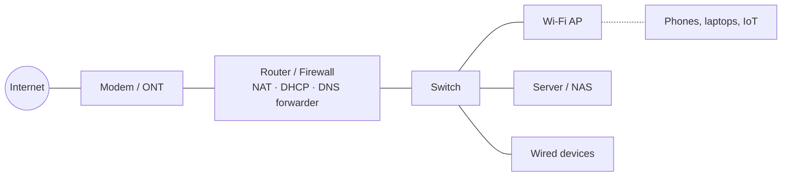

# Networking Fundamentals for the Home Lab

Networking is the subject that most often separates a home lab that works from one that is *understood*. You can run services for years on a flat network with an ISP router and never learn a thing about subnets, and many people do. But the moment you want to isolate IoT devices, run your own DNS, reach services by name with valid certificates, or connect from outside without exposing everything, you need the fundamentals. This chapter provides them, then covers the router and firewall platforms worth running.

## The mental model

A home network has, at minimum, these pieces:



The **modem** (or ONT for fibre) converts the ISP's physical medium to Ethernet. The **router** sits between the ISP's network and yours: it gets one public IP address from the ISP, hands out private addresses to your devices, translates between them (NAT), and by default blocks all inbound connections (firewall). It usually also runs DHCP (assigning addresses) and a DNS forwarder. The **switch** connects wired devices at layer 2. **Access points** do the same for Wi-Fi.

In an ISP-supplied "gateway," all of these are one box. The first upgrade most home labs make is to separate them: a dedicated router/firewall, a managed switch, and one or more access points. This is not required, but it is where control begins.

## IP addressing

### Private ranges

Your internal network uses one of the private IPv4 ranges defined in RFC 1918:

| Range | CIDR | Addresses | Typical use |
|---|---|---|---|
| 10.0.0.0 – 10.255.255.255 | 10.0.0.0/8 | 16.7 million | Large or many-subnet labs; `10.0.VLAN.0/24` schemes |
| 172.16.0.0 – 172.31.255.255 | 172.16.0.0/12 | 1 million | Less common at home; **Docker's default range** |
| 192.168.0.0 – 192.168.255.255 | 192.168.0.0/16 | 65,536 | The consumer default: `192.168.0.0/24` or `192.168.1.0/24` |

Two pieces of practical advice: first, **avoid `192.168.0.0/24` and `192.168.1.0/24`** for your lab if you can. These are the defaults on nearly every consumer router, which means when you VPN home from a hotel or a friend's house, the remote network will often be the same subnet as yours and routing will break. `10.x.y.0/24` or `192.168.[20-250].0/24` avoids most collisions. Second, **be aware of Docker's `172.17–172.31.x.x` usage** — if your LAN or a VPN uses 172.16.0.0/12, you will eventually hit a conflict. You can change Docker's default address pool in `/etc/docker/daemon.json`.

### Subnets and CIDR

A `/24` network (255.255.255.0) has 256 addresses: `.0` is the network address, `.255` is broadcast, and `.1` through `.254` are usable. That is plenty for a home. Use `/24` everywhere unless you have a specific reason not to. When you segment into VLANs (below), each VLAN gets its own `/24`.

A tidy convention: use the third octet as the VLAN ID. VLAN 10 is `10.0.10.0/24`, VLAN 20 is `10.0.20.0/24`. The router's interface on each is `.1`. Servers get static addresses in `.2–.49`; DHCP hands out `.100–.249`. When you see `10.0.20.115` in a log you instantly know it is a DHCP client on the IoT VLAN. This is arbitrary but worth adopting early.

### Static vs DHCP reservations

Servers need stable addresses. Two ways: configure a static IP on the server itself, or configure a **DHCP reservation** on the router that always hands the same IP to that MAC address. Reservations are better for almost everything — one place to look, easy to change, no risk of two machines claiming the same address. The exceptions are the router itself, the DHCP server if it is separate, and your DNS server (which must be reachable before DHCP has done its job — a chicken-and-egg problem if the DNS server is a DHCP client and the DHCP server needs DNS).

## DHCP and DNS on the LAN

**DHCP** hands each device an IP, a subnet mask, a gateway (the router), and DNS server addresses. The DNS server setting is your lever for network-wide ad-blocking ([Chapter 9](09-dns-adblock.md)): point DHCP at your Pi-hole or AdGuard Home and every device on the network uses it automatically.

**Local DNS** lets you refer to machines by name. Two layers:

1. **Hostname resolution** for LAN devices: `nas.lan`, `proxmox.lan`. The DHCP server usually registers leases into DNS automatically (dnsmasq, which underlies Pi-hole and most routers, does this). Pick a local domain suffix: `.lan`, `.home.arpa` (the RFC 8375 official choice), or `.internal` (which ICANN reserved in 2024). Avoid `.local` — it is used by mDNS/Bonjour and causes conflicts.

2. **Service names with real TLS**: `jellyfin.example.com` resolving to your reverse proxy's LAN IP, with a valid Let's Encrypt certificate, even though the service is never exposed to the internet. This uses **split-horizon DNS**: your internal DNS server answers `jellyfin.example.com` → `10.0.10.5`, while the public internet either has no record or a different one. You own a real domain, so the certificate is real. [Chapter 7](07-reverse-proxy-tls.md) covers the certificate side; [Chapter 9](09-dns-adblock.md) covers the DNS side.

!!! tip "Buy a real domain"
    A USD 10/year domain from a registrar with a good API (Cloudflare, Porkbun, Namecheap, deSEC for a free option) is the single most useful purchase for a home lab after the hardware. It unlocks valid TLS certificates for internal services via DNS-01 challenges, makes remote access easier, and makes everything feel finished. You never have to point any public DNS record at your home IP.

## NAT, port forwarding, and why you should mostly avoid the latter

**NAT (Network Address Translation)** is the mechanism that lets every device on your LAN share one public IP. Outbound connections are rewritten to appear to come from the public IP; return traffic is mapped back. Inbound connections that nobody asked for have nowhere to go, and are dropped. This accidental firewall is the main reason home networks are not constantly compromised.

**Port forwarding** punches a deliberate hole: "inbound TCP 443 on the public IP → 10.0.10.5:443." This is how you expose a service to the internet. Every forwarded port is a service that must be secured, kept updated, and monitored forever. It is a real cost.

The modern advice, which this guide repeats in several chapters: **most people should forward zero ports.** Use a mesh VPN (Tailscale, NetBird, ZeroTier, or a self-hosted WireGuard) for your own access ([Chapter 8](08-remote-access-vpn.md)). If you must expose something publicly — a website, a service for people who will not install a VPN — expose exactly one port (443) to a hardened reverse proxy with authentication in front of it, and nothing else. Never forward SSH, RDP, a NAS web UI, a database, or a management interface.

**UPnP** lets devices ask the router to open ports for them automatically. It is convenient for game consoles and a security liability for everything else — a compromised device can open whatever it likes. Disable it on any network with servers.

### Double NAT

If your ISP's gateway does NAT and you put your own router behind it doing NAT again, you have double NAT. It works for outbound traffic and breaks port forwarding, UPnP, and some VPN protocols. Fix it by putting the ISP gateway in **bridge mode** (passes the public IP through to your router) if possible; otherwise, set the ISP gateway's DMZ to your router's WAN IP so all inbound traffic reaches it.

### CGNAT

**Carrier-grade NAT** is when the ISP itself NATs you: your router's WAN address is in `100.64.0.0/10` (or sometimes an RFC 1918 range), and the public address you appear from is shared with other customers. You cannot forward ports because you do not own the public IP. Cellular home internet is nearly always CGNAT; many fibre and cable ISPs are moving there as IPv4 addresses run out.

Detection: compare your router's WAN IP with the address `curl ifconfig.me` reports from a machine behind it. If they differ (and the router's is in `100.64.0.0/10` or `10.x`), you are behind CGNAT.

It is not the end of the world. Options, in rough order of preference:

1. **Mesh VPN** (Tailscale/Headscale, NetBird, ZeroTier) — works through CGNAT via NAT traversal and relay servers. Solves personal remote access completely.
2. **Cloudflare Tunnel** or similar — an outbound connection from your lab to Cloudflare's edge, which then proxies public HTTP(S) traffic to you. No inbound ports needed. Free tier is generous. Trade-off: Cloudflare terminates TLS and sees your traffic; their ToS restricts non-HTML content (video streaming through the tunnel technically violates it).
3. **A cheap VPS as a relay** — rent a USD 4/month VPS with a public IP, connect your lab to it via WireGuard, and forward ports from the VPS to your lab through the tunnel. Pangolin, the fastest-growing self-hosted option for this pattern, packages it nicely ([Chapter 8](08-remote-access-vpn.md)). Full control, small cost, some latency.
4. **IPv6** — if your ISP provides it, your services have globally routable addresses regardless of IPv4 CGNAT. Clients need IPv6 too, which is not universal.
5. **Ask the ISP** for a public IPv4. Some provide one free or for USD 2–5/month.

## IPv6

IPv6 is the current version of the Internet Protocol. Its 128-bit addresses eliminate scarcity — your ISP will typically delegate a `/56` or `/64` prefix to your home, giving every device its own globally routable address. There is no NAT in the usual sense; the firewall is what protects you, not address hiding.

Practical points for the home lab:

- **Enable it on your router** if your ISP supports it. The router requests a prefix via DHCPv6 prefix delegation and advertises it to the LAN via Router Advertisements (RA/SLAAC). Devices self-assign addresses.
- **Your firewall rules must cover IPv6.** A default-deny inbound rule on IPv6 is as important as NAT is on IPv4. Every decent router does this by default; verify.
- **Prefixes may change** when your connection resets, which is annoying for static addressing. Use ULA (`fd00::/8`, the IPv6 equivalent of RFC 1918) for internal addressing alongside the global prefix, or use the DNS name rather than the address everywhere.
- **Docker** does not enable IPv6 in containers by default; enabling it is a few lines in `daemon.json` but adds complexity. Most services work fine with IPv4-only inside Docker even when the host has IPv6.
- **Testing**: `test-ipv6.com` from a client tells you whether IPv6 works end to end.

Many capable self-hosters run IPv4-only internally and enable IPv6 only on the WAN side for outbound. That is a defensible simplification. The reverse — leaning on IPv6 to escape CGNAT for inbound access — is also viable but requires every client network you connect from to have IPv6.

## VLANs and network segmentation

A **VLAN** (Virtual LAN, IEEE 802.1Q) lets one physical switch carry several logically separate networks. Each Ethernet frame is tagged with a VLAN ID (1–4094); switch ports are configured to be members of specific VLANs; the router has a virtual interface on each VLAN and is the only path between them. Traffic between VLANs passes through the router's firewall rules, which is the point.

### Why segment

Three motivations, in order of how often they matter at home:

1. **Untrusted devices.** The USD 15 smart plug from a brand you have never heard of, the smart TV that phones home, the robot vacuum, the doorbell camera. These devices have terrible security, receive updates rarely or never, and should not be able to reach your NAS. Put them on an IoT VLAN that can reach the internet (or not, per device) and nothing internal except perhaps Home Assistant.
2. **Guests.** Visitors' phones get a guest VLAN with internet access only. Most Wi-Fi APs can map a separate SSID to a VLAN.
3. **Blast radius.** If a service you expose to the internet is compromised, an attacker on a DMZ VLAN can reach only what the firewall permits — not your hypervisor's management interface or your backup server.

### A common layout

| VLAN | Name | Subnet | Contains | Can reach |
|---|---|---|---|---|
| 1 (default) | Management | 10.0.1.0/24 | Router, switches, APs, hypervisor management, IPMI | Everything (but nothing can reach *it* except from Trusted) |
| 10 | Trusted / LAN | 10.0.10.0/24 | Your PCs, phones, laptops | Everything |
| 20 | Servers | 10.0.20.0/24 | NAS, Docker hosts, VMs providing internal services | Internet; each other; **not** Trusted or Management (initiated) |
| 30 | IoT | 10.0.30.0/24 | Smart home devices, TVs, printers | Internet (selectively); Home Assistant on Servers VLAN; nothing else |
| 40 | Guest | 10.0.40.0/24 | Visitors | Internet only |
| 50 | DMZ | 10.0.50.0/24 | Reverse proxy, anything internet-exposed | Internet; specific backend services on Servers VLAN only |
| 60 | Cameras | 10.0.60.0/24 | IP cameras | **No internet**; Frigate/NVR on Servers VLAN only |

That is more VLANs than most people need. A useful minimal version is three: Trusted, Servers+Management, IoT+Guest. Start there. Add DMZ when you expose something. Add Cameras when you buy cameras.

### The mDNS/discovery problem

Many consumer conveniences — Chromecast, AirPlay, Spotify Connect, printer discovery, HomeKit — rely on multicast DNS (mDNS/Bonjour) and SSDP, which do not cross VLAN boundaries. If your phone on Trusted needs to cast to a Chromecast on IoT, you need an **mDNS reflector/repeater** (Avahi in reflector mode, or the built-in option on OPNsense/pfSense/UniFi) to relay discovery packets between the two VLANs, plus firewall rules allowing the actual traffic. This is the single most common frustration with segmentation and it is solvable; plan for it.

### Hardware requirements

You need: a **managed switch** that supports 802.1Q tagging; a **router** that can create VLAN interfaces and firewall between them (OPNsense, pfSense, OpenWrt, UniFi gateways, MikroTik, Firewalla, and most prosumer routers can — ISP gateways typically cannot); and **access points** that can broadcast multiple SSIDs mapped to different VLANs (UniFi, Omada, Aruba Instant On, OpenWrt-flashed APs, most business-class APs).

**Trunk vs access ports**: a port carrying multiple tagged VLANs (to the router, another switch, or an AP) is a *trunk*. A port that puts untagged traffic onto one VLAN (for an end device like a NAS) is an *access* port. Configure the switch accordingly. The **native/untagged VLAN** on a trunk carries frames without tags; keep it consistent and consider making it something unused to avoid confusion.

**Router-on-a-stick**: with one physical connection from the router to the switch carrying all VLANs as tags, all inter-VLAN traffic traverses that one link twice (in and out). At 1 GbE this can bottleneck NAS traffic between VLANs; a 2.5/10 GbE link to the router, or keeping heavy traffic within one VLAN, avoids it.

### Docker networking and VLANs

Containers on a Docker host normally sit on a private bridge network inside the host and reach the outside through the host's IP. This is fine and is how most people run. If you want a specific container (say, Home Assistant, which wants to see mDNS and DHCP broadcasts on the IoT VLAN, or a DNS server that needs its own IP) to appear as a first-class device on a specific VLAN, use a **macvlan** or **ipvlan** Docker network bound to a VLAN sub-interface (`eth0.30`). The container gets its own MAC/IP on that VLAN. The catch: by default the Docker host cannot talk to its own macvlan containers; a small routing workaround exists. [Chapter 5](05-containers.md) covers the mechanics.

## Firewalls

Every router has a firewall; the question is how much control you have over it. The default consumer posture — allow all outbound, block all unsolicited inbound — is a fine starting point. Segmentation adds inter-VLAN rules. The principles:

- **Default deny between VLANs**, then allow specific flows. Rules are processed top-down, first match wins, on most platforms.
- **Allow established/related** so return traffic for permitted connections works.
- **Think in terms of who initiates.** "IoT can't reach Servers" but "Servers can reach IoT" means Home Assistant can poll a device but the device cannot connect to Home Assistant unprompted. Sometimes you want the reverse; be explicit.
- **Log denied traffic** at first; you will discover things you did not know were talking. Then quieten it.
- **Aliases/groups** for IPs and ports keep rule sets readable. "Allow IoT → HomeAssistant:8123" not "Allow 10.0.30.0/24 → 10.0.20.14:8123."
- **Egress filtering** — blocking outbound traffic — is where you can prevent IoT devices from phoning home, force all DNS through your resolver (block outbound port 53 and 853 except from your DNS server — this also defeats devices with hardcoded `8.8.8.8`), and block outbound SMTP from anything but your mail server. It is more work and more breakage; do it deliberately.

Host-based firewalls (`ufw`, `firewalld`, `nftables` directly) on each server add a layer but interact badly with Docker, which manipulates iptables/nftables itself and will happily publish container ports around your ufw rules. See [Chapter 5](05-containers.md) and [Chapter 13](13-security.md) for the Docker-and-firewall problem.

## Router and firewall platforms

The ISP gateway works. Everything below is what you replace it with when you want VLANs, real firewall control, VPN termination, and DNS/DHCP you can shape.

### OPNsense

A FreeBSD-based firewall distribution forked from pfSense in 2015, with a modern web UI, a friendly release cadence (two major releases a year, frequent point releases), and a plugin system. Runs on any x86 machine with two or more NICs — an N100 mini PC with 2–4 Intel/Realtek 2.5 GbE ports (USD 150–250) is the community standard, and idles at 8–12 W. Features: stateful firewall, VLANs, DHCP (Kea or ISC), Unbound DNS with blocklists, WireGuard and OpenVPN and IPsec, HAProxy and Nginx and Caddy plugins for reverse proxying, CrowdSec and Suricata/Zenarmor for IDS/IPS, dynamic DNS, traffic shaping, and multi-WAN failover.

**Pick it if:** you want the most capable, best-documented, most popular open-source firewall with an active community and no licensing games. This is the guide's default recommendation.

**Watch out for:** FreeBSD has fewer drivers than Linux — Intel and most Realtek NICs work well; exotic Wi-Fi does not (run APs separately). The UI is dense. IDS/IPS on a small box eats CPU.

### pfSense CE / Plus

The older sibling. pfSense CE (Community Edition) is open source and functionally similar to OPNsense; pfSense Plus is Netgate's commercial version, free for home use on your own hardware with registration, with a more polished feature set. Netgate's community relations have been strained over the years (the 2021 WireGuard controversy, moves that pushed users towards Plus), which is why much of the community migrated to OPNsense. It remains a mature, capable platform, and Netgate's own appliances (the 1100, 2100, 4200) are decent hardware.

**Pick it if:** you already know it, or you are buying a Netgate appliance.

### OpenWrt

A Linux distribution for routers and embedded devices. Runs on hundreds of consumer routers and access points, plus x86 and ARM boards. Its strength is breadth of hardware support including Wi-Fi radios, which the BSD-based firewalls lack. Small footprint, package manager (`opkg`/`apk`), LuCI web UI, everything the others have (VLANs, firewall via `fw4`/nftables, WireGuard, DHCP/DNS via dnsmasq, Adblock, SQM traffic shaping — OpenWrt's `cake` SQM is the best bufferbloat fix available). Configuration is file-based and scriptable.

**Pick it if:** you want one box to be router, firewall, and Wi-Fi AP; you want to reflash an existing router; or you want a very low-power ARM router (GL.iNet ships OpenWrt-based routers commercially — the Flint 2 / Flint 3 are popular). Also the best choice for turning a cheap consumer AP into a VLAN-aware AP.

**Watch out for:** consumer router hardware is slow; a 2015 router will not route gigabit with SQM. The upgrade process across major versions can require reconfiguration. Documentation is a wiki of varying quality.

### Ubiquiti UniFi

A hardware-plus-software ecosystem: gateways (UCG-Ultra, UDM-Pro/SE, UXG), switches, APs, cameras, all managed from one controller UI. The appeal is the integrated experience — VLANs, SSIDs, firewall rules, and device adoption all in one polished dashboard, with an app. The gateways run Linux and are capable; the APs are excellent value for Wi-Fi.

**Pick it if:** you want a coherent ecosystem, prosumer polish, and good Wi-Fi, and are willing to accept Ubiquiti's product decisions (features come and go; the firewall UI is less powerful than OPNsense's; some features push you towards their cloud account, though local-only operation is possible).

**Watch out for:** the gateway is the weakest part of the ecosystem for people who want deep control. A common pattern is **UniFi APs and switches with an OPNsense router** — you get the Wi-Fi and switching polish with a serious firewall. The UniFi Network Application (controller) can be self-hosted in Docker for the APs and switches alone.

### TP-Link Omada

UniFi's direct competitor: controller-based, gateways + switches + APs, cheaper, less polished, adequate. The self-hosted controller runs in Docker. The same "APs and switches from Omada, router from OPNsense" hybrid works.

### MikroTik RouterOS

MikroTik makes remarkably capable, remarkably cheap hardware (the hEX, RB5009, CCR series, the CRS switch line) running RouterOS, which exposes essentially every feature of a carrier-grade router through a WinBox/web UI and a CLI. The learning curve is real — RouterOS thinks in terms that assume you know networking — but for the money nothing else comes close, and the community has extensive documentation. RouterOS v7 added WireGuard, container support, and a modern routing stack.

**Pick it if:** you want to learn real networking, you want 10 GbE switching cheaply (the CRS3xx series), or you have specific needs (BGP, MPLS, advanced QoS) that prosumer gear does not meet.

**Watch out for:** the default firewall on a fresh RouterOS install is *not* secure; you must configure it. Firmware updates have occasionally introduced bugs; the stable channel is stable, the testing channel is not.

### Others

- **VyOS**: a Linux-based router OS with a Junos-like CLI, popular with network engineers; rolling releases free, LTS builds behind a subscription/contribution as of recent years.
- **Firewalla**: a consumer-friendly appliance with a mobile-app-first design; good for people who want segmentation and ad-blocking without a web UI.
- **IPFire**, **Sophos XG Home**, **Untangle/Arista NG Firewall**: viable niche options with smaller communities.
- **A Linux box with nftables**: entirely possible; Debian with `nftables`, `kea`/`dnsmasq`, and `systemd-networkd` makes a fine router for someone comfortable with config files. No web UI is the feature and the bug.

### Comparison

| | OPNsense | pfSense | OpenWrt | UniFi | MikroTik |
|---|---|---|---|---|---|
| Base | FreeBSD | FreeBSD | Linux | Linux | Linux (RouterOS) |
| Licence | BSD (open) | CE: Apache; Plus: proprietary | GPL (open) | Proprietary | Proprietary |
| Hardware | Your x86 | Your x86 or Netgate | Routers/APs/x86/ARM | Ubiquiti only | MikroTik only |
| Web UI | Very good | Good | Good (LuCI) | Excellent | Functional |
| VLAN/firewall depth | Deep | Deep | Deep | Moderate | Very deep |
| Wi-Fi on the router | No | No | Yes | Yes (gateways with radios) | Some models |
| Learning curve | Medium | Medium | Medium | Low | High |
| Idle power (typical) | 8–15 W (N100) | 8–15 W | 3–10 W | 5–15 W | 3–20 W |

## Wi-Fi

Wi-Fi is how most devices connect, and it is a separate skill. Brief guidance:

- **Separate the AP from the router.** Dedicated APs (UniFi U6/U7 series, TP-Link Omada EAP series, Aruba Instant On, Ruckus Unleashed used, or OpenWrt on a good consumer AP) are better radios in better positions than anything built into a router in a cupboard.
- **Multiple SSIDs mapped to VLANs** (Trusted, IoT, Guest) is the standard segmentation approach. Most 2.4 GHz-only IoT devices will be happier on a 2.4 GHz-only IoT SSID.
- **Wi-Fi 6 (802.11ax)** is the current sweet spot; Wi-Fi 6E adds the 6 GHz band; Wi-Fi 7 is available and improving. Client support lags; the AP matters less than placement and channel planning.
- **Wire everything that can be wired.** Every device on Ethernet is a device not competing for airtime.
- **PoE** (802.3af/at) powers APs and cameras over the Ethernet cable; a PoE switch or injector removes the need for a power outlet at the AP's location.
- Mesh systems (Eero, Deco, Orbi, Google/Nest Wifi) are fine for people who do not want VLANs and are limiting for people who do.

## Cabling and physical layer

- **Cat 6 or Cat 6A**. Cat 6 does 10 GbE to 55 m; Cat 6A to 100 m. Cat 5e does 2.5 GbE fine and 1 GbE always. Do not bother with Cat 7/8 for home.
- **Solid-core cable for in-wall runs, stranded for patch cables.** Terminate solid core in keystone jacks/patch panels, not RJ45 plugs.
- **Fibre** (single-mode LC with 10G-LR optics, or multi-mode OM3/OM4 with SR optics) for 10 GbE runs longer than a DAC, or for electrical isolation between buildings. Optics are cheap on the used market (FS.com for new).
- **Label everything.** Both ends of every cable.
- **A patch panel** is not required but makes a rack sane.
- Test long runs with a cable tester; a USD 20 tester catches miswires, and `ethtool` on Linux shows negotiated speed and errors (`ethtool -S eth0` — rising `rx_crc_errors` means a bad cable).

## Useful diagnostics

Every self-hoster eventually needs these:

```bash
ip addr                  # interfaces and addresses
ip route                 # routing table; 'default via' is your gateway
ip -6 route              # same for IPv6
ping -c4 10.0.10.1       # reachability
ping -c4 1.1.1.1         # internet reachability without DNS
ping -c4 one.one.one.one # DNS + internet
dig @10.0.20.5 jellyfin.example.com   # query a specific DNS server
resolvectl status        # systemd-resolved's view of DNS config
ss -tulpn                # what is listening on this host
traceroute 1.1.1.1 / mtr 1.1.1.1      # path and per-hop loss
tcpdump -i eth0 port 53  # watch DNS traffic live
nmap -sn 10.0.30.0/24    # who is on the IoT VLAN
ethtool eth0             # link speed, duplex
iperf3 -s / iperf3 -c host   # measure actual throughput between two machines
```

## Networking checklist

- [ ] Chosen a LAN subnet that is not `192.168.0.0/24` or `192.168.1.0/24`.
- [ ] Servers have DHCP reservations (or documented static IPs); DNS and DHCP servers have static IPs.
- [ ] Know whether you have a public IPv4, CGNAT, and/or IPv6; remote access strategy chosen accordingly.
- [ ] UPnP disabled.
- [ ] Zero ports forwarded until a specific, justified need exists; when it does, exactly one (443) to a reverse proxy.
- [ ] A managed switch and a VLAN-capable router/firewall, if segmentation is desired.
- [ ] At minimum: IoT/untrusted devices on a separate VLAN from servers and personal devices.
- [ ] Default-deny inter-VLAN policy with specific allows; IPv6 inbound default-deny verified.
- [ ] DNS for the LAN under your control (see [Chapter 9](09-dns-adblock.md)).
- [ ] A real domain registered; local DNS suffix chosen (`home.arpa`, `internal`, or `lan`; not `.local`).
- [ ] Everything labelled; a diagram or table of VLANs, subnets, and IPs saved with your documentation.
