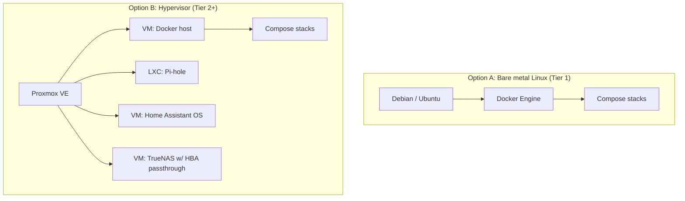

# Operating Systems and Hypervisors

The operating system is the layer between your hardware and your services, and the choice shapes everything above it: how you install software, how you isolate workloads, how you back up, how you recover. This chapter compares the realistic options — bare Linux distributions, the Proxmox hypervisor, NAS-oriented systems like TrueNAS and Unraid, turnkey self-hosting distributions, and the declarative outlier NixOS — and explains the fundamental question underneath: virtual machines, containers, or both.

## The fundamental choice: what runs where

There are three ways to run a service on a machine:

**Directly on the host OS** — install the package, run the daemon. Simple, efficient, and how servers were run for decades. The downside is entanglement: every service shares the same library versions, the same filesystem, the same failure domain. Upgrading one thing can break another. Reinstalling the OS means reinstalling everything.

**In a container** — a process (or a few) running on the host's kernel but with its own isolated filesystem, network namespace, and resource limits. Containers share the kernel, so they start in milliseconds and cost almost no overhead. Docker/Podman *application containers* package one service with its exact dependencies; LXC *system containers* look like a lightweight VM with a full init system. [Chapter 5](05-containers.md) is entirely about application containers.

**In a virtual machine** — a complete emulated computer with its own kernel, booted from its own disk image. Strong isolation, any OS (Windows, BSD, another Linux), hardware passthrough of GPUs and disks, live migration between hosts. The cost is overhead: a VM reserves RAM up front, boots in seconds not milliseconds, and adds a virtualisation layer between the service and the hardware.

The 2026 home-lab consensus is a **layered approach**: a hypervisor (usually Proxmox) on the bare metal, a small number of VMs or LXC containers as "Docker hosts," and Docker Compose stacks inside those. Alternatively — and equally valid for Tier 1 — skip the hypervisor entirely: plain Debian on bare metal, Docker on top. The hypervisor earns its place when you want to run more than one OS, snapshot the whole machine, or separate concerns (a storage VM, a home-automation VM, a "things I am experimenting with" VM that can be destroyed without ceremony).

## Bare Linux distributions

### Debian

The reference server distribution. Stable releases every two years, five years of security support (with LTS/ELTS beyond), conservative package versions, no surprises. It is what Proxmox, TrueNAS SCALE, Raspberry Pi OS, Ubuntu, and half the Docker images in the world are built on. A minimal Debian install uses about 100 MB of RAM and 1 GB of disk.

**Pick it if:** you want the most boring, most documented, most predictable base. This is the guide's recommendation for a Docker host, whether bare metal or as a VM.

**Watch out for:** package versions are old by design. You will install Docker from Docker's own repository, not Debian's. The installer asks more questions than Ubuntu's. Non-free firmware for some Wi-Fi and GPU hardware was historically a separate step (since Debian 12 it is included in the installer).

### Ubuntu Server

Debian's derivative with a six-month release cadence and LTS releases every two years (24.04 "Noble", 26.04 "Resolute" as of this writing) that get five years of standard support. More current kernels and packages than Debian stable, a slicker installer with cloud-init baked in, and the largest body of "how do I..." tutorials on the internet.

**Pick it if:** you want newer hardware support (the HWE kernel track), or you are following tutorials that assume Ubuntu, or you want `cloud-init` for automated VM provisioning.

**Watch out for:** Canonical's **snap** packaging is forced on some packages (including, notably, the `docker` snap if you `apt install docker.io` on some releases — always use Docker's official apt repo instead). Snaps auto-update on their own schedule, mount loop devices that clutter `df`, and have caused enough friction that many self-hosters strip snapd entirely. Ubuntu Pro nagging in `apt` output and `motd` is a minor irritant, disable-able. Ubuntu is otherwise excellent.

### Fedora Server / CoreOS / Rocky / Alma

**Fedora Server** is bleeding-edge with a thirteen-month support window; fine for a lab you enjoy re-installing, poor for one you want to forget about. **Fedora CoreOS** is an immutable, auto-updating container host provisioned via Ignition files — a genuinely good fit for "a Docker/Podman host that maintains itself," with a steeper learning curve. **Rocky Linux** and **AlmaLinux** are the RHEL rebuilds: ten-year support, enterprise conventions (SELinux enforcing, firewalld, `dnf`), Podman as the default container runtime. Pick them if you work with RHEL professionally and want your lab to match.

### Arch, Alpine, and others

**Arch** is rolling-release and requires attention; a fine desktop, a poor unattended server. **Alpine** is a 5 MB musl-based distribution that powers most container images and makes a superb minimal host for a single-purpose box (a Pi-hole, a WireGuard endpoint) — its `apk` package manager and OpenRC init are simple, and it idles at 40 MB of RAM. **openSUSE MicroOS/Leap Micro** is an immutable container host with transactional updates; niche but well-regarded.

### Which Linux?

For a Docker host: **Debian stable**. For a Docker host where you want the newest kernel or plan to use cloud-init heavily: **Ubuntu Server LTS**. Everything else is a specific-purpose or personal-preference choice. The differences matter far less than the community loves to argue; you will spend your time in Docker, not in the distribution.

## Proxmox Virtual Environment

Proxmox VE is a Debian-based hypervisor platform combining KVM/QEMU virtual machines, LXC system containers, ZFS and Ceph storage, software-defined networking, a built-in backup system, clustering, and a comprehensive web UI. It is free and open source (AGPL); Proxmox GmbH sells optional enterprise repository access and support subscriptions. It has become the default hypervisor of the home-lab community, and for good reason.

### Why it dominates

- **VMs and LXC in one UI.** Spin up a full Windows VM, a Home Assistant OS VM, and a dozen tiny Debian LXCs for individual services, all managed identically.
- **ZFS native.** Install the OS onto a ZFS mirror; create ZFS pools for VM storage; snapshot and replicate them. Proxmox exposes ZFS features in the UI.
- **Snapshots and backups.** Snapshot a VM before an upgrade; roll back in seconds if it goes wrong. Scheduled backups to local storage, NFS/SMB, or **Proxmox Backup Server** (PBS — a separate, free product that does deduplicated, incremental, encrypted, verified backups of VMs and containers; see [Chapter 11](11-backups.md)).
- **Hardware passthrough.** Pass a GPU to a VM for transcoding or AI; pass an HBA to a TrueNAS VM so it owns the disks directly; pass a USB Zigbee stick to Home Assistant.
- **Clustering.** Two or more nodes form a cluster with shared management, live migration (with shared or replicated storage), and high availability. A third "vote" (a Raspberry Pi running the tiny `qdevice`) lets a two-node cluster maintain quorum.
- **Community.** Enormous. The Proxmox forum, r/Proxmox, and the unofficial community scripts (originally by tteck, now community-maintained at `community-scripts.github.io/ProxmoxVE`) that one-line-install dozens of services into LXCs.

### Realities and gotchas

- **Hardware requirements** are modest: any 64-bit CPU with VT-x/AMD-V (all of them since ~2010), 8 GB RAM minimum in practice, an SSD. ZFS root wants two SSDs for a mirror; it will run on one.
- **Consumer SSDs and ZFS write amplification.** Proxmox's cluster services and logs write constantly; on a ZFS root this can burn through a cheap consumer SSD's endurance in a couple of years. Mitigations: use an enterprise SSD with PLP for the boot pool (used Intel/Samsung SATA enterprise drives are USD 30–60), or accept ext4 root on a single drive with regular config backups, or reduce the logging. Community threads on "Proxmox SSD wearout" are extensive.
- **The enterprise repo nag.** Without a subscription the UI shows a dialog at login and `apt` needs the no-subscription repository configured. Both are trivially handled (the community scripts do it) and the software is not crippled.
- **Networking model.** Proxmox creates a Linux bridge (`vmbr0`) on your NIC; VMs attach to it. VLAN-aware bridges let you tag per-VM. It is flexible and it is a place beginners get lost — the UI is fine, but understanding what a bridge is helps.
- **LXC vs VM for Docker.** Running Docker *inside an LXC* works (with `nesting=1` and `keyctl=1` features enabled) and is lighter than a VM, but Proxmox officially recommends a VM for Docker, and edge cases (some storage drivers, AppArmor profiles, kernel-module-dependent containers like Tailscale in kernel mode or anything needing `/dev/net/tun`) are smoother in a VM. Common practice: **a Debian VM with 4–8 GB RAM as the primary Docker host; LXCs for individual light services** that benefit from being separately snapshot-able (Pi-hole, a reverse proxy, Vaultwarden).
- **Storage layout.** `local` (directory, for ISOs/templates/backups) and `local-zfs` or `local-lvm` (block storage for VM disks) by default. Add NFS/SMB shares from a NAS for bulk data; add PBS for backups. Do not fill a ZFS pool past ~80%.
- **Memory ballooning and overcommit** work for VMs; ZFS's ARC will use half the host RAM by default and can be limited (`/etc/modprobe.d/zfs.conf`, `options zfs zfs_arc_max=...`).

### A quick installation walkthrough

1. Download the ISO, write it to USB (`dd` or Ventoy/Rufus/balenaEtcher), boot it. Choose the graphical installer.
2. **Target disk**: choose ZFS (RAID1 if two SSDs, RAID0/single otherwise) or ext4/LVM. Advanced options: for ZFS on consumer SSDs consider `ashift=12` (default), compression `lz4` (default), and leave a little unpartitioned space.
3. Set country/timezone/keyboard, root password and email (for alerts), a hostname FQDN (`pve.home.arpa`), and a **static IP** with gateway and DNS.
4. Reboot; browse to `https://<ip>:8006`; log in as `root` with realm `Linux PAM`.
5. **Post-install**: run the community post-install script (disables the enterprise repo, adds the no-subscription repo, removes the nag, updates) or do the same by hand. `apt update && apt full-upgrade`. Reboot.
6. **Storage**: if you have additional disks, Datacenter → Storage or node → Disks → ZFS to create a pool.
7. **Templates**: node → local → CT Templates → download `debian-12-standard` (or 13). Upload OS ISOs to local for VMs.
8. **First VM**: Create VM → Debian ISO → System: `q35`, `OVMF (UEFI)`, add EFI disk, enable QEMU Agent → Disks: `VirtIO SCSI single`, discard on, SSD emulation on → CPU: type `host`, 2–4 cores → Memory: 4096–8192 → Network: `vmbr0`, VirtIO. Install Debian, install `qemu-guest-agent`, install Docker.
9. **First LXC**: Create CT → Debian template → unprivileged, 512 MB RAM, 4 GB disk, DHCP or static → start → `apt update && apt install -y ...`.
10. **Backups**: Datacenter → Backup → Add: schedule nightly, mode snapshot, retention (e.g., keep-daily 7, keep-weekly 4), storage local or PBS. Test a restore.

### Proxmox Backup Server

A companion product that deserves its own mention. PBS runs on its own machine (or a VM elsewhere — *not* on the host it backs up) and receives incremental, chunk-deduplicated, optionally client-side-encrypted backups from Proxmox VE hosts. Verification jobs check chunk integrity; sync jobs replicate to a second PBS (off-site); prune and garbage-collect jobs manage retention. Restoring a single file from inside a VM disk image via the web UI is a killer feature. It also has a `proxmox-backup-client` for backing up arbitrary directories from any Linux host. If you run Proxmox, run PBS — a used mini PC with a few terabytes of disk is enough.

## TrueNAS

TrueNAS is iXsystems' storage-focused platform built around ZFS. Historically two flavours: **TrueNAS CORE** (FreeBSD-based, the FreeNAS lineage, now in maintenance-only mode as of 2024–2025) and **TrueNAS SCALE** (Debian-based, the actively developed line, renamed simply **TrueNAS Community Edition** in the 25.x releases). This guide means the Linux-based version when it says TrueNAS.

### What it does well

- **ZFS storage management** through a polished web UI: pools, vdevs, datasets, snapshots with schedules, replication to another TrueNAS or any SSH host, scrubs, SMART tests, alerts. If you want ZFS without learning every `zpool`/`zfs` command, this is the best UI for it.
- **Sharing**: SMB (with Active Directory or standalone users, shadow copies from ZFS snapshots), NFS, iSCSI, S3-compatible (via MinIO app — though its bundled status has shifted), WebDAV historically. Fine-grained ACLs.
- **Apps**: since the 24.10 "Electric Eel" release, TrueNAS apps are plain **Docker Compose** under the hood (replacing the previous Kubernetes/Helm-based system that was widely disliked for its complexity and resource overhead). The app catalogue installs common services with a form-based UI, and you can also paste custom Compose YAML. This made TrueNAS a viable all-in-one for Tier 1–2.
- **VMs** via KVM, for the occasional Windows or Home Assistant OS VM alongside storage. Less full-featured than Proxmox but present. (The 25.x releases moved VM management to an Incus-based backend, adding LXC containers as well.)

### Where it is weaker

- It is a storage appliance first. If you want a general-purpose hypervisor with fine control, Proxmox is better. The common Tier 2 pattern is **TrueNAS as a VM on Proxmox with an HBA passed through**, or TrueNAS on its own hardware with Proxmox on another box mounting its NFS/iSCSI.
- The apps system, while now Compose-based, still abstracts things in ways that occasionally frustrate people who know Docker well (path conventions, the "ix-applications"/`ix-apps` dataset, user/group ID mapping). Many run a single "Dockge" or "Portainer" app and manage stacks from there instead.
- iXsystems' direction is enterprise-first; free-tier features have occasionally been reshuffled. The community is large and helpful but the forums can be dogmatic (ECC, RAIDZ1, USB drives).
- Do not put the boot drive on a USB stick, do not use hardware RAID, do not use SMR drives, and give it 16 GB of RAM if you can. These are the perennial TrueNAS forum greetings for a reason.

**Pick it if:** storage is the centre of your lab, you want ZFS with a UI, and you want SMB/NFS shares done properly. It is the best free NAS OS.

## Unraid

Unraid is a paid (one-time licence, USD 49–249 by drive count as of 2026; a subscription tier was introduced in 2024 for the lower tiers, with the lifetime "Unleashed"/"Lifetime" option remaining) Slackware-based NAS OS with a unique storage model and a superb app ecosystem.

### The storage model

Unraid's **array** is not RAID: each data drive holds a complete, independent filesystem (XFS or Btrfs, and ZFS as of 6.12), and one or two **parity drives** protect against one or two drive failures. Files are written whole to a single drive, chosen by allocation policy; a **user share** presents the union of all drives as one folder tree. Consequences:

- **Mix any drive sizes**; parity just has to be at least as large as the largest data drive. Add one drive at a time. This is the killer feature for people who accumulate drives gradually.
- **Drives spin down independently**; reading a file spins up only the drive holding it. Idle power is very low for a multi-drive box.
- **Losing more drives than you have parity loses only the data on those drives**, not the whole array — each surviving drive is still a readable filesystem.
- **Write performance is limited** to single-drive speed (with parity calculation overhead) unless you use a **cache pool** (SSDs, usually a Btrfs or ZFS mirror) that receives writes and a nightly "mover" migrates them to the array. Reads are single-drive speed.
- No bit-rot protection at the array level with XFS (Btrfs or ZFS per-disk gives checksumming but not self-healing without redundancy at that layer).

### Apps and VMs

Unraid's **Community Applications** plugin is the friendliest Docker experience available anywhere: a searchable catalogue of thousands of templates, each a form with the ports, paths, and variables filled in, with sensible defaults for the `appdata` and media paths. It hides Compose behind a UI (a Compose plugin exists for people who prefer YAML). The KVM-based VM manager is good, with straightforward GPU/USB passthrough and a well-trodden path for a gaming VM.

### Verdict

**Pick it if:** you want the easiest possible all-in-one NAS-plus-Docker-plus-VM box, you have (or will accumulate) mismatched drives, you value low idle power from spun-down disks, and you are fine paying for software. Unraid has a devoted community and a wealth of video tutorials (SpaceInvader One is the canonical channel).

**Watch out for:** the parity-array model is slower than RAID/ZFS for large sequential writes and has no self-healing; take backups seriously. The OS runs from a USB stick (licensed to its GUID) and loads into RAM — the stick's reliability matters, and replacing it requires a licence transfer. Reliance on a single small company.

## Other hypervisors and NAS systems

**XCP-ng** (with the Xen Orchestra management UI) is the open-source Xen-based alternative to Proxmox with a strong enterprise pedigree (it is the fork of Citrix XenServer). Excellent for learning Xen, solid clustering and backup story via XO, less community traction for home labs than Proxmox and no LXC-style containers. Vates (its maintainer) has been friendly to the community.

**Harvester** (SUSE/Rancher) is a Kubernetes-native hyperconverged platform — VMs on KubeVirt, storage on Longhorn. Interesting if you are all-in on Kubernetes; heavy (16 GB RAM minimum per node, realistically 32) and overkill for a home.

**VMware ESXi** was a home-lab staple for years via the free licence. Broadcom's acquisition (2023) ended the free tier, then partially reinstated a free ESXi 8 for personal use in 2025; the ecosystem's trust is damaged and the community has largely moved to Proxmox. Not recommended for new labs.

**Microsoft Hyper-V** (on Windows Server or Windows 10/11 Pro) is fine if you are a Windows shop; almost nobody in the self-hosting community runs it as the base layer.

**OpenMediaVault (OMV)** is a Debian-based NAS distribution with a web UI for shares, users, and disks, plugins for MergerFS/SnapRAID and Docker (via the `openmediavault-compose` plugin). Lighter and less opinionated than TrueNAS; supports any filesystem. Popular on Raspberry Pi and low-end hardware as a "Debian with a NAS UI." Solid choice for a MergerFS+SnapRAID media box ([Chapter 6](06-storage.md)).

**Synology DSM / QNAP QTS / UGREEN UGOS** — the commercial NAS operating systems, discussed in [Chapter 2](02-hardware.md). They run Docker (Synology's "Container Manager" is Docker with a UI; you can also SSH in and use Compose). Excellent appliance experience; limited as hypervisors.

**HexOS** — a commercial (Eshtek, 2024–) consumer-friendly frontend built on TrueNAS, aimed at people who find TrueNAS intimidating. Early days.

**Rockstor**, **ZimaOS**, **CasaOS**, **Cosmos Cloud**, **Umbrel**, **YunoHost**, **Runtipi**, **Tipi**, **DietPi** — turnkey or semi-turnkey systems that put a friendly app-store layer over Docker on a Linux base. Covered in the next section.

## Turnkey self-hosting distributions

These are for people who want the appliance experience on their own hardware without a commercial NAS.

| System | Base | Model | Strengths | Limits |
|---|---|---|---|---|
| **CasaOS** | Any Debian/Ubuntu (installs on top) | Docker with an app store | Beautiful UI, one-click apps, file manager | Thin abstraction; when it breaks you are in Docker anyway. Owned by IceWhale (ZimaBoard maker) |
| **ZimaOS** | Own image | CasaOS as a full OS with storage management | Polished, ZimaCube hardware integration | Younger, less flexible |
| **Cosmos Cloud** | Any Linux (Docker) | Reverse proxy + auth + app store + container manager in one | Built-in SSO, TLS, and security features; genuinely thoughtful | Single developer; opinionated |
| **Umbrel** | Own image or on top of Debian | App store, originally Bitcoin-node-focused | Slick, easy | Limited control, curated catalogue |
| **YunoHost** | Debian (installs on top) | Apps installed natively, not Docker; built-in SSO, mail, DNS | Mature, privacy-focused, great for email and federated services | Its own packaging format; fewer apps than Docker catalogues |
| **Runtipi** | Any Linux (Docker) | App store over Compose | Simple, transparent, easy to eject from | Smaller catalogue |
| **DietPi** | Debian (own image, mainly for SBCs) | Menu-driven installer for many services | Very light, great on Pis | Not a container platform |
| **Cloudron** | Ubuntu | Commercial platform (free tier limited to two apps) | Best-in-class managed self-hosting: updates, backups, SSO, email all handled | Subscription for more than a couple of apps |

The honest assessment: these are excellent on-ramps and legitimate long-term homes for people who want an appliance. Their weakness is the moment something breaks or you want to do something outside the catalogue — then you are dropped into the underlying Docker with less understanding than if you had started there. Cosmos and Cloudron are the most complete as platforms; CasaOS is the most popular; YunoHost is the most philosophically distinct (no Docker, native packages, first-class email and federation).

## NixOS: the declarative outlier

NixOS is a Linux distribution where the entire system — packages, services, users, firewall, mounts, everything — is described in a set of declarative configuration files (the Nix language) and built atomically. `nixos-rebuild switch` makes the machine match the config; if it does not work, boot the previous generation from the GRUB menu. The config lives in Git; rebuilding an identical machine on new hardware is `git clone` and one command.

For a home lab this is compelling: no configuration drift, no "what did I change six months ago," trivially reproducible hosts, and native declarative support for hundreds of services (`services.jellyfin.enable = true;`) as well as declarative Docker/Podman containers (`virtualisation.oci-containers`). Many experienced self-hosters have converged on NixOS as their host OS with a mix of native services and containers.

The cost is a steep learning curve: the Nix language is unusual, error messages are opaque, documentation is fragmented across the manual, the wiki, and blog posts, and doing anything the "Nix way" takes longer the first time. Flakes (the modern project structure) are still technically experimental after years. It is the best choice for someone who enjoys that kind of rigour and the worst for someone who wants to follow a random tutorial. [Chapter 27](27-automation-iac.md) covers it as an infrastructure-as-code approach.

## LXC versus VM versus Docker: a decision guide

| Concern | Docker container | LXC container (Proxmox) | VM |
|---|---|---|---|
| Startup | milliseconds | ~1 s | 10–60 s |
| RAM overhead | ~0 | ~20–50 MB | 200 MB–1 GB+ (guest kernel, reserved RAM) |
| Isolation | process-level (shared kernel) | OS-level (shared kernel, own init) | full (own kernel) |
| Runs a different kernel/OS | no | no (Linux only, host kernel) | yes (Windows, BSD, any Linux) |
| Hardware passthrough | device files (`/dev/dri`), not PCIe | device files, bind mounts | PCIe (GPU, HBA, NIC), USB |
| Snapshot/rollback | image layers; volumes are your problem | Proxmox snapshots (ZFS/LVM-thin) | Proxmox snapshots incl. RAM state |
| Live migration | no (stateless redeploy instead) | restart-migration | yes, with shared/replicated storage |
| Update model | pull new image, recreate | apt inside, like a server | apt inside, like a server |
| Best for | 90% of self-hosted apps | single light services on Proxmox; Docker host when RAM is tight | Docker host; anything needing a GPU/HBA; non-Linux; untrusted workloads |

Rules of thumb:

- **Application services**: Docker, always, unless the project explicitly recommends otherwise (Home Assistant strongly prefers its own OS image in a VM for the full add-on experience).
- **Docker hosts on Proxmox**: a VM. An LXC works and saves RAM; a VM avoids the edge cases.
- **Storage**: never virtualise the storage layer unless you pass the disk controller through wholesale. A TrueNAS VM with an HBA passed through is fine; a TrueNAS VM on virtual disks is a recipe for confusion and data loss.
- **Firewalls** (OPNsense as a VM): works well with dedicated NICs passed through or VirtIO bridges, and is popular; the risk is that your whole network goes down when you reboot the hypervisor. A dedicated box is more robust; a VM is acceptable if you understand the dependency.
- **Home Assistant**: HAOS in a VM (Proxmox community script) for the full experience with add-ons; Docker for people who manage their own MQTT/Zigbee2MQTT anyway and want Compose everywhere.

## Comparison matrix

| | Debian + Docker | Proxmox VE | TrueNAS | Unraid | OMV | NixOS | CasaOS/Cosmos |
|---|---|---|---|---|---|---|---|
| Licence | Free | Free (AGPL) + optional sub | Free | Paid (USD 49–249 / sub) | Free | Free | Free (Cosmos has paid tier) |
| Primary role | Container host | Hypervisor | NAS + apps | NAS + apps + VMs | NAS | Declarative host | App-store host |
| Storage tech | Any (you manage) | ZFS, LVM, Ceph, dir | ZFS | Parity array + cache pools; ZFS | Any + MergerFS/SnapRAID | Any | Any (basic) |
| VMs | via libvirt/KVM manually | Yes (excellent) | Yes (basic) | Yes (good) | Via plugin | Yes (libvirt) | No |
| Containers | Docker/Podman | LXC; Docker in a VM/LXC | Docker (Compose-based apps) | Docker (best UI) | Docker via plugin | Docker/Podman/native | Docker |
| Web UI | None (add Portainer/Dockge) | Yes | Yes | Yes | Yes | None | Yes |
| Learning curve | Medium | Medium | Medium | Low | Low–Medium | High | Low |
| Min RAM (practical) | 2 GB | 8 GB | 16 GB | 4 GB | 2 GB | 2 GB | 2 GB |
| Best tier | 1 | 2–3 | 2 | 1–2 | 1 | 2–3 (for enthusiasts) | 1 |

## Recommendations

**Tier 1, one machine:** Debian (or Ubuntu LTS) with Docker Compose. Add Dockge or Portainer if you want a UI. If you want ZFS or Btrfs for your data drives, both are available natively. This is the simplest thing that works and it teaches you the most transferable skills.

**Tier 1, "I want an appliance":** Unraid if you have mixed drives and want VMs too; TrueNAS if you want ZFS and a first-class NAS; CasaOS or Cosmos on Debian if you mainly want an app store.

**Tier 2, compute + storage:** Proxmox on the compute box (Debian VM as Docker host, LXCs for light services, PBS for backups). TrueNAS on the storage box, or TrueNAS as a Proxmox VM with an HBA passed through if you consolidate.

**Tier 3:** Proxmox cluster (three nodes or two plus a qdevice) with ZFS replication or Ceph; PBS on separate hardware; TrueNAS or a bare-Debian ZFS box for bulk storage; NixOS or Ansible-managed Debian for the VMs if you want reproducibility ([Chapter 27](27-automation-iac.md)).

Whatever you choose: install it, then immediately set up backups of its configuration, and *write down* how you installed it. The OS is the one layer you cannot restore from a backup of itself.
