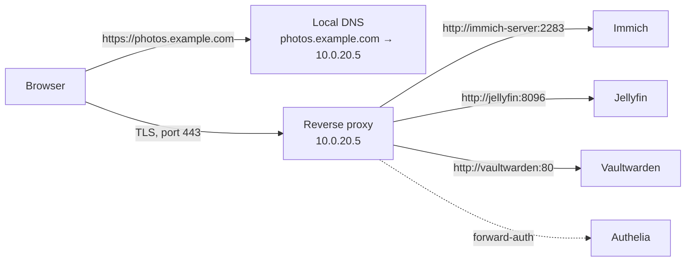

# Reverse Proxies and TLS Certificates

A reverse proxy is the front door to everything you self-host. It takes every incoming HTTPS request, looks at the hostname, and hands the request to the right backend service — so `jellyfin.example.com`, `photos.example.com`, and `vault.example.com` all arrive on one IP and one port, each with a valid certificate, and no service ever needs to be reached by `10.0.20.5:8096` again. This chapter explains how that works, how to get free trusted certificates for services that are never exposed to the internet, and compares the proxies worth running: Nginx Proxy Manager, Traefik, Caddy, Nginx, HAProxy, SWAG, Zoraxy, and Pangolin.

## Why you need one

Without a reverse proxy, every service is an IP and a port. `http://10.0.20.5:8096`. `http://10.0.20.5:2283`. `http://10.0.20.7:8080`. Browsers warn that the connection is insecure. Passwords travel in plaintext across the LAN. Nothing has a memorable name. If you expose anything to the internet you must forward one port per service, each one a separate attack surface.

With a reverse proxy:

- **One entry point.** Port 443 on one machine. Everything else is reachable only through it.
- **Real names.** `jellyfin.example.com`. Your family can remember it.
- **Real certificates.** Free, trusted, automatically renewed. No browser warnings, ever, even for services that never leave your LAN.
- **A place to put authentication.** Forward-auth to Authelia or Authentik ([Chapter 10](10-identity-sso.md)) protects services that have weak or no login of their own.
- **A place to put defences.** Rate limiting, IP allow-lists, CrowdSec or fail2ban integration, security headers, geo-blocking.
- **Backend simplicity.** Services speak plain HTTP on an internal network; the proxy handles TLS, HTTP/2, HTTP/3, compression.



## TLS certificates: the essentials

### What a certificate does

A TLS certificate binds a hostname to a public key and is signed by a Certificate Authority (CA) that browsers trust. When your browser connects to `photos.example.com`, the server presents its certificate; the browser checks the signature chain up to a trusted root, checks the name matches, and proceeds to encrypt. If any step fails: the red warning page.

### Let's Encrypt and ACME

**Let's Encrypt** is a non-profit CA that issues free certificates, valid for 90 days, via an automated protocol called **ACME**. Renewals are automatic; you never touch a certificate file by hand. It changed the web, and it is what every self-hoster uses. Alternatives that also speak ACME: **ZeroSSL**, **Google Trust Services**, **Buypass**. Certificate lifetimes across the industry are shortening (the CA/Browser Forum has scheduled a reduction to 47 days by 2029; Let's Encrypt began offering optional 6-day certificates in 2025), which makes automation not merely convenient but mandatory.

To issue a certificate, the CA needs proof that you control the domain. ACME has two common **challenge types**:

**HTTP-01**: the CA connects to `http://yourdomain/.well-known/acme-challenge/<token>` on port 80 and expects a specific response. Requires port 80 to be reachable from the internet, so your home must have a public IP with port 80 forwarded. Works only for the exact hostname; no wildcards.

**DNS-01**: your ACME client creates a TXT record `_acme-challenge.yourdomain` at your DNS provider via API, and the CA checks it. **Requires nothing to be exposed** — no open ports, no public IP, works behind CGNAT. Supports **wildcard certificates** (`*.example.com`), so one certificate covers every service. This is the method you want.

!!! tip "DNS-01 with a wildcard is the self-hoster's standard"
    Buy a domain at a registrar whose DNS has an API (Cloudflare, Porkbun, deSEC, Hetzner, DigitalOcean, Gandi, Namecheap, OVH, Route 53 — every ACME client supports dozens), point the domain's nameservers there, create a scoped API token, give it to your proxy. You get `*.example.com` renewed forever, with zero inbound exposure. Every proxy below supports it.

### Internal services with public certificates

The trick that confuses newcomers: **you can have a valid, publicly trusted certificate for a hostname that resolves only on your LAN.** DNS-01 validation proves you own `example.com`; it does not care what `jellyfin.example.com` resolves to or whether it is reachable. So:

1. Your public DNS (at Cloudflare/Porkbun/etc.) has no A record for `jellyfin.example.com` at all — or has one pointing at a private IP, which is harmless.
2. Your **internal DNS** (Pi-hole/AdGuard/Unbound/router — [Chapter 9](09-dns-adblock.md)) has a record — or a wildcard — pointing `*.example.com` at your reverse proxy's LAN IP.
3. The proxy has a wildcard certificate from Let's Encrypt via DNS-01.
4. Browsers on the LAN resolve the name locally, connect to the proxy, see a certificate signed by a trusted CA for a matching name, and show the padlock.

This is **split-horizon DNS**, and it is the foundation of a clean home lab. When you later connect via VPN, your VPN client uses the internal DNS and everything works identically from anywhere.

One privacy note: Let's Encrypt publishes every certificate it issues to **Certificate Transparency** logs, which are publicly searchable (crt.sh). Individual hostnames like `vault.example.com` will appear there. A wildcard certificate leaks only `*.example.com`, revealing nothing about which services you run. Another argument for the wildcard.

### Internal CAs

The alternative to public certificates is running your own CA and installing its root on every device. **step-ca** (Smallstep) is a full ACME-capable private CA; **mkcert** is a dev tool for quick local certs; Caddy has an internal CA built in (`tls internal`). The downside is real: every phone, laptop, TV, and IoT device needs the root installed, and some (Android apps, smart TVs, Chromecast) make that hard or impossible. For a home lab, a real domain and DNS-01 is less work and works everywhere. Internal CAs make sense for mTLS between services, for SSH certificates, or in air-gapped environments.

### Cloudflare-specific notes

Cloudflare is the most popular DNS provider for self-hosters because its free tier includes an excellent DNS API. Two things to know:

- **Proxied (orange cloud) vs DNS-only (grey cloud).** If you point a public record at your home IP, "proxied" hides your IP behind Cloudflare's edge and gives you their WAF and DDoS protection — but Cloudflare terminates TLS, so they see your traffic in plaintext, and their ToS historically restricts non-HTML content (video streaming, large downloads) on the free tier through the proxy. "DNS-only" just returns your IP. For DNS-01 challenges, the proxy status is irrelevant.
- **Cloudflare Origin certificates** are free 15-year certificates trusted *only by Cloudflare's edge*, for the Cloudflare-to-your-server leg. They are not trusted by browsers; use them only behind the orange cloud.

## The candidates

### Nginx Proxy Manager (NPM)

A web UI on top of Nginx with Let's Encrypt built in. Add a "proxy host": type a domain, a backend IP and port, tick "Request a new SSL certificate," tick "Force SSL," save. Done. Access lists give basic auth or IP allow-listing per host. Custom Nginx snippets in an "Advanced" tab for anything the UI does not cover. Wildcard certificates via DNS-01 for dozens of providers.

**Pick it if:** you want the fastest path from zero to working HTTPS and you like clicking. It is the most-recommended beginner proxy and deservedly so.

**Watch out for:** configuration lives in a SQLite database and generated Nginx files, not in a file you can version. Backing up means backing up the `data/` and `letsencrypt/` directories. Development has been slow at times (v2.x was stable for years with sporadic releases; a v3 rewrite has been long in progress). Advanced setups — forward-auth to Authelia/Authentik, complex header manipulation, CrowdSec bouncers — require pasting Nginx snippets, at which point you are writing Nginx config through a text box. Many people start on NPM and migrate to Traefik or Caddy once they want their proxy config in Git.

```yaml
services:
  npm:
    image: jc21/nginx-proxy-manager:latest
    container_name: npm
    restart: unless-stopped
    ports:
      - "80:80"
      - "443:443"
      - "127.0.0.1:81:81"      # admin UI, LAN/localhost only
    volumes:
      - ./data:/data
      - ./letsencrypt:/etc/letsencrypt
    networks: [proxy]
networks:
  proxy:
    external: true
```

### Traefik

A cloud-native reverse proxy whose defining feature is **automatic configuration from labels**: Traefik watches the Docker socket and, when a container starts with labels like `traefik.http.routers.jellyfin.rule=Host(\`jellyfin.example.com\`)`, it creates the route, requests the certificate, and starts serving — no proxy restart, no central config to edit. Middlewares (headers, rate limits, redirects, forward-auth, IP allow-lists, CrowdSec) are composed per route. Static config (entrypoints, certificate resolvers, providers) in a `traefik.yml`; dynamic config from labels or a watched directory of YAML files (for non-Docker backends like your NAS or Proxmox UI). Excellent dashboard. Native Let's Encrypt with HTTP-01, DNS-01 (via `lego`, 100+ providers), and TLS-ALPN. HTTP/3. Also the default ingress in k3s.

**Pick it if:** you run many Docker services and want the proxy config to live *with each service* in its Compose file. Once it clicks, adding a service is three labels. This is the most popular proxy among intermediate-to-advanced self-hosters.

**Watch out for:** the learning curve is real — the label syntax is verbose, the router/service/middleware model takes a day to internalise, and the v2→v3 migration (2024) changed rule syntax. Debugging "why is this route not appearing" is a rite of passage (usually: the container is not on the proxy network, or `traefik.docker.network` is not set when the container is on several networks). Giving Traefik the Docker socket is root-equivalent access to the host; mitigate with a **socket proxy** (`tecnativa/docker-socket-proxy` or `wollomatic/socket-proxy`) that exposes only read-only container events.

```yaml
# traefik/compose.yaml
services:
  traefik:
    image: traefik:v3.3
    container_name: traefik
    restart: unless-stopped
    security_opt: [no-new-privileges:true]
    ports:
      - "80:80"
      - "443:443"
    environment:
      CF_DNS_API_TOKEN: ${CF_DNS_API_TOKEN}
    volumes:
      - /var/run/docker.sock:/var/run/docker.sock:ro   # or point to a socket proxy
      - ./traefik.yml:/etc/traefik/traefik.yml:ro
      - ./dynamic:/etc/traefik/dynamic:ro
      - ./acme:/acme
    networks: [proxy]
    labels:
      - traefik.enable=true
      - traefik.http.routers.dashboard.rule=Host(`traefik.example.com`)
      - traefik.http.routers.dashboard.service=api@internal
      - traefik.http.routers.dashboard.middlewares=authelia@file
networks:
  proxy:
    external: true
```

```yaml
# traefik/traefik.yml (static)
entryPoints:
  web:
    address: ":80"
    http:
      redirections:
        entryPoint: { to: websecure, scheme: https }
  websecure:
    address: ":443"
    http:
      tls:
        certResolver: letsencrypt
        domains:
          - main: example.com
            sans: ["*.example.com"]
providers:
  docker:
    exposedByDefault: false
    network: proxy
  file:
    directory: /etc/traefik/dynamic
    watch: true
certificatesResolvers:
  letsencrypt:
    acme:
      email: you@example.com
      storage: /acme/acme.json
      dnsChallenge:
        provider: cloudflare
        resolvers: ["1.1.1.1:53", "8.8.8.8:53"]
api:
  dashboard: true
```

```yaml
# A service, elsewhere
services:
  jellyfin:
    image: jellyfin/jellyfin
    networks: [proxy, default]
    labels:
      - traefik.enable=true
      - traefik.http.routers.jellyfin.rule=Host(`jellyfin.example.com`)
      - traefik.http.services.jellyfin.loadbalancer.server.port=8096
```

### Caddy

A Go web server whose headline is **automatic HTTPS by default**: write `jellyfin.example.com { reverse_proxy jellyfin:8096 }` in a `Caddyfile` and Caddy obtains and renews the certificate, redirects HTTP to HTTPS, and enables HTTP/2 and HTTP/3 — with no further configuration. The Caddyfile is the most readable proxy configuration format in existence. Caddy also serves static files, does forward-auth, basic auth, header manipulation, rate limiting (via plugin), and is the basis of several other projects. Wildcard certificates via DNS-01 require a build with the relevant DNS plugin (`caddy-dns/cloudflare` etc.) — either use `xcaddy` to build, use a community image (`ghcr.io/caddybuilds/caddy-cloudflare`, `serfriz/caddy-*`), or build a two-line Dockerfile.

**Pick it if:** you want the simplest possible *file-based* configuration, you are happy to edit one file and reload, and you value sane defaults. Caddy is what many experienced admins settle on after tiring of Traefik's verbosity or NPM's UI. Excellent for non-Docker backends and mixed environments.

**Watch out for:** DNS-01 needs a custom build (a minor annoyance). Fewer "copy this config" examples in project READMEs than Nginx or Traefik, though this is changing. No Docker-label auto-discovery out of the box (the `caddy-docker-proxy` project adds it). The commercial Caddy Enterprise/API-first features are not needed at home.

```
# Caddyfile
{
    email you@example.com
    acme_dns cloudflare {env.CF_API_TOKEN}
}

*.example.com {
    tls {
        dns cloudflare {env.CF_API_TOKEN}
    }

    @jellyfin host jellyfin.example.com
    handle @jellyfin {
        reverse_proxy jellyfin:8096
    }

    @photos host photos.example.com
    handle @photos {
        reverse_proxy immich-server:2283
    }

    @vault host vault.example.com
    handle @vault {
        reverse_proxy vaultwarden:80
    }

    # everything else on the wildcard: 404
    handle {
        respond 404
    }
}
```

### Nginx (hand-configured)

The battle-tested web server and proxy that underlies NPM and SWAG. Every project on earth documents an Nginx config for its reverse proxy needs. Infinitely flexible; blistering performance; the most Stack Overflow answers of anything in this chapter. Certificates via **certbot** (with DNS plugins) or **acme.sh** and a cron/systemd timer; Nginx has no built-in ACME, though a 2025 module added experimental support.

**Pick it if:** you already know Nginx, you need something specific it does that others do not, or you want to understand exactly what your proxy does with no abstraction. On OPNsense, the Nginx plugin is a reasonable choice for terminating TLS at the firewall.

**Watch out for:** you manage certificates and renewals yourself. Config is verbose and repetitive (one `server` block per host, with the same TLS and header boilerplate — `include` files help). Mistakes are silent until `nginx -t`. It is the most work of the options here for the same result.

### SWAG (Secure Web Application Gateway)

LinuxServer.io's opinionated Nginx bundle: Nginx + certbot (with DNS plugins for many providers) + fail2ban + a library of **pre-written proxy configs** for hundreds of self-hosted apps (drop `jellyfin.subdomain.conf.sample` → `jellyfin.subdomain.conf` and it works) + optional mods for Authelia/Authentik forward-auth, CrowdSec, GeoIP blocking, Cloudflare Real-IP, and a dashboard. It is "Nginx for people who want Nginx but not the boilerplate."

**Pick it if:** you like the LinuxServer ecosystem and want sensible defaults with an escape hatch to raw Nginx. The preset configs are a genuine time-saver and stay current.

**Watch out for:** it is still Nginx underneath; complex customisation means editing Nginx config. The container does a lot (fail2ban inside a container is a little odd). Less "discoverable" than Traefik for Docker-heavy setups.

### HAProxy

The high-performance TCP/HTTP load balancer. Extraordinarily capable at layer 4 and 7 — SNI-based routing without terminating TLS, health checks, sticky sessions, sophisticated ACLs — and the standard choice on OPNsense/pfSense for terminating TLS at the firewall (the OPNsense HAProxy plugin plus its ACME plugin is a complete solution). Overkill as a simple HTTP reverse proxy for a home lab, excellent when you need TCP proxying (databases, game servers, SSH, mail) alongside HTTP, or when the firewall is where you want TLS to end.

### Zoraxy

A newer Go-based proxy with a modern web UI, built-in Let's Encrypt (including DNS-01 for many providers), access control, GeoIP, rate limiting, a uptime monitor, TCP proxying, and a ZeroTier integration. Positioned as a fresher NPM alternative with more built in. Smaller community and younger; worth watching.

### Pangolin

A 2024–2025 arrival that solves a different problem: **a self-hosted tunnel with a reverse proxy, identity-aware access, and a web UI, designed to run on a VPS** so that home services behind CGNAT — or that you simply do not want to port-forward — get a public front door. Newt (a lightweight client) on your home machine establishes an outbound WireGuard tunnel to the Pangolin server; Pangolin (Traefik underneath) routes `photos.example.com` through the tunnel to Immich on your LAN; built-in auth (email/password, passkeys, PIN, OIDC via an SSO provider) can gate any resource before it reaches the backend. Think "self-hosted Cloudflare Tunnel + Access." Growing very fast, backed by a small company (Fossorial), open-core (with a paid tier for some enterprise features). Detailed in [Chapter 8](08-remote-access-vpn.md); mentioned here because it *is* a reverse proxy, and for CGNAT users it may be the *only* one they need.

### Others worth knowing

**Envoy** (the service-mesh proxy; too heavy for home), **Apache httpd** (works, nobody starts a new home lab on it), **Cosmos Cloud** (a whole platform including a proxy; [Chapter 4](04-os-and-hypervisors.md)), **Bunkerweb** (Nginx-based security-focused proxy with a WAF and UI), **Nginx UI** and **NginxProxyManager forks**, **Traefik-forward-auth / oauth2-proxy** (auth middlewares, not proxies; [Chapter 10](10-identity-sso.md)), **Cloudflare Tunnel** (`cloudflared`; the hosted alternative — [Chapter 8](08-remote-access-vpn.md)).

## Comparison

| | NPM | Traefik | Caddy | Nginx | SWAG | HAProxy | Zoraxy | Pangolin |
|---|---|---|---|---|---|---|---|---|
| Configuration | Web UI | Docker labels + YAML | Caddyfile | nginx.conf | Nginx + presets | haproxy.cfg / OPNsense UI | Web UI | Web UI |
| Auto-HTTPS | Yes (UI) | Yes | Yes (best defaults) | Via certbot/acme.sh | Yes (certbot) | Via OPNsense ACME or external | Yes | Yes |
| DNS-01 wildcard | Yes | Yes (100+ providers) | Yes (custom build) | Yes (certbot plugins) | Yes | External | Yes | Yes |
| Docker auto-discovery | No | **Yes** | Via plugin | No | No | No | No | No |
| Forward-auth (Authelia etc.) | Via snippets | Native middleware | Native (`forward_auth`) | Manual `auth_request` | Preset mods | Possible, fiddly | Partial | Built-in auth |
| TCP/UDP proxying | Streams via snippets | Yes | Yes (layer4 plugin) | Yes (`stream`) | Via snippets | **Yes** (its strength) | Yes | Yes (via tunnel) |
| HTTP/3 | No (as of 2.x) | Yes | Yes | Yes (1.25+) | Yes | Yes (2.6+) | Partial | Yes (Traefik) |
| Config in Git | Awkward | Yes | Yes | Yes | Yes | Yes | Awkward | Awkward |
| Learning curve | Lowest | High | Low | Medium–High | Medium | High | Low | Low–Medium |
| Best for | Beginners; mixed backends | Many Docker services | Readable file config; mixed | Experts; special needs | LSIO fans wanting presets | TCP + firewall-hosted TLS | NPM alternative | CGNAT / VPS-fronted access |

## Recommendations

- **Just starting, want a UI:** Nginx Proxy Manager. You will learn the concepts and can migrate later.
- **Docker-centric, many services, comfortable with YAML:** Traefik. The labels-with-the-service model pays off at scale.
- **Want the config in one readable file, mixed Docker and non-Docker backends:** Caddy. The guide's personal favourite for its ratio of capability to configuration.
- **Behind CGNAT or want public access without port-forwarding, have a cheap VPS:** Pangolin, or Cloudflare Tunnel if you accept their terms.
- **TLS termination at the firewall:** HAProxy or Caddy plugin on OPNsense.

Whichever you pick: run *one* reverse proxy. Two proxies (NPM on the NAS and Traefik on the Docker host, say) is a common accident that leads to confusion about which one owns port 443 and which certificate is where. If you have multiple hosts, either run the proxy on one and point it at the others' services by IP:port over the LAN (the simplest), or run a proxy per host with distinct hostnames and a DNS record per host.

## Hardening the proxy

The proxy is the one thing that faces the network, so it deserves care.

**Security headers.** Add to every response: `Strict-Transport-Security: max-age=31536000; includeSubDomains` (HSTS — commit to HTTPS; be sure everything works over HTTPS first), `X-Content-Type-Options: nosniff`, `Referrer-Policy: strict-origin-when-cross-origin`, `X-Frame-Options: SAMEORIGIN` or a `Content-Security-Policy` (per-app; a global CSP breaks things). `securityheaders.com` scores a public host. Traefik: a `headers` middleware; Caddy: a `header` block; Nginx: `add_header`.

**TLS configuration.** TLS 1.2 and 1.3 only; modern cipher suites. Every proxy here does this by default now. Mozilla's SSL Configuration Generator provides copy-paste settings for Nginx/HAProxy; `ssllabs.com/ssltest` grades a public host.

**Default host.** Requests to your IP with no matching hostname (or a random hostname) should get a 404 or a connection reset, not your first configured service. Traefik: no default router; Caddy: a catch-all `handle { respond 404 }` or `abort`; Nginx: a `default_server` block that returns 444; NPM: the "Default Site" setting.

**Authentication in front of weak apps.** Anything without robust built-in auth (many dashboards, Sonarr/Radarr's optional auth, dev tools) gets forward-auth to your identity provider or at minimum basic auth plus an IP allow-list ([Chapter 10](10-identity-sso.md)).

**IP allow-lists** for admin interfaces: the Traefik dashboard, NPM's admin, Proxmox, the NAS UI — LAN and VPN ranges only, enforced at the proxy.

**Rate limiting** on login endpoints; **CrowdSec** (a collaborative IPS with bouncers for Traefik, Caddy, Nginx, and the firewall — [Chapter 13](13-security.md)) or **fail2ban** reading proxy logs.

**Real client IPs.** Behind Cloudflare or another upstream proxy, the connecting IP is theirs; configure trusted proxies so `X-Forwarded-For` is honoured only from those ranges, or your rate limits and bans hit Cloudflare instead of the attacker.

**Don't expose the proxy's own admin UI publicly.** NPM's port 81, Traefik's dashboard, Zoraxy's UI: LAN/VPN only.

**Expose as little as possible.** The best public attack surface is none. A proxy serving forty internal-only hostnames on a LAN behind a router with no port forwards is at very low risk. The moment 443 is forwarded, every one of those forty hostnames is guessable (via CT logs if not wildcarded, via brute-force otherwise) and reachable. Consider a *second* proxy instance — or separate entrypoints/ports — for public services, so that forwarding 443 to it exposes only the handful of hosts you intend.

## Common problems

- **Certificate not issuing.** For DNS-01: is the API token scoped to the right zone with edit permission? Does the proxy's DNS resolver see the TXT record (set explicit resolvers `1.1.1.1` to avoid your Pi-hole caching a negative answer)? Let's Encrypt has rate limits (50 certificates per registered domain per week; 5 duplicate certificates per week) — use the **staging** environment while testing.
- **"502 Bad Gateway."** The proxy cannot reach the backend. Same Docker network? Right container name and *internal* port (the port the app listens on inside the container, not the published one)? Is the backend actually up (`docker compose ps`, `docker compose logs`)? Traefik: is `traefik.docker.network` set when the container is on several networks?
- **WebSockets not working** (Home Assistant, Jellyfin, code-server, terminals). Traefik and Caddy handle them automatically; Nginx and NPM need `proxy_http_version 1.1; proxy_set_header Upgrade $http_upgrade; proxy_set_header Connection "upgrade";` (NPM has a "Websockets Support" toggle).
- **Uploads failing** (Immich, Nextcloud). Raise body-size limits: Nginx `client_max_body_size 0;` (unlimited) or a large value; Traefik's default has no limit; Caddy's `request_body max_size`. Also check the *app's* own limit.
- **Redirect loops.** The app thinks it is on HTTP and redirects to HTTPS, which the proxy sends to it as HTTP again. Set `X-Forwarded-Proto: https` (proxies do by default) and configure the app's "trusted proxies" or "base URL" setting — Nextcloud (`overwriteprotocol`), Authelia, Gitea, Vaultwarden (`DOMAIN`), Home Assistant (`trusted_proxies`) all have one.
- **Works on LAN, not via VPN** (or vice versa). DNS. The VPN client is not using your internal DNS, or your internal DNS lacks the record. `dig` from the client to confirm.
- **Browser caches the HSTS policy** after you experiment, then refuses to load an HTTP-only test service on the same domain. Set HSTS only when everything is settled; clear via `chrome://net-internals/#hsts`.

## Checklist

- [ ] A real domain with DNS at a provider that has an API; a scoped API token created.
- [ ] One reverse proxy chosen and running; only it publishes 80/443; services reach it via a shared Docker network or LAN IP:port.
- [ ] Wildcard certificate via DNS-01; auto-renewal confirmed (check the cert's expiry in the browser a week after issue; watch proxy logs at renewal time).
- [ ] Internal DNS resolves `*.example.com` (or individual names) to the proxy's LAN IP.
- [ ] HTTP → HTTPS redirect; HSTS once stable; security headers; TLS 1.2+ only.
- [ ] A default/catch-all host that returns 404 or drops.
- [ ] Forward-auth or basic-auth + IP allow-list on every service lacking its own strong authentication.
- [ ] Proxy admin UI/dashboard restricted to LAN/VPN.
- [ ] Zero ports forwarded from the internet unless a specific service must be public; if so, only 443, only to the proxy, with CrowdSec/fail2ban and rate limiting.
- [ ] Proxy configuration (Caddyfile / Traefik YAML + service labels / NPM data dir) included in backups and, where file-based, in Git.
