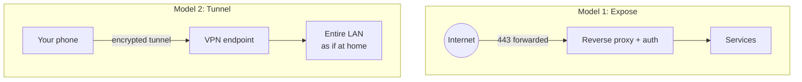

# Remote Access and VPNs

You will want to reach your home lab from outside the house: your photos from a hotel, your password vault from work, your media on a train. There are two fundamentally different ways to do this. **Expose** the service to the internet — forward a port, put it behind the reverse proxy, let anyone connect and rely on authentication. Or **tunnel** into your network — a VPN that makes your phone or laptop a member of your LAN, after which everything works as if you were home and nothing is exposed at all. This chapter argues for the second, explains the technologies (WireGuard, Tailscale and Headscale, NetBird, ZeroTier, OpenVPN, IPsec), covers the tunnel-through-a-relay options (Cloudflare Tunnel, Pangolin, a VPS with WireGuard) for CGNAT and public services, and gives a decision framework.

## The two models



**Exposing** is right when the audience is people you cannot ask to install a VPN client: a public blog, a Jellyfin server for extended family, a Nextcloud share link for a colleague, a game server for friends. It costs you an attack surface that must be patched, monitored, and defended forever.

**Tunnelling** is right for *you and your household* — the people who own devices you can configure. It costs an app on each device and ten minutes of setup, and exposes nothing. Since 2020 or so, mesh VPNs (Tailscale first, then others) have made it so easy that the calculus has shifted decisively: **the default should be a mesh VPN, with public exposure reserved for the few services that genuinely need it.**

Most labs end up with both — a mesh VPN for personal access to everything, plus one or two services exposed via the reverse proxy for other people. That is a healthy pattern.

## WireGuard: the protocol underneath

WireGuard is a VPN protocol and kernel module (in Linux since 5.6, with userspace implementations everywhere else) designed around simplicity: about 4,000 lines of code versus OpenVPN's 100,000+, a single modern cipher suite (ChaCha20-Poly1305, Curve25519, BLAKE2s), UDP only, and a configuration model based purely on public keys. Each peer has a key pair; you tell each side the other's public key and which IP ranges to route through the tunnel. Handshakes take one round trip; roaming between networks is seamless; throughput is near line rate on modest hardware; a Raspberry Pi 4 pushes 300–500 Mbps. It is the foundation of every mesh VPN below, and the right protocol for anything new.

### Plain WireGuard (self-hosted, hub-and-spoke)

The classic setup: a WireGuard server on your router (OPNsense, OpenWrt, MikroTik, UniFi all have it built in) or on a Linux box, a UDP port forwarded to it (51820 by convention; any port works), and a config per client device. Clients connect to your public IP (via a dynamic DNS name), get an address in a tunnel subnet (`10.8.0.0/24`), and route your LAN (`10.0.0.0/16`) — or all traffic (`0.0.0.0/0`, for a privacy VPN when on hotel Wi-Fi) — through the tunnel.

**Requires:** a public IP (dynamic is fine with DDNS) and one forwarded UDP port. Does not work behind CGNAT without a relay.

**Strengths:** no third party at all, no coordination server, no accounts. Runs on hardware you already have. Trivially auditable. The forwarded UDP port is close to invisible — WireGuard does not respond to unauthenticated packets, so a port scan sees nothing.

**Weaknesses:** manual key and config management per device (tooling below helps). Hub-and-spoke: all traffic between two remote clients goes via the hub. No NAT traversal — the server needs a reachable port. Changing the server IP or key means touching every client.

**Tooling:** **wg-easy** (a Docker container with a web UI to create clients and show QR codes; the easiest self-hosted WireGuard), **WGDashboard**, **Firezone** (a more complete product with SSO, now pivoted toward a zero-trust model), the built-in UIs on OPNsense/OpenWrt/UniFi/MikroTik, and **PiVPN** (a script for Raspberry Pi that sets up WireGuard or OpenVPN).

```yaml
services:
  wg-easy:
    image: ghcr.io/wg-easy/wg-easy:15
    container_name: wg-easy
    restart: unless-stopped
    environment:
      INIT_ENABLED: "true"
      INIT_HOST: vpn.example.com          # your DDNS name
      INIT_PORT: "51820"
      INIT_DNS: 10.0.20.5                 # your Pi-hole/AdGuard
      INIT_IPV4_CIDR: 10.8.0.0/24
    volumes:
      - ./data:/etc/wireguard
      - /lib/modules:/lib/modules:ro
    ports:
      - "51820:51820/udp"                 # forward this on the router
      - "127.0.0.1:51821:51821/tcp"       # web UI, LAN/proxy only
    cap_add: [NET_ADMIN, SYS_MODULE]
    sysctls:
      net.ipv4.ip_forward: 1
      net.ipv4.conf.all.src_valid_mark: 1
```

## Mesh VPNs

A mesh VPN adds a **coordination (control) server** to WireGuard. Every device authenticates to the control server, which distributes public keys and endpoint information; devices then connect **directly to each other** (peer to peer) wherever NAT traversal permits, falling back to **relay servers** (DERP in Tailscale's terminology, TURN in NetBird's) when it does not. The control server never sees your traffic — only keys and metadata. Results: no port forwarding, works behind CGNAT and hotel Wi-Fi and cellular, every device can reach every other device, and adding a device is "install the app and log in."

### Tailscale

The product that defined the category. A Tailscale client on each device (Linux, Windows, macOS, iOS, Android, Synology, QNAP, pfSense/OPNsense, Unraid, Home Assistant, Docker, even Apple TV), a hosted control plane at Tailscale Inc., login via an existing identity provider (Google, Microsoft, GitHub, Apple, or any OIDC). Free tier: 100 devices and 3 users, which covers most households. Features that matter for self-hosters:

- **MagicDNS**: every device gets a name (`nas.tailnet-name.ts.net`) and Tailscale-provided DNS for them.
- **Subnet routers**: one device advertises your LAN (`10.0.0.0/16`) so that devices *without* Tailscale (your TV, printer, IoT) are reachable through it. Your phone can reach `10.0.20.5` from anywhere.
- **Exit nodes**: route all internet traffic through a device at home (or a VPS) — a privacy VPN for hotel Wi-Fi.
- **ACLs**: a JSON policy defining which users/devices/tags may reach which others. Give your partner's phone access to Immich and Jellyfin, not the Proxmox UI.
- **Tailscale SSH**: SSH between devices authenticated by Tailscale identity, no keys to manage.
- **Funnel**: expose a service on a device to the public internet through Tailscale's relays (with TLS) — a quick way to make one thing public without touching your router.
- **Tailscale Serve** and **HTTPS certificates** for `*.ts.net` names.
- **Split DNS**: tell Tailscale that `example.com` should resolve via your Pi-hole at `10.0.20.5` — so your split-horizon DNS ([Chapter 7](07-reverse-proxy-tls.md)) works remotely and `photos.example.com` resolves to your internal proxy from anywhere.
- **Mullvad exit nodes** (paid add-on), **Taildrop** (file transfer between your devices), **Tailscale on Docker** (a sidecar container that puts a single service on the tailnet).

**Watch out for:** the control plane is a third-party SaaS. Tailscale cannot read your traffic (it never has the private keys and traffic goes peer-to-peer or through DERP encrypted end-to-end), but it knows your device list, IPs, and connection metadata, and if Tailscale's control plane is down, *new* connections cannot be established (existing ones keep working via cached keys). Pricing and free-tier limits could change (they have been stable and were made more generous in 2023). If a hard dependency on a company is unacceptable, see Headscale.

### Headscale

An open-source reimplementation of Tailscale's *control server*, run on your own machine. The official Tailscale clients connect to it instead of Tailscale Inc. You get most of the Tailscale experience — MagicDNS, subnet routers, exit nodes, ACLs, split DNS — with no third party, no device limits, no account required. It needs a **publicly reachable host** for the control server (a small VPS is ideal; it can be at home if you have a public IP and forward a port), because clients must reach it to coordinate. Relaying uses Tailscale's public DERP servers by default (you can run your own embedded DERP in Headscale).

**Watch out for:** it is a community project tracking a proprietary protocol; occasional client updates break things until Headscale catches up (rarer now — Tailscale has been cooperative). No web UI officially (community UIs exist: headscale-ui, headplane, headscale-admin). Login is via pre-auth keys or your own OIDC provider ([Chapter 10](10-identity-sso.md)). Missing a few Tailscale features (Funnel, some newer ACL features). Operating a control server is a small but real responsibility.

**Pick Headscale if:** you want Tailscale's polish with full sovereignty and are willing to run one more service on a VPS.

### NetBird

An open-source mesh VPN (management server, signal server, relay, and clients all open, AGPL/BSD) with a hosted option and a straightforward self-hosting path (a Docker Compose stack). WireGuard underneath, peer-to-peer with relay fallback, a full web UI, SSO via any OIDC provider (Zitadel bundled by default in the self-hosted quick start, or bring your own — Authentik, Keycloak, Pocket ID), ACLs with groups and posture checks, DNS management, subnet routing, exit nodes, and a clean client for every platform including Docker. It is the closest **fully open, self-hostable, UI-driven** equivalent to Tailscale, and has been growing steadily.

**Watch out for:** self-hosting involves several components (management, signal, relay/TURN, dashboard, an IdP) and needs a public host with a handful of ports open; the quick-start script handles it but you are running more moving parts than Headscale. Younger than Tailscale; occasional rough edges on iOS/macOS.

**Pick NetBird if:** you want a self-hosted mesh with a real web UI and SSO integration out of the box, or you want an open-source hosted option.

### ZeroTier

The elder statesman of mesh networking (2015). Different architecture: it builds a virtual **layer 2** Ethernet network rather than a layer 3 IP mesh, with its own protocol (not WireGuard), which makes it uniquely good at things like broadcast/multicast across the mesh (Chromecast discovery, some games, mDNS). Hosted controller with a free tier (10 devices as of the 2023 pricing change, down from 25/50), a self-hostable controller (via the open-source `ztncui` or ZeroNSD tooling), a very mature client on every platform including many routers (MikroTik has it built in). Licence is a BSL (Business Source Licence) — source-available with a non-compete clause, converting to Apache after four years.

**Watch out for:** the smaller free tier makes it less attractive than Tailscale for households; performance and NAT traversal are good but generally a step behind WireGuard-based options; the self-hosted controller is less turnkey than Headscale/NetBird.

**Pick ZeroTier if:** you need layer 2 (bridging two sites into one broadcast domain, or an application that requires it), or you have MikroTik gear and want it native.

### Others

**Netmaker** (WireGuard mesh with a UI, pivoted toward enterprise; the community edition is fine but has moved features to paid tiers), **Innernet** (a minimal WireGuard coordinator in Rust, CLI-only), **Nebula** (Slack's overlay network; certificate-based, no central controller at runtime, excellent for people who want to understand every part; used for the Defined Networking product), **Tinc** (an old and still-working mesh), **Husarnet**, **Twingate** and **Cloudflare WARP/Zero Trust** (hosted zero-trust access products with free tiers; corporate-flavoured), **Firezone** (WireGuard-based, open-source, now zero-trust-oriented with a hosted control plane and self-hosted gateways).

### Mesh VPN comparison

| | Tailscale | Headscale | NetBird | ZeroTier |
|---|---|---|---|---|
| Control plane | Hosted (Tailscale Inc.) | Self-hosted | Hosted or self-hosted | Hosted or self-hosted |
| Protocol | WireGuard | WireGuard (Tailscale clients) | WireGuard | Custom (L2) |
| Open source | Clients: yes (BSD); server: no | Yes (BSD) | Yes (AGPL/BSD) | BSL (source-available) |
| Free tier | 100 devices / 3 users | Unlimited | Hosted: 5 users/100 peers as of 2025; self-hosted unlimited | 10 devices |
| Web UI | Yes (excellent) | Community projects | Yes | Yes (hosted) |
| SSO/IdP | Google/MS/GitHub/Apple/OIDC | OIDC (your own) | OIDC (bundled Zitadel or your own) | Own accounts |
| Subnet router | Yes | Yes | Yes | Yes (managed routes) |
| Exit node | Yes | Yes | Yes | Yes (default route) |
| Split DNS | Yes | Yes | Yes | Via ZeroNSD |
| Public exposure | Funnel | No | No | No |
| Setup effort | Minutes | An hour (needs public host) | An hour (needs public host) | Minutes (hosted) |
| Best for | Most people | Tailscale without the company | Fully open with UI | Layer 2 needs |

## Tunnels and relays: for CGNAT and public services

When you *cannot* forward ports (CGNAT), or *will not* (no inbound exposure at home), but need a service reachable by the public or by people without a VPN client, the answer is an **outbound tunnel** from your lab to a publicly reachable relay that fronts the traffic.

### Cloudflare Tunnel

`cloudflared` runs at home, makes an outbound connection to Cloudflare's edge, and Cloudflare proxies `photos.example.com` to Immich through it. No open ports, free, includes Cloudflare's WAF, DDoS protection, and — via **Cloudflare Access** (Zero Trust, free for up to 50 users) — an identity-aware login page in front of any hostname, with SSO via Google/GitHub/OIDC and one-time email codes. Setup is a Docker container and a few clicks in the Zero Trust dashboard.

**The trade-offs, stated plainly:** Cloudflare terminates TLS at their edge and sees the plaintext of everything that passes through — for a password manager or private photos, that is a meaningful trust decision. Their terms of service (Section 2.8 historically; restructured in 2023 but the spirit remains) restrict serving non-HTML content like video streams and large files through the free CDN, and people have had accounts flagged for streaming Plex/Jellyfin through a tunnel. Upload size is limited to 100 MB per request on free/pro plans (which breaks Immich/Nextcloud uploads of large videos unless the client chunks them). WebSockets work. It is superb for a blog, a wiki, a dashboard, a small web app, or any HTML-centric service; it is the wrong tool for media and file sync.

### Pangolin

Introduced in [Chapter 7](07-reverse-proxy-tls.md): an open-source, self-hosted tunnel + reverse proxy + auth layer that you run on a **cheap VPS**. Components: **Pangolin** (the management server and UI), **Gerbil** (a WireGuard server), **Traefik** (the proxy, with automatic certificates), and **Newt** (a tiny client on your home machine that dials out to Gerbil). Define "sites" (your home lab) and "resources" (`photos.example.com` → `10.0.20.5:2283`); optionally require authentication (Pangolin's own users, passkeys, PIN codes, one-time email links, or OIDC to your IdP) before the request is forwarded. Raw TCP/UDP resources are supported too (game servers, SSH). Effectively self-hosted Cloudflare Tunnel + Access, with **you** terminating TLS on **your** VPS, no content restrictions, and no 100 MB limit.

**Watch out for:** you pay for and maintain a VPS (USD 4–6/month); the VPS's bandwidth cap (typically 1–20 TB/month) and its network speed become your service's ceiling; latency adds one hop. Pangolin is young (late 2024) and moves fast; it has a paid tier for some features (the core is open). But it has been adopted very quickly by exactly the self-hosting audience, and its trajectory is strong.

### Roll your own: VPS + WireGuard + reverse proxy

The manual version of Pangolin, which many people ran for years: a VPS with WireGuard, a WireGuard tunnel from home, and on the VPS either (a) a reverse proxy (Caddy/Traefik/Nginx) whose backends are the tunnel IPs of your home services, or (b) plain port forwarding via `iptables`/`nftables` DNAT rules from the VPS's public IP through the tunnel to your home. Option (a) terminates TLS on the VPS and gives you a normal proxy; option (b) passes TCP straight through so TLS terminates at home and the VPS sees only ciphertext — better privacy, but no per-hostname routing unless you use SNI-based routing (HAProxy/Traefik TCP routers/Caddy layer4/`sniproxy`). **Rathole**, **frp**, **bore**, and **chisel** are lightweight tunnelling daemons that do this pattern with less configuration than raw WireGuard + iptables. Full control, minimal cost, and you learn a great deal.

### Others

**ngrok**, **localtunnel**, **Tailscale Funnel** (quick, hosted, fine for demos and one-offs), **Zrok** (open-source ngrok alternative on OpenZiti), **Boringproxy**, **SirTunnel**, **Tunnelmole**, **Holesail**.

## OpenVPN and IPsec

**OpenVPN** was the standard for fifteen years and is still everywhere: every router OS, every commercial VPN app, every corporate remote-access box. TLS-based, TCP or UDP, certificate or username/password authentication, extensive but arcane configuration. It is slower than WireGuard (userspace, larger overhead), slower to connect, and harder to configure, with no real compensating advantage for a home lab in 2026 — except that it works over TCP 443 and can therefore punch through hostile networks (some corporate or hotel firewalls block all UDP, which stops WireGuard). Keep a fallback OpenVPN-over-TCP-443 profile if you travel to such places; otherwise use WireGuard.

**IPsec/IKEv2** is the protocol built into every OS without an app (Windows, macOS, iOS, Android via strongSwan). Fast (kernel-mode) and robust, and OPNsense/pfSense/MikroTik/UniFi all serve it. Configuration is notoriously fiddly (certificates, EAP methods, NAT-T, phase 1/phase 2). Worth it only if "no client app" is a hard requirement; most people find WireGuard's app trivially acceptable.

## Choosing: a decision framework

1. **Do you only need access for yourself and your household?** → A mesh VPN. Tailscale if a hosted control plane is acceptable; Headscale or NetBird if not. Add a subnet router so non-VPN devices at home are reachable. Configure split DNS so your internal hostnames work. Done — nothing exposed.

2. **Do you have a public IP and want zero third parties, even for coordination?** → Plain WireGuard on your router or via wg-easy, one UDP port forwarded, DDNS. Add a mesh later if you want peer-to-peer between remote devices.

3. **Do you need to expose a few HTTP services to the public or to people who will not install anything?**
   - Public IP, comfortable managing exposure → forward 443 to your reverse proxy with forward-auth, CrowdSec, and everything in [Chapter 13](13-security.md).
   - CGNAT, or you refuse inbound exposure → Pangolin on a VPS (full control), or Cloudflare Tunnel + Access (zero cost, accept their terms and TLS termination).

4. **Do you need to expose non-HTTP services** (game servers, SSH, Minecraft, a mail server)? → Public IP: forward the specific port with the strongest auth the service supports. CGNAT: Pangolin raw TCP/UDP resources, a VPS with WireGuard + DNAT, or Playit.gg for game servers ([Chapter 24](24-gaming.md)).

5. **Layer 2 required, or MikroTik native?** → ZeroTier.

6. **Travelling through networks that block UDP?** → keep an OpenVPN-TCP-443 or a WireGuard-over-**udp2raw**/**wstunnel** profile as a fallback. Tailscale's DERP relays operate over HTTPS and often get through where raw WireGuard does not.

Most households: **Tailscale (or Headscale) for everything personal, plus one or two services behind the reverse proxy for guests.** If behind CGNAT: **Tailscale + Pangolin**.

## Deployment patterns

### The subnet router

Install Tailscale/NetBird on one always-on Linux machine at home (the Docker host, a Raspberry Pi, the router if supported), enable IP forwarding, and advertise your LAN:

```bash
# Tailscale
sudo tailscale up --advertise-routes=10.0.0.0/16 --advertise-exit-node --accept-dns=false
# then approve the routes in the admin console (or auto-approve via ACL)
```

Now every device on the tailnet reaches every LAN device. Combine with **split DNS** in the admin console (`example.com` → `10.0.20.5`) so `photos.example.com` resolves to your proxy from anywhere. The subnet router is a single point of failure; run two for redundancy (Tailscale supports HA subnet routers).

### The service sidecar

For a single service you want on the mesh without exposing the whole LAN — or to give someone access to *only* Jellyfin — run Tailscale as a sidecar container sharing the service's network namespace (`network_mode: service:tailscale`). The service appears as its own device on the tailnet with its own ACL entry. Pattern also works for NetBird.

### Always-on VPN on phones

iOS and Android Tailscale/WireGuard clients support "on-demand" or always-on modes: connect automatically whenever off home Wi-Fi. With a split DNS configuration and internal hostnames, your phone's Immich app, Home Assistant app, and Bitwarden client work identically at home and away and never touch a public endpoint. This is the end state most self-hosters are aiming for.

### The remote backup peer

A mesh VPN makes a second machine at a friend's or parent's house a first-class network member: a Raspberry Pi or old mini PC with a big drive, on your tailnet, receiving nightly Restic/Borg/ZFS-replication backups ([Chapter 11](11-backups.md)). Off-site backup with no cloud fees and no port forwarding at either end.

## Security notes

- **A VPN endpoint is exposed infrastructure too.** WireGuard is silent to unauthenticated packets and has had an excellent security record; still, keep the host patched. Mesh clients update themselves or via your package manager — let them.
- **Don't route everything through the mesh blindly.** Use ACLs. Your partner's phone does not need to reach the Proxmox console; a friend's Jellyfin access should reach Jellyfin only.
- **Exit nodes** route all a device's internet traffic through your home — the ISP at home sees it, and your home IP is what websites see. That is the point on hotel Wi-Fi, and something to remember otherwise.
- **Key rotation**: mesh VPNs rotate node keys automatically and expire devices (Tailscale defaults to 180 days) so a lost laptop cannot connect forever. Plain WireGuard keys never expire — remove peers for devices you no longer own.
- **Split DNS and DNS leaks**: with `--accept-dns` (Tailscale) your device uses the tailnet's DNS config; verify that off-network queries go where you expect (`resolvectl status`, `nslookup`).
- **Tunnels (Cloudflare/Pangolin) still expose the application.** The relay hides your IP and can add an auth wall; the app behind it remains a target once past that wall. Treat exposed services as exposed regardless of how the packets arrive.

## Checklist

- [ ] A mesh VPN (Tailscale/Headscale/NetBird) or plain WireGuard deployed; every household device enrolled.
- [ ] A subnet router advertising the LAN; split DNS pointing your domain at the internal resolver; internal hostnames tested from a phone on cellular.
- [ ] ACLs restricting each user/device to what they need.
- [ ] Phones set to always-on/on-demand VPN off home Wi-Fi.
- [ ] CGNAT status known; if CGNAT and public services are needed, Pangolin or Cloudflare Tunnel in place.
- [ ] Public exposure limited to the specific services that need it, each behind the reverse proxy with authentication and rate limiting; everything else reachable only via VPN.
- [ ] A fallback profile (OpenVPN TCP 443, or reliance on DERP/HTTPS relays) for hostile networks.
- [ ] Device expiry/key rotation enabled; stale peers removed; the VPN/tunnel host kept patched.
- [ ] Off-site backup peer (if any) reachable via the mesh, not via port forwarding.
