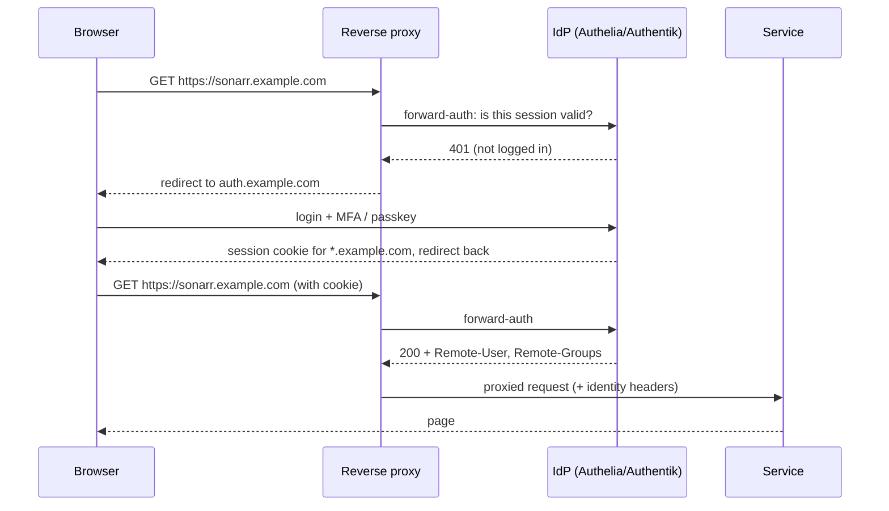

# Identity and Single Sign-On

Once you run more than a handful of services, you have a handful of separate user databases, a handful of separate passwords per family member, and a handful of login pages of varying quality — some of which have no login at all. An **identity provider** (IdP) fixes this: one account per person, one login page, multi-factor authentication and passkeys in one place, and every service either delegates authentication to it via **OIDC** or gets it enforced by the reverse proxy via **forward-auth**. This chapter explains the protocols, compares Authelia, Authentik, Keycloak, Zitadel, Pocket ID, Kanidm, and LLDAP, and shows the deployment patterns that work at home.

## The problems an IdP solves

1. **Services with weak or no authentication.** Dashboards, Sonarr/Radarr (optional auth, no MFA), Dozzle, Uptime Kuma's status pages, most dev tools. The proxy can require a login before the request ever reaches them.
2. **Too many passwords.** Each family member ends up with a Jellyfin password, a Nextcloud password, an Immich password. With SSO they log into one thing.
3. **No MFA on things that deserve it.** Many self-hosted apps have TOTP; few have WebAuthn/passkeys; the IdP has both and applies them everywhere.
4. **Offboarding.** Someone leaves the household or a friend stops using your Jellyfin: disable one account instead of hunting through eight admin panels.
5. **Audit.** One log of who logged into what, from where.

## The protocols

**OpenID Connect (OIDC)** is the modern standard, built on OAuth 2.0. The application ("client" or "relying party") redirects the user to the IdP; the user authenticates; the IdP redirects back with a token asserting who they are, and optionally group memberships. The application creates or maps a local account. Supported natively by a growing majority of self-hosted apps: Immich, Jellyfin (via plugin), Nextcloud, Gitea/Forgejo, GitLab, Grafana, Portainer, Home Assistant (via community integration), Vaultwarden (SSO support merged in 2025), Paperless-ngx, Mealie, Audiobookshelf, Outline, BookStack, Wiki.js, Proxmox (as an auth realm), TrueNAS, Headscale, NetBird, MinIO, Harbor, Rocket.Chat, Mattermost, Synapse, and many more. **This is the preferred integration**: the app knows who the user is and can do per-user things.

**Forward-auth** (also "auth request," "trusted header SSO") is the proxy-level fallback. The reverse proxy asks the IdP "is this request authenticated?" before proxying. If not, redirect to login; if yes, proxy and pass the identity in headers (`Remote-User`, `Remote-Groups`, `Remote-Email`). Works for **any** web app, including ones with no auth at all. The app itself may still show its own login page behind the proxy's (unless it supports trusted-header auth, which a few do — Grafana, Organizr, some dashboards), so for apps *with* their own OIDC support, prefer OIDC. Traefik (`forwardAuth` middleware), Caddy (`forward_auth`), Nginx (`auth_request`), and NPM (via snippets) all support it. Authelia and Authentik are built around providing it; Keycloak needs a helper like `oauth2-proxy`.

**LDAP** is the old directory protocol. Many apps still authenticate against LDAP (Jellyfin's LDAP plugin, Nextcloud, Gitea, Grafana, Proxmox, TrueNAS, Home Assistant via a shim, Radicale, Mailcow, Synapse). It provides users and groups but no SSO (the user types a password into each app; the app checks it against LDAP) and no MFA. Useful as the *user database* under an IdP, and for legacy apps that speak nothing else.

**SAML** is the enterprise XML predecessor of OIDC. You need it only for a handful of business-oriented apps. Authentik, Keycloak, and Zitadel do SAML; Authelia does not (it is on the roadmap).

**SCIM** provisions users/groups from the IdP into apps automatically. Rare in self-hosted apps; Authentik and Keycloak (via extension) support it.

**Passkeys / WebAuthn** are the phishing-resistant, passwordless standard: authenticate with a hardware key (YubiKey), a phone, or a platform authenticator (Touch ID, Windows Hello). Every IdP below supports WebAuthn at least as a second factor; Pocket ID, Zitadel, Authentik, and Keycloak support passkeys as the *only* factor.



## The candidates

### Authelia

A single Go binary designed from the outset as **a forward-auth companion for reverse proxies**, with OIDC provider support added and matured over 2022–2025. Configuration is a YAML file: users in a YAML file or LDAP (LLDAP is the usual pairing); access-control rules by domain, path, group, network, and method (`one_factor`, `two_factor`, `bypass`); TOTP, WebAuthn, Duo; session in memory or Redis; storage in SQLite, MySQL, or Postgres; SMTP for password resets. Runs in ~30 MB of RAM. The login portal is clean and fast. Authelia integrates with Traefik, Caddy, Nginx, NPM, HAProxy, SWAG, Envoy, and (via forward-auth) anything else; the documentation includes copy-paste proxy configs for each.

**Strengths:** lightweight, stable, config-as-code, excellent docs, security-focused development with regular audits, granular per-domain/path policies (e.g., `bypass` for `/api/*` so the Sonarr mobile app works while the UI is protected), the best fit for "protect twenty apps behind the proxy." Its OIDC provider is now solid for the common apps.

**Weaknesses:** no web admin UI — users and clients live in YAML (fine for a household, tedious past ~20 users; LLDAP adds a UI for users). No SAML. No user self-registration or invitation flows. OIDC client configuration is verbose YAML with hashed secrets. Not a general-purpose IdP with flows and policies — it does one thing extremely well.

**Pick it if:** your main goal is protecting services at the proxy with MFA, you like config files, and you have a small, stable user base.

```yaml
# authelia/compose.yaml (excerpt)
services:
  authelia:
    image: authelia/authelia:4.39
    container_name: authelia
    restart: unless-stopped
    volumes:
      - ./config:/config
    environment:
      AUTHELIA_JWT_SECRET_FILE: /config/secrets/jwt
      AUTHELIA_SESSION_SECRET_FILE: /config/secrets/session
      AUTHELIA_STORAGE_ENCRYPTION_KEY_FILE: /config/secrets/storage
    networks: [proxy]
    labels:
      - traefik.enable=true
      - traefik.http.routers.authelia.rule=Host(`auth.example.com`)
      - traefik.http.middlewares.authelia.forwardauth.address=http://authelia:9091/api/authz/forward-auth
      - traefik.http.middlewares.authelia.forwardauth.trustForwardHeader=true
      - traefik.http.middlewares.authelia.forwardauth.authResponseHeaders=Remote-User,Remote-Groups,Remote-Email,Remote-Name
```

```yaml
# authelia/config/configuration.yml (excerpt)
access_control:
  default_policy: deny
  rules:
    - domain: "*.example.com"
      networks: ["10.0.10.0/24"]      # trusted LAN
      policy: one_factor
    - domain: ["sonarr.example.com", "radarr.example.com"]
      resources: ["^/api/.*$"]         # let the apps' own API-key auth handle these
      policy: bypass
    - domain: "proxmox.example.com"
      subject: "group:admins"
      policy: two_factor
    - domain: "*.example.com"
      policy: two_factor
```

### Authentik

A full-featured **identity platform** (Python/Django + Go outposts) with a polished web admin UI: users, groups, applications, providers (OIDC, SAML, LDAP *server*, SCIM, RADIUS, proxy/forward-auth via "outposts"), customisable **flows** (login, enrolment, recovery, MFA — each a visual pipeline of stages), policies (expression-based in Python), an application launcher page for users, invitations, self-service enrolment, brute-force protection, and event logging. It can *be* an LDAP server for legacy apps, *be* a forward-auth provider for the proxy, and *be* an OIDC/SAML IdP, all from one UI. Runs with a Postgres database and (until recent versions) Redis; ~600 MB–1 GB RAM total.

**Strengths:** the most complete self-hostable IdP with a UI that non-experts can operate; flows let you build exactly the login experience you want (e.g., passkey-only for family, password+TOTP for admins); the built-in proxy outpost gives forward-auth without a separate tool; frequent releases; a large self-hosting community with per-app integration docs for ~100 apps.

**Weaknesses:** heavy relative to Authelia; the flow/stage/policy model is powerful and initially bewildering; the UI has many screens; occasional breaking changes on upgrade (read the release notes); the company behind it (Authentik Security Inc.) sells an enterprise tier — the open-source core is MIT and has stayed complete for home use.

**Pick it if:** you want a UI, OIDC + LDAP + forward-auth from one place, invitations and self-service for a larger household or a community, and you are willing to spend an afternoon learning its model.

### Keycloak

Red Hat's enterprise IdP (Java/Quarkus), the reference implementation of OIDC and SAML that many corporate systems run on. Realms, clients, roles, groups, identity brokering (log in via Google/GitHub/another IdP), user federation (LDAP, Active Directory, Kerberos), fine-grained authorisation services, themes, extensive extensions, and a battle-tested security record. ~500 MB–1 GB RAM.

**Strengths:** if an app supports OIDC or SAML, it has been tested against Keycloak; the docs and community are enormous; it is a genuine career skill; the account console lets users manage their own MFA and sessions.

**Weaknesses:** no forward-auth built in (pair with **oauth2-proxy** or Traefik's/Caddy's plugins); the admin console is dense and enterprise-flavoured; a Java process that takes 30 seconds to start; configuration is UI-first (exportable to JSON for IaC via the realm export or the `keycloak-config-cli` / Terraform provider); overkill for "protect my dashboards."

**Pick it if:** you know it from work, need SAML or identity brokering, or want maximum compatibility.

### Zitadel

A Go-based, cloud-native IdP with a modern UI, multi-tenant "organisations," OIDC/OAuth2/SAML, passkeys as a first-class login method, actions (JavaScript hooks in the login flow), a well-designed API (gRPC/REST), and event-sourced storage in PostgreSQL. It is the IdP NetBird bundles by default. Apache 2.0.

**Strengths:** genuinely good passwordless/passkey UX out of the box; clean multi-org model if you host for several groups; rapid development; lighter than Keycloak.

**Weaknesses:** no forward-auth (pair with oauth2-proxy); smaller self-hosting community than Authentik/Keycloak; the multi-tenant model adds concepts a household does not need; some rough edges in the self-hosted console.

**Pick it if:** you run NetBird, want a modern API-first IdP, or want passkeys front-and-centre with a UI.

### Pocket ID

A minimalist **OIDC provider that authenticates exclusively with passkeys** — no passwords at all. A single small Go binary with a clean UI, users and groups, OIDC clients, audit log, optional LDAP sync as a *source*, and that is essentially it. ~30 MB RAM. Arrived in 2024 and was adopted enthusiastically by self-hosters who wanted "just OIDC with passkeys, nothing else."

**Strengths:** the simplest possible IdP for a household with modern devices; phishing-resistant by design; trivial to run; pairs with Traefik/Caddy forward-auth via **tinyauth** or **oauth2-proxy** if you need proxy-level protection too (Pocket ID itself does not do forward-auth).

**Weaknesses:** passkeys only — every device and browser must support WebAuthn (all modern ones do; some corporate or ancient devices do not); no password fallback means recovery planning matters (register multiple passkeys per user, keep a recovery code); no forward-auth built in; young.

**Pick it if:** you want OIDC for a handful of apps, everyone has a phone or laptop with a platform authenticator, and you want the least infrastructure.

### Kanidm

A Rust-based IdP with an opinionated security-first design: OIDC, LDAP (read-only, for legacy apps), RADIUS, SSH key distribution, PAM/NSS integration for Unix login, passkeys and TOTP, strict credential policies, an excellent CLI, a web UI for users (admin is CLI/API-driven). Very low resource use. Unusual in supporting **Unix host login** — your Linux machines can authenticate users against it.

**Strengths:** thoughtfully secure, lightweight, unusual breadth (Unix auth, SSH keys, RADIUS for Wi-Fi 802.1X); active development with strong opinions about doing identity correctly.

**Weaknesses:** CLI-driven admin is a hurdle for some; smaller community; no forward-auth built in; some app integrations need care with claim mapping.

**Pick it if:** you want one identity source for web apps *and* Linux hosts *and* Wi-Fi, and you are comfortable at the command line.

### LLDAP

Not an IdP — a **lightweight LDAP server** (Rust) with a web UI for users and groups, ~20 MB RAM, designed for exactly the home-lab use case: a simple user database that Authelia, Jellyfin, Nextcloud, Gitea, Proxmox, Home Assistant (via LDAP auth shim), Radicale, and anything else that speaks LDAP can authenticate against. It implements a deliberately small subset of LDAP — enough for authentication and group lookup, not enough to be a general directory. Pair it with Authelia for the classic lightweight stack.

### Others

**tinyauth** (a minimal forward-auth login page — local users or OIDC upstream — for Traefik/Caddy/Nginx; the smallest thing that gives you a login wall), **oauth2-proxy** (the standard forward-auth adapter for any OIDC IdP — put Keycloak/Zitadel/Pocket ID behind it), **traefik-forward-auth** (older, Google/OIDC), **Casdoor**, **Ory Kratos/Hydra** (API-first identity components for developers), **Hanko** (passkey-focused), **Dex** (a small OIDC federator often used with Kubernetes), **FreeIPA** (the full Red Hat directory — Kerberos, LDAP, DNS, CA; heavy and enterprise), **Samba AD DC** (a real Active Directory domain controller on Linux; only if you have Windows machines to domain-join), **Cloudflare Access** and **Pangolin**'s built-in auth (identity at the tunnel/edge — [Chapter 8](08-remote-access-vpn.md)).

### Comparison

| | Authelia | Authentik | Keycloak | Zitadel | Pocket ID | Kanidm | LLDAP |
|---|---|---|---|---|---|---|---|
| Role | Forward-auth + OIDC | Full IdP | Full IdP | Full IdP | OIDC (passkeys) | IdP + Unix auth | LDAP user DB |
| Admin UI | No (YAML) | Yes (rich) | Yes (dense) | Yes | Yes (minimal) | Web for users; CLI admin | Yes (simple) |
| Forward-auth | **Native** | Native (outpost) | Via oauth2-proxy | Via oauth2-proxy | Via tinyauth/oauth2-proxy | Via oauth2-proxy | n/a |
| OIDC provider | Yes | Yes | Yes | Yes | Yes | Yes | No |
| SAML | No | Yes | Yes | Yes | No | No | No |
| LDAP server | No (client of LLDAP) | Yes (outpost) | No (federates *to* LDAP) | No | No | Yes (read-only) | **Yes** |
| Passkeys | 2nd factor | Yes (incl. passwordless) | Yes | **Yes (first-class)** | **Only** | Yes | No |
| Self-registration / invites | No | Yes | Yes | Yes | No | No | No |
| RAM | ~30 MB | ~600 MB–1 GB | ~500 MB–1 GB | ~300 MB | ~30 MB | ~50 MB | ~20 MB |
| Dependencies | SQLite or Postgres; optional Redis | Postgres (Redis pre-2025) | Postgres | Postgres | SQLite | None | SQLite |
| Config as code | **Yes** | Partial (blueprints) | Partial (realm export, Terraform) | Partial (Terraform) | No | Yes (CLI scripts) | Partial |
| Licence | Apache 2.0 | MIT (core) | Apache 2.0 | Apache 2.0 | BSD | MPL 2.0 | GPL 3 |
| Best for | Protecting apps at the proxy; small stable households | Households/communities wanting a UI and everything | Enterprise compatibility | Passkeys + modern API | Minimal OIDC | Unified web + Unix + Wi-Fi identity | User DB under Authelia |

## Deployment patterns

### Pattern A: Authelia + LLDAP behind Traefik or Caddy (lightweight)

Users and groups in LLDAP (UI). Authelia reads LLDAP, provides the login portal, MFA, per-domain policy, and OIDC for apps that support it. The proxy applies the `authelia` middleware to any router that needs protection. Apps that speak LDAP (Jellyfin, Nextcloud) can also use LLDAP directly for the same accounts. Total: ~50 MB RAM, two small containers, everything in YAML and Git. **The recommendation for most Tier 1–2 labs.**

### Pattern B: Authentik does everything (all-in-one)

Authentik as user database, OIDC/SAML provider, LDAP server (for legacy apps), and forward-auth (via its embedded outpost). One UI for all identity. ~1 GB RAM. **The recommendation when you want a UI, invitations, or serve more than a household.**

### Pattern C: Pocket ID for OIDC + tinyauth for the proxy (minimal, passwordless)

Pocket ID issues OIDC to apps that support it; tinyauth (configured to use Pocket ID as its OIDC upstream) gives the proxy a login wall for apps that do not. Two tiny containers. **For small households with modern devices who want passkeys everywhere and nothing to babysit.**

### Pattern D: Keycloak or Zitadel + oauth2-proxy (enterprise-shaped)

A full IdP for OIDC/SAML, oauth2-proxy providing forward-auth for the proxy. **For people who know these tools or need SAML/brokering.**

## Integration notes and gotchas

- **Cookie domain.** Forward-auth session cookies must be scoped to the parent domain (`example.com`) so one login covers `*.example.com`. Services on different domains need separate sessions or OIDC.
- **Bypass rules for APIs and apps.** Mobile apps (Jellyfin, Sonarr's companions, Immich, Home Assistant) do not follow browser redirects to a login page — they will simply fail. Either integrate the app via OIDC (so the app itself handles login), or add `bypass` rules for its API paths (`/api/*`, and for Jellyfin the whole host, protected instead by its own auth and an IP/VPN restriction), or expose the app only via VPN where forward-auth is unnecessary.
- **Headers to the app.** Some apps accept identity from headers (`Remote-User`) and auto-login the user — Grafana (`auth.proxy`), Organizr, Gitea (reverse proxy auth), Nextcloud (with a plugin), Paperless-ngx (`PAPERLESS_ENABLE_HTTP_REMOTE_USER`). **Only** enable this when the app is unreachable except through the proxy, or anyone can forge the header.
- **OIDC redirect URIs** must match exactly, including `https://` and trailing paths. The single most common OIDC setup error.
- **Group claims.** Map IdP groups to app roles (Immich admin, Grafana Admin/Editor, Gitea admin, Proxmox PVEAdmin) via the `groups` claim where the app supports it, so permissions follow the person.
- **Local admin fallback.** Keep one local admin account on each important app (and on the proxy/IdP hosts) that does not depend on the IdP — when Authelia is down, you still need to get into Proxmox.
- **Backup the IdP database and secrets first.** Losing the IdP's signing keys or user database locks everyone out of everything. It is the highest-value small backup in the lab ([Chapter 11](11-backups.md)).
- **MFA enrolment and recovery.** Register at least two authenticators per user (phone passkey + a hardware key, or TOTP + WebAuthn) and store recovery codes in the password manager ([Chapter 21](21-passwords-secrets.md)).
- **Trusted networks.** Authelia's `networks` and Authentik's policies can relax to one-factor (or bypass) for the LAN/VPN and require two-factor from anywhere else. Convenient; understand that a compromised LAN device then gets the relaxed policy.
- **Rate limiting and lockout.** Enable the IdP's brute-force protection (Authelia `regulation`, Authentik's default policies) and put CrowdSec/fail2ban on the login endpoint ([Chapter 13](13-security.md)).

## Recommendations

- **Most households:** Authelia + LLDAP. Small, stable, config-as-code, forward-auth and OIDC covered.
- **Want a UI and don't mind 1 GB of RAM:** Authentik.
- **Passwordless purists with a few OIDC apps:** Pocket ID (+ tinyauth for proxy protection).
- **Know Keycloak, or need SAML:** Keycloak.
- **One identity for web apps, Linux logins, and Wi-Fi:** Kanidm.

Whatever you choose, prioritise: (1) the IdP host is reachable only from LAN/VPN except its login portal if you expose services; (2) MFA/passkeys for every admin; (3) its database and keys are backed up and the restore is tested; (4) every app that supports OIDC uses it, every app that does not sits behind forward-auth or the VPN.

## Checklist

- [ ] An IdP deployed; one account per household member; admins have MFA or passkeys with backup authenticators.
- [ ] Every app with OIDC support integrated via OIDC with group-to-role mapping.
- [ ] Every app without strong native auth protected by forward-auth at the proxy, with bypass rules for API paths that mobile clients need (or reachable only via VPN).
- [ ] Session cookie scoped to the parent domain; redirect URIs correct.
- [ ] Local break-glass admin accounts retained on critical apps and hosts.
- [ ] Brute-force protection on the IdP; login endpoint covered by CrowdSec/fail2ban if exposed.
- [ ] IdP database, configuration, and secrets/keys backed up; restore tested.
- [ ] Offboarding procedure: disabling one IdP account revokes access everywhere (verify).
