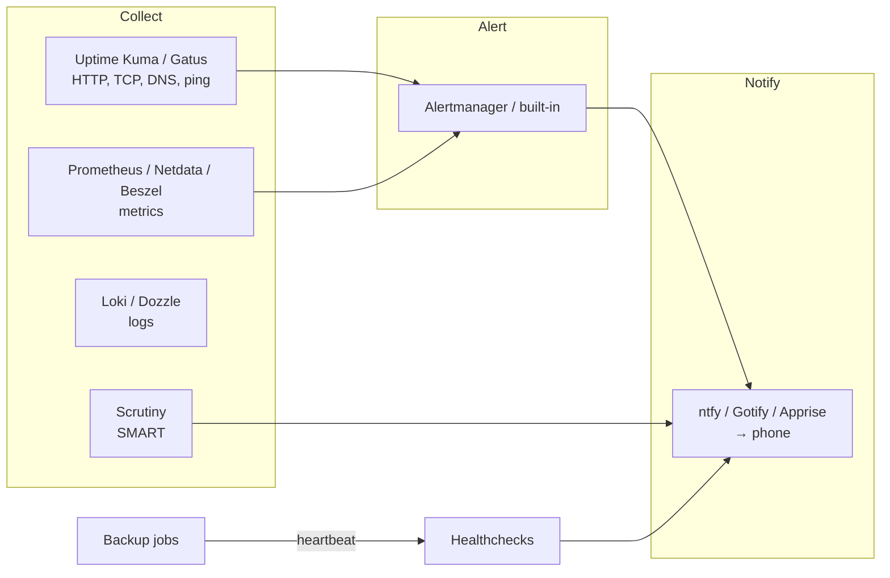

# Monitoring, Logging, and Alerting

The difference between a hobbyist and an operator is who finds out first when something breaks. Without monitoring, your family tells you the photos app is down, you discover the disk filled up three days ago, and you learn about the failing drive when the second one fails. With it, your phone buzzes at 03:10 with "backup job missed," you fix it before breakfast, and nobody else ever knows. This chapter covers the three layers — **uptime checks** (is it responding?), **metrics** (how is it behaving over time?), and **logs** (what exactly happened?) — and the **notification** layer that makes any of it useful. It compares Uptime Kuma, Gatus, Prometheus and Grafana, Netdata, Beszel, Zabbix, Loki, Dozzle, Scrutiny, and the notification services ntfy, Gotify, and Apprise, and ends with the alerts a home lab should actually have.

## Principles

**Alert on symptoms, not causes.** "Jellyfin is not responding on HTTPS" is actionable. "CPU is at 85%" is not — CPU at 85% during a transcode is normal. Start with a handful of alerts that mean *something is actually wrong for a user*, then add cause-level alerts only when you have been bitten by a specific failure.

**Fewer alerts you act on beat many you ignore.** Alert fatigue is real. If an alert fires and you do nothing, delete it or raise its threshold.

**Monitor from outside.** A monitor running on the same host as the services cannot tell you the host is down. Put at least one check on a different machine — a Raspberry Pi, a USD 4 VPS, a free tier of a hosted monitor — that watches the lab from the outside.

**Dead-man's switches for scheduled jobs.** Backups, certificate renewals, scrubs: things that *should* run. You cannot alert on a job that never started unless something *expects* a heartbeat. Healthchecks-style push monitors solve this.

**Keep the monitoring stack simpler than what it monitors.** A three-container Prometheus stack watching four containers is inverted. Scale monitoring with the lab.



## Layer 1: Uptime and status

### Uptime Kuma

The self-hosted uptime monitor that everyone runs. Monitor types: HTTP(S) (with keyword and JSON-query matching), TCP port, ping, DNS, Docker container status, push (dead-man's switch), gRPC, MQTT, database connection (Postgres/MySQL/Redis/Mongo), game servers (Steam), and more. Per-monitor intervals and retries, maintenance windows, certificate-expiry warnings, 90+ notification providers (ntfy, Gotify, Telegram, Discord, Slack, email, Pushover, Apprise, webhooks…), and **public status pages** you can share with the household. Single container, SQLite (MariaDB optional in v2), ~100–200 MB RAM. Beautiful.

**Strengths:** the most approachable monitoring tool in existence; the push monitor doubles as a Healthchecks replacement for backup jobs; status pages are a nice touch for family-facing services; the Docker monitor catches crashed containers.

**Weaknesses:** it is a UI-configured tool — monitors live in the database, not in a file (v2 adds an API; community tools like `uptime-kuma-api` and Terraform providers exist). It scales to a few hundred monitors, not thousands. Its own host is a single point of failure (run a second instance elsewhere watching the first, or a hosted external check).

```yaml
services:
  uptime-kuma:
    image: louislam/uptime-kuma:2
    container_name: uptime-kuma
    restart: unless-stopped
    volumes:
      - ./data:/app/data
      - /var/run/docker.sock:/var/run/docker.sock:ro   # for Docker container monitors (or use a socket proxy)
    ports:
      - "127.0.0.1:3001:3001"
```

### Gatus

The config-as-code alternative: a YAML file lists endpoints and conditions (`[STATUS] == 200`, `[RESPONSE_TIME] < 500`, `[CERTIFICATE_EXPIRATION] > 48h`, `[BODY].status == UP`), alerting providers, and a status page is generated automatically. Very light (~20 MB), stateless (results in SQLite or Postgres optionally), trivially versioned and deployed identically on two hosts. Supports HTTP, TCP, ICMP, DNS, STARTTLS, WebSocket, and external push endpoints.

**Pick Gatus if:** you want your monitors in Git and you already lean config-as-code. **Pick Uptime Kuma if:** you want to click.

### Healthchecks

The dead-man's switch as a service, self-hostable (Python/Django). Each check has a URL; your cron job/backup script curls it on success (`curl -fsS -m 10 --retry 5 https://hc.example.com/ping/uuid`); if the ping does not arrive within the period plus grace time, it alerts. Cron-expression schedules, start/fail signals, per-check integrations, badges, a clean UI. Also available hosted (healthchecks.io, free tier of 20 checks). Uptime Kuma's push monitor does the same thing with less nuance; Healthchecks is worth running if you have more than a handful of scheduled jobs.

### Others

**Statping-ng**, **Kener** and **Upptime** (status pages; Upptime runs entirely on GitHub Actions and is a neat external monitor for a public service), **Cachet** (status page), **Changedetection.io** (not uptime — watches web pages for changes; [Chapter 25](25-misc-apps.md)), **Peekaping**, **Tianji** (uptime + analytics + telemetry in one), **checkmk** and **Nagios/Icinga** (the enterprise ancestors; heavy, still capable).

## Layer 2: Metrics

Metrics are numbers over time: CPU, RAM, disk, network, temperatures, container stats, ZFS ARC hit rate, Postgres connections, Jellyfin active streams. They answer "is this getting worse," "when did it change," and "what is normal."

### Prometheus + Grafana (+ exporters + Alertmanager)

The industry-standard stack and the most powerful option. **Prometheus** scrapes HTTP endpoints exposing metrics every 15–60 seconds and stores them in its time-series database; **exporters** expose the metrics — `node_exporter` (host: CPU/RAM/disk/network/temps), `cAdvisor` (per-container), `smartctl_exporter`, `zfs_exporter`, `blackbox_exporter` (probes), `postgres_exporter`, `pve_exporter` (Proxmox), `unpoller` (UniFi), `speedtest_exporter`, and hundreds more, plus native `/metrics` endpoints in Traefik, Caddy, Immich, Jellyfin (via plugin), Home Assistant, Gitea, MinIO, Pi-hole (via exporter), AdGuard (via exporter), Blocky (native); **Grafana** builds dashboards and (since v8+) does alerting itself; **Alertmanager** routes and deduplicates Prometheus alerts. Resource use: Prometheus 200 MB–1 GB depending on retention and cardinality; Grafana ~150 MB.

**Strengths:** you can measure anything; the dashboard ecosystem (grafana.com/dashboards — import by ID: 1860 for Node Exporter Full, 193 for Docker, 10347 for Proxmox) means good dashboards in minutes; PromQL is a real query language; alert rules are files in Git; it is a professional skill.

**Weaknesses:** it is four or five containers before you have a single graph; exporters per service add up; PromQL and Alertmanager routing have learning curves; long-term retention needs planning (default 15 days; extend with `--storage.tsdb.retention.time=90d` and disk, or ship to **VictoriaMetrics**/**Thanos**/**Mimir**). For a Tier 1 lab it is overkill; for Tier 2+ it is the right foundation.

**VictoriaMetrics** deserves a mention as a drop-in Prometheus replacement that uses a fraction of the RAM and disk with the same query language and exporter ecosystem. Many home labs have switched.

```yaml
# monitoring/compose.yaml (minimal)
services:
  prometheus:
    image: prom/prometheus:latest
    restart: unless-stopped
    command: ["--config.file=/etc/prometheus/prometheus.yml", "--storage.tsdb.retention.time=90d"]
    volumes:
      - ./prometheus.yml:/etc/prometheus/prometheus.yml:ro
      - ./rules:/etc/prometheus/rules:ro
      - prom-data:/prometheus
    ports: ["127.0.0.1:9090:9090"]
  node-exporter:
    image: prom/node-exporter:latest
    restart: unless-stopped
    network_mode: host
    pid: host
    command: ["--path.rootfs=/host"]
    volumes: ["/:/host:ro,rslave"]
  cadvisor:
    image: gcr.io/cadvisor/cadvisor:latest
    restart: unless-stopped
    privileged: true
    devices: ["/dev/kmsg"]
    volumes:
      - /:/rootfs:ro
      - /var/run:/var/run:ro
      - /sys:/sys:ro
      - /var/lib/docker/:/var/lib/docker:ro
    ports: ["127.0.0.1:8081:8080"]
  grafana:
    image: grafana/grafana:latest
    restart: unless-stopped
    environment:
      GF_SECURITY_ADMIN_PASSWORD: ${GRAFANA_PASSWORD}
      GF_SERVER_ROOT_URL: https://grafana.example.com
    volumes: ["grafana-data:/var/lib/grafana"]
    ports: ["127.0.0.1:3000:3000"]
volumes:
  prom-data: {}
  grafana-data: {}
```

### Netdata

A per-host agent that auto-discovers everything (hundreds of collectors: system, Docker, Postgres, Nginx, ZFS, SMART, sensors, systemd units…) and renders **per-second** real-time dashboards with zero configuration, plus built-in anomaly detection and pre-configured health alarms. Install it and you have a detailed dashboard in sixty seconds. Agents can stream to a central "parent" for multi-host views; Netdata Cloud (hosted, free tier) adds cross-node dashboards and mobile notifications — optional; the agent works fully offline.

**Strengths:** the zero-config real-time view is unmatched for troubleshooting "what is happening *right now*"; sane default alarms; Prometheus-compatible export if you want long-term storage elsewhere.

**Weaknesses:** heavier than it looks (~150–300 MB RAM per host, noticeable CPU on tiny boxes at per-second granularity — tune `update every`); the default local retention is short; the push toward Netdata Cloud in the UI annoys some; long-term trends and custom dashboards are Grafana's domain, not Netdata's.

### Beszel

A 2024 arrival that filled a gap: a **lightweight, multi-host, Docker-aware** monitor with a clean UI, a tiny agent per host (~10 MB), CPU/RAM/disk/network/temperature/GPU per host and per container, configurable alerts (CPU, RAM, disk, bandwidth, temperature, status) delivered via any Shoutrrr URL (ntfy, Gotify, Discord…), OIDC login, and a hub that runs on PocketBase (~50 MB). It is not Prometheus — you cannot query arbitrary metrics — but for "show me all my hosts and containers and alert me when one misbehaves" it is nearly perfect and takes five minutes.

**Pick Beszel if:** you have several hosts and want an overview with alerts without running the Prometheus stack. It has quickly become the Tier 1–2 default.

### Zabbix, LibreNMS, and the enterprise tools

**Zabbix** does everything — metrics, alerting, SNMP, agents, templates for every vendor, maps, escalations — with a web UI that looks like 2010 and a Postgres/MySQL backend that wants a real server. If you work with it professionally, run it at home. **LibreNMS** and **Observium** are the network-device (SNMP) specialists — excellent for switches and routers, especially MikroTik or enterprise gear, and worth running alongside a host-metrics stack if you have a real network.

### Glances, btop, Cockpit, and built-ins

**Glances** and **btop** are terminal system monitors (Glances also serves a web UI/API) — a quick look at one machine. **Cockpit** is Red Hat's web console for a single Linux host: status, logs, storage (with the 45Drives ZFS plugin), Podman containers, libvirt VMs, terminal. **Proxmox, TrueNAS, and Unraid** each ship graphs and basic alerting (Proxmox's notification system since 8.1 supports Gotify, webhooks, and matchers; TrueNAS has dozens of alert services). For a Tier 1 all-in-one, these plus Uptime Kuma and Scrutiny may be all the monitoring you need.

### Comparison

| | Uptime Kuma | Gatus | Beszel | Netdata | Prometheus+Grafana | Zabbix |
|---|---|---|---|---|---|---|
| Layer | Uptime | Uptime | Host/container metrics | Host metrics (real-time) | Everything (metrics) | Everything |
| Config | UI | YAML | UI | Auto + files | YAML + UI (Grafana) | UI |
| Multi-host | Yes (probes) | Yes (probes) | **Yes (agents)** | Yes (parent/child) | Yes (scrape) | Yes (agents/SNMP) |
| Per-container | Docker status | No | **Yes** | Yes | Yes (cAdvisor) | Via templates |
| Alerting | Built-in, 90+ providers | Built-in | Built-in (Shoutrrr) | Built-in alarms | Alertmanager/Grafana | Built-in |
| RAM | ~150 MB | ~20 MB | ~50 MB hub + 10 MB/agent | ~200 MB/host | ~500 MB–1.5 GB stack | ~1 GB+ |
| Learning curve | None | Low | None | None | High | High |
| Best for | Everyone | Config-as-code | Multi-host overview | Live troubleshooting | Deep observability | Enterprise/SNMP |

## Layer 3: Logs

Metrics tell you *that* something is wrong; logs tell you *what*. At home, most log investigation is "show me the last 200 lines of this container" — and the right tool for that is small.

### Dozzle

A real-time log viewer for Docker: one container, connects to the Docker socket (or a remote agent on other hosts), shows every container's logs in a browser with search, filtering, multi-container split view, and basic container stats. No storage — it streams what Docker has. ~20 MB RAM. Authentication built in (simple users or forward-auth). It is the first thing you open when something misbehaves, and for most Tier 1–2 labs it is all the log tooling needed.

### Grafana Loki (+ Promtail / Alloy)

The log counterpart to Prometheus: **Loki** stores logs indexed by labels (not full-text, which keeps it cheap); **Promtail** (deprecated in favour of **Grafana Alloy**) or the **Docker Loki logging driver** ships logs to it; Grafana queries them with LogQL alongside metrics on the same dashboard. Retention for weeks or months, alerting on log patterns ("more than 5 `authentication failed` in 5 minutes"), correlation with metrics. ~200–500 MB RAM. Run it when you want *history* and *alerting* on logs, not just a live view.

### Others

**Graylog** (the full-featured log platform — Elasticsearch/OpenSearch + MongoDB; heavy, powerful, enterprise-flavoured), **the ELK/OpenSearch stack** (heavier still), **VictoriaLogs** (the lightweight Loki alternative from the VictoriaMetrics team, gaining fast), **Seq** (structured logs, free tier), **GoAccess** (web-server log analytics in a terminal or HTML), **Logdy**, **journald + `journalctl`** (systemd's own log store is perfectly good for host logs; `journalctl -u docker -f`), **syslog-ng/rsyslog** to a central host (the old way; still fine for network devices that speak syslog — OPNsense, switches, APs).

**Log rotation** is the operational essential: Docker's default json-file driver grows without bound unless `max-size` is set in `daemon.json` ([Chapter 5](05-containers.md)). Full root filesystems from container logs are the most common "everything broke" cause on Docker hosts.

## Drive health: Scrutiny

**Scrutiny** collects SMART data from every drive on every host (a collector container per host with `/dev` access, or a single collector on the NAS), stores history in InfluxDB, and presents a dashboard applying **Backblaze's observed failure-rate thresholds** to each attribute — so instead of "SMART: PASSED" (which drives report right up to death), you see "Reallocated Sectors: 12 — 6% of drives with this value failed within a year." Alerts via any Shoutrrr URL when an attribute crosses a threshold or a self-test fails. Essential for anything with more than two drives. Set `smartd` to run the actual self-tests (short weekly, long monthly); Scrutiny reads the results.

## Notifications

None of the above matters if you do not see it. The self-hosted push-notification services:

### ntfy

A pub/sub HTTP notification service: `curl -d "Backup failed" ntfy.example.com/alerts` sends a push to every phone subscribed to the `alerts` topic. Open-source server (Go, tiny), excellent Android and iOS apps (iOS via APNs relay through ntfy.sh, or a self-hosted relay), priority levels, tags/emoji, attachments, action buttons, scheduled delivery, access control (per-topic ACLs, tokens), email forwarding, and an ecosystem: supported natively by Uptime Kuma, Gatus, Beszel, Scrutiny, Backrest, Healthchecks, Proxmox (via webhook), Home Assistant, Grafana (via webhook), Watchtower/Diun, CrowdSec, and anything that can `curl`. **The default choice.** Also available hosted at ntfy.sh (free, public topics — use a random topic name).

### Gotify

The older alternative: a Go server with a web UI, application tokens, and an Android app (no official iOS app — third-party clients exist). Simpler model (applications push to your account, no topics), WebSocket delivery, plugins. Proxmox supports it natively. Solid; ntfy has largely overtaken it in features and mobile support.

### Apprise

Not a notification *service* but a **notification router** (Python library + CLI + API container): one call fans out to 100+ services — ntfy, Gotify, Telegram, Discord, Slack, Matrix, email, SMS gateways, Pushover, Home Assistant, and more — via URL-style configuration. Useful when a tool supports only webhooks or only one notification type and you want it to reach several places. **Shoutrrr** is the Go equivalent embedded in Beszel, Watchtower, Scrutiny.

### Pushover, Telegram, Discord, Matrix, email

**Pushover** (USD 5 one-time per platform) is a hosted service with the most reliable delivery and a clean API — many self-hosters use it despite not being self-hosted because it simply works. **Telegram bots** and **Discord webhooks** are free, universal, and slightly awkward for alerting (channels fill with noise). **Matrix** if you self-host it ([Chapter 20](20-communication.md)). **Email** as the fallback everyone has — via your own SMTP relay or a transactional provider (Resend, SMTP2GO, Brevo free tiers) since home IPs cannot send mail reliably.

**Recommendation:** ntfy, self-hosted, behind the reverse proxy, with topics `alerts` (high priority, phone buzzes), `info` (silent), and one per family member for their things. Everything in the lab points at it.

## The alerts a home lab should have

A concrete starting set, ordered by value:

1. **Backup did not run / did not complete** — Healthchecks or Uptime Kuma push; grace period of a few hours. The single most important alert.
2. **Backup size anomaly** — Backrest/Borgmatic hook comparing snapshot size to the previous; catches the empty-mount problem.
3. **Drive SMART attribute crossed threshold / self-test failed** — Scrutiny.
4. **ZFS pool degraded or errors** — `zed` (ZFS Event Daemon, ships with ZFS; configure `ZED_EMAIL_ADDR` or a script that posts to ntfy) or TrueNAS alerts; Prometheus `zfs_exporter` rule.
5. **Disk over 85% full** — Beszel/Netdata/node_exporter rule; on the Docker host root filesystem especially.
6. **Service unreachable** — Uptime Kuma HTTP check per user-facing service (the *external* URL through the proxy, so DNS and TLS are tested too), with 2–3 retries to avoid flapping.
7. **Container down/restarting** — Uptime Kuma Docker monitor or Beszel status; `restart: unless-stopped` will restart-loop a broken container silently otherwise.
8. **Certificate expiring within 14 days** — Uptime Kuma/Gatus built in; catches a broken ACME renewal before it becomes an outage.
9. **Host unreachable** — from the *external* monitor (a Pi, a VPS, or a hosted check): ping and one HTTPS check.
10. **UPS on battery / low battery** — NUT `upsmon` notifications ([Chapter 29](29-power-cost-environment.md)).
11. **Unusual login** — SSH login notifications (a PAM hook posting to ntfy), IdP admin logins, CrowdSec decisions ([Chapter 13](13-security.md)).
12. **Temperature** — CPU over 85 °C sustained, drives over 45 °C.
13. **Available updates** — Diun/Watchtower notifications for images; `apt` unattended-upgrades mail; Proxmox update notifications. Low priority topic.

Notice what is not on the list: CPU %, RAM %, network throughput, load average. Watch them on a dashboard; do not alert on them until you have a specific reason.

## Recommendations by tier

**Tier 1:** Uptime Kuma (with push monitors for backup jobs) + Scrutiny + ntfy. Dozzle for logs. Optionally Beszel for a pretty overview. Everything in four small containers. One external check from a free hosted monitor or a friend's Uptime Kuma.

**Tier 2:** add Beszel across all hosts (or Netdata if you prefer real-time depth), Healthchecks for scheduled jobs, `zed` and `smartd` configured to notify. Consider Prometheus + Grafana if you enjoy dashboards or want history. An external monitor on a VPS or Pi.

**Tier 3:** Prometheus (or VictoriaMetrics) + Grafana + Alertmanager as the core, exporters everywhere, Loki (or VictoriaLogs) for logs with alert rules, Uptime Kuma or Gatus for black-box checks, Scrutiny, ntfy with routing by severity, dashboards per concern, and a second Prometheus instance or an external monitor watching the first.

## Checklist

- [ ] A notification channel (ntfy) reaches your phone; tested with a manual message.
- [ ] Every scheduled job (backups, scrubs, cert renewal, sync) reports to a dead-man's switch.
- [ ] Every user-facing service has an uptime check via its external URL.
- [ ] SMART monitored by Scrutiny; self-tests scheduled; ZFS `zed` alerts configured.
- [ ] Disk-full alert on every host (especially Docker root and the backup target).
- [ ] At least one monitor runs *outside* the lab and checks that the lab is reachable.
- [ ] Container restarts and crashes are visible (Docker monitor or Beszel).
- [ ] Docker log rotation configured; a log viewer (Dozzle) available.
- [ ] Alerts reviewed monthly: anything ignored twice is deleted or re-tuned.
- [ ] Monitoring configuration (Gatus YAML, Prometheus rules, Kuma data dir) is in backups.
