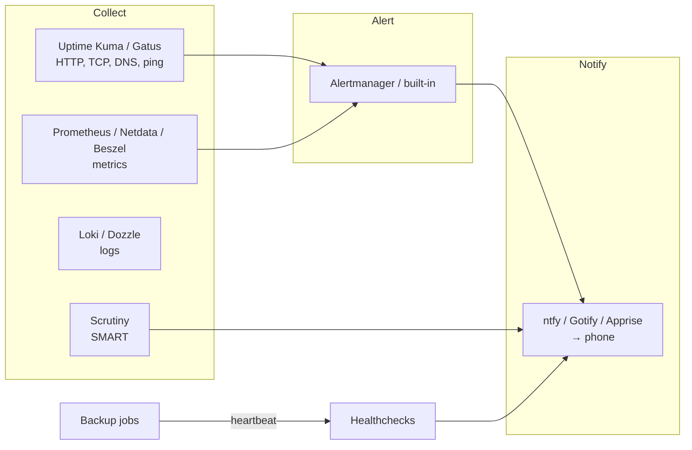

# Monitoring, Logging, and Alerting

The difference between a hobbyist and an operator is who finds out first when something breaks. Without monitoring, your family tells you the photos app is down, you discover the disk filled up three days ago, and you learn about the failing drive when the second one fails. With it, your phone buzzes at 03:10 with "backup job missed," you fix it before breakfast, and nobody else ever knows. This chapter covers the three layers — **uptime checks** (is it responding?), **metrics** (how is it behaving over time?), and **logs** (what exactly happened?) — and the **notification** layer that makes any of it useful. It compares Uptime Kuma, Gatus, Prometheus and Grafana, Netdata, Beszel, Zabbix, Loki, Dozzle, Scrutiny, and the notification services ntfy, Gotify, and Apprise, and ends with the alerts a home lab should actually have.

## Principles

**Alert on symptoms, not causes.** "Jellyfin is not responding on HTTPS" is actionable. "CPU is at 85%" is not — CPU at 85% during a transcode is normal. Start with a handful of alerts that mean *something is actually wrong for a user*, then add cause-level alerts only when you have been bitten by a specific failure.

**Fewer alerts you act on beat many you ignore.** Alert fatigue is real. If an alert fires and you do nothing, delete it or raise its threshold.

**Monitor from outside.** A monitor running on the same host as the services cannot tell you the host is down. Put at least one check on a different machine — a Raspberry Pi, a USD 4 VPS, a free tier of a hosted monitor — that watches the lab from the outside.

**Dead-man's switches for scheduled jobs.** Backups, certificate renewals, scrubs: things that *should* run. You cannot alert on a job that never started unless something *expects* a heartbeat. Healthchecks-style push monitors solve this.

**Keep the monitoring stack simpler than what it monitors.** A three-container Prometheus stack watching four containers is inverted. Scale monitoring with the lab.



## Layer 1: Uptime and status

### Uptime Kuma

The self-hosted uptime monitor that everyone runs. Monitor types: HTTP(S) (with keyword and JSON-query matching), TCP port, ping, DNS, Docker container status, push (dead-man's switch), gRPC, MQTT, database connection (Postgres/MySQL/Redis/Mongo), game servers (Steam), and more. Per-monitor intervals and retries, maintenance windows, certificate-expiry warnings, 90+ notification providers (ntfy, Gotify, Telegram, Discord, Slack, email, Pushover, Apprise, webhooks…), and **public status pages** you can share with the household. Single container, SQLite (MariaDB optional in v2), ~100–200 MB RAM. Beautiful.

**Strengths:** the most approachable monitoring tool in existence; the push monitor doubles as a Healthchecks replacement for backup jobs; status pages are a nice touch for family-facing services; the Docker monitor catches crashed containers.

**Weaknesses:** it is a UI-configured tool — monitors live in the database, not in a file (v2 adds an API; community tools like `uptime-kuma-api` and Terraform providers exist). It scales to a few hundred monitors, not thousands. Its own host is a single point of failure (run a second instance elsewhere watching the first, or a hosted external check).

```yaml
services:
  uptime-kuma:
    image: louislam/uptime-kuma:2
    container_name: uptime-kuma
    restart: unless-stopped
    volumes:
      - ./data:/app/data
      - /var/run/docker.sock:/var/run/docker.sock:ro   # for Docker container monitors (or use a socket proxy)
    ports:
      - "127.0.0.1:3001:3001"
```

### Gatus

The config-as-code alternative: a YAML file lists endpoints and conditions (`[STATUS] == 200`, `[RESPONSE_TIME] < 500`, `[CERTIFICATE_EXPIRATION] > 48h`, `[BODY].status == UP`), alerting providers, and a status page is generated automatically. Very light (~20 MB), stateless (results in SQLite or Postgres optionally), trivially versioned and deployed identically on two hosts. Supports HTTP, TCP, ICMP, DNS, STARTTLS, WebSocket, and external push endpoints.

**Pick Gatus if:** you want your monitors in Git and you already lean config-as-code. **Pick Uptime Kuma if:** you want to click.

### Healthchecks

The dead-man's switch as a service, self-hostable (Python/Django). Each check has a URL; your cron job/backup script curls it on success (`curl -fsS -m 10 --retry 5 https://hc.example.com/ping/uuid`); if the ping does not arrive within the period plus grace time, it alerts. Cron-expression schedules, start/fail signals, per-check integrations, badges, a clean UI. Also available hosted (healthchecks.io, free tier of 20 checks). Uptime Kuma's push monitor does the same thing with less nuance; Healthchecks is worth running if you have more than a handful of scheduled jobs.

### Others

**Statping-ng**, **Kener** and **Upptime** (status pages; Upptime runs entirely on GitHub Actions and is a neat external monitor for a public service), **Cachet** (status page), **Changedetection.io** (not uptime — watches web pages for changes; [Chapter 25](25-misc-apps.md)), **Peekaping**, **Tianji** (uptime + analytics + telemetry in one), **checkmk** and **Nagios/Icinga** (the enterprise ancestors; heavy, still capable).
