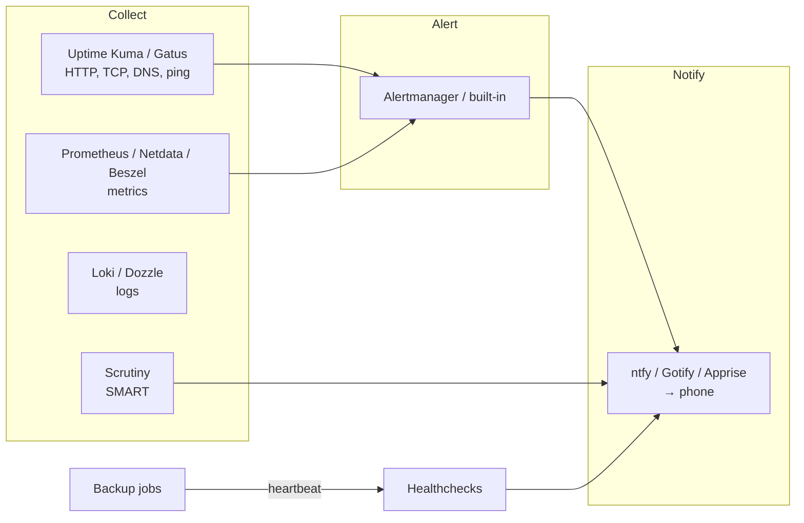

# Monitoring, Logging, and Alerting

The difference between a hobbyist and an operator is who finds out first when something breaks. Without monitoring, your family tells you the photos app is down, you discover the disk filled up three days ago, and you learn about the failing drive when the second one fails. With it, your phone buzzes at 03:10 with "backup job missed," you fix it before breakfast, and nobody else ever knows. This chapter covers the three layers — **uptime checks** (is it responding?), **metrics** (how is it behaving over time?), and **logs** (what exactly happened?) — and the **notification** layer that makes any of it useful. It compares Uptime Kuma, Gatus, Prometheus and Grafana, Netdata, Beszel, Zabbix, Loki, Dozzle, Scrutiny, and the notification services ntfy, Gotify, and Apprise, and ends with the alerts a home lab should actually have.

## Principles

**Alert on symptoms, not causes.** "Jellyfin is not responding on HTTPS" is actionable. "CPU is at 85%" is not — CPU at 85% during a transcode is normal. Start with a handful of alerts that mean *something is actually wrong for a user*, then add cause-level alerts only when you have been bitten by a specific failure.

**Fewer alerts you act on beat many you ignore.** Alert fatigue is real. If an alert fires and you do nothing, delete it or raise its threshold.

**Monitor from outside.** A monitor running on the same host as the services cannot tell you the host is down. Put at least one check on a different machine — a Raspberry Pi, a USD 4 VPS, a free tier of a hosted monitor — that watches the lab from the outside.

**Dead-man's switches for scheduled jobs.** Backups, certificate renewals, scrubs: things that *should* run. You cannot alert on a job that never started unless something *expects* a heartbeat. Healthchecks-style push monitors solve this.

**Keep the monitoring stack simpler than what it monitors.** A three-container Prometheus stack watching four containers is inverted. Scale monitoring with the lab.



## Layer 1: Uptime and status

### Uptime Kuma

The self-hosted uptime monitor that everyone runs. Monitor types: HTTP(S) (with keyword and JSON-query matching), TCP port, ping, DNS, Docker container status, push (dead-man's switch), gRPC, MQTT, database connection (Postgres/MySQL/Redis/Mongo), game servers (Steam), and more. Per-monitor intervals and retries, maintenance windows, certificate-expiry warnings, 90+ notification providers (ntfy, Gotify, Telegram, Discord, Slack, email, Pushover, Apprise, webhooks…), and **public status pages** you can share with the household. Single container, SQLite (MariaDB optional in v2), ~100–200 MB RAM. Beautiful.

**Strengths:** the most approachable monitoring tool in existence; the push monitor doubles as a Healthchecks replacement for backup jobs; status pages are a nice touch for family-facing services; the Docker monitor catches crashed containers.

**Weaknesses:** it is a UI-configured tool — monitors live in the database, not in a file (v2 adds an API; community tools like `uptime-kuma-api` and Terraform providers exist). It scales to a few hundred monitors, not thousands. Its own host is a single point of failure (run a second instance elsewhere watching the first, or a hosted external check).

```yaml
services:
  uptime-kuma:
    image: louislam/uptime-kuma:2
    container_name: uptime-kuma
    restart: unless-stopped
    volumes:
      - ./data:/app/data
      - /var/run/docker.sock:/var/run/docker.sock:ro   # for Docker container monitors (or use a socket proxy)
    ports:
      - "127.0.0.1:3001:3001"
```

### Gatus

The config-as-code alternative: a YAML file lists endpoints and conditions (`[STATUS] == 200`, `[RESPONSE_TIME] < 500`, `[CERTIFICATE_EXPIRATION] > 48h`, `[BODY].status == UP`), alerting providers, and a status page is generated automatically. Very light (~20 MB), stateless (results in SQLite or Postgres optionally), trivially versioned and deployed identically on two hosts. Supports HTTP, TCP, ICMP, DNS, STARTTLS, WebSocket, and external push endpoints.

**Pick Gatus if:** you want your monitors in Git and you already lean config-as-code. **Pick Uptime Kuma if:** you want to click.

### Healthchecks

The dead-man's switch as a service, self-hostable (Python/Django). Each check has a URL; your cron job/backup script curls it on success (`curl -fsS -m 10 --retry 5 https://hc.example.com/ping/uuid`); if the ping does not arrive within the period plus grace time, it alerts. Cron-expression schedules, start/fail signals, per-check integrations, badges, a clean UI. Also available hosted (healthchecks.io, free tier of 20 checks). Uptime Kuma's push monitor does the same thing with less nuance; Healthchecks is worth running if you have more than a handful of scheduled jobs.

### Others

**Statping-ng**, **Kener** and **Upptime** (status pages; Upptime runs entirely on GitHub Actions and is a neat external monitor for a public service), **Cachet** (status page), **Changedetection.io** (not uptime — watches web pages for changes; [Chapter 25](25-misc-apps.md)), **Peekaping**, **Tianji** (uptime + analytics + telemetry in one), **checkmk** and **Nagios/Icinga** (the enterprise ancestors; heavy, still capable).

## Layer 2: Metrics

Metrics are numbers over time: CPU, RAM, disk, network, temperatures, container stats, ZFS ARC hit rate, Postgres connections, Jellyfin active streams. They answer "is this getting worse," "when did it change," and "what is normal."

### Prometheus + Grafana (+ exporters + Alertmanager)

The industry-standard stack and the most powerful option. **Prometheus** scrapes HTTP endpoints exposing metrics every 15–60 seconds and stores them in its time-series database; **exporters** expose the metrics — `node_exporter` (host: CPU/RAM/disk/network/temps), `cAdvisor` (per-container), `smartctl_exporter`, `zfs_exporter`, `blackbox_exporter` (probes), `postgres_exporter`, `pve_exporter` (Proxmox), `unpoller` (UniFi), `speedtest_exporter`, and hundreds more, plus native `/metrics` endpoints in Traefik, Caddy, Immich, Jellyfin (via plugin), Home Assistant, Gitea, MinIO, Pi-hole (via exporter), AdGuard (via exporter), Blocky (native); **Grafana** builds dashboards and (since v8+) does alerting itself; **Alertmanager** routes and deduplicates Prometheus alerts. Resource use: Prometheus 200 MB–1 GB depending on retention and cardinality; Grafana ~150 MB.

**Strengths:** you can measure anything; the dashboard ecosystem (grafana.com/dashboards — import by ID: 1860 for Node Exporter Full, 193 for Docker, 10347 for Proxmox) means good dashboards in minutes; PromQL is a real query language; alert rules are files in Git; it is a professional skill.

**Weaknesses:** it is four or five containers before you have a single graph; exporters per service add up; PromQL and Alertmanager routing have learning curves; long-term retention needs planning (default 15 days; extend with `--storage.tsdb.retention.time=90d` and disk, or ship to **VictoriaMetrics**/**Thanos**/**Mimir**). For a Tier 1 lab it is overkill; for Tier 2+ it is the right foundation.

**VictoriaMetrics** deserves a mention as a drop-in Prometheus replacement that uses a fraction of the RAM and disk with the same query language and exporter ecosystem. Many home labs have switched.

```yaml
# monitoring/compose.yaml (minimal)
services:
  prometheus:
    image: prom/prometheus:latest
    restart: unless-stopped
    command: ["--config.file=/etc/prometheus/prometheus.yml", "--storage.tsdb.retention.time=90d"]
    volumes:
      - ./prometheus.yml:/etc/prometheus/prometheus.yml:ro
      - ./rules:/etc/prometheus/rules:ro
      - prom-data:/prometheus
    ports: ["127.0.0.1:9090:9090"]
  node-exporter:
    image: prom/node-exporter:latest
    restart: unless-stopped
    network_mode: host
    pid: host
    command: ["--path.rootfs=/host"]
    volumes: ["/:/host:ro,rslave"]
  cadvisor:
    image: gcr.io/cadvisor/cadvisor:latest
    restart: unless-stopped
    privileged: true
    devices: ["/dev/kmsg"]
    volumes:
      - /:/rootfs:ro
      - /var/run:/var/run:ro
      - /sys:/sys:ro
      - /var/lib/docker/:/var/lib/docker:ro
    ports: ["127.0.0.1:8081:8080"]
  grafana:
    image: grafana/grafana:latest
    restart: unless-stopped
    environment:
      GF_SECURITY_ADMIN_PASSWORD: ${GRAFANA_PASSWORD}
      GF_SERVER_ROOT_URL: https://grafana.example.com
    volumes: ["grafana-data:/var/lib/grafana"]
    ports: ["127.0.0.1:3000:3000"]
volumes:
  prom-data: {}
  grafana-data: {}
```

### Netdata

A per-host agent that auto-discovers everything (hundreds of collectors: system, Docker, Postgres, Nginx, ZFS, SMART, sensors, systemd units…) and renders **per-second** real-time dashboards with zero configuration, plus built-in anomaly detection and pre-configured health alarms. Install it and you have a detailed dashboard in sixty seconds. Agents can stream to a central "parent" for multi-host views; Netdata Cloud (hosted, free tier) adds cross-node dashboards and mobile notifications — optional; the agent works fully offline.

**Strengths:** the zero-config real-time view is unmatched for troubleshooting "what is happening *right now*"; sane default alarms; Prometheus-compatible export if you want long-term storage elsewhere.

**Weaknesses:** heavier than it looks (~150–300 MB RAM per host, noticeable CPU on tiny boxes at per-second granularity — tune `update every`); the default local retention is short; the push toward Netdata Cloud in the UI annoys some; long-term trends and custom dashboards are Grafana's domain, not Netdata's.

### Beszel

A 2024 arrival that filled a gap: a **lightweight, multi-host, Docker-aware** monitor with a clean UI, a tiny agent per host (~10 MB), CPU/RAM/disk/network/temperature/GPU per host and per container, configurable alerts (CPU, RAM, disk, bandwidth, temperature, status) delivered via any Shoutrrr URL (ntfy, Gotify, Discord…), OIDC login, and a hub that runs on PocketBase (~50 MB). It is not Prometheus — you cannot query arbitrary metrics — but for "show me all my hosts and containers and alert me when one misbehaves" it is nearly perfect and takes five minutes.

**Pick Beszel if:** you have several hosts and want an overview with alerts without running the Prometheus stack. It has quickly become the Tier 1–2 default.

### Zabbix, LibreNMS, and the enterprise tools

**Zabbix** does everything — metrics, alerting, SNMP, agents, templates for every vendor, maps, escalations — with a web UI that looks like 2010 and a Postgres/MySQL backend that wants a real server. If you work with it professionally, run it at home. **LibreNMS** and **Observium** are the network-device (SNMP) specialists — excellent for switches and routers, especially MikroTik or enterprise gear, and worth running alongside a host-metrics stack if you have a real network.

### Glances, btop, Cockpit, and built-ins

**Glances** and **btop** are terminal system monitors (Glances also serves a web UI/API) — a quick look at one machine. **Cockpit** is Red Hat's web console for a single Linux host: status, logs, storage (with the 45Drives ZFS plugin), Podman containers, libvirt VMs, terminal. **Proxmox, TrueNAS, and Unraid** each ship graphs and basic alerting (Proxmox's notification system since 8.1 supports Gotify, webhooks, and matchers; TrueNAS has dozens of alert services). For a Tier 1 all-in-one, these plus Uptime Kuma and Scrutiny may be all the monitoring you need.

### Comparison

| | Uptime Kuma | Gatus | Beszel | Netdata | Prometheus+Grafana | Zabbix |
|---|---|---|---|---|---|---|
| Layer | Uptime | Uptime | Host/container metrics | Host metrics (real-time) | Everything (metrics) | Everything |
| Config | UI | YAML | UI | Auto + files | YAML + UI (Grafana) | UI |
| Multi-host | Yes (probes) | Yes (probes) | **Yes (agents)** | Yes (parent/child) | Yes (scrape) | Yes (agents/SNMP) |
| Per-container | Docker status | No | **Yes** | Yes | Yes (cAdvisor) | Via templates |
| Alerting | Built-in, 90+ providers | Built-in | Built-in (Shoutrrr) | Built-in alarms | Alertmanager/Grafana | Built-in |
| RAM | ~150 MB | ~20 MB | ~50 MB hub + 10 MB/agent | ~200 MB/host | ~500 MB–1.5 GB stack | ~1 GB+ |
| Learning curve | None | Low | None | None | High | High |
| Best for | Everyone | Config-as-code | Multi-host overview | Live troubleshooting | Deep observability | Enterprise/SNMP |
