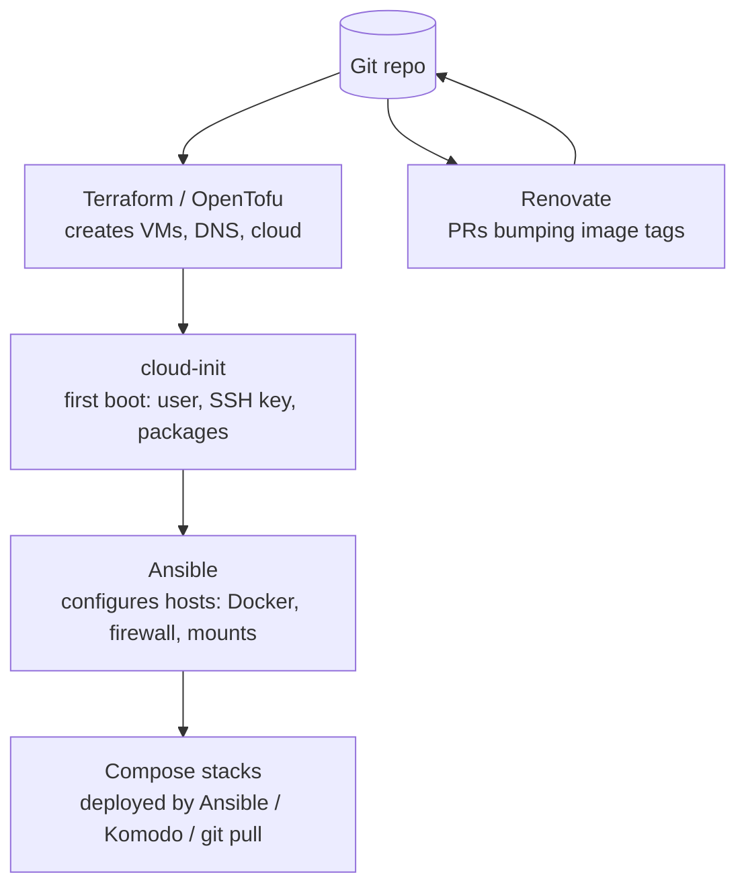

# Infrastructure as Code and Automation

There is a moment in every home lab's life when you realise you could not rebuild it. The Docker host was configured by hand over two years; the Proxmox VMs were clicked into existence; the firewall rules accreted. If the SSD died tomorrow, restoring the *data* would be the easy part — recreating the *configuration* would take weeks of remembering. Infrastructure as code (IaC) is the discipline that prevents this: the state of every machine is described in files, the files live in Git, and a machine is produced by *applying* them rather than by typing. This chapter covers the tools at each layer — Ansible for configuring hosts, Terraform/OpenTofu for provisioning VMs and cloud resources, cloud-init for first boot, NixOS as the declarative extreme, Renovate for keeping versions current, and GitOps workflows for Compose (Komodo) and Kubernetes (Flux, Argo CD) — and, more importantly, how much of it a home lab actually needs.

## How much IaC does a home lab need?

Be honest about the goal. Full IaC — every host reproducible from an empty disk with one command — is a beautiful thing and a serious investment. For most home labs, the *80/20* is:

1. **Compose files and their configs in Git.** This alone gets you most of the value: every service's definition is versioned, diffable, and restorable. If your `/opt/stacks` is a Git repo, you already have IaC for the application layer.
2. **A written (or scripted) procedure for the host.** "Install Debian, run this script that installs Docker, creates the user, sets up the firewall, mounts the NAS, clones the stacks repo." Even a shell script in the repo is a huge improvement over memory.
3. **Backups of the things that are not code** — the hypervisor config, the router's XML export, the switch config ([Chapter 11](11-backups.md)).

Beyond that, Ansible for the host layer and Terraform for VMs are the natural next steps when you have more than two or three hosts or rebuild often. NixOS and Kubernetes GitOps are for people who enjoy the discipline for its own sake or want the professional skill. There is no shame in stopping at step 3; there is real regret in stopping at step 0.



## Ansible: configuring hosts

**Ansible** connects to machines over SSH (no agent), and applies **playbooks** — YAML lists of **tasks** using **modules** (`apt`, `user`, `copy`, `template`, `systemd`, `docker_compose_v2`, `ufw`, `mount`, and thousands more) — idempotently: running a playbook twice produces the same state, and only changes what differs. **Inventory** lists your hosts and groups; **roles** package reusable configuration (a `docker` role, a `common` role for users/SSH/updates); **variables** and **templates** (Jinja2) parameterise per host; **Ansible Vault** or **SOPS** encrypts secrets in the repo.

**What it is good for at home:** the host layer. A `common` role that creates your user, installs your SSH key, hardens sshd, enables unattended-upgrades, sets the timezone, installs your preferred tools, configures ufw and the `DOCKER-USER` rules, and joins the host to Tailscale. A `docker` role that installs Docker from the official repo, writes `daemon.json`, and adds the user to the group. A `nas-mounts` role for NFS. A `stacks` role that clones your Compose repo and runs `docker compose up -d` for each stack (or hands off to Komodo). Run `ansible-playbook site.yml` against a fresh Debian install and twenty minutes later it is a fully configured Docker host identical to the last one.

**What it is less good for:** the *application* layer inside containers (that is what Compose is for), and orchestrating complex multi-step state changes (it is a configuration tool, not a workflow engine). It is also slow for large fleets (irrelevant at home).

**Getting started:** `pip install ansible` (or `pipx`), a repo with `inventory.yml`, `site.yml`, and `roles/`; **Ansible Galaxy** for community roles (`geerlingguy.docker`, `geerlingguy.security` — Jeff Geerling's roles are the gold standard and his book *Ansible for DevOps* the best introduction); `ansible-lint` in CI; **Semaphore UI** if you want a web interface to run playbooks and see history (also runs Terraform/OpenTofu and shell scripts — a nice control panel for a lab's automation); **Ansible AWX/AAP** is the enterprise UI and far too heavy for home.

```yaml
# playbooks/site.yml (sketch)
- hosts: docker_hosts
  become: true
  roles:
    - common          # users, ssh, updates, ufw, tailscale
    - geerlingguy.docker
    - nas_mounts
    - stacks          # git clone + docker compose up per stack
```

```yaml
# roles/stacks/tasks/main.yml (sketch)
- name: Clone the stacks repo
  ansible.builtin.git:
    repo: git@git.example.com:me/stacks.git
    dest: /opt/stacks
    version: main
- name: Decrypt secrets with SOPS
  ansible.builtin.command: sops -d /opt/stacks/{{ item }}/.env.enc
  register: envfile
  loop: "{{ stacks }}"
  changed_when: false
- name: Write .env files
  ansible.builtin.copy:
    content: "{{ item.stdout }}"
    dest: "/opt/stacks/{{ item.item }}/.env"
    mode: "0600"
  loop: "{{ envfile.results }}"
- name: Bring stacks up
  community.docker.docker_compose_v2:
    project_src: "/opt/stacks/{{ item }}"
    state: present
    pull: policy
  loop: "{{ stacks }}"
```

Alternatives: **Salt** (agent-based, faster at scale, steeper), **Puppet/Chef** (the enterprise veterans — heavy, declining at home), **pyinfra** (Python-native, fast, minimal — a pleasant Ansible alternative for Pythonistas), **shell scripts in Git** (legitimate for one or two hosts; the point is reproducibility, not tool choice).

## Terraform and OpenTofu: provisioning

**Terraform** (HashiCorp) declares *resources* — a VM, a DNS record, a cloud bucket, a Tailscale ACL — in HCL files; `terraform plan` shows what would change; `terraform apply` makes it so; **state** tracks what exists. After HashiCorp's 2023 switch to the BSL licence, the Linux Foundation forked it as **OpenTofu** (MPL), which is a drop-in replacement and the community's choice for new work. Both use the same **providers**.

**At home it shines for:** creating Proxmox VMs and LXCs from templates (the **bpg/proxmox** provider is the well-maintained one; the older Telmate provider is deprecated), with cloud-init to set hostname/user/SSH key/IP — so `tofu apply` produces a fresh Debian VM ready for Ansible; managing **DNS records** at Cloudflare/Porkbun (the wildcard, the public records); **Tailscale/Headscale** ACLs and DNS; **cloud resources** (the VPS for Pangolin, the B2 bucket for backups, the Hetzner Storage Box); **Authentik/Keycloak** clients and users (providers exist); **Proxmox Backup Server** datastores; **UniFi** networks; **Minio/Garage** buckets; even **Docker** containers (though Compose is better for that).

**The pattern:** Terraform creates the VM (from a cloud-init-enabled template); cloud-init does first boot; Ansible configures it; Compose runs the apps. State stored locally in the repo (encrypted) or in a backend (an S3 bucket on Garage; the Postgres backend; Terraform Cloud/Spacelift free tiers — not self-hosted). **Atlantis** or **Semaphore** for running plans from CI/PRs if you want a UI.

**Watch out for:** state is precious and must be backed up — losing it means Terraform no longer knows what it manages; the Proxmox provider's quirks (cloning, disk resizing, SCSI vs VirtIO, the `agent` setting) take an afternoon to learn; do not manage in Terraform things you also click in the UI (drift).

Alternatives: **Pulumi** (the same model in real languages — Python/TypeScript/Go; excellent, smaller community for home providers), **Crossplane** (Kubernetes-native provisioning), **the Proxmox community scripts** (imperative, one-shot, very popular — not IaC but a fine way to *create* templates that Terraform then clones).

## cloud-init and VM templates

**cloud-init** is the first-boot configuration system every cloud image supports: hostname, users, SSH keys, packages, files, and a `runcmd` script, fed via a NoCloud datasource, a Proxmox cloud-init drive, or a provider's metadata service. Build one **template** per OS on Proxmox — download the Debian/Ubuntu **cloud image** (`.qcow2`), import it as a VM disk, add a cloud-init drive and the QEMU guest agent, convert to a template — and every new VM is a clone with a cloud-init snippet. This is the standard Proxmox workflow and the bridge between Terraform and Ansible. **Packer** builds custom templates with your tools pre-baked (the `proxmox-iso`/`proxmox-clone` builders) — worth it once you rebuild VMs weekly, unnecessary before.

## NixOS: the declarative host

Introduced in [Chapter 4](04-os-and-hypervisors.md): a Linux distribution where the *whole system* is a declarative configuration. In IaC terms it collapses Ansible, the package manager, and much of Compose into one layer — `services.jellyfin.enable = true;` installs, configures, and runs Jellyfin; `virtualisation.oci-containers.containers.immich = { image = "..."; volumes = [...]; }` runs a container; `networking.firewall.allowedTCPPorts = [ 443 ];` opens a port; `services.restic.backups.nightly = { ... };` schedules a backup — all in one repo, all atomically applied with rollback. With **flakes** for reproducible pins, **sops-nix** or **agenix** for secrets, **nixos-anywhere** or **disko** for installing onto bare disks over SSH, and **deploy-rs**/**colmena**/**nixos-rebuild --target-host** for pushing to many machines, a NixOS lab is *fully* reproducible from Git in a way no other stack matches.

The costs are the language, the error messages, the fragmentation of documentation, the "is this in nixpkgs yet" question, and the time. A meaningful number of experienced self-hosters have converged on NixOS as the host OS for exactly the reasons this chapter exists; an equal number tried and returned to Debian + Ansible. Try it in a VM before committing a lab to it. **Guix System** is the Scheme-based cousin — even more principled, far smaller ecosystem.

## Keeping versions current: Renovate

**Renovate** (Mend) scans a repository for dependencies — Docker image tags in Compose files, Helm chart versions, GitHub Actions, Terraform providers, npm/pip packages — and opens **pull requests** when newer versions exist, with the changelog/release notes linked, grouped and scheduled as you configure (`"schedule": ["after 10pm every weekday"]`, group all minor updates, auto-merge patch releases, pin digests). Run it as the hosted GitHub App (free for public/private GitHub repos) or **self-hosted** against your Forgejo/Gitea (a scheduled CI job or a container running `renovate` with a token; the `renovatebot/renovate` image). Configuration in `renovate.json` at the repo root; presets (`config:recommended`) do the right thing.

This is the mature answer to the update problem from [Chapter 5](05-containers.md): every image bump is a reviewed, versioned commit; merging the PR is the update; the deploy step (below) applies it; `git revert` is the rollback. **Dependabot** is GitHub-only and less flexible. **Diun**/**WUD** notify but do not PR. The combination "pinned tags in Compose + Renovate PRs + auto-deploy on merge" is what a well-run 2026 home lab looks like.

## Deploying on merge: GitOps for Compose

Once configs are in Git and Renovate opens PRs, you want merging to *deploy* without SSHing in:

- **Komodo** ([Chapter 22](22-dev-git-automation.md)) — define stacks as resources pointing at your Git repo; Komodo's periphery agent on each host pulls and deploys on a webhook from Forgejo/Gitea when `main` changes. Multi-host, with a UI, alerts, and everything as TOML you can also sync from Git. **The current best fit for Compose GitOps.**
- **Portainer's Git-backed stacks** with webhook redeploys — works; less elegant.
- **A webhook receiver + script**: **webhook** (adnanh) or **Forgejo Actions runner on the host** runs `git pull && docker compose up -d --pull always` when a push arrives. Ten lines; entirely sufficient for one host.
- **Ansible from CI**: a Forgejo Actions workflow runs the playbook on merge (the runner needs SSH access to hosts — a dedicated deploy key). Cleanest when Ansible already owns the hosts.
- **Watchtower/`docker compose pull` on a timer** — the *non*-GitOps way: it pulls whatever the tag points at, so pin exact versions and let Renovate move them, or accept surprise updates.
- **Doco-CD**, **compose-updater**, **shepherd** (Swarm) — smaller tools in this space.

## GitOps for Kubernetes

If you run k3s/Talos ([Chapter 5](05-containers.md)), GitOps is not optional — it is how you should operate it:

- **Flux CD** — controllers in the cluster watch a Git repo (and Helm repos, OCI registries) and reconcile the cluster to match: Kustomizations, HelmReleases, image automation, SOPS-encrypted secrets natively, notifications. Lightweight, composable, CLI-driven; the choice of the **home-operations** community whose template (`onedr0p/cluster-template`) is the widely-copied starting point.
- **Argo CD** — the same model with a rich **web UI** showing every application's sync state, diffs, and history; ApplicationSets for multi-cluster patterns; more moving parts. Popular in enterprises; a fine home choice if you want the UI.
- Supporting cast: **Renovate** for chart/image bumps, **SOPS/age** or **External Secrets Operator** (pulling from Infisical/OpenBao/1Password), **cert-manager**, **external-dns** (writes DNS records to Pi-hole/AdGuard/Cloudflare from Ingress annotations), **Reloader** (restarts pods on ConfigMap changes), **kube-prometheus-stack**.

## Documentation as code

The IaC repo *is* documentation if it is readable: a `README.md` per stack explaining what it does and why decisions were made; comments in Compose files; an `ARCHITECTURE.md` with the Mermaid diagram of hosts, VLANs, and services; ADRs (architecture decision records — short dated notes: "2026-03: switched from NPM to Caddy because…"). Pair it with the runbook wiki from [Chapter 28](28-maintenance-operations.md), or make the wiki *be* the repo (Otter Wiki/MkDocs rendering the same Markdown). **NetBox** or a simple `hosts.yml` as the source of truth for IPs and hardware. The test: could a competent stranger rebuild this from the repo alone?

## A reference repository layout

```
homelab/
├── README.md                    # what this is, how to bootstrap
├── ARCHITECTURE.md              # diagram, VLANs, hosts, decisions
├── .sops.yaml                   # age keys for secret encryption
├── renovate.json
├── .forgejo/workflows/          # lint on PR; deploy on merge
├── terraform/
│   ├── proxmox/                 # VMs and LXCs from templates
│   ├── dns/                     # Cloudflare records
│   └── tailscale/               # ACLs
├── ansible/
│   ├── inventory.yml
│   ├── site.yml
│   └── roles/{common,docker,nas_mounts,stacks}/
├── stacks/                      # one directory per Compose stack
│   ├── traefik/{compose.yaml,.env.enc,config/}
│   ├── media/{compose.yaml,.env.enc}
│   ├── immich/{compose.yaml,.env.enc}
│   └── ...
├── komodo/                      # Komodo resource TOML (if used)
└── docs/                        # runbooks, ADRs
```

## Recommendations by tier

- **Tier 1:** `stacks/` in Git with `.env` gitignored (or SOPS-encrypted); a `bootstrap.sh` that turns fresh Debian into your Docker host; Renovate (hosted GitHub app or self-hosted) opening PRs; `git pull && docker compose up -d` by hand or via a webhook. That is IaC enough.
- **Tier 2:** add Ansible for the host layer (common + docker + mounts roles; Geerling's roles), OpenTofu for Proxmox VMs from a cloud-init template and for DNS, Komodo for deploy-on-merge, SOPS+age for secrets, Semaphore if you want a UI for runs.
- **Tier 3:** everything above; consider NixOS for hosts if the model appeals; Kubernetes with Flux/Argo if you run it; Packer for templates; a CI pipeline that lints (ansible-lint, tofu validate, `docker compose config`), plans, and deploys; ADRs for every significant decision.

## Checklist

- [ ] Every Compose file and its configuration is in a Git repository hosted on your own forge (and mirrored elsewhere).
- [ ] Secrets are out of the repo (`.gitignore`) or encrypted in it (SOPS + age); the age key is in the password manager and printed.
- [ ] A fresh host can be brought to production state by a documented script or playbook — tested at least once on a scratch VM.
- [ ] Image tags are pinned; Renovate (or equivalent) proposes updates; merging deploys (or you have a one-command deploy).
- [ ] VMs are created from templates via Terraform/OpenTofu or at minimum a documented cloud-init procedure; Terraform state is backed up.
- [ ] Configuration that cannot be code (router, switch, hypervisor UI settings) is exported to the repo or backups on a schedule.
- [ ] An `ARCHITECTURE.md` with a current diagram; decisions recorded as they are made.
- [ ] The "competent stranger" test has been considered honestly.
