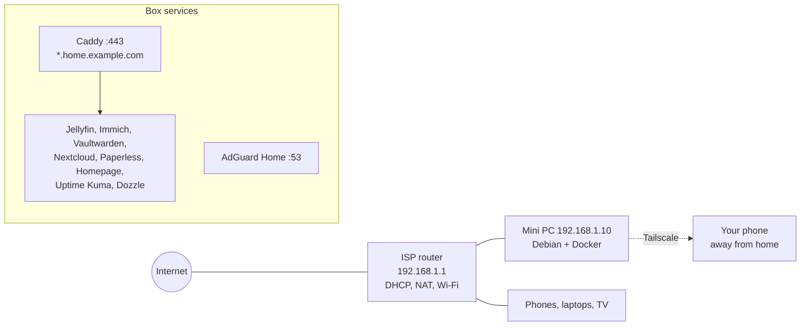

# Reference Architectures

Everything before this chapter has been a menu. This one plates three complete meals: a **Starter** lab on a single mini PC, an **Intermediate** lab that adds a hypervisor, real storage, a proper reverse proxy, SSO and a monitoring stack, and an **Advanced** lab with a dedicated router, VLANs, a NAS, a Proxmox cluster and a Kubernetes-free but fully declarative, GitOps-managed service layer. Each blueprint gives you the hardware bill of materials, the network layout, a diagram, the full Compose stacks (not snippets), the backup plan, the exposure model and an honest list of what it does *not* do. Pick the one that matches where you are, build it end to end, then take the upgrade paths at the end of each section as your needs grow.

!!! note "How to use these blueprints"
    They are opinionated on purpose. Every choice (Caddy vs Traefik, Restic vs Kopia, Pocket ID vs Authelia) has a chapter earlier in the guide explaining the alternatives; the blueprints simply pick one so that the pieces are known to fit together. Swap components once the whole thing is running, not before.

## Blueprint comparison

| | Starter | Intermediate | Advanced |
|---|---|---|---|
| **Hardware** | 1 × mini PC (N100/N305 or used USFF), 16–32 GB, 1 × NVMe + 1 × external SSD | 1 × mini PC or small tower (i5/Ryzen 5, 64 GB), 2 × NVMe (mirror) + 2–4 × HDD; 1 × Pi/thin client for the "second node" | Dedicated router box, managed PoE switch, NAS (4–8 bays), 2–3 Proxmox nodes, small UPS for each rack shelf |
| **Cost (used/new, approx.)** | €200–450 | €700–1,500 | €2,000–5,000+ |
| **Idle power** | 8–15 W | 25–45 W | 80–200 W |
| **Host OS** | Debian 12 / Ubuntu 24.04 LTS + Docker | Proxmox VE → Debian VM for Docker + LXCs | Proxmox VE cluster + TrueNAS SCALE (or Proxmox ZFS) NAS |
| **Storage** | ext4 NVMe + external SSD for backups | ZFS mirror (boot/VMs) + ZFS RAIDZ1 or MergerFS+SnapRAID (bulk) | ZFS on NAS, NFS/iSCSI to nodes, replication between pools |
| **Networking** | ISP router, flat LAN | ISP router in bridge → OPNsense VM *or* keep ISP router; two VLANs | OPNsense/VyOS bare metal, 4–6 VLANs, 2.5/10 GbE spine |
| **Reverse proxy / TLS** | Caddy, DNS-01 wildcard | Traefik, DNS-01 wildcard, split-horizon DNS | Traefik + CrowdSec bouncer; Pangolin for public apps |
| **Remote access** | Tailscale | Tailscale + Headscale option | WireGuard on OPNsense + Tailscale subnet router; Pangolin |
| **Identity** | none / app-native | Pocket ID (OIDC) + Traefik forward-auth via TinyAuth | Authentik or Kanidm, LDAP + OIDC, groups |
| **DNS** | AdGuard Home | AdGuard Home ×2 (HA), Unbound upstream | Unbound + AdGuard on two nodes, DHCP on OPNsense |
| **Monitoring** | Uptime Kuma, Dozzle | Beszel + Uptime Kuma + ntfy | Prometheus/Grafana/Loki, Alertmanager → ntfy, Uptime Kuma external |
| **Backups** | Restic → external SSD + Backblaze B2 | PBS for VMs, Restic for app data, ZFS snapshots, off-site B2 | PBS + ZFS replication to second pool + off-site (B2 / friend's NAS via Tailscale) |
| **IaC** | Compose in Git | Compose in Git + Komodo + Renovate | Ansible + OpenTofu (Proxmox provider) + Komodo/GitOps + Renovate |
| **Services** | Jellyfin, Immich, Vaultwarden, Nextcloud *or* FileBrowser, Paperless, Homepage | + Home Assistant, Forgejo, Miniflux, Audiobookshelf, *arr stack, Grafana | + Matrix/Synapse, Mailcow (optional), Ollama/Open WebUI, game servers, Frigate |

---

## Starter: one box, ten services, a weekend

### Goals

- Everything on one low-power box you can switch off without anyone noticing (until they do).
- HTTPS everywhere with real certificates and *no* open ports.
- Backups that would actually restore.
- A path to Intermediate that does not require starting over.

### Bill of materials

| Item | Suggested | Notes |
|---|---|---|
| Compute | Intel N100/N305 mini PC (Beelink, GMKtec, MINISFORUM) **or** used Lenovo M720q/M920q / HP 800 G4 Mini / Dell 7060 Micro | Intel iGPU gives Quick Sync for Jellyfin and Immich ML runs fine on CPU. 8th-gen+ Intel for used units (see [Hardware](02-hardware.md)) |
| RAM | 16 GB minimum, 32 GB comfortable | Immich + Nextcloud + Jellyfin + Paperless sit around 6–8 GB |
| Boot/app storage | 1 TB NVMe | ext4 is fine here; a single disk has no redundancy so backups are non-negotiable |
| Bulk storage | 2–4 TB USB 3 SSD or a second internal SATA SSD | Media + photos. Avoid USB **HDD** enclosures that spin down aggressively |
| Backup target | Second external SSD (kept unplugged except during backups) + Backblaze B2 | Fulfils 3-2-1 at ~€1–3/month |
| UPS | Optional small line-interactive (APC BE-series or Eaton 3S) | Protects the ext4 filesystem from power-loss corruption; NUT is overkill at this stage |

### Network layout

Keep the ISP router. Give the box a **DHCP reservation** (e.g. `192.168.1.10`) and point the router's DHCP DNS at it once AdGuard is running (or set the DNS on individual devices first while testing).



Name resolution: buy a cheap domain (e.g. `example.com`) at a registrar with an API that Caddy's DNS plugins support (Cloudflare, Porkbun, deSEC, Hetzner…). Create a **wildcard DNS rewrite** in AdGuard Home so `*.home.example.com → 192.168.1.10`. Caddy obtains a wildcard certificate via DNS-01 (see [Reverse proxy & TLS](07-reverse-proxy-tls.md)). Nothing is ever forwarded on the router; away from home you use Tailscale, which also lets you set AdGuard as the tailnet DNS so the same names work everywhere.

### Host preparation

```bash
# Debian 12 minimal install, then:
sudo apt update && sudo apt install -y curl git ufw unattended-upgrades
curl -fsSL https://get.docker.com | sudo sh
sudo usermod -aG docker "$USER"

# Firewall: only SSH (LAN), DNS, HTTP/S, and Tailscale
sudo ufw default deny incoming
sudo ufw allow from 192.168.1.0/24 to any port 22 proto tcp
sudo ufw allow 53
sudo ufw allow 80,443/tcp
sudo ufw allow in on tailscale0
sudo ufw enable

# Tailscale on the host (not in a container) so SSH survives Docker restarts
curl -fsSL https://tailscale.com/install.sh | sh
sudo tailscale up --ssh --advertise-routes=192.168.1.0/24

# Layout
sudo mkdir -p /srv/{stacks,appdata,media,photos,backups}
sudo chown -R "$USER":"$USER" /srv
```

!!! warning "Disable the host's stub resolver before AdGuard"
    On Ubuntu/Debian with `systemd-resolved`, port 53 is taken. Edit `/etc/systemd/resolved.conf` → `DNSStubListener=no`, then `ln -sf /run/systemd/resolve/resolv.conf /etc/resolv.conf` and restart `systemd-resolved`. Details in [DNS & ad blocking](09-dns-adblock.md).

### Compose stacks

Directory layout: one directory per stack under `/srv/stacks`, each with `compose.yaml` and a `.env` that is **not** committed. Commit the directory to a private Git repo (a `.gitignore` with `.env` and `*.secret`).

**`/srv/stacks/proxy/compose.yaml`** — Caddy with the Cloudflare DNS module (swap for your provider; images exist for most, or build with `xcaddy`):

```yaml
services:
  caddy:
    image: ghcr.io/caddybuilds/caddy-cloudflare:latest
    container_name: caddy
    restart: unless-stopped
    ports:
      - "80:80"
      - "443:443"
      - "443:443/udp"
    environment:
      CLOUDFLARE_API_TOKEN: ${CLOUDFLARE_API_TOKEN}
    volumes:
      - ./Caddyfile:/etc/caddy/Caddyfile:ro
      - /srv/appdata/caddy/data:/data
      - /srv/appdata/caddy/config:/config
    networks: [proxy]

networks:
  proxy:
    name: proxy
```

**`/srv/stacks/proxy/Caddyfile`**:

```caddyfile
{
    email you@example.com
}

*.home.example.com {
    tls {
        dns cloudflare {env.CLOUDFLARE_API_TOKEN}
    }

    @jellyfin  host jellyfin.home.example.com
    handle @jellyfin  { reverse_proxy jellyfin:8096 }

    @immich    host photos.home.example.com
    handle @immich    { reverse_proxy immich-server:2283 }

    @vault     host vault.home.example.com
    handle @vault     { reverse_proxy vaultwarden:80 }

    @cloud     host cloud.home.example.com
    handle @cloud     { reverse_proxy nextcloud:80 }

    @paper     host paper.home.example.com
    handle @paper     { reverse_proxy paperless:8000 }

    @home      host home.home.example.com
    handle @home      { reverse_proxy homepage:3000 }

    @status    host status.home.example.com
    handle @status    { reverse_proxy uptime-kuma:3001 }

    @logs      host logs.home.example.com
    handle @logs      { reverse_proxy dozzle:8080 }

    @dns       host dns.home.example.com
    handle @dns       { reverse_proxy adguard:80 }

    handle { respond "No such service" 404 }
}
```

Every app container joins the external `proxy` network and publishes **no ports** of its own — Caddy reaches them by container name.

**`/srv/stacks/dns/compose.yaml`** — AdGuard Home:

```yaml
services:
  adguard:
    image: adguard/adguardhome:latest
    container_name: adguard
    restart: unless-stopped
    ports:
      - "53:53/tcp"
      - "53:53/udp"
      - "3000:3000/tcp"   # first-run wizard only; remove after setup
    volumes:
      - /srv/appdata/adguard/work:/opt/adguardhome/work
      - /srv/appdata/adguard/conf:/opt/adguardhome/conf
    networks: [proxy]

networks:
  proxy:
    external: true
```

After the wizard, set the web UI to port 80 inside the container (or leave 3000 and adjust the Caddyfile), add the DNS rewrite `*.home.example.com → 192.168.1.10`, and choose upstreams (`https://dns.quad9.net/dns-query` or `tls://one.one.one.one`).

**`/srv/stacks/media/compose.yaml`** — Jellyfin with Intel Quick Sync:

```yaml
services:
  jellyfin:
    image: jellyfin/jellyfin:latest
    container_name: jellyfin
    restart: unless-stopped
    user: "1000:1000"
    group_add: ["render", "video"]        # or the numeric GIDs from `getent group render video`
    devices:
      - /dev/dri:/dev/dri
    environment:
      JELLYFIN_PublishedServerUrl: https://jellyfin.home.example.com
    volumes:
      - /srv/appdata/jellyfin/config:/config
      - /srv/appdata/jellyfin/cache:/cache
      - /srv/media:/media:ro
    networks: [proxy]

networks:
  proxy:
    external: true
```

**`/srv/stacks/photos/compose.yaml`** — Immich (pin the version; Immich moves fast and its release notes contain breaking changes):

```yaml
services:
  immich-server:
    image: ghcr.io/immich-app/immich-server:${IMMICH_VERSION:-release}
    container_name: immich-server
    restart: unless-stopped
    devices:
      - /dev/dri:/dev/dri              # hardware transcoding for videos
    volumes:
      - /srv/photos/library:/usr/src/app/upload
      - /etc/localtime:/etc/localtime:ro
    env_file: .env
    depends_on: [immich-redis, immich-db]
    networks: [proxy, immich]

  immich-machine-learning:
    image: ghcr.io/immich-app/immich-machine-learning:${IMMICH_VERSION:-release}
    container_name: immich-ml
    restart: unless-stopped
    volumes:
      - /srv/appdata/immich/model-cache:/cache
    env_file: .env
    networks: [immich]

  immich-redis:
    image: docker.io/valkey/valkey:8-bookworm
    container_name: immich-redis
    restart: unless-stopped
    healthcheck:
      test: redis-cli ping || exit 1
    networks: [immich]

  immich-db:
    image: ghcr.io/immich-app/postgres:14-vectorchord0.4.3-pgvectors0.2.0
    container_name: immich-db
    restart: unless-stopped
    environment:
      POSTGRES_PASSWORD: ${DB_PASSWORD}
      POSTGRES_USER: ${DB_USERNAME}
      POSTGRES_DB: ${DB_DATABASE_NAME}
      POSTGRES_INITDB_ARGS: '--data-checksums'
    volumes:
      - /srv/appdata/immich/postgres:/var/lib/postgresql/data
    shm_size: 128mb
    networks: [immich]

networks:
  proxy:
    external: true
  immich:
```

`.env`:

```dotenv
IMMICH_VERSION=v1.135.3
DB_PASSWORD=change-me-long-random
DB_USERNAME=postgres
DB_DATABASE_NAME=immich
DB_HOSTNAME=immich-db
REDIS_HOSTNAME=immich-redis
TZ=Europe/Berlin
```

**`/srv/stacks/vault/compose.yaml`** — Vaultwarden:

```yaml
services:
  vaultwarden:
    image: vaultwarden/server:latest
    container_name: vaultwarden
    restart: unless-stopped
    environment:
      DOMAIN: https://vault.home.example.com
      SIGNUPS_ALLOWED: "false"          # set true for the first account, then back to false
      ADMIN_TOKEN: ${VW_ADMIN_TOKEN}   # generate with: vaultwarden hash  (argon2)
      SMTP_HOST: ${SMTP_HOST}
      SMTP_FROM: vault@example.com
      SMTP_USERNAME: ${SMTP_USER}
      SMTP_PASSWORD: ${SMTP_PASS}
      SMTP_SECURITY: starttls
      SMTP_PORT: 587
    volumes:
      - /srv/appdata/vaultwarden:/data
    networks: [proxy]

networks:
  proxy:
    external: true
```

**`/srv/stacks/cloud/compose.yaml`** — Nextcloud AIO is simpler on Proxmox; on a single Docker host the plain image with Postgres and Redis is more transparent:

```yaml
services:
  nextcloud:
    image: nextcloud:31-apache
    container_name: nextcloud
    restart: unless-stopped
    environment:
      POSTGRES_HOST: nextcloud-db
      POSTGRES_DB: nextcloud
      POSTGRES_USER: nextcloud
      POSTGRES_PASSWORD: ${NC_DB_PASSWORD}
      REDIS_HOST: nextcloud-redis
      NEXTCLOUD_TRUSTED_DOMAINS: cloud.home.example.com
      OVERWRITEPROTOCOL: https
      OVERWRITECLIURL: https://cloud.home.example.com
      TRUSTED_PROXIES: 172.16.0.0/12
      PHP_MEMORY_LIMIT: 1G
      PHP_UPLOAD_LIMIT: 16G
    volumes:
      - /srv/appdata/nextcloud/html:/var/www/html
      - /srv/appdata/nextcloud/data:/var/www/html/data
    depends_on: [nextcloud-db, nextcloud-redis]
    networks: [proxy, nextcloud]

  nextcloud-cron:
    image: nextcloud:31-apache
    container_name: nextcloud-cron
    restart: unless-stopped
    entrypoint: /cron.sh
    volumes:
      - /srv/appdata/nextcloud/html:/var/www/html
      - /srv/appdata/nextcloud/data:/var/www/html/data
    depends_on: [nextcloud-db, nextcloud-redis]
    networks: [nextcloud]

  nextcloud-db:
    image: postgres:16-alpine
    container_name: nextcloud-db
    restart: unless-stopped
    environment:
      POSTGRES_DB: nextcloud
      POSTGRES_USER: nextcloud
      POSTGRES_PASSWORD: ${NC_DB_PASSWORD}
    volumes:
      - /srv/appdata/nextcloud/postgres:/var/lib/postgresql/data
    networks: [nextcloud]

  nextcloud-redis:
    image: redis:7-alpine
    container_name: nextcloud-redis
    restart: unless-stopped
    networks: [nextcloud]

networks:
  proxy:
    external: true
  nextcloud:
```

!!! tip "Don't want Nextcloud?"
    If all you need is a file browser and WebDAV for a few people, FileBrowser (or FileBrowser Quantum) is one container and ~50 MB of RAM. Syncthing covers device sync. See [Files, sync & documents](17-files-sync-documents.md) for the trade-offs.

**`/srv/stacks/paperless/compose.yaml`** — Paperless-ngx:

```yaml
services:
  paperless:
    image: ghcr.io/paperless-ngx/paperless-ngx:latest
    container_name: paperless
    restart: unless-stopped
    depends_on: [paperless-db, paperless-redis]
    environment:
      PAPERLESS_REDIS: redis://paperless-redis:6379
      PAPERLESS_DBHOST: paperless-db
      PAPERLESS_DBPASS: ${PL_DB_PASSWORD}
      PAPERLESS_URL: https://paper.home.example.com
      PAPERLESS_SECRET_KEY: ${PL_SECRET_KEY}
      PAPERLESS_OCR_LANGUAGE: eng+deu
      PAPERLESS_TIME_ZONE: Europe/Berlin
      PAPERLESS_CONSUMER_POLLING: 30
      USERMAP_UID: 1000
      USERMAP_GID: 1000
    volumes:
      - /srv/appdata/paperless/data:/usr/src/paperless/data
      - /srv/appdata/paperless/media:/usr/src/paperless/media
      - /srv/appdata/paperless/export:/usr/src/paperless/export
      - /srv/appdata/paperless/consume:/usr/src/paperless/consume
    networks: [proxy, paperless]

  paperless-db:
    image: postgres:16-alpine
    container_name: paperless-db
    restart: unless-stopped
    environment:
      POSTGRES_DB: paperless
      POSTGRES_USER: paperless
      POSTGRES_PASSWORD: ${PL_DB_PASSWORD}
    volumes:
      - /srv/appdata/paperless/postgres:/var/lib/postgresql/data
    networks: [paperless]

  paperless-redis:
    image: redis:7-alpine
    container_name: paperless-redis
    restart: unless-stopped
    networks: [paperless]

networks:
  proxy:
    external: true
  paperless:
```

**`/srv/stacks/ops/compose.yaml`** — dashboard, uptime, logs:

```yaml
services:
  homepage:
    image: ghcr.io/gethomepage/homepage:latest
    container_name: homepage
    restart: unless-stopped
    environment:
      HOMEPAGE_ALLOWED_HOSTS: home.home.example.com
      PUID: 1000
      PGID: 1000
    volumes:
      - /srv/appdata/homepage:/app/config
      - /var/run/docker.sock:/var/run/docker.sock:ro   # for Docker widgets; use a socket proxy later
    networks: [proxy]

  uptime-kuma:
    image: louislam/uptime-kuma:2
    container_name: uptime-kuma
    restart: unless-stopped
    volumes:
      - /srv/appdata/uptime-kuma:/app/data
    networks: [proxy]

  dozzle:
    image: amir20/dozzle:latest
    container_name: dozzle
    restart: unless-stopped
    volumes:
      - /var/run/docker.sock:/var/run/docker.sock:ro
    networks: [proxy]

  watchtower:
    image: containrrr/watchtower:latest
    container_name: watchtower
    restart: unless-stopped
    command: --monitor-only --schedule "0 0 6 * * *" --notifications shoutrrr
    environment:
      WATCHTOWER_NOTIFICATION_URL: ${SHOUTRRR_URL}   # e.g. ntfy://ntfy.sh/your-topic
    volumes:
      - /var/run/docker.sock:/var/run/docker.sock:ro

networks:
  proxy:
    external: true
```

Watchtower in **monitor-only** mode tells you updates exist without applying them; auto-updating Immich or Nextcloud unattended is how you learn about breaking changes at 2 a.m. (see [Maintenance](28-maintenance-operations.md)).

Bring it all up:

```bash
for s in proxy dns media photos vault cloud paperless ops; do
  docker compose -f /srv/stacks/$s/compose.yaml up -d
done
```

### Backups (Starter)

Two Restic repositories from the same script: one on the external SSD, one on B2. App data is quiesced by dumping databases first; media and photos are just files.

**`/srv/stacks/backup/backup.sh`**:

```bash
#!/usr/bin/env bash
set -euo pipefail
export RESTIC_PASSWORD_FILE=/srv/stacks/backup/restic.pass
DUMPS=/srv/backups/dumps; mkdir -p "$DUMPS"

# 1. Consistent DB dumps
docker exec immich-db     pg_dumpall -c -U postgres  | gzip > "$DUMPS/immich.sql.gz"
docker exec nextcloud-db  pg_dump  -U nextcloud nextcloud | gzip > "$DUMPS/nextcloud.sql.gz"
docker exec paperless-db  pg_dump  -U paperless paperless | gzip > "$DUMPS/paperless.sql.gz"
docker exec vaultwarden   sqlite3 /data/db.sqlite3 ".backup /data/db.backup"

# 2. Back up to each repo
for REPO in /mnt/backup-ssd/restic "b2:my-bucket:homelab"; do
  export RESTIC_REPOSITORY="$REPO"
  restic backup /srv/appdata /srv/photos /srv/stacks "$DUMPS" \
      --exclude /srv/appdata/immich/postgres \
      --exclude /srv/appdata/nextcloud/postgres \
      --exclude /srv/appdata/paperless/postgres \
      --exclude /srv/appdata/jellyfin/cache \
      --exclude /srv/appdata/immich/model-cache \
      --tag daily
  restic forget --keep-daily 14 --keep-weekly 8 --keep-monthly 12 --prune
done

# 3. Media to the SSD only (large, replaceable)
RESTIC_REPOSITORY=/mnt/backup-ssd/restic restic backup /srv/media --tag media

curl -s -d "Backup OK $(date +%F)" ntfy.sh/your-topic >/dev/null
```

Run with a systemd timer at 03:00 (a unit that sets `Environment=B2_ACCOUNT_ID=… B2_ACCOUNT_KEY=…` from an `EnvironmentFile`). The DB dirs are excluded because live Postgres data directories are not consistent; the dumps are. **Restore test** once a quarter: `restic restore latest --target /tmp/rt --include /srv/appdata/vaultwarden` and open the SQLite file. Fuller patterns in [Backups](11-backups.md).

### What Starter deliberately leaves out

- No hypervisor: a kernel update reboots everything. Acceptable for a household.
- No storage redundancy: single disks, so backups carry all the weight.
- No SSO: each app has its own users. Fine for 1–4 people.
- No public exposure: sharing an Immich album with grandma means she installs Tailscale or you generate a link and accept she can't open it. (If you need public sharing, jump to the Intermediate exposure model.)
- No VLANs: IoT junk shares the LAN with the server. Mitigate with client isolation on the Wi-Fi if the router supports it.

### Upgrade path → Intermediate

1. Add a second disk and convert to a ZFS mirror (a fresh Proxmox install is the least painful route; restore appdata from Restic).
2. Move Caddy → Traefik only if you need middlewares, forward-auth or Docker label routing; otherwise Caddy stays.
3. Add Pocket ID + TinyAuth in front of the admin-ish apps.
4. Add Beszel for host metrics and ntfy for push alerts.
5. Keep every Compose file; they run unchanged inside a Debian VM.

---
