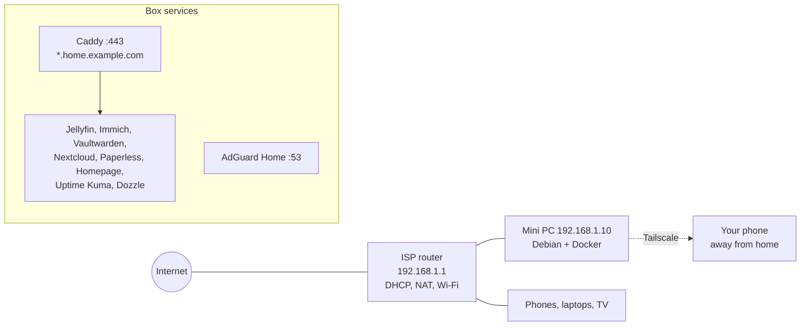
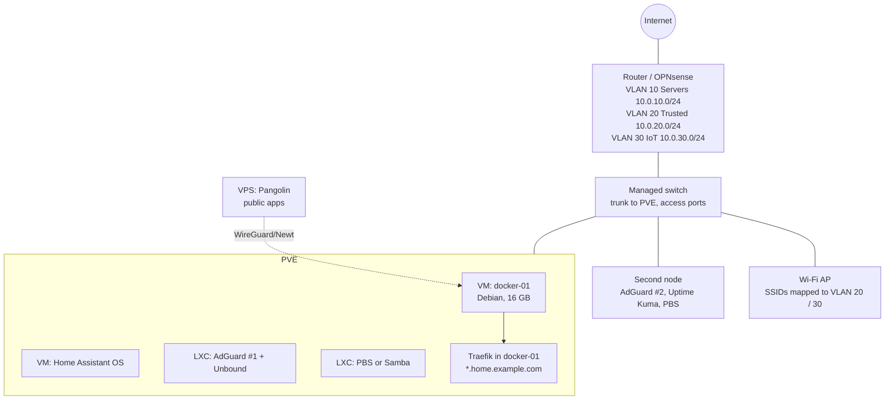
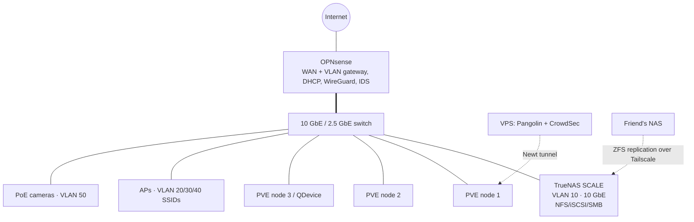
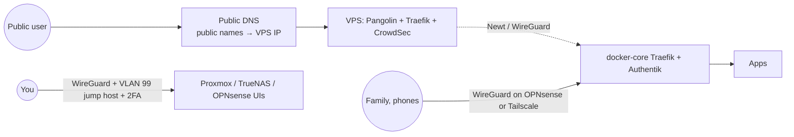

# Reference Architectures

Everything before this chapter has been a menu. This one plates three complete meals: a **Starter** lab on a single mini PC, an **Intermediate** lab that adds a hypervisor, real storage, a proper reverse proxy, SSO and a monitoring stack, and an **Advanced** lab with a dedicated router, VLANs, a NAS, a Proxmox cluster and a Kubernetes-free but fully declarative, GitOps-managed service layer. Each blueprint gives you the hardware bill of materials, the network layout, a diagram, the full Compose stacks (not snippets), the backup plan, the exposure model and an honest list of what it does *not* do. Pick the one that matches where you are, build it end to end, then take the upgrade paths at the end of each section as your needs grow.

!!! note "How to use these blueprints"
    They are opinionated on purpose. Every choice (Caddy vs Traefik, Restic vs Kopia, Pocket ID vs Authelia) has a chapter earlier in the guide explaining the alternatives; the blueprints simply pick one so that the pieces are known to fit together. Swap components once the whole thing is running, not before.

## Blueprint comparison

| | Starter | Intermediate | Advanced |
|---|---|---|---|
| **Hardware** | 1 × mini PC (N100/N305 or used USFF), 16–32 GB, 1 × NVMe + 1 × external SSD | 1 × mini PC or small tower (i5/Ryzen 5, 64 GB), 2 × NVMe (mirror) + 2–4 × HDD; 1 × Pi/thin client for the "second node" | Dedicated router box, managed PoE switch, NAS (4–8 bays), 2–3 Proxmox nodes, small UPS for each rack shelf |
| **Cost (used/new, approx.)** | €200–450 | €700–1,500 | €2,000–5,000+ |
| **Idle power** | 8–15 W | 25–45 W | 80–200 W |
| **Host OS** | Debian 12 / Ubuntu 24.04 LTS + Docker | Proxmox VE → Debian VM for Docker + LXCs | Proxmox VE cluster + TrueNAS SCALE (or Proxmox ZFS) NAS |
| **Storage** | ext4 NVMe + external SSD for backups | ZFS mirror (boot/VMs) + ZFS RAIDZ1 or MergerFS+SnapRAID (bulk) | ZFS on NAS, NFS/iSCSI to nodes, replication between pools |
| **Networking** | ISP router, flat LAN | ISP router in bridge → OPNsense VM *or* keep ISP router; two VLANs | OPNsense/VyOS bare metal, 4–6 VLANs, 2.5/10 GbE spine |
| **Reverse proxy / TLS** | Caddy, DNS-01 wildcard | Traefik, DNS-01 wildcard, split-horizon DNS | Traefik + CrowdSec bouncer; Pangolin for public apps |
| **Remote access** | Tailscale | Tailscale + Headscale option | WireGuard on OPNsense + Tailscale subnet router; Pangolin |
| **Identity** | none / app-native | Pocket ID (OIDC) + Traefik forward-auth via TinyAuth | Authentik or Kanidm, LDAP + OIDC, groups |
| **DNS** | AdGuard Home | AdGuard Home ×2 (HA), Unbound upstream | Unbound + AdGuard on two nodes, DHCP on OPNsense |
| **Monitoring** | Uptime Kuma, Dozzle | Beszel + Uptime Kuma + ntfy | Prometheus/Grafana/Loki, Alertmanager → ntfy, Uptime Kuma external |
| **Backups** | Restic → external SSD + Backblaze B2 | PBS for VMs, Restic for app data, ZFS snapshots, off-site B2 | PBS + ZFS replication to second pool + off-site (B2 / friend's NAS via Tailscale) |
| **IaC** | Compose in Git | Compose in Git + Komodo + Renovate | Ansible + OpenTofu (Proxmox provider) + Komodo/GitOps + Renovate |
| **Services** | Jellyfin, Immich, Vaultwarden, Nextcloud *or* FileBrowser, Paperless, Homepage | + Home Assistant, Forgejo, Miniflux, Audiobookshelf, *arr stack, Grafana | + Matrix/Synapse, Mailcow (optional), Ollama/Open WebUI, game servers, Frigate |

---

## Starter: one box, ten services, a weekend

### Goals

- Everything on one low-power box you can switch off without anyone noticing (until they do).
- HTTPS everywhere with real certificates and *no* open ports.
- Backups that would actually restore.
- A path to Intermediate that does not require starting over.

### Bill of materials

| Item | Suggested | Notes |
|---|---|---|
| Compute | Intel N100/N305 mini PC (Beelink, GMKtec, MINISFORUM) **or** used Lenovo M720q/M920q / HP 800 G4 Mini / Dell 7060 Micro | Intel iGPU gives Quick Sync for Jellyfin and Immich ML runs fine on CPU. 8th-gen+ Intel for used units (see [Hardware](02-hardware.md)) |
| RAM | 16 GB minimum, 32 GB comfortable | Immich + Nextcloud + Jellyfin + Paperless sit around 6–8 GB |
| Boot/app storage | 1 TB NVMe | ext4 is fine here; a single disk has no redundancy so backups are non-negotiable |
| Bulk storage | 2–4 TB USB 3 SSD or a second internal SATA SSD | Media + photos. Avoid USB **HDD** enclosures that spin down aggressively |
| Backup target | Second external SSD (kept unplugged except during backups) + Backblaze B2 | Fulfils 3-2-1 at ~€1–3/month |
| UPS | Optional small line-interactive (APC BE-series or Eaton 3S) | Protects the ext4 filesystem from power-loss corruption; NUT is overkill at this stage |

### Network layout

Keep the ISP router. Give the box a **DHCP reservation** (e.g. `192.168.1.10`) and point the router's DHCP DNS at it once AdGuard is running (or set the DNS on individual devices first while testing).



Name resolution: buy a cheap domain (e.g. `example.com`) at a registrar with an API that Caddy's DNS plugins support (Cloudflare, Porkbun, deSEC, Hetzner…). Create a **wildcard DNS rewrite** in AdGuard Home so `*.home.example.com → 192.168.1.10`. Caddy obtains a wildcard certificate via DNS-01 (see [Reverse proxy & TLS](07-reverse-proxy-tls.md)). Nothing is ever forwarded on the router; away from home you use Tailscale, which also lets you set AdGuard as the tailnet DNS so the same names work everywhere.

### Host preparation

```bash
# Debian 12 minimal install, then:
sudo apt update && sudo apt install -y curl git ufw unattended-upgrades
curl -fsSL https://get.docker.com | sudo sh
sudo usermod -aG docker "$USER"

# Firewall: only SSH (LAN), DNS, HTTP/S, and Tailscale
sudo ufw default deny incoming
sudo ufw allow from 192.168.1.0/24 to any port 22 proto tcp
sudo ufw allow 53
sudo ufw allow 80,443/tcp
sudo ufw allow in on tailscale0
sudo ufw enable

# Tailscale on the host (not in a container) so SSH survives Docker restarts
curl -fsSL https://tailscale.com/install.sh | sh
sudo tailscale up --ssh --advertise-routes=192.168.1.0/24

# Layout
sudo mkdir -p /srv/{stacks,appdata,media,photos,backups}
sudo chown -R "$USER":"$USER" /srv
```

!!! warning "Disable the host's stub resolver before AdGuard"
    On Ubuntu/Debian with `systemd-resolved`, port 53 is taken. Edit `/etc/systemd/resolved.conf` → `DNSStubListener=no`, then `ln -sf /run/systemd/resolve/resolv.conf /etc/resolv.conf` and restart `systemd-resolved`. Details in [DNS & ad blocking](09-dns-adblock.md).

### Compose stacks

Directory layout: one directory per stack under `/srv/stacks`, each with `compose.yaml` and a `.env` that is **not** committed. Commit the directory to a private Git repo (a `.gitignore` with `.env` and `*.secret`).

**`/srv/stacks/proxy/compose.yaml`** — Caddy with the Cloudflare DNS module (swap for your provider; images exist for most, or build with `xcaddy`):

```yaml
services:
  caddy:
    image: ghcr.io/caddybuilds/caddy-cloudflare:latest
    container_name: caddy
    restart: unless-stopped
    ports:
      - "80:80"
      - "443:443"
      - "443:443/udp"
    environment:
      CLOUDFLARE_API_TOKEN: ${CLOUDFLARE_API_TOKEN}
    volumes:
      - ./Caddyfile:/etc/caddy/Caddyfile:ro
      - /srv/appdata/caddy/data:/data
      - /srv/appdata/caddy/config:/config
    networks: [proxy]

networks:
  proxy:
    name: proxy
```

**`/srv/stacks/proxy/Caddyfile`**:

```caddyfile
{
    email you@example.com
}

*.home.example.com {
    tls {
        dns cloudflare {env.CLOUDFLARE_API_TOKEN}
    }

    @jellyfin  host jellyfin.home.example.com
    handle @jellyfin  { reverse_proxy jellyfin:8096 }

    @immich    host photos.home.example.com
    handle @immich    { reverse_proxy immich-server:2283 }

    @vault     host vault.home.example.com
    handle @vault     { reverse_proxy vaultwarden:80 }

    @cloud     host cloud.home.example.com
    handle @cloud     { reverse_proxy nextcloud:80 }

    @paper     host paper.home.example.com
    handle @paper     { reverse_proxy paperless:8000 }

    @home      host home.home.example.com
    handle @home      { reverse_proxy homepage:3000 }

    @status    host status.home.example.com
    handle @status    { reverse_proxy uptime-kuma:3001 }

    @logs      host logs.home.example.com
    handle @logs      { reverse_proxy dozzle:8080 }

    @dns       host dns.home.example.com
    handle @dns       { reverse_proxy adguard:80 }

    handle { respond "No such service" 404 }
}
```

Every app container joins the external `proxy` network and publishes **no ports** of its own — Caddy reaches them by container name.

**`/srv/stacks/dns/compose.yaml`** — AdGuard Home:

```yaml
services:
  adguard:
    image: adguard/adguardhome:latest
    container_name: adguard
    restart: unless-stopped
    ports:
      - "53:53/tcp"
      - "53:53/udp"
      - "3000:3000/tcp"   # first-run wizard only; remove after setup
    volumes:
      - /srv/appdata/adguard/work:/opt/adguardhome/work
      - /srv/appdata/adguard/conf:/opt/adguardhome/conf
    networks: [proxy]

networks:
  proxy:
    external: true
```

After the wizard, set the web UI to port 80 inside the container (or leave 3000 and adjust the Caddyfile), add the DNS rewrite `*.home.example.com → 192.168.1.10`, and choose upstreams (`https://dns.quad9.net/dns-query` or `tls://one.one.one.one`).

**`/srv/stacks/media/compose.yaml`** — Jellyfin with Intel Quick Sync:

```yaml
services:
  jellyfin:
    image: jellyfin/jellyfin:latest
    container_name: jellyfin
    restart: unless-stopped
    user: "1000:1000"
    group_add: ["render", "video"]        # or the numeric GIDs from `getent group render video`
    devices:
      - /dev/dri:/dev/dri
    environment:
      JELLYFIN_PublishedServerUrl: https://jellyfin.home.example.com
    volumes:
      - /srv/appdata/jellyfin/config:/config
      - /srv/appdata/jellyfin/cache:/cache
      - /srv/media:/media:ro
    networks: [proxy]

networks:
  proxy:
    external: true
```

**`/srv/stacks/photos/compose.yaml`** — Immich (pin the version; Immich moves fast and its release notes contain breaking changes):

```yaml
services:
  immich-server:
    image: ghcr.io/immich-app/immich-server:${IMMICH_VERSION:-release}
    container_name: immich-server
    restart: unless-stopped
    devices:
      - /dev/dri:/dev/dri              # hardware transcoding for videos
    volumes:
      - /srv/photos/library:/usr/src/app/upload
      - /etc/localtime:/etc/localtime:ro
    env_file: .env
    depends_on: [immich-redis, immich-db]
    networks: [proxy, immich]

  immich-machine-learning:
    image: ghcr.io/immich-app/immich-machine-learning:${IMMICH_VERSION:-release}
    container_name: immich-ml
    restart: unless-stopped
    volumes:
      - /srv/appdata/immich/model-cache:/cache
    env_file: .env
    networks: [immich]

  immich-redis:
    image: docker.io/valkey/valkey:8-bookworm
    container_name: immich-redis
    restart: unless-stopped
    healthcheck:
      test: redis-cli ping || exit 1
    networks: [immich]

  immich-db:
    image: ghcr.io/immich-app/postgres:14-vectorchord0.4.3-pgvectors0.2.0
    container_name: immich-db
    restart: unless-stopped
    environment:
      POSTGRES_PASSWORD: ${DB_PASSWORD}
      POSTGRES_USER: ${DB_USERNAME}
      POSTGRES_DB: ${DB_DATABASE_NAME}
      POSTGRES_INITDB_ARGS: '--data-checksums'
    volumes:
      - /srv/appdata/immich/postgres:/var/lib/postgresql/data
    shm_size: 128mb
    networks: [immich]

networks:
  proxy:
    external: true
  immich:
```

`.env`:

```dotenv
IMMICH_VERSION=v1.135.3
DB_PASSWORD=change-me-long-random
DB_USERNAME=postgres
DB_DATABASE_NAME=immich
DB_HOSTNAME=immich-db
REDIS_HOSTNAME=immich-redis
TZ=Europe/Berlin
```

**`/srv/stacks/vault/compose.yaml`** — Vaultwarden:

```yaml
services:
  vaultwarden:
    image: vaultwarden/server:latest
    container_name: vaultwarden
    restart: unless-stopped
    environment:
      DOMAIN: https://vault.home.example.com
      SIGNUPS_ALLOWED: "false"          # set true for the first account, then back to false
      ADMIN_TOKEN: ${VW_ADMIN_TOKEN}   # generate with: vaultwarden hash  (argon2)
      SMTP_HOST: ${SMTP_HOST}
      SMTP_FROM: vault@example.com
      SMTP_USERNAME: ${SMTP_USER}
      SMTP_PASSWORD: ${SMTP_PASS}
      SMTP_SECURITY: starttls
      SMTP_PORT: 587
    volumes:
      - /srv/appdata/vaultwarden:/data
    networks: [proxy]

networks:
  proxy:
    external: true
```

**`/srv/stacks/cloud/compose.yaml`** — Nextcloud AIO is simpler on Proxmox; on a single Docker host the plain image with Postgres and Redis is more transparent:

```yaml
services:
  nextcloud:
    image: nextcloud:31-apache
    container_name: nextcloud
    restart: unless-stopped
    environment:
      POSTGRES_HOST: nextcloud-db
      POSTGRES_DB: nextcloud
      POSTGRES_USER: nextcloud
      POSTGRES_PASSWORD: ${NC_DB_PASSWORD}
      REDIS_HOST: nextcloud-redis
      NEXTCLOUD_TRUSTED_DOMAINS: cloud.home.example.com
      OVERWRITEPROTOCOL: https
      OVERWRITECLIURL: https://cloud.home.example.com
      TRUSTED_PROXIES: 172.16.0.0/12
      PHP_MEMORY_LIMIT: 1G
      PHP_UPLOAD_LIMIT: 16G
    volumes:
      - /srv/appdata/nextcloud/html:/var/www/html
      - /srv/appdata/nextcloud/data:/var/www/html/data
    depends_on: [nextcloud-db, nextcloud-redis]
    networks: [proxy, nextcloud]

  nextcloud-cron:
    image: nextcloud:31-apache
    container_name: nextcloud-cron
    restart: unless-stopped
    entrypoint: /cron.sh
    volumes:
      - /srv/appdata/nextcloud/html:/var/www/html
      - /srv/appdata/nextcloud/data:/var/www/html/data
    depends_on: [nextcloud-db, nextcloud-redis]
    networks: [nextcloud]

  nextcloud-db:
    image: postgres:16-alpine
    container_name: nextcloud-db
    restart: unless-stopped
    environment:
      POSTGRES_DB: nextcloud
      POSTGRES_USER: nextcloud
      POSTGRES_PASSWORD: ${NC_DB_PASSWORD}
    volumes:
      - /srv/appdata/nextcloud/postgres:/var/lib/postgresql/data
    networks: [nextcloud]

  nextcloud-redis:
    image: redis:7-alpine
    container_name: nextcloud-redis
    restart: unless-stopped
    networks: [nextcloud]

networks:
  proxy:
    external: true
  nextcloud:
```

!!! tip "Don't want Nextcloud?"
    If all you need is a file browser and WebDAV for a few people, FileBrowser (or FileBrowser Quantum) is one container and ~50 MB of RAM. Syncthing covers device sync. See [Files, sync & documents](17-files-sync-documents.md) for the trade-offs.

**`/srv/stacks/paperless/compose.yaml`** — Paperless-ngx:

```yaml
services:
  paperless:
    image: ghcr.io/paperless-ngx/paperless-ngx:latest
    container_name: paperless
    restart: unless-stopped
    depends_on: [paperless-db, paperless-redis]
    environment:
      PAPERLESS_REDIS: redis://paperless-redis:6379
      PAPERLESS_DBHOST: paperless-db
      PAPERLESS_DBPASS: ${PL_DB_PASSWORD}
      PAPERLESS_URL: https://paper.home.example.com
      PAPERLESS_SECRET_KEY: ${PL_SECRET_KEY}
      PAPERLESS_OCR_LANGUAGE: eng+deu
      PAPERLESS_TIME_ZONE: Europe/Berlin
      PAPERLESS_CONSUMER_POLLING: 30
      USERMAP_UID: 1000
      USERMAP_GID: 1000
    volumes:
      - /srv/appdata/paperless/data:/usr/src/paperless/data
      - /srv/appdata/paperless/media:/usr/src/paperless/media
      - /srv/appdata/paperless/export:/usr/src/paperless/export
      - /srv/appdata/paperless/consume:/usr/src/paperless/consume
    networks: [proxy, paperless]

  paperless-db:
    image: postgres:16-alpine
    container_name: paperless-db
    restart: unless-stopped
    environment:
      POSTGRES_DB: paperless
      POSTGRES_USER: paperless
      POSTGRES_PASSWORD: ${PL_DB_PASSWORD}
    volumes:
      - /srv/appdata/paperless/postgres:/var/lib/postgresql/data
    networks: [paperless]

  paperless-redis:
    image: redis:7-alpine
    container_name: paperless-redis
    restart: unless-stopped
    networks: [paperless]

networks:
  proxy:
    external: true
  paperless:
```

**`/srv/stacks/ops/compose.yaml`** — dashboard, uptime, logs:

```yaml
services:
  homepage:
    image: ghcr.io/gethomepage/homepage:latest
    container_name: homepage
    restart: unless-stopped
    environment:
      HOMEPAGE_ALLOWED_HOSTS: home.home.example.com
      PUID: 1000
      PGID: 1000
    volumes:
      - /srv/appdata/homepage:/app/config
      - /var/run/docker.sock:/var/run/docker.sock:ro   # for Docker widgets; use a socket proxy later
    networks: [proxy]

  uptime-kuma:
    image: louislam/uptime-kuma:2
    container_name: uptime-kuma
    restart: unless-stopped
    volumes:
      - /srv/appdata/uptime-kuma:/app/data
    networks: [proxy]

  dozzle:
    image: amir20/dozzle:latest
    container_name: dozzle
    restart: unless-stopped
    volumes:
      - /var/run/docker.sock:/var/run/docker.sock:ro
    networks: [proxy]

  watchtower:
    image: containrrr/watchtower:latest
    container_name: watchtower
    restart: unless-stopped
    command: --monitor-only --schedule "0 0 6 * * *" --notifications shoutrrr
    environment:
      WATCHTOWER_NOTIFICATION_URL: ${SHOUTRRR_URL}   # e.g. ntfy://ntfy.sh/your-topic
    volumes:
      - /var/run/docker.sock:/var/run/docker.sock:ro

networks:
  proxy:
    external: true
```

Watchtower in **monitor-only** mode tells you updates exist without applying them; auto-updating Immich or Nextcloud unattended is how you learn about breaking changes at 2 a.m. (see [Maintenance](28-maintenance-operations.md)).

Bring it all up:

```bash
for s in proxy dns media photos vault cloud paperless ops; do
  docker compose -f /srv/stacks/$s/compose.yaml up -d
done
```

### Backups (Starter)

Two Restic repositories from the same script: one on the external SSD, one on B2. App data is quiesced by dumping databases first; media and photos are just files.

**`/srv/stacks/backup/backup.sh`**:

```bash
#!/usr/bin/env bash
set -euo pipefail
export RESTIC_PASSWORD_FILE=/srv/stacks/backup/restic.pass
DUMPS=/srv/backups/dumps; mkdir -p "$DUMPS"

# 1. Consistent DB dumps
docker exec immich-db     pg_dumpall -c -U postgres  | gzip > "$DUMPS/immich.sql.gz"
docker exec nextcloud-db  pg_dump  -U nextcloud nextcloud | gzip > "$DUMPS/nextcloud.sql.gz"
docker exec paperless-db  pg_dump  -U paperless paperless | gzip > "$DUMPS/paperless.sql.gz"
docker exec vaultwarden   sqlite3 /data/db.sqlite3 ".backup /data/db.backup"

# 2. Back up to each repo
for REPO in /mnt/backup-ssd/restic "b2:my-bucket:homelab"; do
  export RESTIC_REPOSITORY="$REPO"
  restic backup /srv/appdata /srv/photos /srv/stacks "$DUMPS" \
      --exclude /srv/appdata/immich/postgres \
      --exclude /srv/appdata/nextcloud/postgres \
      --exclude /srv/appdata/paperless/postgres \
      --exclude /srv/appdata/jellyfin/cache \
      --exclude /srv/appdata/immich/model-cache \
      --tag daily
  restic forget --keep-daily 14 --keep-weekly 8 --keep-monthly 12 --prune
done

# 3. Media to the SSD only (large, replaceable)
RESTIC_REPOSITORY=/mnt/backup-ssd/restic restic backup /srv/media --tag media

curl -s -d "Backup OK $(date +%F)" ntfy.sh/your-topic >/dev/null
```

Run with a systemd timer at 03:00 (a unit that sets `Environment=B2_ACCOUNT_ID=… B2_ACCOUNT_KEY=…` from an `EnvironmentFile`). The DB dirs are excluded because live Postgres data directories are not consistent; the dumps are. **Restore test** once a quarter: `restic restore latest --target /tmp/rt --include /srv/appdata/vaultwarden` and open the SQLite file. Fuller patterns in [Backups](11-backups.md).

### What Starter deliberately leaves out

- No hypervisor: a kernel update reboots everything. Acceptable for a household.
- No storage redundancy: single disks, so backups carry all the weight.
- No SSO: each app has its own users. Fine for 1–4 people.
- No public exposure: sharing an Immich album with grandma means she installs Tailscale or you generate a link and accept she can't open it. (If you need public sharing, jump to the Intermediate exposure model.)
- No VLANs: IoT junk shares the LAN with the server. Mitigate with client isolation on the Wi-Fi if the router supports it.

### Upgrade path → Intermediate

1. Add a second disk and convert to a ZFS mirror (a fresh Proxmox install is the least painful route; restore appdata from Restic).
2. Move Caddy → Traefik only if you need middlewares, forward-auth or Docker label routing; otherwise Caddy stays.
3. Add Pocket ID + TinyAuth in front of the admin-ish apps.
4. Add Beszel for host metrics and ntfy for push alerts.
5. Keep every Compose file; they run unchanged inside a Debian VM.

---

## Intermediate: hypervisor, redundant storage, SSO, real monitoring

### Goals

- Survive a single disk failure and a botched OS upgrade (snapshots + rollback).
- Segregate IoT and guests from servers with two VLANs.
- One login for everything that supports OIDC; forward-auth for what does not.
- Alerts on your phone when a disk, backup, certificate or service goes bad.
- Public exposure for a *small* set of apps without touching the router's port-forward table.

### Bill of materials

| Item | Suggested | Notes |
|---|---|---|
| Main node | Used SFF/tower (Dell 3070/7070 SFF, HP 800 G5 SFF) or a 6-core mini PC (MINISFORUM MS-01, ASUS NUC 13 Pro) | i5-9500+/Ryzen 5 5600+ ; iGPU for transcoding. MS-01 gives 2×2.5 GbE + 2×10 GbE SFP+ and 3 NVMe slots |
| RAM | 64 GB (2×32 DDR4/DDR5 SODIMM) | ZFS ARC + 6–10 VMs/LXCs. ECC if the platform allows (see [Hardware](02-hardware.md)) |
| Boot + VM pool | 2 × 1–2 TB NVMe, **ZFS mirror** | Choose enterprise-ish drives or expect TBW to be consumed by Proxmox's logging; set `zfs_arc_max` |
| Bulk pool | 2–4 × 8–16 TB CMR HDD (WD Red Plus/Pro, Seagate IronWolf, Toshiba N300) | RAIDZ1 with 3–4 drives, or a mirror with 2. Or MergerFS + SnapRAID if mostly media |
| Second node | Raspberry Pi 5 / used thin client (Fujitsu Futro S740, HP t640) | Runs second AdGuard, Uptime Kuma *externally to the main node*, PBS if it has a USB SSD |
| Switch | 8-port managed 2.5 GbE (or 1 GbE with 2.5 GbE uplinks) that does 802.1Q VLANs | TP-Link TL-SG108E class is enough; PoE if you want APs/cameras |
| Router | Keep the ISP router **or** move routing to an OPNsense VM with a dedicated NIC | The VM route is elegant but ties your internet to the hypervisor rebooting. See [Networking](03-networking.md) |
| UPS | 600–1000 VA line-interactive with USB (Eaton Ellipse, APC Back-UPS Pro, CyberPower CP series) | NUT on the Proxmox host shuts down cleanly |

### Network layout



Rules on the router firewall, in order:

1. IoT → Servers: allow only what the integration needs (e.g. TCP 8123 to Home Assistant, MQTT 1883, DNS 53); block the rest.
2. Trusted → Servers: allow all.
3. Servers → Trusted/IoT: allow *established* only, plus specific exceptions (HA → IoT devices, Jellyfin → Chromecast on IoT via mDNS reflector).
4. Guest Wi-Fi → Internet only.

mDNS across VLANs needs a reflector (Avahi on OPNsense, or `mdns-repeater`); Chromecast discovery is the classic casualty. Details and IPv6 considerations in [Networking](03-networking.md).

### Proxmox layout

| Guest | Type | vCPU / RAM | Storage | Notes |
|---|---|---|---|---|
| `docker-01` | VM (Debian 12, q35, virtio) | 6 / 16–24 GB | 200 GB on NVMe mirror; **bind-mount bulk via NFS or virtiofs** | The main Compose host. iGPU passthrough *or* leave the GPU on the host and give Jellyfin its own LXC with `/dev/dri` mapped |
| `haos` | VM (Home Assistant OS) | 2 / 4 GB | 32 GB | Use the community helper script or import the qcow2. USB Zigbee/Z-Wave stick passthrough |
| `dns-01` | LXC (Debian, unprivileged) | 1 / 512 MB | 4 GB | AdGuard Home + Unbound. Static IP `10.0.10.53` |
| `pbs` | LXC or VM | 2 / 4 GB | datastore on bulk pool | Proxmox Backup Server. Better on the second node if it has the disk |
| `files` | LXC | 2 / 2 GB | bind-mounts from bulk pool | Samba/NFS exports for the LAN; keeps SMB out of the Docker VM |

ZFS specifics: `zfs set compression=zstd atime=off xattr=sa` on pools; datasets per purpose (`tank/media`, `tank/photos`, `tank/appdata-backups`); `zfs_arc_max` ≈ 25 % of RAM in `/etc/modprobe.d/zfs.conf`; monthly scrubs via the default timer; `zfs-auto-snapshot` or Sanoid for 15-min/hourly/daily snapshots on the VM pool. Full treatment in [Storage](06-storage.md) and [OS & hypervisors](04-os-and-hypervisors.md).

!!! warning "Proxmox on consumer NVMe"
    Proxmox writes constantly (pmxcfs, RRD, journal). Two mitigations: `zfs set sync=disabled` is **not** one of them. Use `log2ram`-style tmpfs for `/var/log` sparingly, disable the HA services if you have a single node (`systemctl disable --now pve-ha-lrm pve-ha-crm`), and buy drives with ≥600 TBW.

### Compose on `docker-01`

The Starter stacks carry over. What changes: Traefik replaces Caddy (Docker labels, middlewares, forward-auth), a socket proxy hides the Docker socket, Pocket ID provides OIDC, TinyAuth guards apps that lack native OIDC, and Beszel + ntfy add metrics and alerts.

**`/srv/stacks/proxy/compose.yaml`**:

```yaml
services:
  socket-proxy:
    image: lscr.io/linuxserver/socket-proxy:latest
    container_name: socket-proxy
    restart: unless-stopped
    environment:
      CONTAINERS: 1
      POST: 0
    volumes:
      - /var/run/docker.sock:/var/run/docker.sock:ro
    read_only: true
    tmpfs: [/run]
    networks: [socket]

  traefik:
    image: traefik:v3.4
    container_name: traefik
    restart: unless-stopped
    depends_on: [socket-proxy]
    security_opt: [no-new-privileges:true]
    ports:
      - "80:80"
      - "443:443"
    environment:
      CF_DNS_API_TOKEN: ${CF_DNS_API_TOKEN}
    command:
      - --api.dashboard=true
      - --providers.docker=true
      - --providers.docker.endpoint=tcp://socket-proxy:2375
      - --providers.docker.exposedbydefault=false
      - --providers.docker.network=proxy
      - --providers.file.directory=/dynamic
      - --providers.file.watch=true
      - --entrypoints.web.address=:80
      - --entrypoints.web.http.redirections.entrypoint.to=websecure
      - --entrypoints.web.http.redirections.entrypoint.scheme=https
      - --entrypoints.websecure.address=:443
      - --entrypoints.websecure.http.tls.certresolver=le
      - --entrypoints.websecure.http.tls.domains[0].main=home.example.com
      - --entrypoints.websecure.http.tls.domains[0].sans=*.home.example.com
      - --certificatesresolvers.le.acme.dnschallenge=true
      - --certificatesresolvers.le.acme.dnschallenge.provider=cloudflare
      - --certificatesresolvers.le.acme.dnschallenge.resolvers=1.1.1.1:53,8.8.8.8:53
      - --certificatesresolvers.le.acme.email=you@example.com
      - --certificatesresolvers.le.acme.storage=/letsencrypt/acme.json
      - --log.level=INFO
      - --accesslog=true
      - --metrics.prometheus=true
    volumes:
      - /srv/appdata/traefik/letsencrypt:/letsencrypt
      - ./dynamic:/dynamic:ro
    networks: [proxy, socket]
    labels:
      traefik.enable: "true"
      traefik.http.routers.traefik.rule: Host(`traefik.home.example.com`)
      traefik.http.routers.traefik.service: api@internal
      traefik.http.routers.traefik.middlewares: tinyauth@docker,secure-headers@file

  tinyauth:
    image: ghcr.io/steveiliop56/tinyauth:v3
    container_name: tinyauth
    restart: unless-stopped
    environment:
      APP_URL: https://auth.home.example.com
      SECRET: ${TINYAUTH_SECRET}
      GENERIC_CLIENT_ID: ${TINYAUTH_OIDC_CLIENT_ID}
      GENERIC_CLIENT_SECRET: ${TINYAUTH_OIDC_CLIENT_SECRET}
      GENERIC_AUTH_URL: https://id.home.example.com/authorize
      GENERIC_TOKEN_URL: https://id.home.example.com/api/oidc/token
      GENERIC_USER_URL: https://id.home.example.com/api/oidc/userinfo
      GENERIC_SCOPES: openid email profile groups
      GENERIC_NAME: Pocket ID
      OAUTH_WHITELIST: you@example.com,partner@example.com
    networks: [proxy]
    labels:
      traefik.enable: "true"
      traefik.http.routers.tinyauth.rule: Host(`auth.home.example.com`)
      traefik.http.middlewares.tinyauth.forwardauth.address: http://tinyauth:3000/api/auth/traefik

  pocket-id:
    image: ghcr.io/pocket-id/pocket-id:v1
    container_name: pocket-id
    restart: unless-stopped
    environment:
      APP_URL: https://id.home.example.com
      TRUST_PROXY: "true"
      PUID: 1000
      PGID: 1000
    volumes:
      - /srv/appdata/pocket-id:/app/data
    networks: [proxy]
    labels:
      traefik.enable: "true"
      traefik.http.routers.pocket-id.rule: Host(`id.home.example.com`)

networks:
  proxy:
    name: proxy
  socket:
    internal: true
```

**`/srv/stacks/proxy/dynamic/middlewares.yaml`**:

```yaml
http:
  middlewares:
    secure-headers:
      headers:
        stsSeconds: 31536000
        stsIncludeSubdomains: true
        browserXssFilter: true
        contentTypeNosniff: true
        referrerPolicy: strict-origin-when-cross-origin
        frameDeny: false        # Homepage iframes; set true per-router if desired
    lan-only:
      ipAllowList:
        sourceRange: ["10.0.10.0/24", "10.0.20.0/24", "100.64.0.0/10"]
```

An app then needs only labels, e.g. Jellyfin (native login, so no TinyAuth):

```yaml
    labels:
      traefik.enable: "true"
      traefik.http.routers.jellyfin.rule: Host(`jellyfin.home.example.com`)
      traefik.http.services.jellyfin.loadbalancer.server.port: 8096
      traefik.http.routers.jellyfin.middlewares: secure-headers@file
```

and something like Dozzle (no auth of its own) gets `traefik.http.routers.dozzle.middlewares: tinyauth@docker,lan-only@file`.

Apps with native OIDC — Immich, Paperless (via `PAPERLESS_SOCIALACCOUNT_PROVIDERS`), Nextcloud (`user_oidc` app), Forgejo, Miniflux, Audiobookshelf, Grafana, Komodo, Home Assistant (through the *hass-oidc* custom integration) — get a client in Pocket ID and log in with a passkey. The mechanics are in [Identity & SSO](10-identity-sso.md).

**`/srv/stacks/ops/compose.yaml`** (additions):

```yaml
  beszel:
    image: henrygd/beszel:latest
    container_name: beszel
    restart: unless-stopped
    volumes:
      - /srv/appdata/beszel:/beszel_data
    networks: [proxy]
    labels:
      traefik.enable: "true"
      traefik.http.routers.beszel.rule: Host(`metrics.home.example.com`)
      traefik.http.services.beszel.loadbalancer.server.port: 8090

  beszel-agent:
    image: henrygd/beszel-agent:latest
    container_name: beszel-agent
    restart: unless-stopped
    network_mode: host
    environment:
      LISTEN: 45876
      KEY: ${BESZEL_PUBLIC_KEY}
    volumes:
      - /var/run/docker.sock:/var/run/docker.sock:ro

  ntfy:
    image: binwiederhier/ntfy:latest
    container_name: ntfy
    restart: unless-stopped
    command: serve
    environment:
      NTFY_BASE_URL: https://ntfy.home.example.com
      NTFY_CACHE_FILE: /var/cache/ntfy/cache.db
      NTFY_AUTH_FILE: /var/lib/ntfy/user.db
      NTFY_AUTH_DEFAULT_ACCESS: deny-all
      NTFY_BEHIND_PROXY: "true"
      NTFY_ENABLE_LOGIN: "true"
    volumes:
      - /srv/appdata/ntfy/cache:/var/cache/ntfy
      - /srv/appdata/ntfy/data:/var/lib/ntfy
    networks: [proxy]
    labels:
      traefik.enable: "true"
      traefik.http.routers.ntfy.rule: Host(`ntfy.home.example.com`)
```

Install the Beszel agent on the Proxmox host and the Pi too (binary + systemd), and point Uptime Kuma on the **Pi** at everything on the main node — monitoring that lives on the thing it monitors cannot tell you it is down. Wire Uptime Kuma, Beszel, PBS, smartd and the ZFS event daemon (`zed`) to ntfy. Full stack options in [Monitoring](12-monitoring.md).

**`/srv/stacks/komodo/`** — Komodo (Core + Periphery) gives you a UI over your Git-stored stacks with deploy-on-push and shows drift; Renovate (self-hosted runner in Forgejo Actions or the hosted GitHub app on a mirror) opens PRs for image bumps. That workflow is described step by step in [Automation & IaC](27-automation-iac.md).

### Exposure model (Intermediate)

Three tiers, decided per app:

| Tier | Mechanism | Examples |
|---|---|---|
| **LAN + tailnet only** | Traefik `lan-only` middleware; DNS only resolves internally | Proxmox UI, Traefik dashboard, Dozzle, Beszel, AdGuard, PBS |
| **Authenticated anywhere** | Tailscale (with AdGuard as tailnet DNS) — no public DNS record | Immich, Nextcloud, Paperless, Vaultwarden (Bitwarden clients work fine over Tailscale) |
| **Public** | **Pangolin** on a €4 VPS: Newt tunnel from `docker-01`, Pangolin's own SSO/2FA in front, CrowdSec bouncer on the VPS | Jellyfin for relatives, a shared Immich album domain, a static site, Uptime Kuma status page |

Public apps use a *different* hostname scheme (`jellyfin.example.com`, not `*.home.example.com`) so a leaked public name reveals nothing about the internal one. Cloudflare Tunnel is the alternative for the third tier if you accept its ToS limits on video streaming; comparison in [Remote access & VPN](08-remote-access-vpn.md).

### Backups (Intermediate)

```mermaid
flowchart LR
    VMs[Proxmox VMs/LXCs] -- nightly, dirty-bitmap incremental --> PBS[PBS datastore<br/>on Pi USB SSD or bulk pool]
    PBS -- weekly sync job --> B2[(Backblaze B2<br/>via rclone or PBS S3 target)]
    Appdata[/srv/appdata + dumps] -- Restic hourly --> Tank[tank/appdata-backups]
    Tank -- ZFS snapshots hourly/daily --> Tank
    Tank -- Restic nightly --> B2
    Photos[tank/photos] -- ZFS send --> USB[Cold USB disk monthly]
    Photos -- Restic --> B2
```

- **PBS** backs up every guest nightly; retention 7 daily / 4 weekly / 6 monthly; verify job weekly; the datastore is *not* on the same pool as the guests.
- **Restic** inside `docker-01` for appdata and DB dumps (same script as Starter) → `tank/appdata-backups` via NFS, then B2. Hourly locally, nightly off-site.
- **ZFS snapshots** on `tank` via Sanoid: 48 hourly, 30 daily, 6 monthly — this is your ransomware/oops rollback, not your backup.
- **Cold copy** of irreplaceable data (photos, documents) to a USB disk monthly, stored somewhere else.
- **Tested**: PBS file-restore into a scratch VM quarterly; Restic restore of one app quarterly; a full "rebuild `docker-01` from Git + Restic" drill once a year.

### What Intermediate leaves out

- Single hypervisor: hardware failure = everything down until you rebuild on spare hardware (the backups make that a day, not a disaster).
- Storage and compute share a box; a Proxmox upgrade gone wrong takes the NAS role with it.
- Grafana/Prometheus are optional here; Beszel covers most of what a home needs.
- No email hosting, no Matrix, no large GPU work.

### Upgrade path → Advanced

1. Separate storage into a NAS (TrueNAS SCALE or a second Proxmox box with ZFS + Samba/NFS) and replicate between the two pools.
2. Add a second/third Proxmox node; cluster with a QDevice on the Pi for quorum.
3. Move routing to dedicated OPNsense hardware; add more VLANs (cameras, management, lab).
4. Swap TinyAuth for Authentik or Kanidm when you need LDAP or group-based access.
5. Replace Beszel with Prometheus + Grafana + Loki when you want history and dashboards.

---

## Advanced: dedicated router, NAS, Proxmox cluster, GitOps

### Goals

- No single box whose failure takes down internet, DNS, storage *and* services at once.
- Storage as a service: one NAS, ZFS, replicated; compute nodes are disposable.
- Everything reproducible from Git: hosts (Ansible), VMs (OpenTofu), stacks (Komodo/Compose), DNS records (OpenTofu), firewall (OPNsense config exported to Git).
- Observability with history: Prometheus/Grafana/Loki; alerting rules, not just up/down.
- Public services hardened with CrowdSec and an IdP with groups.

### Bill of materials

| Item | Suggested | Notes |
|---|---|---|
| Router | Fanless 4×2.5 GbE N100/N305 box (Protectli VP2420, Qotom, "Topton" class) running **OPNsense** | 8–12 W; handles gigabit + IDS. Or a MikroTik/Ubiquiti gateway if you prefer appliances |
| Switch | 8–16 port 2.5 GbE managed with 2–4 × 10 GbE SFP+ uplinks (MikroTik CRS310-8G+2S+, TP-Link TL-SG3210XHP-M2, Ubiquiti Flex 2.5G PoE) | 10 GbE between NAS and compute; 2.5 GbE to nodes and APs |
| NAS | 4–8 bay: used Supermicro/HP tower, Jonsbo N3/N5 + ASRock Rack board, or a used Xeon E-2200 board with ECC; **or** a Synology/QNAP if you want an appliance | TrueNAS SCALE. 32–64 GB ECC. Two pools: NVMe mirror (appdata, VM disks over NFS/iSCSI), HDD RAIDZ2 (bulk) |
| Compute | 2–3 × mini PC (MS-01, Lenovo P3 Tiny, used 1L PCs) | Same model for live-migration sanity. 32–96 GB each |
| Quorum | Pi/thin client as **QDevice** if you run 2 nodes | Prevents split-brain; also hosts external monitoring |
| GPU (optional) | One node with a low-profile GPU (Intel Arc A310/A380 for transcoding; RTX 3060 12 GB / used 3090 for LLMs) | Passthrough to a VM; see [AI/LLM](23-ai-llm.md) |
| Power | 1–1.5 kVA UPS with SNMP or USB; NUT master on the NAS | Whole rack ~100–200 W idle |
| Rack | 12–18U wall-mount or a Lack rack | Cable management is not optional at this size |

### Network layout



| VLAN | Subnet | Purpose | Rules |
|---|---|---|---|
| 10 | 10.0.10.0/24 | Servers, NAS, Proxmox guests | Allow from 20; from 30 selectively; from 99 all |
| 20 | 10.0.20.0/24 | Trusted laptops/phones | Allow anywhere |
| 30 | 10.0.30.0/24 | IoT | Internet + HA/MQTT only |
| 40 | 10.0.40.0/24 | Guest | Internet only, rate-limited |
| 50 | 10.0.50.0/24 | Cameras | **No internet**; Frigate only |
| 99 | 10.0.99.0/24 | Management: IPMI/iDRAC, switch, PVE web UI, TrueNAS UI | Reachable only from a jump host or with VPN + 2FA |

OPNsense also runs: Unbound (recursive, DNSSEC) as upstream for two AdGuard instances (one per compute node), WireGuard for road-warriors, Suricata in IDS mode on WAN, and the CrowdSec plugin. The OPNsense config goes to Git nightly via the built-in Git backup. Rationale for each piece in [Networking](03-networking.md) and [Security](13-security.md).

### Storage layout (TrueNAS SCALE)

```
fast  (2× NVMe mirror)    → fast/vm         NFS 4.2 → Proxmox storage "nas-vm"  (or iSCSI zvols)
                           → fast/appdata    NFS     → docker VMs (/srv/appdata)
tank  (6× HDD RAIDZ2)      → tank/media      SMB+NFS
                           → tank/photos     NFS
                           → tank/cameras    NFS → Frigate recordings
                           → tank/backups    → PBS datastore (NFS, or a PBS VM with a passed-through disk)
                           → tank/replica    → receives ZFS replication from friend; sends ours to them
```

Snapshots: `fast/*` every 15 min (keep 24), hourly (48), daily (14); `tank/*` daily (30), weekly (12), monthly (12). Replication task: `tank/photos`, `tank/backups`, `fast/appdata` → friend's NAS nightly over Tailscale (raw send of encrypted datasets, so they never hold the key). Scrubs monthly; SMART long test weekly; alerts → ntfy via TrueNAS' webhook alert service.

!!! danger "Databases on NFS"
    SQLite over NFS is a known corruption source (locking). Postgres tolerates NFS with `hard` mounts and `sync=always` but you pay latency. The Advanced blueprint therefore runs a **dedicated Postgres VM** on a node's local NVMe mirror with backups to the NAS, and keeps SQLite-based apps' data on local VM disks. Bulk assets (media, photo originals) live on NFS happily. See [Databases & backing services](26-databases-backing-services.md).

### Proxmox cluster layout

| Node | Guests |
|---|---|
| **pve-01** | `docker-core` (Traefik, IdP, Komodo, ntfy, AdGuard #1), `postgres-01`, `haos` |
| **pve-02** | `docker-apps` (Immich, Nextcloud, Paperless, Forgejo, media stack), `frigate` (Coral/iGPU), AdGuard #2 (LXC) |
| **pve-03** (or QDevice) | `docker-lab` (experiments), `monitoring` (Prometheus/Grafana/Loki), `ollama` (GPU passthrough) |

HA groups only for `docker-core` and `haos` (their disks on `nas-vm` NFS so they can float); everything else is restored from PBS if a node dies — accept a 30-minute RTO rather than run every VM on shared storage. Cluster/corosync traffic on VLAN 99, ideally on a second NIC. Node provisioning via Ansible (repos, `zfs_arc_max`, IOMMU kernel args, NUT client, node exporter, unattended security updates). VM creation via **OpenTofu** with the `bpg/proxmox` provider and cloud-init — a working module is in [Automation & IaC](27-automation-iac.md).

### Identity

**Authentik** (or **Kanidm** if you prefer a lighter, LDAP-first, Rust implementation) on `docker-core`:

- Groups: `admins`, `family`, `media-users`, `guests`.
- OIDC clients for every app that supports it; **LDAP outpost** for Jellyfin (LDAP plugin) and other legacy apps.
- Forward-auth outpost as the Traefik middleware, with **policies per application**: admins only for infrastructure UIs, `family` for Immich/Nextcloud, `media-users` for the public Jellyfin entry.
- Passkeys + TOTP enforced; recovery codes printed and kept in the safe ([Passwords & secrets](21-passwords-secrets.md)).
- Authentik's database on `postgres-01`; its blueprints (YAML config) in Git so a rebuild is `compose up` + apply.

Why Pocket ID is enough for most people, and the full IdP comparison, in [Identity & SSO](10-identity-sso.md).

### Observability

```yaml
# monitoring VM, /srv/stacks/observability/compose.yaml (abridged)
services:
  prometheus:
    image: prom/prometheus:v3.4.1
    command: ["--config.file=/etc/prometheus/prometheus.yml", "--storage.tsdb.retention.time=90d"]
    volumes: ["./prometheus:/etc/prometheus", "/srv/appdata/prometheus:/prometheus"]
  alertmanager:
    image: prom/alertmanager:v0.28.1
    volumes: ["./alertmanager:/etc/alertmanager"]
  grafana:
    image: grafana/grafana:12.0.2
    environment:
      GF_AUTH_GENERIC_OAUTH_ENABLED: "true"      # Authentik OIDC
      GF_SERVER_ROOT_URL: https://grafana.home.example.com
    volumes: ["/srv/appdata/grafana:/var/lib/grafana", "./grafana/provisioning:/etc/grafana/provisioning"]
  loki:
    image: grafana/loki:3.5
    volumes: ["./loki:/etc/loki", "/srv/appdata/loki:/loki"]
  alloy:
    image: grafana/alloy:v1.9.1
    volumes: ["./alloy:/etc/alloy", "/var/run/docker.sock:/var/run/docker.sock:ro", "/var/log:/var/log:ro"]
```

Exporters: `node_exporter` on every host and the NAS, `pve-exporter` for Proxmox, `smartctl_exporter`, `zfs_exporter`, `blackbox_exporter` for HTTPS/certificate probes, `cadvisor` per Docker VM, the OPNsense `node_exporter` plugin, Traefik's `/metrics`. Alerting rules that matter: disk > 85 %, ZFS pool degraded, SMART failing, backup job age > 26 h, certificate expiry < 14 d, host down 5 min, UPS on battery. Alertmanager → ntfy, with a **separate** ntfy.sh topic as fallback so a dead `docker-core` still alerts. Uptime Kuma runs *outside* the cluster (QDevice Pi or the VPS) for the external view. Dashboards and rationale in [Monitoring](12-monitoring.md).

### Service layer highlights

Beyond the Intermediate set:

- **Frigate** on `pve-02` with a Coral TPU or OpenVINO on the iGPU, recordings on `tank/cameras`, integrated with Home Assistant; cameras on VLAN 50 with no internet ([Home automation](19-home-automation.md)).
- **Matrix (Synapse or Conduwuit) + Element** for family chat, behind Pangolin with `.well-known` delegation ([Communication](20-communication.md)).
- **Email**: still probably *not* self-hosted; if you insist, Mailcow or Stalwart on the VPS with the home lab as backup MX at most ([Communication](20-communication.md)).
- **Ollama + Open WebUI** on the GPU node; SearXNG for private search; Immich ML pointed at the GPU ([AI/LLM](23-ai-llm.md)).
- **Forgejo + Actions runner** hosting the very repos that define this lab; Renovate as an Action; Komodo deploying on push ([Dev, Git & automation](22-dev-git-automation.md)).
- **Game servers** via Pelican/Pterodactyl or Crafty in `docker-lab`, exposed through Pangolin's raw TCP/UDP resources ([Gaming](24-gaming.md)).

### Exposure model (Advanced)



- Public: Pangolin on the VPS; CrowdSec with the Traefik bouncer + community blocklists; Pangolin resource-level auth for anything not meant for anonymous users; rate limiting; geo-blocking where sensible.
- Remote family: WireGuard profiles from OPNsense (QR codes), Tailscale as fallback with an ACL that only permits VLAN 10 ports 443/53.
- Management: never public, never on the app VLAN, always 2FA. SSH keys only; CrowdSec on the jump host anyway.
- Trust boundaries are enforced by the **firewall and VLANs**; Traefik middleware is defence in depth, not the wall ([Security](13-security.md)).

### Backups (Advanced)

| Layer | Tool | Target | Cadence | Retention | Verified by |
|---|---|---|---|---|---|
| VMs/LXCs | PBS (VM on pve-03 or the NAS) | `tank/backups` | nightly | 7d/4w/6m | PBS verify weekly; monthly restore into `docker-lab` |
| App data & DB dumps | Restic (or Kopia) from each docker VM | `fast/appdata` snapshots → `tank/backups/restic` | hourly | 48h/14d/12m | `restic check --read-data-subset=5%` weekly |
| Postgres | `pg_dumpall` + WAL archiving with pgBackRest | `tank/backups/pg` | dumps nightly, WAL continuous | 30 d PITR | monthly restore test to a scratch DB |
| NAS datasets | ZFS replication | Friend's NAS (encrypted raw send) | nightly | matches source policy | staleness alert on the far end |
| Off-site cold | rclone crypt → Backblaze B2 (photos, documents, PBS subset) | B2 | nightly | 90-day object lock | quarterly random-file restore |
| Config | OPNsense Git backup, TrueNAS config export, Authentik blueprints, Compose repos, OpenTofu state (encrypted) | Forgejo + mirror to GitHub/Codeberg | on change | git history | yearly rebuild drill |

3-2-1-1-0 satisfied: ≥3 copies, 2 media types, 1 off-site (friend + B2), 1 immutable (B2 object lock), 0 errors (verify jobs). Methodology in [Backups](11-backups.md).

### What Advanced still leaves out (and why)

- **Kubernetes.** For a home lab, k3s/Talos adds operational surface for benefits you mostly don't need with Proxmox HA underneath. If you want to *learn* k8s, run it inside VMs on `docker-lab`.
- **Ceph.** Three nodes with 10 GbE is the bare minimum and it wants enterprise SSDs; ZFS on a NAS plus PBS is simpler and faster at this scale.
- **Hosted email as primary.** Deliverability is a full-time job; keep it on a provider or a VPS.
- **Perfect HA.** OPNsense and the NAS are each single points of failure. CARP with two router boxes and a second NAS are possible; most people should spend that money on better backups.

---

## Cross-cutting checklists

### Before you call a blueprint "done"

- [ ] Every service reachable by HTTPS with a valid certificate; `http://` redirects.
- [ ] No ports forwarded on the router except those you can name and justify.
- [ ] `docker ps` shows no container publishing a port that the proxy should own.
- [ ] Every stack in Git; secrets in `.env`/secret files that are *not* in Git; a README telling future-you how to bootstrap.
- [ ] Backups run, alert on failure **and** on silence, and a restore was performed in the last 90 days.
- [ ] Monitoring lives partly *outside* the thing it monitors.
- [ ] Notifications reach your phone for: disk, backup, certificate, host-down, UPS.
- [ ] A printed/offline "break-glass" sheet: router admin, Proxmox root, IdP recovery codes, Restic/PBS encryption keys, B2 credentials, registrar 2FA backup.
- [ ] Household knows what happens if you're unavailable (see [Planning](01-planning.md) on the "bus factor").

### Sizing rules of thumb

| Workload | RAM | CPU | Notes |
|---|---|---|---|
| Traefik/Caddy | 100–200 MB | negligible | |
| AdGuard/Pi-hole + Unbound | 100–300 MB | negligible | |
| Jellyfin | 0.5–2 GB | 1 core + iGPU per 2–4 transcodes | 4K HDR tone-mapping wants a real GPU |
| Immich (server + ML + DB) | 2–4 GB, 6+ during ML jobs | 2–4 cores for initial import | ML can move to the GPU node |
| Nextcloud + Postgres + Redis | 1–2 GB | 2 cores | PHP tuning matters more than hardware |
| Paperless-ngx | 0.5–1.5 GB | bursts to 2 cores during OCR | |
| Home Assistant OS | 2–4 GB | 2 vCPU | more if Frigate runs inside |
| Frigate (4 cams, detect) | 2–4 GB | 2 cores + Coral/iGPU | recordings are I/O, not CPU |
| Prometheus + Grafana + Loki | 2–4 GB | 2 cores | retention drives disk, not RAM |
| Authentik | 1–1.5 GB | 1–2 cores | Pocket ID: ~50 MB |
| Ollama (8B Q4) | model in VRAM + 2 GB | GPU | CPU-only is possible, slow |
| Proxmox host overhead + ZFS ARC | 4 GB + ARC (cap it) | 1–2 cores | |

Details behind these numbers, per service, in the Part III chapters.
