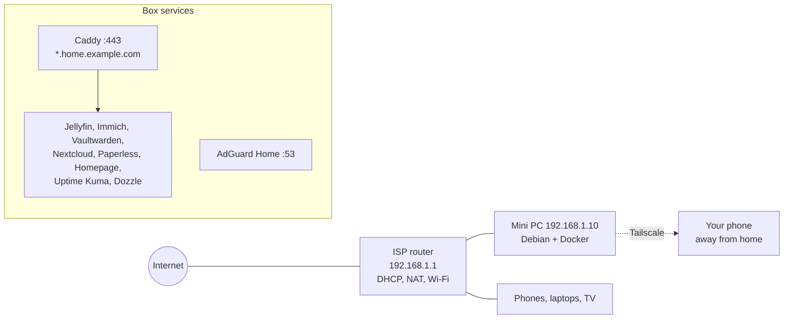

# Reference Architectures

Everything before this chapter has been a menu. This one plates three complete meals: a **Starter** lab on a single mini PC, an **Intermediate** lab that adds a hypervisor, real storage, a proper reverse proxy, SSO and a monitoring stack, and an **Advanced** lab with a dedicated router, VLANs, a NAS, a Proxmox cluster and a Kubernetes-free but fully declarative, GitOps-managed service layer. Each blueprint gives you the hardware bill of materials, the network layout, a diagram, the full Compose stacks (not snippets), the backup plan, the exposure model and an honest list of what it does *not* do. Pick the one that matches where you are, build it end to end, then take the upgrade paths at the end of each section as your needs grow.

!!! note "How to use these blueprints"
    They are opinionated on purpose. Every choice (Caddy vs Traefik, Restic vs Kopia, Pocket ID vs Authelia) has a chapter earlier in the guide explaining the alternatives; the blueprints simply pick one so that the pieces are known to fit together. Swap components once the whole thing is running, not before.

## Blueprint comparison

| | Starter | Intermediate | Advanced |
|---|---|---|---|
| **Hardware** | 1 × mini PC (N100/N305 or used USFF), 16–32 GB, 1 × NVMe + 1 × external SSD | 1 × mini PC or small tower (i5/Ryzen 5, 64 GB), 2 × NVMe (mirror) + 2–4 × HDD; 1 × Pi/thin client for the "second node" | Dedicated router box, managed PoE switch, NAS (4–8 bays), 2–3 Proxmox nodes, small UPS for each rack shelf |
| **Cost (used/new, approx.)** | €200–450 | €700–1,500 | €2,000–5,000+ |
| **Idle power** | 8–15 W | 25–45 W | 80–200 W |
| **Host OS** | Debian 12 / Ubuntu 24.04 LTS + Docker | Proxmox VE → Debian VM for Docker + LXCs | Proxmox VE cluster + TrueNAS SCALE (or Proxmox ZFS) NAS |
| **Storage** | ext4 NVMe + external SSD for backups | ZFS mirror (boot/VMs) + ZFS RAIDZ1 or MergerFS+SnapRAID (bulk) | ZFS on NAS, NFS/iSCSI to nodes, replication between pools |
| **Networking** | ISP router, flat LAN | ISP router in bridge → OPNsense VM *or* keep ISP router; two VLANs | OPNsense/VyOS bare metal, 4–6 VLANs, 2.5/10 GbE spine |
| **Reverse proxy / TLS** | Caddy, DNS-01 wildcard | Traefik, DNS-01 wildcard, split-horizon DNS | Traefik + CrowdSec bouncer; Pangolin for public apps |
| **Remote access** | Tailscale | Tailscale + Headscale option | WireGuard on OPNsense + Tailscale subnet router; Pangolin |
| **Identity** | none / app-native | Pocket ID (OIDC) + Traefik forward-auth via TinyAuth | Authentik or Kanidm, LDAP + OIDC, groups |
| **DNS** | AdGuard Home | AdGuard Home ×2 (HA), Unbound upstream | Unbound + AdGuard on two nodes, DHCP on OPNsense |
| **Monitoring** | Uptime Kuma, Dozzle | Beszel + Uptime Kuma + ntfy | Prometheus/Grafana/Loki, Alertmanager → ntfy, Uptime Kuma external |
| **Backups** | Restic → external SSD + Backblaze B2 | PBS for VMs, Restic for app data, ZFS snapshots, off-site B2 | PBS + ZFS replication to second pool + off-site (B2 / friend's NAS via Tailscale) |
| **IaC** | Compose in Git | Compose in Git + Komodo + Renovate | Ansible + OpenTofu (Proxmox provider) + Komodo/GitOps + Renovate |
| **Services** | Jellyfin, Immich, Vaultwarden, Nextcloud *or* FileBrowser, Paperless, Homepage | + Home Assistant, Forgejo, Miniflux, Audiobookshelf, *arr stack, Grafana | + Matrix/Synapse, Mailcow (optional), Ollama/Open WebUI, game servers, Frigate |

---

## Starter: one box, ten services, a weekend

### Goals

- Everything on one low-power box you can switch off without anyone noticing (until they do).
- HTTPS everywhere with real certificates and *no* open ports.
- Backups that would actually restore.
- A path to Intermediate that does not require starting over.

### Bill of materials

| Item | Suggested | Notes |
|---|---|---|
| Compute | Intel N100/N305 mini PC (Beelink, GMKtec, MINISFORUM) **or** used Lenovo M720q/M920q / HP 800 G4 Mini / Dell 7060 Micro | Intel iGPU gives Quick Sync for Jellyfin and Immich ML runs fine on CPU. 8th-gen+ Intel for used units (see [Hardware](02-hardware.md)) |
| RAM | 16 GB minimum, 32 GB comfortable | Immich + Nextcloud + Jellyfin + Paperless sit around 6–8 GB |
| Boot/app storage | 1 TB NVMe | ext4 is fine here; a single disk has no redundancy so backups are non-negotiable |
| Bulk storage | 2–4 TB USB 3 SSD or a second internal SATA SSD | Media + photos. Avoid USB **HDD** enclosures that spin down aggressively |
| Backup target | Second external SSD (kept unplugged except during backups) + Backblaze B2 | Fulfils 3-2-1 at ~€1–3/month |
| UPS | Optional small line-interactive (APC BE-series or Eaton 3S) | Protects the ext4 filesystem from power-loss corruption; NUT is overkill at this stage |

### Network layout

Keep the ISP router. Give the box a **DHCP reservation** (e.g. `192.168.1.10`) and point the router's DHCP DNS at it once AdGuard is running (or set the DNS on individual devices first while testing).



Name resolution: buy a cheap domain (e.g. `example.com`) at a registrar with an API that Caddy's DNS plugins support (Cloudflare, Porkbun, deSEC, Hetzner…). Create a **wildcard DNS rewrite** in AdGuard Home so `*.home.example.com → 192.168.1.10`. Caddy obtains a wildcard certificate via DNS-01 (see [Reverse proxy & TLS](07-reverse-proxy-tls.md)). Nothing is ever forwarded on the router; away from home you use Tailscale, which also lets you set AdGuard as the tailnet DNS so the same names work everywhere.

### Host preparation

```bash
# Debian 12 minimal install, then:
sudo apt update && sudo apt install -y curl git ufw unattended-upgrades
curl -fsSL https://get.docker.com | sudo sh
sudo usermod -aG docker "$USER"

# Firewall: only SSH (LAN), DNS, HTTP/S, and Tailscale
sudo ufw default deny incoming
sudo ufw allow from 192.168.1.0/24 to any port 22 proto tcp
sudo ufw allow 53
sudo ufw allow 80,443/tcp
sudo ufw allow in on tailscale0
sudo ufw enable

# Tailscale on the host (not in a container) so SSH survives Docker restarts
curl -fsSL https://tailscale.com/install.sh | sh
sudo tailscale up --ssh --advertise-routes=192.168.1.0/24

# Layout
sudo mkdir -p /srv/{stacks,appdata,media,photos,backups}
sudo chown -R "$USER":"$USER" /srv
```

!!! warning "Disable the host's stub resolver before AdGuard"
    On Ubuntu/Debian with `systemd-resolved`, port 53 is taken. Edit `/etc/systemd/resolved.conf` → `DNSStubListener=no`, then `ln -sf /run/systemd/resolve/resolv.conf /etc/resolv.conf` and restart `systemd-resolved`. Details in [DNS & ad blocking](09-dns-adblock.md).

### Compose stacks

Directory layout: one directory per stack under `/srv/stacks`, each with `compose.yaml` and a `.env` that is **not** committed. Commit the directory to a private Git repo (a `.gitignore` with `.env` and `*.secret`).

**`/srv/stacks/proxy/compose.yaml`** — Caddy with the Cloudflare DNS module (swap for your provider; images exist for most, or build with `xcaddy`):

```yaml
services:
  caddy:
    image: ghcr.io/caddybuilds/caddy-cloudflare:latest
    container_name: caddy
    restart: unless-stopped
    ports:
      - "80:80"
      - "443:443"
      - "443:443/udp"
    environment:
      CLOUDFLARE_API_TOKEN: ${CLOUDFLARE_API_TOKEN}
    volumes:
      - ./Caddyfile:/etc/caddy/Caddyfile:ro
      - /srv/appdata/caddy/data:/data
      - /srv/appdata/caddy/config:/config
    networks: [proxy]

networks:
  proxy:
    name: proxy
```

**`/srv/stacks/proxy/Caddyfile`**:

```caddyfile
{
    email you@example.com
}

*.home.example.com {
    tls {
        dns cloudflare {env.CLOUDFLARE_API_TOKEN}
    }

    @jellyfin  host jellyfin.home.example.com
    handle @jellyfin  { reverse_proxy jellyfin:8096 }

    @immich    host photos.home.example.com
    handle @immich    { reverse_proxy immich-server:2283 }

    @vault     host vault.home.example.com
    handle @vault     { reverse_proxy vaultwarden:80 }

    @cloud     host cloud.home.example.com
    handle @cloud     { reverse_proxy nextcloud:80 }

    @paper     host paper.home.example.com
    handle @paper     { reverse_proxy paperless:8000 }

    @home      host home.home.example.com
    handle @home      { reverse_proxy homepage:3000 }

    @status    host status.home.example.com
    handle @status    { reverse_proxy uptime-kuma:3001 }

    @logs      host logs.home.example.com
    handle @logs      { reverse_proxy dozzle:8080 }

    @dns       host dns.home.example.com
    handle @dns       { reverse_proxy adguard:80 }

    handle { respond "No such service" 404 }
}
```

Every app container joins the external `proxy` network and publishes **no ports** of its own — Caddy reaches them by container name.

**`/srv/stacks/dns/compose.yaml`** — AdGuard Home:

```yaml
services:
  adguard:
    image: adguard/adguardhome:latest
    container_name: adguard
    restart: unless-stopped
    ports:
      - "53:53/tcp"
      - "53:53/udp"
      - "3000:3000/tcp"   # first-run wizard only; remove after setup
    volumes:
      - /srv/appdata/adguard/work:/opt/adguardhome/work
      - /srv/appdata/adguard/conf:/opt/adguardhome/conf
    networks: [proxy]

networks:
  proxy:
    external: true
```

After the wizard, set the web UI to port 80 inside the container (or leave 3000 and adjust the Caddyfile), add the DNS rewrite `*.home.example.com → 192.168.1.10`, and choose upstreams (`https://dns.quad9.net/dns-query` or `tls://one.one.one.one`).
