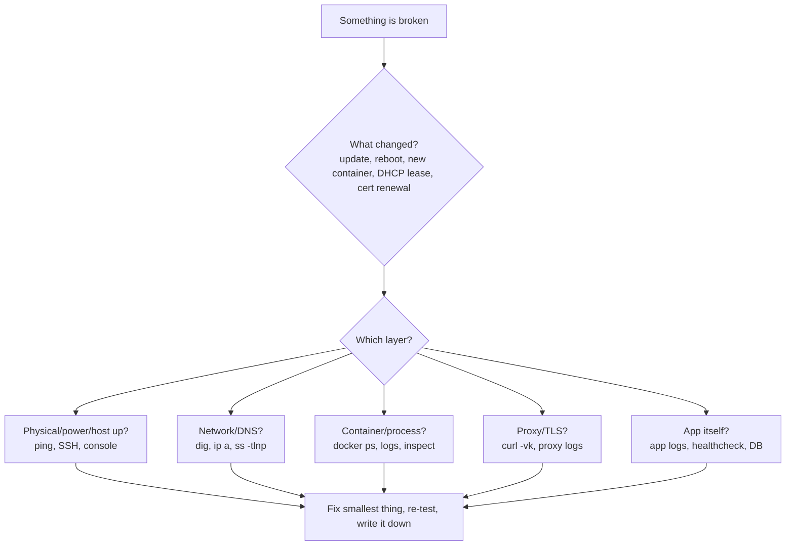

# Troubleshooting and FAQ

Most home-lab problems are one of about thirty problems wearing different costumes. This chapter is organised by *symptom*, because that is what you have at 11 p.m.: "the site says 502", "DNS stopped", "the container restarts forever". Each entry gives the fastest diagnostic, the usual causes ranked by likelihood, and the fix. The second half answers the questions that come up in every forum thread, once, with the reasoning.

## A method before the list



Ten commands that solve half of everything:

```bash
docker ps -a --format 'table {{.Names}}\t{{.Status}}\t{{.Ports}}'   # what's up, restarting, exited
docker logs --tail 200 -f <name>                                  # what it says
docker inspect <name> --format '{{json .State}}' | jq              # exit code, OOMKilled, error
docker compose -f /srv/stacks/x/compose.yaml config                # what compose *actually* resolved (env, paths)
ss -tlnp | grep -E ':(53|80|443)\b'                                # who owns the port
dig @127.0.0.1 jellyfin.home.example.com +short                    # does *my* resolver answer
curl -vk --resolve jellyfin.home.example.com:443:192.168.1.10 https://jellyfin.home.example.com/   # bypass DNS, test proxy+TLS
journalctl -u docker -b --no-pager | tail -50                      # daemon-level errors
df -h; df -i                                                       # full disk / full inodes
free -h; dmesg -T | grep -iE 'oom|killed process' | tail           # memory pressure
```

Always ask **what changed**. `docker image ls --format '{{.Repository}}:{{.Tag}} {{.CreatedSince}}'`, `last reboot`, `apt` history (`/var/log/apt/history.log`), Proxmox task log, Renovate/Watchtower notifications. Ninety percent of "it stopped working" is "something updated".

## Containers

### Container in a restart loop / `Restarting (1)`

1. `docker logs --tail 100 <name>` — the error is almost always in the last 20 lines.
2. **Permission denied on a volume** → the process runs as a UID that can't write the bind-mount. Fix: `chown -R 1000:1000 /srv/appdata/<app>` (match `PUID/PGID` or `user:`), never `chmod 777`.
3. **Bad env / missing required variable** → `docker compose config` shows the resolved value; empty means your `.env` isn't where Compose looks (it reads `.env` from the *project directory*, not the shell's cwd, unless `--env-file`).
4. **Port already allocated** → `ss -tlnp` to find the squatter (often `systemd-resolved` on 53, Apache/nginx on 80, another stack).
5. **DB not ready** → app started before Postgres. Add `depends_on` with `condition: service_healthy` and a healthcheck on the DB.
6. **OOMKilled** → `docker inspect` shows `"OOMKilled": true`. Raise `mem_limit` or fix the leak (Immich ML, Nextcloud previews, Jellyfin transcoding to RAM).
7. **Exec format error** → wrong architecture image (ARM image on x86 or vice versa). Pin `platform: linux/amd64` or pick a multi-arch tag.

### `docker compose up` says network/volume "needs to be recreated" or "already exists"

You changed a network or volume definition; Compose won't destroy something it didn't create with the same labels. For external networks, `external: true` and create once: `docker network create proxy`. For a stuck volume, `docker compose down -v` **deletes data** — only if it's a named volume you're sure about. Prefer bind-mounts for data you care about, exactly so this can't bite.

### Container can't reach another container by name

- They must share a **user-defined** network (the default `bridge` has no DNS). Check `docker network inspect proxy | jq '.[0].Containers[].Name'`.
- Compose prefixes networks with the project name; use `name: proxy` or `external: true` so all stacks refer to the same one.
- The name is the *service* or `container_name`; ports are the **container's** internal port, not the published one (`jellyfin:8096`, never `:443` or the host's `8097:8096` mapping).
- `network_mode: host` containers aren't on any Docker network; reach them via the host IP.

### Container can reach the internet but not the LAN (or vice versa)

- Docker's default bridge subnet (`172.17.0.0/16`) or a Compose network collides with your LAN/VPN (`172.16.x`, corporate VPNs love `172.x`). Set `default-address-pools` in `/etc/docker/daemon.json` to e.g. `10.200.0.0/16, size 24`, then `systemctl restart docker` and recreate networks.
- `ufw` blocking: Docker punches its own iptables holes for *published* ports but outbound to LAN can hit `ufw` forward rules; set `DEFAULT_FORWARD_POLICY="ACCEPT"` or use the `DOCKER-USER` chain properly ([Security](13-security.md)).
- Container needs to reach the *host*: use `host.docker.internal` with `extra_hosts: ["host.docker.internal:host-gateway"]`, or the bridge gateway IP.

### Published port unreachable from another machine but works on the host

- `ufw`/firewalld blocking; Docker bypasses `ufw` for *inbound* published ports normally — if you installed `ufw-docker`, rules are now needed.
- Bound to `127.0.0.1:8080:80` on purpose (good, if it's meant to be proxy-only).
- IPv6: published as `[::]:8080` but the client resolves the AAAA and your firewall treats v6 differently.
- VLAN/firewall between client and host (the router rules you wrote last week).

### Time is wrong inside the container

Containers share the host clock; a wrong *zone* is `TZ=Europe/Berlin` in env, or mount `/etc/localtime:ro`. Wrong *time* is the host: `timedatectl`, enable `systemd-timesyncd` or `chrony`. Wrong time breaks TLS, TOTP and Kerberos first.

### Disk full, but `du` doesn't show it

```bash
docker system df -v          # images, build cache, volumes, logs
journalctl --disk-usage
du -sh /var/lib/docker/containers/*/*-json.log | sort -h | tail   # unrotated container logs
```

Fixes: set log rotation in `daemon.json` (`"log-driver":"json-file","log-opts":{"max-size":"10m","max-file":"3"}`), `docker image prune -a` (careful: it removes images for stopped containers too), `journalctl --vacuum-size=500M`, find the runaway app (Frigate recordings, Immich thumbnails, Nextcloud trash/versions, download clients). Inode exhaustion (`df -i`) is typically millions of tiny files in a cache dir.

### GPU / hardware transcoding not working

- `ls -l /dev/dri` on the host; the container needs `devices: [/dev/dri:/dev/dri]` **and** group access (`group_add: ["render"]` or the numeric GID from `getent group render`).
- Inside a Proxmox **LXC**: map the device with `dev0: /dev/dri/renderD128,gid=104` (or the legacy `lxc.cgroup2.devices.allow` + `lxc.mount.entry`). Inside a **VM**: you need full iGPU passthrough (no sharing) or SR-IOV on 12th-gen+ with the `i915-sriov-dkms` module.
- Intel: install `intel-media-va-driver-non-free` on the host for HEVC/AV1 on newer chips; check with `vainfo`.
- NVIDIA: `nvidia-container-toolkit` on the host, `runtime: nvidia` or `deploy.resources.reservations.devices`, `nvidia-smi` inside the container. Driver version mismatch after a host update is the number-one breakage.
- Jellyfin: Dashboard → Playback → confirm the codecs you ticked are actually supported (`/usr/lib/jellyfin-ffmpeg/vainfo`).

## DNS

### Nothing resolves on the whole network

The single most user-visible failure. In order:

1. Is the DNS box up and is the container running? `dig @192.168.1.10 example.com`.
2. Port 53 stolen by `systemd-resolved` after a reboot/upgrade (`ss -ulnp | grep :53`). Disable the stub listener ([DNS & ad blocking](09-dns-adblock.md)).
3. Upstream unreachable: AdGuard/Pi-hole returns SERVFAIL. Test upstream directly: `dig @1.1.1.1 example.com`. If Unbound is the upstream, check it (`unbound-control status`, its own port 5335/5353).
4. Router still handing out the old DHCP DNS; clients cached it. `ipconfig /flushdns`, `resolvectl flush-caches`.
5. **Prevention**: two resolvers on two devices (Pi + main box), both in DHCP. A Pi-hole/AdGuard pair costs €50 and buys spousal approval.

### Local names (`*.home.example.com`) work on LAN but not on VPN / vice versa

- Tailscale: set the tailnet DNS to your AdGuard IP (MagicDNS "override local DNS"), or add a **split DNS** entry for `home.example.com` → 192.168.1.10. Subnet routes must be advertised **and approved** in the admin console.
- WireGuard: `DNS = 192.168.1.10` in the client config and `AllowedIPs` covering the LAN.
- The resolver rewrite (`*.home.example.com → 192.168.1.10`) only exists on your resolver; anything not using it gets NXDOMAIN or the public IP. Public DNS having no record for the internal names is *correct*.
- Android "Private DNS" (DoT) set to a public provider silently bypasses your resolver; set it to off/automatic or point it at your own DoT endpoint.

### Ad blocking works, but some devices ignore it

Hard-coded DNS (Chromecast, Roku, some smart TVs use `8.8.8.8`), DoH in the browser (Firefox/Chrome "secure DNS"), IPv6 router advertisements handing out the ISP's resolver. Fixes: firewall rule redirecting all LAN port 53 to your resolver (NAT redirect) and blocking outbound 853; disable browser DoH via the canary domain `use-application-dns.net` (AdGuard/Pi-hole do this automatically); set RDNSS in the router or turn off IPv6 DNS advertisement.

### `dig` works, browser doesn't

Browser DoH (above), HSTS cache (you once visited the public name over HTTPS with a different cert), or the browser resolves via a different interface (VPN split tunnel). `chrome://net-internals/#dns` → clear host cache; `about:networking#dns` in Firefox.

## Reverse proxy and TLS

### 502 Bad Gateway

The proxy is fine; it can't reach the backend.

- Backend container down → `docker ps`.
- Wrong internal port (see above); wrong scheme (backend speaks HTTPS: Proxmox `:8006`, Unifi `:8443`, Portainer `:9443` → `reverse_proxy https://…` with `tls_insecure_skip_verify`/`serversTransport.insecureSkipVerify`).
- Not on the same Docker network as the proxy → Traefik logs `no such host`; Caddy logs `dial tcp: lookup jellyfin`.
- Traefik with multiple networks on the container: set `traefik.docker.network=proxy` (or the global `providers.docker.network`), otherwise it picks the wrong IP.
- Backend binds to `127.0.0.1` inside the container (some apps default to localhost; set `HOST=0.0.0.0` or the app's equivalent).

### 404 from the proxy itself

Traefik: no router matched — label typo, missing `traefik.enable=true` with `exposedByDefault=false`, or rule syntax (`Host(\`x\`)` needs backticks). Check the dashboard. Caddy: no matching site block; `caddy validate` and look for the catch-all handler.

### Certificate errors

| Symptom | Cause | Fix |
|---|---|---|
| "TRAEFIK DEFAULT CERT" / self-signed | ACME failed; proxy fell back | Read the proxy log for the ACME error; below |
| DNS-01 fails: "propagation" or `NXDOMAIN _acme-challenge` | API token lacks zone-edit permission; wrong zone; provider's DNS is slow | Traefik: `delayBeforeCheck` and `resolvers=1.1.1.1:53`; Caddy: `propagation_timeout`; verify token scopes |
| DNS-01 fails with split-horizon | Your local resolver answers for `example.com` and knows nothing about `_acme-challenge` | Make the ACME client use public resolvers (above) or don't override the whole zone — rewrite only `*.home.example.com` |
| HTTP-01 fails | Port 80 not reachable from the internet (CGNAT, no forward, ISP blocks 80) | Use DNS-01 |
| Rate limited | Recreated the stack too many times; 5 duplicate certs/week per exact name set | Wait a week, or use the staging CA while debugging; **persist `acme.json`/Caddy's `/data`** |
| Works in browser, fails in an app (Bitwarden mobile, Immich app, Home Assistant companion) | App doesn't like the Let's Encrypt chain? Rare now. Usually the app is hitting the *public* name from mobile data where the name doesn't resolve | Check the hostname you configured in the app, and that the name resolves where the phone is |
| `NET::ERR_CERT_COMMON_NAME_INVALID` on `sub.sub.home.example.com` | Wildcard covers only **one** level | Flatten names or add a second SAN `*.sub.home.example.com` |
| Cert renewed but clients still see the old one | Proxy needs a reload (Traefik/Caddy do it automatically; nginx does not) | `nginx -s reload`, or NPM restart |

### Redirect loop / "too many redirects"

Backend thinks it's on HTTP and redirects to HTTPS while the proxy terminated TLS already. Tell the app it is behind a proxy: Nextcloud `OVERWRITEPROTOCOL=https` + `trusted_proxies`; WordPress `$_SERVER['HTTPS']='on'`; Django `SECURE_PROXY_SSL_HEADER`; Grafana `GF_SERVER_ROOT_URL`. Make sure the proxy passes `X-Forwarded-Proto` (Traefik/Caddy do by default).

### WebSockets don't work (live logs, Home Assistant, Jellyfin dashboard, Vaultwarden notifications)

Caddy and Traefik pass WebSockets automatically. nginx/NPM need `proxy_http_version 1.1; proxy_set_header Upgrade $http_upgrade; proxy_set_header Connection "upgrade";` (NPM: the "Websockets Support" toggle). Cloudflare proxied: fine; Cloudflare Tunnel: fine; some corporate proxies: not fine.

### Uploads fail at exactly 100 MB / 1 MB

Body size limits: Cloudflare free (100 MB), NPM/nginx `client_max_body_size` (default 1 MB!), Traefik has none by default, Caddy `request_body max_size`. Then the app's own limit (Nextcloud `PHP_UPLOAD_LIMIT`, Immich none, Paperless none).

### Real client IPs show as the proxy's IP

Pass `X-Forwarded-For`/`X-Real-IP` and tell the app to trust the proxy's subnet (Nextcloud `TRUSTED_PROXIES`, Vaultwarden `IP_HEADER`, Immich reads `X-Forwarded-For` automatically, Authelia/Authentik need it for geo rules). Behind Cloudflare, trust Cloudflare's IP ranges and use `CF-Connecting-IP`. CrowdSec decisions on the wrong IP = you banned your own proxy; check this first when *everything* is suddenly 403.
