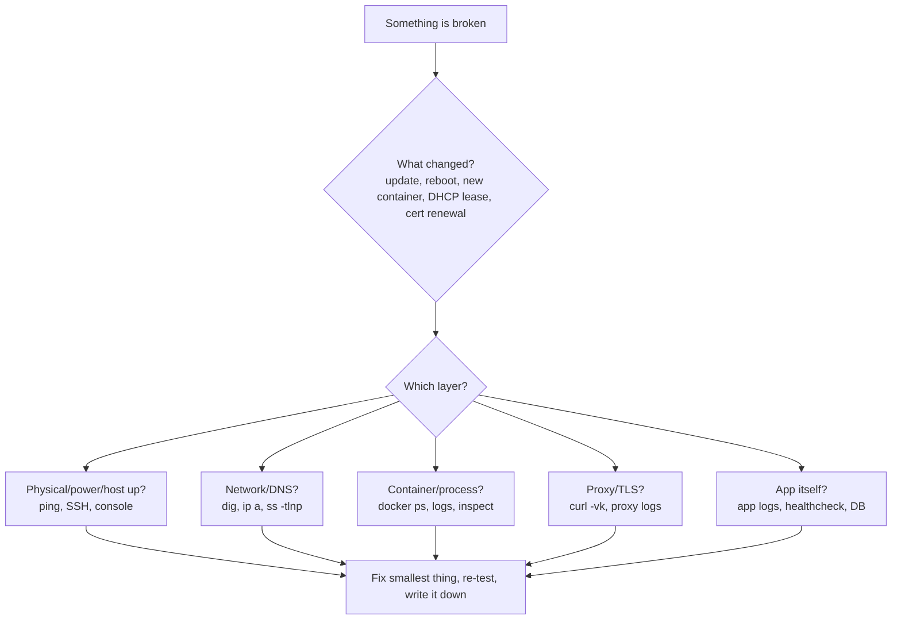

# Troubleshooting and FAQ

Most home-lab problems are one of about thirty problems wearing different costumes. This chapter is organised by *symptom*, because that is what you have at 11 p.m.: "the site says 502", "DNS stopped", "the container restarts forever". Each entry gives the fastest diagnostic, the usual causes ranked by likelihood, and the fix. The second half answers the questions that come up in every forum thread, once, with the reasoning.

## A method before the list



Ten commands that solve half of everything:

```bash
docker ps -a --format 'table {{.Names}}\t{{.Status}}\t{{.Ports}}'   # what's up, restarting, exited
docker logs --tail 200 -f <name>                                  # what it says
docker inspect <name> --format '{{json .State}}' | jq              # exit code, OOMKilled, error
docker compose -f /srv/stacks/x/compose.yaml config                # what compose *actually* resolved (env, paths)
ss -tlnp | grep -E ':(53|80|443)\b'                                # who owns the port
dig @127.0.0.1 jellyfin.home.example.com +short                    # does *my* resolver answer
curl -vk --resolve jellyfin.home.example.com:443:192.168.1.10 https://jellyfin.home.example.com/   # bypass DNS, test proxy+TLS
journalctl -u docker -b --no-pager | tail -50                      # daemon-level errors
df -h; df -i                                                       # full disk / full inodes
free -h; dmesg -T | grep -iE 'oom|killed process' | tail           # memory pressure
```

Always ask **what changed**. `docker image ls --format '{{.Repository}}:{{.Tag}} {{.CreatedSince}}'`, `last reboot`, `apt` history (`/var/log/apt/history.log`), Proxmox task log, Renovate/Watchtower notifications. Ninety percent of "it stopped working" is "something updated".

## Containers

### Container in a restart loop / `Restarting (1)`

1. `docker logs --tail 100 <name>` — the error is almost always in the last 20 lines.
2. **Permission denied on a volume** → the process runs as a UID that can't write the bind-mount. Fix: `chown -R 1000:1000 /srv/appdata/<app>` (match `PUID/PGID` or `user:`), never `chmod 777`.
3. **Bad env / missing required variable** → `docker compose config` shows the resolved value; empty means your `.env` isn't where Compose looks (it reads `.env` from the *project directory*, not the shell's cwd, unless `--env-file`).
4. **Port already allocated** → `ss -tlnp` to find the squatter (often `systemd-resolved` on 53, Apache/nginx on 80, another stack).
5. **DB not ready** → app started before Postgres. Add `depends_on` with `condition: service_healthy` and a healthcheck on the DB.
6. **OOMKilled** → `docker inspect` shows `"OOMKilled": true`. Raise `mem_limit` or fix the leak (Immich ML, Nextcloud previews, Jellyfin transcoding to RAM).
7. **Exec format error** → wrong architecture image (ARM image on x86 or vice versa). Pin `platform: linux/amd64` or pick a multi-arch tag.

### `docker compose up` says network/volume "needs to be recreated" or "already exists"

You changed a network or volume definition; Compose won't destroy something it didn't create with the same labels. For external networks, `external: true` and create once: `docker network create proxy`. For a stuck volume, `docker compose down -v` **deletes data** — only if it's a named volume you're sure about. Prefer bind-mounts for data you care about, exactly so this can't bite.

### Container can't reach another container by name

- They must share a **user-defined** network (the default `bridge` has no DNS). Check `docker network inspect proxy | jq '.[0].Containers[].Name'`.
- Compose prefixes networks with the project name; use `name: proxy` or `external: true` so all stacks refer to the same one.
- The name is the *service* or `container_name`; ports are the **container's** internal port, not the published one (`jellyfin:8096`, never `:443` or the host's `8097:8096` mapping).
- `network_mode: host` containers aren't on any Docker network; reach them via the host IP.

### Container can reach the internet but not the LAN (or vice versa)

- Docker's default bridge subnet (`172.17.0.0/16`) or a Compose network collides with your LAN/VPN (`172.16.x`, corporate VPNs love `172.x`). Set `default-address-pools` in `/etc/docker/daemon.json` to e.g. `10.200.0.0/16, size 24`, then `systemctl restart docker` and recreate networks.
- `ufw` blocking: Docker punches its own iptables holes for *published* ports but outbound to LAN can hit `ufw` forward rules; set `DEFAULT_FORWARD_POLICY="ACCEPT"` or use the `DOCKER-USER` chain properly ([Security](13-security.md)).
- Container needs to reach the *host*: use `host.docker.internal` with `extra_hosts: ["host.docker.internal:host-gateway"]`, or the bridge gateway IP.

### Published port unreachable from another machine but works on the host

- `ufw`/firewalld blocking; Docker bypasses `ufw` for *inbound* published ports normally — if you installed `ufw-docker`, rules are now needed.
- Bound to `127.0.0.1:8080:80` on purpose (good, if it's meant to be proxy-only).
- IPv6: published as `[::]:8080` but the client resolves the AAAA and your firewall treats v6 differently.
- VLAN/firewall between client and host (the router rules you wrote last week).

### Time is wrong inside the container

Containers share the host clock; a wrong *zone* is `TZ=Europe/Berlin` in env, or mount `/etc/localtime:ro`. Wrong *time* is the host: `timedatectl`, enable `systemd-timesyncd` or `chrony`. Wrong time breaks TLS, TOTP and Kerberos first.

### Disk full, but `du` doesn't show it

```bash
docker system df -v          # images, build cache, volumes, logs
journalctl --disk-usage
du -sh /var/lib/docker/containers/*/*-json.log | sort -h | tail   # unrotated container logs
```

Fixes: set log rotation in `daemon.json` (`"log-driver":"json-file","log-opts":{"max-size":"10m","max-file":"3"}`), `docker image prune -a` (careful: it removes images for stopped containers too), `journalctl --vacuum-size=500M`, find the runaway app (Frigate recordings, Immich thumbnails, Nextcloud trash/versions, download clients). Inode exhaustion (`df -i`) is typically millions of tiny files in a cache dir.

### GPU / hardware transcoding not working

- `ls -l /dev/dri` on the host; the container needs `devices: [/dev/dri:/dev/dri]` **and** group access (`group_add: ["render"]` or the numeric GID from `getent group render`).
- Inside a Proxmox **LXC**: map the device with `dev0: /dev/dri/renderD128,gid=104` (or the legacy `lxc.cgroup2.devices.allow` + `lxc.mount.entry`). Inside a **VM**: you need full iGPU passthrough (no sharing) or SR-IOV on 12th-gen+ with the `i915-sriov-dkms` module.
- Intel: install `intel-media-va-driver-non-free` on the host for HEVC/AV1 on newer chips; check with `vainfo`.
- NVIDIA: `nvidia-container-toolkit` on the host, `runtime: nvidia` or `deploy.resources.reservations.devices`, `nvidia-smi` inside the container. Driver version mismatch after a host update is the number-one breakage.
- Jellyfin: Dashboard → Playback → confirm the codecs you ticked are actually supported (`/usr/lib/jellyfin-ffmpeg/vainfo`).

## DNS

### Nothing resolves on the whole network

The single most user-visible failure. In order:

1. Is the DNS box up and is the container running? `dig @192.168.1.10 example.com`.
2. Port 53 stolen by `systemd-resolved` after a reboot/upgrade (`ss -ulnp | grep :53`). Disable the stub listener ([DNS & ad blocking](09-dns-adblock.md)).
3. Upstream unreachable: AdGuard/Pi-hole returns SERVFAIL. Test upstream directly: `dig @1.1.1.1 example.com`. If Unbound is the upstream, check it (`unbound-control status`, its own port 5335/5353).
4. Router still handing out the old DHCP DNS; clients cached it. `ipconfig /flushdns`, `resolvectl flush-caches`.
5. **Prevention**: two resolvers on two devices (Pi + main box), both in DHCP. A Pi-hole/AdGuard pair costs €50 and buys spousal approval.

### Local names (`*.home.example.com`) work on LAN but not on VPN / vice versa

- Tailscale: set the tailnet DNS to your AdGuard IP (MagicDNS "override local DNS"), or add a **split DNS** entry for `home.example.com` → 192.168.1.10. Subnet routes must be advertised **and approved** in the admin console.
- WireGuard: `DNS = 192.168.1.10` in the client config and `AllowedIPs` covering the LAN.
- The resolver rewrite (`*.home.example.com → 192.168.1.10`) only exists on your resolver; anything not using it gets NXDOMAIN or the public IP. Public DNS having no record for the internal names is *correct*.
- Android "Private DNS" (DoT) set to a public provider silently bypasses your resolver; set it to off/automatic or point it at your own DoT endpoint.

### Ad blocking works, but some devices ignore it

Hard-coded DNS (Chromecast, Roku, some smart TVs use `8.8.8.8`), DoH in the browser (Firefox/Chrome "secure DNS"), IPv6 router advertisements handing out the ISP's resolver. Fixes: firewall rule redirecting all LAN port 53 to your resolver (NAT redirect) and blocking outbound 853; disable browser DoH via the canary domain `use-application-dns.net` (AdGuard/Pi-hole do this automatically); set RDNSS in the router or turn off IPv6 DNS advertisement.

### `dig` works, browser doesn't

Browser DoH (above), HSTS cache (you once visited the public name over HTTPS with a different cert), or the browser resolves via a different interface (VPN split tunnel). `chrome://net-internals/#dns` → clear host cache; `about:networking#dns` in Firefox.

## Reverse proxy and TLS

### 502 Bad Gateway

The proxy is fine; it can't reach the backend.

- Backend container down → `docker ps`.
- Wrong internal port (see above); wrong scheme (backend speaks HTTPS: Proxmox `:8006`, Unifi `:8443`, Portainer `:9443` → `reverse_proxy https://…` with `tls_insecure_skip_verify`/`serversTransport.insecureSkipVerify`).
- Not on the same Docker network as the proxy → Traefik logs `no such host`; Caddy logs `dial tcp: lookup jellyfin`.
- Traefik with multiple networks on the container: set `traefik.docker.network=proxy` (or the global `providers.docker.network`), otherwise it picks the wrong IP.
- Backend binds to `127.0.0.1` inside the container (some apps default to localhost; set `HOST=0.0.0.0` or the app's equivalent).

### 404 from the proxy itself

Traefik: no router matched — label typo, missing `traefik.enable=true` with `exposedByDefault=false`, or rule syntax (`Host(\`x\`)` needs backticks). Check the dashboard. Caddy: no matching site block; `caddy validate` and look for the catch-all handler.

### Certificate errors

| Symptom | Cause | Fix |
|---|---|---|
| "TRAEFIK DEFAULT CERT" / self-signed | ACME failed; proxy fell back | Read the proxy log for the ACME error; below |
| DNS-01 fails: "propagation" or `NXDOMAIN _acme-challenge` | API token lacks zone-edit permission; wrong zone; provider's DNS is slow | Traefik: `delayBeforeCheck` and `resolvers=1.1.1.1:53`; Caddy: `propagation_timeout`; verify token scopes |
| DNS-01 fails with split-horizon | Your local resolver answers for `example.com` and knows nothing about `_acme-challenge` | Make the ACME client use public resolvers (above) or don't override the whole zone — rewrite only `*.home.example.com` |
| HTTP-01 fails | Port 80 not reachable from the internet (CGNAT, no forward, ISP blocks 80) | Use DNS-01 |
| Rate limited | Recreated the stack too many times; 5 duplicate certs/week per exact name set | Wait a week, or use the staging CA while debugging; **persist `acme.json`/Caddy's `/data`** |
| Works in browser, fails in an app (Bitwarden mobile, Immich app, Home Assistant companion) | App doesn't like the Let's Encrypt chain? Rare now. Usually the app is hitting the *public* name from mobile data where the name doesn't resolve | Check the hostname you configured in the app, and that the name resolves where the phone is |
| `NET::ERR_CERT_COMMON_NAME_INVALID` on `sub.sub.home.example.com` | Wildcard covers only **one** level | Flatten names or add a second SAN `*.sub.home.example.com` |
| Cert renewed but clients still see the old one | Proxy needs a reload (Traefik/Caddy do it automatically; nginx does not) | `nginx -s reload`, or NPM restart |

### Redirect loop / "too many redirects"

Backend thinks it's on HTTP and redirects to HTTPS while the proxy terminated TLS already. Tell the app it is behind a proxy: Nextcloud `OVERWRITEPROTOCOL=https` + `trusted_proxies`; WordPress `$_SERVER['HTTPS']='on'`; Django `SECURE_PROXY_SSL_HEADER`; Grafana `GF_SERVER_ROOT_URL`. Make sure the proxy passes `X-Forwarded-Proto` (Traefik/Caddy do by default).

### WebSockets don't work (live logs, Home Assistant, Jellyfin dashboard, Vaultwarden notifications)

Caddy and Traefik pass WebSockets automatically. nginx/NPM need `proxy_http_version 1.1; proxy_set_header Upgrade $http_upgrade; proxy_set_header Connection "upgrade";` (NPM: the "Websockets Support" toggle). Cloudflare proxied: fine; Cloudflare Tunnel: fine; some corporate proxies: not fine.

### Uploads fail at exactly 100 MB / 1 MB

Body size limits: Cloudflare free (100 MB), NPM/nginx `client_max_body_size` (default 1 MB!), Traefik has none by default, Caddy `request_body max_size`. Then the app's own limit (Nextcloud `PHP_UPLOAD_LIMIT`, Immich none, Paperless none).

### Real client IPs show as the proxy's IP

Pass `X-Forwarded-For`/`X-Real-IP` and tell the app to trust the proxy's subnet (Nextcloud `TRUSTED_PROXIES`, Vaultwarden `IP_HEADER`, Immich reads `X-Forwarded-For` automatically, Authelia/Authentik need it for geo rules). Behind Cloudflare, trust Cloudflare's IP ranges and use `CF-Connecting-IP`. CrowdSec decisions on the wrong IP = you banned your own proxy; check this first when *everything* is suddenly 403.

## Remote access and VPN

### Tailscale connects but can't reach LAN devices

Subnet router: `tailscale up --advertise-routes=192.168.1.0/24` **and** approve the route in the admin console (or use autoApprovers in the ACL). On Linux routers, enable forwarding (`net.ipv4.ip_forward=1`, `net.ipv6.conf.all.forwarding=1`). Clients on Linux need `--accept-routes`. If it's a Docker container acting as subnet router, it needs `network_mode: host` or `cap_add: NET_ADMIN` + `/dev/net/tun`.

### Tailscale is slow / shows "relayed" (DERP)

Direct connection failed; both sides behind hard NAT (CGNAT, symmetric NAT, some 5G). Fix one end: forward UDP 41641 to the home node, or enable UPnP/NAT-PMP on the router, or run your own DERP. `tailscale netcheck` and `tailscale ping <peer>` show what's happening. IPv6 on both ends usually fixes it.

### WireGuard handshake never completes

99 % one of: wrong public key pasted (each side needs the *other's* public key), `Endpoint` unreachable (CGNAT, port not forwarded, DDNS stale), clock skew > a few minutes, `AllowedIPs` on the server missing the client's tunnel IP. `wg show` on the server: if `latest handshake` never appears, packets aren't arriving — `tcpdump -ni any udp port 51820`. MTU issues (`MTU = 1280` fixes many mobile-network problems) show as "handshake fine, traffic dies".

### I'm behind CGNAT

Check: the router's WAN IP is in `100.64.0.0/10` or differs from `curl ifconfig.me`. Options: ask the ISP for a public IPv4 (often free or a couple of euros), use IPv6 if you have it, Tailscale/NetBird (no inbound needed), Pangolin/Cloudflare Tunnel on a VPS for public services. Port forwarding will *never* work; stop trying.

### Cloudflare Tunnel: 502/`error code 1033`/"origin unreachable"

`cloudflared` can't reach the service URL you configured — it's the same as a proxy 502: use the Docker service name and *internal* port if `cloudflared` is in the same network; `http://localhost` only works with `network_mode: host`. For HTTPS origins with self-signed certs, enable "No TLS Verify" in the tunnel's TLS settings.

## Storage

### ZFS pool DEGRADED / a disk shows FAULTED

`zpool status -v`. If a disk is `FAULTED` with read/write/cksum errors, check SMART (`smartctl -a /dev/sdX`), cables first (SATA cables cause more "disk failures" than disks). Replace: `zpool replace tank <old> <new>`; watch `zpool status` for resilver. Checksum errors with a healthy disk → RAM (run memtest), controller, or cable. **Do not** `zpool clear` and forget; note the disk. Scrub after resilver.

### ZFS: "cannot import pool: pool was previously in use from another system"

`zpool import -f tank`. After a hostname change or moving disks between machines this is normal.

### ZFS/Proxmox: RAM "full"

ARC. `arc_summary` or `cat /proc/spl/kstat/zfs/arcstats | grep -E '^(size|c_max)'`. Cap it in `/etc/modprobe.d/zfs.conf`: `options zfs zfs_arc_max=8589934592` (8 GiB) then `update-initramfs -u` and reboot. Used-by-ARC memory is released under pressure, but VMs' balloon drivers and OOM heuristics don't always wait.

### SMB share slow / NFS hangs

- SMB: check `smb.conf` for `server multi channel support = yes` on 2.5/10 GbE; disable `strict sync` for media; macOS needs `vfs objects = fruit streams_xattr`; Windows Explorer thumbnails hammer the share (`veto files` for `Thumbs.db`).
- NFS "hang": server went away with `hard` mounts (correct behaviour — it waits). `umount -f -l`; use `soft,timeo=…` only for non-critical mounts, or systemd automount so a dead NAS doesn't wedge boot (`x-systemd.automount,_netdev,nofail`).
- Permissions: NFSv4 with `all_squash,anonuid=1000,anongid=1000` for a home lab, or map UIDs consistently across hosts.

### Docker on ZFS: many datasets / slow `docker pull`

Docker's `zfs` storage driver creates a dataset per layer. Use `overlay2` on a plain dataset instead: put `/var/lib/docker` on a ZFS dataset and set `"storage-driver": "overlay2"` in `daemon.json` (works on ZFS 2.2+ with overlayfs support). In an LXC on Proxmox the same applies; keyctl/nesting features must be enabled.

### Btrfs: "No space left on device" with free space showing

Metadata exhausted or unbalanced chunks. `btrfs filesystem usage /`; `btrfs balance start -dusage=50 /`. Enable the periodic balance via `btrfsmaintenance`.

### Disk is CMR or SMR?

`smartctl -a /dev/sdX | grep -i 'rotation\|TRIM'` — SMR drives often report `TRIM Command: Available`. Better: check the manufacturer's model list (WD Red *non-Plus* 2–6 TB and many 2.5" drives are SMR). SMR in a ZFS resilver = days, or a failed resilver.

## Proxmox

### VM won't start: "TASK ERROR: ... kvm: -device vfio-pci ... " (passthrough)

IOMMU not enabled (`intel_iommu=on iommu=pt` / `amd_iommu=on` in GRUB or systemd-boot cmdline, then `update-grub`/`proxmox-boot-tool refresh`), device still bound to the host driver (blacklist `i915`/`nouveau`/`amdgpu`, or `vfio-pci.ids=`), or the device isn't in its own IOMMU group (`pvesh get /nodes/<node>/hardware/pci --pci-class-blacklist ""` shows groups; ACS override is a last resort).

### LXC: can't run Docker / permission errors on bind mounts

Unprivileged LXC needs `features: nesting=1,keyctl=1`. Bind-mount ownership: UIDs are shifted by 100000 in unprivileged containers — either `chown 101000:101000` on the host or add an idmap in the CT config. Running Docker in LXC is unsupported by Proxmox (works, but a Docker VM is the recommendation).

### Cluster: node shows with a red X / "no quorum"

Two-node cluster with one down = no quorum by design. Add a **QDevice** (`pvecm qdevice setup <ip>` with `corosync-qnetd` on a Pi) or temporarily `pvecm expected 1` to operate. Corosync wants low latency; don't run it over Wi-Fi or a saturated link — a busy backup on the same NIC as corosync is a classic cause of flapping nodes.

### Backups slow / PBS "chunk verification failed"

Slow: PBS datastore on HDD without a special device — add a small SSD mirror as ZFS `special` vdev, or enable `dirty-bitmap` (default for running VMs; a shutdown resets it). Verification failures: bad disk or RAM on the PBS host; re-run verify, check SMART, scrub the pool.

### Web UI unreachable after network change

`/etc/network/interfaces` typo — you still have the console. `ifreload -a` after fixing. Also `/etc/hosts` must resolve the node name to the *cluster* IP or pve services misbehave.

## Applications

### Nextcloud: slow, "maintenance mode", or "untrusted domain"

- Untrusted domain: `occ config:system:set trusted_domains 1 --value=cloud.home.example.com`.
- Maintenance mode stuck: `occ maintenance:mode --off`; after upgrades run `occ upgrade`, `occ db:add-missing-indices`, `occ maintenance:repair --include-expensive`.
- Slow: no Redis (`memcache.local` = APCu, `memcache.locking` = Redis), cron via `nextcloud-cron` container instead of AJAX, PHP `memory_limit` ≥ 512 M, `opcache.interned_strings_buffer=16`, HTTP/2 on the proxy, and previews pre-generated (`preview:pre-generate`). Nextcloud AIO handles most of this for you.
- Desktop client "connection closed": body size limit on the proxy, or Cloudflare's 100 MB.

### Immich: app can't upload / "server offline" / ML never finishes

- Mobile: the server URL must be reachable from *mobile data* (so Tailscale on the phone, or public exposure). Background upload on iOS is limited by the OS; keep the app open for the first big import.
- After an update, migration errors: check release notes; pin `IMMICH_VERSION`; **never** run `:latest` for the DB image; the Postgres image must match the pgvecto.rs/VectorChord version Immich expects.
- ML jobs at 0 %: the `immich-machine-learning` container is OOM-killed or can't download models (no internet, or set `MACHINE_LEARNING_*` cache mount). Smart search re-indexing after changing the CLIP model takes hours — normal.

### Jellyfin: buffering, "playback error", or transcoding when it shouldn't

- Direct play requires the client to support the codec **and** container **and** subtitle format; burnt-in PGS/ASS subtitles force transcoding. Use SRT subs or a client that supports the format (Jellyfin Media Player, Infuse, Kodi).
- Bitrate limit in the client set low (defaults to 20 Mbps on some).
- Transcode dir on a slow/full disk; move to `tmpfs` or SSD.
- HW transcoding not actually active → Dashboard → Active devices shows "(hw)" only if it worked; see the GPU section.

### Vaultwarden: clients won't log in / "Failed to fetch"

The `DOMAIN` env must match exactly the URL the client uses (including https). WebSocket notifications need the proxy to pass `/notifications/hub`. If the browser extension works and the mobile app doesn't, the certificate chain or name resolution from mobile data is the issue. Backups: `db.sqlite3` **plus** `attachments/`, `sends/`, `rsa_key*`.

### Home Assistant: "400 Bad Request" behind a proxy

Add to `configuration.yaml`:

```yaml
http:
  use_x_forwarded_for: true
  trusted_proxies:
    - 172.16.0.0/12     # or your proxy's subnet / Docker network
```

Companion app "unable to connect": internal URL vs external URL; set both in the app, and make sure the internal SSID list is right.

### Paperless-ngx: consumption folder ignores files

`PAPERLESS_CONSUMER_POLLING=30` when the folder is a network mount (inotify doesn't work over NFS/SMB). Permission: the consumer runs as `USERMAP_UID`. Duplicate detection silently skips identical files (check "Duplicates" in logs).

### Authelia/Authentik/Pocket ID: redirect loop or "invalid redirect_uri"

Redirect URI in the IdP must match **exactly** what the app sends (scheme, host, path, trailing slash). Clock skew between IdP and app (> 30 s) breaks token validation. Cookie domain: forward-auth needs the IdP and the apps under the same parent domain (`home.example.com`) or a session domain setting. `TRUST_PROXY` / `X-Forwarded-*` headers must reach the IdP or it generates `http://` URLs.

## Hardware and host

### Random reboots / freezes

RAM (memtest86+ overnight), PSU (undersized after adding disks/GPU), C-states on some Intel boards (add `intel_idle.max_cstate=1` or disable C6 in BIOS — common on N100 boxes and older Atoms), thermal (check `sensors`, dust), a USB device (external HDD enclosures with flaky power), or kernel + driver issue (Realtek 2.5 GbE `r8169`/`r8125` — install the `r8125-dkms` driver).

### High idle power

BIOS: enable ASPM, C-states, disable unused controllers; Linux: `powertop --auto-tune` then make the tunables permanent; avoid HBA/RAID cards and 10 GbE copper NICs that block package C-states (`powertop` shows the deepest reached state). Spin down idle HDDs (`hdparm -S` or `hd-idle`) *only* on media pools, never on ZFS pools with periodic writes.

### USB drive disappears / renames from `sda` to `sdb`

Never mount by `/dev/sdX`; use `/dev/disk/by-uuid/` or `by-id/` in `fstab` with `nofail`. Enclosure power management: `usbcore.autosuspend=-1` on the kernel cmdline; UAS quirks for some chipsets (`usb-storage.quirks=VID:PID:u`).

### Boot hangs on a missing network mount / "A start job is running for …"

Add `nofail,x-systemd.automount,_netdev` to network mounts; `nofail` on any disk that isn't the root.

### SMART says the drive is fine, but…

SMART "PASSED" is a low bar. Watch attributes 5 (Reallocated), 187 (Reported Uncorrectable), 188 (Command Timeout), 197 (Pending), 198 (Offline Uncorrectable). Any non-zero *and rising* 197/198 means replace. Run `smartd` with email/ntfy notifications and a monthly long test ([Maintenance](28-maintenance-operations.md)).

---

## FAQ

**Do I need a domain name?**
For local-only with self-signed certs, no. For trusted TLS certificates via Let's Encrypt (which also makes phones and apps happy), yes — around €5–15/year. A domain on a registrar with an API (Cloudflare, Porkbun, deSEC, Hetzner) enables DNS-01 wildcard certificates with zero open ports. `.home.arpa` and `.internal` are the correct choices for purely private names *without* public certificates.

**Should I use `.local`?**
No. `.local` is reserved for mDNS and resolvers treat it specially; you'll chase odd resolution failures. Use `home.arpa`, `internal`, or a subdomain of a real domain.

**Is it safe to expose services to the internet?**
Safe enough if you: keep only a proxy on 443 (or use a tunnel), put an IdP/SSO or at least 2FA in front of anything that isn't designed to be public, run CrowdSec/fail2ban, update promptly, and don't expose management UIs (Proxmox, routers, Portainer, Docker socket) ever. Safer still: don't expose at all and use Tailscale/WireGuard. Only expose what *needs* to be reachable by people who can't run a VPN ([Remote access](08-remote-access-vpn.md), [Security](13-security.md)).

**Is port forwarding "insecure"?**
Forwarding 443 to a well-maintained reverse proxy is fine — it's what every website does. What's insecure is forwarding *many* ports to *many* apps, each with its own auth and patch cadence, or forwarding SSH/RDP/admin ports.

**Cloudflare Tunnel vs Tailscale vs Pangolin vs WireGuard?**
Tailscale/WireGuard for *you and your family* (no public exposure); Pangolin or Cloudflare Tunnel for *the public* (grandma clicks a link). Cloudflare Tunnel: easiest, free, but Cloudflare decrypts your traffic and its ToS discourages video streaming; Pangolin: self-hosted equivalent on a €4 VPS, you hold the keys ([Remote access](08-remote-access-vpn.md)).

**Proxmox or bare-metal Docker?**
One box, want simplicity, comfortable rebuilding from Compose files: bare Debian + Docker. Want snapshots before upgrades, Home Assistant OS, isolation of experiments, or PBS backups of whole systems: Proxmox with a Docker VM. Most people who start with bare metal end up on Proxmox within a year; the reverse migration is rare ([OS & hypervisors](04-os-and-hypervisors.md)).

**Docker or Podman or Kubernetes?**
Docker Compose is the lingua franca — every project ships a compose file. Podman is a fine drop-in if you value rootless and daemonless (Quadlet is genuinely nice). Kubernetes (k3s/Talos) at home is a *learning* choice, not an operational one ([Containers](05-containers.md)).

**ZFS or Btrfs or ext4 or MergerFS+SnapRAID?**
ZFS for anything you can't lose and want checksummed, snapshotted and replicated; it wants RAM and same-size disks. Btrfs if you want ZFS-like features with mixed disks and don't run RAID5/6. ext4/XFS for scratch and appliances. MergerFS + SnapRAID for large, mostly-static media on mixed-size disks that you'd rather spin down ([Storage](06-storage.md)).

**How much RAM do I need?**
16 GB runs ten typical services comfortably. 32 GB removes thinking about it. 64 GB is for Proxmox with several VMs plus ZFS ARC. RAM is cheap; buy the second stick.

**Do I need ECC?**
Nice, not necessary. Non-ECC ZFS is still far safer than non-ECC ext4; the "scrub of death" is a myth. If the platform supports ECC cheaply (AMD Pro APUs, used Xeon/EPYC, some Alder Lake boards), take it ([Hardware](02-hardware.md)).

**RAID is a backup, right?**
No. RAID/RAIDZ/mirrors protect against *disk failure*. They replicate deletions, ransomware and corruption instantly. Snapshots protect against oops. Backups (off-machine, off-site, tested) protect against everything else ([Backups](11-backups.md)).

**Should I auto-update containers?**
For stateless/low-risk images with good semver (proxy, DNS, dashboards), yes, with notifications. For anything with a database or migrations (Immich, Nextcloud, Paperless, Home Assistant), no — pin versions, read release notes, update deliberately after a snapshot/backup. Renovate/Diun/Watchtower-in-monitor-mode tell you what's available ([Maintenance](28-maintenance-operations.md)).

**`latest` tag or pinned?**
Pin major (or exact) versions for anything stateful, use Renovate to bump them via PRs. `latest` is fine for tools you'd redeploy from scratch anyway.

**How do I share Jellyfin/Immich with family who won't install a VPN?**
Public exposure of *that one app* through Pangolin or Cloudflare Tunnel, with the app's native login plus rate limiting/CrowdSec. Jellyfin has no 2FA — put it behind an auth proxy with a "media-users" group, or accept the risk with strong passwords. Jellyfin over Cloudflare Tunnel violates the ToS spirit; Pangolin doesn't.

**Self-host email?**
Almost certainly not as your primary. Deliverability (IP reputation, DKIM/DMARC/SPF, blocklists, residential IP ranges being blanket-blocked) is a full-time job. A €2–5/month provider (Migadu, Fastmail, mailbox.org, Purelymail) with your own domain gives you the portability benefit. If you must, do it on a clean VPS with Mailcow/Stalwart and keep the home lab as archive/backup MX ([Communication](20-communication.md)).

**How much does this cost per month?**
Starter: €2–4 electricity (10 W ≈ 7 kWh) + ~€1 domain + €1–3 B2. Intermediate: €8–15 electricity + €4 VPS (optional) + €3–5 B2. Advanced: €25–60 electricity + VPS + storage. Compare against the subscriptions you're replacing — and be honest that the *time* is the real cost ([Power, cost & environment](29-power-cost-environment.md)).

**What happens when I'm not around / the "bus factor"?**
Document the break-glass sheet, keep the household on services that degrade gracefully (Bitwarden clients cache the vault; Immich phones keep originals; Jellyfin is entertainment), and choose a "shutdown plan": how someone exports the photos and passwords if the lab is abandoned. See [Planning](01-planning.md).

**Where do I ask for help?**
Read the project's docs and GitHub issues first (search the exact error string). Then the communities in [Resources & community](33-resources-community.md). Post: what you expected, what happened, exact error, compose file (secrets redacted), `docker logs` tail, what you already tried, what changed recently. Half the time, writing that out reveals the answer.
